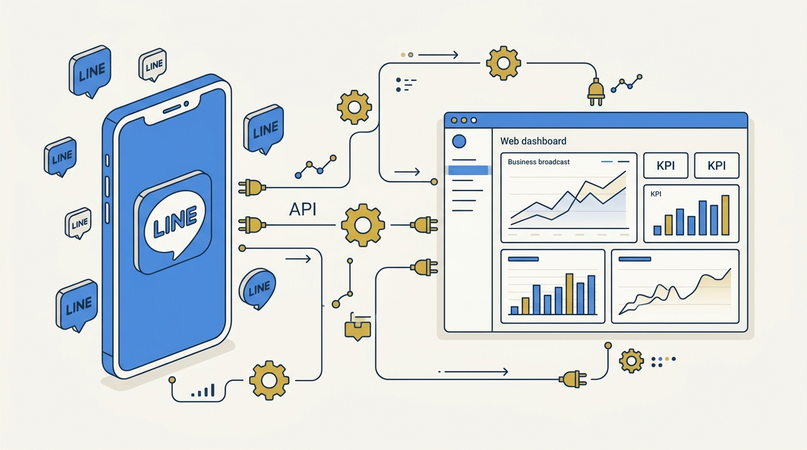
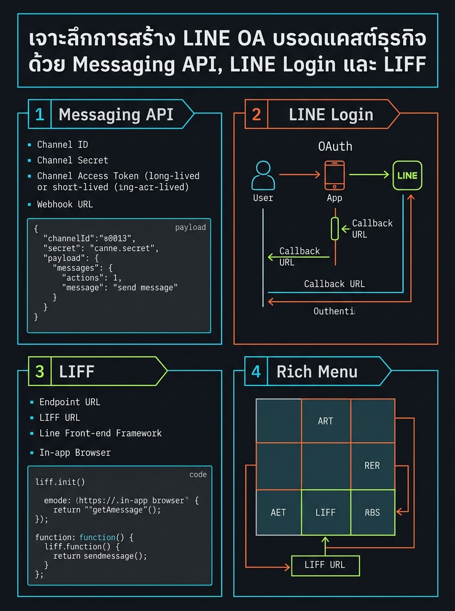
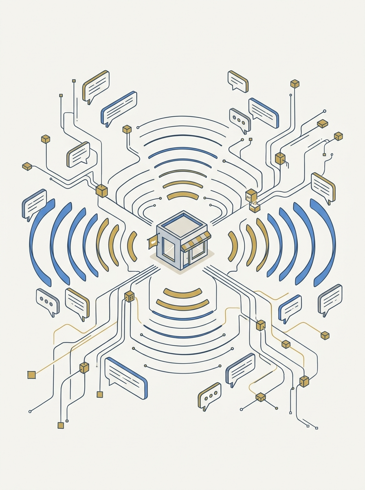

<!-- _class: title -->

# เจาะลึกการสร้าง LINE OA บรอดแคสต์ธุรกิจ ด้วย Messaging API, LINE Login และ LIFF

3 Channels + 1 Rich Menu: ทำให้ลูกค้ากดจากหน้าแชทเข้าเว็บ/แดชบอร์ดได้ในคลิกเดียว

<!-- Speaker: LINE OA เป็นช่องทางบรอดแคสต์ที่ engagement สูงที่สุดของธุรกิจไทย แต่ต้องต่อสายไฟเบื้องหลังให้ถูก — deck นี้ไล่ทีละ Channel -->

---

<!-- _class: cheatsheet -->
<!-- _backgroundColor: #f8f7f4 -->

<!-- Speaker: ภาพรวมทั้ง 4 องค์ประกอบในหน้าเดียว — ใช้ชี้จุดก่อนเข้ารายละเอียดทีละส่วน -->

---

## TL;DR: 3 Channel แยกกัน แต่ต้องต่อให้ครบวงจร

Messaging API ทำบอท/บรอดแคสต์ · LINE Login ยืนยันตัวตน · LIFF เปิดเว็บในแอป · Rich Menu คือทางลัด

<svg viewBox="0 0 1100 340" width="100%" xmlns="http://www.w3.org/2000/svg">
  <rect x="40" y="40" width="230" height="220" rx="14" fill="var(--paper)" stroke="var(--soft-2)" stroke-width="1.5" style="filter:drop-shadow(var(--shadow-sm))"/>
  <circle cx="155" cy="100" r="26" fill="var(--accent)" opacity=".12"/>
  <circle cx="155" cy="100" r="18" fill="var(--accent)"/>
  <text x="155" y="105" font-size="14" fill="var(--paper)" text-anchor="middle" font-family="system-ui" font-weight="700">API</text>
  <text x="155" y="150" font-size="14" font-weight="700" fill="var(--ink)" text-anchor="middle" font-family="system-ui">Messaging API</text>
  <text x="155" y="172" font-size="11" fill="var(--muted)" text-anchor="middle" font-family="system-ui">Channel ID / Secret</text>
  <text x="155" y="190" font-size="11" fill="var(--muted)" text-anchor="middle" font-family="system-ui">Access Token + Webhook</text>

  <rect x="300" y="40" width="230" height="220" rx="14" fill="var(--paper)" stroke="var(--soft-2)" stroke-width="1.5" style="filter:drop-shadow(var(--shadow-sm))"/>
  <circle cx="415" cy="100" r="26" fill="var(--gold)" opacity=".15"/>
  <circle cx="415" cy="100" r="18" fill="var(--gold)"/>
  <text x="415" y="105" font-size="12" fill="var(--paper)" text-anchor="middle" font-family="system-ui" font-weight="700">ID</text>
  <text x="415" y="150" font-size="14" font-weight="700" fill="var(--ink)" text-anchor="middle" font-family="system-ui">LINE Login</text>
  <text x="415" y="172" font-size="11" fill="var(--muted)" text-anchor="middle" font-family="system-ui">Callback URL</text>
  <text x="415" y="190" font-size="11" fill="var(--muted)" text-anchor="middle" font-family="system-ui">OAuth 2.0 + OpenID</text>

  <rect x="560" y="40" width="230" height="220" rx="14" fill="var(--paper)" stroke="var(--soft-2)" stroke-width="1.5" style="filter:drop-shadow(var(--shadow-sm))"/>
  <circle cx="675" cy="100" r="26" fill="var(--success)" opacity=".12"/>
  <circle cx="675" cy="100" r="18" fill="var(--success)"/>
  <text x="675" y="105" font-size="14" fill="var(--paper)" text-anchor="middle" font-family="system-ui" font-weight="700">JS</text>
  <text x="675" y="150" font-size="14" font-weight="700" fill="var(--ink)" text-anchor="middle" font-family="system-ui">LIFF</text>
  <text x="675" y="172" font-size="11" fill="var(--muted)" text-anchor="middle" font-family="system-ui">Endpoint URL</text>
  <text x="675" y="190" font-size="11" fill="var(--muted)" text-anchor="middle" font-family="system-ui">LIFF ID to LIFF URL</text>

  <path d="M 530 150 L 555 150" stroke="var(--muted)" stroke-width="2" marker-end="url(#arrLine)"/>
  <path d="M 270 150 L 295 150" stroke="var(--muted)" stroke-width="2" marker-end="url(#arrLine)"/>
  <defs>
    <marker id="arrLine" markerWidth="8" markerHeight="8" refX="6" refY="4" orient="auto">
      <path d="M0,0 L8,4 L0,8 z" fill="var(--muted)"/>
    </marker>
  </defs>

  <rect x="830" y="90" width="230" height="130" rx="14" fill="var(--accent)" opacity=".08" stroke="var(--accent)" stroke-width="2"/>
  <text x="945" y="140" font-size="15" font-weight="700" fill="var(--accent)" text-anchor="middle" font-family="system-ui">Rich Menu</text>
  <text x="945" y="164" font-size="11" fill="var(--ink-dim)" text-anchor="middle" font-family="system-ui">Link Action to LIFF URL</text>
  <text x="945" y="182" font-size="11" fill="var(--ink-dim)" text-anchor="middle" font-family="system-ui">1-tap from chat screen</text>
  <path d="M 790 155 L 825 155" stroke="var(--accent)" stroke-width="2.5" marker-end="url(#arrAccent)"/>
  <defs>
    <marker id="arrAccent" markerWidth="8" markerHeight="8" refX="6" refY="4" orient="auto">
      <path d="M0,0 L8,4 L0,8 z" fill="var(--accent)"/>
    </marker>
  </defs>
</svg>

<b>★ Takeaway:</b> ตั้ง 3 Channel แยกกันให้ถูก แล้วผูกปลายทางเข้า Rich Menu — ลูกค้าไม่ต้องรู้เลยว่าเบื้องหลังซับซ้อนแค่ไหน

<!-- Speaker: นี่คือภาพรวมทั้ง flow ก่อนแยกเจาะแต่ละ Channel -->

---

## ทำไมธุรกิจไทยต้องเชื่อม LINE OA ให้ถูกวิธี

LINE คือช่องทางที่ลูกค้าเปิดอยู่แล้วทุกวัน แต่ตั้งค่าผิด Channel เดียวก็พังทั้งระบบ

<svg viewBox="0 0 700 320" width="100%" xmlns="http://www.w3.org/2000/svg">
  <circle cx="140" cy="160" r="55" fill="var(--accent)" opacity=".1"/>
  <circle cx="140" cy="160" r="38" fill="var(--accent)"/>
  <text x="140" y="166" font-size="13" fill="var(--paper)" text-anchor="middle" font-family="system-ui" font-weight="700">OA</text>
  <path d="M 195 160 L 260 160" stroke="var(--muted)" stroke-width="2" stroke-dasharray="4,3"/>
  <path d="M 195 120 L 260 90" stroke="var(--muted)" stroke-width="1.5" stroke-dasharray="4,3"/>
  <path d="M 195 200 L 260 230" stroke="var(--muted)" stroke-width="1.5" stroke-dasharray="4,3"/>
  <circle cx="290" cy="160" r="20" fill="var(--soft)" stroke="var(--muted)" stroke-width="1.5"/>
  <circle cx="290" cy="80" r="16" fill="var(--soft)" stroke="var(--muted)" stroke-width="1.5"/>
  <circle cx="290" cy="240" r="16" fill="var(--soft)" stroke="var(--muted)" stroke-width="1.5"/>
  <text x="360" y="90" font-size="13" fill="var(--ink)" font-family="system-ui" font-weight="700">High engagement</text>
  <text x="360" y="108" font-size="11" fill="var(--muted)" font-family="system-ui">vs. email / SMS</text>
  <text x="360" y="168" font-size="13" fill="var(--ink)" font-family="system-ui" font-weight="700">1 wrong endpoint</text>
  <text x="360" y="186" font-size="11" fill="var(--muted)" font-family="system-ui">= invalid liff id / webhook fail</text>
  <text x="360" y="246" font-size="13" fill="var(--ink)" font-family="system-ui" font-weight="700">3 separate Channels</text>
  <text x="360" y="264" font-size="11" fill="var(--muted)" font-family="system-ui">Messaging API, Login, LIFF</text>
</svg>

<b>★ Takeaway:</b> LINE แยกฟีเจอร์เป็นคนละ Channel เสมอ — เข้าใจภาพรวมก่อนตั้งค่าลดเวลาแก้บั๊กได้มาก

<!-- Speaker: เกริ่นว่าทำไมต้องรู้ภาพรวมก่อนลงมือจริง -->

---

## Messaging API Channel: หัวใจของแชตบอตและบรอดแคสต์

สร้าง LINE OA → เปิดใช้งาน Messaging API → ได้ Channel พร้อมค่ายืนยันตัวตน 3 ตัว

<svg viewBox="0 0 1100 300" width="100%" xmlns="http://www.w3.org/2000/svg">
  <rect x="40" y="110" width="180" height="80" rx="10" fill="var(--paper)" stroke="var(--soft-2)" stroke-width="1.5"/>
  <text x="130" y="145" font-size="13" font-weight="700" fill="var(--ink)" text-anchor="middle" font-family="system-ui">Create LINE OA</text>
  <text x="130" y="165" font-size="11" fill="var(--muted)" text-anchor="middle" font-family="system-ui">Business ID + form</text>

  <path d="M 225 150 L 270 150" stroke="var(--muted)" stroke-width="2" marker-end="url(#a1)"/>
  <rect x="280" y="110" width="180" height="80" rx="10" fill="var(--paper)" stroke="var(--soft-2)" stroke-width="1.5"/>
  <text x="370" y="145" font-size="13" font-weight="700" fill="var(--ink)" text-anchor="middle" font-family="system-ui">Enable Messaging API</text>
  <text x="370" y="165" font-size="11" fill="var(--muted)" text-anchor="middle" font-family="system-ui">via OA Manager</text>

  <path d="M 465 150 L 510 150" stroke="var(--accent)" stroke-width="2.5" marker-end="url(a2)"/>
  <rect x="520" y="90" width="220" height="120" rx="10" fill="var(--accent)" opacity=".08" stroke="var(--accent)" stroke-width="2"/>
  <text x="630" y="118" font-size="13" font-weight="700" fill="var(--accent)" text-anchor="middle" font-family="system-ui">Channel Console</text>
  <text x="630" y="142" font-size="11" fill="var(--ink)" text-anchor="middle" font-family="system-ui">Channel ID + Secret</text>
  <text x="630" y="162" font-size="11" fill="var(--ink)" text-anchor="middle" font-family="system-ui">Long-lived Access Token</text>
  <text x="630" y="182" font-size="11" fill="var(--ink)" text-anchor="middle" font-family="system-ui">no expiry, 1 per Channel</text>

  <path d="M 745 150 L 790 150" stroke="var(--muted)" stroke-width="2" marker-end="url(#a1)"/>
  <rect x="800" y="90" width="260" height="120" rx="10" fill="var(--paper)" stroke="var(--soft-2)" stroke-width="1.5"/>
  <text x="930" y="118" font-size="13" font-weight="700" fill="var(--ink)" text-anchor="middle" font-family="system-ui">Webhook URL</text>
  <text x="930" y="142" font-size="11" fill="var(--muted)" text-anchor="middle" font-family="system-ui">HTTPS, trusted CA cert</text>
  <text x="930" y="162" font-size="11" fill="var(--muted)" text-anchor="middle" font-family="system-ui">Use webhook = ON</text>
  <text x="930" y="182" font-size="11" fill="var(--muted)" text-anchor="middle" font-family="system-ui">must pass Verify</text>

  <defs>
    <marker id="a1" markerWidth="8" markerHeight="8" refX="6" refY="4" orient="auto"><path d="M0,0 L8,4 L0,8 z" fill="var(--muted)"/></marker>
    <marker id="a2" markerWidth="8" markerHeight="8" refX="6" refY="4" orient="auto"><path d="M0,0 L8,4 L0,8 z" fill="var(--accent)"/></marker>
  </defs>
</svg>

<b>★ Takeaway:</b> ใช้ long-lived Access Token สำหรับบรอดแคสต์ทั่วไป — ไม่มีวันหมดอายุ ต่างจาก short-lived (30 วัน) และ stateless (15 นาที)

<!-- Speaker: เน้นว่า Webhook ต้อง HTTPS จาก CA จริงเท่านั้น self-signed ใช้ไม่ได้ -->

---

## LINE Login: ยืนยันตัวตนด้วยบัญชี LINE

Channel แยกจาก Messaging API — หัวใจคือ Callback URL รับ authorization code กลับมา

<svg viewBox="0 0 1100 300" width="100%" xmlns="http://www.w3.org/2000/svg">
  <circle cx="100" cy="150" r="34" fill="var(--soft)" stroke="var(--muted)" stroke-width="1.5"/>
  <text x="100" y="156" font-size="12" fill="var(--ink)" text-anchor="middle" font-family="system-ui" font-weight="700">User</text>

  <path d="M 138 150 L 190 150" stroke="var(--muted)" stroke-width="2" marker-end="url(#b1)"/>
  <rect x="200" y="105" width="230" height="90" rx="10" fill="var(--paper)" stroke="var(--soft-2)" stroke-width="1.5"/>
  <text x="315" y="140" font-size="13" font-weight="700" fill="var(--ink)" text-anchor="middle" font-family="system-ui">Authorize URL</text>
  <text x="315" y="162" font-size="11" fill="var(--muted)" text-anchor="middle" font-family="system-ui">client_id + redirect_uri</text>
  <text x="315" y="180" font-size="11" fill="var(--muted)" text-anchor="middle" font-family="system-ui">scope + state</text>

  <path d="M 435 150 L 480 150" stroke="var(--muted)" stroke-width="2" marker-end="url(#b1)"/>
  <rect x="490" y="105" width="200" height="90" rx="10" fill="var(--paper)" stroke="var(--soft-2)" stroke-width="1.5"/>
  <text x="590" y="140" font-size="13" font-weight="700" fill="var(--ink)" text-anchor="middle" font-family="system-ui">LINE Platform</text>
  <text x="590" y="162" font-size="11" fill="var(--muted)" text-anchor="middle" font-family="system-ui">OAuth 2.0 auth code</text>
  <text x="590" y="180" font-size="11" fill="var(--muted)" text-anchor="middle" font-family="system-ui">grant + OpenID Connect</text>

  <path d="M 700 150 L 745 150" stroke="var(--accent)" stroke-width="2.5" marker-end="url(#b2)"/>
  <rect x="755" y="90" width="300" height="120" rx="10" fill="var(--accent)" opacity=".08" stroke="var(--accent)" stroke-width="2"/>
  <text x="905" y="120" font-size="13" font-weight="700" fill="var(--accent)" text-anchor="middle" font-family="system-ui">Callback URL</text>
  <text x="905" y="144" font-size="11" fill="var(--ink)" text-anchor="middle" font-family="system-ui">receives code + state</text>
  <text x="905" y="164" font-size="11" fill="var(--ink)" text-anchor="middle" font-family="system-ui">multiple URLs per Channel</text>
  <text x="905" y="184" font-size="11" fill="var(--ink)" text-anchor="middle" font-family="system-ui">app exchanges for token</text>

  <defs>
    <marker id="b1" markerWidth="8" markerHeight="8" refX="6" refY="4" orient="auto"><path d="M0,0 L8,4 L0,8 z" fill="var(--muted)"/></marker>
    <marker id="b2" markerWidth="8" markerHeight="8" refX="6" refY="4" orient="auto"><path d="M0,0 L8,4 L0,8 z" fill="var(--accent)"/></marker>
  </defs>
</svg>

<b>★ Takeaway:</b> Callback URL รองรับได้หลาย URL ต่อ Channel — เพิ่มทีละบรรทัดสำหรับหลาย environment ได้เลย

<!-- Speaker: อธิบาย OAuth flow แบบย่อ ไม่ต้องลงรายละเอียด token exchange -->

---

## LIFF: เปิดเว็บแอปในแอป LINE โดยไม่ต้องล็อกอินซ้ำ

สร้างภายใต้ LINE Login Channel — Endpoint URL ต้องตรง path deploy จริงเป๊ะ

<svg viewBox="0 0 1100 300" width="100%" xmlns="http://www.w3.org/2000/svg">
  <rect x="60" y="30" width="220" height="240" rx="12" fill="var(--soft)" stroke="var(--muted)" stroke-width="1.5" stroke-dasharray="4,3"/>
  <text x="170" y="60" font-size="12" font-weight="700" fill="var(--ink-dim)" text-anchor="middle" font-family="system-ui">LINE Login Channel</text>
  <rect x="90" y="90" width="160" height="70" rx="8" fill="var(--paper)" stroke="var(--soft-2)" stroke-width="1.5"/>
  <text x="170" y="120" font-size="12" font-weight="700" fill="var(--ink)" text-anchor="middle" font-family="system-ui">LIFF App</text>
  <text x="170" y="140" font-size="10" fill="var(--muted)" text-anchor="middle" font-family="system-ui">scope: openid, profile</text>

  <path d="M 260 125 L 305 125" stroke="var(--muted)" stroke-width="2" marker-end="url(#c1)"/>
  <rect x="315" y="90" width="220" height="70" rx="8" fill="var(--paper)" stroke="var(--soft-2)" stroke-width="1.5"/>
  <text x="425" y="115" font-size="12" font-weight="700" fill="var(--ink)" text-anchor="middle" font-family="system-ui">LIFF ID</text>
  <text x="425" y="135" font-size="10" fill="var(--muted)" text-anchor="middle" font-family="system-ui">issued after scope set</text>

  <path d="M 540 125 L 585 125" stroke="var(--accent)" stroke-width="2.5" marker-end="url(#c2)"/>
  <rect x="595" y="80" width="270" height="90" rx="10" fill="var(--accent)" opacity=".08" stroke="var(--accent)" stroke-width="2"/>
  <text x="730" y="110" font-size="13" font-weight="700" fill="var(--accent)" text-anchor="middle" font-family="system-ui">LIFF URL</text>
  <text x="730" y="132" font-size="10.5" fill="var(--ink)" text-anchor="middle" font-family="system-ui">liff.line.me/{LIFF_ID}</text>
  <text x="730" y="150" font-size="10" fill="var(--muted)" text-anchor="middle" font-family="system-ui">distributed to users</text>

  <path d="M 170 160 L 170 205" stroke="var(--muted)" stroke-width="2" marker-end="url(#c1)"/>
  <rect x="90" y="215" width="160" height="55" rx="8" fill="var(--paper)" stroke="var(--soft-2)" stroke-width="1.5"/>
  <text x="170" y="240" font-size="12" font-weight="700" fill="var(--ink)" text-anchor="middle" font-family="system-ui">Endpoint URL</text>
  <text x="170" y="258" font-size="10" fill="var(--muted)" text-anchor="middle" font-family="system-ui">must match path exactly</text>

  <rect x="880" y="60" width="180" height="150" rx="10" fill="var(--paper)" stroke="var(--soft-2)" stroke-width="1.5"/>
  <text x="970" y="90" font-size="12" font-weight="700" fill="var(--ink)" text-anchor="middle" font-family="system-ui">LIFF Browser</text>
  <text x="970" y="115" font-size="10" fill="var(--muted)" text-anchor="middle" font-family="system-ui">WKWebView (iOS)</text>
  <text x="970" y="133" font-size="10" fill="var(--muted)" text-anchor="middle" font-family="system-ui">Android WebView</text>
  <text x="970" y="155" font-size="10" fill="var(--muted)" text-anchor="middle" font-family="system-ui">no re-login needed</text>
  <text x="970" y="175" font-size="10" fill="var(--muted)" text-anchor="middle" font-family="system-ui">gets user ID directly</text>
  <path d="M 865 130 L 875 130" stroke="var(--muted)" stroke-width="2" marker-end="url(#c1)"/>

  <defs>
    <marker id="c1" markerWidth="8" markerHeight="8" refX="6" refY="4" orient="auto"><path d="M0,0 L8,4 L0,8 z" fill="var(--muted)"/></marker>
    <marker id="c2" markerWidth="8" markerHeight="8" refX="6" refY="4" orient="auto"><path d="M0,0 L8,4 L0,8 z" fill="var(--accent)"/></marker>
  </defs>
</svg>

<b>★ Takeaway:</b> แยก LIFF App หลายตัวตามฟังก์ชัน (จองคิว / สมาชิก) เพื่อจัดการ scope และ endpoint ไม่ให้ปนกัน

<!-- Speaker: เน้นว่า endpoint ผิด path นิดเดียว = invalid liff id -->

---

## Rich Menu: ทางลัดจากหน้าแชตสู่เว็บแอป

สร้างได้ 2 เครื่องมือ — เลือกตามระดับการปรับแต่งที่ต้องการ

<svg viewBox="0 0 1100 380" width="100%" xmlns="http://www.w3.org/2000/svg">
  <rect x="40" y="20" width="490" height="300" rx="12" fill="var(--paper)" stroke="var(--soft-2)" stroke-width="1.5" style="filter:drop-shadow(var(--shadow-sm))"/>
  <rect x="40" y="20" width="490" height="50" rx="12" fill="var(--soft)" opacity=".8"/>
  <text x="285" y="52" font-size="15" font-weight="700" fill="var(--ink-dim)" text-anchor="middle" font-family="system-ui">Official Account Manager</text>
  <text x="80" y="100" font-size="13" fill="var(--ink)" font-family="system-ui">Fast setup, GUI templates</text>
  <text x="80" y="130" font-size="13" fill="var(--ink-dim)" font-family="system-ui">Display period supported</text>
  <text x="80" y="160" font-size="13" fill="var(--muted)" font-family="system-ui">Impression / click stats</text>
  <text x="80" y="200" font-size="12" fill="var(--muted)" font-family="system-ui">Best for: simple static menus</text>

  <circle cx="550" cy="170" r="30" fill="var(--ink)"/>
  <text x="550" y="176" font-size="13" font-weight="700" fill="var(--paper)" text-anchor="middle" font-family="system-ui">VS</text>

  <rect x="570" y="20" width="490" height="300" rx="12" fill="var(--paper)" stroke="var(--accent)" stroke-width="2" style="filter:drop-shadow(var(--shadow-md))"/>
  <rect x="570" y="20" width="490" height="50" rx="12" fill="var(--accent)" opacity=".08"/>
  <text x="815" y="52" font-size="15" font-weight="700" fill="var(--accent)" text-anchor="middle" font-family="system-ui">Messaging API</text>
  <text x="610" y="100" font-size="13" fill="var(--ink)" font-family="system-ui">postback + datetime-picker action</text>
  <text x="610" y="130" font-size="13" fill="var(--ink)" font-family="system-ui">switch tabs on rich menus</text>
  <text x="610" y="160" font-size="13" fill="var(--ink)" font-family="system-ui">per-user rich menu targeting</text>
  <text x="610" y="200" font-size="12" fill="var(--accent)" font-family="system-ui" font-weight="700">Best for: Link action to LIFF URL</text>
</svg>

<b>★ Takeaway:</b> Action ปุ่ม = "Link" ไปยัง LIFF URL — กดปุ่มบน Rich Menu เปิด LIFF browser ตรงเข้า Endpoint URL ทันที ไม่ออกไป external browser

<!-- Speaker: ย้ำว่า Rich Menu สร้างจากเครื่องมือใดต้องแก้จากเครื่องมือเดิมเท่านั้น -->

---

## User Guide: 6 ขั้นตอนเชื่อม LINE OA เข้าระบบจริง

ตั้งค่าตามลำดับ — แต่ละขั้นต่อยอดจากขั้นก่อนหน้า

<svg viewBox="0 0 1100 300" width="100%" xmlns="http://www.w3.org/2000/svg">
  <circle cx="90" cy="150" r="26" fill="var(--accent)"/>
  <text x="90" y="156" font-size="14" fill="var(--paper)" text-anchor="middle" font-family="system-ui" font-weight="700">1</text>
  <text x="90" y="200" font-size="11" fill="var(--ink)" text-anchor="middle" font-family="system-ui">Create OA +</text>
  <text x="90" y="215" font-size="11" fill="var(--ink)" text-anchor="middle" font-family="system-ui">enable API</text>

  <path d="M 122 150 L 220 150" stroke="var(--muted)" stroke-width="2" marker-end="url(#d1)"/>
  <circle cx="255" cy="150" r="26" fill="var(--accent)"/>
  <text x="255" y="156" font-size="14" fill="var(--paper)" text-anchor="middle" font-family="system-ui" font-weight="700">2</text>
  <text x="255" y="200" font-size="11" fill="var(--ink)" text-anchor="middle" font-family="system-ui">Setup</text>
  <text x="255" y="215" font-size="11" fill="var(--ink)" text-anchor="middle" font-family="system-ui">Webhook</text>

  <path d="M 287 150 L 385 150" stroke="var(--muted)" stroke-width="2" marker-end="url(#d1)"/>
  <circle cx="420" cy="150" r="26" fill="var(--accent)"/>
  <text x="420" y="156" font-size="14" fill="var(--paper)" text-anchor="middle" font-family="system-ui" font-weight="700">3</text>
  <text x="420" y="200" font-size="11" fill="var(--ink)" text-anchor="middle" font-family="system-ui">LINE Login +</text>
  <text x="420" y="215" font-size="11" fill="var(--ink)" text-anchor="middle" font-family="system-ui">Callback URL</text>

  <path d="M 452 150 L 550 150" stroke="var(--muted)" stroke-width="2" marker-end="url(#d1)"/>
  <circle cx="585" cy="150" r="26" fill="var(--gold)"/>
  <text x="585" y="156" font-size="14" fill="var(--paper)" text-anchor="middle" font-family="system-ui" font-weight="700">4</text>
  <text x="585" y="200" font-size="11" fill="var(--ink)" text-anchor="middle" font-family="system-ui">LIFF App +</text>
  <text x="585" y="215" font-size="11" fill="var(--ink)" text-anchor="middle" font-family="system-ui">Endpoint URL</text>

  <path d="M 617 150 L 715 150" stroke="var(--muted)" stroke-width="2" marker-end="url(#d1)"/>
  <circle cx="750" cy="150" r="26" fill="var(--gold)"/>
  <text x="750" y="156" font-size="14" fill="var(--paper)" text-anchor="middle" font-family="system-ui" font-weight="700">5</text>
  <text x="750" y="200" font-size="11" fill="var(--ink)" text-anchor="middle" font-family="system-ui">Link LIFF URL</text>
  <text x="750" y="215" font-size="11" fill="var(--ink)" text-anchor="middle" font-family="system-ui">to Rich Menu</text>

  <path d="M 782 150 L 880 150" stroke="var(--success)" stroke-width="2.5" marker-end="url(#d2)"/>
  <circle cx="915" cy="150" r="26" fill="var(--success)"/>
  <text x="915" y="156" font-size="14" fill="var(--paper)" text-anchor="middle" font-family="system-ui" font-weight="700">6</text>
  <text x="915" y="200" font-size="11" fill="var(--ink)" text-anchor="middle" font-family="system-ui">End-to-end</text>
  <text x="915" y="215" font-size="11" fill="var(--ink)" text-anchor="middle" font-family="system-ui">test</text>

  <defs>
    <marker id="d1" markerWidth="8" markerHeight="8" refX="6" refY="4" orient="auto"><path d="M0,0 L8,4 L0,8 z" fill="var(--muted)"/></marker>
    <marker id="d2" markerWidth="8" markerHeight="8" refX="6" refY="4" orient="auto"><path d="M0,0 L8,4 L0,8 z" fill="var(--success)"/></marker>
  </defs>
</svg>

<b>★ Takeaway:</b> ทดสอบจากมือถือใน LINE จริงเสมอ — จำลองบน browser ธรรมดาไม่เห็นพฤติกรรม LIFF browser จริง

<!-- Speaker: ไล่ทีละขั้นตามลำดับ เน้นว่าขั้น 4-5 คือจุดที่คนพลาดบ่อยที่สุด -->

---

## Troubleshooting: 3 ปัญหาที่เจอบ่อยที่สุด

ทุกปัญหามีสาเหตุเดียวกัน: ค่า config ไม่ตรงกันระหว่าง Channel

  

    
Error

    <h3>invalid liff id</h3>
    
LIFF ID ไม่ตรงกับ LIFF App ที่ตั้ง endpoint จริง หรือใช้ข้าม Channel — แก้ env แล้วต้อง redeploy

  

  

    
Error

    <h3>Webhook verify ล้มเหลว</h3>
    
certificate ไม่ใช่จาก CA ที่เชื่อถือได้ หรือลืมเปิด "Use webhook" หลังกรอก URL

  

  

    
Error

    <h3>ปุ่ม Rich Menu ไม่เปิดเว็บ</h3>
    
Action type ต้องเป็น "Link" ไปยัง liff.line.me/{ID} ไม่ใช่ URL เว็บตรงๆ

  

<b>★ Takeaway:</b> ก่อน debug ลึก เช็ก config 3 จุดนี้ก่อนเสมอ — ประหยัดเวลาได้มากที่สุด

<!-- Speaker: นี่คือ 3 อันดับปัญหาที่ผู้ใช้จริงเจอบ่อยที่สุดจากคู่มือปฏิบัติ -->

---

## Caveats / Limits: สิ่งที่ต้องรู้ก่อนตัดสินใจ

ข้อจำกัดเชิงโครงสร้างที่แก้ทีหลังไม่ได้ หรือแก้ยาก

  

    
ผูกถาวร

    <h3>Provider เปลี่ยนไม่ได้</h3>
    
เมื่อกำหนด Provider ให้ OA แล้ว เปลี่ยน/ยกเลิกภายหลังไม่ได้เลย

  

  

    
ข้อจำกัดเครื่องมือ

    <h3>Rich Menu ทีละเครื่องมือ</h3>
    
สร้างผ่าน Manager แล้วแก้ผ่าน Messaging API ไม่ได้ (และกลับกัน)

  

  

    
LIFF Browser

    <h3>ไม่รองรับ OpenChat</h3>
    
ดึงโปรไฟล์ผู้ใช้ใน OpenChat ส่วนใหญ่ทำไม่ได้ + cache ควบคุมผ่าน header เท่านั้น

  

<b>★ Takeaway:</b> Channel Access Token และ Channel Secret ห้าม commit เข้า public repo เด็ดขาด — หลุดแล้ว revoke ทันที

<!-- Speaker: เน้นความปลอดภัยของ token/secret ปิดท้ายก่อนเข้า takeaways -->

---

## Key Takeaways

สรุปสิ่งที่ต้องจำแม้ข้ามเนื้อหาส่วนอื่นไป

<svg viewBox="0 0 1100 340" width="100%" xmlns="http://www.w3.org/2000/svg">
  <circle cx="550" cy="170" r="160" fill="none" stroke="var(--soft-2)" stroke-width="1.5"/>
  <circle cx="550" cy="170" r="110" fill="none" stroke="var(--accent)" stroke-width="1.5" opacity=".4"/>
  <circle cx="550" cy="170" r="60" fill="var(--accent)" opacity=".1"/>
  <circle cx="550" cy="170" r="60" fill="none" stroke="var(--accent)" stroke-width="2"/>
  <text x="550" y="164" font-size="14" font-weight="700" fill="var(--accent)" text-anchor="middle" font-family="system-ui">3 Channels</text>
  <text x="550" y="184" font-size="12" fill="var(--ink)" text-anchor="middle" font-family="system-ui">1 Rich Menu</text>
  <text x="380" y="95" font-size="12" fill="var(--ink)" font-family="system-ui" text-anchor="middle">Long-lived</text>
  <text x="380" y="113" font-size="11" fill="var(--muted)" font-family="system-ui" text-anchor="middle">Access Token</text>
  <text x="730" y="95" font-size="12" fill="var(--ink)" font-family="system-ui" text-anchor="middle">Endpoint URL</text>
  <text x="730" y="113" font-size="11" fill="var(--muted)" font-family="system-ui" text-anchor="middle">must match exactly</text>
  <text x="210" y="170" font-size="12" fill="var(--muted)" font-family="system-ui" text-anchor="middle">Provider</text>
  <text x="210" y="188" font-size="11" fill="var(--muted)" font-family="system-ui" text-anchor="middle">locked forever</text>
  <text x="890" y="170" font-size="12" fill="var(--muted)" font-family="system-ui" text-anchor="middle">Test on</text>
  <text x="890" y="188" font-size="11" fill="var(--muted)" font-family="system-ui" text-anchor="middle">real LINE app</text>
</svg>

<b>★ Takeaway:</b> Rich Menu ผูกกับ LIFF URL คือจุดเชื่อมสุดท้ายที่ทำให้ลูกค้ากดจากหน้าแชทเข้าเว็บ/แดชบอร์ดได้ในคลิกเดียว โดยไม่ต้องล็อกอินซ้ำ

