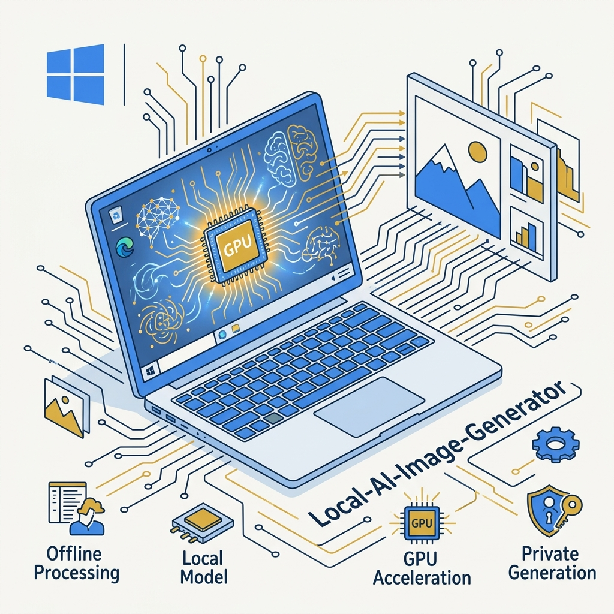
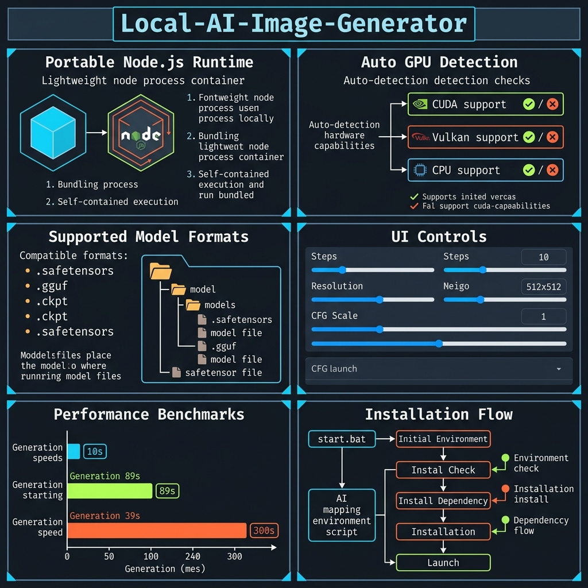
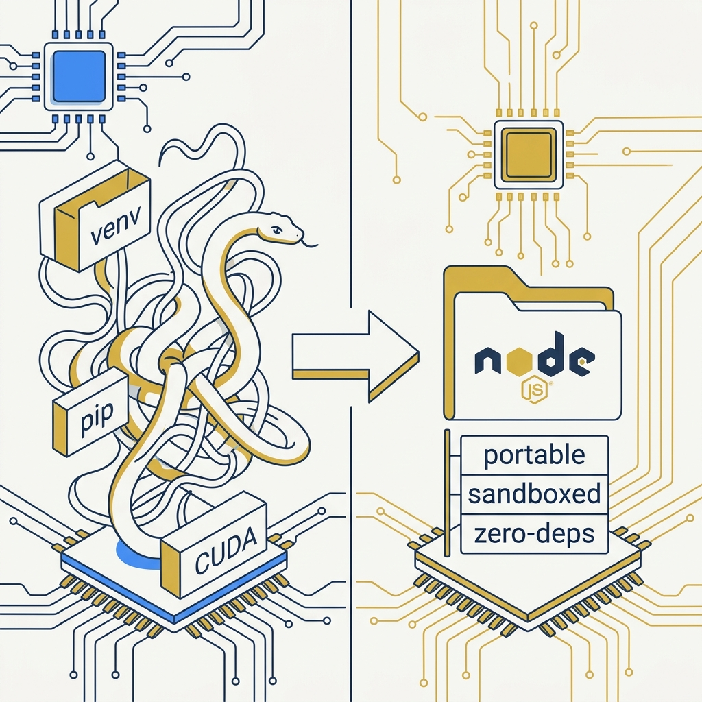

<!-- _class: title -->

# Local-AI-Image-Generator

รัน Stable Diffusion ฟรี 100% Offline บน PC — ไม่ต้องอินเทอร์เน็ต ไม่มี filter

<!-- Speaker: โปรเจกต์ MIT บน GitHub ที่ทำให้ทุกคนรัน Stable Diffusion ได้โดยไม่ต้อง setup Python -->

---

<!-- _class: cheatsheet -->
<!-- _backgroundColor: #f8f7f4 -->

<!-- Speaker: ภาพรวมทุกอย่างในหน้าเดียว — Portable Node.js, GPU backends, model formats, UI controls, performance benchmarks, install flow -->

---

## start.bat คือทุกอย่าง: Zero Setup สู่ Web UI ใน 1 คลิก

ไม่มี Python, ไม่มี venv, ไม่มี CUDA toolkit — แค่ double-click แล้วเปิด browser

<svg viewBox="0 0 1100 300" width="100%" xmlns="http://www.w3.org/2000/svg">
  <!-- arrow-flow: start.bat → Node.js DL → GPU detect → Web UI -->
  <!-- Step boxes -->
  <rect x="30" y="100" width="180" height="100" rx="10" fill="var(--accent)" />
  <text x="120" y="143" font-size="22" font-weight="700" fill="white" text-anchor="middle" font-family="system-ui">start.bat</text>
  <text x="120" y="168" font-size="13" fill="rgba(255,255,255,.8)" text-anchor="middle" font-family="system-ui">Double-click</text>
  <!-- Arrow 1 -->
  <path d="M210 150 L260 150" stroke="var(--muted)" stroke-width="2" marker-end="url(#arr)"/>
  <defs><marker id="arr" markerWidth="8" markerHeight="8" refX="6" refY="4" orient="auto"><path d="M0,0 L8,4 L0,8 Z" fill="var(--muted)"/></marker></defs>
  <rect x="260" y="100" width="200" height="100" rx="10" fill="var(--paper)" stroke="var(--accent)" stroke-width="2"/>
  <text x="360" y="138" font-size="14" font-weight="700" fill="var(--ink)" text-anchor="middle" font-family="system-ui">Download</text>
  <text x="360" y="158" font-size="14" font-weight="700" fill="var(--accent)" text-anchor="middle" font-family="system-ui">Node.js</text>
  <text x="360" y="180" font-size="12" fill="var(--muted)" text-anchor="middle" font-family="system-ui">Sandboxed in folder</text>
  <!-- Arrow 2 -->
  <path d="M460 150 L510 150" stroke="var(--muted)" stroke-width="2" marker-end="url(#arr)"/>
  <rect x="510" y="100" width="200" height="100" rx="10" fill="var(--paper)" stroke="var(--accent)" stroke-width="2"/>
  <text x="610" y="138" font-size="14" font-weight="700" fill="var(--ink)" text-anchor="middle" font-family="system-ui">Detect GPU</text>
  <text x="610" y="158" font-size="13" fill="var(--accent)" text-anchor="middle" font-family="system-ui">CUDA / Vulkan / CPU</text>
  <text x="610" y="178" font-size="12" fill="var(--muted)" text-anchor="middle" font-family="system-ui">Auto backend download</text>
  <!-- Arrow 3 -->
  <path d="M710 150 L760 150" stroke="var(--muted)" stroke-width="2" marker-end="url(#arr)"/>
  <rect x="760" y="100" width="200" height="100" rx="10" fill="var(--success)" />
  <text x="860" y="138" font-size="14" font-weight="700" fill="white" text-anchor="middle" font-family="system-ui">Web UI</text>
  <text x="860" y="160" font-size="13" fill="rgba(255,255,255,.85)" text-anchor="middle" font-family="system-ui">localhost:1420</text>
  <text x="860" y="180" font-size="12" fill="rgba(255,255,255,.7)" text-anchor="middle" font-family="system-ui">Browser opens auto</text>
  <!-- Step labels -->
  <text x="120" y="88" font-size="11" fill="var(--muted)" text-anchor="middle" font-family="system-ui" letter-spacing=".08em">STEP 1</text>
  <text x="360" y="88" font-size="11" fill="var(--muted)" text-anchor="middle" font-family="system-ui" letter-spacing=".08em">STEP 2</text>
  <text x="610" y="88" font-size="11" fill="var(--muted)" text-anchor="middle" font-family="system-ui" letter-spacing=".08em">STEP 3</text>
  <text x="860" y="88" font-size="11" fill="var(--muted)" text-anchor="middle" font-family="system-ui" letter-spacing=".08em">DONE</text>
  <!-- Note below -->
  <text x="550" y="240" font-size="13" fill="var(--ink-dim)" text-anchor="middle" font-family="system-ui">First run: downloads binaries (internet needed once). Subsequent runs: fully offline.</text>
  <rect width="1" height="1" x="0" y="0" fill="none"/>
</svg>

<b>★ Takeaway:</b> One BAT file handles everything — no manual dependency management ever needed.

<!-- Speaker: ครั้งแรกต้องการ internet เพื่อ download binaries แต่หลังจากนั้น 100% offline -->

---

## Node.js แทน Python: ทำไมถึงง่ายกว่าเดิม

AUTOMATIC1111 และ ComfyUI ต้องการ Python + venv + CUDA toolkit — Local-AI-Image-Generator ไม่ต้องทั้งหมดนั้น

<svg viewBox="0 0 700 300" width="100%" xmlns="http://www.w3.org/2000/svg">
  <!-- comparison: old way vs new way -->
  <rect x="20" y="20" width="300" height="260" rx="10" fill="var(--danger-wash)" stroke="var(--danger)" stroke-width="1.5"/>
  <text x="170" y="50" font-size="15" font-weight="700" fill="var(--danger-ink)" text-anchor="middle" font-family="system-ui">Old Way (Python)</text>
  <text x="40" y="85" font-size="13" fill="var(--danger-ink)" font-family="system-ui">• Python 3.10+ install</text>
  <text x="40" y="110" font-size="13" fill="var(--danger-ink)" font-family="system-ui">• venv creation</text>
  <text x="40" y="135" font-size="13" fill="var(--danger-ink)" font-family="system-ui">• pip install requirements</text>
  <text x="40" y="160" font-size="13" fill="var(--danger-ink)" font-family="system-ui">• CUDA toolkit version match</text>
  <text x="40" y="185" font-size="13" fill="var(--danger-ink)" font-family="system-ui">• PATH conflicts possible</text>
  <text x="40" y="210" font-size="13" fill="var(--danger-ink)" font-family="system-ui">• System-wide changes</text>
  <text x="40" y="255" font-size="12" fill="var(--danger)" font-family="system-ui">6+ manual steps, breakable</text>
  <rect x="380" y="20" width="300" height="260" rx="10" fill="var(--success-wash)" stroke="var(--success)" stroke-width="2"/>
  <text x="530" y="50" font-size="15" font-weight="700" fill="var(--success-ink)" text-anchor="middle" font-family="system-ui">New Way (Node.js)</text>
  <text x="400" y="85" font-size="13" fill="var(--success-ink)" font-family="system-ui">• Double-click start.bat</text>
  <text x="400" y="110" font-size="13" fill="var(--success-ink)" font-family="system-ui">• Node.js auto-sandboxed</text>
  <text x="400" y="135" font-size="13" fill="var(--success-ink)" font-family="system-ui">• GPU auto-detected</text>
  <text x="400" y="160" font-size="13" fill="var(--success-ink)" font-family="system-ui">• Binaries in folder only</text>
  <text x="400" y="185" font-size="13" fill="var(--success-ink)" font-family="system-ui">• Zero system changes</text>
  <text x="400" y="210" font-size="13" fill="var(--success-ink)" font-family="system-ui">• Delete = full uninstall</text>
  <text x="400" y="255" font-size="12" fill="var(--success)" font-family="system-ui">1 step, self-contained</text>
  <rect width="1" height="1" x="0" y="0" fill="none"/>
</svg>

<b>★ Takeaway:</b> Portable sandbox means zero system footprint — uninstall by deleting the folder.

<!-- Speaker: Node.js stack ไม่ compatible กับ A1111 extensions แต่ก็ไม่ต้องการมัน -->

---

## 3 Hardware Tiers: CUDA, Vulkan, CPU — รองรับทุกเครื่อง

Auto-detection เลือก backend ที่เหมาะสมให้อัตโนมัติ — ผู้ใช้ AMD/Intel ได้รับ Vulkan ไม่ใช่ CPU

<svg viewBox="0 0 1100 340" width="100%" xmlns="http://www.w3.org/2000/svg">
  <!-- 3 tier comparison cards -->
  <!-- CUDA card -->
  <rect x="30" y="30" width="310" height="280" rx="12" fill="var(--paper)" stroke="var(--accent)" stroke-width="2.5" style="filter:drop-shadow(0 4px 12px rgba(15,23,42,.1))"/>
  <rect x="30" y="30" width="310" height="56" rx="12" fill="var(--accent)"/>
  <text x="185" y="55" font-size="16" font-weight="700" fill="white" text-anchor="middle" font-family="system-ui">Nvidia (CUDA)</text>
  <text x="185" y="73" font-size="12" fill="rgba(255,255,255,.8)" text-anchor="middle" font-family="system-ui">RTX / GTX Series</text>
  <text x="185" y="120" font-size="42" font-weight="800" fill="var(--accent)" text-anchor="middle" font-family="system-ui">~10s</text>
  <text x="185" y="148" font-size="13" fill="var(--muted)" text-anchor="middle" font-family="system-ui">20 steps / 512x512</text>
  <rect x="60" y="168" width="250" height="1" fill="var(--soft-2)"/>
  <text x="185" y="195" font-size="13" fill="var(--ink)" text-anchor="middle" font-family="system-ui">Best performance</text>
  <text x="185" y="218" font-size="13" fill="var(--ink-dim)" text-anchor="middle" font-family="system-ui">Recommended: 4GB+ VRAM</text>
  <text x="185" y="241" font-size="13" fill="var(--ink-dim)" text-anchor="middle" font-family="system-ui">RTX optimized path</text>
  <!-- Vulkan card -->
  <rect x="395" y="30" width="310" height="280" rx="12" fill="var(--paper)" stroke="var(--gold)" stroke-width="2" style="filter:drop-shadow(0 4px 12px rgba(15,23,42,.08))"/>
  <rect x="395" y="30" width="310" height="56" rx="12" fill="var(--gold)"/>
  <text x="550" y="55" font-size="16" font-weight="700" fill="white" text-anchor="middle" font-family="system-ui">AMD / Intel (Vulkan)</text>
  <text x="550" y="73" font-size="12" fill="rgba(255,255,255,.85)" text-anchor="middle" font-family="system-ui">Radeon / Intel Arc</text>
  <text x="550" y="120" font-size="42" font-weight="800" fill="var(--gold)" text-anchor="middle" font-family="system-ui">~89s</text>
  <text x="550" y="148" font-size="13" fill="var(--muted)" text-anchor="middle" font-family="system-ui">20 steps / 512x512</text>
  <rect x="425" y="168" width="250" height="1" fill="var(--soft-2)"/>
  <text x="550" y="195" font-size="13" fill="var(--ink)" text-anchor="middle" font-family="system-ui">Good for non-Nvidia</text>
  <text x="550" y="218" font-size="13" fill="var(--ink-dim)" text-anchor="middle" font-family="system-ui">May use system RAM</text>
  <text x="550" y="241" font-size="13" fill="var(--ink-dim)" text-anchor="middle" font-family="system-ui">Key differentiator feature</text>
  <!-- CPU card -->
  <rect x="760" y="30" width="310" height="280" rx="12" fill="var(--paper)" stroke="var(--soft-2)" stroke-width="1.5" style="filter:drop-shadow(var(--shadow-sm))"/>
  <rect x="760" y="30" width="310" height="56" rx="12" fill="var(--soft)"/>
  <text x="915" y="55" font-size="16" font-weight="700" fill="var(--ink-dim)" text-anchor="middle" font-family="system-ui">CPU (Fallback)</text>
  <text x="915" y="73" font-size="12" fill="var(--muted)" text-anchor="middle" font-family="system-ui">Any processor</text>
  <text x="915" y="120" font-size="42" font-weight="800" fill="var(--muted)" text-anchor="middle" font-family="system-ui">300s+</text>
  <text x="915" y="148" font-size="13" fill="var(--muted)" text-anchor="middle" font-family="system-ui">20 steps / 512x512</text>
  <rect x="790" y="168" width="250" height="1" fill="var(--soft-2)"/>
  <text x="915" y="195" font-size="13" fill="var(--ink-dim)" text-anchor="middle" font-family="system-ui">Works, but slow</text>
  <text x="915" y="218" font-size="13" fill="var(--muted)" text-anchor="middle" font-family="system-ui">Not for daily workflow</text>
  <text x="915" y="241" font-size="13" fill="var(--muted)" text-anchor="middle" font-family="system-ui">Last-resort option</text>
  <rect width="1" height="1" x="0" y="0" fill="none"/>
</svg>

<b>★ Takeaway:</b> Vulkan backend is the key win for AMD/Intel users — previously underserved by Stable Diffusion ecosystem.

<!-- Speaker: CUDA ยังเร็วที่สุด แต่ Vulkan เป็น breakthrough สำคัญสำหรับผู้ใช้ที่ไม่มี Nvidia -->

---

## Model Formats: 3 รูปแบบที่รองรับ เลือกตาม Hardware

รองรับ .safetensors, .gguf, .ckpt — แต่ละ format มีจุดเด่นต่างกัน

  

    
Recommended

    <h3>.safetensors</h3>
    
Format มาตรฐานปัจจุบัน ปลอดภัยกว่า .ckpt เพราะไม่สามารถ execute arbitrary code ได้

    
ใช้กับโมเดลใหม่ทุกตัวบน Civitai / Hugging Face

  

  

    
Quantized

    <h3>.gguf</h3>
    
Format quantized ใช้ RAM/VRAM น้อยกว่า — เหมาะกับเครื่องที่มี VRAM จำกัด

    
Trade-off: quality ต่ำกว่าเล็กน้อย แต่รันได้บน hardware mid-range

  

  

    
Legacy

    <h3>.ckpt</h3>
    
Format เก่า ยังรองรับสำหรับโมเดล legacy ที่ยังไม่ได้ convert

    
หลีกเลี่ยงถ้าเป็นไปได้ — มีความเสี่ยงด้านความปลอดภัยถ้าดาวน์โหลดจากแหล่งไม่น่าเชื่อถือ

  

<b>★ Takeaway:</b> Always prefer .safetensors — safer, standard, and supported by all modern models.

<!-- Speaker: .gguf เป็น option ที่ดีสำหรับเครื่อง VRAM 4GB หรือน้อยกว่า -->

---

## UI Controls: 3 พารามิเตอร์หลักที่ต้องเข้าใจ

Steps × CFG Scale × Resolution — เป็น triangle ที่กระทบกัน: quality, speed, VRAM

<svg viewBox="0 0 1100 320" width="100%" xmlns="http://www.w3.org/2000/svg">
  <!-- 3 parameter cards with range indicators -->
  <!-- Steps -->
  <rect x="30" y="20" width="320" height="280" rx="12" fill="var(--paper)" stroke="var(--soft-2)" stroke-width="1.5" style="filter:drop-shadow(var(--shadow-md))"/>
  <rect x="30" y="20" width="8" height="280" rx="4" fill="var(--accent)"/>
  <text x="200" y="60" font-size="22" font-weight="800" fill="var(--accent)" text-anchor="middle" font-family="system-ui">Steps</text>
  <text x="200" y="85" font-size="13" fill="var(--muted)" text-anchor="middle" font-family="system-ui">Range: 1–150</text>
  <text x="200" y="115" font-size="14" fill="var(--ink)" text-anchor="middle" font-family="system-ui">Recommended: 20–30</text>
  <rect x="60" y="130" width="260" height="1" fill="var(--soft-2)"/>
  <text x="200" y="160" font-size="13" fill="var(--ink-dim)" text-anchor="middle" font-family="system-ui">Higher = more detail</text>
  <text x="200" y="182" font-size="13" fill="var(--ink-dim)" text-anchor="middle" font-family="system-ui">Higher = slower speed</text>
  <text x="200" y="204" font-size="13" fill="var(--muted)" text-anchor="middle" font-family="system-ui">Proportional time increase</text>
  <rect x="60" y="220" width="260" height="40" rx="8" fill="var(--accent-wash)"/>
  <text x="200" y="245" font-size="13" font-weight="600" fill="var(--accent)" text-anchor="middle" font-family="system-ui">Start at 20, increase if needed</text>
  <!-- CFG Scale -->
  <rect x="390" y="20" width="320" height="280" rx="12" fill="var(--paper)" stroke="var(--soft-2)" stroke-width="1.5" style="filter:drop-shadow(var(--shadow-md))"/>
  <rect x="390" y="20" width="8" height="280" rx="4" fill="var(--gold)"/>
  <text x="560" y="60" font-size="22" font-weight="800" fill="var(--gold)" text-anchor="middle" font-family="system-ui">CFG Scale</text>
  <text x="560" y="85" font-size="13" fill="var(--muted)" text-anchor="middle" font-family="system-ui">Range: 1–20</text>
  <text x="560" y="115" font-size="14" fill="var(--ink)" text-anchor="middle" font-family="system-ui">Recommended: 7–9</text>
  <rect x="420" y="130" width="260" height="1" fill="var(--soft-2)"/>
  <text x="560" y="160" font-size="13" fill="var(--ink-dim)" text-anchor="middle" font-family="system-ui">Low = creative freedom</text>
  <text x="560" y="182" font-size="13" fill="var(--ink-dim)" text-anchor="middle" font-family="system-ui">High = follows prompt strictly</text>
  <text x="560" y="204" font-size="13" fill="var(--muted)" text-anchor="middle" font-family="system-ui">Very high = artifacts</text>
  <rect x="420" y="220" width="260" height="40" rx="8" fill="var(--warning-wash)"/>
  <text x="560" y="245" font-size="13" font-weight="600" fill="var(--warning-ink)" text-anchor="middle" font-family="system-ui">Sweet spot: 7–9 for most models</text>
  <!-- Resolution -->
  <rect x="750" y="20" width="320" height="280" rx="12" fill="var(--paper)" stroke="var(--soft-2)" stroke-width="1.5" style="filter:drop-shadow(var(--shadow-md))"/>
  <rect x="750" y="20" width="8" height="280" rx="4" fill="var(--success)"/>
  <text x="920" y="60" font-size="22" font-weight="800" fill="var(--success)" text-anchor="middle" font-family="system-ui">Resolution</text>
  <text x="920" y="85" font-size="13" fill="var(--muted)" text-anchor="middle" font-family="system-ui">Range: 256–1024px</text>
  <text x="920" y="115" font-size="14" fill="var(--ink)" text-anchor="middle" font-family="system-ui">Recommended: 512x512</text>
  <rect x="780" y="130" width="260" height="1" fill="var(--soft-2)"/>
  <text x="920" y="160" font-size="13" fill="var(--ink-dim)" text-anchor="middle" font-family="system-ui">512 = fast, low VRAM</text>
  <text x="920" y="182" font-size="13" fill="var(--ink-dim)" text-anchor="middle" font-family="system-ui">768 = needs 6GB+ VRAM</text>
  <text x="920" y="204" font-size="13" fill="var(--muted)" text-anchor="middle" font-family="system-ui">1024 = SDXL territory</text>
  <rect x="780" y="220" width="260" height="40" rx="8" fill="var(--success-wash)"/>
  <text x="920" y="245" font-size="13" font-weight="600" fill="var(--success-ink)" text-anchor="middle" font-family="system-ui">Start at 512 — upgrade with VRAM</text>
  <rect width="1" height="1" x="0" y="0" fill="none"/>
</svg>

<b>★ Takeaway:</b> Baseline: Steps=20, CFG=7, Resolution=512×512 — find your model's sweet spot from there.

<!-- Speaker: Real-time Monitor ใน UI ช่วยดู VRAM usage live เพื่อตัดสินใจว่าจะเพิ่ม resolution ได้หรือไม่ -->

---

## คู่มือการใช้งาน: 4 ขั้นตอนสู่ภาพแรก

Clone → start.bat → Add Model → Generate — ทำครั้งแรกใน ~10 นาที

<svg viewBox="0 0 1100 300" width="100%" xmlns="http://www.w3.org/2000/svg">
  <defs><marker id="arr2" markerWidth="8" markerHeight="8" refX="6" refY="4" orient="auto"><path d="M0,0 L8,4 L0,8 Z" fill="var(--muted)"/></marker></defs>
  <!-- Step 1 -->
  <circle cx="120" cy="80" r="28" fill="var(--accent)"/>
  <text x="120" y="86" font-size="20" font-weight="700" fill="white" text-anchor="middle" font-family="system-ui">1</text>
  <rect x="30" y="118" width="180" height="150" rx="10" fill="var(--paper)" stroke="var(--soft-2)" stroke-width="1.5"/>
  <text x="120" y="145" font-size="14" font-weight="700" fill="var(--ink)" text-anchor="middle" font-family="system-ui">Clone / Download</text>
  <text x="120" y="170" font-size="12" fill="var(--ink-dim)" text-anchor="middle" font-family="system-ui">git clone repo</text>
  <text x="120" y="192" font-size="12" fill="var(--muted)" text-anchor="middle" font-family="system-ui">or ZIP extract</text>
  <path d="M210 145 L260 145" stroke="var(--muted)" stroke-width="1.5" marker-end="url(#arr2)"/>
  <!-- Step 2 -->
  <circle cx="370" cy="80" r="28" fill="var(--accent)"/>
  <text x="370" y="86" font-size="20" font-weight="700" fill="white" text-anchor="middle" font-family="system-ui">2</text>
  <rect x="270" y="118" width="200" height="150" rx="10" fill="var(--paper)" stroke="var(--soft-2)" stroke-width="1.5"/>
  <text x="370" y="145" font-size="14" font-weight="700" fill="var(--ink)" text-anchor="middle" font-family="system-ui">Run start.bat</text>
  <text x="370" y="170" font-size="12" fill="var(--ink-dim)" text-anchor="middle" font-family="system-ui">Double-click only</text>
  <text x="370" y="192" font-size="12" fill="var(--muted)" text-anchor="middle" font-family="system-ui">Auto-installs all</text>
  <text x="370" y="214" font-size="11" fill="var(--warning-ink)" text-anchor="middle" font-family="system-ui">Internet needed once</text>
  <path d="M470 145 L520 145" stroke="var(--muted)" stroke-width="1.5" marker-end="url(#arr2)"/>
  <!-- Step 3 -->
  <circle cx="635" cy="80" r="28" fill="var(--accent)"/>
  <text x="635" y="86" font-size="20" font-weight="700" fill="white" text-anchor="middle" font-family="system-ui">3</text>
  <rect x="525" y="118" width="220" height="150" rx="10" fill="var(--paper)" stroke="var(--soft-2)" stroke-width="1.5"/>
  <text x="635" y="145" font-size="14" font-weight="700" fill="var(--ink)" text-anchor="middle" font-family="system-ui">Add Model</text>
  <text x="635" y="170" font-size="12" fill="var(--ink-dim)" text-anchor="middle" font-family="system-ui">Download via Model Mgr</text>
  <text x="635" y="192" font-size="12" fill="var(--muted)" text-anchor="middle" font-family="system-ui">or copy to app/models/</text>
  <text x="635" y="214" font-size="11" fill="var(--ink-dim)" text-anchor="middle" font-family="system-ui">.safetensors / .gguf</text>
  <path d="M745 145 L795 145" stroke="var(--muted)" stroke-width="1.5" marker-end="url(#arr2)"/>
  <!-- Step 4 -->
  <circle cx="920" cy="80" r="28" fill="var(--success)"/>
  <text x="920" y="86" font-size="20" font-weight="700" fill="white" text-anchor="middle" font-family="system-ui">4</text>
  <rect x="795" y="118" width="260" height="150" rx="10" fill="var(--success-wash)" stroke="var(--success)" stroke-width="2"/>
  <text x="920" y="145" font-size="14" font-weight="700" fill="var(--success-ink)" text-anchor="middle" font-family="system-ui">Generate!</text>
  <text x="920" y="170" font-size="12" fill="var(--success-ink)" text-anchor="middle" font-family="system-ui">Enter prompt</text>
  <text x="920" y="192" font-size="12" fill="var(--success-ink)" text-anchor="middle" font-family="system-ui">Adjust Steps / CFG / Res</text>
  <text x="920" y="214" font-size="12" fill="var(--success-ink)" text-anchor="middle" font-family="system-ui">Saved to app/outputs/</text>
  <rect width="1" height="1" x="0" y="0" fill="none"/>
</svg>

<b>★ Takeaway:</b> Steps 1–3 are one-time setup; Step 4 is everything after — no maintenance required.

<!-- Speaker: ภาษาอังกฤษใน prompt ให้ผลดีกว่าภาษาไทยสำหรับโมเดลส่วนใหญ่ -->

---

## Caveats: 5 ข้อจำกัดที่ควรรู้ก่อนใช้

Windows only, CPU ช้า, VRAM threshold — ไม่ใช่ข้ออ่อน แต่เป็น trade-off ที่เจตนา

  

    
Platform

    <h3>Windows Only</h3>
    
ยังไม่รองรับ macOS หรือ Linux ณ เวลาที่เขียน — Windows exclusive

  

  

    
Performance

    <h3>CPU Mode ช้ามาก</h3>
    
150–300+ วินาที/ภาพ ไม่เหมาะสำหรับ workflow จริง — GPU จำเป็น

  

  

    
Hardware

    <h3>VRAM Threshold</h3>
    
CUDA ต้องการ 4GB+ VRAM. SDXL ต้องการ 8GB+, FLUX ต้องการ 12GB+

  

  

    
Ecosystem

    <h3>No A1111 Extensions</h3>
    
Node.js stack ไม่ compatible กับ Python-based AUTOMATIC1111 / ComfyUI extensions

  

  

    
Large Models

    <h3>SDXL / FLUX Requirements</h3>
    
โมเดลรุ่นใหม่ต้องการ VRAM สูงมาก — SD 1.5 / 2.1 เหมาะกับ hardware ทั่วไปมากกว่า

  

<b>★ Takeaway:</b> Best fit: Windows PC with any discrete GPU (4GB+ VRAM) wanting zero-config, private image generation.

<!-- Speaker: สำหรับผู้ที่ต้องการ extension ecosystem ครบครัน → A1111 ยังเป็นตัวเลือกที่ดีกว่า -->

---

## Key Takeaways

สิ่งที่สำคัญที่สุดจาก Local-AI-Image-Generator

<svg viewBox="0 0 1100 300" width="100%" xmlns="http://www.w3.org/2000/svg">
  <!-- 6 callout items in 2x3 grid -->
  <!-- Row 1 -->
  <rect x="30" y="20" width="320" height="110" rx="10" fill="var(--paper)" stroke="var(--accent)" stroke-width="2" style="filter:drop-shadow(var(--shadow-sm))"/>
  <rect x="30" y="20" width="8" height="110" rx="4" fill="var(--accent)"/>
  <text x="52" y="55" font-size="13" font-weight="700" fill="var(--accent)" font-family="system-ui">1-Click Setup</text>
  <text x="52" y="78" font-size="12" fill="var(--ink-dim)" font-family="system-ui">start.bat handles Node.js,</text>
  <text x="52" y="98" font-size="12" fill="var(--ink-dim)" font-family="system-ui">GPU detect, install</text>
  <rect x="390" y="20" width="320" height="110" rx="10" fill="var(--paper)" stroke="var(--gold)" stroke-width="2" style="filter:drop-shadow(var(--shadow-sm))"/>
  <rect x="390" y="20" width="8" height="110" rx="4" fill="var(--gold)"/>
  <text x="412" y="55" font-size="13" font-weight="700" fill="var(--gold)" font-family="system-ui">3 GPU Tiers</text>
  <text x="412" y="78" font-size="12" fill="var(--ink-dim)" font-family="system-ui">CUDA ~10s / Vulkan ~89s</text>
  <text x="412" y="98" font-size="12" fill="var(--ink-dim)" font-family="system-ui">CPU 300s+ (fallback)</text>
  <rect x="750" y="20" width="320" height="110" rx="10" fill="var(--paper)" stroke="var(--success)" stroke-width="2" style="filter:drop-shadow(var(--shadow-sm))"/>
  <rect x="750" y="20" width="8" height="110" rx="4" fill="var(--success)"/>
  <text x="772" y="55" font-size="13" font-weight="700" fill="var(--success)" font-family="system-ui">100% Offline + Private</text>
  <text x="772" y="78" font-size="12" fill="var(--ink-dim)" font-family="system-ui">No internet, no filters,</text>
  <text x="772" y="98" font-size="12" fill="var(--ink-dim)" font-family="system-ui">MIT License</text>
  <!-- Row 2 -->
  <rect x="30" y="160" width="320" height="110" rx="10" fill="var(--paper)" stroke="var(--soft-2)" stroke-width="1.5" style="filter:drop-shadow(var(--shadow-sm))"/>
  <rect x="30" y="160" width="8" height="110" rx="4" fill="var(--accent)"/>
  <text x="52" y="195" font-size="13" font-weight="700" fill="var(--ink)" font-family="system-ui">Model Formats</text>
  <text x="52" y="218" font-size="12" fill="var(--ink-dim)" font-family="system-ui">.safetensors / .gguf / .ckpt</text>
  <text x="52" y="238" font-size="12" fill="var(--muted)" font-family="system-ui">Prefer .safetensors</text>
  <rect x="390" y="160" width="320" height="110" rx="10" fill="var(--paper)" stroke="var(--soft-2)" stroke-width="1.5" style="filter:drop-shadow(var(--shadow-sm))"/>
  <rect x="390" y="160" width="8" height="110" rx="4" fill="var(--accent)"/>
  <text x="412" y="195" font-size="13" font-weight="700" fill="var(--ink)" font-family="system-ui">UI Baseline</text>
  <text x="412" y="218" font-size="12" fill="var(--ink-dim)" font-family="system-ui">Steps=20, CFG=7</text>
  <text x="412" y="238" font-size="12" fill="var(--muted)" font-family="system-ui">Resolution=512x512</text>
  <rect x="750" y="160" width="320" height="110" rx="10" fill="var(--danger-wash)" stroke="var(--danger)" stroke-width="1.5" style="filter:drop-shadow(var(--shadow-sm))"/>
  <rect x="750" y="160" width="8" height="110" rx="4" fill="var(--danger)"/>
  <text x="772" y="195" font-size="13" font-weight="700" fill="var(--danger-ink)" font-family="system-ui">Windows Only</text>
  <text x="772" y="218" font-size="12" fill="var(--danger-ink)" font-family="system-ui">No macOS / Linux yet</text>
  <text x="772" y="238" font-size="12" fill="var(--danger-ink)" font-family="system-ui">No A1111 extensions</text>
  <rect width="1" height="1" x="0" y="0" fill="none"/>
</svg>

<b>★ Takeaway:</b> Zero-config, portable, private Stable Diffusion on Windows — just double-click and generate.

<!-- Speaker: สำหรับผู้ที่ต้องการ convenience + privacy มากกว่า extension ecosystem นี่คือ best choice -->
