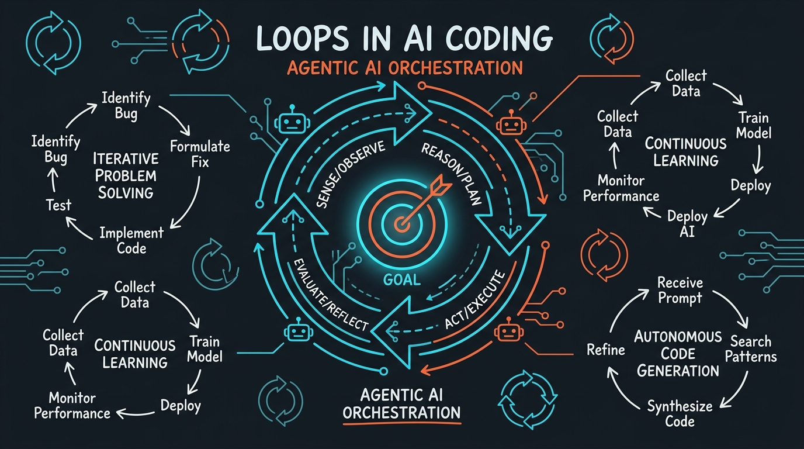
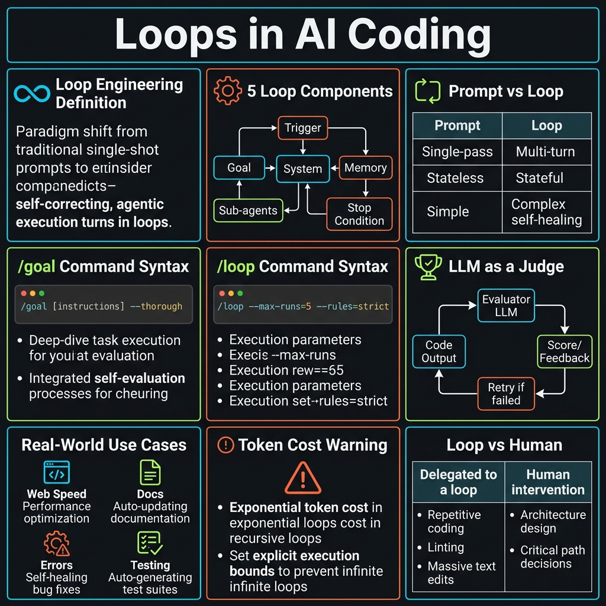
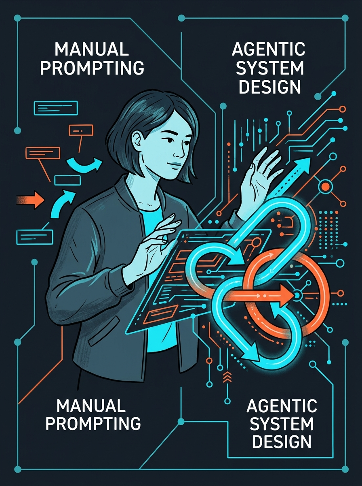
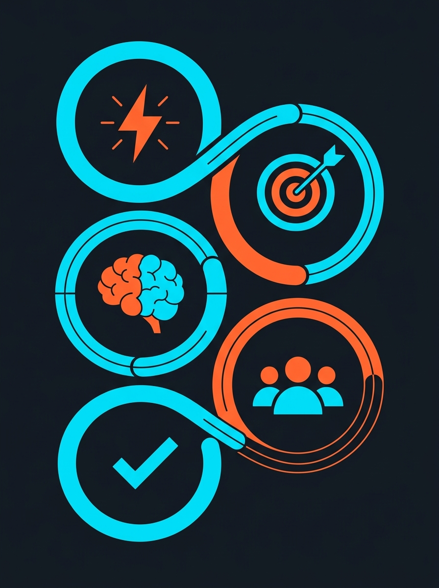

<!-- _class: title -->

# Loops in AI Coding

ออกแบบระบบให้ AI ทำงานอัตโนมัติจนบรรลุเป้าหมาย — ไม่ต้องพิมพ์ prompt เอง

<!-- Speaker: Loops = the next layer after prompt engineering. System prompts Claude; you design the system. -->

---

<!-- _class: cheatsheet -->
<!-- _backgroundColor: #f8f7f4 -->

<!-- Speaker: One-page reference for the whole deck — Trigger, Goal, Memory, Sub-agents, Stop Condition. -->

---

## TL;DR: จาก Prompt → Loop

แทนที่จะพิมพ์ทีละครั้ง ให้ออกแบบ "ระบบ" ที่ส่ง prompt แทนคุณ แล้ว verify ผลลัพธ์เองจนบรรลุเป้าหมาย

<svg viewBox="0 0 1100 320" width="100%" xmlns="http://www.w3.org/2000/svg">
  <!-- Before box -->
  <rect x="40" y="60" width="380" height="200" rx="12" fill="var(--paper)" stroke="var(--soft-2)" stroke-width="1.5" style="filter:drop-shadow(var(--shadow-sm))"/>
  <rect x="40" y="60" width="380" height="50" rx="12" fill="var(--soft)" opacity=".9"/>
  <text x="230" y="91" font-size="14" font-weight="700" fill="var(--ink-dim)" text-anchor="middle" font-family="system-ui">Prompt Engineering</text>
  <text x="80" y="140" font-size="13" fill="var(--ink-dim)" font-family="system-ui">You type each prompt manually</text>
  <text x="80" y="165" font-size="13" fill="var(--ink-dim)" font-family="system-ui">One turn at a time</text>
  <text x="80" y="190" font-size="13" fill="var(--muted)" font-family="system-ui">Output: a response</text>
  <text x="80" y="215" font-size="13" fill="var(--muted)" font-family="system-ui">Leverage: 1x</text>
  <!-- Arrow -->
  <line x1="460" y1="160" x2="600" y2="160" stroke="var(--accent)" stroke-width="2.5"/>
  <polygon points="600,152 618,160 600,168" fill="var(--accent)"/>
  <text x="540" y="148" font-size="12" fill="var(--accent)" text-anchor="middle" font-family="system-ui">evolves to</text>
  <!-- After box -->
  <rect x="660" y="60" width="400" height="200" rx="12" fill="var(--paper)" stroke="var(--accent)" stroke-width="2" style="filter:drop-shadow(var(--shadow-md))"/>
  <rect x="660" y="60" width="400" height="50" rx="12" fill="var(--accent)" opacity=".08"/>
  <text x="860" y="91" font-size="14" font-weight="700" fill="var(--accent)" text-anchor="middle" font-family="system-ui">Loop Engineering</text>
  <text x="700" y="140" font-size="13" fill="var(--ink)" font-family="system-ui">System prompts Claude for you</text>
  <text x="700" y="165" font-size="13" fill="var(--ink)" font-family="system-ui">Runs until goal is verified</text>
  <text x="700" y="190" font-size="13" fill="var(--ink)" font-family="system-ui">Output: verified outcome</text>
  <text x="700" y="215" font-size="13" fill="var(--ink)" font-family="system-ui">Leverage: 10–100x</text>
  <rect x="640" y="40" width="1" height="1" fill="none"/>
</svg>

<b>★ Takeaway:</b> Prompt engineering = table stakes. Loop engineering = next layer for autonomous, multi-hour tasks.

<!-- Speaker: Boris Cherny at Anthropic: "I don't prompt Claude anymore. I have loops running." -->

---

## Why This Matters: The Paradigm Shift

Mid-2026: AI agents can run multi-step tasks for hours. Bottleneck shifted from model capability to orchestration design.

<svg viewBox="0 0 700 280" width="100%" xmlns="http://www.w3.org/2000/svg">
  <rect x="20" y="20" width="660" height="240" rx="12" fill="var(--paper)" stroke="var(--soft-2)" stroke-width="1.5" style="filter:drop-shadow(var(--shadow-sm))"/>
  <rect x="20" y="20" width="8" height="240" rx="4" fill="var(--gold)"/>
  <text x="60" y="60" font-size="14" font-weight="700" fill="var(--ink)" font-family="system-ui">Boris Cherny (Anthropic, Claude Code):</text>
  <text x="60" y="90" font-size="13" fill="var(--ink-dim)" font-family="system-ui">"I don't prompt Claude anymore.</text>
  <text x="60" y="112" font-size="13" fill="var(--ink-dim)" font-family="system-ui"> I have loops that are running.</text>
  <text x="60" y="134" font-size="13" fill="var(--ink-dim)" font-family="system-ui"> They're the ones prompting Claude."</text>
  <line x1="60" y1="160" x2="640" y2="160" stroke="var(--soft-2)" stroke-width="1"/>
  <text x="60" y="190" font-size="12" fill="var(--muted)" font-family="system-ui">Addy Osmani (Google Chrome): popularized "Loop Engineering" — June 2026</text>
  <text x="60" y="215" font-size="12" fill="var(--muted)" font-family="system-ui">Peter Steinberger (PSPDFKit): "Design loops that prompt your agents"</text>
  <rect x="640" y="240" width="1" height="1" fill="none"/>
</svg>

<b>★ Takeaway:</b> Developers still typing prompts one at a time are leaving 90% of the value on the table.

<!-- Speaker: This isn't a future concept — the building blocks ship inside Claude Code today. -->

---

## 5 Components of a Well-Designed Loop

ทุก loop ที่ดีมีองค์ประกอบเดียวกัน 5 ส่วน — ขาดอันใดอันหนึ่ง loop จะพัง

<svg viewBox="0 0 700 290" width="100%" xmlns="http://www.w3.org/2000/svg">
  <!-- 5 horizontal pills -->
  <rect x="20" y="20" width="120" height="50" rx="25" fill="var(--accent)" opacity=".15"/>
  <text x="80" y="51" font-size="13" font-weight="700" fill="var(--accent)" text-anchor="middle" font-family="system-ui">Trigger</text>
  <line x1="140" y1="45" x2="178" y2="45" stroke="var(--accent)" stroke-width="1.5" stroke-dasharray="4,3"/>
  <rect x="178" y="20" width="120" height="50" rx="25" fill="var(--accent)" opacity=".15"/>
  <text x="238" y="51" font-size="13" font-weight="700" fill="var(--accent)" text-anchor="middle" font-family="system-ui">Goal</text>
  <line x1="298" y1="45" x2="336" y2="45" stroke="var(--accent)" stroke-width="1.5" stroke-dasharray="4,3"/>
  <rect x="336" y="20" width="120" height="50" rx="25" fill="var(--accent)" opacity=".15"/>
  <text x="396" y="51" font-size="13" font-weight="700" fill="var(--accent)" text-anchor="middle" font-family="system-ui">Memory</text>
  <line x1="456" y1="45" x2="494" y2="45" stroke="var(--accent)" stroke-width="1.5" stroke-dasharray="4,3"/>
  <rect x="494" y="20" width="120" height="50" rx="25" fill="var(--accent)" opacity=".15"/>
  <text x="554" y="51" font-size="13" font-weight="700" fill="var(--accent)" text-anchor="middle" font-family="system-ui">Sub-agents</text>
  <line x1="614" y1="45" x2="645" y2="45" stroke="var(--accent)" stroke-width="1.5" stroke-dasharray="4,3"/>
  <rect x="540" y="95" width="120" height="50" rx="25" fill="var(--success)" opacity=".15"/>
  <text x="600" y="126" font-size="13" font-weight="700" fill="var(--success)" text-anchor="middle" font-family="system-ui">Stop</text>
  <line x1="600" y1="70" x2="600" y2="95" stroke="var(--success)" stroke-width="1.5" stroke-dasharray="4,3"/>
  <!-- Description lines -->
  <text x="20" y="165" font-size="12" fill="var(--ink-dim)" font-family="system-ui">Trigger: schedule / event / human instruction / agent completion</text>
  <text x="20" y="190" font-size="12" fill="var(--ink-dim)" font-family="system-ui">Goal: verifiable end state — "all tests pass", "bundle &lt; 200KB"</text>
  <text x="20" y="215" font-size="12" fill="var(--ink-dim)" font-family="system-ui">Memory: context across iterations — what was tried, what failed</text>
  <text x="20" y="240" font-size="12" fill="var(--ink-dim)" font-family="system-ui">Sub-agents: maker + checker separation — prevents self-deception</text>
  <text x="20" y="265" font-size="12" fill="var(--success)" font-family="system-ui">Stop: verifiable condition or LLM-as-a-judge when binary is hard</text>
  <rect x="680" y="280" width="1" height="1" fill="none"/>
</svg>

<b>★ Takeaway:</b> Without a Trigger = still manual. Without a verifiable Goal = loop never stops correctly.

<!-- Speaker: These 5 map directly onto Claude Code's built-in features. -->

---

## Trigger Types: What Starts the Loop

Trigger คือสิ่งที่ทำให้ loop autonomous — ถ้าไม่มี trigger คุณยังพิมพ์ด้วยมืออยู่

  

    
Schedule

    <h3>Time-based</h3>
    
ทุกเช้า 9:00 น. ตรวจ open issues / ทุก 30 นาที cluster feedback / weekly doc sync

  

  

    
Event / Action

    <h3>Event-driven</h3>
    
PR เปิด → auto-rebase + CI fix / Test fail → root-cause loop / Deploy complete → smoke test

  

  

    
Human Instruction

    <h3>One-shot command</h3>
    
"go fix all ESLint warnings" / "/goal all tests pass" — human starts once, loop finishes alone

  

  

    
Agent Completion

    <h3>Chained agents</h3>
    
Agent A finishes → passes handoff to Agent B → B runs until its own goal is met

  

<b>★ Takeaway:</b> The trigger is what separates "autonomous loop" from "assisted prompting."

<!-- Speaker: Claude Code supports all 4 via /loop [interval], /goal, hooks, and sub-agent spawning. -->

---

## Goal Design: Verifiable vs. LLM-as-Judge

Goal ต้องเป็น end state ที่วัดได้ ไม่ใช่ process — วาง goal ผิด = loop วนไม่หยุดหรือหยุดก่อนเวลา

<svg viewBox="0 0 1100 300" width="100%" xmlns="http://www.w3.org/2000/svg">
  <!-- Verifiable column -->
  <rect x="40" y="20" width="460" height="260" rx="12" fill="var(--paper)" stroke="var(--success)" stroke-width="2" style="filter:drop-shadow(var(--shadow-sm))"/>
  <rect x="40" y="20" width="460" height="48" rx="12" fill="var(--success)" opacity=".08"/>
  <text x="270" y="50" font-size="14" font-weight="700" fill="var(--success)" text-anchor="middle" font-family="system-ui">Verifiable (binary check)</text>
  <text x="70" y="100" font-size="13" fill="var(--ink)" font-family="system-ui">"all tests pass"</text>
  <text x="70" y="130" font-size="13" fill="var(--ink)" font-family="system-ui">"bundle size under 200KB"</text>
  <text x="70" y="160" font-size="13" fill="var(--ink)" font-family="system-ui">"zero ESLint errors"</text>
  <text x="70" y="190" font-size="13" fill="var(--ink)" font-family="system-ui">"HTTP 200 on all routes"</text>
  <text x="70" y="240" font-size="12" fill="var(--success)" font-family="system-ui">Claude checks the condition itself</text>
  <!-- LLM-as-Judge column -->
  <rect x="600" y="20" width="460" height="260" rx="12" fill="var(--paper)" stroke="var(--gold)" stroke-width="2" style="filter:drop-shadow(var(--shadow-sm))"/>
  <rect x="600" y="20" width="460" height="48" rx="12" fill="var(--gold)" opacity=".08"/>
  <text x="830" y="50" font-size="14" font-weight="700" fill="var(--gold)" text-anchor="middle" font-family="system-ui">LLM as a Judge (soft check)</text>
  <text x="630" y="100" font-size="13" fill="var(--ink)" font-family="system-ui">"documentation is complete"</text>
  <text x="630" y="130" font-size="13" fill="var(--ink)" font-family="system-ui">"code style is consistent"</text>
  <text x="630" y="160" font-size="13" fill="var(--ink)" font-family="system-ui">"PR description is clear"</text>
  <text x="630" y="190" font-size="13" fill="var(--ink)" font-family="system-ui">"test coverage is adequate"</text>
  <text x="630" y="240" font-size="12" fill="var(--gold)" font-family="system-ui">Separate LLM evaluates the output</text>
  <rect x="1060" y="280" width="1" height="1" fill="none"/>
</svg>

<b>★ Takeaway:</b> "Refactor code" = bad goal (process). "All functions under 40 lines + JSDoc" = good goal (verifiable).

<!-- Speaker: LLM-as-judge adds a second model to verify — prevents the agent from fooling itself. -->

---

## Claude Code: /goal + /loop Commands

Building blocks นี้ ship มาใน Claude Code แล้ว — ไม่ต้องสร้าง infrastructure เอง

<svg viewBox="0 0 1100 320" width="100%" xmlns="http://www.w3.org/2000/svg">
  <!-- /goal panel -->
  <rect x="40" y="20" width="480" height="280" rx="12" fill="#0f172a" stroke="var(--accent)" stroke-width="1.5"/>
  <text x="70" y="56" font-size="13" font-weight="700" fill="var(--accent)" font-family="system-ui">/goal command</text>
  <text x="70" y="90" font-size="12" fill="#94a3b8" font-family="monospace">/goal All TypeScript files pass lint</text>
  <text x="70" y="115" font-size="12" fill="#94a3b8" font-family="monospace">      with zero errors and all unit</text>
  <text x="70" y="140" font-size="12" fill="#94a3b8" font-family="monospace">      tests return green</text>
  <line x1="70" y1="158" x2="480" y2="158" stroke="#1e293b" stroke-width="1"/>
  <text x="70" y="182" font-size="12" fill="#94a3b8" font-family="monospace">/goal README documents every</text>
  <text x="70" y="207" font-size="12" fill="#94a3b8" font-family="monospace">      public function in codebase</text>
  <line x1="70" y1="225" x2="480" y2="225" stroke="#1e293b" stroke-width="1"/>
  <text x="70" y="250" font-size="11" fill="#475569" font-family="system-ui">Sets persistent target across entire session</text>
  <text x="70" y="272" font-size="11" fill="#475569" font-family="system-ui">Claude checks after every action if goal met</text>
  <!-- /loop panel -->
  <rect x="580" y="20" width="480" height="280" rx="12" fill="#0f172a" stroke="var(--gold)" stroke-width="1.5"/>
  <text x="610" y="56" font-size="13" font-weight="700" fill="var(--gold)" font-family="system-ui">/loop command</text>
  <text x="610" y="90" font-size="12" fill="#94a3b8" font-family="monospace">/loop every 10m</text>
  <text x="610" y="120" font-size="12" fill="#94a3b8" font-family="monospace">/loop until: all tests pass</text>
  <text x="610" y="150" font-size="12" fill="#94a3b8" font-family="monospace">/loop every 5m until: deploy succeeds</text>
  <line x1="610" y1="168" x2="1020" y2="168" stroke="#1e293b" stroke-width="1"/>
  <text x="610" y="197" font-size="11" fill="#475569" font-family="system-ui">Omit interval = self-paced (model decides)</text>
  <text x="610" y="219" font-size="11" fill="#475569" font-family="system-ui">Omit until = runs indefinitely</text>
  <text x="610" y="241" font-size="11" fill="#475569" font-family="system-ui">Loop has memory: each iteration builds on last</text>
  <text x="610" y="268" font-size="11" fill="#94a3b8" font-family="system-ui">Re-running Claude from scratch loses this context</text>
  <rect x="1060" y="300" width="1" height="1" fill="none"/>
</svg>

<b>★ Takeaway:</b> /goal = persistent objective; /loop = recurring execution — combine both for fully autonomous runs.

<!-- Speaker: Claude re-evaluates the goal condition after every action, not just at the end. -->

---

## Real-World Loop Use Cases

ตัวอย่างการใช้งานจริง — ทุก use case มี trigger + verifiable goal ชัดเจน

| Use Case | Trigger | Goal (Verifiable) |
|----------|---------|-------------------|
| Website speed | Weekly schedule | Lighthouse ≥ 90 + bundle < 200KB |
| Doc updates | PR merged event | README matches every public API |
| Error handling | CI fail event | Zero failed tests on main branch |
| Deep product testing | Nightly schedule | Coverage ≥ 80% + zero P1 bugs |
| Babysit PRs | PR open event | Auto-rebase + CI green |

<b>★ Takeaway:</b> If you can write "done when X is true," it's a loop candidate. If you can't, it needs human design first.

<!-- Speaker: The PR babysitter loop is the classic entry point — one line, immediate ROI. -->

---

## Caveats: When Loops Break Down

Loops มีประโยชน์สูงแต่มีกับดัก — รู้ไว้ก่อนเพื่อออกแบบได้ถูก

  

    
Cost Risk

    <h3>Token burn สูงมาก</h3>
    
ทุก iteration ใช้ context window ใหม่ + อ่าน codebase ใหม่ ต้นทุนพุ่งได้โดยไม่รู้ตัว ต้องตั้ง budget limit และใช้ small model สำหรับ iterations สั้น

  

  

    
Goal Design Risk

    <h3>Feature ใหม่ goal ยาก</h3>
    
Loop เหมาะกับ maintenance/optimization/testing ที่ end state ชัด งาน "สร้าง feature ใหม่" มักมี goal แบบ fuzzy — loop วนไม่หยุดหรือหยุดก่อนเวลา

  

  

    
Integrity Risk

    <h3>Self-deception</h3>
    
Agent อาจ "ผ่าน" goal โดยไม่แก้ root cause เช่น เขียน test ที่ pass โดย skip assertion ต้องใช้ sub-agent แยกเป็น checker

  

  

    
Drift Risk

    <h3>Long loops drift</h3>
    
ยิ่งรันนาน โอกาส drift จาก original intent ยิ่งสูง ต้องตั้ง checkpoint intervals และ review ผล ไม่ใช่ปล่อยวิ่งตลอด

  

<b>★ Takeaway:</b> Start loops with maintenance tasks, short intervals, budget caps — not open-ended feature development.

<!-- Speaker: The token cost is the most common surprise. Budget $5/day max for experimental loops. -->

---

## Key Takeaways

จาก prompt ทีละครั้ง → ระบบที่รันเองจนงานเสร็จ

<svg viewBox="0 0 1100 310" width="100%" xmlns="http://www.w3.org/2000/svg">
  <!-- 7 concentric-rings style summary -->
  <circle cx="200" cy="155" r="140" fill="none" stroke="var(--soft-2)" stroke-width="1.5"/>
  <circle cx="200" cy="155" r="95" fill="none" stroke="var(--accent)" stroke-width="1.5" opacity=".4"/>
  <circle cx="200" cy="155" r="52" fill="var(--accent)" opacity=".1"/>
  <circle cx="200" cy="155" r="52" fill="none" stroke="var(--accent)" stroke-width="2"/>
  <text x="200" y="149" font-size="14" font-weight="700" fill="var(--accent)" text-anchor="middle" font-family="system-ui">Loop</text>
  <text x="200" y="169" font-size="12" fill="var(--ink)" text-anchor="middle" font-family="system-ui">Engineering</text>
  <!-- Satellite labels -->
  <text x="200" y="38" font-size="12" fill="var(--ink-dim)" text-anchor="middle" font-family="system-ui">10–100x leverage</text>
  <text x="55" y="100" font-size="11" fill="var(--muted)" text-anchor="middle" font-family="system-ui">Trigger</text>
  <text x="345" y="100" font-size="11" fill="var(--muted)" text-anchor="middle" font-family="system-ui">Goal</text>
  <text x="55" y="215" font-size="11" fill="var(--muted)" text-anchor="middle" font-family="system-ui">Memory</text>
  <text x="345" y="215" font-size="11" fill="var(--muted)" text-anchor="middle" font-family="system-ui">Stop</text>
  <!-- Right side bullets panel -->
  <rect x="420" y="20" width="660" height="270" rx="12" fill="var(--paper)" stroke="var(--soft-2)" stroke-width="1.5" style="filter:drop-shadow(var(--shadow-sm))"/>
  <text x="450" y="58" font-size="13" fill="var(--ink)" font-family="system-ui">Design the system that prompts AI — not the prompts</text>
  <text x="450" y="90" font-size="13" fill="var(--ink)" font-family="system-ui">5 components: Trigger / Goal / Memory / Sub-agents / Stop</text>
  <text x="450" y="122" font-size="13" fill="var(--ink)" font-family="system-ui">Goal must be a verifiable end state, not a process</text>
  <text x="450" y="154" font-size="13" fill="var(--ink)" font-family="system-ui">LLM as a Judge when binary check is impossible</text>
  <text x="450" y="186" font-size="13" fill="var(--ink)" font-family="system-ui">Claude Code /goal + /loop: ships as native features</text>
  <text x="450" y="218" font-size="13" fill="var(--warning)" font-family="system-ui">Watch token cost — loops burn context fast</text>
  <text x="450" y="250" font-size="13" fill="var(--ink-dim)" font-family="system-ui">Start with maintenance tasks; not feature creation</text>
  <rect x="1080" y="290" width="1" height="1" fill="none"/>
</svg>

<b>★ Takeaway:</b> Loop Engineering = the craft layer after prompt engineering — the bottleneck is now system design, not phrasing.

<!-- Speaker: If you remember one thing: write the system that prompts Claude, not the prompts themselves. -->
