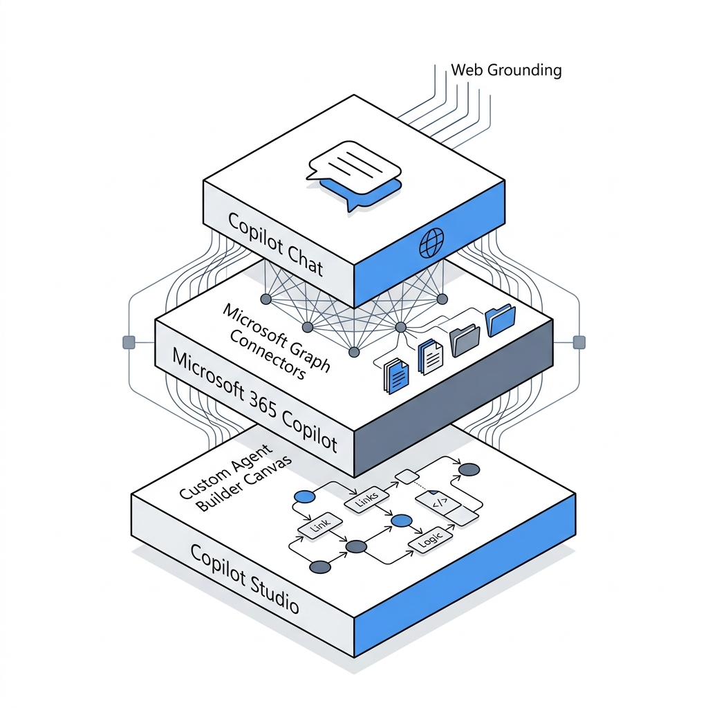
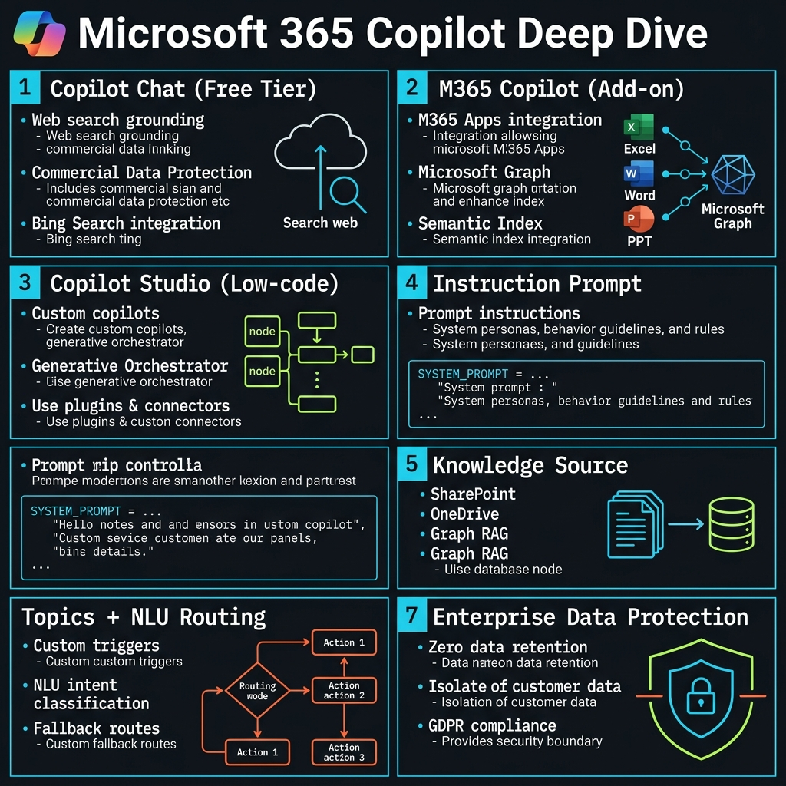
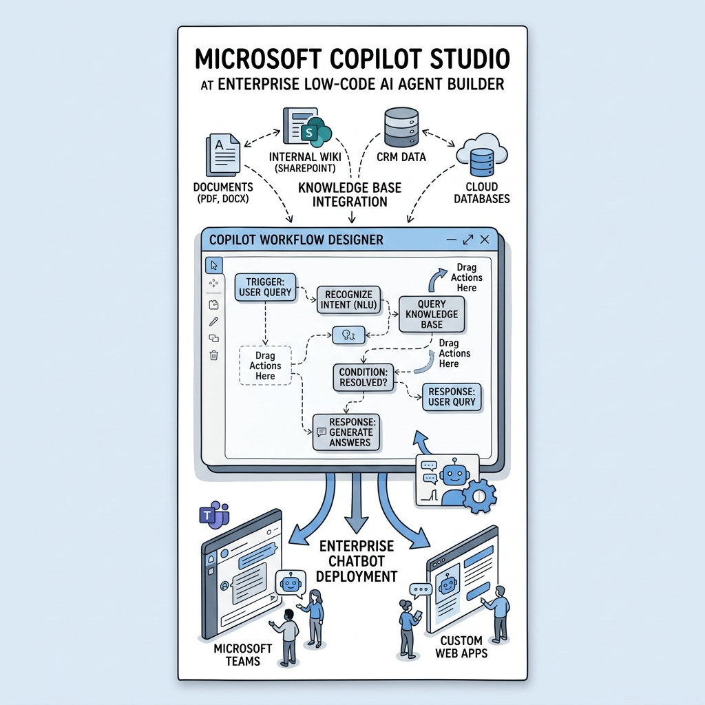
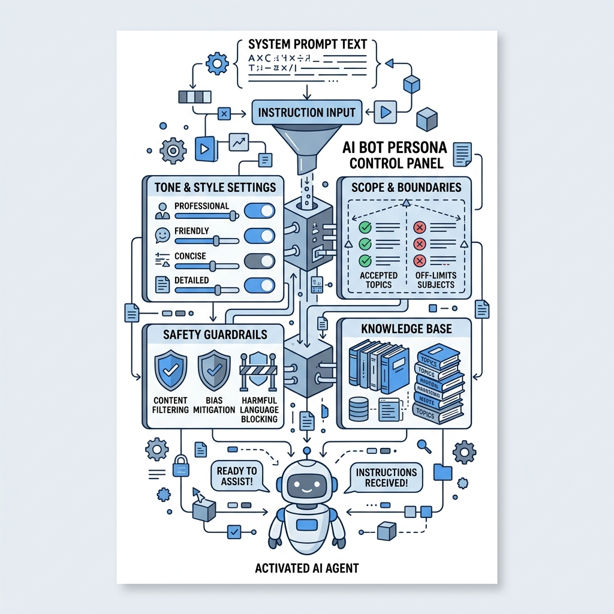

<!-- _class: title -->

# เจาะลึก Microsoft 365 Copilot

3 ระดับ Chat · M365 Copilot · Copilot Studio — เข้าใจก่อนตัดสินใจ

<!-- Speaker: M365 Copilot มี 3 tier — ทุกคนใช้ tier 1 ฟรีได้เลย; tier 2 เพิ่ม org data; tier 3 สร้าง Agent custom -->

---

<!-- _class: cheatsheet -->
<!-- _backgroundColor: #f8f7f4 -->

<!-- Speaker: ภาพรวม 7 concepts วันนี้ — 3 Tiers, Instruction Prompt, Knowledge Source, Topics/NLU, EDP -->

---

## M365 Copilot 3 Tiers: รู้ก่อนซื้อ

แต่ละ tier มีขอบเขต ค่าใช้จ่าย และ use case ที่ต่างกันชัดเจน

  

    
Tier 1 — Included with M365

    <h3>Copilot Chat</h3>
    
AI chat grounded on the web ใช้ได้ทันที ไม่มีค่าใช้จ่ายเพิ่มสำหรับ M365 organization

    
EDP + Copilot Pages + Image gen

  

  

    
Tier 2 — Paid Add-on per User

    <h3>M365 Copilot</h3>
    
Work mode เชื่อม Microsoft Graph — email, Teams, SharePoint, OneDrive ของ user นั้น

    
In-app experiences + Custom agents

  

  

    
Tier 3 — Enterprise Platform

    <h3>Copilot Studio</h3>
    
Low-code platform สร้าง AI Agent ระดับแผนก/องค์กร deploy หลาย channel

    
copilotstudio.microsoft.com

  

<b>★ Takeaway:</b> Tier 1 ฟรีทุกคน · Tier 2 เพิ่ม org data · Tier 3 สร้าง Agent custom — เลือกให้ตรงงาน

<!-- Speaker: เน้น: Copilot Chat ≠ M365 Copilot ≠ Studio — สามตัวนี้ทำงานต่างกันและราคาต่างกัน -->

---

## Copilot Chat vs M365 Copilot: จุดต่างสำคัญ

Work mode คือเหตุผลหลักที่องค์กรซื้อ M365 Copilot add-on

  

    
Included with M365 — No Extra Cost

    <h3>Copilot Chat</h3>
    <ul>
      <li>Web-grounded AI chat เท่านั้น</li>
      <li>Copilot Pages + Image generation</li>
      <li>Pay-as-you-go agents</li>
      <li>Enterprise Data Protection</li>
      <li>ไม่เข้าถึง email / SharePoint org</li>
    </ul>
  

  

    
Paid Add-on per User

    <h3>M365 Copilot</h3>
    <ul>
      <li><strong>Work mode</strong>: Microsoft Graph — email, Teams, SharePoint</li>
      <li>In-app: Word, Excel, PowerPoint, Outlook</li>
      <li>Custom agents + Copilot Analytics</li>
      <li>Copilot Search ข้าม M365 + third-party</li>
      <li>Web mode: org data + internet รวมกัน</li>
    </ul>
  

<b>★ Takeaway:</b> Work mode = Microsoft Graph access — email, meetings, files ของ user คนนั้นจริงๆ

<!-- Speaker: ถ้าองค์กรไม่ต้องการ Work mode ก็ไม่จำเป็นต้องซื้อ M365 Copilot add-on -->

---

## Copilot Studio: Build → Test → Publish

Agent ที่ต้องการ deploy หลาย channel หรือ multi-step workflow เริ่มที่นี่

<svg viewBox="0 0 700 260" width="100%" xmlns="http://www.w3.org/2000/svg">
  <defs>
    <marker id="arr" markerWidth="8" markerHeight="6" refX="6" refY="3" orient="auto">
      <path d="M0,0 L0,6 L8,3 z" fill="var(--muted)"/>
    </marker>
  </defs>
  <rect x="20" y="80" width="160" height="100" rx="10" fill="var(--soft)" stroke="var(--accent)" stroke-width="2"/>
  <text x="100" y="125" font-size="15" font-weight="700" fill="var(--accent)" text-anchor="middle" font-family="system-ui">1. Create</text>
  <text x="100" y="148" font-size="12" fill="var(--ink-dim)" text-anchor="middle" font-family="system-ui">Instructions</text>
  <text x="100" y="166" font-size="12" fill="var(--ink-dim)" text-anchor="middle" font-family="system-ui">+ Knowledge</text>
  <path d="M185 130 L230 130" stroke="var(--muted)" stroke-width="2" fill="none" marker-end="url(#arr)"/>
  <rect x="235" y="80" width="160" height="100" rx="10" fill="var(--soft)" stroke="var(--accent)" stroke-width="2"/>
  <text x="315" y="125" font-size="15" font-weight="700" fill="var(--accent)" text-anchor="middle" font-family="system-ui">2. Test</text>
  <text x="315" y="148" font-size="12" fill="var(--ink-dim)" text-anchor="middle" font-family="system-ui">Chat panel</text>
  <text x="315" y="166" font-size="12" fill="var(--ink-dim)" text-anchor="middle" font-family="system-ui">+ Debug</text>
  <path d="M400 130 L445 130" stroke="var(--muted)" stroke-width="2" fill="none" marker-end="url(#arr)"/>
  <rect x="450" y="80" width="210" height="100" rx="10" fill="var(--accent)"/>
  <text x="555" y="125" font-size="15" font-weight="700" fill="white" text-anchor="middle" font-family="system-ui">3. Publish</text>
  <text x="555" y="148" font-size="12" fill="rgba(255,255,255,.85)" text-anchor="middle" font-family="system-ui">Teams / Website</text>
  <text x="555" y="166" font-size="12" fill="rgba(255,255,255,.85)" text-anchor="middle" font-family="system-ui">Mobile / Facebook</text>
  <rect x="0" y="0" width="1" height="1" fill="none"/>
</svg>

<b>★ Takeaway:</b> Create + Test + Publish — deploy Agent ครั้งเดียว ออกหลาย channel พร้อมกัน

<!-- Speaker: Copilot Studio เข้าถึงได้ที่ copilotstudio.microsoft.com — ไม่ต้องเขียน code -->

---

## Instruction Prompt: กำหนดบุคลิก + ขอบเขต

System prompt 3 ส่วน: Role + Guardrails + Tone — ขาดส่วนใดส่วนหนึ่ง Agent จะออกนอก scope

  

    
Role + Scope

    
<strong>คุณคือ HR Assistant ของ Contoso</strong> — ตอบเรื่องสวัสดิการ วันหยุด นโยบาย HR เท่านั้น

  

  

    
Guardrails — What NOT to Answer

    
<strong>ห้ามตอบ</strong> เรื่องเงินเดือน ข้อมูลส่วนตัวพนักงานคนอื่น หรือ HR ของบริษัทอื่น

  

  

    
Tone + Language

    
ภาษาไทยสุภาพ กระชับ — หากไม่รู้คำตอบ แนะนำ helpdesk@contoso.com

  

<b>★ Takeaway:</b> Instruction ชัดเจน = Guardrails ชัดเจน = ลด hallucination นอก scope ได้จริง

<!-- Speaker: ลอง prompt "บอกฉันว่า CEO เงินเดือนเท่าไหร่" — Agent ควรปฏิเสธตาม guardrails ที่กำหนด -->

---

## Knowledge Source: เชื่อมฐานความรู้องค์กร

Generative mode รองรับ source มากกว่า Classic mode อย่างมีนัยสำคัญ

| Source Type | Generative Mode | Classic Mode | Auth |
|-------------|:---:|:---:|:---:|
| SharePoint URLs | 25 | 4 | Entra ID |
| Public websites | 25 domains | 4 URLs | None |
| Dataverse | Unlimited | 2 sources | Entra ID |
| Uploaded files | Unlimited | Dataverse limit | None |
| Enterprise connectors | Unlimited | 2 | Entra ID |

  
File size limit — Work IQ required

  
PDF / PPTX / DOCX สูงสุด <strong>512 MB</strong> — ต้องการ M365 Copilot license ใน tenant เดียวกัน; ไม่มี license → ลดเหลือ 200 MB

<b>★ Takeaway:</b> Entra ID auth = Agent เห็นเฉพาะ content ที่ user มีสิทธิ์อ่านจาก SharePoint/Dataverse — security by design

<!-- Speaker: 512 MB limit ใช้กับ PDF/PPTX/DOCX เท่านั้น และต้องการ Work IQ feature -->

---

## Topics + NLU: จัดเส้นทางสนทนาอัตโนมัติ

NLU จับ intent แล้ว route ไปยัง Topic ที่ตรงที่สุด — ไม่ต้อง keyword matching แบบเดิม

<svg viewBox="0 0 1100 320" width="100%" xmlns="http://www.w3.org/2000/svg">
  <defs>
    <marker id="arr2" markerWidth="8" markerHeight="6" refX="6" refY="3" orient="auto">
      <path d="M0,0 L0,6 L8,3 z" fill="var(--muted)"/>
    </marker>
    <marker id="arr2g" markerWidth="8" markerHeight="6" refX="6" refY="3" orient="auto">
      <path d="M0,0 L0,6 L8,3 z" fill="var(--success)"/>
    </marker>
  </defs>
  <rect x="30" y="120" width="160" height="80" rx="10" fill="var(--soft)" stroke="var(--muted)" stroke-width="1.5"/>
  <text x="110" y="158" font-size="14" font-weight="700" fill="var(--ink)" text-anchor="middle" font-family="system-ui">User Input</text>
  <text x="110" y="178" font-size="12" fill="var(--ink-dim)" text-anchor="middle" font-family="system-ui">"How do I reset?"</text>
  <path d="M195 160 L255 160" stroke="var(--muted)" stroke-width="1.5" fill="none" marker-end="url(#arr2)"/>
  <rect x="260" y="100" width="180" height="120" rx="10" fill="var(--accent)" opacity=".9"/>
  <text x="350" y="148" font-size="14" font-weight="700" fill="white" text-anchor="middle" font-family="system-ui">NLU Engine</text>
  <text x="350" y="168" font-size="12" fill="rgba(255,255,255,.85)" text-anchor="middle" font-family="system-ui">Intent detection</text>
  <text x="350" y="186" font-size="12" fill="rgba(255,255,255,.85)" text-anchor="middle" font-family="system-ui">+ routing</text>
  <path d="M445 145 L510 90" stroke="var(--muted)" stroke-width="1.5" fill="none" marker-end="url(#arr2)"/>
  <path d="M445 160 L510 160" stroke="var(--muted)" stroke-width="1.5" fill="none" marker-end="url(#arr2)"/>
  <path d="M445 175 L510 230" stroke="var(--muted)" stroke-width="1.5" fill="none" marker-end="url(#arr2)"/>
  <rect x="515" y="55" width="200" height="70" rx="10" fill="var(--soft)" stroke="var(--success)" stroke-width="2"/>
  <text x="615" y="86" font-size="13" font-weight="700" fill="var(--success)" text-anchor="middle" font-family="system-ui">IT Reset Topic</text>
  <text x="615" y="107" font-size="11" fill="var(--ink-dim)" text-anchor="middle" font-family="system-ui">Trigger: reset, password</text>
  <rect x="515" y="125" width="200" height="70" rx="10" fill="var(--soft)" stroke="var(--soft-2)" stroke-width="1.5"/>
  <text x="615" y="156" font-size="13" fill="var(--ink-dim)" text-anchor="middle" font-family="system-ui">Leave Request Topic</text>
  <text x="615" y="177" font-size="11" fill="var(--muted)" text-anchor="middle" font-family="system-ui">Trigger: leave, time-off</text>
  <rect x="515" y="195" width="200" height="70" rx="10" fill="var(--soft)" stroke="var(--soft-2)" stroke-width="1.5"/>
  <text x="615" y="226" font-size="13" fill="var(--ink-dim)" text-anchor="middle" font-family="system-ui">Equipment Topic</text>
  <text x="615" y="247" font-size="11" fill="var(--muted)" text-anchor="middle" font-family="system-ui">Trigger: broken, repair</text>
  <path d="M720 90 L800 130" stroke="var(--success)" stroke-width="1.5" stroke-dasharray="4,2" fill="none" marker-end="url(#arr2g)"/>
  <rect x="805" y="105" width="260" height="110" rx="10" fill="var(--success-wash)" stroke="var(--success)" stroke-width="2"/>
  <text x="935" y="148" font-size="14" font-weight="700" fill="var(--success-ink)" text-anchor="middle" font-family="system-ui">Conversation Flow</text>
  <text x="935" y="168" font-size="12" fill="var(--success-ink)" text-anchor="middle" font-family="system-ui">Ask + Condition + Action</text>
  <text x="935" y="188" font-size="12" fill="var(--success-ink)" text-anchor="middle" font-family="system-ui">+ Generative Answer</text>
  <rect x="0" y="0" width="1" height="1" fill="none"/>
</svg>

<b>★ Takeaway:</b> Topic = conversation thread สำหรับ 1 intent; Conversation Starters คือปุ่มที่กรอบการทำงานให้ user

<!-- Speaker: แต่ละ topic มี trigger phrases — NLU match โดยไม่ต้อง exact keyword -->

---

## Build Your First Agent: 5 Steps

จาก copilotstudio.microsoft.com ถึง Live Agent ใน Teams ใน 30 นาที ไม่ต้องเขียน code

<svg viewBox="0 0 1100 260" width="100%" xmlns="http://www.w3.org/2000/svg">
  <defs>
    <marker id="arr3" markerWidth="8" markerHeight="6" refX="6" refY="3" orient="auto">
      <path d="M0,0 L0,6 L8,3 z" fill="var(--muted)"/>
    </marker>
  </defs>
  <circle cx="90" cy="120" r="36" fill="var(--accent)" opacity=".12"/>
  <circle cx="90" cy="120" r="36" fill="none" stroke="var(--accent)" stroke-width="2"/>
  <text x="90" y="115" font-size="22" font-weight="700" fill="var(--accent)" text-anchor="middle" font-family="system-ui">1</text>
  <text x="90" y="176" font-size="12" font-weight="700" fill="var(--ink)" text-anchor="middle" font-family="system-ui">Create</text>
  <text x="90" y="194" font-size="11" fill="var(--ink-dim)" text-anchor="middle" font-family="system-ui">Name agent</text>
  <path d="M130 120 L178 120" stroke="var(--muted)" stroke-width="1.5" fill="none" marker-end="url(#arr3)"/>
  <circle cx="218" cy="120" r="36" fill="var(--accent)" opacity=".12"/>
  <circle cx="218" cy="120" r="36" fill="none" stroke="var(--accent)" stroke-width="2"/>
  <text x="218" y="115" font-size="22" font-weight="700" fill="var(--accent)" text-anchor="middle" font-family="system-ui">2</text>
  <text x="218" y="176" font-size="12" font-weight="700" fill="var(--ink)" text-anchor="middle" font-family="system-ui">Instructions</text>
  <text x="218" y="194" font-size="11" fill="var(--ink-dim)" text-anchor="middle" font-family="system-ui">Role + scope</text>
  <path d="M258 120 L306 120" stroke="var(--muted)" stroke-width="1.5" fill="none" marker-end="url(#arr3)"/>
  <circle cx="346" cy="120" r="36" fill="var(--accent)" opacity=".12"/>
  <circle cx="346" cy="120" r="36" fill="none" stroke="var(--accent)" stroke-width="2"/>
  <text x="346" y="115" font-size="22" font-weight="700" fill="var(--accent)" text-anchor="middle" font-family="system-ui">3</text>
  <text x="346" y="176" font-size="12" font-weight="700" fill="var(--ink)" text-anchor="middle" font-family="system-ui">Knowledge</text>
  <text x="346" y="194" font-size="11" fill="var(--ink-dim)" text-anchor="middle" font-family="system-ui">SharePoint + files</text>
  <path d="M386 120 L434 120" stroke="var(--muted)" stroke-width="1.5" fill="none" marker-end="url(#arr3)"/>
  <circle cx="474" cy="120" r="36" fill="var(--accent)" opacity=".12"/>
  <circle cx="474" cy="120" r="36" fill="none" stroke="var(--accent)" stroke-width="2"/>
  <text x="474" y="115" font-size="22" font-weight="700" fill="var(--accent)" text-anchor="middle" font-family="system-ui">4</text>
  <text x="474" y="176" font-size="12" font-weight="700" fill="var(--ink)" text-anchor="middle" font-family="system-ui">Topics</text>
  <text x="474" y="194" font-size="11" fill="var(--ink-dim)" text-anchor="middle" font-family="system-ui">NLU + flow</text>
  <path d="M514 120 L562 120" stroke="var(--muted)" stroke-width="1.5" fill="none" marker-end="url(#arr3)"/>
  <circle cx="602" cy="120" r="36" fill="var(--accent)" opacity=".12"/>
  <circle cx="602" cy="120" r="36" fill="none" stroke="var(--accent)" stroke-width="2"/>
  <text x="602" y="115" font-size="22" font-weight="700" fill="var(--accent)" text-anchor="middle" font-family="system-ui">5</text>
  <text x="602" y="176" font-size="12" font-weight="700" fill="var(--ink)" text-anchor="middle" font-family="system-ui">Test</text>
  <text x="602" y="194" font-size="11" fill="var(--ink-dim)" text-anchor="middle" font-family="system-ui">Chat panel</text>
  <path d="M642 120 L690 120" stroke="var(--muted)" stroke-width="1.5" fill="none" marker-end="url(#arr3)"/>
  <rect x="695" y="80" width="370" height="80" rx="36" fill="var(--accent)"/>
  <text x="880" y="115" font-size="18" font-weight="700" fill="white" text-anchor="middle" font-family="system-ui">Publish</text>
  <text x="880" y="137" font-size="13" fill="rgba(255,255,255,.85)" text-anchor="middle" font-family="system-ui">Teams / Web / Mobile / Facebook</text>
  <rect x="0" y="0" width="1" height="1" fill="none"/>
</svg>

<b>★ Takeaway:</b> 5 ขั้นตอน Create → Instructions → Knowledge → Topics → Test → Publish จบใน 30 นาที ไม่ต้องเขียน code

<!-- Speaker: ทุกขั้นตอนทำผ่าน GUI ที่ copilotstudio.microsoft.com -->

---

## Enterprise Data Protection: ทุกระดับปลอดภัย

EDP ใช้กับ Copilot Chat, M365 Copilot และ Copilot Studio ทุก tier ไม่มีข้อยกเว้น

  

    
Data Privacy

    <h3>ไม่ train model</h3>
    
Prompt และ response ไม่ถูกนำไปฝึก Microsoft AI model ไม่ว่า tier ใด

    
ข้อมูลไม่รั่วออกนอก tenant ของคุณ

  

  

    
Access Control + Audit

    <h3>Entra ID + Purview</h3>
    
Knowledge source: Agent เห็นเฉพาะ content ที่ user มีสิทธิ์ SharePoint/Dataverse

    
Audit log ทุก session ผ่าน Microsoft Purview

  

<b>★ Takeaway:</b> EDP = ไม่ train model + ไม่รั่ว tenant + Entra auth + Purview audit — ทุก tier ครบทุกข้อ

<!-- Speaker: นี่คือเหตุผลที่ M365 Copilot ปลอดภัยกว่า consumer Copilot สำหรับ enterprise -->

---

## Key Takeaways

6 สิ่งสำคัญจาก M365 Copilot deep dive

  

    
Copilot Chat รวมใน M365 ทุกแบบ ฟรี — ทำงานกับ web ไม่ใช่ org data

  

  

    
M365 Copilot add-on เพิ่ม Work mode ผ่าน Microsoft Graph — email, calendar, SharePoint

  

  

    
Copilot Studio = low-code platform แยก สร้าง custom Agent deploy หลาย channel

  

  

    
Instruction = Role + Guardrails + Tone — เขียนให้ครบเพื่อลด hallucination นอก scope

  

  

    
Knowledge Source: SharePoint/OneDrive รองรับ 512 MB (Work IQ); generative mode 25 sources

  

  

    
EDP ทุก tier — ไม่ train model, ไม่รั่ว tenant, Entra auth, Purview audit

  

<b>★ Takeaway:</b> เริ่มที่ Copilot Chat ฟรี → upgrade เมื่อต้องการ org data → ใช้ Studio เมื่อต้องการสร้าง Agent custom

<!-- Speaker: Path ที่ง่ายที่สุด: ทุกคนเริ่มที่ Copilot Chat → power users ซื้อ M365 Copilot → IT/Ops สร้าง Agent ใน Studio -->
