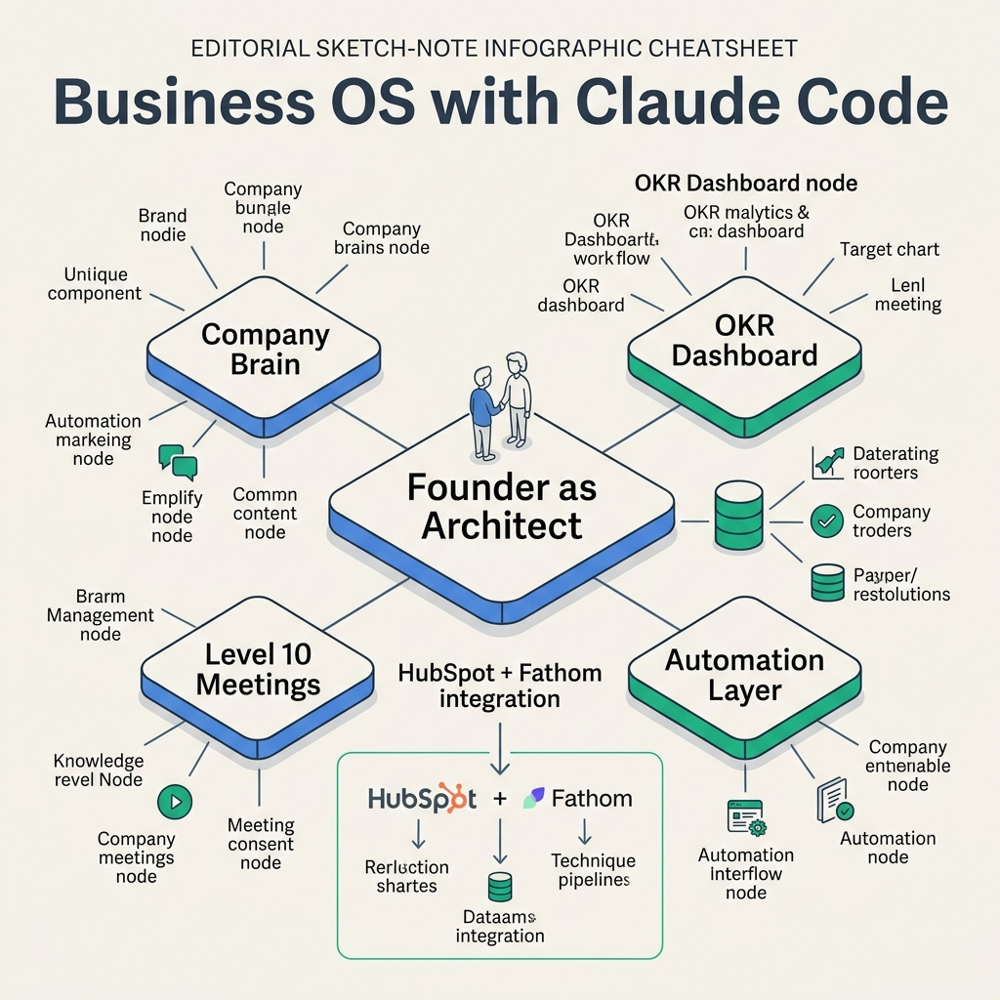
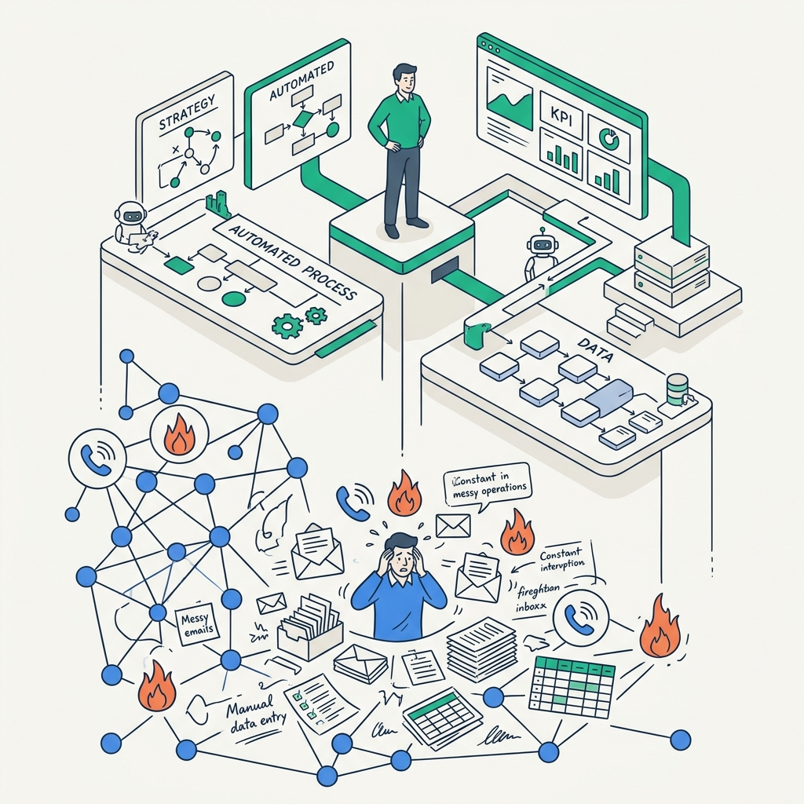
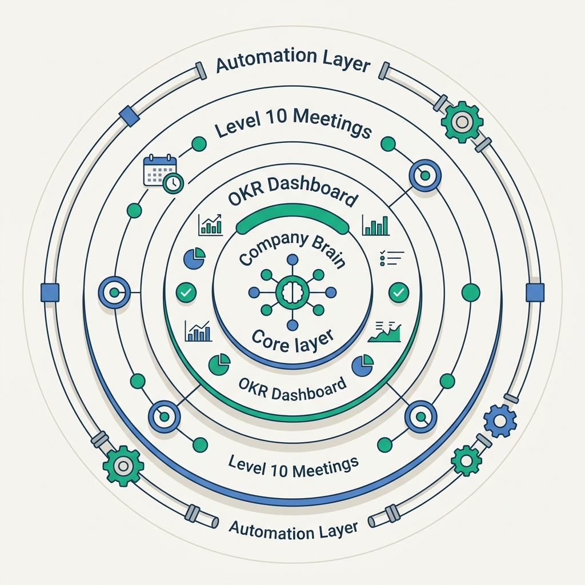

<!-- _class: title -->

# Matt Gray: Business OS with Claude Code

Operator to Architect — 4 layers that run your company

<!-- Speaker: Matt Gray built a complete Business OS with Claude Code — one AI system that knows your company, synthesizes your CRM and meetings, and surfaces only what needs founder judgment. -->

---

<!-- _class: cheatsheet -->
<!-- _backgroundColor: #f8f7f4 -->

<!-- Speaker: Company Brain at core, OKR Dashboard + Level 10 Meetings as the cadence layer, Automation as connective tissue. HubSpot + Fathom feed data in; Claude handles synthesis and real-time alerts. -->

---

## Business OS: One System That Knows Your Company

Replace scattered tools with AI institutional memory — OKRs, meetings, and KPIs unified.

<svg viewBox="0 0 1100 320" width="100%" xmlns="http://www.w3.org/2000/svg">
  <rect x="40" y="20" width="300" height="260" rx="12" fill="var(--accent-wash)" stroke="var(--accent)" stroke-width="2"/>
  <circle cx="190" cy="80" r="30" fill="var(--accent)"/>
  <text x="190" y="85" font-size="18" fill="var(--paper)" text-anchor="middle" dominant-baseline="central" font-family="system-ui" font-weight="700">1</text>
  <text x="190" y="128" font-size="14" font-weight="700" fill="var(--accent-deep)" text-anchor="middle" font-family="system-ui">Company Brain</text>
  <text x="190" y="152" font-size="12" fill="var(--ink-dim)" text-anchor="middle" font-family="system-ui">Claude Projects context</text>
  <text x="190" y="174" font-size="12" fill="var(--ink-dim)" text-anchor="middle" font-family="system-ui">Mission + KPIs + Decisions</text>
  <text x="190" y="196" font-size="11" fill="var(--muted)" text-anchor="middle" font-family="system-ui">AI that knows your business</text>
  <rect x="400" y="20" width="300" height="260" rx="12" fill="var(--soft)" stroke="var(--soft-2)" stroke-width="1.5"/>
  <circle cx="550" cy="80" r="30" fill="var(--success)"/>
  <text x="550" y="85" font-size="18" fill="var(--paper)" text-anchor="middle" dominant-baseline="central" font-family="system-ui" font-weight="700">2</text>
  <text x="550" y="128" font-size="14" font-weight="700" fill="var(--ink)" text-anchor="middle" font-family="system-ui">OKR + Dashboard</text>
  <text x="550" y="152" font-size="12" fill="var(--ink-dim)" text-anchor="middle" font-family="system-ui">HubSpot + Fathom feeds</text>
  <text x="550" y="174" font-size="12" fill="var(--ink-dim)" text-anchor="middle" font-family="system-ui">Real-time KPI tracking</text>
  <text x="550" y="196" font-size="11" fill="var(--muted)" text-anchor="middle" font-family="system-ui">Auto-flag off-track metrics</text>
  <rect x="760" y="20" width="300" height="260" rx="12" fill="var(--soft)" stroke="var(--soft-2)" stroke-width="1.5"/>
  <circle cx="910" cy="80" r="30" fill="var(--gold)"/>
  <text x="910" y="85" font-size="18" fill="var(--paper)" text-anchor="middle" dominant-baseline="central" font-family="system-ui" font-weight="700">3</text>
  <text x="910" y="128" font-size="14" font-weight="700" fill="var(--ink)" text-anchor="middle" font-family="system-ui">Level 10 + Automation</text>
  <text x="910" y="152" font-size="12" fill="var(--ink-dim)" text-anchor="middle" font-family="system-ui">EOS meeting cadence</text>
  <text x="910" y="174" font-size="12" fill="var(--ink-dim)" text-anchor="middle" font-family="system-ui">AI-powered agenda prep</text>
  <text x="910" y="196" font-size="11" fill="var(--muted)" text-anchor="middle" font-family="system-ui">No manual prep required</text>
  <line x1="340" y1="150" x2="400" y2="150" stroke="var(--accent)" stroke-width="2" stroke-dasharray="6,4"/>
  <line x1="700" y1="150" x2="760" y2="150" stroke="var(--accent)" stroke-width="2" stroke-dasharray="6,4"/>
  <rect x="0" y="0" width="1" height="1" fill="none"/>
</svg>

<b>★ Takeaway:</b> Business OS = AI institutional memory, not a chatbot — it knows your entire company context.

<!-- Speaker: Three pillars compose the OS. Company Brain is the foundation. Dashboard + meetings are the cadence layers. Automation is the connective tissue that makes it self-sustaining. -->

---

## The Operator Trap: Why Founders Stay Stuck

Founders pulled into day-to-day ops lose bandwidth for strategy.

<svg viewBox="0 0 700 290" width="100%" xmlns="http://www.w3.org/2000/svg">
  <rect x="10" y="20" width="300" height="240" rx="12" fill="var(--danger-wash)" stroke="var(--danger)" stroke-width="1.5"/>
  <text x="160" y="55" font-size="13" font-weight="700" fill="var(--danger-ink)" text-anchor="middle" font-family="system-ui">OPERATOR MODE</text>
  <text x="160" y="80" font-size="11" fill="var(--ink-dim)" text-anchor="middle" font-family="system-ui">Reactive — firefighting daily</text>
  <text x="160" y="102" font-size="11" fill="var(--ink-dim)" text-anchor="middle" font-family="system-ui">KPIs scattered in 5+ tools</text>
  <text x="160" y="124" font-size="11" fill="var(--ink-dim)" text-anchor="middle" font-family="system-ui">No bandwidth for strategy</text>
  <text x="160" y="146" font-size="11" fill="var(--ink-dim)" text-anchor="middle" font-family="system-ui">Team misaligned</text>
  <text x="160" y="168" font-size="11" fill="var(--muted)" text-anchor="middle" font-family="system-ui">Manual weekly reports</text>
  <line x1="310" y1="140" x2="360" y2="140" stroke="var(--accent)" stroke-width="2.5"/>
  <polygon points="358,134 374,140 358,146" fill="var(--accent)"/>
  <text x="342" y="128" font-size="10" fill="var(--accent)" text-anchor="middle" font-family="system-ui">Business</text>
  <text x="342" y="156" font-size="10" fill="var(--accent)" text-anchor="middle" font-family="system-ui">OS</text>
  <rect x="385" y="20" width="300" height="240" rx="12" fill="var(--success-wash)" stroke="var(--success)" stroke-width="1.5"/>
  <text x="535" y="55" font-size="13" font-weight="700" fill="var(--success-ink)" text-anchor="middle" font-family="system-ui">ARCHITECT MODE</text>
  <text x="535" y="80" font-size="11" fill="var(--ink)" text-anchor="middle" font-family="system-ui">AI synthesizes meetings</text>
  <text x="535" y="102" font-size="11" fill="var(--ink)" text-anchor="middle" font-family="system-ui">Unified real-time dashboard</text>
  <text x="535" y="124" font-size="11" fill="var(--ink)" text-anchor="middle" font-family="system-ui">Review exceptions only</text>
  <text x="535" y="146" font-size="11" fill="var(--ink)" text-anchor="middle" font-family="system-ui">Team aligned via AI context</text>
  <text x="535" y="168" font-size="11" fill="var(--success-ink)" text-anchor="middle" font-family="system-ui">Auto weekly wrap-up</text>
  <rect x="0" y="0" width="1" height="1" fill="none"/>
</svg>

<b>★ Takeaway:</b> Business OS eliminates the Operator Trap — AI handles synthesis so founders focus on decisions only.

<!-- Speaker: Most founders oscillate between firefighting and strategic planning. The OS creates a third state: strategic clarity with real-time data, no collection overhead. -->

---

## Four Layers Build the Operating System

Each layer builds on the last — Company Brain is the prerequisite for everything above.

<svg viewBox="0 0 700 290" width="100%" xmlns="http://www.w3.org/2000/svg">
  <rect x="10" y="10" width="580" height="58" rx="10" fill="var(--soft-2)" stroke="var(--muted)" stroke-width="1.5"/>
  <text x="36" y="40" font-size="12" font-weight="700" fill="var(--ink)" font-family="system-ui">4  Automation Layer</text>
  <text x="36" y="58" font-size="10" fill="var(--ink-dim)" font-family="system-ui">HubSpot events + Fathom transcripts trigger Claude workflows</text>
  <rect x="24" y="80" width="552" height="58" rx="10" fill="var(--warning-wash)" stroke="var(--warning)" stroke-width="1.5"/>
  <text x="50" y="110" font-size="12" font-weight="700" fill="var(--warning-ink)" font-family="system-ui">3  Level 10 Meetings</text>
  <text x="50" y="128" font-size="10" fill="var(--ink-dim)" font-family="system-ui">Fathom transcript → Claude EOS agenda auto-prep</text>
  <rect x="38" y="150" width="524" height="58" rx="10" fill="var(--success-wash)" stroke="var(--success)" stroke-width="1.5"/>
  <text x="64" y="180" font-size="12" font-weight="700" fill="var(--success-ink)" font-family="system-ui">2  OKR + KPI Dashboard</text>
  <text x="64" y="198" font-size="10" fill="var(--ink-dim)" font-family="system-ui">HubSpot + Fathom → real-time unified metrics</text>
  <rect x="52" y="220" width="496" height="58" rx="10" fill="var(--accent-wash)" stroke="var(--accent)" stroke-width="2"/>
  <text x="78" y="250" font-size="12" font-weight="700" fill="var(--accent-deep)" font-family="system-ui">1  Company Brain — Claude Projects context</text>
  <text x="78" y="268" font-size="10" fill="var(--ink-dim)" font-family="system-ui">Mission + team + decisions + ICP embedded in AI</text>
  <rect x="0" y="0" width="1" height="1" fill="none"/>
</svg>

<b>★ Takeaway:</b> Company Brain is the foundation — without shared AI context, OKR tracking and automation have nothing to work from.

<!-- Speaker: This is a dependency stack. You can't have real-time OKRs without Company Brain. You can't have Level 10 AI prep without the dashboard feeding in. Build bottom-up, one layer per quarter. -->

---

## Company Brain: AI That Knows Your Business

Claude Projects holds company context so every team member gets the same informed AI.

  

    
Mission + Voice

    <h3>Company Identity</h3>
    <ul>
      <li>Mission, values, brand tone</li>
      <li>Messaging rules and ICP</li>
      <li>Customer persona details</li>
    </ul>
  

  

    
Structure

    <h3>Accountability Map</h3>
    <ul>
      <li>Team structure and roles</li>
      <li>Decision-making hierarchy</li>
      <li>Ownership by function</li>
    </ul>
  

  

    
Intelligence

    <h3>Historical Context</h3>
    <ul>
      <li>Past decisions and rationale</li>
      <li>Lessons learned by quarter</li>
      <li>Strategic priorities (Rocks)</li>
    </ul>
  

  

    
Team Impact

    <h3>Shared AI Context</h3>
    <ul>
      <li>Every team member same AI</li>
      <li>No repeated onboarding prompts</li>
      <li>Consistent brand outputs</li>
    </ul>
  

<b>★ Takeaway:</b> Company Brain = one AI, shared context — team alignment by default, not by calendar invite.

<!-- Speaker: The Company Brain alone is the biggest leverage point. Junior team members querying Claude get senior-level context. No more "what's our ICP again?" in Slack. -->

---

## OKR + KPI Dashboard: Data Converges in Real-Time

HubSpot and Fathom feed Claude — one unified view replacing 5 scattered tools.

<svg viewBox="0 0 1100 340" width="100%" xmlns="http://www.w3.org/2000/svg">
  <rect x="20" y="90" width="200" height="72" rx="10" fill="var(--paper)" stroke="var(--soft-2)" stroke-width="1.5" style="filter:drop-shadow(0 2px 8px rgba(15,23,42,.08))"/>
  <text x="120" y="122" font-size="13" font-weight="700" fill="var(--ink)" text-anchor="middle" font-family="system-ui">HubSpot CRM</text>
  <text x="120" y="144" font-size="11" fill="var(--ink-dim)" text-anchor="middle" font-family="system-ui">Deals · Pipeline · Lifecycle</text>
  <rect x="20" y="210" width="200" height="72" rx="10" fill="var(--paper)" stroke="var(--soft-2)" stroke-width="1.5" style="filter:drop-shadow(0 2px 8px rgba(15,23,42,.08))"/>
  <text x="120" y="242" font-size="13" font-weight="700" fill="var(--ink)" text-anchor="middle" font-family="system-ui">Fathom AI</text>
  <text x="120" y="264" font-size="11" fill="var(--ink-dim)" text-anchor="middle" font-family="system-ui">Transcripts · Action Items</text>
  <line x1="220" y1="126" x2="370" y2="186" stroke="var(--accent)" stroke-width="2"/>
  <polygon points="366,180 380,188 368,196" fill="var(--accent)"/>
  <line x1="220" y1="246" x2="370" y2="210" stroke="var(--accent)" stroke-width="2"/>
  <polygon points="366,204 380,212 368,220" fill="var(--accent)"/>
  <rect x="370" y="150" width="190" height="72" rx="10" fill="var(--accent)" style="filter:drop-shadow(0 4px 12px rgba(59,130,246,.3))"/>
  <text x="465" y="182" font-size="13" font-weight="700" fill="var(--paper)" text-anchor="middle" font-family="system-ui">Claude Code</text>
  <text x="465" y="204" font-size="11" fill="rgba(255,255,255,.8)" text-anchor="middle" font-family="system-ui">Synthesis + Alerts</text>
  <line x1="560" y1="186" x2="680" y2="186" stroke="var(--success)" stroke-width="2.5"/>
  <polygon points="678,180 694,186 678,192" fill="var(--success)"/>
  <rect x="694" y="126" width="200" height="72" rx="10" fill="var(--success-wash)" stroke="var(--success)" stroke-width="2" style="filter:drop-shadow(0 4px 12px rgba(22,163,74,.2))"/>
  <text x="794" y="158" font-size="13" font-weight="700" fill="var(--success-ink)" text-anchor="middle" font-family="system-ui">KPI Dashboard</text>
  <text x="794" y="180" font-size="11" fill="var(--ink-dim)" text-anchor="middle" font-family="system-ui">Real-time · Auto-flag alerts</text>
  <line x1="794" y1="198" x2="794" y2="258" stroke="var(--gold)" stroke-width="2"/>
  <polygon points="788,256 794,272 800,256" fill="var(--gold)"/>
  <rect x="694" y="272" width="200" height="52" rx="10" fill="var(--warning-wash)" stroke="var(--gold)" stroke-width="1.5"/>
  <text x="794" y="302" font-size="13" font-weight="700" fill="var(--warning-ink)" text-anchor="middle" font-family="system-ui">OKR Tracker</text>
  <text x="930" y="186" font-size="11" fill="var(--muted)" font-family="system-ui">No manual</text>
  <text x="930" y="204" font-size="11" fill="var(--muted)" font-family="system-ui">aggregation</text>
  <rect x="0" y="0" width="1" height="1" fill="none"/>
</svg>

<b>★ Takeaway:</b> HubSpot + Fathom = data flywheel — CRM and meeting intelligence flows to Claude automatically, 24/7.

<!-- Speaker: Previously this synthesis happened in a weekly Friday afternoon meeting. Now it's continuous. Founders see deal-closing in real-time, not in Monday's status update. -->

---

## Level 10 Meetings: Structured Cadence + AI Prep

EOS Level 10 format — 90 minutes, zero wasted time, AI pre-populates every section.

| Section | Time | Content |
|---------|------|---------|
| Check-in | 5 min | Team rating 1–10 for the week |
| Scorecard | 5 min | KPI review vs. targets |
| Rock Review | 5 min | Quarterly priorities progress |
| Headlines | 5 min | Customer / employee news |
| To-do List | 5 min | Carryover action items |
| **IDS** | **60 min** | **Identify / Discuss / Solve issues** |
| Conclude | 5 min | Meeting rating + cascade messages |

<b>★ Takeaway:</b> Fathom records meetings → Claude extracts action items → issues tracked continuously across weeks, never lost.

<!-- Speaker: The IDS section is where real value unlocks — AI tracks unresolved issues week-over-week so nothing slips through. Every meeting starts with last week's open items pre-populated. -->

---

## Automation Layer: Claude Code Replaces Zapier

Custom Claude Code automation — no low-code limits, no per-automation pricing.

<svg viewBox="0 0 1100 340" width="100%" xmlns="http://www.w3.org/2000/svg">
  <rect x="20" y="28" width="210" height="52" rx="8" fill="var(--paper)" stroke="var(--soft-2)" stroke-width="1.5"/>
  <text x="125" y="54" font-size="12" font-weight="700" fill="var(--ink)" text-anchor="middle" font-family="system-ui">HubSpot deal</text>
  <text x="125" y="72" font-size="10" fill="var(--ink-dim)" text-anchor="middle" font-family="system-ui">update event</text>
  <line x1="230" y1="54" x2="390" y2="54" stroke="var(--accent)" stroke-width="1.5"/>
  <polygon points="388,48 404,54 388,60" fill="var(--accent)"/>
  <rect x="404" y="28" width="150" height="52" rx="8" fill="var(--accent)" opacity=".9"/>
  <text x="479" y="58" font-size="12" font-weight="700" fill="var(--paper)" text-anchor="middle" font-family="system-ui">Claude Code</text>
  <line x1="554" y1="54" x2="700" y2="54" stroke="var(--accent)" stroke-width="1.5"/>
  <polygon points="698,48 714,54 698,60" fill="var(--accent)"/>
  <rect x="714" y="28" width="210" height="52" rx="8" fill="var(--soft)" stroke="var(--soft-2)" stroke-width="1.5"/>
  <text x="819" y="54" font-size="12" font-weight="700" fill="var(--ink)" text-anchor="middle" font-family="system-ui">AI summary</text>
  <text x="819" y="72" font-size="10" fill="var(--ink-dim)" text-anchor="middle" font-family="system-ui">Slack notification</text>
  <rect x="20" y="140" width="210" height="52" rx="8" fill="var(--paper)" stroke="var(--soft-2)" stroke-width="1.5"/>
  <text x="125" y="166" font-size="12" font-weight="700" fill="var(--ink)" text-anchor="middle" font-family="system-ui">Fathom transcript</text>
  <text x="125" y="184" font-size="10" fill="var(--ink-dim)" text-anchor="middle" font-family="system-ui">post-meeting</text>
  <line x1="230" y1="166" x2="390" y2="166" stroke="var(--success)" stroke-width="1.5"/>
  <polygon points="388,160 404,166 388,172" fill="var(--success)"/>
  <rect x="404" y="140" width="150" height="52" rx="8" fill="var(--accent)" opacity=".9"/>
  <text x="479" y="170" font-size="12" font-weight="700" fill="var(--paper)" text-anchor="middle" font-family="system-ui">Claude Code</text>
  <line x1="554" y1="166" x2="700" y2="166" stroke="var(--success)" stroke-width="1.5"/>
  <polygon points="698,160 714,166 698,172" fill="var(--success)"/>
  <rect x="714" y="140" width="210" height="52" rx="8" fill="var(--success-wash)" stroke="var(--success)" stroke-width="1.5"/>
  <text x="819" y="162" font-size="12" font-weight="700" fill="var(--success-ink)" text-anchor="middle" font-family="system-ui">Action items</text>
  <text x="819" y="180" font-size="10" fill="var(--ink-dim)" text-anchor="middle" font-family="system-ui">assigned to PM tool</text>
  <rect x="20" y="252" width="210" height="52" rx="8" fill="var(--paper)" stroke="var(--soft-2)" stroke-width="1.5"/>
  <text x="125" y="278" font-size="12" font-weight="700" fill="var(--ink)" text-anchor="middle" font-family="system-ui">Weekly scorecard</text>
  <text x="125" y="296" font-size="10" fill="var(--ink-dim)" text-anchor="middle" font-family="system-ui">auto-generated</text>
  <line x1="230" y1="278" x2="390" y2="278" stroke="var(--gold)" stroke-width="1.5"/>
  <polygon points="388,272 404,278 388,284" fill="var(--gold)"/>
  <rect x="404" y="252" width="150" height="52" rx="8" fill="var(--accent)" opacity=".9"/>
  <text x="479" y="282" font-size="12" font-weight="700" fill="var(--paper)" text-anchor="middle" font-family="system-ui">Claude Code</text>
  <line x1="554" y1="278" x2="700" y2="278" stroke="var(--gold)" stroke-width="1.5"/>
  <polygon points="698,272 714,278 698,284" fill="var(--gold)"/>
  <rect x="714" y="252" width="210" height="52" rx="8" fill="var(--warning-wash)" stroke="var(--gold)" stroke-width="1.5"/>
  <text x="819" y="274" font-size="12" font-weight="700" fill="var(--warning-ink)" text-anchor="middle" font-family="system-ui">Level 10 agenda</text>
  <text x="819" y="292" font-size="10" fill="var(--ink-dim)" text-anchor="middle" font-family="system-ui">pre-populated draft</text>
  <rect x="0" y="0" width="1" height="1" fill="none"/>
</svg>

<b>★ Takeaway:</b> Claude Code automation: one-time build cost, unlimited runtime, full AI logic — Zapier can't do this.

<!-- Speaker: Zapier has per-automation pricing and can't run custom AI logic per trigger. Claude Code automation is custom, context-aware, and scales with your company's growth. -->

---

## Founder Weekly Workflow: Exceptions Only

The OS surfaces what needs human judgment — data collection, synthesis, and routine alerts are automated.

<svg viewBox="0 0 1100 320" width="100%" xmlns="http://www.w3.org/2000/svg">
  <line x1="60" y1="148" x2="1040" y2="148" stroke="var(--soft-2)" stroke-width="3"/>
  <circle cx="170" cy="148" r="30" fill="var(--accent)"/>
  <text x="170" y="153" font-size="12" font-weight="700" fill="var(--paper)" text-anchor="middle" dominant-baseline="central" font-family="system-ui">MON</text>
  <rect x="60" y="192" width="220" height="110" rx="10" fill="var(--accent-wash)" stroke="var(--accent)" stroke-width="1.5"/>
  <text x="170" y="218" font-size="11" font-weight="700" fill="var(--accent-deep)" text-anchor="middle" font-family="system-ui">Dashboard Review</text>
  <text x="170" y="240" font-size="10" fill="var(--ink-dim)" text-anchor="middle" font-family="system-ui">KPI week-over-week</text>
  <text x="170" y="260" font-size="10" fill="var(--ink-dim)" text-anchor="middle" font-family="system-ui">AI flags off-track items</text>
  <text x="170" y="280" font-size="10" fill="var(--ink-dim)" text-anchor="middle" font-family="system-ui">Level 10 agenda ready</text>
  <circle cx="550" cy="148" r="30" fill="var(--success)"/>
  <text x="550" y="143" font-size="10" font-weight="700" fill="var(--paper)" text-anchor="middle" dominant-baseline="central" font-family="system-ui">MID-</text>
  <text x="550" y="159" font-size="10" font-weight="700" fill="var(--paper)" text-anchor="middle" dominant-baseline="central" font-family="system-ui">WEEK</text>
  <rect x="440" y="192" width="220" height="110" rx="10" fill="var(--success-wash)" stroke="var(--success)" stroke-width="1.5"/>
  <text x="550" y="218" font-size="11" font-weight="700" fill="var(--success-ink)" text-anchor="middle" font-family="system-ui">Real-time Monitoring</text>
  <text x="550" y="240" font-size="10" fill="var(--ink-dim)" text-anchor="middle" font-family="system-ui">HubSpot deals live</text>
  <text x="550" y="260" font-size="10" fill="var(--ink-dim)" text-anchor="middle" font-family="system-ui">Fathom meeting summaries</text>
  <text x="550" y="280" font-size="10" fill="var(--ink-dim)" text-anchor="middle" font-family="system-ui">Slack alerts on changes</text>
  <circle cx="940" cy="148" r="30" fill="var(--gold)"/>
  <text x="940" y="153" font-size="12" font-weight="700" fill="var(--paper)" text-anchor="middle" dominant-baseline="central" font-family="system-ui">FRI</text>
  <rect x="830" y="192" width="220" height="110" rx="10" fill="var(--warning-wash)" stroke="var(--gold)" stroke-width="1.5"/>
  <text x="940" y="218" font-size="11" font-weight="700" fill="var(--warning-ink)" text-anchor="middle" font-family="system-ui">Weekly Wrap-up</text>
  <text x="940" y="240" font-size="10" fill="var(--ink-dim)" text-anchor="middle" font-family="system-ui">Auto-generated report</text>
  <text x="940" y="260" font-size="10" fill="var(--ink-dim)" text-anchor="middle" font-family="system-ui">Decisions + exceptions only</text>
  <text x="940" y="280" font-size="10" fill="var(--ink-dim)" text-anchor="middle" font-family="system-ui">OKR progress captured</text>
  <rect x="0" y="0" width="1" height="1" fill="none"/>
</svg>

<b>★ Takeaway:</b> Founder reviews only decisions and exceptions — the OS handles data collection and routine synthesis automatically.

<!-- Speaker: Monday is no longer spent chasing status updates. The key shift: from "collecting information" to "reviewing exceptions." The OS creates strategic clarity with real-time data. -->

---

## Caveats: What the Business OS Cannot Do Alone

Design constraints to plan for before building — not blockers, but intentional choices.

  

    
Context Limit

    <h3>Claude Projects Cap</h3>
    
Large company docs need chunking strategy. Curate ruthlessly — quality of Company Brain context matters more than quantity.

  

  

    
API Access

    <h3>HubSpot Pro Required</h3>
    
Full API needs HubSpot Professional tier+. Fathom has transcript delivery latency — plan async workflows, not real-time.

  

  

    
Ongoing Work

    <h3>Maintenance Overhead</h3>
    
Company Brain drifts as business evolves. Schedule quarterly reviews — stale AI context produces confident but wrong outputs.

  

<b>★ Takeaway:</b> AI flags and synthesizes — strategic judgment, context curation, and relationship decisions stay human.

<!-- Speaker: Stale Company Brain is worse than no Company Brain — it produces confident wrong outputs. The maintenance discipline is what separates teams that get leverage from teams that get chaos. -->

---

## Key Takeaways: What This Changes for Founders

Business OS is a structural shift — not a tool upgrade, a mode of operating.

<svg viewBox="0 0 1100 320" width="100%" xmlns="http://www.w3.org/2000/svg">
  <circle cx="550" cy="160" r="148" fill="none" stroke="var(--soft-2)" stroke-width="2"/>
  <circle cx="550" cy="160" r="100" fill="none" stroke="var(--accent)" stroke-width="1.5" opacity=".4"/>
  <circle cx="550" cy="160" r="55" fill="var(--accent)" opacity=".1"/>
  <circle cx="550" cy="160" r="55" fill="none" stroke="var(--accent)" stroke-width="2"/>
  <text x="550" y="153" font-size="12" font-weight="700" fill="var(--accent)" text-anchor="middle" font-family="system-ui">Company</text>
  <text x="550" y="171" font-size="12" font-weight="700" fill="var(--accent)" text-anchor="middle" font-family="system-ui">Brain</text>
  <text x="390" y="84" font-size="11" fill="var(--ink)" font-family="system-ui" text-anchor="middle">OKR</text>
  <text x="390" y="102" font-size="11" fill="var(--muted)" font-family="system-ui" text-anchor="middle">Dashboard</text>
  <text x="710" y="84" font-size="11" fill="var(--ink)" font-family="system-ui" text-anchor="middle">Level 10</text>
  <text x="710" y="102" font-size="11" fill="var(--muted)" font-family="system-ui" text-anchor="middle">Meetings</text>
  <text x="210" y="155" font-size="11" fill="var(--muted)" font-family="system-ui" text-anchor="middle">Automation</text>
  <text x="210" y="173" font-size="11" fill="var(--muted)" font-family="system-ui" text-anchor="middle">Layer</text>
  <text x="890" y="155" font-size="11" fill="var(--muted)" font-family="system-ui" text-anchor="middle">Sustainable</text>
  <text x="890" y="173" font-size="11" fill="var(--muted)" font-family="system-ui" text-anchor="middle">Growth</text>
  <text x="550" y="316" font-size="11" fill="var(--ink-dim)" text-anchor="middle" font-family="system-ui">Founder as Architect — not Operator</text>
  <rect x="0" y="0" width="1" height="1" fill="none"/>
</svg>

<b>★ Takeaway:</b> Start with Company Brain + KPI Dashboard — each layer multiplies the value of the one below. Build one layer per quarter.

<!-- Speaker: Don't build all four layers at once. Company Brain alone is transformative. One layer at a time, over one quarter, creates compounding leverage — and a business that grows without you in every meeting. -->
