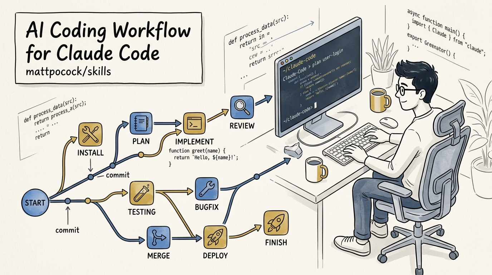
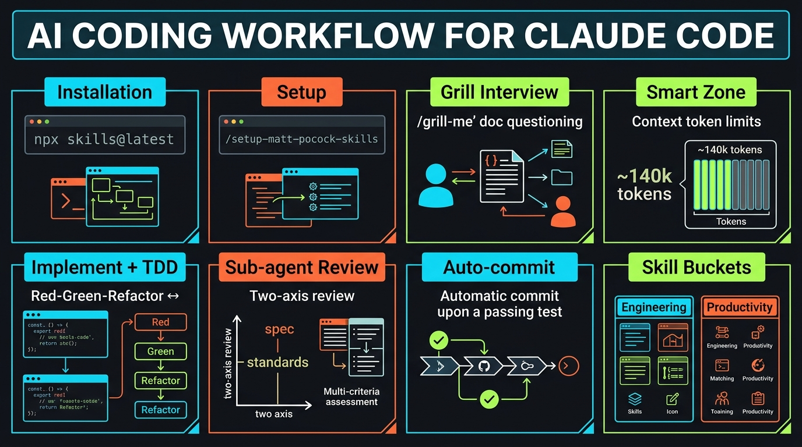
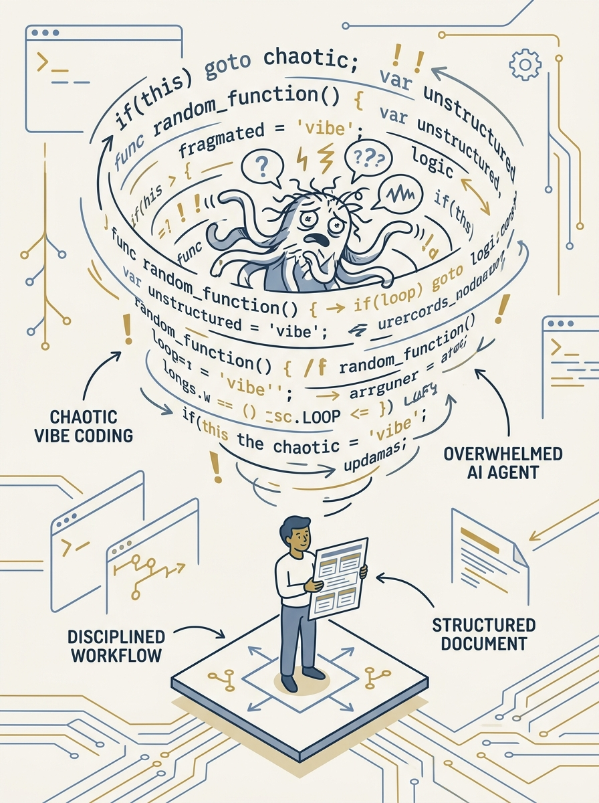

<!-- _class: title -->

# เจาะลึก mattpocock/skills: AI Coding Workflow ประหยัด Context Window

A disciplined, user-invoked skill system for Claude Code, Cursor &amp; Codex — 176k★ MIT repo

<!-- Speaker: เกริ่นว่า repo นี้คือ .agents directory ของ Matt Pocock ที่เปิดสาธารณะ แก้ปัญหา agent เขียนโค้ดมั่วและ context บวม -->

---

<!-- _class: cheatsheet -->
<!-- _backgroundColor: #f8f7f4 -->

<!-- Speaker: ภาพรวมทั้ง deck ใน 1 หน้า — 8 concept หลักตั้งแต่ install ถึง auto-commit -->

---

## TL;DR

สรุปสั้น ก่อนลงรายละเอียด

mattpocock/skills

ชุด skill <b>user-invoked</b> สำหรับ Claude Code (และ Cursor, Codex) ที่กิน context แค่ ~660 token/skill
วางขั้นตอนพัฒนาแบบมีวินัย: คุยแผน (<code>/grill-with-docs</code>) → แตก spec/ticket ถ้าเกิน smart zone →
เขียนโค้ดพร้อม TDD (<code>/implement</code>) → sub-agent รีวิว (<code>/code-review</code>) → auto-commit

<b>★ Takeaway:</b> ผู้ใช้ควบคุม workflow เอง ไม่ใช่ปล่อยให้ agent เดาแล้วรันยาว

<!-- Speaker: เน้นคำว่า user-invoked ตรงข้ามกับ vibe coding -->

---

## Background: ทำไม workflow นี้ถึงสำคัญ

AI agent ที่ไม่มีวินัย มักเขียนโค้ดเร็วเกินไปและทำ context บวมจนโมเดล "โง่ลง"

  

    
Stars

    <h3>176,203</h3>
    
Forks: 15,096

  

  

    
License

    <h3>MIT</h3>
    
สร้าง 3 ก.พ. 2026

  

  

    
Overhead

    <h3>~660 token</h3>
    
ต่อ skill

  

<b>★ Takeaway:</b> Matt Pocock แชร์ .agents directory ที่ใช้จริงใน production ไม่ใช่ทฤษฎี

<!-- Speaker: ตัวเลขยืนยันผ่าน GitHub API วันที่เผยแพร่บทความ -->

---

## ติดตั้งยังไง

2 ทางเลือกหลัก — ยืนยันตรงจาก README ของ repo

  

    
Option A — Skills Installer

    <h3>npx skills@latest</h3>
    
<code>npx skills@latest add mattpocock/skills</code>

    
เลือก agent เป้าหมาย (Claude Code / Cursor / Codex) และ scope (global/project)

  

  

    
Option B — Claude Code Plugin

    <h3>plugin marketplace</h3>
    
<code>claude plugin marketplace add mattpocock/skills</code>

    
<code>claude plugin install mattpocock-skills@mattpocock</code>

  

<b>★ Takeaway:</b> ทั้งสองทางติดตั้งชุด skill เดียวกัน เลือกตามว่าใช้ Claude Code เป็นหลักหรือไม่

<!-- Speaker: แนะนำ plugin marketplace ถ้าใช้ Claude Code อยู่แล้ว -->

---

## ตั้งค่าเชื่อม issue tracker

รันครั้งเดียวต่อ repo หลังติดตั้งเสร็จ

  

    
Command

    <h3>/setup-matt-pocock-skills</h3>
  

  

    
1. Issue Tracker

    
GitHub, Linear หรือ local markdown files

  

  

    
2. Triage Label

    
ใช้สื่อสารสถานะ ticket ระหว่าง skill

  

  

    
3. Doc Layout

    
Single context หรือ multi-context (monorepo)

  

  

    
Result

    
Skill อื่นบันทึก spec/ticket ไป tracker ที่เลือกอัตโนมัติ

  

  

    
Frequency

    
ครั้งเดียวต่อ repository

  

<b>★ Takeaway:</b> ตั้งค่าครั้งเดียว skill ทั้งชุดใช้ config เดียวกันตลอด repo

<!-- Speaker: ย้ำว่าตั้งครั้งเดียวไม่ต้องทำซ้ำทุก session -->

---

## Grill-with-docs: สัมภาษณ์แปลงไอเดียเป็นแผน

Agent ถามทีละคำถาม จนทั้งคู่เข้าใจตรงกัน ก่อนเขียนโค้ดแม้แต่บรรทัดเดียว

<svg viewBox="0 0 700 320" width="100%" xmlns="http://www.w3.org/2000/svg">
  <rect x="20" y="40" width="660" height="70" rx="10" fill="var(--paper)" stroke="var(--soft-2)" stroke-width="1.5"/>
  <text x="350" y="82" font-size="15" font-weight="700" fill="var(--ink)" text-anchor="middle" font-family="system-ui">/grill-with-docs</text>
  <path d="M350 110 L350 150" stroke="var(--muted)" stroke-width="2" marker-end="url(#arrow)"/>
  <rect x="20" y="150" width="310" height="80" rx="10" fill="var(--accent)" opacity=".08"/>
  <text x="175" y="185" font-size="14" font-weight="700" fill="var(--accent-deep)" text-anchor="middle" font-family="system-ui">CONTEXT.md</text>
  <text x="175" y="208" font-size="11" fill="var(--ink-dim)" text-anchor="middle" font-family="system-ui">updated live</text>
  <rect x="370" y="150" width="310" height="80" rx="10" fill="var(--gold)" opacity=".12"/>
  <text x="525" y="185" font-size="14" font-weight="700" fill="var(--ink)" text-anchor="middle" font-family="system-ui">ADRs</text>
  <text x="525" y="208" font-size="11" fill="var(--ink-dim)" text-anchor="middle" font-family="system-ui">decisions logged</text>
  <defs><marker id="arrow" markerWidth="8" markerHeight="8" refX="4" refY="4" orient="auto"><path d="M0 0 L8 4 L0 8 z" fill="var(--muted)"/></marker></defs>
</svg>

<b>★ Takeaway:</b> v1.1 เพิ่ม confirmation gate กัน agent เขียนโค้ดก่อนแผนถูกยืนยัน

<!-- Speaker: เน้นว่านี่คือจุดเริ่มต้นของ main flow ทุกครั้ง -->

---

## Smart Zone: เพดาน token ที่โมเดลยังคิดคมอยู่

ช่วง ~140,000 token ก่อนที่ attention จะเริ่มเสื่อมและ hallucinate ง่ายขึ้น

<svg viewBox="0 0 1100 340" width="100%" xmlns="http://www.w3.org/2000/svg">
  <rect x="40" y="30" width="300" height="90" rx="12" fill="var(--paper)" stroke="var(--accent)" stroke-width="2"/>
  <text x="190" y="65" font-size="15" font-weight="700" fill="var(--ink)" text-anchor="middle" font-family="system-ui">Task size</text>
  <text x="190" y="90" font-size="12" fill="var(--ink-dim)" text-anchor="middle" font-family="system-ui">fits smart zone (~140k)?</text>
  <path d="M340 75 L420 75" stroke="var(--muted)" stroke-width="2" marker-end="url(#arrow2)"/>
  <path d="M190 120 L190 170 L340 220" stroke="var(--success)" stroke-width="2" marker-end="url(#arrow2)" fill="none"/>
  <text x="230" y="165" font-size="12" fill="var(--success-ink)" font-family="system-ui">YES</text>
  <rect x="420" y="30" width="300" height="90" rx="12" fill="var(--success-wash)" stroke="var(--success)" stroke-width="1.5"/>
  <text x="570" y="65" font-size="15" font-weight="700" fill="var(--success-ink)" text-anchor="middle" font-family="system-ui">/implement</text>
  <text x="570" y="90" font-size="12" fill="var(--success-ink)" text-anchor="middle" font-family="system-ui">ไปต่อได้ทันที</text>
  <rect x="340" y="190" width="300" height="90" rx="12" fill="var(--warning-wash)" stroke="var(--warning)" stroke-width="1.5"/>
  <text x="490" y="225" font-size="15" font-weight="700" fill="var(--warning-ink)" text-anchor="middle" font-family="system-ui">/to-spec</text>
  <text x="490" y="250" font-size="12" fill="var(--warning-ink)" text-anchor="middle" font-family="system-ui">บีบเป็นสเปกเดียว</text>
  <path d="M640 235 L720 235" stroke="var(--muted)" stroke-width="2" marker-end="url(#arrow2)"/>
  <rect x="720" y="190" width="300" height="90" rx="12" fill="var(--warning-wash)" stroke="var(--warning)" stroke-width="1.5"/>
  <text x="870" y="225" font-size="15" font-weight="700" fill="var(--warning-ink)" text-anchor="middle" font-family="system-ui">/to-tickets</text>
  <text x="870" y="250" font-size="12" fill="var(--warning-ink)" text-anchor="middle" font-family="system-ui">ตัดเป็น ticket ย่อย</text>
  <text x="190" y="150" font-size="12" fill="var(--danger-ink)" font-family="system-ui">NO</text>
  <defs><marker id="arrow2" markerWidth="8" markerHeight="8" refX="4" refY="4" orient="auto"><path d="M0 0 L8 4 L0 8 z" fill="var(--muted)"/></marker></defs>
</svg>

<b>★ Takeaway:</b> ห้าม clear context ตั้งแต่ grill ถึง to-tickets — ใช้ /handoff ถ้าใกล้ชนเพดานแทน

<!-- Speaker: ย้ำว่าตัวเลข 140k เป็นแนวคิดเชิงประสบการณ์จากวิดีโอ ไม่ใช่ hard limit ในเอกสาร README -->

---

## Implement + Code-Review: sub-agent ตรวจสอบตัวเอง

Context สะอาดของ sub-agent ประเมินงานตรงไปตรงมากว่า agent ที่เขียนโค้ดเอง

<svg viewBox="0 0 1100 300" width="100%" xmlns="http://www.w3.org/2000/svg">
  <rect x="20" y="100" width="230" height="90" rx="10" fill="var(--paper)" stroke="var(--soft-2)" stroke-width="1.5"/>
  <text x="135" y="135" font-size="14" font-weight="700" fill="var(--ink)" text-anchor="middle" font-family="system-ui">/implement</text>
  <text x="135" y="158" font-size="11" fill="var(--ink-dim)" text-anchor="middle" font-family="system-ui">+ TDD at seams</text>
  <path d="M250 145 L300 145" stroke="var(--muted)" stroke-width="2" marker-end="url(#arrow3)"/>
  <rect x="300" y="60" width="240" height="80" rx="10" fill="var(--accent-wash)" stroke="var(--accent)" stroke-width="1.5"/>
  <text x="420" y="93" font-size="13" font-weight="700" fill="var(--accent-deep)" text-anchor="middle" font-family="system-ui">Sub-agent A</text>
  <text x="420" y="114" font-size="11" fill="var(--ink-dim)" text-anchor="middle" font-family="system-ui">spec compliance</text>
  <rect x="300" y="160" width="240" height="80" rx="10" fill="var(--accent-wash)" stroke="var(--accent)" stroke-width="1.5"/>
  <text x="420" y="193" font-size="13" font-weight="700" fill="var(--accent-deep)" text-anchor="middle" font-family="system-ui">Sub-agent B</text>
  <text x="420" y="214" font-size="11" fill="var(--ink-dim)" text-anchor="middle" font-family="system-ui">coding standards</text>
  <path d="M540 145 L610 145" stroke="var(--muted)" stroke-width="2" marker-end="url(#arrow3)"/>
  <rect x="610" y="100" width="230" height="90" rx="10" fill="var(--success-wash)" stroke="var(--success)" stroke-width="1.5"/>
  <text x="725" y="135" font-size="14" font-weight="700" fill="var(--success-ink)" text-anchor="middle" font-family="system-ui">/code-review</text>
  <text x="725" y="158" font-size="11" fill="var(--success-ink)" text-anchor="middle" font-family="system-ui">2-axis pass?</text>
  <path d="M840 145 L890 145" stroke="var(--muted)" stroke-width="2" marker-end="url(#arrow3)"/>
  <rect x="890" y="100" width="190" height="90" rx="10" fill="var(--gold)" opacity=".15" stroke="var(--gold)" stroke-width="1.5"/>
  <text x="985" y="135" font-size="14" font-weight="700" fill="var(--ink)" text-anchor="middle" font-family="system-ui">auto-commit</text>
  <text x="985" y="158" font-size="11" fill="var(--ink-dim)" text-anchor="middle" font-family="system-ui">to current branch</text>
  <defs><marker id="arrow3" markerWidth="8" markerHeight="8" refX="4" refY="4" orient="auto"><path d="M0 0 L8 4 L0 8 z" fill="var(--muted)"/></marker></defs>
</svg>

<b>★ Takeaway:</b> ผ่านทั้ง 2 แกน (spec + standards) เมื่อไหร่ — commit ทันทีโดยไม่ต้องมีคนกดเอง

<!-- Speaker: เน้นว่า sub-agent context แยกจาก agent ที่เขียนโค้ด คือหัวใจของความน่าเชื่อถือ -->

---

## โครงสร้าง skill ทั้งหมดใน repo

แบ่งเป็น 2 bucket หลัก ตรวจสอบตรงจาก README

| Bucket | User-invoked | Model-invoked |
|---|---|---|
| **Engineering** | ask-matt, grill-with-docs, triage, improve-codebase-architecture, setup-matt-pocock-skills, to-spec, to-tickets, implement, wayfinder | prototype, diagnosing-bugs, research, tdd, domain-modeling, codebase-design, code-review, resolving-merge-conflicts |
| **Productivity** | grill-me, handoff, teach, writing-great-skills | grilling |

<b>★ Takeaway:</b> ask-matt ทำหน้าที่ router — แผนที่รวมทุก skill ที่เรียกได้และความสัมพันธ์ระหว่างกัน

<!-- Speaker: ตารางนี้เป็นข้อมูลหนาแน่น ใช้ native markdown table แทน SVG -->

---

## User Guide: 6 ขั้นตอนใช้งานจริง

ตั้งแต่ติดตั้งจนถึง workflow ประจำวัน

  

    
1. ติดตั้ง

    
<code>npx skills@latest add mattpocock/skills</code>

  

  

    
2. ตั้งค่า tracker

    
<code>/setup-matt-pocock-skills</code> ครั้งเดียวต่อ repo

  

  

    
3. คุยแผน

    
<code>/grill-with-docs</code> ตอบทีละคำถาม

  

  

    
4. แตกงาน (ถ้าใหญ่)

    
<code>/to-spec</code> → <code>/to-tickets</code> ต่อเนื่องใน context เดียว

  

  

    
5. ลงมือทำ

    
<code>/implement</code> ต่อ 1 ticket, session ใหม่

  

  

    
6. งานประจำวัน

    
<code>/triage</code>, <code>/improve-codebase-architecture</code>, <code>/handoff</code>

  

<b>★ Takeaway:</b> ขั้น 3-4 ต้องอยู่ใน context window เดียวกัน ห้าม clear กลางทาง

<!-- Speaker: ไล่ทีละขั้นแบบเร็ว เพราะรายละเอียดอยู่ใน Deep Dive slides ก่อนหน้าแล้ว -->

---

## Caveats / Limits

สิ่งที่ต้องระวังก่อนเอาไปใช้จริง

  

    
Skill Overload

    <h3>เริ่มจากน้อยก่อน</h3>
    
อย่าติดตั้งทั้งหมดพร้อมกัน — เลือก skill หลักที่ตรงงานจริงก่อน

  

  

    
TDD ไม่เหมาะทุกงาน

    <h3>Exploratory UI</h3>
    
งานที่ spec ยังไม่นิ่ง TDD อาจถ่วงแทนที่จะเร่ง

  

  

    
ตัวเลขไม่ Official

    <h3>Smart zone ~140k</h3>
    
มาจากวิดีโอ/ชุมชน ไม่ใช่ hard limit ใน README/CLAUDE.md ของ repo

  

  

    
อัปเดตบ่อย

    <h3>ชื่อคำสั่งเคยเปลี่ยน</h3>
    
to-spec เดิมชื่อ to-prd, to-tickets เดิมชื่อ to-plan/to-issues

  

<b>★ Takeaway:</b> รัน npx skills@latest add ซ้ำเป็นระยะ เพื่อรับชื่อคำสั่งล่าสุด

<!-- Speaker: เตือนผู้ฟังอย่าเชื่อตัวเลขที่ไม่มีใน official docs แบบไม่ตรวจสอบ -->

---

## Key Takeaways

สิ่งที่ควรจำแม้ข้ามส่วนอื่นไปหมด

  

    <h3>User-invoked</h3>
    
ผู้ใช้สั่ง workflow เอง ไม่ปล่อยให้ agent เดา, ~660 token/skill

  

  

    <h3>ติดตั้งง่าย</h3>
    
<code>npx skills@latest add mattpocock/skills</code> + <code>/setup-matt-pocock-skills</code>

  

  

    <h3>Main Flow</h3>
    
grill-with-docs → to-spec/to-tickets → implement → code-review → auto-commit

  

  

    <h3>Sub-agent Review</h3>
    
Context สะอาด ตรวจสอบตรงกว่า agent ที่เขียนโค้ดเอง

  

  

    <h3>Smart Zone</h3>
    
~140k token — อยู่ context เดียวจน to-tickets เสร็จ ใช้ /handoff ถ้าใกล้ชน

  

  

    <h3>176k★ MIT</h3>
    
เริ่มจาก skill น้อยๆ ก่อน และอัปเดต repo เป็นระยะ

  

<b>★ Takeaway:</b> วินัยของ workflow (คุยแผนก่อน, จำกัด context, ให้ sub-agent รีวิว) สำคัญกว่าจำนวน skill ที่ติดตั้ง

<!-- Speaker: ปิดท้ายด้วยการย้ำว่านี่คือกรอบวินัย ไม่ใช่ magic bullet -->
