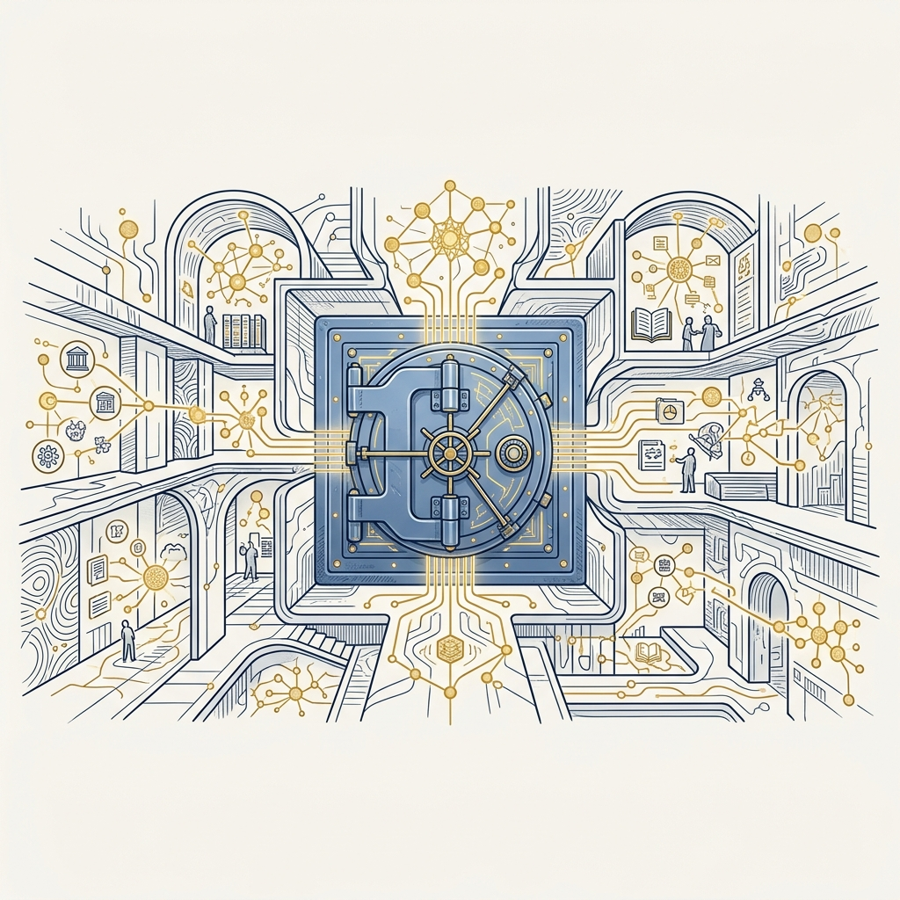
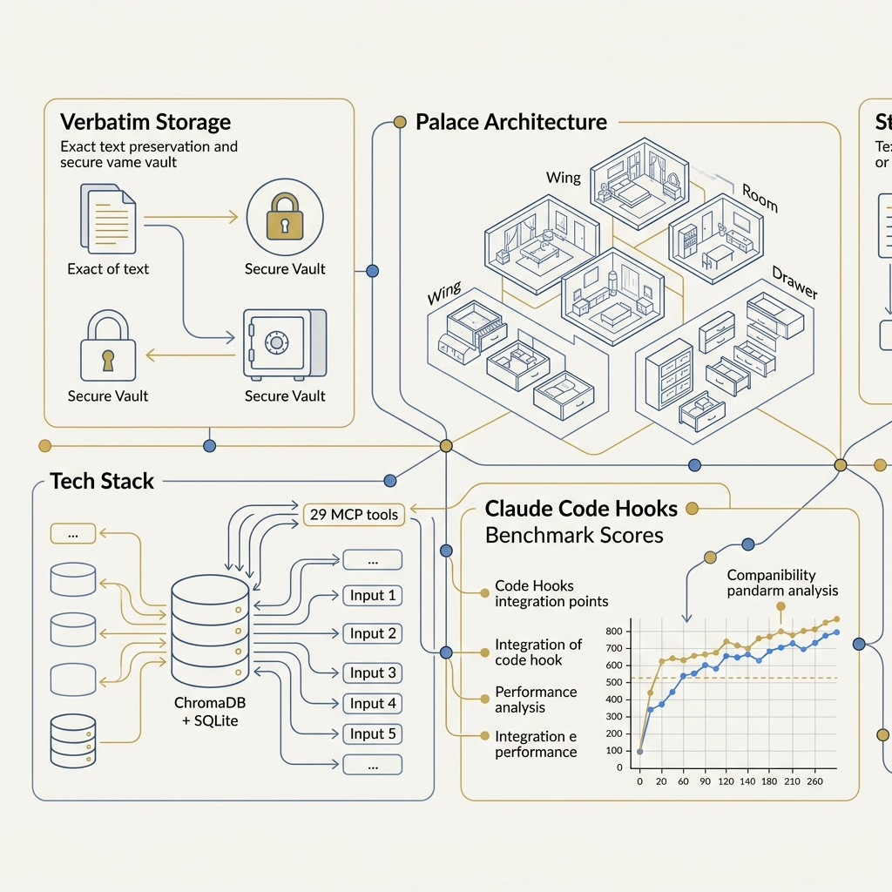
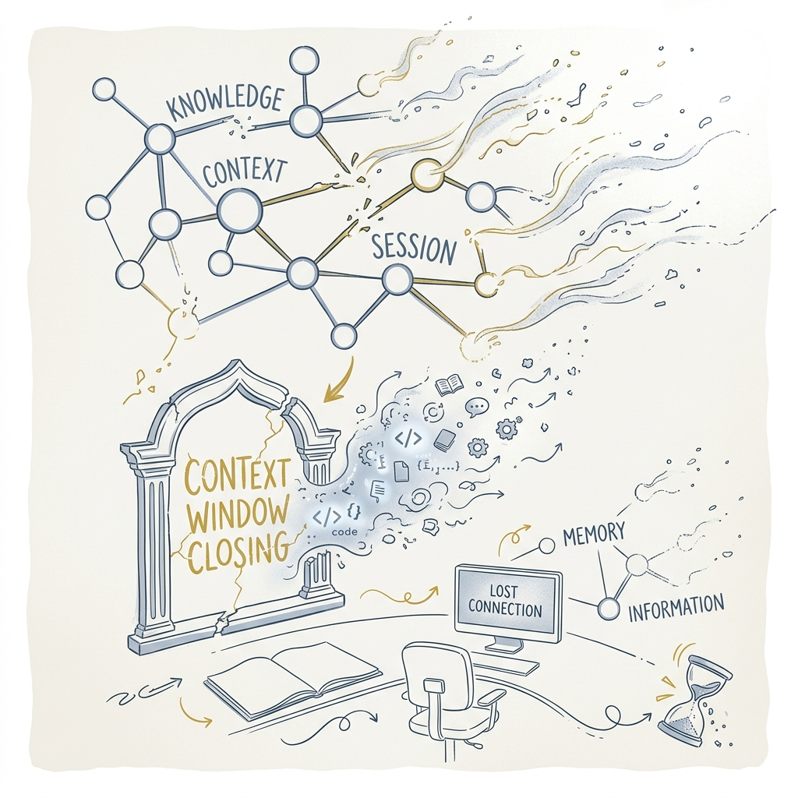
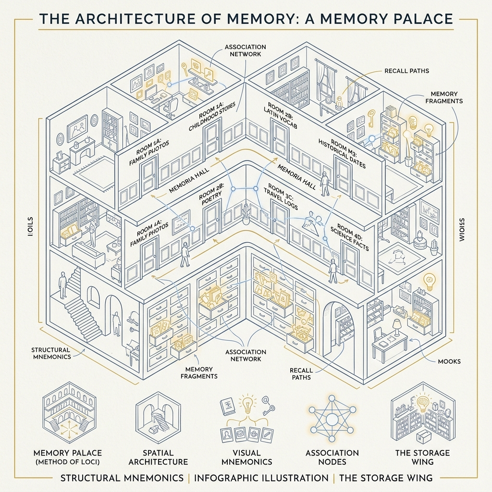

<!-- _class: title -->

# MemPalace

Local Lossless Long-term Memory — AI ที่จำทุกอย่างแบบคำต่อคำ

<!-- Speaker: MemPalace solves AI's fundamental amnesia problem — not by writing better summaries, but by storing everything verbatim and searching semantically. 30 seconds. -->

---

<!-- _class: cheatsheet -->
<!-- _backgroundColor: #f8f7f4 -->

<!-- Speaker: Your one-page reference. Key zones: Palace architecture top-left, tech stack center, 29 MCP tools right, benchmark scores bottom. Walk through before advancing. -->

---

## AI Loses Memory Every Session — MemPalace Fixes This

Stores conversations verbatim, retrieves semantically — nothing is ever summarized away.

<svg viewBox="0 0 1100 340" width="100%" xmlns="http://www.w3.org/2000/svg">
  <rect x="40" y="30" width="1020" height="280" rx="16" fill="var(--paper)" stroke="var(--soft-2)" stroke-width="1.5" style="filter:drop-shadow(0 4px 12px rgba(15,23,42,.08))"/>
  <rect x="40" y="30" width="8" height="280" rx="4" fill="var(--accent)"/>
  <circle cx="140" cy="170" r="44" fill="var(--accent)" opacity=".1"/>
  <circle cx="140" cy="170" r="30" fill="var(--accent)"/>
  <text x="140" y="176" font-size="20" fill="var(--paper)" text-anchor="middle" dominant-baseline="central" font-family="system-ui" font-weight="700">MP</text>
  <text x="220" y="148" font-size="22" font-weight="700" fill="var(--ink)" font-family="system-ui">Local-first · Verbatim · Semantic Retrieval</text>
  <text x="220" y="180" font-size="15" fill="var(--ink-dim)" font-family="system-ui">ChromaDB (vector) + SQLite (temporal KG) — runs entirely on your machine</text>
  <text x="220" y="210" font-size="15" fill="var(--muted)" font-family="system-ui">29 MCP tools · Claude Code hooks · MIT open source · Free</text>
  <rect x="760" y="70" width="260" height="200" rx="12" fill="var(--accent-wash)" stroke="var(--accent)" stroke-width="1.5"/>
  <text x="890" y="108" font-size="13" fill="var(--accent)" text-anchor="middle" font-family="system-ui" font-weight="700">LongMemEval R@5</text>
  <text x="890" y="148" font-size="40" fill="var(--accent)" text-anchor="middle" font-family="system-ui" font-weight="800">96.6%</text>
  <text x="890" y="188" font-size="12" fill="var(--ink-dim)" text-anchor="middle" font-family="system-ui">raw recall</text>
  <text x="890" y="218" font-size="12" fill="var(--muted)" text-anchor="middle" font-family="system-ui">98.4% hybrid</text>
  <rect x="40" y="30" width="1020" height="1" rx="0" fill="none"/>
</svg>

<b>★ Takeaway:</b> MemPalace ไม่สรุปความ — เก็บทุกอย่างก่อน ค้นหาเมื่อต้องการ ด้วย semantic search <100ms

<!-- Speaker: Three lines sum up MemPalace: local-first, verbatim storage, semantic retrieval. The 96.6% benchmark score is the headline claim. -->

---

## Context Window Closes — All Project Knowledge Disappears

Every session restart is a blank slate unless you have persistent, searchable storage.

<svg viewBox="0 0 680 300" width="100%" xmlns="http://www.w3.org/2000/svg">
  <rect x="20" y="20" width="290" height="120" rx="10" fill="var(--soft)" stroke="var(--soft-2)" stroke-width="1.5"/>
  <text x="165" y="56" font-size="13" font-weight="700" fill="var(--ink)" text-anchor="middle" font-family="system-ui">Session A</text>
  <text x="165" y="80" font-size="11" fill="var(--ink-dim)" text-anchor="middle" font-family="system-ui">API conventions</text>
  <text x="165" y="98" font-size="11" fill="var(--ink-dim)" text-anchor="middle" font-family="system-ui">Auth decisions</text>
  <text x="165" y="116" font-size="11" fill="var(--ink-dim)" text-anchor="middle" font-family="system-ui">Deployment config</text>
  <rect x="20" y="160" width="290" height="120" rx="10" fill="var(--paper)" stroke="var(--soft-2)" stroke-width="1.5" stroke-dasharray="6,4"/>
  <text x="165" y="196" font-size="13" font-weight="700" fill="var(--muted)" text-anchor="middle" font-family="system-ui">Session B</text>
  <text x="165" y="224" font-size="11" fill="var(--muted)" text-anchor="middle" font-family="system-ui">??? API conventions</text>
  <text x="165" y="242" font-size="11" fill="var(--muted)" text-anchor="middle" font-family="system-ui">??? Auth decisions</text>
  <text x="165" y="260" font-size="11" fill="var(--muted)" text-anchor="middle" font-family="system-ui">??? Deployment config</text>
  <text x="165" y="148" font-size="22" fill="var(--danger)" text-anchor="middle" font-family="system-ui" font-weight="700">X  Lost</text>
  <rect x="370" y="20" width="290" height="260" rx="10" fill="var(--success-wash)" stroke="var(--success)" stroke-width="1.5"/>
  <text x="515" y="56" font-size="13" font-weight="700" fill="var(--success-ink)" text-anchor="middle" font-family="system-ui">With MemPalace</text>
  <text x="515" y="86" font-size="11" fill="var(--ink-dim)" text-anchor="middle" font-family="system-ui">Session A — stored verbatim</text>
  <text x="515" y="116" font-size="22" fill="var(--success)" text-anchor="middle" font-family="system-ui" font-weight="800">+</text>
  <text x="515" y="148" font-size="11" fill="var(--ink-dim)" text-anchor="middle" font-family="system-ui">Session B — full recall</text>
  <text x="515" y="178" font-size="22" fill="var(--success)" text-anchor="middle" font-family="system-ui" font-weight="800">+</text>
  <text x="515" y="208" font-size="11" fill="var(--ink-dim)" text-anchor="middle" font-family="system-ui">Session N — cumulative</text>
  <text x="515" y="258" font-size="14" fill="var(--success-ink)" text-anchor="middle" font-family="system-ui" font-weight="700">Never forgets</text>
  <rect x="20" y="20" width="1" height="1" fill="none"/>
</svg>

<b>★ Takeaway:</b> CLAUDE.md ต้องเขียนด้วยมือและสรุปเอง — MemPalace เก็บทุกอย่างโดยอัตโนมัติ

<!-- Speaker: The problem isn't unique to Claude Code — any stateless AI assistant forgets between sessions. CLAUDE.md is a manual workaround; MemPalace automates it. -->

---

## Organize Memory as a Palace: Wing → Room → Drawer

Hierarchical semantics — AI navigates to relevant context, not just searches a flat store.

<svg viewBox="0 0 680 300" width="100%" xmlns="http://www.w3.org/2000/svg">
  <rect x="20" y="20" width="140" height="60" rx="10" fill="var(--accent)" opacity=".9"/>
  <text x="90" y="46" font-size="14" font-weight="700" fill="var(--paper)" text-anchor="middle" font-family="system-ui">Wing</text>
  <text x="90" y="68" font-size="11" fill="var(--paper)" text-anchor="middle" font-family="system-ui">Person / Project</text>
  <line x1="160" y1="50" x2="230" y2="50" stroke="var(--accent)" stroke-width="2" marker-end="url(#arr)"/>
  <defs>
    <marker id="arr" markerWidth="8" markerHeight="8" refX="6" refY="3" orient="auto">
      <path d="M0,0 L0,6 L8,3 z" fill="var(--accent)"/>
    </marker>
  </defs>
  <rect x="230" y="20" width="140" height="60" rx="10" fill="var(--accent)" opacity=".65"/>
  <text x="300" y="46" font-size="14" font-weight="700" fill="var(--paper)" text-anchor="middle" font-family="system-ui">Room</text>
  <text x="300" y="68" font-size="11" fill="var(--paper)" text-anchor="middle" font-family="system-ui">Topic / Context</text>
  <line x1="370" y1="50" x2="440" y2="50" stroke="var(--accent)" stroke-width="2" marker-end="url(#arr)"/>
  <rect x="440" y="20" width="140" height="60" rx="10" fill="var(--accent)" opacity=".4"/>
  <text x="510" y="46" font-size="14" font-weight="700" fill="var(--ink)" text-anchor="middle" font-family="system-ui">Drawer</text>
  <text x="510" y="68" font-size="11" fill="var(--ink-dim)" text-anchor="middle" font-family="system-ui">Individual Memory</text>
  <rect x="20" y="110" width="140" height="160" rx="10" fill="var(--soft)" stroke="var(--soft-2)" stroke-width="1.5"/>
  <text x="90" y="140" font-size="11" fill="var(--muted)" text-anchor="middle" font-family="system-ui" font-weight="700">Examples</text>
  <text x="90" y="162" font-size="11" fill="var(--ink-dim)" text-anchor="middle" font-family="system-ui">@alice</text>
  <text x="90" y="182" font-size="11" fill="var(--ink-dim)" text-anchor="middle" font-family="system-ui">myapp/</text>
  <text x="90" y="202" font-size="11" fill="var(--ink-dim)" text-anchor="middle" font-family="system-ui">project-x/</text>
  <rect x="230" y="110" width="140" height="160" rx="10" fill="var(--soft)" stroke="var(--soft-2)" stroke-width="1.5"/>
  <text x="300" y="140" font-size="11" fill="var(--muted)" text-anchor="middle" font-family="system-ui" font-weight="700">Examples</text>
  <text x="300" y="162" font-size="11" fill="var(--ink-dim)" text-anchor="middle" font-family="system-ui">auth</text>
  <text x="300" y="182" font-size="11" fill="var(--ink-dim)" text-anchor="middle" font-family="system-ui">database</text>
  <text x="300" y="202" font-size="11" fill="var(--ink-dim)" text-anchor="middle" font-family="system-ui">deploy</text>
  <rect x="440" y="110" width="140" height="160" rx="10" fill="var(--soft)" stroke="var(--soft-2)" stroke-width="1.5"/>
  <text x="510" y="140" font-size="11" fill="var(--muted)" text-anchor="middle" font-family="system-ui" font-weight="700">Examples</text>
  <text x="510" y="162" font-size="11" fill="var(--ink-dim)" text-anchor="middle" font-family="system-ui">Conversation turn</text>
  <text x="510" y="182" font-size="11" fill="var(--ink-dim)" text-anchor="middle" font-family="system-ui">File content</text>
  <text x="510" y="202" font-size="11" fill="var(--ink-dim)" text-anchor="middle" font-family="system-ui">Decision log</text>
  <rect x="20" y="20" width="1" height="1" fill="none"/>
</svg>

<b>★ Takeaway:</b> ลำดับชั้น Wing → Room → Drawer ทำให้ AI สามารถ "เดิน" หา context ได้อย่างมีทิศทาง ไม่ใช่แค่ text search แบบ flat

<!-- Speaker: The palace metaphor isn't cosmetic — it encodes semantic relationships. Querying a wing + room narrows search space dramatically before vector similarity kicks in. -->

---

## Verbatim Beats Summary — You Can't Retrieve What Was Never Stored

Summarization decides relevance upfront; verbatim storage decides at retrieval time.

<svg viewBox="0 0 1100 360" width="100%" xmlns="http://www.w3.org/2000/svg">
  <rect x="30" y="20" width="480" height="320" rx="12" fill="var(--paper)" stroke="var(--soft-2)" stroke-width="1.5" style="filter:drop-shadow(var(--shadow-sm))"/>
  <rect x="30" y="20" width="480" height="52" rx="12" fill="var(--soft)"/>
  <text x="270" y="50" font-size="16" font-weight="700" fill="var(--ink-dim)" text-anchor="middle" font-family="system-ui">Summary-based (Mem0 etc.)</text>
  <text x="70" y="100" font-size="13" fill="var(--ink-dim)" font-family="system-ui">LLM extracts key points</text>
  <text x="70" y="126" font-size="13" fill="var(--muted)" font-family="system-ui">Details discarded permanently</text>
  <text x="70" y="152" font-size="13" fill="var(--muted)" font-family="system-ui">Retrieval quality = summary quality</text>
  <text x="70" y="198" font-size="13" fill="var(--danger)" font-family="system-ui" font-weight="700">Costs: API call per memory</text>
  <text x="70" y="224" font-size="13" fill="var(--danger)" font-family="system-ui">$249/mo (Mem0 Pro)</text>
  <text x="70" y="270" font-size="13" fill="var(--ink-dim)" font-family="system-ui">LongMemEval R@5: depends on</text>
  <text x="70" y="292" font-size="13" fill="var(--muted)" font-family="system-ui">summary quality</text>
  <rect x="590" y="20" width="480" height="320" rx="12" fill="var(--paper)" stroke="var(--accent)" stroke-width="2" style="filter:drop-shadow(var(--shadow-md))"/>
  <rect x="590" y="20" width="480" height="52" rx="12" fill="var(--accent-wash)"/>
  <text x="830" y="50" font-size="16" font-weight="700" fill="var(--accent)" text-anchor="middle" font-family="system-ui">MemPalace (Verbatim)</text>
  <text x="630" y="100" font-size="13" fill="var(--ink)" font-family="system-ui">Stores full text, no summarization</text>
  <text x="630" y="126" font-size="13" fill="var(--ink)" font-family="system-ui">Zero information loss</text>
  <text x="630" y="152" font-size="13" fill="var(--ink)" font-family="system-ui">Semantic search via embeddings</text>
  <text x="630" y="198" font-size="13" fill="var(--success)" font-family="system-ui" font-weight="700">Cost: free (MIT) + local CPU</text>
  <text x="630" y="224" font-size="13" fill="var(--success)" font-family="system-ui">No API key required</text>
  <text x="630" y="270" font-size="13" fill="var(--accent)" font-family="system-ui" font-weight="700">LongMemEval R@5: 96.6% raw</text>
  <text x="630" y="292" font-size="13" fill="var(--accent)" font-family="system-ui">98.4% hybrid</text>
  <circle cx="550" cy="190" r="32" fill="var(--accent)"/>
  <text x="550" y="195" font-size="14" font-weight="700" fill="var(--paper)" text-anchor="middle" dominant-baseline="central" font-family="system-ui">VS</text>
  <rect x="30" y="20" width="1" height="1" fill="none"/>
</svg>

<b>★ Takeaway:</b> การสรุปตัดสินใจล่วงหน้าว่าอะไรสำคัญ — MemPalace ตัดสินใจที่จุด retrieval ซึ่งรู้ context จริงๆ

<!-- Speaker: The core insight: you can't predict at write-time what will matter at read-time. Verbatim stores everything; the retrieval model decides relevance. -->

---

## Local Stack: Sentence Transformers → ChromaDB + SQLite → 29 MCP Tools

All computation stays on-device — no API keys, no cloud, zero data egress.

<svg viewBox="0 0 1100 340" width="100%" xmlns="http://www.w3.org/2000/svg">
  <defs>
    <marker id="a" markerWidth="8" markerHeight="8" refX="6" refY="3" orient="auto">
      <path d="M0,0 L0,6 L8,3 z" fill="var(--accent)"/>
    </marker>
  </defs>
  <rect x="30" y="120" width="180" height="100" rx="12" fill="var(--paper)" stroke="var(--soft-2)" stroke-width="1.5" style="filter:drop-shadow(var(--shadow-sm))"/>
  <text x="120" y="158" font-size="12" font-weight="700" fill="var(--ink)" text-anchor="middle" font-family="system-ui">Conversation</text>
  <text x="120" y="178" font-size="11" fill="var(--ink-dim)" text-anchor="middle" font-family="system-ui">or Files</text>
  <line x1="210" y1="170" x2="265" y2="170" stroke="var(--accent)" stroke-width="2" marker-end="url(#a)"/>
  <rect x="265" y="100" width="220" height="140" rx="12" fill="var(--soft)" stroke="var(--accent)" stroke-width="1.5"/>
  <text x="375" y="138" font-size="12" font-weight="700" fill="var(--ink)" text-anchor="middle" font-family="system-ui">Sentence Transformers</text>
  <text x="375" y="160" font-size="11" fill="var(--ink-dim)" text-anchor="middle" font-family="system-ui">all-MiniLM-L6-v2</text>
  <text x="375" y="180" font-size="11" fill="var(--muted)" text-anchor="middle" font-family="system-ui">384-dim · CPU-only</text>
  <text x="375" y="200" font-size="11" fill="var(--muted)" text-anchor="middle" font-family="system-ui">~80MB (EN) / ~300MB (multi)</text>
  <line x1="485" y1="170" x2="540" y2="170" stroke="var(--accent)" stroke-width="2" marker-end="url(#a)"/>
  <rect x="540" y="80" width="200" height="120" rx="12" fill="var(--paper)" stroke="var(--soft-2)" stroke-width="1.5" style="filter:drop-shadow(var(--shadow-sm))"/>
  <text x="640" y="118" font-size="12" font-weight="700" fill="var(--accent)" text-anchor="middle" font-family="system-ui">ChromaDB</text>
  <text x="640" y="140" font-size="11" fill="var(--ink-dim)" text-anchor="middle" font-family="system-ui">Vector store</text>
  <text x="640" y="160" font-size="11" fill="var(--muted)" text-anchor="middle" font-family="system-ui">Semantic similarity</text>
  <text x="640" y="180" font-size="11" fill="var(--muted)" text-anchor="middle" font-family="system-ui">search</text>
  <rect x="540" y="220" width="200" height="120" rx="12" fill="var(--paper)" stroke="var(--soft-2)" stroke-width="1.5" style="filter:drop-shadow(var(--shadow-sm))"/>
  <text x="640" y="258" font-size="12" font-weight="700" fill="var(--gold)" text-anchor="middle" font-family="system-ui">SQLite</text>
  <text x="640" y="280" font-size="11" fill="var(--ink-dim)" text-anchor="middle" font-family="system-ui">Temporal KG</text>
  <text x="640" y="300" font-size="11" fill="var(--muted)" text-anchor="middle" font-family="system-ui">Validity windows</text>
  <line x1="740" y1="140" x2="800" y2="170" stroke="var(--accent)" stroke-width="2" marker-end="url(#a)"/>
  <line x1="740" y1="280" x2="800" y2="250" stroke="var(--accent)" stroke-width="2" marker-end="url(#a)"/>
  <rect x="800" y="120" width="240" height="100" rx="12" fill="var(--accent)" opacity=".9"/>
  <text x="920" y="158" font-size="13" font-weight="700" fill="var(--paper)" text-anchor="middle" font-family="system-ui">29 MCP Tools</text>
  <text x="920" y="180" font-size="11" fill="var(--paper)" text-anchor="middle" font-family="system-ui">Claude Code / ChatGPT / Cursor</text>
  <rect x="30" y="20" width="1" height="1" fill="none"/>
</svg>

<b>★ Takeaway:</b> ChromaDB จัดการ "อะไรที่คล้ายกัน" — SQLite จัดการ "อะไรที่ยังจริงอยู่ตอนนี้" ทั้งสองส่วนทำงานบนเครื่องทั้งหมด

<!-- Speaker: Two stores serve different query types: ChromaDB for semantic similarity, SQLite for temporal entity state. Neither needs cloud. -->

---

## 29 MCP Tools Give Claude Direct Memory Access

Five tool groups cover the full memory lifecycle — read, write, navigate, manage, and log.

  

    
Group 1

    <h3>Palace R/W</h3>
    
อ่าน/เขียน drawers และ rooms ใน palace โดยตรง

  

  

    
Group 2

    <h3>Knowledge Graph</h3>
    
เพิ่ม/query/invalidate temporal entities พร้อม validity window

  

  

    
Group 3

    <h3>Cross-Wing Nav</h3>
    
ข้าม project contexts ได้ เชื่อม knowledge ระหว่าง wings

  

  

    
Group 4

    <h3>Drawer Mgmt</h3>
    
organize, tag, expire memories ตาม relevance

  

  

    
Group 5

    <h3>Agent Diaries</h3>
    
structured log สำหรับ autonomous agents เก็บ action history

  

<b>★ Takeaway:</b> MCP ทำให้ Claude เข้าถึง memory เป็น first-class context — ไม่ต้อง paste history ด้วยมือ retrieval <100ms

<!-- Speaker: 29 tools sounds like a lot — but they group into five logical areas. The key win is that Claude calls these automatically via MCP; the user never pastes context manually. -->

---

## Hooks Auto-Save Before Context Compression — Sessions Never Expire

Two trigger points preserve every conversation turn before Claude loses access to it.

<svg viewBox="0 0 1100 320" width="100%" xmlns="http://www.w3.org/2000/svg">
  <defs>
    <marker id="b" markerWidth="8" markerHeight="8" refX="6" refY="3" orient="auto">
      <path d="M0,0 L0,6 L8,3 z" fill="var(--accent)"/>
    </marker>
  </defs>
  <rect x="30" y="110" width="200" height="100" rx="12" fill="var(--soft)" stroke="var(--soft-2)" stroke-width="1.5"/>
  <text x="130" y="150" font-size="13" font-weight="700" fill="var(--ink)" text-anchor="middle" font-family="system-ui">Claude Code</text>
  <text x="130" y="172" font-size="11" fill="var(--ink-dim)" text-anchor="middle" font-family="system-ui">Session active</text>
  <line x1="230" y1="160" x2="290" y2="110" stroke="var(--accent)" stroke-width="2" marker-end="url(#b)"/>
  <line x1="230" y1="160" x2="290" y2="220" stroke="var(--gold)" stroke-width="2" marker-end="url(#b)"/>
  <rect x="290" y="60" width="240" height="100" rx="12" fill="var(--accent-wash)" stroke="var(--accent)" stroke-width="1.5"/>
  <text x="410" y="96" font-size="12" font-weight="700" fill="var(--accent)" text-anchor="middle" font-family="system-ui">Hook 1: Periodic</text>
  <text x="410" y="118" font-size="11" fill="var(--ink-dim)" text-anchor="middle" font-family="system-ui">Saves turns during session</text>
  <text x="410" y="138" font-size="11" fill="var(--muted)" text-anchor="middle" font-family="system-ui">Runs at intervals</text>
  <rect x="290" y="185" width="240" height="100" rx="12" fill="var(--warning-wash)" stroke="var(--warning)" stroke-width="1.5"/>
  <text x="410" y="221" font-size="12" font-weight="700" fill="var(--warning-ink)" text-anchor="middle" font-family="system-ui">Hook 2: Pre-compression</text>
  <text x="410" y="243" font-size="11" fill="var(--ink-dim)" text-anchor="middle" font-family="system-ui">Before context compresses</text>
  <text x="410" y="263" font-size="11" fill="var(--muted)" text-anchor="middle" font-family="system-ui">mempalace sweep</text>
  <line x1="530" y1="110" x2="590" y2="160" stroke="var(--accent)" stroke-width="2" marker-end="url(#b)"/>
  <line x1="530" y1="235" x2="590" y2="195" stroke="var(--accent)" stroke-width="2" marker-end="url(#b)"/>
  <rect x="590" y="110" width="200" height="100" rx="12" fill="var(--paper)" stroke="var(--soft-2)" stroke-width="1.5" style="filter:drop-shadow(var(--shadow-sm))"/>
  <text x="690" y="150" font-size="12" font-weight="700" fill="var(--accent)" text-anchor="middle" font-family="system-ui">MemPalace</text>
  <text x="690" y="172" font-size="11" fill="var(--ink-dim)" text-anchor="middle" font-family="system-ui">Drawers created</text>
  <line x1="790" y1="160" x2="850" y2="160" stroke="var(--accent)" stroke-width="2" marker-end="url(#b)"/>
  <rect x="850" y="110" width="220" height="100" rx="12" fill="var(--success-wash)" stroke="var(--success)" stroke-width="1.5"/>
  <text x="960" y="150" font-size="12" font-weight="700" fill="var(--success-ink)" text-anchor="middle" font-family="system-ui">Next Session</text>
  <text x="960" y="172" font-size="11" fill="var(--ink-dim)" text-anchor="middle" font-family="system-ui">Full context recalled</text>
  <rect x="30" y="20" width="1" height="1" fill="none"/>
</svg>

<b>★ Takeaway:</b> Claude Code sessions expire ใน 30 วัน ถ้าไม่มี hooks — ต้อง setup ก่อนเริ่มงานจริง: <code>mempalace connect claude-code</code>

<!-- Speaker: The pre-compression hook is the critical one — it fires before Claude loses access to the conversation, sweeping everything into drawers before the window closes. -->

---

## Best-in-Class Recall: 96.6% on LongMemEval R@5

Top score among free open-source tools — verify independently before production adoption.

| Benchmark | Score | Mode | Notes |
|---|---|---|---|
| LongMemEval R@5 | **96.6%** | Raw (no reranking) | Self-reported |
| LongMemEval R@5 | **98.4%** | Hybrid (BM25+vector) | Self-reported |
| LoCoMo R@10 | **88.9%** | Hybrid | Self-reported |
| ConvoMem | **92.9%** | Average recall | Self-reported |
| MemBench ACL 2025 | **80.3%** | R@5 | Self-reported |

<b>★ Takeaway:</b> ตัวเลขมาจาก self-reported benchmarks — ควร cross-check กับ leaderboard อิสระก่อน adopt ใน production จริง

<!-- Speaker: Strong scores, but self-reported is a yellow flag. LongMemEval and MemBench are independent benchmarks — check current leaderboards before making a production commitment. -->

---

## Three Commands to Full Memory Integration

Install once, connect once — MemPalace runs silently in every subsequent session.

<svg viewBox="0 0 1100 300" width="100%" xmlns="http://www.w3.org/2000/svg">
  <defs>
    <marker id="c" markerWidth="8" markerHeight="8" refX="6" refY="3" orient="auto">
      <path d="M0,0 L0,6 L8,3 z" fill="var(--accent)"/>
    </marker>
  </defs>
  <rect x="30" y="60" width="280" height="180" rx="14" fill="var(--paper)" stroke="var(--accent)" stroke-width="2" style="filter:drop-shadow(var(--shadow-md))"/>
  <rect x="30" y="60" width="280" height="48" rx="14" fill="var(--accent)" opacity=".85"/>
  <text x="52" y="92" font-size="22" font-weight="800" fill="var(--paper)" font-family="system-ui">1</text>
  <text x="100" y="92" font-size="14" font-weight="700" fill="var(--paper)" font-family="system-ui">Install</text>
  <text x="60" y="136" font-size="12" fill="var(--ink)" font-family="monospace">uv tool install</text>
  <text x="60" y="158" font-size="12" fill="var(--ink)" font-family="monospace">  mempalace</text>
  <text x="60" y="194" font-size="11" fill="var(--muted)" font-family="system-ui">Python 3.9+ required</text>
  <text x="60" y="214" font-size="11" fill="var(--muted)" font-family="system-ui">~80-300MB model download</text>
  <line x1="310" y1="150" x2="380" y2="150" stroke="var(--accent)" stroke-width="2.5" marker-end="url(#c)"/>
  <rect x="380" y="60" width="280" height="180" rx="14" fill="var(--paper)" stroke="var(--accent)" stroke-width="2" style="filter:drop-shadow(var(--shadow-md))"/>
  <rect x="380" y="60" width="280" height="48" rx="14" fill="var(--accent)" opacity=".65"/>
  <text x="402" y="92" font-size="22" font-weight="800" fill="var(--paper)" font-family="system-ui">2</text>
  <text x="450" y="92" font-size="14" font-weight="700" fill="var(--paper)" font-family="system-ui">Initialize</text>
  <text x="410" y="136" font-size="12" fill="var(--ink)" font-family="monospace">mempalace init</text>
  <text x="410" y="158" font-size="12" fill="var(--ink)" font-family="monospace">  ~/projects/myapp</text>
  <text x="410" y="194" font-size="11" fill="var(--muted)" font-family="system-ui">Creates palace.db + vectors/</text>
  <text x="410" y="214" font-size="11" fill="var(--muted)" font-family="system-ui">at ~/.mempalace/</text>
  <line x1="660" y1="150" x2="730" y2="150" stroke="var(--accent)" stroke-width="2.5" marker-end="url(#c)"/>
  <rect x="730" y="60" width="320" height="180" rx="14" fill="var(--paper)" stroke="var(--success)" stroke-width="2" style="filter:drop-shadow(var(--shadow-md))"/>
  <rect x="730" y="60" width="320" height="48" rx="14" fill="var(--success)" opacity=".75"/>
  <text x="752" y="92" font-size="22" font-weight="800" fill="var(--paper)" font-family="system-ui">3</text>
  <text x="800" y="92" font-size="14" font-weight="700" fill="var(--paper)" font-family="system-ui">Connect</text>
  <text x="760" y="136" font-size="12" fill="var(--ink)" font-family="monospace">mempalace connect</text>
  <text x="760" y="158" font-size="12" fill="var(--ink)" font-family="monospace">  claude-code</text>
  <text x="760" y="194" font-size="11" fill="var(--muted)" font-family="system-ui">Auto-writes MCP config +</text>
  <text x="760" y="214" font-size="11" fill="var(--muted)" font-family="system-ui">wires hooks to settings.json</text>
  <rect x="30" y="20" width="1" height="1" fill="none"/>
</svg>

<b>★ Takeaway:</b> <code>mempalace connect claude-code</code> เขียน MCP config และ hooks ให้อัตโนมัติ — ไม่ต้อง edit settings.json ด้วยมือ

<!-- Speaker: Three commands, done once. After step 3, MemPalace runs silently on every Claude Code session. No manual context loading. -->

---

## Store in Natural Language — Recall Instantly in Any New Session

Tell Claude what to remember; ask in any future session — semantic search bridges the gap.

  

    
Store

    <h3>บันทึก project context</h3>
    
"Remember that our API uses snake_case for all endpoints and deploys to AWS us-east-1."

    
mempalace mine ./src

    
mempalace wake-up

  

  

    
Recall — new session

    <h3>ค้นหาใน session ใหม่</h3>
    
"What conventions does our API use?"

    
Claude retrieves via MCP · &lt;100ms · auto

    
No manual context paste needed

  

<b>★ Takeaway:</b> Natural language in → semantic search out — MemPalace translates human memory queries to vector similarity search transparently

<!-- Speaker: The UX is conversational. You don't write queries or manage indexes — you just tell Claude things and ask Claude things. MemPalace handles retrieval. -->

---

## No Cloud Backup, No Dashboard — Know the Limits Before You Commit

MemPalace excels for individual devs; Enterprise teams need additional tooling around it.

  

    
Risk

    <h3>No Cloud Backup</h3>
    
ข้อมูลอยู่ใน <code>~/.mempalace/</code> เท่านั้น — เครื่องพัง หรือ dir ถูกลบ = ข้อมูลหายทั้งหมด

    
Plan: manual backup script or rsync

  

  

    
Risk

    <h3>No Admin Dashboard</h3>
    
ไม่มี UI สำหรับ audit trail, permission management, หรือ multi-user control

    
Not ready for Enterprise without custom tooling

  

  

    
Constraint

    <h3>30-Day Session Expiry</h3>
    
Claude Code sessions expire ใน 30 วัน ถ้าไม่ setup auto-save hooks ครบถ้วน

    
Fix: <code>mempalace connect claude-code</code> ก่อนเริ่มงาน

  

<b>★ Takeaway:</b> เหมาะมากสำหรับ individual dev หรือ small team — Enterprise ต้องการ backup strategy + audit tooling เพิ่มเติม

<!-- Speaker: Three limits to know before adopting. None are blockers for individual use — but all three matter at Enterprise scale. Plan for them, don't discover them in production. -->

---

## MemPalace: AI That Remembers Everything, Runs Locally, Costs Nothing

Verbatim storage + semantic retrieval — the missing persistence layer for AI coding assistants.

<svg viewBox="0 0 1100 320" width="100%" xmlns="http://www.w3.org/2000/svg">
  <circle cx="550" cy="160" r="150" fill="none" stroke="var(--soft-2)" stroke-width="1.5"/>
  <circle cx="550" cy="160" r="100" fill="none" stroke="var(--accent)" stroke-width="1.5" opacity=".4"/>
  <circle cx="550" cy="160" r="55" fill="var(--accent)" opacity=".1"/>
  <circle cx="550" cy="160" r="55" fill="none" stroke="var(--accent)" stroke-width="2"/>
  <text x="550" y="154" font-size="13" font-weight="700" fill="var(--accent)" text-anchor="middle" font-family="system-ui">Verbatim</text>
  <text x="550" y="172" font-size="12" fill="var(--ink)" text-anchor="middle" font-family="system-ui">Lossless</text>
  <text x="380" y="92" font-size="13" fill="var(--ink)" font-family="system-ui" text-anchor="middle">Local-first</text>
  <text x="380" y="112" font-size="11" fill="var(--muted)" font-family="system-ui" text-anchor="middle">No cloud · Private</text>
  <text x="720" y="92" font-size="13" fill="var(--ink)" font-family="system-ui" text-anchor="middle">Semantic Search</text>
  <text x="720" y="112" font-size="11" fill="var(--muted)" font-family="system-ui" text-anchor="middle">&lt;100ms recall</text>
  <text x="240" y="160" font-size="13" fill="var(--muted)" font-family="system-ui" text-anchor="middle">29 MCP</text>
  <text x="240" y="180" font-size="11" fill="var(--muted)" font-family="system-ui" text-anchor="middle">tools</text>
  <text x="860" y="160" font-size="13" fill="var(--muted)" font-family="system-ui" text-anchor="middle">Free</text>
  <text x="860" y="180" font-size="11" fill="var(--muted)" font-family="system-ui" text-anchor="middle">MIT license</text>
  <text x="380" y="240" font-size="13" fill="var(--muted)" font-family="system-ui" text-anchor="middle">Claude Code</text>
  <text x="380" y="260" font-size="11" fill="var(--muted)" font-family="system-ui" text-anchor="middle">hooks</text>
  <text x="720" y="240" font-size="13" fill="var(--muted)" font-family="system-ui" text-anchor="middle">96.6%</text>
  <text x="720" y="260" font-size="11" fill="var(--muted)" font-family="system-ui" text-anchor="middle">recall score</text>
  <rect x="30" y="20" width="1" height="1" fill="none"/>
</svg>

<b>★ Takeaway:</b> เก็บ Verbatim, ค้นหา Semantic, ทำงาน Local — MemPalace คือ persistence layer ที่ AI coding assistant ขาดไปมาตลอด

<!-- Speaker: The core pitch in one sentence: lossless local memory, semantic retrieval, zero cost. Everything else is implementation detail. -->
