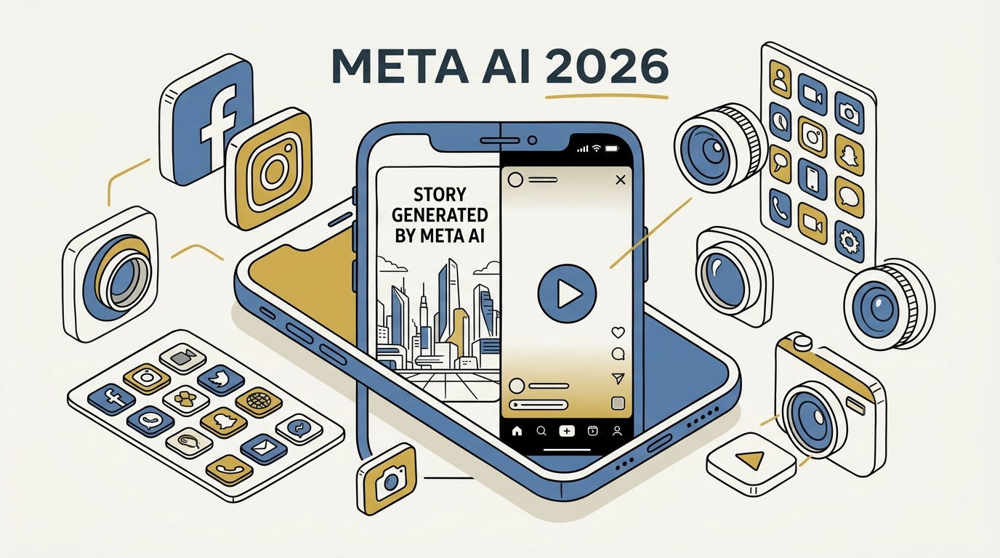
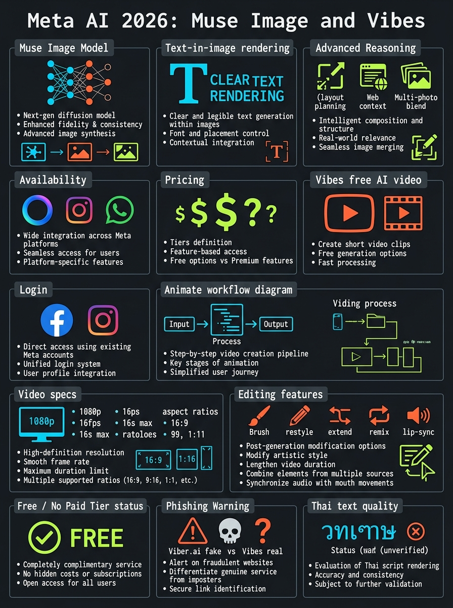
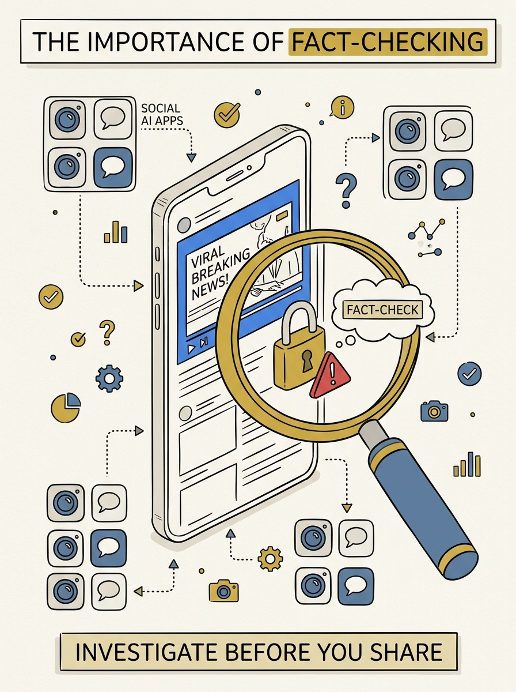
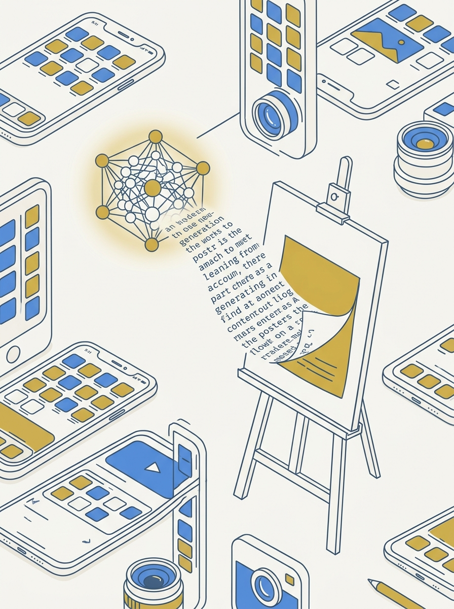

<!-- _class: title -->

# Meta AI 2026: Muse Image + Vibes

ข้อเท็จจริง vs คำกล่าวอ้าง — Muse Image เขียนข้อความในภาพได้จริง แต่ "Viber.ai" ไม่มีอยู่จริง

<!-- Speaker: 30-second intro — this deck fact-checks a viral claim about Meta AI's mid-2026 update, separating what's real (Muse Image, Vibes) from what's fabricated (Viber.ai). -->

---

<!-- _class: cheatsheet -->
<!-- _backgroundColor: #f8f7f4 -->

<!-- Speaker: 60-second cheatsheet orientation — point at Muse Image panel, Vibes panel, and the phishing-warning panel before advancing. -->

---

## TL;DR: 2 อัปเดตจริง, 1 คำกล่าวอ้างปลอม

Muse Image และ Vibes มีอยู่จริงและฟรี — แต่ "Viber.ai" ไม่ใช่ผลิตภัณฑ์ของ Meta

<svg viewBox="0 0 1100 380" width="100%" xmlns="http://www.w3.org/2000/svg">
  <rect x="60" y="40" width="460" height="300" rx="16" fill="var(--paper)" stroke="var(--success)" stroke-width="2" style="filter:drop-shadow(0 4px 12px rgba(15,23,42,.08))"/>
  <rect x="60" y="40" width="8" height="300" rx="4" fill="var(--success)"/>
  <circle cx="150" cy="120" r="30" fill="var(--success)"/>
  <text x="150" y="127" font-size="20" fill="var(--paper)" text-anchor="middle" font-family="system-ui" font-weight="700">2</text>
  <text x="200" y="115" font-size="19" font-weight="700" fill="var(--ink)" font-family="system-ui">Confirmed real</text>
  <text x="110" y="175" font-size="15" fill="var(--ink-dim)" font-family="system-ui">Muse Image — text-in-image model</text>
  <text x="110" y="205" font-size="15" fill="var(--ink-dim)" font-family="system-ui">Vibes — free AI video, FB/IG login</text>
  <text x="110" y="235" font-size="13" fill="var(--muted)" font-family="system-ui">Source: about.fb.com, ai.meta.com</text>
  <rect x="580" y="40" width="460" height="300" rx="16" fill="var(--paper)" stroke="var(--danger)" stroke-width="2" style="filter:drop-shadow(0 4px 12px rgba(15,23,42,.08))"/>
  <rect x="580" y="40" width="8" height="300" rx="4" fill="var(--danger)"/>
  <circle cx="670" cy="120" r="30" fill="var(--danger)"/>
  <text x="670" y="127" font-size="20" fill="var(--paper)" text-anchor="middle" font-family="system-ui" font-weight="700">1</text>
  <text x="720" y="115" font-size="19" font-weight="700" fill="var(--ink)" font-family="system-ui">Fabricated</text>
  <text x="630" y="175" font-size="15" fill="var(--ink-dim)" font-family="system-ui">"Viber.ai" video platform</text>
  <text x="630" y="205" font-size="15" fill="var(--ink-dim)" font-family="system-ui">CapCut-style timeline editor</text>
  <text x="630" y="235" font-size="13" fill="var(--muted)" font-family="system-ui">No source confirms either claim</text>
</svg>

<b>★ Takeaway:</b> อย่าล็อกอิน FB/IG บนเว็บที่ชื่อ "Viber.ai" — ชื่อจริงคือ Vibes ใน meta.ai เท่านั้น

<!-- Speaker: Set up the fact-check framing before diving into details. -->

---

## Background: ทำไมต้อง Fact-Check คลิปนี้ก่อน

คลิปต้นทางไม่มี transcript ให้ตรวจสอบ — ต้องเทียบกับแหล่งข้อมูลทางการของ Meta โดยตรง

<svg viewBox="0 0 700 320" width="100%" xmlns="http://www.w3.org/2000/svg">
  <circle cx="200" cy="130" r="70" fill="none" stroke="var(--accent)" stroke-width="4"/>
  <line x1="248" y1="178" x2="300" y2="230" stroke="var(--accent)" stroke-width="8" stroke-linecap="round"/>
  <text x="200" y="120" font-size="16" font-weight="700" fill="var(--accent)" text-anchor="middle" font-family="system-ui">No</text>
  <text x="200" y="142" font-size="16" font-weight="700" fill="var(--accent)" text-anchor="middle" font-family="system-ui">transcript</text>
  <rect x="380" y="60" width="280" height="200" rx="12" fill="var(--soft)" stroke="var(--soft-2)" stroke-width="1.5"/>
  <text x="520" y="100" font-size="14" font-weight="700" fill="var(--ink)" text-anchor="middle" font-family="system-ui">Verified instead:</text>
  <text x="410" y="140" font-size="13" fill="var(--ink-dim)" font-family="system-ui">Meta Newsroom</text>
  <text x="410" y="170" font-size="13" fill="var(--ink-dim)" font-family="system-ui">ai.meta.com/vibes</text>
  <text x="410" y="200" font-size="13" fill="var(--ink-dim)" font-family="system-ui">Meta Help Center</text>
  <text x="410" y="230" font-size="13" fill="var(--ink-dim)" font-family="system-ui">Bloomberg (2026-07-07)</text>
</svg>

<b>★ Takeaway:</b> ครึ่งแรกของคลิป (ภาพสร้างข้อความ) มีมูลจริง — ครึ่งหลัง ("Viber.ai" + timeline editor) ไม่มีอยู่จริง

<!-- Speaker: Explain the fact-check methodology before presenting findings. -->

---

## Muse Image: โมเดลสร้างภาพใหม่เขียนข้อความได้

ประกาศ 7 ก.ค. 2026 จาก Meta Superintelligence Labs — เก่งเรื่อง legible text ในภาพ

<svg viewBox="0 0 700 320" width="100%" xmlns="http://www.w3.org/2000/svg">
  <rect x="40" y="40" width="180" height="90" rx="10" fill="var(--accent-wash)" stroke="var(--accent)" stroke-width="1.5"/>
  <text x="130" y="75" font-size="13" font-weight="700" fill="var(--accent-deep)" text-anchor="middle" font-family="system-ui">Text-in-image</text>
  <text x="130" y="98" font-size="11" fill="var(--ink-dim)" text-anchor="middle" font-family="system-ui">Legible, clean render</text>
  <rect x="260" y="40" width="180" height="90" rx="10" fill="var(--accent-wash)" stroke="var(--accent)" stroke-width="1.5"/>
  <text x="350" y="75" font-size="13" font-weight="700" fill="var(--accent-deep)" text-anchor="middle" font-family="system-ui">Reasoning</text>
  <text x="350" y="98" font-size="11" fill="var(--ink-dim)" text-anchor="middle" font-family="system-ui">Layout + web context</text>
  <rect x="480" y="40" width="180" height="90" rx="10" fill="var(--accent-wash)" stroke="var(--accent)" stroke-width="1.5"/>
  <text x="570" y="75" font-size="13" font-weight="700" fill="var(--accent-deep)" text-anchor="middle" font-family="system-ui">Multi-photo</text>
  <text x="570" y="98" font-size="11" fill="var(--ink-dim)" text-anchor="middle" font-family="system-ui">Blend references</text>
  <rect x="40" y="160" width="620" height="110" rx="10" fill="var(--soft)" stroke="var(--soft-2)" stroke-width="1.5"/>
  <text x="60" y="192" font-size="13" font-weight="700" fill="var(--ink)" font-family="system-ui">Available: Meta AI app, Instagram Stories (30+ effects), WhatsApp</text>
  <text x="60" y="220" font-size="13" fill="var(--ink-dim)" font-family="system-ui">Coming soon: Facebook, Messenger, Advantage+</text>
  <text x="60" y="248" font-size="13" fill="var(--success-ink)" font-family="system-ui">Free for everyday use — subscription for heavy use</text>
</svg>

<b>★ Takeaway:</b> ข้อความในภาพ (อังกฤษ) ยืนยันแล้ว แต่คุณภาพเฉพาะภาษาไทยยังไม่มีแหล่งใดทดสอบ — ต้องลองเอง

<!-- Speaker: This is the real basis for the "Thai text" claim in the video — but flag the unverified part clearly. -->

---

## Vibes: จากรูปสู่วิดีโอด้วยปุ่ม Animate

workflow ทั้งหมดคือ prompt + ปุ่มกด — ไม่ใช่ timeline editor แบบ CapCut

<svg viewBox="0 0 1100 320" width="100%" xmlns="http://www.w3.org/2000/svg">
  <circle cx="140" cy="150" r="50" fill="var(--accent)"/>
  <text x="140" y="145" font-size="14" font-weight="700" fill="var(--paper)" text-anchor="middle" font-family="system-ui">Prompt /</text>
  <text x="140" y="162" font-size="14" font-weight="700" fill="var(--paper)" text-anchor="middle" font-family="system-ui">Upload</text>
  <line x1="200" y1="150" x2="330" y2="150" stroke="var(--muted)" stroke-width="3" marker-end="url(#arrow)"/>
  <circle cx="390" cy="150" r="50" fill="var(--accent)"/>
  <text x="390" y="156" font-size="14" font-weight="700" fill="var(--paper)" text-anchor="middle" font-family="system-ui">Select</text>
  <line x1="450" y1="150" x2="580" y2="150" stroke="var(--muted)" stroke-width="3" marker-end="url(#arrow)"/>
  <circle cx="640" cy="150" r="50" fill="var(--gold)"/>
  <text x="640" y="156" font-size="14" font-weight="700" fill="var(--paper)" text-anchor="middle" font-family="system-ui">Animate</text>
  <line x1="700" y1="150" x2="830" y2="150" stroke="var(--muted)" stroke-width="3" marker-end="url(#arrow)"/>
  <circle cx="890" cy="150" r="50" fill="var(--success)"/>
  <text x="890" y="156" font-size="14" font-weight="700" fill="var(--paper)" text-anchor="middle" font-family="system-ui">Share</text>
  <text x="140" y="230" font-size="12" fill="var(--ink-dim)" text-anchor="middle" font-family="system-ui">Text or photo</text>
  <text x="390" y="230" font-size="12" fill="var(--ink-dim)" text-anchor="middle" font-family="system-ui">Pick a version</text>
  <text x="640" y="230" font-size="12" fill="var(--ink-dim)" text-anchor="middle" font-family="system-ui">+ music/prompt</text>
  <text x="890" y="230" font-size="12" fill="var(--ink-dim)" text-anchor="middle" font-family="system-ui">Vibes feed / DM / FB+IG</text>
  <defs>
    <marker id="arrow" markerWidth="10" markerHeight="10" refX="8" refY="3" orient="auto"><path d="M0,0 L8,3 L0,6 Z" fill="var(--muted)"/></marker>
  </defs>
</svg>

<b>★ Takeaway:</b> เข้าใช้ที่ meta.ai หรือแอป Meta AI เท่านั้น ล็อกอินด้วยบัญชี Facebook หรือ Instagram ที่มีอยู่แล้ว

<!-- Speaker: Walk through the 4-tap workflow; emphasize meta.ai is the only real domain. -->

---

## Vibes: สเปกวิดีโอ, เครื่องมือแก้ไข, ราคา

Movie Gen 30B parameters — ฟรีทั้งหมด ไม่มี paid tier บังคับ

  

    
Video Specs

    <h3>1080p · 16fps</h3>
    
สูงสุด 16 วินาที, อัตราส่วน 1:1 / 9:16 / 16:9, เสียงยาวถึง 45 วินาที (Movie Gen 30B params)

  

  

    
Editing Tools

    <h3>Restyle · Extend · Remix</h3>
    
เปลี่ยนสไตล์, ขยายความยาว, remix คลิปคนอื่น, เพิ่มเพลง/เสียงพากย์/lip-sync

  

  

    
Pricing

    <h3>ฟรี 100%</h3>
    
ไม่มี paid tier บังคับสำหรับฟีเจอร์หลัก — ต่างจากที่คลิปอ้างว่า "แยกไปจัดการทรัพยากร"

  

<b>★ Takeaway:</b> Vibes อยู่ใน Meta AI มาตั้งแต่ ก.ย. 2025 ไม่ได้เพิ่งแยกตัวไปแพลตฟอร์มใหม่

<!-- Speaker: Emphasize the free-tier point and the launch-history correction. -->

---

## สรุปเทียบ: คำกล่าวอ้าง vs ข้อเท็จจริง

ทุกแถวตรวจสอบกับแหล่งข้อมูลทางการก่อนสรุป

| คำกล่าวอ้างในคลิป | ข้อเท็จจริงที่ตรวจสอบแล้ว |
|---|---|
| แพลตฟอร์มชื่อ "Viber.ai" | ไม่มีผลิตภัณฑ์นี้ — ชื่อจริงคือ **Vibes** ใน Meta AI app |
| Video Studio แบบ timeline คล้าย CapCut | ไม่พบหลักฐาน — เป็น prompt/ปุ่มกด ไม่ใช่ NLE |
| วิดีโอฟรี "แยก" ไปแพลตฟอร์มใหม่ | Vibes อยู่ใน Meta AI ตั้งแต่ ก.ย. 2025 |
| ล็อกอินผ่าน FB/IG ได้ทันที | **จริง** — แต่ใช้ที่ meta.ai เท่านั้น |
| สร้างข้อความไทยสวยงาม | Model จริงเก่งข้อความทั่วไป — คุณภาพไทยยังไม่ยืนยัน |

<b>★ Takeaway:</b> 3 ใน 5 คำกล่าวอ้างหลักไม่มีหลักฐานรองรับ — ตรวจสอบก่อนแชร์ทุกครั้ง

<!-- Speaker: This table is the core evidence slide — let it breathe, don't rush past it. -->

---

## ⚠ ระวัง Phishing: "Viber.ai" ไม่ใช่ของจริง

ชื่อคล้ายผลิตภัณฑ์จริงคือรูปแบบคลาสสิกของเว็บดักรหัสผ่าน

  
Security Warning

  <h3>อย่าล็อกอิน FB/IG นอก meta.ai</h3>
  <ul>
    <li>Vibes = ชื่อจริง อยู่ใน Meta AI app / meta.ai เท่านั้น</li>
    <li>"Viber.ai" = ไม่มีอยู่จริงในแหล่งข้อมูลทางการใด ๆ</li>
    <li>Viber (แอปแชท) เป็นของ Rakuten — ไม่เกี่ยวกับ Meta</li>
    <li>รูปแบบ "ฟรีไม่จำกัด + ล็อกอิน FB/IG" บนโดเมนแปลก = สัญญาณ phishing</li>
  </ul>

<b>★ Takeaway:</b> ก่อนล็อกอินด้วยบัญชี Facebook/Instagram ที่ไหนก็ตาม เช็กโดเมนให้ตรงกับ meta.ai หรือแอปทางการเสมอ

<!-- Speaker: This is the public-safety payoff of the whole fact-check — don't rush this slide. -->

---

## Key Takeaways

สรุปสิ่งที่ต้องจำแม้ข้ามเนื้อหาส่วนอื่น

<svg viewBox="0 0 1100 340" width="100%" xmlns="http://www.w3.org/2000/svg">
  <circle cx="550" cy="170" r="160" fill="none" stroke="var(--soft-2)" stroke-width="1.5"/>
  <circle cx="550" cy="170" r="110" fill="none" stroke="var(--accent)" stroke-width="1.5" opacity=".4"/>
  <circle cx="550" cy="170" r="60" fill="var(--accent)" opacity=".1"/>
  <circle cx="550" cy="170" r="60" fill="none" stroke="var(--accent)" stroke-width="2"/>
  <text x="550" y="164" font-size="15" font-weight="700" fill="var(--accent)" text-anchor="middle" font-family="system-ui">Muse Image</text>
  <text x="550" y="184" font-size="13" fill="var(--ink)" text-anchor="middle" font-family="system-ui">+ Vibes real</text>
  <text x="380" y="100" font-size="13" fill="var(--ink)" font-family="system-ui" text-anchor="middle">Free to use</text>
  <text x="380" y="120" font-size="12" fill="var(--muted)" font-family="system-ui" text-anchor="middle">meta.ai / app</text>
  <text x="730" y="100" font-size="13" fill="var(--ink)" font-family="system-ui" text-anchor="middle">Thai text</text>
  <text x="730" y="120" font-size="12" fill="var(--muted)" font-family="system-ui" text-anchor="middle">unverified</text>
  <text x="220" y="170" font-size="13" fill="var(--danger-ink)" font-family="system-ui" text-anchor="middle">"Viber.ai"</text>
  <text x="220" y="190" font-size="13" fill="var(--danger-ink)" font-family="system-ui" text-anchor="middle">= fake</text>
  <text x="880" y="170" font-size="13" fill="var(--ink)" font-family="system-ui" text-anchor="middle">No timeline</text>
  <text x="880" y="190" font-size="13" fill="var(--muted)" font-family="system-ui" text-anchor="middle">editor exists</text>
</svg>

<b>★ Takeaway:</b> Muse Image + Vibes จริงและฟรี — "Viber.ai" ปลอม อย่าล็อกอิน FB/IG ที่นั่นเด็ดขาด

<!-- Speaker: Close on the security message — it's the highest-stakes takeaway for readers. -->
