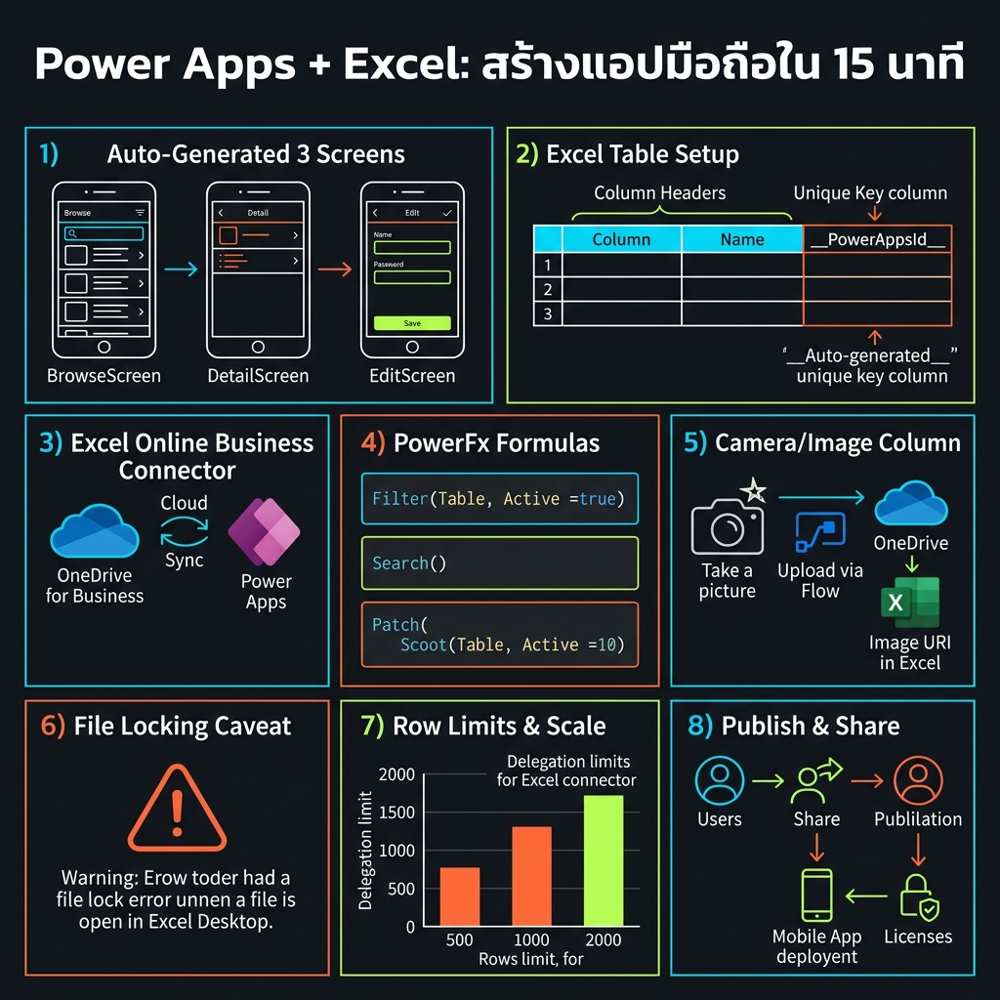
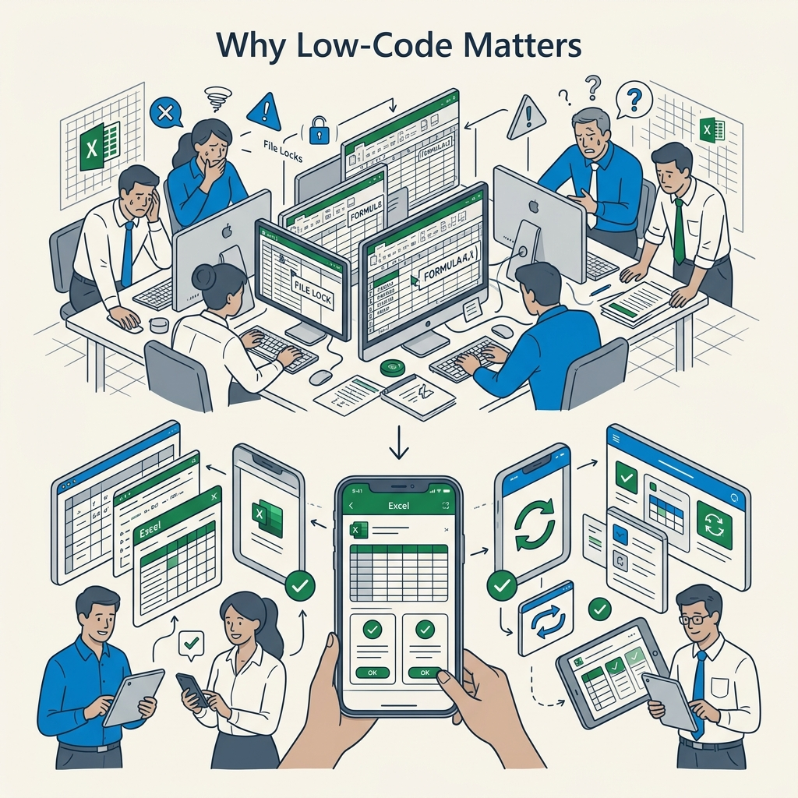

<!-- _class: title -->

# Power Apps + Excel

สร้างแอปมือถือ Low-Code ใน 15 นาที — ไม่ต้องเขียนโค้ดสักบรรทัด

<!-- Speaker: ถ้าองค์กรของคุณมี Excel อยู่บน OneDrive อยู่แล้ว คุณสามารถเปลี่ยนมันให้เป็นแอปมือถือได้ใน 15 นาทีโดยไม่ต้องเขียนโค้ด -->

---

<!-- _class: cheatsheet -->
<!-- _backgroundColor: #f8f7f4 -->

<!-- Speaker: ภาพรวมทั้งหมดของ deck นี้ — 8 ส่วนหลัก ตั้งแต่การเตรียม Excel ไปจนถึงข้อจำกัดที่ต้องรู้ -->

---

## TL;DR: Excel Table to Working Mobile App

Power Apps auto-generates 3 screens — browse, detail, edit — directly from your Excel table on OneDrive.

<svg viewBox="0 0 1100 300" width="100%" xmlns="http://www.w3.org/2000/svg">
  <rect x="40" y="30" width="310" height="240" rx="12" fill="var(--paper)" stroke="var(--soft-2)" stroke-width="1.5" style="filter:drop-shadow(var(--shadow-md))"/>
  <rect x="40" y="30" width="310" height="8" rx="4" fill="var(--accent)"/>
  <text x="195" y="110" font-size="52" font-weight="800" fill="var(--accent)" text-anchor="middle" font-family="system-ui">15</text>
  <text x="195" y="148" font-size="18" fill="var(--muted)" text-anchor="middle" font-family="system-ui">min</text>
  <text x="195" y="185" font-size="14" fill="var(--ink-dim)" text-anchor="middle" font-family="system-ui">Excel to live app</text>
  <text x="195" y="210" font-size="13" fill="var(--muted)" text-anchor="middle" font-family="system-ui">no code required</text>
  <rect x="395" y="30" width="310" height="240" rx="12" fill="var(--paper)" stroke="var(--soft-2)" stroke-width="1.5" style="filter:drop-shadow(var(--shadow-md))"/>
  <rect x="395" y="30" width="310" height="8" rx="4" fill="var(--success)"/>
  <text x="550" y="110" font-size="52" font-weight="800" fill="var(--success)" text-anchor="middle" font-family="system-ui">3</text>
  <text x="550" y="148" font-size="18" fill="var(--muted)" text-anchor="middle" font-family="system-ui">screens</text>
  <text x="550" y="185" font-size="14" fill="var(--ink-dim)" text-anchor="middle" font-family="system-ui">Browse / Detail / Edit</text>
  <text x="550" y="210" font-size="13" fill="var(--muted)" text-anchor="middle" font-family="system-ui">auto-generated</text>
  <rect x="750" y="30" width="310" height="240" rx="12" fill="var(--danger-wash)" stroke="var(--danger)" stroke-width="1.5" style="filter:drop-shadow(var(--shadow-md))"/>
  <rect x="750" y="30" width="310" height="8" rx="4" fill="var(--danger)"/>
  <text x="905" y="100" font-size="32" fill="var(--danger)" text-anchor="middle" font-family="system-ui">!</text>
  <text x="905" y="138" font-size="14" font-weight="700" fill="var(--danger-ink)" text-anchor="middle" font-family="system-ui">Close Excel First</text>
  <text x="905" y="168" font-size="13" fill="var(--danger-ink)" text-anchor="middle" font-family="system-ui">File lock = app error</text>
  <text x="905" y="195" font-size="12" fill="var(--muted)" text-anchor="middle" font-family="system-ui">always close before use</text>
  <rect x="0" y="0" width="1" height="1" fill="none"/>
</svg>

<b>★ Takeaway:</b> Excel table + OneDrive = mobile app in 15 min — ข้อจำกัดเดียวที่ต้องจำ: ต้องปิด Excel ก่อนใช้งานแอปทุกครั้ง

<!-- Speaker: 3 ตัวเลขที่ต้องจำ: 15 นาที, 3 screens auto-gen, และปิด Excel ก่อนเสมอ -->

---

## Why Power Apps: องค์กรจมอยู่กับ Excel แต่ Mobile ยุ่งยาก

Excel คือฐานข้อมูลที่ทุกคนรู้จัก — Power Apps คือ mobile layer ที่เข้าถึงได้จากทุกที่

<svg viewBox="0 0 700 280" width="100%" xmlns="http://www.w3.org/2000/svg">
  <rect x="20" y="50" width="260" height="180" rx="10" fill="var(--danger-wash)" stroke="var(--danger)" stroke-width="1.5"/>
  <text x="150" y="82" font-size="13" font-weight="700" fill="var(--danger-ink)" text-anchor="middle" font-family="system-ui">BEFORE</text>
  <text x="150" y="108" font-size="12" fill="var(--danger-ink)" text-anchor="middle" font-family="system-ui">Email xlsx back &amp; forth</text>
  <text x="150" y="132" font-size="12" fill="var(--danger-ink)" text-anchor="middle" font-family="system-ui">Version conflicts</text>
  <text x="150" y="156" font-size="12" fill="var(--danger-ink)" text-anchor="middle" font-family="system-ui">No mobile access</text>
  <text x="150" y="180" font-size="12" fill="var(--danger-ink)" text-anchor="middle" font-family="system-ui">No photo capture</text>
  <defs>
    <marker id="arr1" viewBox="0 0 10 10" refX="8" refY="5" markerWidth="6" markerHeight="6" orient="auto">
      <path d="M 0 0 L 10 5 L 0 10 Z" fill="var(--accent)"/>
    </marker>
  </defs>
  <path d="M 295 140 L 375 140" stroke="var(--accent)" stroke-width="2.5" fill="none" marker-end="url(#arr1)"/>
  <text x="335" y="130" font-size="11" fill="var(--accent)" text-anchor="middle" font-family="system-ui">Power</text>
  <text x="335" y="158" font-size="11" fill="var(--accent)" text-anchor="middle" font-family="system-ui">Apps</text>
  <rect x="395" y="50" width="280" height="180" rx="10" fill="var(--success-wash)" stroke="var(--success)" stroke-width="1.5"/>
  <text x="535" y="82" font-size="13" font-weight="700" fill="var(--success-ink)" text-anchor="middle" font-family="system-ui">AFTER</text>
  <text x="535" y="108" font-size="12" fill="var(--success-ink)" text-anchor="middle" font-family="system-ui">Mobile app iOS/Android</text>
  <text x="535" y="132" font-size="12" fill="var(--success-ink)" text-anchor="middle" font-family="system-ui">Single source of truth</text>
  <text x="535" y="156" font-size="12" fill="var(--success-ink)" text-anchor="middle" font-family="system-ui">Search, add, edit, delete</text>
  <text x="535" y="180" font-size="12" fill="var(--success-ink)" text-anchor="middle" font-family="system-ui">Photo to cloud instantly</text>
  <rect x="0" y="0" width="1" height="1" fill="none"/>
</svg>

<b>★ Takeaway:</b> Excel ไม่ต้องหนี — Power Apps เปลี่ยนมันเป็น mobile app โดยไม่ต้องย้ายข้อมูลไปไหน

<!-- Speaker: ทีม field อยู่ในสนาม ต้องการ mobile access แต่ข้อมูลอยู่ใน Excel ที่ออฟฟิส Power Apps เป็นสะพานที่เร็วที่สุด -->

---

## 3 Ways to Connect Excel to Power Apps

เลือกตามว่าต้องการ speed หรือ scalability — วิดีโอนี้ใช้วิธีที่ 2

  

    
Option 1

    <h3>Upload to Dataverse</h3>
    
Excel → Dataverse table. Cloud-native, secure, reusable across apps. Best for long-term production use. Max 5 GB upload.

  

  

    
Option 2 — Recommended

    <h3>Excel Online (Business)</h3>
    
ไฟล์ยังอยู่บน OneDrive. สร้างแอปได้ทันที. รองรับ 64K rows / 50MB. เร็วที่สุดสำหรับ prototype + team tools.

  

  

    
Option 3

    <h3>Blank Canvas + Manual</h3>
    
เริ่มจากหน้าว่าง เพิ่ม data connection เอง. Flexible สูงสุด แต่ต้องรู้ PowerFx. เหมาะสำหรับ custom UI.

  

<b>★ Takeaway:</b> Prototype/team tool → Excel Online (Business); Production at scale → Dataverse

<!-- Speaker: ถ้าเพิ่งเริ่มหรือทำ team tool ให้เลือก Option 2 เสมอ — เร็วที่สุดและยังย้ายไป Dataverse ได้ทีหลัง -->

---

## Auto-Generated 3 Screens: CRUD Ready Out of the Box

เชื่อมต่อ Excel table แล้ว Power Apps สร้าง 3 screens ให้อัตโนมัติ — ไม่ต้องออกแบบ UI เอง

  

    
Screen 1

    <h3>Browse Screen</h3>
    
แสดง list ทุก record พร้อม search box + sort button. กด row → ไป Detail screen.

    <ul>
      <li>Search(Table, text, "Col")</li>
      <li>SortByColumns()</li>
      <li>Gallery control</li>
    </ul>
  

  

    
Screen 2

    <h3>Detail Screen</h3>
    
ดูข้อมูล read-only ของ record ที่เลือก. มีปุ่ม Edit → Edit screen + Delete.

    <ul>
      <li>DisplayForm control</li>
      <li>BrowseGallery1.Selected</li>
      <li>Remove() for delete</li>
    </ul>
  

  

    
Screen 3

    <h3>Edit Screen</h3>
    
แก้ไข/เพิ่ม record ใหม่. EditForm control. Camera control เพิ่มได้ที่นี่.

    <ul>
      <li>SubmitForm(EditForm1)</li>
      <li>NewForm() for add</li>
      <li>ResetForm() for cancel</li>
    </ul>
  

<b>★ Takeaway:</b> 3 screens = CRUD สมบูรณ์ — Create, Read, Update, Delete พร้อมใช้ทันทีโดยไม่เขียนโค้ด

<!-- Speaker: นี่คือสิ่งที่ "low-code" หมายถึงจริงๆ — Power Apps เขียน UI logic ทั้งหมดให้คุณ คุณแค่เชื่อมต่อ table -->

---

## PowerFx Key Formulas: Excel Syntax, App Logic

PowerFx คือ Excel formula syntax ที่ถูก extend มาเป็น full reactive language — ถ้าใช้ Excel ได้ ก็เรียนรู้ได้เร็ว

<svg viewBox="0 0 1100 340" width="100%" xmlns="http://www.w3.org/2000/svg">
  <rect x="30" y="20" width="320" height="120" rx="10" fill="var(--paper)" stroke="var(--soft-2)" stroke-width="1.5" style="filter:drop-shadow(var(--shadow-sm))"/>
  <rect x="30" y="20" width="6" height="120" rx="3" fill="var(--accent)"/>
  <text x="52" y="50" font-size="12" font-weight="700" fill="var(--accent)" font-family="monospace">SEARCH</text>
  <text x="52" y="76" font-size="11" fill="var(--ink)" font-family="monospace">Search(</text>
  <text x="52" y="96" font-size="11" fill="var(--ink)" font-family="monospace">  Table, box.Text, "Col"</text>
  <text x="52" y="116" font-size="11" fill="var(--muted)" font-family="monospace">)</text>
  <rect x="390" y="20" width="320" height="120" rx="10" fill="var(--paper)" stroke="var(--soft-2)" stroke-width="1.5" style="filter:drop-shadow(var(--shadow-sm))"/>
  <rect x="390" y="20" width="6" height="120" rx="3" fill="var(--success)"/>
  <text x="412" y="50" font-size="12" font-weight="700" fill="var(--success)" font-family="monospace">SUBMIT</text>
  <text x="412" y="76" font-size="11" fill="var(--ink)" font-family="monospace">SubmitForm(EditForm1);</text>
  <text x="412" y="96" font-size="11" fill="var(--ink)" font-family="monospace">Navigate(ViewScreen,</text>
  <text x="412" y="116" font-size="11" fill="var(--ink)" font-family="monospace">  ScreenTransition.None)</text>
  <rect x="750" y="20" width="320" height="120" rx="10" fill="var(--paper)" stroke="var(--soft-2)" stroke-width="1.5" style="filter:drop-shadow(var(--shadow-sm))"/>
  <rect x="750" y="20" width="6" height="120" rx="3" fill="var(--danger)"/>
  <text x="772" y="50" font-size="12" font-weight="700" fill="var(--danger)" font-family="monospace">DELETE</text>
  <text x="772" y="76" font-size="11" fill="var(--ink)" font-family="monospace">Remove(</text>
  <text x="772" y="96" font-size="11" fill="var(--ink)" font-family="monospace">  Schedule,</text>
  <text x="772" y="116" font-size="11" fill="var(--ink)" font-family="monospace">  Gallery.Selected)</text>
  <rect x="210" y="200" width="320" height="120" rx="10" fill="var(--paper)" stroke="var(--soft-2)" stroke-width="1.5" style="filter:drop-shadow(var(--shadow-sm))"/>
  <rect x="210" y="200" width="6" height="120" rx="3" fill="var(--warning)"/>
  <text x="232" y="228" font-size="12" font-weight="700" fill="var(--warning-ink)" font-family="monospace">ADD NEW</text>
  <text x="232" y="254" font-size="11" fill="var(--ink)" font-family="monospace">NewForm(EditForm1);</text>
  <text x="232" y="274" font-size="11" fill="var(--ink)" font-family="monospace">Navigate(ChangeScreen,</text>
  <text x="232" y="294" font-size="11" fill="var(--ink)" font-family="monospace">  ScreenTransition.None)</text>
  <rect x="570" y="200" width="320" height="120" rx="10" fill="var(--paper)" stroke="var(--soft-2)" stroke-width="1.5" style="filter:drop-shadow(var(--shadow-sm))"/>
  <rect x="570" y="200" width="6" height="120" rx="3" fill="var(--accent)"/>
  <text x="592" y="228" font-size="12" font-weight="700" fill="var(--accent)" font-family="monospace">REFRESH</text>
  <text x="592" y="254" font-size="11" fill="var(--ink)" font-family="monospace">Refresh(Schedule)</text>
  <text x="592" y="278" font-size="12" fill="var(--muted)" font-family="system-ui">// call on OnSelect</text>
  <text x="592" y="302" font-size="12" fill="var(--muted)" font-family="system-ui">// of refresh button</text>
  <rect x="0" y="0" width="1" height="1" fill="none"/>
</svg>

<b>★ Takeaway:</b> PowerFx ใช้ syntax เดียวกับ Excel — ถ้าเขียน VLOOKUP ได้ ก็เขียน Search() และ SubmitForm() ได้

<!-- Speaker: Power Apps ไม่ใช่ programming language ใหม่ มันเป็น Excel formula ที่ขยายออกไปครอบ UI events -->

---

## Connector Showdown: Pick the Right One

Connector ที่เลือกกำหนด row limit, error rate, และ file size — เลือกผิดแก้ได้แต่เสียเวลา

<svg viewBox="0 0 1100 300" width="100%" xmlns="http://www.w3.org/2000/svg">
  <rect x="40" y="20" width="460" height="260" rx="12" fill="var(--paper)" stroke="var(--soft-2)" stroke-width="1.5" style="filter:drop-shadow(var(--shadow-sm))"/>
  <rect x="40" y="20" width="460" height="52" rx="12" fill="var(--soft)" opacity=".8"/>
  <text x="270" y="53" font-size="16" font-weight="700" fill="var(--ink-dim)" text-anchor="middle" font-family="system-ui">OneDrive for Business</text>
  <text x="270" y="96" font-size="13" fill="var(--ink-dim)" text-anchor="middle" font-family="system-ui">Max: ~2 MB / ~2,000 rows</text>
  <text x="270" y="124" font-size="13" fill="var(--ink-dim)" text-anchor="middle" font-family="system-ui">File lock errors: common</text>
  <text x="270" y="152" font-size="13" fill="var(--ink-dim)" text-anchor="middle" font-family="system-ui">Adds __PowerAppsId__ column</text>
  <text x="270" y="180" font-size="13" fill="var(--ink-dim)" text-anchor="middle" font-family="system-ui">Not recommended for new apps</text>
  <text x="270" y="252" font-size="22" fill="var(--danger)" text-anchor="middle" font-family="system-ui">AVOID</text>
  <rect x="600" y="20" width="460" height="260" rx="12" fill="var(--success-wash)" stroke="var(--success)" stroke-width="2" style="filter:drop-shadow(var(--shadow-md))"/>
  <rect x="600" y="20" width="460" height="52" rx="12" fill="var(--success)" opacity=".15"/>
  <text x="830" y="53" font-size="16" font-weight="700" fill="var(--success-ink)" text-anchor="middle" font-family="system-ui">Excel Online (Business)</text>
  <text x="830" y="96" font-size="13" fill="var(--success-ink)" text-anchor="middle" font-family="system-ui">Max: 50 MB / 64,000 rows</text>
  <text x="830" y="124" font-size="13" fill="var(--success-ink)" text-anchor="middle" font-family="system-ui">File lock errors: much less</text>
  <text x="830" y="152" font-size="13" fill="var(--success-ink)" text-anchor="middle" font-family="system-ui">No extra column added</text>
  <text x="830" y="180" font-size="13" fill="var(--success-ink)" text-anchor="middle" font-family="system-ui">Recommended for all new apps</text>
  <text x="830" y="252" font-size="22" fill="var(--success)" text-anchor="middle" font-family="system-ui">USE THIS</text>
  <circle cx="550" cy="150" r="32" fill="var(--accent)"/>
  <text x="550" y="157" font-size="15" font-weight="700" fill="white" text-anchor="middle" dominant-baseline="central" font-family="system-ui">VS</text>
  <rect x="0" y="0" width="1" height="1" fill="none"/>
</svg>

<b>★ Takeaway:</b> ใช้ Excel Online (Business) connector เท่านั้น — รองรับ 32x มากกว่า, error น้อยกว่า, ไม่เพิ่ม column ขยะ

<!-- Speaker: ความผิดพลาดที่พบบ่อยที่สุดคือเลือก OneDrive for Business connector ซึ่งดูคล้ายกัน แต่ต่างกันมาก -->

---

## Step-by-Step: Excel to App in 4 Phases

ทั้ง 4 ขั้นตอนใช้เวลารวมประมาณ 15 นาทีสำหรับ Excel ที่เตรียมไว้แล้ว

<svg viewBox="0 0 1100 260" width="100%" xmlns="http://www.w3.org/2000/svg">
  <defs>
    <marker id="a2" viewBox="0 0 10 10" refX="8" refY="5" markerWidth="6" markerHeight="6" orient="auto">
      <path d="M0 0 L10 5 L0 10Z" fill="var(--accent)"/>
    </marker>
  </defs>
  <rect x="30" y="50" width="210" height="160" rx="10" fill="var(--paper)" stroke="var(--accent)" stroke-width="2" style="filter:drop-shadow(var(--shadow-sm))"/>
  <circle cx="135" cy="90" r="22" fill="var(--accent)"/>
  <text x="135" y="96" font-size="18" font-weight="800" fill="white" text-anchor="middle" font-family="system-ui">1</text>
  <text x="135" y="130" font-size="13" font-weight="700" fill="var(--ink)" text-anchor="middle" font-family="system-ui">Prepare Excel</text>
  <text x="135" y="152" font-size="11" fill="var(--ink-dim)" text-anchor="middle" font-family="system-ui">Format as Table</text>
  <text x="135" y="172" font-size="11" fill="var(--muted)" text-anchor="middle" font-family="system-ui">Upload to OneDrive</text>
  <path d="M 255 130 L 305 130" stroke="var(--accent)" stroke-width="2" fill="none" marker-end="url(#a2)"/>
  <rect x="315" y="50" width="210" height="160" rx="10" fill="var(--paper)" stroke="var(--accent)" stroke-width="2" style="filter:drop-shadow(var(--shadow-sm))"/>
  <circle cx="420" cy="90" r="22" fill="var(--accent)"/>
  <text x="420" y="96" font-size="18" font-weight="800" fill="white" text-anchor="middle" font-family="system-ui">2</text>
  <text x="420" y="130" font-size="13" font-weight="700" fill="var(--ink)" text-anchor="middle" font-family="system-ui">Create App</text>
  <text x="420" y="152" font-size="11" fill="var(--ink-dim)" text-anchor="middle" font-family="system-ui">make.powerapps.com</text>
  <text x="420" y="172" font-size="11" fill="var(--muted)" text-anchor="middle" font-family="system-ui">Start with data</text>
  <path d="M 540 130 L 590 130" stroke="var(--accent)" stroke-width="2" fill="none" marker-end="url(#a2)"/>
  <rect x="600" y="50" width="210" height="160" rx="10" fill="var(--paper)" stroke="var(--accent)" stroke-width="2" style="filter:drop-shadow(var(--shadow-sm))"/>
  <circle cx="705" cy="90" r="22" fill="var(--accent)"/>
  <text x="705" y="96" font-size="18" font-weight="800" fill="white" text-anchor="middle" font-family="system-ui">3</text>
  <text x="705" y="130" font-size="13" font-weight="700" fill="var(--ink)" text-anchor="middle" font-family="system-ui">Test &amp; Customize</text>
  <text x="705" y="152" font-size="11" fill="var(--ink-dim)" text-anchor="middle" font-family="system-ui">F5 Preview mode</text>
  <text x="705" y="172" font-size="11" fill="var(--muted)" text-anchor="middle" font-family="system-ui">Add Camera control</text>
  <path d="M 825 130 L 875 130" stroke="var(--accent)" stroke-width="2" fill="none" marker-end="url(#a2)"/>
  <rect x="885" y="50" width="185" height="160" rx="10" fill="var(--success-wash)" stroke="var(--success)" stroke-width="2" style="filter:drop-shadow(var(--shadow-sm))"/>
  <circle cx="977" cy="90" r="22" fill="var(--success)"/>
  <text x="977" y="96" font-size="18" font-weight="800" fill="white" text-anchor="middle" font-family="system-ui">4</text>
  <text x="977" y="130" font-size="13" font-weight="700" fill="var(--success-ink)" text-anchor="middle" font-family="system-ui">Publish &amp; Share</text>
  <text x="977" y="152" font-size="11" fill="var(--success-ink)" text-anchor="middle" font-family="system-ui">File → Publish</text>
  <text x="977" y="172" font-size="11" fill="var(--muted)" text-anchor="middle" font-family="system-ui">iOS / Android ready</text>
  <rect x="0" y="0" width="1" height="1" fill="none"/>
</svg>

<b>★ Takeaway:</b> ขั้นตอนที่ 1 เตรียม Excel ถูกต้อง (format as Table, ปิดไฟล์) คือ 80% ของความสำเร็จ

<!-- Speaker: ส่วนใหญ่ที่ติดปัญหาติดที่ Step 1 — ไม่ได้ format เป็น Table หรือลืมปิดไฟล์ -->

---

## User Guide: Step-by-Step Detail

รายละเอียดแต่ละขั้นตอนที่ต้องทำจริงใน Power Apps Studio

  

    
Step 1 — Prepare Excel

    <h3>Format Data as Table</h3>
    
Insert → Table → My table has headers. ตั้งชื่อ Table ที่ Name Box. บันทึกไฟล์ → <b>ปิดไฟล์ก่อน!</b> อัปโหลดหรือบันทึกบน OneDrive for Business.

  

  

    
Step 2 — Create App

    <h3>Start with data → Excel Online</h3>
    
make.powerapps.com → Start with data → Excel Online (Business) → เลือก file → เลือก table → Create app. รอ 30–60 วินาที.

  

  

    
Step 3 — Test &amp; Customize

    <h3>Preview + Add Camera</h3>
    
F5 หรือ ▶ Preview. ทดสอบ search, add, edit, delete. เพิ่ม Camera: Insert → Media → Camera บน Edit screen. ตั้งชื่อ column เป็น <code>Photo [image]</code>.

  

  

    
Step 4 — Publish &amp; Share

    <h3>File → Publish → Share</h3>
    
File → Save → ตั้งชื่อ. File → Publish this version. File → Share → ใส่ email ผู้ใช้. ติดตั้ง Power Apps บน iOS/Android แล้วล็อกอิน.

  

<b>★ Takeaway:</b> Image column: ตั้งชื่อ header เป็น <code>Photo [image]</code> ใน Excel — Power Apps จะ bind Camera control ให้อัตโนมัติ

<!-- Speaker: Camera เป็น feature ที่คนงงมากที่สุด — ความลับอยู่ที่ naming convention [image] ใน Excel header -->

---

## Caveats: 6 Limits to Know Before You Deploy

Excel connector เหมาะกับ small team — รู้ขีดจำกัดก่อนเพื่อวางแผน scale ที่ถูกต้อง

  

    
Critical

    <h3>Close Excel First</h3>
    
Excel lock ไฟล์ขณะเปิด → Power Apps error ทันที. ต้องปิด Excel ทุกครั้งก่อนรันแอป. <b>No workaround.</b>

  

  

    
Scale Limit

    <h3>64K Rows Max</h3>
    
Excel Online (Business) รองรับสูงสุด 64,000 rows. เกินนี้ต้องย้ายไป Dataverse หรือ SharePoint List.

  

  

    
Multi-user

    <h3>Write Conflicts</h3>
    
หลายคนเขียนพร้อมกันอาจเกิด race condition. ไม่เหมาะกับ high-concurrency. ใช้ Dataverse แทนถ้า user &gt; 20.

  

  

    
Formula Limit

    <h3>No Calculated Cols</h3>
    
Column ที่มี formula ใน Excel ใช้ใน Power Apps ไม่ได้. ต้องเป็น static data หรือคำนวณใน PowerFx แทน.

  

  

    
Filter Limit

    <h3>No Date / Multi-filter</h3>
    
Excel connector ไม่ support filter by date column หรือ multi-column filter แบบ native. ต้องทำ workaround.

  

  

    
M365 License

    <h3>Free with Microsoft 365</h3>
    
Excel + OneDrive use case ไม่ต้องซื้อ Power Apps premium license ถ้าองค์กรมี M365 แล้ว.

  

<b>★ Takeaway:</b> Excel connector ดีที่สุดสำหรับ &lt;2,000 rows, &lt;20 users — เกินนี้ Dataverse คุ้มค่ากว่าชัดเจน

<!-- Speaker: ข้อจำกัดเหล่านี้ไม่ใช่ bug แต่เป็น design trade-off — Excel ไม่ได้ออกแบบมาเป็น database ตั้งแต่แรก -->

---

## Key Takeaways: Power Apps + Excel Essentials

7 สิ่งที่ต้องจำเมื่อออกจาก session นี้

<svg viewBox="0 0 1100 320" width="100%" xmlns="http://www.w3.org/2000/svg">
  <rect x="20" y="20" width="240" height="120" rx="8" fill="var(--paper)" stroke="var(--soft-2)" stroke-width="1.5" style="filter:drop-shadow(var(--shadow-sm))"/>
  <rect x="20" y="20" width="6" height="120" rx="3" fill="var(--accent)"/>
  <text x="40" y="48" font-size="22" font-weight="800" fill="var(--accent)" font-family="system-ui">1</text>
  <text x="40" y="74" font-size="12" font-weight="700" fill="var(--ink)" font-family="system-ui">15 min Excel</text>
  <text x="40" y="94" font-size="12" fill="var(--ink-dim)" font-family="system-ui">to working app</text>
  <text x="40" y="114" font-size="11" fill="var(--muted)" font-family="system-ui">no code needed</text>
  <rect x="285" y="20" width="240" height="120" rx="8" fill="var(--paper)" stroke="var(--soft-2)" stroke-width="1.5" style="filter:drop-shadow(var(--shadow-sm))"/>
  <rect x="285" y="20" width="6" height="120" rx="3" fill="var(--danger)"/>
  <text x="305" y="48" font-size="22" font-weight="800" fill="var(--danger)" font-family="system-ui">2</text>
  <text x="305" y="74" font-size="12" font-weight="700" fill="var(--danger-ink)" font-family="system-ui">Close Excel</text>
  <text x="305" y="94" font-size="12" fill="var(--danger-ink)" font-family="system-ui">before every use</text>
  <text x="305" y="114" font-size="11" fill="var(--muted)" font-family="system-ui">#1 gotcha</text>
  <rect x="550" y="20" width="240" height="120" rx="8" fill="var(--paper)" stroke="var(--soft-2)" stroke-width="1.5" style="filter:drop-shadow(var(--shadow-sm))"/>
  <rect x="550" y="20" width="6" height="120" rx="3" fill="var(--success)"/>
  <text x="570" y="48" font-size="22" font-weight="800" fill="var(--success)" font-family="system-ui">3</text>
  <text x="570" y="74" font-size="12" font-weight="700" fill="var(--ink)" font-family="system-ui">Excel Online Biz</text>
  <text x="570" y="94" font-size="12" fill="var(--ink-dim)" font-family="system-ui">not OneDrive conn.</text>
  <text x="570" y="114" font-size="11" fill="var(--muted)" font-family="system-ui">64K rows / 50MB</text>
  <rect x="815" y="20" width="240" height="120" rx="8" fill="var(--paper)" stroke="var(--soft-2)" stroke-width="1.5" style="filter:drop-shadow(var(--shadow-sm))"/>
  <rect x="815" y="20" width="6" height="120" rx="3" fill="var(--warning)"/>
  <text x="835" y="48" font-size="22" font-weight="800" fill="var(--warning-ink)" font-family="system-ui">4</text>
  <text x="835" y="74" font-size="12" font-weight="700" fill="var(--ink)" font-family="system-ui">Photo [image]</text>
  <text x="835" y="94" font-size="12" fill="var(--ink-dim)" font-family="system-ui">column naming trick</text>
  <text x="835" y="114" font-size="11" fill="var(--muted)" font-family="system-ui">auto-binds Camera</text>
  <rect x="155" y="175" width="240" height="120" rx="8" fill="var(--paper)" stroke="var(--soft-2)" stroke-width="1.5" style="filter:drop-shadow(var(--shadow-sm))"/>
  <rect x="155" y="175" width="6" height="120" rx="3" fill="var(--accent)"/>
  <text x="175" y="203" font-size="22" font-weight="800" fill="var(--accent)" font-family="system-ui">5</text>
  <text x="175" y="229" font-size="12" font-weight="700" fill="var(--ink)" font-family="system-ui">3 auto screens</text>
  <text x="175" y="249" font-size="12" fill="var(--ink-dim)" font-family="system-ui">Browse-Detail-Edit</text>
  <text x="175" y="269" font-size="11" fill="var(--muted)" font-family="system-ui">CRUD ready</text>
  <rect x="420" y="175" width="240" height="120" rx="8" fill="var(--paper)" stroke="var(--soft-2)" stroke-width="1.5" style="filter:drop-shadow(var(--shadow-sm))"/>
  <rect x="420" y="175" width="6" height="120" rx="3" fill="var(--success)"/>
  <text x="440" y="203" font-size="22" font-weight="800" fill="var(--success)" font-family="system-ui">6</text>
  <text x="440" y="229" font-size="12" font-weight="700" fill="var(--ink)" font-family="system-ui">Format as Table</text>
  <text x="440" y="249" font-size="12" fill="var(--ink-dim)" font-family="system-ui">prerequisite #1</text>
  <text x="440" y="269" font-size="11" fill="var(--muted)" font-family="system-ui">nothing works without it</text>
  <rect x="685" y="175" width="240" height="120" rx="8" fill="var(--paper)" stroke="var(--soft-2)" stroke-width="1.5" style="filter:drop-shadow(var(--shadow-sm))"/>
  <rect x="685" y="175" width="6" height="120" rx="3" fill="var(--gold)"/>
  <text x="705" y="203" font-size="22" font-weight="800" fill="var(--gold)" font-family="system-ui">7</text>
  <text x="705" y="229" font-size="12" font-weight="700" fill="var(--ink)" font-family="system-ui">Scale path clear</text>
  <text x="705" y="249" font-size="12" fill="var(--ink-dim)" font-family="system-ui">Excel → Dataverse</text>
  <text x="705" y="269" font-size="11" fill="var(--muted)" font-family="system-ui">when ready to grow</text>
  <rect x="0" y="0" width="1" height="1" fill="none"/>
</svg>

<b>★ Takeaway:</b> ปิด Excel + format as Table + ใช้ Excel Online connector = 15 นาทีสู่แอปมือถือที่ใช้งานได้จริง

<!-- Speaker: จบแล้ว — 2 กฎทอง: 1) format as Table ก่อนเชื่อมต่อ 2) ปิด Excel ก่อนรันแอปทุกครั้ง -->
