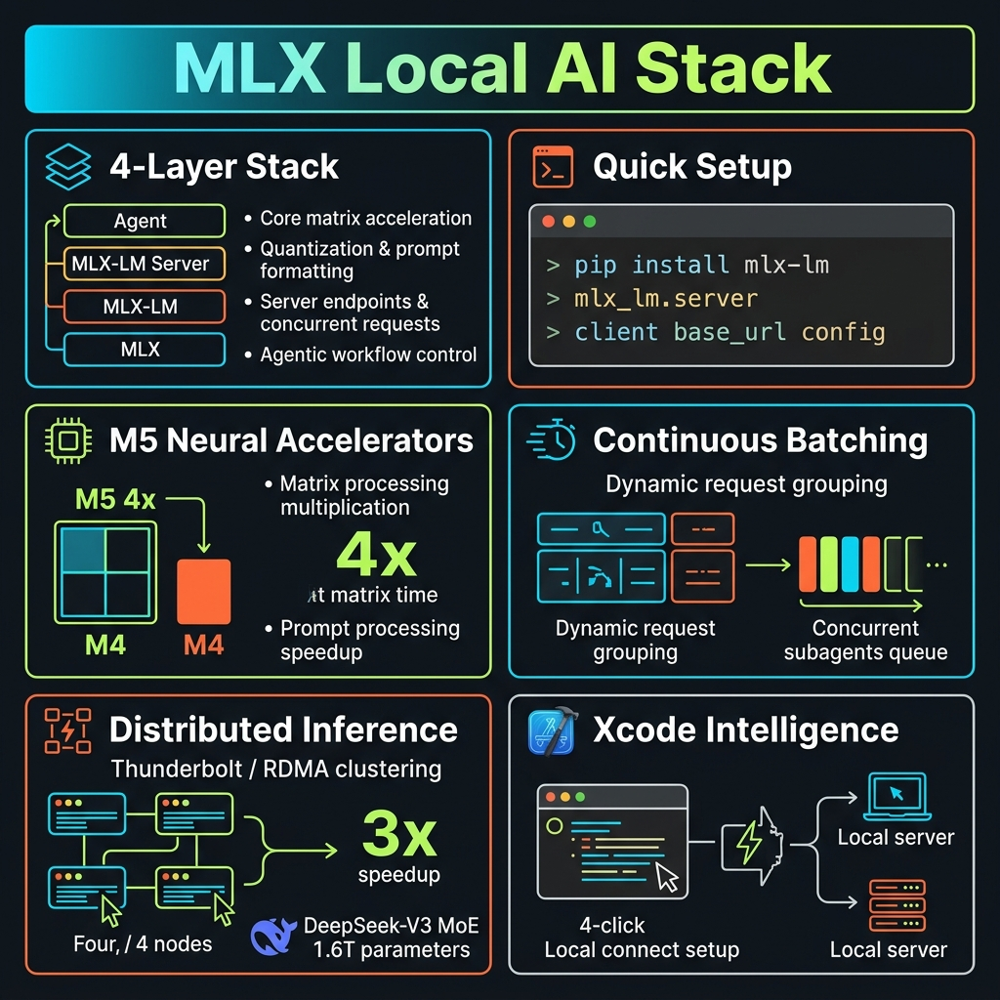
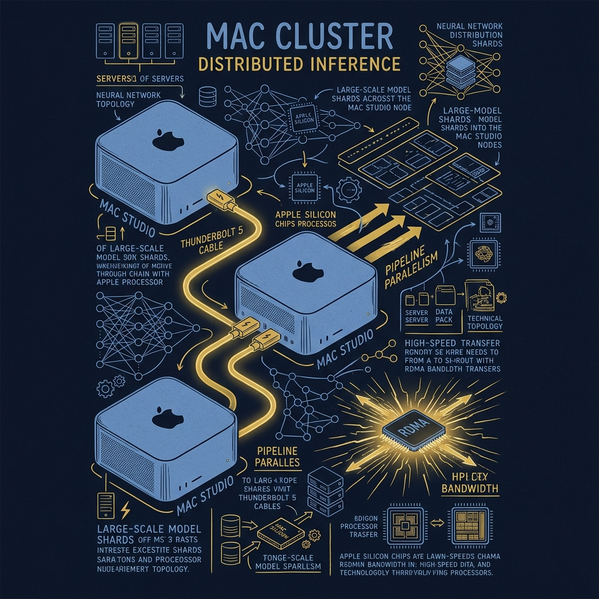

<!-- _class: title -->

# เจาะลึก MLX + MLX-LM Server

รัน Agentic AI บน Mac แบบ Local 100% บน Apple Silicon

<!-- Speaker: เริ่มด้วยคำถาม — "จะเกิดอะไรขึ้นถ้า AI agent ทำงานได้บนเครื่องคุณ โดยไม่ส่งข้อมูลออกไปไหนเลย?" -->

---

<!-- _class: cheatsheet -->
<!-- _backgroundColor: #f8f7f4 -->

<!-- Speaker: One-page reference ของทั้ง deck — 4-layer stack, setup commands, M5 speedup, batching, distributed, Xcode integration. -->

---

## Local AI Beats Cloud for Agentic Workflows

ไม่มี API key, ไม่มี usage cost, data ไม่ออกจากเครื่อง — Mac เป็น AI inference node ได้จริง

<svg viewBox="0 0 1100 320" width="100%" xmlns="http://www.w3.org/2000/svg">
  <!-- callout-box: 3-point summary -->
  <rect x="40" y="20" width="1020" height="280" rx="16" fill="var(--paper)" stroke="var(--soft-2)" stroke-width="1.5" style="filter:drop-shadow(0 4px 12px rgba(15,23,42,.08))"/>
  <rect x="40" y="20" width="8" height="280" rx="4" fill="var(--accent)"/>
  <!-- Point 1 -->
  <circle cx="140" cy="100" r="32" fill="var(--accent)" opacity=".12"/>
  <circle cx="140" cy="100" r="22" fill="var(--accent)"/>
  <text x="140" y="105" font-size="14" font-weight="700" fill="white" text-anchor="middle" font-family="system-ui">$0</text>
  <text x="190" y="90" font-size="17" font-weight="700" fill="var(--ink)" font-family="system-ui">Zero API Cost</text>
  <text x="190" y="114" font-size="14" fill="var(--ink-dim)" font-family="system-ui">No usage metering — run 1M tokens/day, same cost</text>
  <!-- Point 2 -->
  <circle cx="140" cy="190" r="32" fill="var(--success)" opacity=".12"/>
  <circle cx="140" cy="190" r="22" fill="var(--success)"/>
  <text x="140" y="195" font-size="11" font-weight="700" fill="white" text-anchor="middle" font-family="system-ui">PRIV</text>
  <text x="190" y="180" font-size="17" font-weight="700" fill="var(--ink)" font-family="system-ui">Data Never Leaves Device</text>
  <text x="190" y="204" font-size="14" fill="var(--ink-dim)" font-family="system-ui">Proprietary code, internal docs — zero exposure</text>
  <!-- Point 3 -->
  <circle cx="140" cy="280" r="32" fill="var(--gold)" opacity=".12"/>
  <circle cx="140" cy="280" r="22" fill="var(--gold)"/>
  <text x="140" y="285" font-size="11" font-weight="700" fill="white" text-anchor="middle" font-family="system-ui">ANY</text>
  <text x="190" y="270" font-size="17" font-weight="700" fill="var(--ink)" font-family="system-ui">Works Offline, Anywhere</text>
  <text x="190" y="294" font-size="14" fill="var(--ink-dim)" font-family="system-ui">No internet required — AI available on flights, air-gaps</text>
</svg>

<b>★ Takeaway:</b> Local AI บน Apple Silicon = ต้นทุน $0, privacy สูงสุด, ใช้ได้ทุกที่ — เหมาะที่สุดสำหรับ agentic workflows ที่มี context ยาวและ tool calls ถี่

<!-- Speaker: Cloud AI cost ขึ้นเร็วมากใน agentic workflows เพราะหนึ่ง session อาจมีหลักแสน tokens. -->

---

## Agentic Loop: Why Local Matters More Than Chat

Agent วนลูป model → tool → observe ซ้ำๆ จนงานเสร็จ — ต่างจาก chat ที่รับ-ส่ง prompt เดียว

<svg viewBox="0 0 700 260" width="100%" xmlns="http://www.w3.org/2000/svg">
  <!-- Cloud path (top, muted) -->
  <rect x="20" y="20" width="660" height="90" rx="10" fill="var(--soft)" stroke="var(--soft-2)" stroke-width="1.5"/>
  <text x="40" y="45" font-size="12" font-weight="700" fill="var(--muted)" font-family="system-ui">CLOUD PATH</text>
  <rect x="40" y="54" width="100" height="34" rx="6" fill="var(--soft-2)"/>
  <text x="90" y="76" font-size="12" fill="var(--ink-dim)" text-anchor="middle" font-family="system-ui">Agent</text>
  <text x="155" y="76" font-size="18" fill="var(--muted)" font-family="system-ui">→</text>
  <rect x="175" y="54" width="120" height="34" rx="6" fill="var(--soft-2)"/>
  <text x="235" y="76" font-size="12" fill="var(--ink-dim)" text-anchor="middle" font-family="system-ui">Cloud API</text>
  <text x="310" y="76" font-size="18" fill="var(--muted)" font-family="system-ui">→</text>
  <rect x="330" y="54" width="130" height="34" rx="6" fill="var(--danger-wash)"/>
  <text x="395" y="76" font-size="11" fill="var(--danger-ink)" text-anchor="middle" font-family="system-ui">Data leaves!</text>
  <text x="475" y="76" font-size="18" fill="var(--muted)" font-family="system-ui">→</text>
  <rect x="495" y="54" width="140" height="34" rx="6" fill="var(--danger-wash)"/>
  <text x="565" y="76" font-size="11" fill="var(--danger-ink)" text-anchor="middle" font-family="system-ui">Cost per token</text>
  <!-- Local path (bottom, accent) -->
  <rect x="20" y="130" width="660" height="110" rx="10" fill="var(--accent-wash)" stroke="var(--accent)" stroke-width="1.5"/>
  <text x="40" y="155" font-size="12" font-weight="700" fill="var(--accent)" font-family="system-ui">LOCAL PATH (MLX)</text>
  <rect x="40" y="164" width="80" height="34" rx="6" fill="var(--accent)" opacity=".15"/>
  <text x="80" y="186" font-size="12" fill="var(--accent)" text-anchor="middle" font-family="system-ui">Agent</text>
  <text x="133" y="186" font-size="18" fill="var(--accent)" font-family="system-ui">→</text>
  <rect x="150" y="164" width="120" height="34" rx="6" fill="var(--accent)" opacity=".2"/>
  <text x="210" y="186" font-size="12" fill="var(--accent-deep)" text-anchor="middle" font-family="system-ui">MLX-LM Server</text>
  <text x="283" y="186" font-size="18" fill="var(--accent)" font-family="system-ui">→</text>
  <rect x="300" y="164" width="110" height="34" rx="6" fill="var(--success-wash)"/>
  <text x="355" y="186" font-size="11" fill="var(--success-ink)" text-anchor="middle" font-family="system-ui">On-device</text>
  <text x="423" y="186" font-size="18" fill="var(--accent)" font-family="system-ui">→</text>
  <rect x="440" y="164" width="110" height="34" rx="6" fill="var(--success-wash)"/>
  <text x="495" y="186" font-size="11" fill="var(--success-ink)" text-anchor="middle" font-family="system-ui">$0 always</text>
  <!-- Loop arrow -->
  <path d="M 590 186 Q 640 186 640 210 Q 640 230 80 230 Q 60 230 60 210 Q 60 200 80 200" stroke="var(--accent)" stroke-width="1.5" fill="none" stroke-dasharray="4,3"/>
  <text x="300" y="248" font-size="11" fill="var(--accent)" text-anchor="middle" font-family="system-ui">agentic loop repeats until task done</text>
</svg>

<b>★ Takeaway:</b> Agentic loop = hundreds of API calls per session — cloud cost compounds fast; local path is flat-zero cost with full privacy

<!-- Speaker: ยกตัวอย่าง: รัน code review agent บน codebase 50K lines — อาจมี 200-300 tool calls, 500K tokens. Cloud cost อาจ $5-15/session. Local = $0. -->

---

## 4-Layer Stack Powers Every Local AI App

MLX ที่ฐาน → MLX-LM → MLX-LM Server → Agent ที่บน — ทุกชั้น open-source, ใช้กับ framework ไหนก็ได้

<svg viewBox="0 0 1100 340" width="100%" xmlns="http://www.w3.org/2000/svg">
  <!-- Layer 4: Agent (top) -->
  <rect x="100" y="20" width="900" height="62" rx="10" fill="var(--gold)" opacity=".15" stroke="var(--gold)" stroke-width="1.5"/>
  <rect x="100" y="20" width="8" height="62" rx="4" fill="var(--gold)"/>
  <text x="135" y="45" font-size="11" font-weight="700" fill="var(--gold)" font-family="system-ui">LAYER 4 — AGENT</text>
  <text x="135" y="66" font-size="14" fill="var(--ink)" font-family="system-ui">OpenCode / Xcode / Claude Code / custom — any OpenAI chat completions client</text>
  <!-- Layer 3: MLX-LM Server -->
  <rect x="100" y="98" width="900" height="62" rx="10" fill="var(--accent)" opacity=".12" stroke="var(--accent)" stroke-width="1.5"/>
  <rect x="100" y="98" width="8" height="62" rx="4" fill="var(--accent)"/>
  <text x="135" y="123" font-size="11" font-weight="700" fill="var(--accent)" font-family="system-ui">LAYER 3 — SERVER</text>
  <text x="135" y="144" font-size="14" fill="var(--ink)" font-family="system-ui">MLX-LM Server — OpenAI-compatible HTTP, structured tool calling, reasoning models</text>
  <!-- Layer 2: MLX-LM -->
  <rect x="100" y="176" width="900" height="62" rx="10" fill="var(--success)" opacity=".10" stroke="var(--success)" stroke-width="1.5"/>
  <rect x="100" y="176" width="8" height="62" rx="4" fill="var(--success)"/>
  <text x="135" y="201" font-size="11" font-weight="700" fill="var(--success-ink)" font-family="system-ui">LAYER 2 — LANGUAGE MODEL</text>
  <text x="135" y="222" font-size="14" fill="var(--ink)" font-family="system-ui">MLX-LM — load, run, quantize, fine-tune LLMs + CLI tools + Python API</text>
  <!-- Layer 1: MLX -->
  <rect x="100" y="254" width="900" height="62" rx="10" fill="var(--soft-2)" stroke="var(--soft-2)" stroke-width="1.5"/>
  <rect x="100" y="254" width="8" height="62" rx="4" fill="var(--ink-dim)"/>
  <text x="135" y="279" font-size="11" font-weight="700" fill="var(--ink-dim)" font-family="system-ui">LAYER 1 — FOUNDATION</text>
  <text x="135" y="300" font-size="14" fill="var(--ink)" font-family="system-ui">MLX — array framework, Metal GPU acceleration, unified memory management</text>
  <!-- Arrows between layers -->
  <text x="60" y="90" font-size="20" fill="var(--muted)" text-anchor="middle" font-family="system-ui">↕</text>
  <text x="60" y="168" font-size="20" fill="var(--muted)" text-anchor="middle" font-family="system-ui">↕</text>
  <text x="60" y="246" font-size="20" fill="var(--muted)" text-anchor="middle" font-family="system-ui">↕</text>
</svg>

<b>★ Takeaway:</b> Ollama, LM Studio, vLLM ล้วน build บน stack เดียวกัน — ถ้าใช้อยู่แล้ว คุณรัน MLX อยู่โดยไม่รู้ตัว

<!-- Speaker: Key insight: Layer 3 (MLX-LM Server) คือ "magic glue" — ทำให้ agent framework ทุกตัวที่พูด OpenAI protocol ใช้ได้ทันที โดยไม่ต้องแก้โค้ด. -->

---

## Setup Takes 3 Commands, Zero Config

pip install → start server → point agent — ทุก agent framework ที่พูด OpenAI protocol ใช้งานได้ทันที

<svg viewBox="0 0 1100 300" width="100%" xmlns="http://www.w3.org/2000/svg">
  <!-- Step 1 -->
  <rect x="40" y="30" width="300" height="240" rx="12" fill="var(--paper)" stroke="var(--soft-2)" stroke-width="1.5" style="filter:drop-shadow(0 4px 12px rgba(15,23,42,.08))"/>
  <rect x="40" y="30" width="300" height="44" rx="12" fill="var(--accent)" opacity=".1"/>
  <circle cx="80" cy="52" r="16" fill="var(--accent)"/>
  <text x="80" y="57" font-size="14" font-weight="700" fill="white" text-anchor="middle" font-family="system-ui">1</text>
  <text x="105" y="47" font-size="13" font-weight="700" fill="var(--accent)" font-family="system-ui">Install</text>
  <text x="105" y="65" font-size="12" fill="var(--ink-dim)" font-family="system-ui">pip install mlx-lm</text>
  <rect x="58" y="90" width="264" height="60" rx="6" fill="var(--soft)"/>
  <text x="78" y="110" font-size="11" fill="var(--ink-dim)" font-family="monospace">pip install mlx-lm</text>
  <text x="78" y="130" font-size="11" fill="var(--muted)" font-family="monospace"># or: conda install mlx-lm</text>
  <text x="58" y="175" font-size="12" fill="var(--ink-dim)" font-family="system-ui">Gets: CLI tools + Python API</text>
  <text x="58" y="197" font-size="12" fill="var(--ink-dim)" font-family="system-ui">HuggingFace models auto-download</text>
  <text x="58" y="220" font-size="12" fill="var(--muted)" font-family="system-ui">macOS + Apple Silicon only</text>
  <!-- Arrow 1→2 -->
  <text x="360" y="160" font-size="28" fill="var(--accent)" text-anchor="middle" font-family="system-ui">→</text>
  <!-- Step 2 -->
  <rect x="390" y="30" width="320" height="240" rx="12" fill="var(--paper)" stroke="var(--accent)" stroke-width="2" style="filter:drop-shadow(0 4px 12px rgba(59,130,246,.15))"/>
  <rect x="390" y="30" width="320" height="44" rx="12" fill="var(--accent)" opacity=".15"/>
  <circle cx="430" cy="52" r="16" fill="var(--accent)"/>
  <text x="430" y="57" font-size="14" font-weight="700" fill="white" text-anchor="middle" font-family="system-ui">2</text>
  <text x="455" y="47" font-size="13" font-weight="700" fill="var(--accent)" font-family="system-ui">Start Server</text>
  <text x="455" y="65" font-size="12" fill="var(--ink-dim)" font-family="system-ui">mlx_lm.server --model ...</text>
  <rect x="408" y="90" width="284" height="80" rx="6" fill="var(--soft)"/>
  <text x="422" y="112" font-size="10" fill="var(--ink-dim)" font-family="monospace">mlx_lm.server \</text>
  <text x="422" y="130" font-size="10" fill="var(--ink-dim)" font-family="monospace">  --model Qwen2.5-7B-4bit \</text>
  <text x="422" y="148" font-size="10" fill="var(--ink-dim)" font-family="monospace">  --port 8080</text>
  <text x="408" y="192" font-size="12" fill="var(--ink-dim)" font-family="system-ui">Listens: localhost:8080/v1</text>
  <text x="408" y="214" font-size="12" fill="var(--ink-dim)" font-family="system-ui">Supports: tool calling + streaming</text>
  <text x="408" y="236" font-size="12" fill="var(--success-ink)" font-family="system-ui">Ready: Uvicorn running on :8080</text>
  <!-- Arrow 2→3 -->
  <text x="730" y="160" font-size="28" fill="var(--accent)" text-anchor="middle" font-family="system-ui">→</text>
  <!-- Step 3 -->
  <rect x="750" y="30" width="310" height="240" rx="12" fill="var(--paper)" stroke="var(--soft-2)" stroke-width="1.5" style="filter:drop-shadow(0 4px 12px rgba(15,23,42,.08))"/>
  <rect x="750" y="30" width="310" height="44" rx="12" fill="var(--gold)" opacity=".12"/>
  <circle cx="790" cy="52" r="16" fill="var(--gold)"/>
  <text x="790" y="57" font-size="14" font-weight="700" fill="white" text-anchor="middle" font-family="system-ui">3</text>
  <text x="815" y="47" font-size="13" font-weight="700" fill="var(--gold)" font-family="system-ui">Point Agent</text>
  <text x="815" y="65" font-size="12" fill="var(--ink-dim)" font-family="system-ui">base_url = localhost:8080/v1</text>
  <rect x="768" y="90" width="274" height="80" rx="6" fill="var(--soft)"/>
  <text x="780" y="108" font-size="10" fill="var(--ink-dim)" font-family="monospace">{</text>
  <text x="780" y="126" font-size="10" fill="var(--ink-dim)" font-family="monospace">  "base_url":</text>
  <text x="780" y="144" font-size="10" fill="var(--ink-dim)" font-family="monospace">  "http://localhost:8080/v1"</text>
  <text x="780" y="162" font-size="10" fill="var(--ink-dim)" font-family="monospace">}</text>
  <text x="768" y="200" font-size="12" fill="var(--ink-dim)" font-family="system-ui">Works with: OpenCode, Claude</text>
  <text x="768" y="220" font-size="12" fill="var(--ink-dim)" font-family="system-ui">Code, Aider, custom scripts</text>
  <text x="768" y="244" font-size="12" fill="var(--success-ink)" font-family="system-ui">Agent uses local model — done</text>
</svg>

<b>★ Takeaway:</b> 3 commands จาก zero ถึง fully-local agentic workflow — agent ไม่รู้ว่า model รันอยู่บน Mac ไม่ใช่ cloud

<!-- Speaker: Step 2 คือหัวใจ — mlx_lm.server เป็น OpenAI-compatible API ทำให้ทุก agent framework ใช้ได้โดยแค่เปลี่ยน base_url. -->

---

## M5 Neural Accelerators: 4× Faster Prompt Processing

Agentic sessions มี token ที่ถูก process มากกว่า token ที่ถูก generate — M5 แก้ปัญหาที่จุดนี้โดยตรง

<svg viewBox="0 0 1100 320" width="100%" xmlns="http://www.w3.org/2000/svg">
  <!-- Background grid -->
  <line x1="120" y1="40" x2="120" y2="260" stroke="var(--soft-2)" stroke-width="1"/>
  <line x1="120" y1="260" x2="980" y2="260" stroke="var(--soft-2)" stroke-width="1"/>
  <!-- Grid lines -->
  <line x1="120" y1="260" x2="980" y2="260" stroke="var(--muted)" stroke-width="0.5"/>
  <line x1="120" y1="195" x2="980" y2="195" stroke="var(--soft-2)" stroke-width="0.5" stroke-dasharray="4,3"/>
  <line x1="120" y1="130" x2="980" y2="130" stroke="var(--soft-2)" stroke-width="0.5" stroke-dasharray="4,3"/>
  <line x1="120" y1="65" x2="980" y2="65" stroke="var(--soft-2)" stroke-width="0.5" stroke-dasharray="4,3"/>
  <!-- Y-axis labels -->
  <text x="100" y="264" font-size="11" fill="var(--muted)" text-anchor="end" font-family="system-ui">0x</text>
  <text x="100" y="199" font-size="11" fill="var(--muted)" text-anchor="end" font-family="system-ui">1x</text>
  <text x="100" y="134" font-size="11" fill="var(--muted)" text-anchor="end" font-family="system-ui">2x</text>
  <text x="100" y="69" font-size="11" fill="var(--muted)" text-anchor="end" font-family="system-ui">3x</text>
  <!-- M4 bar -->
  <rect x="200" y="195" width="140" height="65" rx="6" fill="var(--soft-2)"/>
  <text x="270" y="188" font-size="13" font-weight="700" fill="var(--ink-dim)" text-anchor="middle" font-family="system-ui">M4</text>
  <text x="270" y="232" font-size="18" font-weight="700" fill="var(--ink-dim)" text-anchor="middle" font-family="system-ui">1x</text>
  <!-- M5 bar -->
  <rect x="420" y="65" width="140" height="195" rx="6" fill="var(--accent)"/>
  <text x="490" y="58" font-size="13" font-weight="700" fill="var(--accent)" text-anchor="middle" font-family="system-ui">M5</text>
  <text x="490" y="165" font-size="24" font-weight="700" fill="white" text-anchor="middle" font-family="system-ui">4x</text>
  <text x="490" y="192" font-size="13" fill="white" text-anchor="middle" font-family="system-ui">faster</text>
  <!-- Feature callouts -->
  <rect x="630" y="60" width="330" height="195" rx="10" fill="var(--soft)" stroke="var(--soft-2)" stroke-width="1.5"/>
  <text x="650" y="90" font-size="13" font-weight="700" fill="var(--ink)" font-family="system-ui">Neural Accelerators</text>
  <text x="650" y="112" font-size="12" fill="var(--ink-dim)" font-family="system-ui">Dedicated matrix multiply hardware</text>
  <line x1="650" y1="126" x2="940" y2="126" stroke="var(--soft-2)" stroke-width="1"/>
  <text x="650" y="148" font-size="13" font-weight="700" fill="var(--ink)" font-family="system-ui">Auto-Enabled</text>
  <text x="650" y="170" font-size="12" fill="var(--ink-dim)" font-family="system-ui">MLX selects best kernel — no code change</text>
  <line x1="650" y1="184" x2="940" y2="184" stroke="var(--soft-2)" stroke-width="1"/>
  <text x="650" y="206" font-size="13" font-weight="700" fill="var(--success-ink)" font-family="system-ui">Impact: Prompt Processing</text>
  <text x="650" y="228" font-size="12" fill="var(--ink-dim)" font-family="system-ui">Read codebase / tool results ~4x faster</text>
  <!-- Chart title -->
  <text x="550" y="295" font-size="13" fill="var(--muted)" text-anchor="middle" font-family="system-ui">Matrix Multiplication Speed: M4 vs M5</text>
</svg>

<b>★ Takeaway:</b> M5 Neural Accelerators เพิ่ม matrix multiplication 4× vs M4 — agentic loop เร็วขึ้นโดยอัตโนมัติ ไม่ต้องเปลี่ยนโค้ดอะไรเลย

<!-- Speaker: ทำไม prompt processing สำคัญกว่า generation ใน agentic workflows? เพราะทุก tool output ต้องถูก process เป็น context ก่อน model จะ reason ต่อได้. -->

---

## Continuous Batching Serves Multiple Subagents Simultaneously

Subagents หลายตัวส่ง requests พร้อมกัน — MLX-LM Server รวมเป็น batch เดียว ไม่มีใครรอในคิว

<svg viewBox="0 0 1100 300" width="100%" xmlns="http://www.w3.org/2000/svg">
  <!-- WITHOUT batching (top, muted) -->
  <text x="40" y="30" font-size="12" font-weight="700" fill="var(--muted)" font-family="system-ui">WITHOUT BATCHING — serial queue</text>
  <rect x="40" y="40" width="95" height="30" rx="5" fill="var(--soft-2)"/>
  <text x="87" y="60" font-size="11" fill="var(--ink-dim)" text-anchor="middle" font-family="system-ui">Agent A</text>
  <text x="148" y="60" font-size="14" fill="var(--muted)" font-family="system-ui">→</text>
  <rect x="162" y="40" width="95" height="30" rx="5" fill="var(--danger-wash)" stroke="var(--danger)" stroke-width="1"/>
  <text x="209" y="60" font-size="11" fill="var(--danger-ink)" text-anchor="middle" font-family="system-ui">wait...</text>
  <text x="270" y="60" font-size="14" fill="var(--muted)" font-family="system-ui">→</text>
  <rect x="284" y="40" width="95" height="30" rx="5" fill="var(--soft-2)"/>
  <text x="331" y="60" font-size="11" fill="var(--ink-dim)" text-anchor="middle" font-family="system-ui">Agent B</text>
  <text x="392" y="60" font-size="14" fill="var(--muted)" font-family="system-ui">→</text>
  <rect x="406" y="40" width="95" height="30" rx="5" fill="var(--danger-wash)" stroke="var(--danger)" stroke-width="1"/>
  <text x="453" y="60" font-size="11" fill="var(--danger-ink)" text-anchor="middle" font-family="system-ui">wait...</text>
  <text x="514" y="60" font-size="14" fill="var(--muted)" font-family="system-ui">→</text>
  <rect x="528" y="40" width="95" height="30" rx="5" fill="var(--soft-2)"/>
  <text x="575" y="60" font-size="11" fill="var(--ink-dim)" text-anchor="middle" font-family="system-ui">Agent C</text>
  <!-- WITH batching (bottom, accent) -->
  <text x="40" y="115" font-size="12" font-weight="700" fill="var(--accent)" font-family="system-ui">WITH CONTINUOUS BATCHING (MLX-LM Server)</text>
  <!-- Agents input -->
  <rect x="40" y="130" width="90" height="28" rx="5" fill="var(--accent)" opacity=".15" stroke="var(--accent)" stroke-width="1"/>
  <text x="85" y="149" font-size="11" fill="var(--accent-deep)" text-anchor="middle" font-family="system-ui">Agent A</text>
  <rect x="40" y="168" width="90" height="28" rx="5" fill="var(--accent)" opacity=".15" stroke="var(--accent)" stroke-width="1"/>
  <text x="85" y="187" font-size="11" fill="var(--accent-deep)" text-anchor="middle" font-family="system-ui">Agent B</text>
  <rect x="40" y="206" width="90" height="28" rx="5" fill="var(--accent)" opacity=".15" stroke="var(--accent)" stroke-width="1"/>
  <text x="85" y="225" font-size="11" fill="var(--accent-deep)" text-anchor="middle" font-family="system-ui">Agent C</text>
  <!-- Converge arrows -->
  <line x1="130" y1="144" x2="200" y2="185" stroke="var(--accent)" stroke-width="1.5"/>
  <line x1="130" y1="182" x2="200" y2="185" stroke="var(--accent)" stroke-width="1.5"/>
  <line x1="130" y1="220" x2="200" y2="185" stroke="var(--accent)" stroke-width="1.5"/>
  <!-- Batch box -->
  <rect x="200" y="155" width="170" height="60" rx="10" fill="var(--accent)" opacity=".2" stroke="var(--accent)" stroke-width="2"/>
  <text x="285" y="180" font-size="13" font-weight="700" fill="var(--accent-deep)" text-anchor="middle" font-family="system-ui">Dynamic Batch</text>
  <text x="285" y="200" font-size="11" fill="var(--accent)" text-anchor="middle" font-family="system-ui">A + B + C together</text>
  <!-- GPU arrow -->
  <text x="385" y="192" font-size="20" fill="var(--accent)" font-family="system-ui">→</text>
  <!-- GPU box -->
  <rect x="410" y="155" width="110" height="60" rx="10" fill="var(--accent)" opacity=".35" stroke="var(--accent)" stroke-width="2"/>
  <text x="465" y="180" font-size="13" font-weight="700" fill="white" text-anchor="middle" font-family="system-ui">GPU</text>
  <text x="465" y="200" font-size="11" fill="white" text-anchor="middle" font-family="system-ui">parallel</text>
  <!-- Output arrows diverge -->
  <text x="533" y="192" font-size="20" fill="var(--accent)" font-family="system-ui">→</text>
  <line x1="555" y1="185" x2="640" y2="150" stroke="var(--success)" stroke-width="1.5"/>
  <line x1="555" y1="185" x2="640" y2="185" stroke="var(--success)" stroke-width="1.5"/>
  <line x1="555" y1="185" x2="640" y2="220" stroke="var(--success)" stroke-width="1.5"/>
  <!-- Responses -->
  <rect x="640" y="132" width="110" height="28" rx="5" fill="var(--success-wash)" stroke="var(--success)" stroke-width="1"/>
  <text x="695" y="150" font-size="11" fill="var(--success-ink)" text-anchor="middle" font-family="system-ui">Resp A</text>
  <rect x="640" y="170" width="110" height="28" rx="5" fill="var(--success-wash)" stroke="var(--success)" stroke-width="1"/>
  <text x="695" y="188" font-size="11" fill="var(--success-ink)" text-anchor="middle" font-family="system-ui">Resp B</text>
  <rect x="640" y="208" width="110" height="28" rx="5" fill="var(--success-wash)" stroke="var(--success)" stroke-width="1"/>
  <text x="695" y="226" font-size="11" fill="var(--success-ink)" text-anchor="middle" font-family="system-ui">Resp C</text>
  <!-- Agent D joining mid-stream -->
  <rect x="800" y="155" width="90" height="28" rx="5" fill="var(--gold)" opacity=".2" stroke="var(--gold)" stroke-width="1"/>
  <text x="845" y="173" font-size="11" fill="var(--gold)" text-anchor="middle" font-family="system-ui">Agent D joins</text>
  <path d="M 890 169 Q 980 169 980 185 Q 980 200 890 200" stroke="var(--gold)" stroke-width="1.5" fill="none" stroke-dasharray="4,3"/>
  <text x="940" y="222" font-size="10" fill="var(--gold)" text-anchor="middle" font-family="system-ui">joins in-progress</text>
</svg>

<b>★ Takeaway:</b> Continuous Batching ให้หลาย subagents run พร้อมกันได้จริง — ไม่มีใครถูก block ในคิว ทั้ง agentic workflow เคลื่อนต่อพร้อมกัน

<!-- Speaker: Pattern จริงใน coding agent: main agent spawn "read docs" + "search code" + "write tests" subagents พร้อมกัน. Continuous batching ทำให้ทั้ง 3 ได้รับ response พร้อมๆ กัน. -->

---

## Distributed Inference Breaks the Single-Machine RAM Limit

DeepSeek ล่าสุด = 1.6T parameters, ต้องการ 800GB+ RAM — MLX Distributed shards model ข้าม Mac cluster

<svg viewBox="0 0 700 260" width="100%" xmlns="http://www.w3.org/2000/svg">
  <!-- Single Mac limit (left) -->
  <rect x="20" y="20" width="170" height="100" rx="10" fill="var(--soft)" stroke="var(--soft-2)" stroke-width="1.5"/>
  <text x="105" y="48" font-size="12" font-weight="700" fill="var(--ink-dim)" text-anchor="middle" font-family="system-ui">Mac (512GB)</text>
  <rect x="35" y="58" width="140" height="20" rx="4" fill="var(--danger)" opacity=".6"/>
  <text x="105" y="73" font-size="10" fill="white" text-anchor="middle" font-family="system-ui">Max RAM: 512 GB</text>
  <text x="105" y="108" font-size="11" fill="var(--danger-ink)" text-anchor="middle" font-family="system-ui">DeepSeek needs 800GB+</text>
  <text x="105" y="127" font-size="20" fill="var(--danger)" text-anchor="middle" font-family="system-ui">✗</text>
  <!-- Cluster (right) -->
  <text x="220" y="90" font-size="22" fill="var(--accent)" font-family="system-ui">→</text>
  <!-- Mac 1 -->
  <rect x="270" y="20" width="120" height="80" rx="8" fill="var(--accent)" opacity=".12" stroke="var(--accent)" stroke-width="1.5"/>
  <text x="330" y="45" font-size="11" font-weight="700" fill="var(--accent-deep)" text-anchor="middle" font-family="system-ui">Mac 1</text>
  <text x="330" y="65" font-size="10" fill="var(--ink-dim)" text-anchor="middle" font-family="system-ui">Layers 1–40</text>
  <text x="330" y="82" font-size="10" fill="var(--muted)" text-anchor="middle" font-family="system-ui">256 GB RAM</text>
  <!-- Thunderbolt cable -->
  <line x1="390" y1="60" x2="420" y2="60" stroke="var(--gold)" stroke-width="3"/>
  <text x="405" y="52" font-size="9" fill="var(--gold)" text-anchor="middle" font-family="system-ui">TB5</text>
  <!-- Mac 2 -->
  <rect x="420" y="20" width="120" height="80" rx="8" fill="var(--accent)" opacity=".12" stroke="var(--accent)" stroke-width="1.5"/>
  <text x="480" y="45" font-size="11" font-weight="700" fill="var(--accent-deep)" text-anchor="middle" font-family="system-ui">Mac 2</text>
  <text x="480" y="65" font-size="10" fill="var(--ink-dim)" text-anchor="middle" font-family="system-ui">Layers 41–80</text>
  <text x="480" y="82" font-size="10" fill="var(--muted)" text-anchor="middle" font-family="system-ui">256 GB RAM</text>
  <!-- Thunderbolt cable 2 -->
  <line x1="540" y1="60" x2="570" y2="60" stroke="var(--gold)" stroke-width="3"/>
  <text x="555" y="52" font-size="9" fill="var(--gold)" text-anchor="middle" font-family="system-ui">TB5</text>
  <!-- Mac 3 -->
  <rect x="570" y="20" width="120" height="80" rx="8" fill="var(--accent)" opacity=".12" stroke="var(--accent)" stroke-width="1.5"/>
  <text x="630" y="45" font-size="11" font-weight="700" fill="var(--accent-deep)" text-anchor="middle" font-family="system-ui">Mac 3</text>
  <text x="630" y="65" font-size="10" fill="var(--ink-dim)" text-anchor="middle" font-family="system-ui">Layers 81–120</text>
  <text x="630" y="82" font-size="10" fill="var(--muted)" text-anchor="middle" font-family="system-ui">512 GB RAM</text>
  <!-- Result box -->
  <rect x="270" y="130" width="420" height="50" rx="8" fill="var(--success-wash)" stroke="var(--success)" stroke-width="1.5"/>
  <text x="480" y="152" font-size="13" font-weight="700" fill="var(--success-ink)" text-anchor="middle" font-family="system-ui">Total: 1024 GB — runs DeepSeek 1.6T</text>
  <text x="480" y="170" font-size="11" fill="var(--success-ink)" text-anchor="middle" font-family="system-ui">macOS 26.2 RDMA: up to 3x speedup with 4 nodes</text>
  <!-- Launch command -->
  <rect x="270" y="198" width="420" height="50" rx="6" fill="var(--soft)"/>
  <text x="290" y="220" font-size="10" fill="var(--ink-dim)" font-family="monospace">mlx.launch --hostfile hosts.txt</text>
  <text x="290" y="238" font-size="10" fill="var(--ink-dim)" font-family="monospace">  python -m mlx_lm.server --model deepseek-ai/V3</text>
</svg>

<b>★ Takeaway:</b> MLX Distributed + Thunderbolt RDMA (macOS 26.2): เชื่อม Mac หลายเครื่องได้ทันที — model ถูก shard อัตโนมัติ, speedup สูงสุด 3× ด้วย 4 nodes

<!-- Speaker: Thunderbolt RDMA คือ breakthrough ใหม่ใน macOS 26.2 — latency ต่ำมากเหมือน NVLink บน GPU server แต่ใช้ consumer Mac. -->

---

## Xcode Talks to Local MLX in 4 Clicks

Settings → Intelligence → Add Provider → Port 8080 — Xcode อ่านไฟล์ project, เข้าใจ build errors, แก้ code — code ไม่ออกจากเครื่อง

<svg viewBox="0 0 1100 280" width="100%" xmlns="http://www.w3.org/2000/svg">
  <!-- Step boxes -->
  <rect x="40" y="40" width="210" height="200" rx="12" fill="var(--paper)" stroke="var(--accent)" stroke-width="2" style="filter:drop-shadow(0 4px 12px rgba(59,130,246,.12))"/>
  <circle cx="80" cy="64" r="18" fill="var(--accent)"/>
  <text x="80" y="69" font-size="14" font-weight="700" fill="white" text-anchor="middle" font-family="system-ui">1</text>
  <text x="108" y="60" font-size="13" font-weight="700" fill="var(--ink)" font-family="system-ui">Xcode Settings</text>
  <text x="108" y="78" font-size="12" fill="var(--ink-dim)" font-family="system-ui">Menu → Settings</text>
  <rect x="60" y="100" width="170" height="110" rx="8" fill="var(--soft)"/>
  <text x="145" y="125" font-size="12" fill="var(--ink-dim)" text-anchor="middle" font-family="system-ui">Xcode</text>
  <rect x="75" y="135" width="140" height="28" rx="5" fill="var(--accent)" opacity=".2"/>
  <text x="145" y="154" font-size="11" fill="var(--accent-deep)" text-anchor="middle" font-family="system-ui">Settings...</text>
  <!-- Arrow -->
  <text x="268" y="148" font-size="22" fill="var(--accent)" font-family="system-ui">→</text>
  <!-- Step 2 -->
  <rect x="295" y="40" width="180" height="200" rx="12" fill="var(--paper)" stroke="var(--soft-2)" stroke-width="1.5" style="filter:drop-shadow(0 4px 12px rgba(15,23,42,.08))"/>
  <circle cx="330" cy="64" r="18" fill="var(--accent)"/>
  <text x="330" y="69" font-size="14" font-weight="700" fill="white" text-anchor="middle" font-family="system-ui">2</text>
  <text x="358" y="60" font-size="13" font-weight="700" fill="var(--ink)" font-family="system-ui">Intelligence</text>
  <text x="358" y="78" font-size="12" fill="var(--ink-dim)" font-family="system-ui">Tab in Settings</text>
  <rect x="310" y="100" width="150" height="110" rx="8" fill="var(--soft)"/>
  <text x="385" y="125" font-size="11" fill="var(--muted)" text-anchor="middle" font-family="system-ui">General | Intelligence | ...</text>
  <rect x="320" y="135" width="130" height="28" rx="5" fill="var(--accent)" opacity=".25"/>
  <text x="385" y="154" font-size="11" fill="var(--accent-deep)" text-anchor="middle" font-family="system-ui">Intelligence</text>
  <!-- Arrow -->
  <text x="488" y="148" font-size="22" fill="var(--accent)" font-family="system-ui">→</text>
  <!-- Step 3 -->
  <rect x="515" y="40" width="200" height="200" rx="12" fill="var(--paper)" stroke="var(--soft-2)" stroke-width="1.5" style="filter:drop-shadow(0 4px 12px rgba(15,23,42,.08))"/>
  <circle cx="550" cy="64" r="18" fill="var(--accent)"/>
  <text x="550" y="69" font-size="14" font-weight="700" fill="white" text-anchor="middle" font-family="system-ui">3</text>
  <text x="578" y="60" font-size="13" font-weight="700" fill="var(--ink)" font-family="system-ui">Add Provider</text>
  <text x="578" y="78" font-size="12" fill="var(--ink-dim)" font-family="system-ui">Locally Hosted</text>
  <rect x="530" y="100" width="170" height="110" rx="8" fill="var(--soft)"/>
  <text x="615" y="125" font-size="11" fill="var(--muted)" text-anchor="middle" font-family="system-ui">Add Chat Provider...</text>
  <rect x="540" y="135" width="150" height="28" rx="5" fill="var(--accent)" opacity=".25"/>
  <text x="615" y="154" font-size="11" fill="var(--accent-deep)" text-anchor="middle" font-family="system-ui">Locally Hosted</text>
  <!-- Arrow -->
  <text x="728" y="148" font-size="22" fill="var(--accent)" font-family="system-ui">→</text>
  <!-- Step 4 -->
  <rect x="755" y="40" width="200" height="200" rx="12" fill="var(--success-wash)" stroke="var(--success)" stroke-width="2" style="filter:drop-shadow(0 4px 12px rgba(22,163,74,.15))"/>
  <circle cx="790" cy="64" r="18" fill="var(--success)"/>
  <text x="790" y="69" font-size="14" font-weight="700" fill="white" text-anchor="middle" font-family="system-ui">4</text>
  <text x="818" y="60" font-size="13" font-weight="700" fill="var(--success-ink)" font-family="system-ui">Set Port: 8080</text>
  <text x="818" y="78" font-size="12" fill="var(--success-ink)" font-family="system-ui">Done!</text>
  <rect x="770" y="100" width="170" height="60" rx="8" fill="white" stroke="var(--success)" stroke-width="1"/>
  <text x="855" y="125" font-size="11" fill="var(--ink-dim)" text-anchor="middle" font-family="system-ui">Port:</text>
  <rect x="790" y="135" width="130" height="20" rx="4" fill="var(--success-wash)"/>
  <text x="855" y="150" font-size="13" font-weight="700" fill="var(--success-ink)" text-anchor="middle" font-family="system-ui">8080</text>
  <text x="855" y="185" font-size="12" fill="var(--success-ink)" text-anchor="middle" font-family="system-ui">Xcode ↔ MLX connected</text>
  <text x="855" y="204" font-size="11" fill="var(--success-ink)" text-anchor="middle" font-family="system-ui">Code stays on Mac</text>
  <text x="855" y="226" font-size="11" fill="var(--success-ink)" text-anchor="middle" font-family="system-ui">Fix bugs in seconds</text>
</svg>

<b>★ Takeaway:</b> Xcode พูดคุยกับ local MLX model ได้ใน 4 คลิก — อ่าน project files, เข้าใจ build errors, แก้ code โดยที่ source code ไม่ออกจากเครื่องเลย

<!-- Speaker: Demo จริงจาก WWDC: agent สร้าง SwiftUI drawing app จาก blank Xcode project ใน ~2 นาที และแก้บั๊ก rounded end caps ใน Xcode ได้ทันที. -->

---

## Caveats: Know Before You Deploy

MLX เป็นระบบที่ mature แต่มีขอบเขตที่ต้องรู้ก่อนวางแผนใช้งานจริง

  

    
Platform

    <h3>macOS + Apple Silicon Only</h3>
    
ไม่รองรับ Windows, Linux, หรือ Intel Mac. RDMA ต้องการ macOS 26.2+ (beta) + Thunderbolt 5 (M4 Pro ขึ้นไป)

  

  

    
Resources

    <h3>RAM Must Be Sufficient</h3>
    
7B 4-bit ~4GB · 32B 4-bit ~18GB · 70B 4-bit ~40GB. ต้องเผื่อ RAM สำหรับ macOS + apps. ไม่ควรเกิน 70-80% ของ total RAM.

  

  

    
Security

    <h3>No Auth Out of the Box</h3>
    
Server listens บน localhost โดยไม่มี authentication. ถ้า expose ออก local network ต้องเพิ่ม reverse proxy + auth เอง.

  

<b>★ Takeaway:</b> เลือก model ที่มี -Instruct / -Chat variant สำหรับ tool calling, เผื่อ RAM ให้เหลือ 20-30%, และ restrict server ไว้ที่ localhost เท่านั้น

<!-- Speaker: Caveats ที่สำคัญที่สุดในทางปฏิบัติ: RAM ceiling กับ model compatibility. ทดสอบด้วย 7B model ก่อนเสมอ. -->

---

## ★ Key Takeaways

7 สิ่งที่ต้องจำจาก MLX + MLX-LM Server

<svg viewBox="0 0 1100 320" width="100%" xmlns="http://www.w3.org/2000/svg">
  <!-- 7 takeaway cards in two rows -->
  <!-- Row 1: 4 cards -->
  <rect x="40" y="20" width="230" height="120" rx="10" fill="var(--accent)" opacity=".08" stroke="var(--accent)" stroke-width="1.5"/>
  <text x="60" y="45" font-size="11" font-weight="700" fill="var(--accent)" font-family="system-ui">4-LAYER STACK</text>
  <text x="60" y="68" font-size="12" fill="var(--ink)" font-family="system-ui">MLX → MLX-LM →</text>
  <text x="60" y="88" font-size="12" fill="var(--ink)" font-family="system-ui">MLX-LM Server → Agent</text>
  <text x="60" y="110" font-size="11" fill="var(--ink-dim)" font-family="system-ui">All open-source, swap any layer</text>
  <rect x="285" y="20" width="230" height="120" rx="10" fill="var(--accent)" opacity=".08" stroke="var(--accent)" stroke-width="1.5"/>
  <text x="305" y="45" font-size="11" font-weight="700" fill="var(--accent)" font-family="system-ui">DROP-IN REPLACEMENT</text>
  <text x="305" y="68" font-size="12" fill="var(--ink)" font-family="system-ui">Change base_url only</text>
  <text x="305" y="88" font-size="12" fill="var(--ink)" font-family="system-ui">localhost:8080/v1</text>
  <text x="305" y="110" font-size="11" fill="var(--ink-dim)" font-family="system-ui">Every OpenAI client works</text>
  <rect x="530" y="20" width="230" height="120" rx="10" fill="var(--gold)" opacity=".1" stroke="var(--gold)" stroke-width="1.5"/>
  <text x="550" y="45" font-size="11" font-weight="700" fill="var(--gold)" font-family="system-ui">M5: 4X FASTER</text>
  <text x="550" y="68" font-size="12" fill="var(--ink)" font-family="system-ui">Neural Accelerators: 4x</text>
  <text x="550" y="88" font-size="12" fill="var(--ink)" font-family="system-ui">matrix multiply vs M4</text>
  <text x="550" y="110" font-size="11" fill="var(--ink-dim)" font-family="system-ui">Zero code changes needed</text>
  <rect x="775" y="20" width="285" height="120" rx="10" fill="var(--success)" opacity=".08" stroke="var(--success)" stroke-width="1.5"/>
  <text x="795" y="45" font-size="11" font-weight="700" fill="var(--success-ink)" font-family="system-ui">CONTINUOUS BATCHING</text>
  <text x="795" y="68" font-size="12" fill="var(--ink)" font-family="system-ui">Concurrent subagents</text>
  <text x="795" y="88" font-size="12" fill="var(--ink)" font-family="system-ui">No queue blocking</text>
  <text x="795" y="110" font-size="11" fill="var(--ink-dim)" font-family="system-ui">All get served simultaneously</text>
  <!-- Row 2: 3 cards -->
  <rect x="40" y="165" width="310" height="120" rx="10" fill="var(--accent)" opacity=".08" stroke="var(--accent)" stroke-width="1.5"/>
  <text x="60" y="190" font-size="11" font-weight="700" fill="var(--accent)" font-family="system-ui">DISTRIBUTED INFERENCE</text>
  <text x="60" y="213" font-size="12" fill="var(--ink)" font-family="system-ui">Thunderbolt RDMA: 3x speedup</text>
  <text x="60" y="233" font-size="12" fill="var(--ink)" font-family="system-ui">4 nodes — run 1.6T DeepSeek</text>
  <text x="60" y="262" font-size="11" fill="var(--ink-dim)" font-family="system-ui">macOS 26.2+ required for RDMA</text>
  <rect x="365" y="165" width="310" height="120" rx="10" fill="var(--gold)" opacity=".1" stroke="var(--gold)" stroke-width="1.5"/>
  <text x="385" y="190" font-size="11" font-weight="700" fill="var(--gold)" font-family="system-ui">XCODE INTEGRATION</text>
  <text x="385" y="213" font-size="12" fill="var(--ink)" font-family="system-ui">4 clicks to connect</text>
  <text x="385" y="233" font-size="12" fill="var(--ink)" font-family="system-ui">Code never leaves Mac</text>
  <text x="385" y="262" font-size="11" fill="var(--ink-dim)" font-family="system-ui">Build, fix bugs, iterate locally</text>
  <rect x="690" y="165" width="370" height="120" rx="10" fill="var(--danger)" opacity=".06" stroke="var(--danger)" stroke-width="1.5"/>
  <text x="710" y="190" font-size="11" font-weight="700" fill="var(--danger)" font-family="system-ui">COST + PRIVACY</text>
  <text x="710" y="213" font-size="12" fill="var(--ink)" font-family="system-ui">$0 API cost, unlimited tokens</text>
  <text x="710" y="233" font-size="12" fill="var(--ink)" font-family="system-ui">Zero data leaves device</text>
  <text x="710" y="262" font-size="11" fill="var(--ink-dim)" font-family="system-ui">Ideal for proprietary codebases</text>
</svg>

<b>★ Takeaway:</b> pip install mlx-lm → mlx_lm.server → change base_url — สามคำสั่ง สู่ agentic AI ที่ private, fast, และ free ตลอดกาล

<!-- Speaker: Call to action — เริ่มต้น pip install mlx-lm วันนี้. ทุกอย่างใน deck นี้ open-source และพร้อมใช้ได้เดี๋ยวนี้. -->
