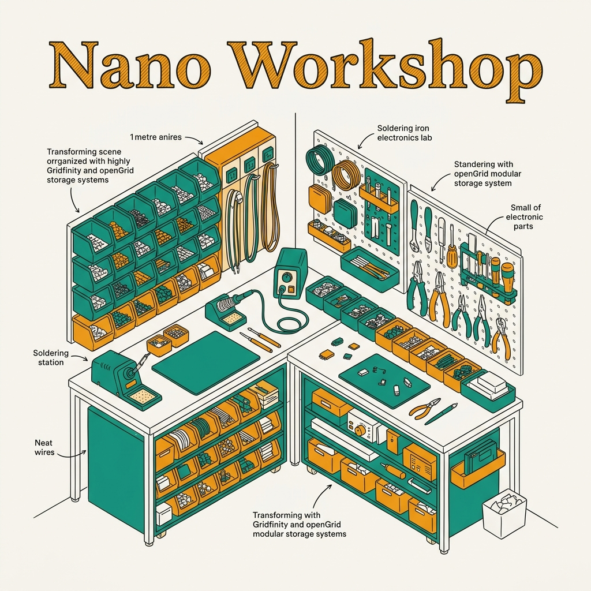
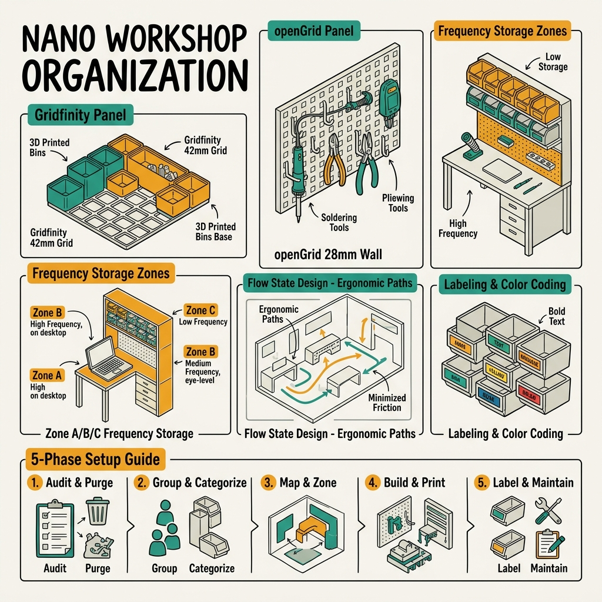
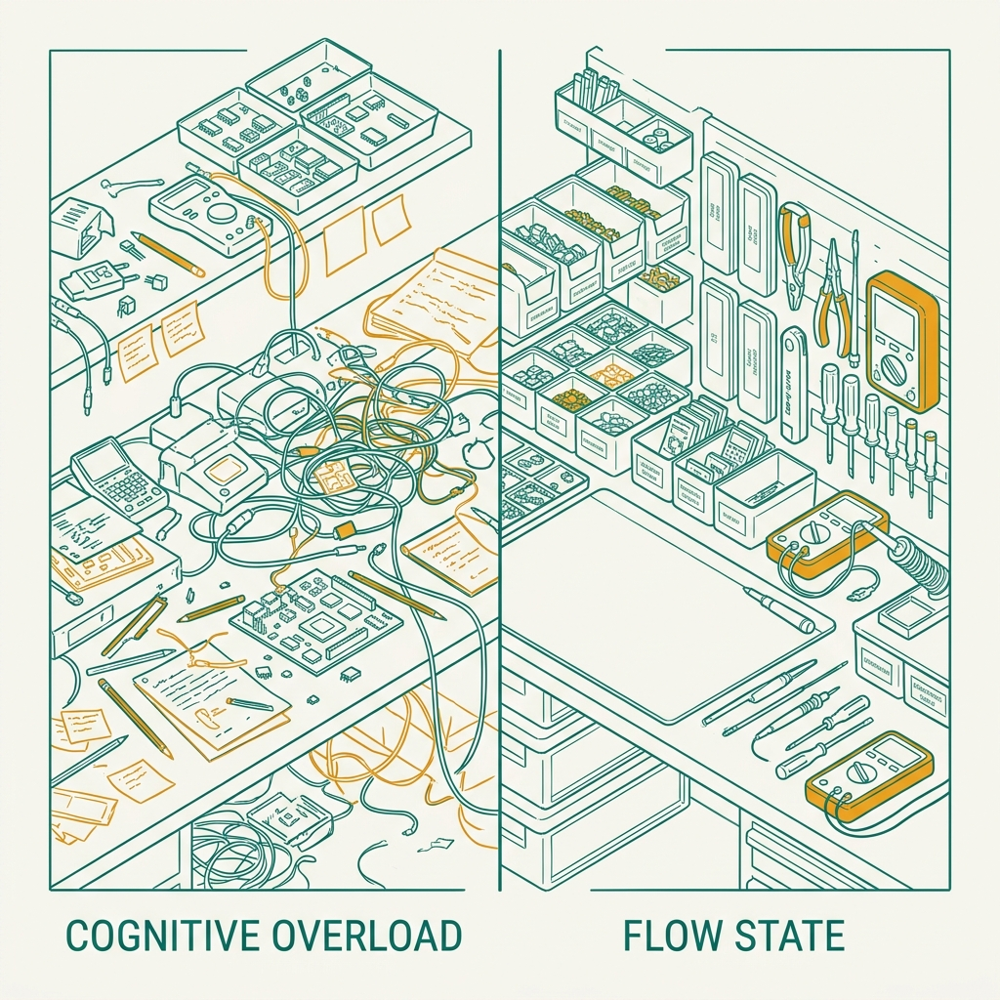
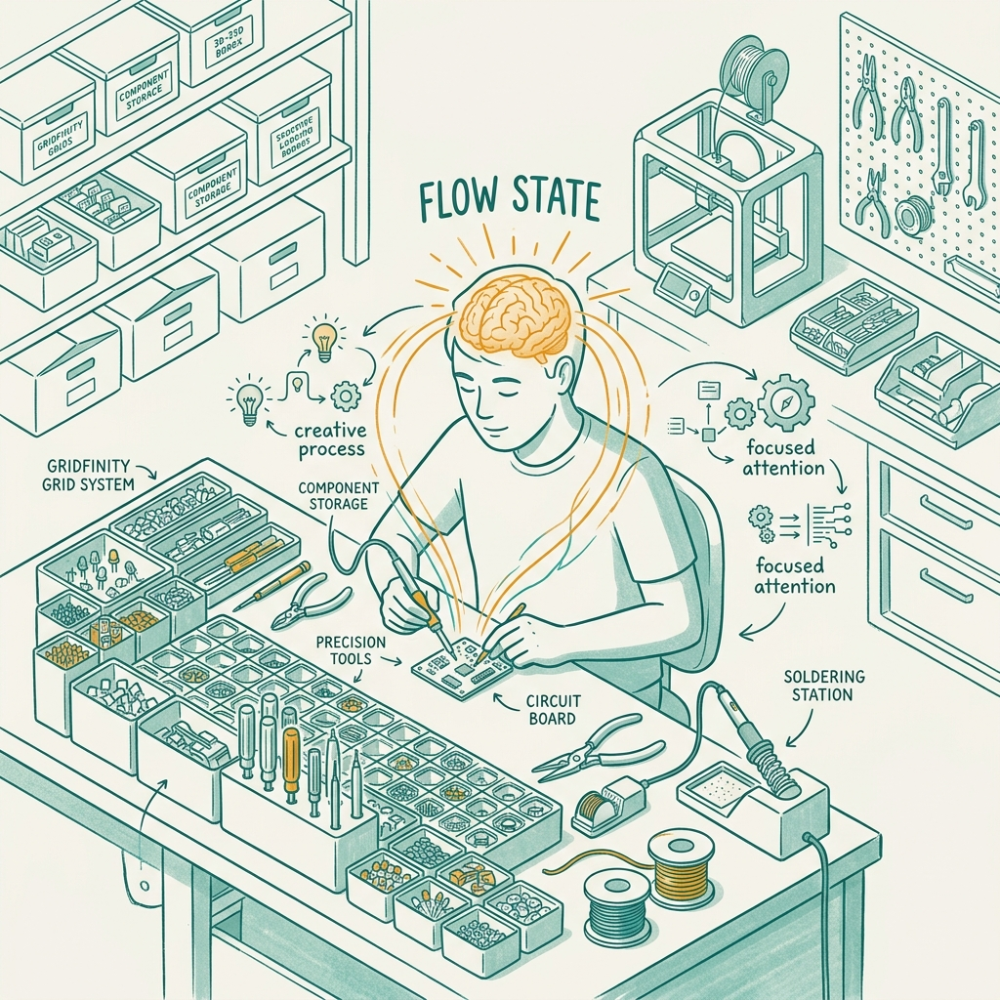

<!-- _class: title -->

# จัดระเบียบ Nano Workshop

ระบบ Modular Storage สำหรับพื้นที่จำกัด — Gridfinity + openGrid

<!-- Speaker: พื้นที่ 1 เมตรก็เป็น Maker Space ระดับมืออาชีพได้ ด้วยระบบ modular storage ที่ถูกออกแบบมา -->

---

<!-- _class: cheatsheet -->
<!-- _backgroundColor: #f8f7f4 -->

<!-- Speaker: ภาพรวมทั้งหมด — Gridfinity bins, openGrid wall, Zone A/B/C, labeling, flow state, 5-phase setup -->

---

## TL;DR: 1 เมตร = Professional Maker Space

ถ้ามีระบบ — พื้นที่ไม่ใช่ข้อจำกัด

<svg viewBox="0 0 1100 340" width="100%" xmlns="http://www.w3.org/2000/svg">
  <rect x="60" y="30" width="980" height="280" rx="16" fill="var(--paper)" stroke="var(--soft-2)" stroke-width="1.5" style="filter:drop-shadow(0 4px 12px rgba(15,23,42,.08))"/>
  <rect x="60" y="30" width="8" height="280" rx="4" fill="var(--accent)"/>
  <circle cx="160" cy="170" r="48" fill="var(--accent)" opacity=".10"/>
  <circle cx="160" cy="170" r="32" fill="var(--accent)" opacity=".20"/>
  <circle cx="160" cy="170" r="18" fill="var(--accent)"/>
  <text x="160" y="175" font-size="14" fill="white" text-anchor="middle" dominant-baseline="central" font-family="system-ui" font-weight="700">1m</text>
  <text x="240" y="130" font-size="22" font-weight="700" fill="var(--ink)" font-family="system-ui">Gridfinity (42mm) + openGrid (28mm)</text>
  <text x="240" y="162" font-size="15" fill="var(--ink-dim)" font-family="system-ui">Zone A/B/C frequency storage · Label + Color coding</text>
  <text x="240" y="192" font-size="15" fill="var(--ink-dim)" font-family="system-ui">5-phase setup · self-optimizing system</text>
  <text x="240" y="224" font-size="13" fill="var(--muted)" font-family="system-ui">Result: Flow State · zero desk clutter · professional output</text>
  <rect x="0" y="0" width="1" height="1" fill="none"/>
</svg>

<b>★ Takeaway:</b> ปัญหาไม่ใช่พื้นที่ — ปัญหาคือไม่มีระบบ

<!-- Speaker: ทั้ง deck จะพาผ่าน 2 ระบบหลัก, หลักการจัดเก็บ, และ step-by-step setup guide -->

---

## Why Small Workshops Fail: Cognitive Overhead

Disorganized workspace = constant brain tax

<svg viewBox="0 0 700 300" width="100%" xmlns="http://www.w3.org/2000/svg">
  <rect x="20" y="20" width="310" height="120" rx="10" fill="var(--danger-wash)" stroke="var(--danger)" stroke-width="1.5"/>
  <text x="175" y="52" font-size="13" font-weight="700" fill="var(--danger-ink)" text-anchor="middle" font-family="system-ui">No System</text>
  <text x="175" y="76" font-size="12" fill="var(--ink-dim)" text-anchor="middle" font-family="system-ui">Scan + locate loop</text>
  <text x="175" y="98" font-size="12" fill="var(--ink-dim)" text-anchor="middle" font-family="system-ui">Micro-interruptions kill flow</text>
  <text x="175" y="120" font-size="12" fill="var(--muted)" text-anchor="middle" font-family="system-ui">Lost focus → lost momentum</text>
  <rect x="370" y="20" width="310" height="120" rx="10" fill="var(--success-wash)" stroke="var(--success)" stroke-width="1.5"/>
  <text x="525" y="52" font-size="13" font-weight="700" fill="var(--success-ink)" text-anchor="middle" font-family="system-ui">Modular System</text>
  <text x="525" y="76" font-size="12" fill="var(--ink-dim)" text-anchor="middle" font-family="system-ui">Muscle memory access</text>
  <text x="525" y="98" font-size="12" fill="var(--ink-dim)" text-anchor="middle" font-family="system-ui">Every item has a fixed home</text>
  <text x="525" y="120" font-size="12" fill="var(--muted)" text-anchor="middle" font-family="system-ui">Deep focus preserved</text>
  <rect x="318" y="60" width="44" height="44" rx="22" fill="var(--accent)"/>
  <text x="340" y="85" font-size="13" font-weight="700" fill="white" text-anchor="middle" dominant-baseline="central" font-family="system-ui">VS</text>
  <text x="175" y="185" font-size="13" fill="var(--ink-dim)" text-anchor="middle" font-family="system-ui">avg. 5-15s per item search</text>
  <text x="175" y="205" font-size="12" fill="var(--muted)" text-anchor="middle" font-family="system-ui">20+ interruptions/session</text>
  <text x="525" y="185" font-size="13" fill="var(--ink-dim)" text-anchor="middle" font-family="system-ui">avg. &lt;2s per item access</text>
  <text x="525" y="205" font-size="12" fill="var(--muted)" text-anchor="middle" font-family="system-ui">zero search interruptions</text>
  <rect x="0" y="0" width="1" height="1" fill="none"/>
</svg>

<b>★ Takeaway:</b> Modular storage ไม่ใช่แค่ความสะอาด — มันคือการลงทุนใน cognitive capacity

<!-- Speaker: ชี้ภาพขวา: workspace ที่มีระบบ vs ซ้าย: chaos; scan-and-locate loop คือ hidden cost ที่ทุกคนจ่ายอยู่ -->

---

## Gridfinity: The Open-Source Drawer Standard

42 × 42 mm grid · 7 mm base height · community-compatible bins

  

    
Component

    <h3>Baseplate</h3>
    
แผ่นรองฝังแม่เหล็กหรือสกรู ล็อก bin ให้อยู่กับที่ · ทุก bin ของทุก maker ใช้ร่วมกันได้

  

  

    
Component

    <h3>Bin (1×1 → 3×3+)</h3>
    
กล่องเก็บของหลากขนาดบน grid 42mm · download จาก MakerWorld / Printables ฟรี

  

  

    
Component

    <h3>Accessories</h3>
    
Divider, lid, label insert, tool holder, spool rack · เพิ่มได้ไม่จำกัดตามความต้องการ

  

<b>★ Takeaway:</b> Gridfinity เป็น open standard — bin ของชุมชน compatible กับ baseplate เดียวกันทั้งหมด สร้างโดย Zack Freedman, 2022

<!-- Speaker: ชี้ baseplate ก่อน — นี่คือ foundation; bin ต่างๆ lock เข้ากันด้วยแม่เหล็กหรือ snap fit -->

---

## openGrid vs Gridfinity: Different Surface, Same Ecosystem

Gridfinity = drawer/desk · openGrid = wall/vertical surface

<svg viewBox="0 0 1100 340" width="100%" xmlns="http://www.w3.org/2000/svg">
  <rect x="40" y="20" width="470" height="300" rx="12" fill="var(--paper)" stroke="var(--soft-2)" stroke-width="1.5" style="filter:drop-shadow(var(--shadow-sm))"/>
  <rect x="40" y="20" width="470" height="56" rx="12" fill="var(--soft)" opacity=".8"/>
  <text x="275" y="55" font-size="16" font-weight="700" fill="var(--ink-dim)" text-anchor="middle" font-family="system-ui">Gridfinity</text>
  <text x="80" y="110" font-size="14" fill="var(--ink)" font-family="system-ui">Grid: 42 x 42 mm</text>
  <text x="80" y="140" font-size="14" fill="var(--ink-dim)" font-family="system-ui">Primary: drawer / desk bins</text>
  <text x="80" y="168" font-size="14" fill="var(--ink-dim)" font-family="system-ui">Focus: bin capacity &amp; variety</text>
  <text x="80" y="196" font-size="14" fill="var(--muted)" font-family="system-ui">Community: thousands of bin models</text>
  <text x="80" y="224" font-size="14" fill="var(--muted)" font-family="system-ui">Created: Zack Freedman, 2022</text>
  <rect x="590" y="20" width="470" height="300" rx="12" fill="var(--paper)" stroke="var(--accent)" stroke-width="2" style="filter:drop-shadow(var(--shadow-md))"/>
  <rect x="590" y="20" width="470" height="56" rx="12" fill="var(--accent)" opacity=".08"/>
  <text x="825" y="55" font-size="16" font-weight="700" fill="var(--accent)" text-anchor="middle" font-family="system-ui">openGrid</text>
  <text x="630" y="110" font-size="14" fill="var(--ink)" font-family="system-ui">Grid: 28 mm (finer pitch)</text>
  <text x="630" y="140" font-size="14" fill="var(--ink)" font-family="system-ui">Primary: wall / vertical panel</text>
  <text x="630" y="168" font-size="14" fill="var(--ink)" font-family="system-ui">Focus: visual cleanliness</text>
  <text x="630" y="196" font-size="14" fill="var(--ink)" font-family="system-ui">Compatible: Gridfinity + Multiboard</text>
  <text x="630" y="224" font-size="14" fill="var(--ink)" font-family="system-ui">Living-room compatible design</text>
  <circle cx="555" cy="170" r="30" fill="var(--accent)"/>
  <text x="555" y="175" font-size="13" font-weight="700" fill="white" text-anchor="middle" dominant-baseline="central" font-family="system-ui">+</text>
  <rect x="0" y="0" width="1" height="1" fill="none"/>
</svg>

<b>★ Takeaway:</b> ใช้ทั้งสองร่วมกัน — Gridfinity จัดลิ้นชัก, openGrid จัดผนัง = ทุกพื้นที่ถูกใช้งาน

<!-- Speaker: openGrid ใช้ 28mm เพราะผนังต้องการ precision มากกว่า; compatible กับ Gridfinity ทำให้ระบบรวมเป็นหนึ่ง -->

---

## Zone A/B/C: Store by Frequency of Use

Locality of reference — the closer, the more often used

<svg viewBox="0 0 1100 330" width="100%" xmlns="http://www.w3.org/2000/svg">
  <circle cx="550" cy="165" r="155" fill="none" stroke="var(--soft-2)" stroke-width="2"/>
  <circle cx="550" cy="165" r="155" fill="var(--soft)" opacity=".3"/>
  <circle cx="550" cy="165" r="105" fill="none" stroke="var(--accent)" stroke-width="2" opacity=".5"/>
  <circle cx="550" cy="165" r="105" fill="var(--accent)" opacity=".08"/>
  <circle cx="550" cy="165" r="55" fill="var(--accent)" opacity=".18"/>
  <circle cx="550" cy="165" r="55" fill="none" stroke="var(--accent)" stroke-width="2.5"/>
  <text x="550" y="158" font-size="14" font-weight="700" fill="var(--accent)" text-anchor="middle" font-family="system-ui">Zone A</text>
  <text x="550" y="177" font-size="11" fill="var(--accent-deep)" text-anchor="middle" font-family="system-ui">0-30 cm</text>
  <text x="550" y="100" font-size="12" font-weight="600" fill="var(--ink)" text-anchor="middle" font-family="system-ui">Zone B · 30-60 cm</text>
  <text x="550" y="230" font-size="11" fill="var(--muted)" text-anchor="middle" font-family="system-ui">Zone C · 60 cm+</text>
  <rect x="740" y="30" width="320" height="270" rx="10" fill="var(--paper)" stroke="var(--soft-2)" stroke-width="1"/>
  <rect x="740" y="30" width="6" height="270" rx="3" fill="var(--accent)"/>
  <text x="766" y="65" font-size="13" font-weight="700" fill="var(--accent)" font-family="system-ui">A: Every-hour tools</text>
  <text x="766" y="85" font-size="11" fill="var(--muted)" font-family="system-ui">multimeter, solder, flux, pliers</text>
  <text x="766" y="130" font-size="13" font-weight="700" fill="var(--ink)" font-family="system-ui">B: Every-project gear</text>
  <text x="766" y="150" font-size="11" fill="var(--muted)" font-family="system-ui">oscilloscope, power supply, breadboard</text>
  <text x="766" y="195" font-size="13" font-weight="700" fill="var(--muted)" font-family="system-ui">C: Specialty / rare</text>
  <text x="766" y="215" font-size="11" fill="var(--muted)" font-family="system-ui">special modules, spare parts</text>
  <text x="766" y="275" font-size="11" font-style="italic" fill="var(--muted)" font-family="system-ui">Rule: higher use = closer hand</text>
  <rect x="0" y="0" width="1" height="1" fill="none"/>
</svg>

<b>★ Takeaway:</b> Zone A/B/C คือ CPU cache hierarchy สำหรับ workshop — locality of reference ทำให้ทั้ง CPU และ maker ทำงานเร็วขึ้น

<!-- Speaker: ถ้าของชิ้นไหนต้องหานานกว่า 5 วินาที ควรย้ายขึ้น zone; rule ง่าย ไม่มีข้อยกเว้น -->

---

## Labeling + Color Coding: Self-Documenting Storage

ดูแล้วรู้ทันที — ไม่ต้องจำ ไม่ต้องเดา

  

    
Layer 1

    <h3>Label Every Bin</h3>
    
พิมพ์ชื่อบน bin insert หรือ label maker · ตัวอย่าง: <code>Resistors 0402</code>, <code>Cap 100nF</code>, <code>JST 2.0</code> · อ่านได้ทันทีโดยไม่ต้องเปิด

  

  

    
Layer 2

    <h3>Color by Category</h3>
    
Passive (blue) · Active (orange) · Connectors (green) · Power (red) · สี filament ของ bin หรือ colored tape ก็ได้

  

  

    
Layer 3

    <h3>Visual Diff</h3>
    
สีต่างกัน → หยิบผิดได้ยากมาก · ลด cognitive load ในช่วงกลางโปรเจกต์ · brain เห็นสีก่อนอ่าน text

  

<b>★ Takeaway:</b> 3 layers (label + color zone + visual diff) ทำให้ storage กลายเป็น self-documenting system ที่ใช้ได้โดยไม่ต้องอ่านอะไรเลย

<!-- Speaker: สีอ่านเร็วกว่า text 10x — นี่คือ pre-attentive processing; ใช้ประโยชน์จาก biology ของ visual system -->

---

## Flow State: Why Workspace Design is Productivity Design

Micro-interruptions are the hidden enemy of deep work

<svg viewBox="0 0 700 290" width="100%" xmlns="http://www.w3.org/2000/svg">
  <rect x="20" y="10" width="660" height="270" rx="12" fill="var(--soft)" opacity=".5"/>
  <rect x="40" y="40" width="200" height="60" rx="8" fill="var(--danger-wash)" stroke="var(--danger)" stroke-width="1.5"/>
  <text x="140" y="70" font-size="12" font-weight="600" fill="var(--danger-ink)" text-anchor="middle" font-family="system-ui">Search for tool</text>
  <text x="140" y="88" font-size="11" fill="var(--muted)" text-anchor="middle" font-family="system-ui">5-15 sec interrupt</text>
  <rect x="260" y="40" width="200" height="60" rx="8" fill="var(--danger-wash)" stroke="var(--danger)" stroke-width="1.5"/>
  <text x="360" y="70" font-size="12" font-weight="600" fill="var(--danger-ink)" text-anchor="middle" font-family="system-ui">Lost context</text>
  <text x="360" y="88" font-size="11" fill="var(--muted)" text-anchor="middle" font-family="system-ui">flow broken</text>
  <rect x="480" y="40" width="180" height="60" rx="8" fill="var(--danger-wash)" stroke="var(--danger)" stroke-width="1.5"/>
  <text x="570" y="70" font-size="12" font-weight="600" fill="var(--danger-ink)" text-anchor="middle" font-family="system-ui">Re-enter flow</text>
  <text x="570" y="88" font-size="11" fill="var(--muted)" text-anchor="middle" font-family="system-ui">23 min cost</text>
  <line x1="240" y1="70" x2="258" y2="70" stroke="var(--danger)" stroke-width="2" marker-end="url(#arr)"/>
  <line x1="460" y1="70" x2="478" y2="70" stroke="var(--danger)" stroke-width="2"/>
  <rect x="40" y="160" width="620" height="90" rx="8" fill="var(--success-wash)" stroke="var(--success)" stroke-width="1.5"/>
  <text x="350" y="195" font-size="13" font-weight="700" fill="var(--success-ink)" text-anchor="middle" font-family="system-ui">Modular System: reach → grab → continue</text>
  <text x="350" y="218" font-size="12" fill="var(--ink-dim)" text-anchor="middle" font-family="system-ui">muscle memory access · &lt;2 sec · flow state preserved</text>
  <text x="350" y="238" font-size="11" fill="var(--muted)" text-anchor="middle" font-family="system-ui">Csikszentmihalyi: flow = challenge meets skill, uninterrupted</text>
  <rect x="0" y="0" width="1" height="1" fill="none"/>
</svg>

<b>★ Takeaway:</b> ลงทุน 1 สัปดาห์ setup ได้ผลตอบแทนเป็น Flow State ทุกโปรเจกต์หลังจากนั้น

<!-- Speaker: research พบว่า interrupt 15 วินาที ใช้เวลา 23 นาทีในการ re-enter deep focus; modular storage ตัดต้นทุนนี้ -->

---

## 5-Phase Setup Guide

จาก zero ถึง professional Nano Workshop ใน 1 สัปดาห์

<svg viewBox="0 0 1100 300" width="100%" xmlns="http://www.w3.org/2000/svg">
  <rect x="20" y="80" width="195" height="130" rx="10" fill="var(--paper)" stroke="var(--accent)" stroke-width="2" style="filter:drop-shadow(var(--shadow-sm))"/>
  <circle cx="117" cy="60" r="22" fill="var(--accent)"/>
  <text x="117" y="65" font-size="14" font-weight="700" fill="white" text-anchor="middle" dominant-baseline="central" font-family="system-ui">1</text>
  <text x="117" y="115" font-size="13" font-weight="700" fill="var(--ink)" text-anchor="middle" font-family="system-ui">Analyze</text>
  <text x="117" y="135" font-size="11" fill="var(--ink-dim)" text-anchor="middle" font-family="system-ui">measure space</text>
  <text x="117" y="153" font-size="11" fill="var(--muted)" text-anchor="middle" font-family="system-ui">list all tools</text>
  <text x="117" y="171" font-size="11" fill="var(--muted)" text-anchor="middle" font-family="system-ui">sort A/B/C zones</text>
  <polygon points="225,145 245,155 225,165" fill="var(--accent)" opacity=".6"/>
  <rect x="250" y="80" width="195" height="130" rx="10" fill="var(--paper)" stroke="var(--accent)" stroke-width="1.5" style="filter:drop-shadow(var(--shadow-sm))"/>
  <circle cx="347" cy="60" r="22" fill="var(--accent)" opacity=".8"/>
  <text x="347" y="65" font-size="14" font-weight="700" fill="white" text-anchor="middle" dominant-baseline="central" font-family="system-ui">2</text>
  <text x="347" y="115" font-size="13" font-weight="700" fill="var(--ink)" text-anchor="middle" font-family="system-ui">Baseplate</text>
  <text x="347" y="135" font-size="11" fill="var(--ink-dim)" text-anchor="middle" font-family="system-ui">Gridfinity generator</text>
  <text x="347" y="153" font-size="11" fill="var(--muted)" text-anchor="middle" font-family="system-ui">calculate grid count</text>
  <text x="347" y="171" font-size="11" fill="var(--muted)" text-anchor="middle" font-family="system-ui">print / buy baseplate</text>
  <polygon points="455,145 475,155 455,165" fill="var(--accent)" opacity=".6"/>
  <rect x="480" y="80" width="195" height="130" rx="10" fill="var(--paper)" stroke="var(--accent)" stroke-width="1.5" style="filter:drop-shadow(var(--shadow-sm))"/>
  <circle cx="577" cy="60" r="22" fill="var(--accent)" opacity=".8"/>
  <text x="577" y="65" font-size="14" font-weight="700" fill="white" text-anchor="middle" dominant-baseline="central" font-family="system-ui">3</text>
  <text x="577" y="115" font-size="13" font-weight="700" fill="var(--ink)" text-anchor="middle" font-family="system-ui">Wall (openGrid)</text>
  <text x="577" y="135" font-size="11" fill="var(--ink-dim)" text-anchor="middle" font-family="system-ui">print 28mm tiles</text>
  <text x="577" y="153" font-size="11" fill="var(--muted)" text-anchor="middle" font-family="system-ui">mount w/ Command strips</text>
  <text x="577" y="171" font-size="11" fill="var(--muted)" text-anchor="middle" font-family="system-ui">add hooks / shelves</text>
  <polygon points="685,145 705,155 685,165" fill="var(--accent)" opacity=".6"/>
  <rect x="710" y="80" width="175" height="130" rx="10" fill="var(--paper)" stroke="var(--gold)" stroke-width="1.5" style="filter:drop-shadow(var(--shadow-sm))"/>
  <circle cx="797" cy="60" r="22" fill="var(--gold)"/>
  <text x="797" y="65" font-size="14" font-weight="700" fill="white" text-anchor="middle" dominant-baseline="central" font-family="system-ui">4</text>
  <text x="797" y="115" font-size="13" font-weight="700" fill="var(--ink)" text-anchor="middle" font-family="system-ui">Organize + Label</text>
  <text x="797" y="135" font-size="11" fill="var(--ink-dim)" text-anchor="middle" font-family="system-ui">Zone A first</text>
  <text x="797" y="153" font-size="11" fill="var(--muted)" text-anchor="middle" font-family="system-ui">print label inserts</text>
  <text x="797" y="171" font-size="11" fill="var(--muted)" text-anchor="middle" font-family="system-ui">assign color zones</text>
  <polygon points="895,145 915,155 895,165" fill="var(--gold)" opacity=".7"/>
  <rect x="920" y="80" width="160" height="130" rx="10" fill="var(--success-wash)" stroke="var(--success)" stroke-width="1.5" style="filter:drop-shadow(var(--shadow-sm))"/>
  <circle cx="1000" cy="60" r="22" fill="var(--success)"/>
  <text x="1000" y="65" font-size="14" font-weight="700" fill="white" text-anchor="middle" dominant-baseline="central" font-family="system-ui">5</text>
  <text x="1000" y="115" font-size="13" font-weight="700" fill="var(--success-ink)" text-anchor="middle" font-family="system-ui">Iterate</text>
  <text x="1000" y="135" font-size="11" fill="var(--ink-dim)" text-anchor="middle" font-family="system-ui">note 5-sec items</text>
  <text x="1000" y="153" font-size="11" fill="var(--muted)" text-anchor="middle" font-family="system-ui">weekly reorganize</text>
  <text x="1000" y="171" font-size="11" fill="var(--muted)" text-anchor="middle" font-family="system-ui">self-optimize in 2-3 projects</text>
  <rect x="0" y="0" width="1" height="1" fill="none"/>
</svg>

<b>★ Takeaway:</b> Phase 5 (Iterate) คือ key — ระบบไม่ finish ครั้งเดียว, evolve ตามโปรเจกต์

<!-- Speaker: เน้น Phase 5 — คนส่วนใหญ่ setup แล้วหยุด; ระบบที่ดีต้อง iterate ตาม usage pattern จริง -->

---

## Caveats: Know Before You Print

ข้อจำกัดที่ต้องรู้ก่อน commit พื้นที่และเวลา

  

    
Planning

    <h3>Print Time</h3>
    
Baseplate 5×8 = 4-8 ชั่วโมง · bin ชุดแรก 10-20 ชิ้น = 2-5 วัน · plan ahead ก่อนเริ่มโปรเจกต์

  

  

    
Hardware

    <h3>Magnetic Baseplate</h3>
    
ต้องซื้อ neodymium magnet แยก: 6mm × 2mm · ราคาไม่แพงแต่ต้อง source เพิ่ม · หรือใช้ snap-fit แทน

  

  

    
Dependency

    <h3>3D Printer Required</h3>
    
ถ้าไม่มี printer → pre-printed kits ราคาสูง + ตัวเลือกน้อย · Alternative: KWB, Raaco commercial systems

  

  

    
Edge Case

    <h3>SMD / Tiny Parts</h3>
    
42mm grid ใหญ่เกินสำหรับ 0201/0402 SMD · ใช้ bin แบบ subdivided หรือ ESD tray แทน สำหรับ parts เล็กมาก

  

<b>★ Takeaway:</b> รู้ constraints ก่อน = วางแผนได้ถูก; ระบบ modular ยังดีที่สุดสำหรับ maker space ในบ้าน แม้มี tradeoffs

<!-- Speaker: danger card (3D printer) คือ biggest barrier; แต่ pre-printed kits ก็มี — ระบบยังใช้ได้โดยไม่ต้องพิมพ์เอง -->

---

## Key Takeaways

สิ่งที่ต้องจำหลังจากปิด deck นี้

  

    
System

    <h3>Gridfinity + openGrid</h3>
    
42mm drawer bins + 28mm wall panels = ecosystem ครบทุกพื้นที่ · open standard · community models ฟรี

  

  

    
Principle

    <h3>Frequency-Based Zones</h3>
    
Zone A/B/C = CPU cache hierarchy · ยิ่งใช้บ่อย ยิ่งต้องอยู่ใกล้มือ · plan zones ก่อน print

  

  

    
UX

    <h3>Label + Color Code</h3>
    
3-layer self-documenting: label → color zone → visual diff · brain อ่านสีเร็วกว่า text 10x

  

  

    
Outcome

    <h3>Flow State Investment</h3>
    
1 สัปดาห์ setup → คืน Flow State ทุกโปรเจกต์ · modular = evolve ได้ ไม่ใช่ one-time setup

  

<b>★ Takeaway:</b> 1 เมตรก็เป็น professional maker space ได้ — ปัญหาไม่ใช่พื้นที่ แต่คือขาดระบบ

<!-- Speaker: ย้ำ key message: space ไม่ใช่ข้อจำกัด — ระบบต่างหากที่เป็นตัวแยก amateur กับ professional workspace -->
