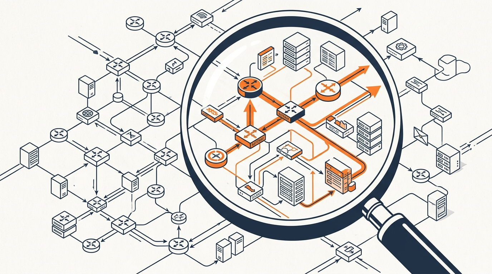
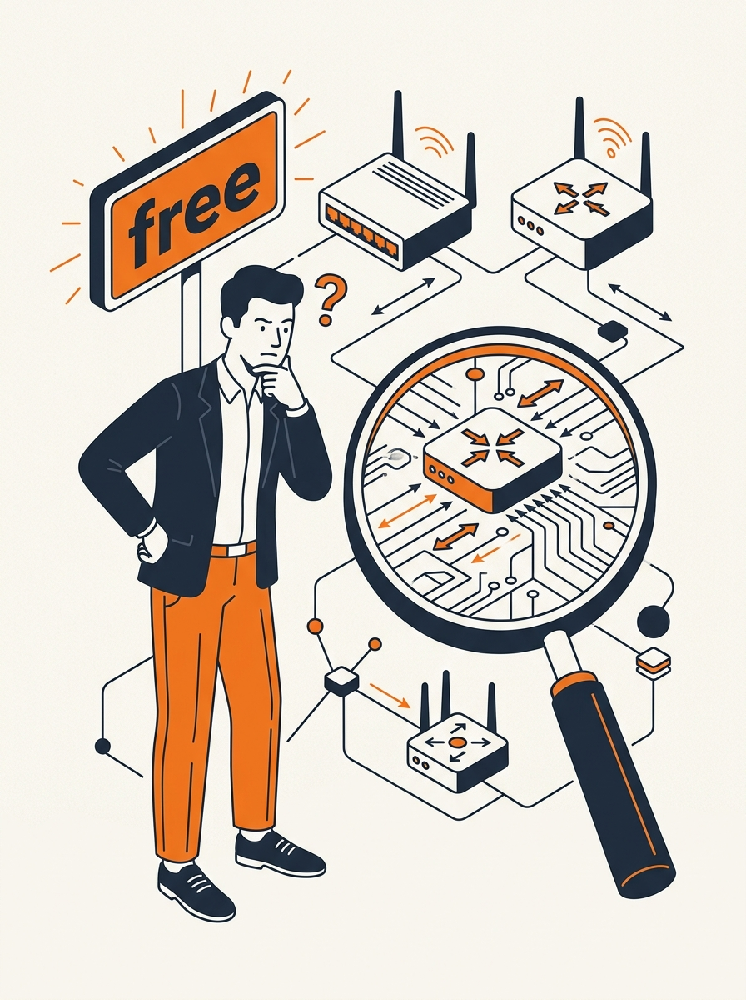

<!-- _class: title -->



<div class="mark"></div>

# เจาะลึก NaraRouter: Claude Code + n8n ฟรี 7M Token/วัน จริงหรือ?

<p class="tag">Fact-check เปรียบเทียบคำโฆษณากับ source จริง — ก่อนผูก credential ของคุณเข้ากับ third-party router</p>

<!-- Speaker: เปิดด้วยคำถามตรงๆ — คำกล่าวอ้างที่กระจายในคลิป YouTube ตรงกับสิ่งที่บริการจริงมีให้หรือไม่ -->

---

<!-- _class: cheatsheet -->
<!-- _backgroundColor: #f8f7f4 -->


<!-- Speaker: cheatsheet สรุปทั้ง deck ในภาพเดียว — ชี้ไปที่โซน "GLM 5.2 Not in NaraRouter" ก่อนเข้าเนื้อหา -->

---

## TL;DR: โควตาฟรีมีจริง แต่ GLM 5.2 ไม่มี

<p class="subhead">แยก fact ที่ตรวจสอบได้ ออกจาก hype ที่มาจากคลิปสอนเท่านั้น</p>

<div class="infographic">
<div class="bento cols-2">
  <div class="card success">
    <p class="label">Confirmed</p>
    <h3>7M tokens/day free tier</h3>
    <p>router.bynara.id — 10 req/min rate limit, verified on the live site.</p>
  </div>
  <div class="card danger">
    <p class="label">Not Found</p>
    <h3>GLM 5.2 free access</h3>
    <p>ไม่อยู่ใน model list ของ NaraRouter เลย ทั้ง free และ paid tier.</p>
  </div>
</div>
</div>

<div class="takeaway"><b>★ Takeaway:</b> ตรวจ source จริงก่อนเชื่อคลิปสอน — คำกล่าวอ้างสองข้อสำคัญที่สุดพิสูจน์ไม่ได้</div>

<!-- Speaker: ตั้งกรอบเรื่องทั้ง deck ตรงนี้ — เดี๋ยวจะไล่ทีละประเด็น -->

---

## ทำไมเรื่องนี้ถึงสำคัญ



<p class="subhead">Claude Code ไม่ใช่ chat เล่นๆ — มันพ่วงกับโค้ดและ prompt จริงในงานประจำวัน</p>

<div class="infographic">
<svg viewBox="0 0 700 320" width="100%" xmlns="http://www.w3.org/2000/svg">
  <rect x="30" y="40" width="640" height="70" rx="10" fill="var(--paper)" stroke="var(--soft-2)" stroke-width="1.5"/>
  <text x="60" y="82" font-size="16" font-weight="700" fill="var(--ink)" font-family="system-ui">Your Code + Prompts</text>
  <path d="M350 110 L350 150" stroke="var(--accent)" stroke-width="2.5" marker-end="url(#arrow)"/>
  <rect x="30" y="160" width="640" height="70" rx="10" fill="var(--danger-wash)" stroke="var(--danger)" stroke-width="1.5"/>
  <text x="60" y="202" font-size="16" font-weight="700" fill="var(--danger-ink)" font-family="system-ui">Unverified Third-Party Router</text>
  <path d="M350 230 L350 270" stroke="var(--muted)" stroke-width="2.5" marker-end="url(#arrow2)"/>
  <text x="350" y="300" font-size="14" fill="var(--muted)" text-anchor="middle" font-family="system-ui">Anthropic / Model Provider</text>
  <defs>
    <marker id="arrow" markerWidth="10" markerHeight="10" refX="5" refY="5" orient="auto"><path d="M0,0 L10,5 L0,10 Z" fill="var(--accent)"/></marker>
    <marker id="arrow2" markerWidth="10" markerHeight="10" refX="5" refY="5" orient="auto"><path d="M0,0 L10,5 L0,10 Z" fill="var(--muted)"/></marker>
  </defs>
</svg>
</div>

<div class="takeaway"><b>★ Takeaway:</b> ถ้าตั้ง ANTHROPIC_BASE_URL ชี้ไป router นี้ โค้ดและ prompt ทั้งหมดไหลผ่าน server ของบุคคลที่สามก่อนถึงปลายทาง</div>

<!-- Speaker: ปูพื้นความเสี่ยงก่อนเข้าเนื้อหาสิ่งที่ตรวจสอบได้จริง -->

---

## NaraRouter คืออะไรจริงๆ

<p class="subhead">Unified AI gateway — proxy รวม API หลายผู้ให้บริการไว้หลัง endpoint เดียว</p>

<div class="infographic">
<div class="bento cols-2">
  <div class="card">
    <p class="label">Endpoint 1</p>
    <h3>/v1/chat/completions</h3>
    <p>OpenAI-compatible — ใช้กับ SDK ที่รองรับ OpenAI format ได้เลย</p>
  </div>
  <div class="card">
    <p class="label">Endpoint 2</p>
    <h3>/v1/messages</h3>
    <p>Anthropic-compatible — ใช้กับ Claude Code ได้ผ่าน ANTHROPIC_BASE_URL</p>
  </div>
</div>
</div>

<div class="takeaway"><b>★ Takeaway:</b> Base URL คือ https://router.bynara.id/v1 — API key format sk-nara-xxxx</div>

<!-- Speaker: อธิบายว่า gateway ทำหน้าที่แค่ proxy request ไป provider ต้นทาง -->

---

## Onboarding ที่ระบุจริงบนเว็บไซต์

<p class="subhead">3 ขั้นตอนตามที่เว็บไซต์ระบุ — ไม่มี Google sign-in หรือ Telegram verification</p>

<div class="infographic">
<svg viewBox="0 0 1100 340" width="100%" xmlns="http://www.w3.org/2000/svg">
  <circle cx="180" cy="150" r="46" fill="var(--accent)"/>
  <text x="180" y="158" font-size="24" font-weight="700" fill="white" text-anchor="middle" font-family="system-ui">1</text>
  <text x="180" y="230" font-size="15" font-weight="700" fill="var(--ink)" text-anchor="middle" font-family="system-ui">Sign Up</text>
  <text x="180" y="252" font-size="12" fill="var(--muted)" text-anchor="middle" font-family="system-ui">Create account</text>
  <path d="M240 150 L400 150" stroke="var(--muted)" stroke-width="2.5" marker-end="url(#a1)"/>
  <circle cx="460" cy="150" r="46" fill="var(--accent)"/>
  <text x="460" y="158" font-size="24" font-weight="700" fill="white" text-anchor="middle" font-family="system-ui">2</text>
  <text x="460" y="230" font-size="15" font-weight="700" fill="var(--ink)" text-anchor="middle" font-family="system-ui">Get API Key</text>
  <text x="460" y="252" font-size="12" fill="var(--muted)" text-anchor="middle" font-family="system-ui">From dashboard</text>
  <path d="M520 150 L680 150" stroke="var(--muted)" stroke-width="2.5" marker-end="url(#a2)"/>
  <circle cx="740" cy="150" r="46" fill="var(--accent)"/>
  <text x="740" y="158" font-size="24" font-weight="700" fill="white" text-anchor="middle" font-family="system-ui">3</text>
  <text x="740" y="230" font-size="15" font-weight="700" fill="var(--ink)" text-anchor="middle" font-family="system-ui">Set Base URL</text>
  <text x="740" y="252" font-size="12" fill="var(--muted)" text-anchor="middle" font-family="system-ui">Paste into your tool</text>
  <defs>
    <marker id="a1" markerWidth="10" markerHeight="10" refX="5" refY="5" orient="auto"><path d="M0,0 L10,5 L0,10 Z" fill="var(--muted)"/></marker>
    <marker id="a2" markerWidth="10" markerHeight="10" refX="5" refY="5" orient="auto"><path d="M0,0 L10,5 L0,10 Z" fill="var(--muted)"/></marker>
  </defs>
</svg>
</div>

<div class="takeaway"><b>★ Takeaway:</b> ลิงก์ Telegram ที่พบ (t.me/bynara_ai) เป็นแค่ช่องทาง support ไม่ใช่ auth flow</div>

<!-- Speaker: ย้ำว่านี่คือขั้นตอนจากเว็บไซต์จริง ไม่ใช่จากคลิปสอน -->

---

## Pricing Tier ที่ระบุจริง

<p class="subhead">ราคาเป็น Rupiah อินโดนีเซีย — บ่งชี้บริการระดับ personal/regional</p>

| Tier | ราคา/วัน | Token cap | Rate limit |
|------|---------|-----------|------------|
| Free | Rp 0 | 7M | 10 req/min |
| Mimo Lite | Rp 10K | 12M | 50 req/min |
| Mimo Plus | Rp 15K | 17M | 50 req/min |
| Mimo Pro | Rp 18K | 20M | 50 req/min |
| GPT Fams | Rp 40K | 25M | 60 req/min |

<div class="takeaway"><b>★ Takeaway:</b> "Fair-use policy" ไม่มีนิยามตัวเลขชัดเจน — ยกเลิก request กลางทางอาจยังถูกคิด token เต็มจำนวน</div>

<!-- Speaker: ชี้ว่าราคาเป็นสกุลเงินอินโดนีเซีย ไม่ใช่ USD -->

---

## Myth Busted: GLM 5.2 อยู่ตรงไหน?

<p class="subhead">คำตอบ: ไม่อยู่เลย — ทั้ง free tier และ paid tier</p>

<div class="infographic">
<div class="bento cols-2">
  <div class="card danger">
    <p class="label">Hype (จากคลิปสอน)</p>
    <h3>GLM 5.2 ฟรีผ่าน NaraRouter</h3>
    <p>คำกล่าวอ้างที่กระจายในคลิป YouTube หลายคลิป</p>
  </div>
  <div class="card success">
    <p class="label">Fact (จากเว็บไซต์จริง)</p>
    <h3>Model list จริง: Agnes, Mistral, Nemotron</h3>
    <p>Zhipu AI ปรากฏแค่โลโก้ "supported provider" — ไม่มี GLM 5.2 ในรายการโมเดล</p>
  </div>
</div>
</div>

<div class="takeaway"><b>★ Takeaway:</b> GLM 5.2 เป็นโมเดลจริง (Z.ai, 2026-06-16, 1M context) แต่ต้องจ่ายราคา official $1.40/$4.40 ต่อ 1M token — ไม่ได้ฟรีที่ NaraRouter</div>

<!-- Speaker: จุดหักมุมของ deck — เน้นตรงนี้ -->

---

## ต่อกับ Claude Code — ตาม official docs ไม่ใช่ตาม router

<p class="subhead">ANTHROPIC_BASE_URL + ANTHROPIC_AUTH_TOKEN คือกลไกจริงจาก Anthropic</p>

<div class="infographic" style="align-items:stretch;flex-direction:column;gap:10px;">

```json
{
  "env": {
    "ANTHROPIC_BASE_URL": "https://router.bynara.id/v1",
    "ANTHROPIC_AUTH_TOKEN": "sk-nara-xxxx"
  }
}
```

<div class="card danger compact">
<h3>⚠ ห้ามใส่ credential ใน project .claude/settings.json</h3>
<p>ไฟล์นี้ถูก commit เข้า repo — ใช้ ~/.claude/settings.json หรือ .claude/settings.local.json แทน</p>
</div>

</div>

<div class="takeaway"><b>★ Takeaway:</b> ตรวจสอบว่าเชื่อมสำเร็จด้วย /status — ต้องเห็น Anthropic base URL ชี้ไป router</div>

<!-- Speaker: ชี้ที่ warning card เป็นพิเศษ — นี่คือจุดที่คนพลาดบ่อยที่สุด -->

---

## ต่อกับ n8n — ไม่ใช่ configuration ที่มีเอกสารรองรับ

<p class="subhead">Built-in OpenAI credential ของ n8n มีแค่ API Key + Organization ID</p>

<div class="infographic">
<div class="bento cols-2">
  <div class="card warning">
    <p class="label">Built-in OpenAI Credential</p>
    <h3>ไม่มีฟิลด์ Base URL</h3>
    <p>เอกสารทางการของ n8n ระบุแค่ API Key และ Organization ID เท่านั้น</p>
  </div>
  <div class="card">
    <p class="label">ทางเลือกที่ทำได้จริง</p>
    <h3>HTTP Request Node</h3>
    <p>เรียก endpoint ใดก็ได้ รวมถึง router.bynara.id/v1/chat/completions โดยตรง</p>
  </div>
</div>
</div>

<div class="takeaway"><b>★ Takeaway:</b> ต่อ NaraRouter ผ่าน n8n's native AI node ไม่ใช่ configuration ที่มีเอกสารรองรับอย่างเป็นทางการ</div>

<!-- Speaker: อธิบายว่า HTTP Request node เป็น generic fallback เสมอ -->

---

## Caveats ที่ต้องรู้ก่อนผูก credential จริง

<p class="subhead">5 ความเสี่ยงจาก source จริงและเอกสารทางการ</p>

<div class="infographic">
<div class="bento cols-3">
  <div class="card danger compact">
    <p class="label">ToS</p>
    <h3>Anthropic ไม่รับรอง gateway</h3>
    <p>"doesn't endorse... or audit third-party gateway products"</p>
  </div>
  <div class="card warning compact">
    <p class="label">Security</p>
    <h3>SSL signal ขัดกัน</h3>
    <p>Sur.ly ระบุไม่มี SSL แต่เข้าเว็บผ่าน https:// ได้จริง — unverified</p>
  </div>
  <div class="card warning compact">
    <p class="label">Privacy</p>
    <h3>ไม่มี data policy ชัดเจน</h3>
    <p>ไม่พบ retention/privacy policy สำหรับ prompt ที่ส่งผ่าน</p>
  </div>
  <div class="card compact">
    <p class="label">Sustainability</p>
    <h3>โควตาฟรีอาจหายได้</h3>
    <p>โมเดลธุรกิจแบบนี้มักอยู่ได้จาก promotional quota arbitrage</p>
  </div>
  <div class="card compact">
    <p class="label">Pricing</p>
    <h3>GLM 5.2 จริงไม่ฟรี</h3>
    <p>$1.40/$4.40 ต่อ 1M token ที่ Z.ai official</p>
  </div>
</div>
</div>

<div class="takeaway"><b>★ Takeaway:</b> พิจารณา ToS, privacy, และความยั่งยืนก่อนตัดสินใจผูกบัญชีจริง</div>

<!-- Speaker: ไล่ทีละ card สั้นๆ ไม่ต้องอ่านทุกคำ -->

---

## Key Takeaways

<p class="subhead">สิ่งที่ต้องจำแม้ข้ามเนื้อหาส่วนอื่นไปหมด</p>

<div class="infographic">
<div class="bento cols-2">
  <div class="card success">
    <h3>สิ่งที่จริง</h3>
    <ul>
      <li>7M token/วัน free tier มีจริง</li>
      <li>Endpoint OpenAI + Anthropic compatible</li>
      <li>Claude Code ต่อ gateway ได้ผ่าน official env vars</li>
    </ul>
  </div>
  <div class="card danger">
    <h3>สิ่งที่ไม่จริง / ต้องระวัง</h3>
    <ul>
      <li>GLM 5.2 ไม่อยู่ใน model list เลย</li>
      <li>ไม่มี Google/Telegram auth ตามที่เข้าใจ</li>
      <li>Anthropic ไม่รับรอง gateway นี้อย่างเป็นทางการ</li>
    </ul>
  </div>
</div>
</div>

<div class="takeaway"><b>★ Takeaway:</b> ตรวจ source จริงก่อนผูก credential ของบัญชีจริงกับบริการที่ไม่มีใครรับรอง</div>

<!-- Speaker: ปิดท้ายด้วยการย้ำ 3 fact สำคัญที่สุด -->
