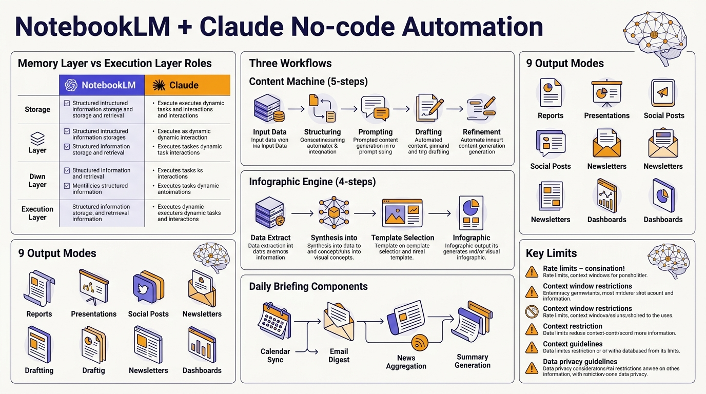

<!-- _class: title -->

# NotebookLM + Claude: No-code Automation Pipeline

Memory layer + Execution layer = AI ที่ไม่หลอน ทำงานแทนคุณได้จริง

<!-- Speaker: ในสไลด์ชุดนี้จะดู 3 workflow ที่รวม NotebookLM กับ Claude โดยไม่เขียนโค้ดเลย -->

---

<!-- _class: cheatsheet -->
<!-- _backgroundColor: #fafaf8 -->

<!-- Speaker: Cheatsheet ภาพรวมทั้งหมด — Memory vs Execution roles, 3 workflows, 9 output modes, key caveats -->

---

## TL;DR: Two Layers, Zero Hallucination

NotebookLM = memory; Claude = execution — ร่วมกันสร้าง pipeline ที่แม่นยำโดยไม่ต้องเขียนโค้ด

<svg viewBox="0 0 1100 320" width="100%" xmlns="http://www.w3.org/2000/svg">
  <!-- left: NotebookLM -->
  <rect x="60" y="40" width="380" height="240" rx="16" fill="var(--paper)" stroke="var(--soft-2)" stroke-width="1.5" style="filter:drop-shadow(0 4px 12px rgba(15,23,42,.08))"/>
  <rect x="60" y="40" width="380" height="52" rx="12" fill="var(--accent)" opacity=".1"/>
  <text x="250" y="73" font-size="16" font-weight="700" fill="var(--accent)" text-anchor="middle" font-family="system-ui">NotebookLM</text>
  <text x="250" y="95" font-size="13" fill="var(--muted)" text-anchor="middle" font-family="system-ui">Memory Layer</text>
  <text x="100" y="135" font-size="14" fill="var(--ink)" font-family="system-ui">Organize + ground data</text>
  <text x="100" y="160" font-size="13" fill="var(--ink-dim)" font-family="system-ui">Curate sources: PDF, YouTube, notes</text>
  <text x="100" y="185" font-size="13" fill="var(--ink-dim)" font-family="system-ui">Output: grounded summary + citations</text>
  <text x="100" y="210" font-size="13" fill="var(--ink-dim)" font-family="system-ui">9 Studio modes (podcast, slides, video...)</text>
  <!-- arrow -->
  <path d="M 456 160 L 640 160" stroke="var(--accent)" stroke-width="2.5" fill="none"/>
  <polygon points="640,153 655,160 640,167" fill="var(--accent)"/>
  <text x="548" y="148" font-size="12" fill="var(--accent)" text-anchor="middle" font-family="system-ui" font-weight="600">grounded</text>
  <text x="548" y="163" font-size="12" fill="var(--accent)" text-anchor="middle" font-family="system-ui" font-weight="600">context</text>
  <!-- right: Claude -->
  <rect x="660" y="40" width="380" height="240" rx="16" fill="var(--paper)" stroke="var(--accent)" stroke-width="2" style="filter:drop-shadow(0 4px 12px rgba(15,23,42,.10))"/>
  <rect x="660" y="40" width="380" height="52" rx="12" fill="var(--accent)" opacity=".15"/>
  <text x="850" y="73" font-size="16" font-weight="700" fill="var(--accent)" text-anchor="middle" font-family="system-ui">Claude</text>
  <text x="850" y="95" font-size="13" fill="var(--muted)" text-anchor="middle" font-family="system-ui">Execution Layer</text>
  <text x="700" y="135" font-size="14" fill="var(--ink)" font-family="system-ui">Reason + automate tasks</text>
  <text x="700" y="160" font-size="13" fill="var(--ink-dim)" font-family="system-ui">Script / design brief / Slack message</text>
  <text x="700" y="185" font-size="13" fill="var(--ink-dim)" font-family="system-ui">Chrome extension: browser automation</text>
  <text x="700" y="210" font-size="13" fill="var(--ink-dim)" font-family="system-ui">No API key needed for basic workflows</text>
  <rect x="0" y="0" width="1" height="1" fill="none"/>
</svg>

<b>★ Takeaway:</b> NotebookLM ป้องกัน hallucination ด้วยการ ground output ใน curated sources — Claude แปลง knowledge นั้นเป็น deliverable จริง

<!-- Speaker: Core concept ใน 30 วินาที: แบ่งหน้าที่ชัดเจน — memory vs execution -->

---

## Background: ทำไม AI ถึง "หลอน"?

AI สร้างข้อมูลที่ฟังดูน่าเชื่อถือแต่ผิด — ปัญหาหลักของทุก LLM ที่ไม่มี grounding

<svg viewBox="0 0 700 280" width="100%" xmlns="http://www.w3.org/2000/svg">
  <!-- ungrounded path -->
  <rect x="20" y="20" width="300" height="240" rx="12" fill="var(--danger-wash)" stroke="var(--danger)" stroke-width="1.5"/>
  <text x="170" y="52" font-size="14" font-weight="700" fill="var(--danger-ink)" text-anchor="middle" font-family="system-ui">Without Grounding</text>
  <rect x="44" y="70" width="252" height="36" rx="8" fill="var(--paper)"/>
  <text x="170" y="93" font-size="12" fill="var(--ink)" text-anchor="middle" font-family="system-ui">Prompt → LLM → Output</text>
  <text x="170" y="135" font-size="12" fill="var(--danger-ink)" text-anchor="middle" font-family="system-ui">Fabricated citations</text>
  <text x="170" y="158" font-size="12" fill="var(--danger-ink)" text-anchor="middle" font-family="system-ui">Wrong statistics</text>
  <text x="170" y="181" font-size="12" fill="var(--danger-ink)" text-anchor="middle" font-family="system-ui">Plausible-but-false claims</text>
  <text x="170" y="228" font-size="13" font-weight="700" fill="var(--danger)" text-anchor="middle" font-family="system-ui">HIGH hallucination risk</text>
  <!-- grounded path -->
  <rect x="360" y="20" width="320" height="240" rx="12" fill="var(--success-wash)" stroke="var(--success)" stroke-width="1.5"/>
  <text x="520" y="52" font-size="14" font-weight="700" fill="var(--success-ink)" text-anchor="middle" font-family="system-ui">With NotebookLM Grounding</text>
  <rect x="384" y="70" width="272" height="36" rx="8" fill="var(--paper)"/>
  <text x="520" y="93" font-size="12" fill="var(--ink)" text-anchor="middle" font-family="system-ui">Sources → Notebook → Prompt → Output</text>
  <text x="520" y="135" font-size="12" fill="var(--success-ink)" text-anchor="middle" font-family="system-ui">Citations from curated sources</text>
  <text x="520" y="158" font-size="12" fill="var(--success-ink)" text-anchor="middle" font-family="system-ui">Every claim verifiable</text>
  <text x="520" y="181" font-size="12" fill="var(--success-ink)" text-anchor="middle" font-family="system-ui">Consistent across outputs</text>
  <text x="520" y="228" font-size="13" font-weight="700" fill="var(--success)" text-anchor="middle" font-family="system-ui">LOW hallucination risk</text>
  <rect x="0" y="0" width="1" height="1" fill="none"/>
</svg>

<b>★ Takeaway:</b> Grounding = บังคับให้ AI อ้างอิงแต่ข้อมูลที่ผู้ใช้เลือกเอง — ไม่ใช่ "คิดขึ้นมา"

<!-- Speaker: นี่คือ fundamental problem ที่ workflow นี้แก้ -->

---

## NotebookLM vs Claude: Role Division

สองเครื่องมือเติมเต็มกัน — ไม่แข่งกัน

  

    
Memory Layer

    <h3>NotebookLM</h3>
    
<strong>Input:</strong> PDF, YouTube URL, Google Doc, บทความ, โน้ตส่วนตัว

    
<strong>จุดแข็ง:</strong> จัดเก็บ, organize, ground ข้อมูลให้ consistent

    
<strong>Output:</strong> Grounded summary + inline citations [1][2][3]

    <ul>
      <li>Podcast / Audio Overview</li>
      <li>Slide Deck, Infographic, Mind Map</li>
      <li>Cinematic Video (Veo 3)</li>
    </ul>
  

  

    
Execution Layer

    <h3>Claude</h3>
    
<strong>Input:</strong> Grounded context จาก NotebookLM + structured prompt

    
<strong>จุดแข็ง:</strong> Reasoning ซับซ้อน, ทำงานซ้ำอัตโนมัติ

    
<strong>Output:</strong> Script, design brief, Slack message, presentation outline

    <ul>
      <li>Browser automation (Chrome Extension)</li>
      <li>No API key needed for basic use</li>
      <li>Webhook integration (Slack, Zapier)</li>
    </ul>
  

<b>★ Takeaway:</b> NotebookLM = แหล่งข้อมูลที่เชื่อถือได้; Claude = มือที่สั่งงาน — แบ่งหน้าที่ชัดเจน

<!-- Speaker: ทั้งสองทำงานต่างชั้น — memory กับ execution — ไม่ซ้อนทับกัน -->

---

## NotebookLM 2026: 9 Output Modes

Gemini 3.5 Flash + Studio Panel ทำให้ 1 notebook สร้าง output ได้ 9 รูปแบบ

  

    
Audio

    <h3>Podcast / Overview</h3>
    
สนทนา 2 คน สรุป sources ฟังระหว่างเดินทาง

  

  

    
Visual

    <h3>Infographic</h3>
    
10 preset styles + custom prompt; 4K quality ใน 5 วินาที

  

  

    
Visual

    <h3>Slide Deck</h3>
    
Grounded presentation จาก sources; export-ready

  

  

    
Visual

    <h3>Mind Map</h3>
    
แผนผังความคิดเชื่อมโยง concepts จาก sources ทั้งหมด

  

  

    
Video (New)

    <h3>Cinematic Video</h3>
    
Veo 3 narration + visual ใน cinematic style — limited rollout

  

  

    
Data / Learning

    <h3>Data Table / Flashcard / Quiz</h3>
    
สรุปตัวเลข, บทเรียน, ทดสอบความเข้าใจ

  

<b>★ Takeaway:</b> 1 notebook = 9 output formats — repurpose content หนึ่งชุดได้หลายช่องทาง

<!-- Speaker: Gemini 3.5 Flash ทำให้เร็วขึ้นมาก — source ใหญ่ไม่ช้า -->

---

## Workflow 1: Content Machine (5 Steps)

1 topic + 5 sources → script + podcast + slides ภายใน 20 นาที

<svg viewBox="0 0 1100 280" width="100%" xmlns="http://www.w3.org/2000/svg">
  <!-- step boxes -->
  <rect x="20" y="80" width="170" height="120" rx="12" fill="var(--accent-wash)" stroke="var(--accent)" stroke-width="1.5"/>
  <text x="105" y="118" font-size="28" fill="var(--accent)" text-anchor="middle" font-family="system-ui" font-weight="700">1</text>
  <text x="105" y="148" font-size="13" font-weight="700" fill="var(--accent)" text-anchor="middle" font-family="system-ui">New Notebook</text>
  <text x="105" y="168" font-size="11" fill="var(--ink-dim)" text-anchor="middle" font-family="system-ui">notebooklm.google.com</text>
  <!-- arrow -->
  <path d="M 198 140 L 228 140" stroke="var(--muted)" stroke-width="2" fill="none"/>
  <polygon points="228,134 240,140 228,146" fill="var(--muted)"/>
  <!-- step 2 -->
  <rect x="248" y="80" width="170" height="120" rx="12" fill="var(--accent-wash)" stroke="var(--accent)" stroke-width="1.5"/>
  <text x="333" y="118" font-size="28" fill="var(--accent)" text-anchor="middle" font-family="system-ui" font-weight="700">2</text>
  <text x="333" y="148" font-size="13" font-weight="700" fill="var(--accent)" text-anchor="middle" font-family="system-ui">Add 5 Sources</text>
  <text x="333" y="168" font-size="11" fill="var(--ink-dim)" text-anchor="middle" font-family="system-ui">PDF + YouTube + articles</text>
  <!-- arrow -->
  <path d="M 426 140 L 456 140" stroke="var(--muted)" stroke-width="2" fill="none"/>
  <polygon points="456,134 468,140 456,146" fill="var(--muted)"/>
  <!-- step 3 -->
  <rect x="476" y="80" width="170" height="120" rx="12" fill="var(--accent-wash)" stroke="var(--accent)" stroke-width="1.5"/>
  <text x="561" y="118" font-size="28" fill="var(--accent)" text-anchor="middle" font-family="system-ui" font-weight="700">3</text>
  <text x="561" y="148" font-size="13" font-weight="700" fill="var(--accent)" text-anchor="middle" font-family="system-ui">Grounded Outline</text>
  <text x="561" y="168" font-size="11" fill="var(--ink-dim)" text-anchor="middle" font-family="system-ui">Chat: summarize + cite [1][2]</text>
  <!-- arrow -->
  <path d="M 654 140 L 684 140" stroke="var(--muted)" stroke-width="2" fill="none"/>
  <polygon points="684,134 696,140 684,146" fill="var(--muted)"/>
  <!-- step 4 -->
  <rect x="704" y="80" width="170" height="120" rx="12" fill="var(--gold)" opacity=".15" stroke="var(--gold)" stroke-width="1.5"/>
  <text x="789" y="118" font-size="28" fill="var(--warning-ink)" text-anchor="middle" font-family="system-ui" font-weight="700">4</text>
  <text x="789" y="148" font-size="13" font-weight="700" fill="var(--warning-ink)" text-anchor="middle" font-family="system-ui">Claude: Script</text>
  <text x="789" y="168" font-size="11" fill="var(--ink-dim)" text-anchor="middle" font-family="system-ui">1,500-word YouTube script</text>
  <!-- arrow -->
  <path d="M 882 140 L 912 140" stroke="var(--muted)" stroke-width="2" fill="none"/>
  <polygon points="912,134 924,140 912,146" fill="var(--muted)"/>
  <!-- step 5 -->
  <rect x="932" y="80" width="148" height="120" rx="12" fill="var(--success-wash)" stroke="var(--success)" stroke-width="1.5"/>
  <text x="1006" y="118" font-size="28" fill="var(--success)" text-anchor="middle" font-family="system-ui" font-weight="700">5</text>
  <text x="1006" y="148" font-size="13" font-weight="700" fill="var(--success-ink)" text-anchor="middle" font-family="system-ui">Studio Output</text>
  <text x="1006" y="168" font-size="11" fill="var(--ink-dim)" text-anchor="middle" font-family="system-ui">Slides + Podcast + more</text>
  <!-- label below -->
  <text x="550" y="240" font-size="12" fill="var(--muted)" text-anchor="middle" font-family="system-ui">All outputs share the same curated sources → consistent, grounded content</text>
  <rect x="0" y="0" width="1" height="1" fill="none"/>
</svg>

<b>★ Takeaway:</b> ขั้นตอนที่ 2 (เลือก sources) สำคัญที่สุด — คุณภาพ output ขึ้นกับคุณภาพ curation

<!-- Speaker: ทั้ง 5 steps ไม่มีโค้ดเลย — เสร็จใน 20 นาที -->

---

## Workflow 2: Pro Infographic Engine

Claude เขียน design brief → infographic คุณภาพสูงใน 1-2 iteration

<svg viewBox="0 0 1100 280" width="100%" xmlns="http://www.w3.org/2000/svg">
  <!-- step 1 -->
  <rect x="20" y="70" width="220" height="140" rx="12" fill="var(--accent-wash)" stroke="var(--accent)" stroke-width="1.5"/>
  <text x="130" y="112" font-size="28" fill="var(--accent)" text-anchor="middle" font-family="system-ui" font-weight="700">1</text>
  <text x="130" y="140" font-size="13" font-weight="700" fill="var(--accent)" text-anchor="middle" font-family="system-ui">Upload Content</text>
  <text x="130" y="162" font-size="11" fill="var(--ink-dim)" text-anchor="middle" font-family="system-ui">PDF / report to NotebookLM</text>
  <!-- arrow -->
  <path d="M 248 140 L 278 140" stroke="var(--muted)" stroke-width="2" fill="none"/>
  <polygon points="278,134 290,140 278,146" fill="var(--muted)"/>
  <!-- step 2 -->
  <rect x="298" y="70" width="220" height="140" rx="12" fill="var(--gold)" opacity=".15" stroke="var(--gold)" stroke-width="1.5"/>
  <text x="408" y="112" font-size="28" fill="var(--warning-ink)" text-anchor="middle" font-family="system-ui" font-weight="700">2</text>
  <text x="408" y="140" font-size="13" font-weight="700" fill="var(--warning-ink)" text-anchor="middle" font-family="system-ui">Claude: Design Brief</text>
  <text x="408" y="162" font-size="11" fill="var(--ink-dim)" text-anchor="middle" font-family="system-ui">palette + layout + metaphors</text>
  <!-- arrow -->
  <path d="M 526 140 L 556 140" stroke="var(--muted)" stroke-width="2" fill="none"/>
  <polygon points="556,134 568,140 556,146" fill="var(--muted)"/>
  <!-- step 3 -->
  <rect x="576" y="70" width="220" height="140" rx="12" fill="var(--accent-wash)" stroke="var(--accent)" stroke-width="1.5"/>
  <text x="686" y="112" font-size="28" fill="var(--accent)" text-anchor="middle" font-family="system-ui" font-weight="700">3</text>
  <text x="686" y="140" font-size="13" font-weight="700" fill="var(--accent)" text-anchor="middle" font-family="system-ui">Paste to Studio</text>
  <text x="686" y="162" font-size="11" fill="var(--ink-dim)" text-anchor="middle" font-family="system-ui">NotebookLM Infographic preset</text>
  <!-- arrow -->
  <path d="M 804 140 L 834 140" stroke="var(--muted)" stroke-width="2" fill="none"/>
  <polygon points="834,134 846,140 834,146" fill="var(--muted)"/>
  <!-- step 4 -->
  <rect x="854" y="70" width="226" height="140" rx="12" fill="var(--success-wash)" stroke="var(--success)" stroke-width="1.5"/>
  <text x="967" y="112" font-size="28" fill="var(--success)" text-anchor="middle" font-family="system-ui" font-weight="700">4</text>
  <text x="967" y="140" font-size="13" font-weight="700" fill="var(--success-ink)" text-anchor="middle" font-family="system-ui">High-Quality Output</text>
  <text x="967" y="162" font-size="11" fill="var(--ink-dim)" text-anchor="middle" font-family="system-ui">1-2 iterations vs. 5-6 before</text>
  <!-- label -->
  <text x="550" y="248" font-size="12" fill="var(--muted)" text-anchor="middle" font-family="system-ui">Claude analyzes content structure to choose optimal visual metaphor — reducing trial-and-error</text>
  <rect x="0" y="0" width="1" height="1" fill="none"/>
</svg>

<b>★ Takeaway:</b> Claude เลือก visual metaphor ที่เหมาะกับ content — ลด iteration loop จาก 5-6 ครั้งเหลือ 1-2 ครั้ง

<!-- Speaker: ขั้นตอนที่ 2 (design brief) คือ secret sauce — ไม่ใช่แค่ copy-paste prompt -->

---

## Workflow 3: Automated Daily Briefing

Chrome Extension + Slack Webhook = สรุปข่าวส่ง Slack ทุกเช้าอัตโนมัติ

  

    
Components Required

    <h3>ส่วนประกอบหลัก</h3>
    <ul>
      <li><strong>NotebookLM:</strong> เก็บ ongoing sources (RSS, newsletters, Slack threads)</li>
      <li><strong>Claude Chrome Extension:</strong> ควบคุม browser — trigger NotebookLM, copy output</li>
      <li><strong>Kortex Extension (optional):</strong> automation rules เช่น "source ใหม่ → generate สรุปอัตโนมัติ"</li>
      <li><strong>Slack Webhook:</strong> รับ text จาก Claude → ส่งเข้า channel</li>
    </ul>
  

  

    
Setup Steps

    <h3>วิธีตั้งค่า</h3>
    <ul>
      <li>ติดตั้ง Claude Chrome Extension จาก Chrome Web Store</li>
      <li>กำหนด rule: ทุก 8:00 น. → เปิด NotebookLM → generate Audio Overview → copy transcript</li>
      <li>Claude ส่ง transcript ผ่าน Slack Webhook URL</li>
    </ul>
    
<strong>ข้อจำกัด:</strong> ต้องเปิด browser ค้างไว้ — ไม่ใช่ server-side service

  

<b>★ Takeaway:</b> Automation workflow ทำได้จริง แต่ยังต้องพึ่ง browser เปิดค้างไว้ — ไม่เหมาะกับ 24/7 production

<!-- Speaker: ดีสำหรับ personal use — ถ้าต้องการ server-side ต้องใช้ Zapier/n8n แทน -->

---

## User Guide: Quick Start in 10 Minutes

เริ่มต้นกับ Workflow 1 — ไม่ต้องติดตั้งอะไรเลย

<svg viewBox="0 0 1100 280" width="100%" xmlns="http://www.w3.org/2000/svg">
  <!-- vertical flow -->
  <rect x="60" y="20" width="980" height="52" rx="10" fill="var(--accent-wash)" stroke="var(--accent)" stroke-width="1.5"/>
  <text x="160" y="50" font-size="14" font-weight="700" fill="var(--accent)" font-family="system-ui">Step 1</text>
  <text x="220" y="50" font-size="13" fill="var(--ink)" font-family="system-ui">Create notebook at notebooklm.google.com — click New Notebook</text>
  <path d="M 550 76 L 550 96" stroke="var(--muted)" stroke-width="2"/>
  <polygon points="544,96 550,108 556,96" fill="var(--muted)"/>
  <rect x="60" y="110" width="980" height="52" rx="10" fill="var(--accent-wash)" stroke="var(--accent)" stroke-width="1.5"/>
  <text x="160" y="140" font-size="14" font-weight="700" fill="var(--accent)" font-family="system-ui">Step 2</text>
  <text x="220" y="140" font-size="13" fill="var(--ink)" font-family="system-ui">Add 3-7 curated sources (PDF / YouTube URL / Google Doc / website)</text>
  <path d="M 550 166 L 550 186" stroke="var(--muted)" stroke-width="2"/>
  <polygon points="544,186 550,198 556,186" fill="var(--muted)"/>
  <rect x="60" y="200" width="460" height="52" rx="10" fill="var(--warning-wash)" stroke="var(--gold)" stroke-width="1.5"/>
  <text x="150" y="230" font-size="14" font-weight="700" fill="var(--warning-ink)" font-family="system-ui">Step 3</text>
  <text x="210" y="230" font-size="13" fill="var(--ink)" font-family="system-ui">Chat: "Summarize + cite [1][2]"</text>
  <path d="M 526 226 L 574 226" stroke="var(--muted)" stroke-width="2"/>
  <polygon points="574,220 586,226 574,232" fill="var(--muted)"/>
  <rect x="590" y="200" width="450" height="52" rx="10" fill="var(--success-wash)" stroke="var(--success)" stroke-width="1.5"/>
  <text x="690" y="230" font-size="14" font-weight="700" fill="var(--success-ink)" font-family="system-ui">Step 4+</text>
  <text x="760" y="230" font-size="13" fill="var(--ink)" font-family="system-ui">Studio → pick output type → Generate</text>
  <rect x="0" y="0" width="1" height="1" fill="none"/>
</svg>

<b>★ Takeaway:</b> ถ้า answer มี [Source 1], [Source 2] → grounding ทำงานถูกต้อง — ใช้เป็น sanity check ก่อน generate output

<!-- Speaker: ทั้งหมดใช้ browser เท่านั้น — ไม่ต้องติดตั้งอะไร -->

---

## Caveats / Limits

สิ่งที่ต้องรู้ก่อนนำไปใช้งานจริง

  

    
Critical

    <h3>Curation = Output Quality</h3>
    
Output ดีแค่ไหนขึ้นกับ sources ที่เลือก — garbage in, garbage out; NotebookLM ไม่ filter ให้

  

  

    
Process

    <h3>Human Review Required</h3>
    
ไม่เหมาะกับ public-facing content โดยตรง — ต้องมี human review ทุก factual claim

  

  

    
Technical

    <h3>Browser Dependency</h3>
    
Automation workflow ต้องการ browser เปิดค้างไว้ตลอด — ไม่ใช่ background service จริง

  

  

    
Quota

    <h3>Rate Limits</h3>
    
Chrome Extension ใช้ Claude Pro account; heavy usage อาจเจอ rate limit

  

  

    
Freshness

    <h3>Manual Refresh</h3>
    
NotebookLM ไม่ auto-update sources — ต้อง re-add URL เองเมื่อเนื้อหาเปลี่ยน

  

  

    
Availability

    <h3>Cinematic Video</h3>
    
ยังอยู่ใน limited rollout — ไม่ใช่ทุก account ที่เข้าถึงได้

  

<b>★ Takeaway:</b> AI จัดการ execution — แต่ judgment ในการเลือก sources ยังต้องเป็นมนุษย์เสมอ

<!-- Speaker: ข้อ 1 (curation) สำคัญที่สุด — ถ้าเลือก sources ผิด output จะผิดด้วย -->

---

## Key Takeaways

จาก 3 workflows สู่ 1 หลักการหลัก

<svg viewBox="0 0 1100 300" width="100%" xmlns="http://www.w3.org/2000/svg">
  <!-- concentric rings -->
  <circle cx="200" cy="150" r="140" fill="none" stroke="var(--soft-2)" stroke-width="1.5"/>
  <circle cx="200" cy="150" r="95" fill="none" stroke="var(--accent)" stroke-width="1.5" opacity=".4"/>
  <circle cx="200" cy="150" r="50" fill="var(--accent)" opacity=".1"/>
  <circle cx="200" cy="150" r="50" fill="none" stroke="var(--accent)" stroke-width="2"/>
  <text x="200" y="144" font-size="13" font-weight="700" fill="var(--accent)" text-anchor="middle" font-family="system-ui">Curation</text>
  <text x="200" y="162" font-size="11" fill="var(--ink)" text-anchor="middle" font-family="system-ui">is everything</text>
  <text x="60" y="62" font-size="12" fill="var(--ink)" font-family="system-ui" text-anchor="middle">Grounding</text>
  <text x="60" y="78" font-size="11" fill="var(--muted)" font-family="system-ui" text-anchor="middle">stops hallucination</text>
  <text x="340" y="62" font-size="12" fill="var(--ink)" font-family="system-ui" text-anchor="middle">9 Modes</text>
  <text x="340" y="78" font-size="11" fill="var(--muted)" font-family="system-ui" text-anchor="middle">1 notebook</text>
  <text x="60" y="238" font-size="12" fill="var(--muted)" font-family="system-ui" text-anchor="middle">Memory</text>
  <text x="60" y="254" font-size="11" fill="var(--muted)" font-family="system-ui" text-anchor="middle">NLM layer</text>
  <text x="340" y="238" font-size="12" fill="var(--muted)" font-family="system-ui" text-anchor="middle">Execution</text>
  <text x="340" y="254" font-size="11" fill="var(--muted)" font-family="system-ui" text-anchor="middle">Claude layer</text>
  <!-- right: 4 key points -->
  <rect x="460" y="20" width="620" height="260" rx="16" fill="var(--soft)" stroke="var(--soft-2)" stroke-width="1.5"/>
  <rect x="460" y="20" width="8" height="260" rx="4" fill="var(--accent)"/>
  <text x="492" y="60" font-size="14" font-weight="700" fill="var(--ink)" font-family="system-ui">Memory + Execution = Zero hallucination pipeline</text>
  <text x="492" y="90" font-size="13" fill="var(--ink-dim)" font-family="system-ui">Content Machine: 5 sources to script + slides + podcast in 20 min</text>
  <text x="492" y="120" font-size="13" fill="var(--ink-dim)" font-family="system-ui">Design brief from Claude cuts infographic iteration 5x</text>
  <text x="492" y="150" font-size="13" fill="var(--ink-dim)" font-family="system-ui">Automation via Chrome Extension + Slack webhook (browser required)</text>
  <text x="492" y="180" font-size="13" fill="var(--ink-dim)" font-family="system-ui">NotebookLM 2026: Gemini 3.5 Flash + 9 output modes incl. Veo 3</text>
  <text x="492" y="215" font-size="14" font-weight="700" fill="var(--accent)" font-family="system-ui">AI handles execution — humans own source curation</text>
  <rect x="0" y="0" width="1" height="1" fill="none"/>
</svg>

<b>★ Takeaway:</b> ใช้ NotebookLM + Claude ได้ทันที — ไม่ต้องเขียนโค้ด, ไม่ต้อง API key สำหรับ basic workflows

<!-- Speaker: Core message: curation ยังต้องเป็นมนุษย์ — AI ทำ execution ได้ แต่ judgment อยู่กับคุณ -->
