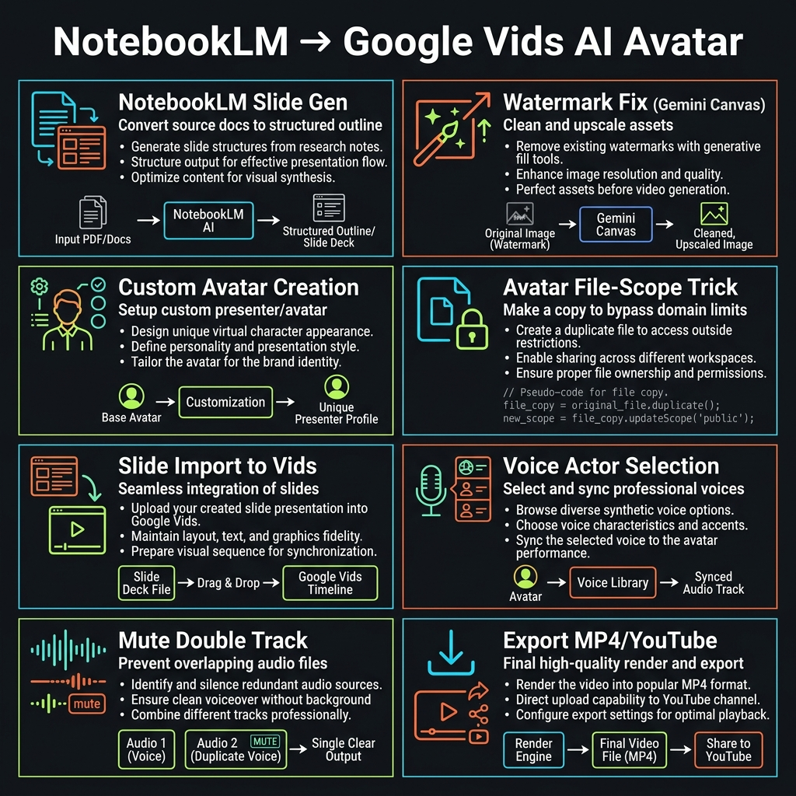
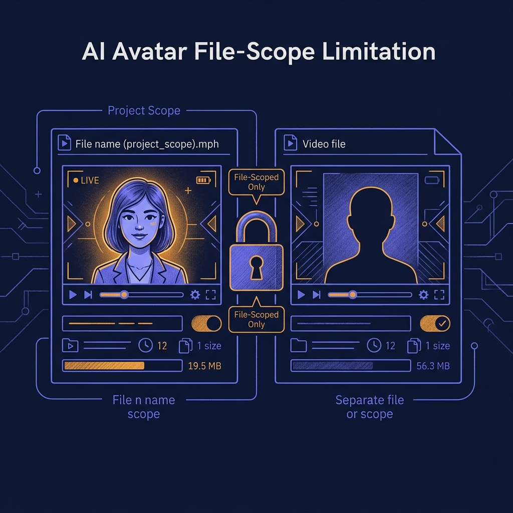

<!-- _class: title -->

# NotebookLM → Google Vids
# AI Avatar Workflow

จาก content ใน NotebookLM สู่วิดีโอ AI Avatar พร้อม voice-over — ฟรีทั้งหมด

<!-- Speaker: Quick intro — ทั้ง workflow นี้ใช้ Google Vids (ฟรี) + NotebookLM + Gemini. ไม่ต้องซื้อ Ultra ก็ทำได้ด้วย workaround -->

---

<!-- _class: cheatsheet -->
<!-- _backgroundColor: #0d1117 -->

<!-- Speaker: Cheatsheet overview — 8 concepts: slide gen, watermark fix, avatar creation, file-scope trick, slide import, voice actor, mute double track, export. -->

---

## TL;DR: Full Workflow ในหนึ่งสไลด์

NotebookLM gen slides → Fix watermark → Build Avatar → "Make a copy" template → Import → Voice → Export

<svg viewBox="0 0 1100 300" width="100%" xmlns="http://www.w3.org/2000/svg">
  <!-- Callout box -->
  <rect x="40" y="20" width="1020" height="260" rx="16" fill="var(--paper)" stroke="var(--soft-2)" stroke-width="1.5" style="filter:drop-shadow(0 4px 12px rgba(15,23,42,.08))"/>
  <rect x="40" y="20" width="8" height="260" rx="4" fill="var(--accent)"/>
  <!-- Icon circle -->
  <circle cx="130" cy="150" r="44" fill="var(--accent)" opacity=".1"/>
  <circle cx="130" cy="150" r="30" fill="var(--accent)"/>
  <text x="130" y="156" font-size="20" fill="white" text-anchor="middle" dominant-baseline="central" font-family="system-ui" font-weight="800">AI</text>
  <!-- Two key insights in English labels -->
  <text x="200" y="110" font-size="19" font-weight="700" fill="var(--ink)" font-family="system-ui">Free end-to-end: NotebookLM + Gemini Canvas + Google Vids</text>
  <text x="200" y="146" font-size="15" fill="var(--ink-dim)" font-family="system-ui">2 key tricks: Watermark workaround + "Make a copy" avatar template</text>
  <text x="200" y="178" font-size="15" fill="var(--muted)" font-family="system-ui">Output: MP4 video with AI avatar + 30 Google voice actors</text>
  <rect x="0" y="0" width="1" height="1" fill="none"/>
</svg>

<b>★ Takeaway:</b> ทำได้ฟรีทั้งหมดด้วย Google account ทั่วไป — ไม่ต้องซื้อ Ultra หรือ Workspace plan

<!-- Speaker: ชี้ที่ 2 key tricks — คือสิ่งที่คนส่วนใหญ่ไม่รู้และทำให้ workflow ติดขัด -->

---

## Avatar Scope Limitation: ทำไม Custom Avatar ถึง "หาย"

Custom Avatar ใน Google Vids เป็น file-scoped ไม่ใช่ account-wide — ข้อจำกัดที่ต้องเข้าใจก่อน

<svg viewBox="0 0 680 280" width="100%" xmlns="http://www.w3.org/2000/svg">
  <!-- File A — has avatar -->
  <rect x="20" y="40" width="270" height="200" rx="12" fill="var(--success-wash)" stroke="var(--success)" stroke-width="2"/>
  <text x="155" y="75" font-size="13" font-weight="700" fill="var(--success-ink)" text-anchor="middle" font-family="system-ui">File A (Template)</text>
  <circle cx="155" cy="155" r="38" fill="var(--success)" opacity=".15"/>
  <circle cx="155" cy="155" r="26" fill="var(--success)"/>
  <text x="155" y="161" font-size="14" fill="white" text-anchor="middle" dominant-baseline="central" font-family="system-ui" font-weight="700">Avatar</text>
  <text x="155" y="215" font-size="11" fill="var(--success-ink)" text-anchor="middle" font-family="system-ui">Custom Avatar available</text>
  <!-- Arrow with lock -->
  <line x1="292" y1="140" x2="380" y2="140" stroke="var(--danger)" stroke-width="2" stroke-dasharray="6,4"/>
  <rect x="316" y="120" width="40" height="40" rx="8" fill="var(--danger-wash)" stroke="var(--danger)" stroke-width="1.5"/>
  <text x="336" y="145" font-size="18" text-anchor="middle" font-family="system-ui" fill="var(--danger)">X</text>
  <!-- File B — no avatar -->
  <rect x="382" y="40" width="270" height="200" rx="12" fill="var(--danger-wash)" stroke="var(--danger)" stroke-width="2"/>
  <text x="517" y="75" font-size="13" font-weight="700" fill="var(--danger-ink)" text-anchor="middle" font-family="system-ui">File B (New project)</text>
  <circle cx="517" cy="155" r="38" fill="var(--danger)" opacity=".1"/>
  <circle cx="517" cy="155" r="26" fill="none" stroke="var(--danger)" stroke-width="2" stroke-dasharray="5,3"/>
  <text x="517" y="161" font-size="11" fill="var(--danger)" text-anchor="middle" font-family="system-ui">Empty</text>
  <text x="517" y="215" font-size="11" fill="var(--danger-ink)" text-anchor="middle" font-family="system-ui">Avatar not visible</text>
  <rect x="0" y="0" width="1" height="1" fill="none"/>
</svg>

<b>★ Takeaway:</b> แก้ด้วย "Make a copy" จาก template file — ไม่ใช่เปิดโปรเจกต์ใหม่เปล่า

<!-- Speaker: นี่คือ gotcha ที่ทุกคนเจอ — Google Vids ไม่ได้ save avatar ระดับ account แต่ระดับ file -->

---

## Full Pipeline: ภาพรวม 6 ขั้น

จาก content idea ไปถึง YouTube-ready video ใน 6 steps หลัก

<svg viewBox="0 0 1100 320" width="100%" xmlns="http://www.w3.org/2000/svg">
  <!-- Step boxes -->
  <rect x="20" y="100" width="150" height="120" rx="10" fill="var(--accent)" opacity=".1"/>
  <rect x="20" y="100" width="150" height="6" rx="3" fill="var(--accent)"/>
  <text x="95" y="145" font-size="12" font-weight="700" fill="var(--accent)" text-anchor="middle" font-family="system-ui">1</text>
  <text x="95" y="165" font-size="11" font-weight="700" fill="var(--ink)" text-anchor="middle" font-family="system-ui">NotebookLM</text>
  <text x="95" y="182" font-size="10" fill="var(--ink-dim)" text-anchor="middle" font-family="system-ui">Gen slides</text>
  <text x="95" y="198" font-size="10" fill="var(--muted)" text-anchor="middle" font-family="system-ui">Download PPT</text>

  <polygon points="178,160 196,148 196,172" fill="var(--accent)"/>

  <rect x="200" y="100" width="150" height="120" rx="10" fill="var(--warning-wash)"/>
  <rect x="200" y="100" width="150" height="6" rx="3" fill="var(--warning)"/>
  <text x="275" y="145" font-size="12" font-weight="700" fill="var(--warning-ink)" text-anchor="middle" font-family="system-ui">2</text>
  <text x="275" y="165" font-size="11" font-weight="700" fill="var(--ink)" text-anchor="middle" font-family="system-ui">Gemini Canvas</text>
  <text x="275" y="182" font-size="10" fill="var(--ink-dim)" text-anchor="middle" font-family="system-ui">Remove watermark</text>
  <text x="275" y="198" font-size="10" fill="var(--muted)" text-anchor="middle" font-family="system-ui">Export to Slides</text>

  <polygon points="358,160 376,148 376,172" fill="var(--accent)"/>

  <rect x="380" y="100" width="150" height="120" rx="10" fill="var(--accent-wash)"/>
  <rect x="380" y="100" width="150" height="6" rx="3" fill="var(--accent)"/>
  <text x="455" y="145" font-size="12" font-weight="700" fill="var(--accent)" text-anchor="middle" font-family="system-ui">3</text>
  <text x="455" y="165" font-size="11" font-weight="700" fill="var(--ink)" text-anchor="middle" font-family="system-ui">Google Vids</text>
  <text x="455" y="182" font-size="10" fill="var(--ink-dim)" text-anchor="middle" font-family="system-ui">Build Custom Avatar</text>
  <text x="455" y="198" font-size="10" fill="var(--muted)" text-anchor="middle" font-family="system-ui">Save as template</text>

  <polygon points="538,160 556,148 556,172" fill="var(--accent)"/>

  <rect x="560" y="100" width="150" height="120" rx="10" fill="var(--success-wash)"/>
  <rect x="560" y="100" width="150" height="6" rx="3" fill="var(--success)"/>
  <text x="635" y="145" font-size="12" font-weight="700" fill="var(--success-ink)" text-anchor="middle" font-family="system-ui">4</text>
  <text x="635" y="165" font-size="11" font-weight="700" fill="var(--ink)" text-anchor="middle" font-family="system-ui">Make a copy</text>
  <text x="635" y="182" font-size="10" fill="var(--ink-dim)" text-anchor="middle" font-family="system-ui">Import slides</text>
  <text x="635" y="198" font-size="10" fill="var(--muted)" text-anchor="middle" font-family="system-ui">Select voice actor</text>

  <polygon points="718,160 736,148 736,172" fill="var(--accent)"/>

  <rect x="740" y="100" width="150" height="120" rx="10" fill="var(--danger-wash)"/>
  <rect x="740" y="100" width="150" height="6" rx="3" fill="var(--danger)"/>
  <text x="815" y="145" font-size="12" font-weight="700" fill="var(--danger-ink)" text-anchor="middle" font-family="system-ui">5</text>
  <text x="815" y="165" font-size="11" font-weight="700" fill="var(--ink)" text-anchor="middle" font-family="system-ui">Mute double</text>
  <text x="815" y="182" font-size="10" fill="var(--ink-dim)" text-anchor="middle" font-family="system-ui">track + position</text>
  <text x="815" y="198" font-size="10" fill="var(--muted)" text-anchor="middle" font-family="system-ui">avatar per scene</text>

  <polygon points="898,160 916,148 916,172" fill="var(--accent)"/>

  <rect x="920" y="100" width="160" height="120" rx="10" fill="var(--soft)"/>
  <rect x="920" y="100" width="160" height="6" rx="3" fill="var(--gold)"/>
  <text x="1000" y="145" font-size="12" font-weight="700" fill="var(--warning-ink)" text-anchor="middle" font-family="system-ui">6</text>
  <text x="1000" y="165" font-size="11" font-weight="700" fill="var(--ink)" text-anchor="middle" font-family="system-ui">Export MP4</text>
  <text x="1000" y="182" font-size="10" fill="var(--ink-dim)" text-anchor="middle" font-family="system-ui">or share to</text>
  <text x="1000" y="198" font-size="10" fill="var(--muted)" text-anchor="middle" font-family="system-ui">YouTube direct</text>
  <rect x="0" y="0" width="1" height="1" fill="none"/>
</svg>

<b>★ Takeaway:</b> ขั้น 2 (Gemini Canvas) และขั้น 4 (Make a copy) คือ trick หลักที่คนมักข้ามไป

<!-- Speaker: Walk through each step quickly — จะ deep dive แต่ละขั้นในสไลด์ถัดไป -->

---

## Step 1: Gen Slides ใน NotebookLM

ใช้ Gemini สร้าง prompt ก่อน แล้ว gen "Presenter Slides" — ไม่ใช่ Detailed Deck

<svg viewBox="0 0 1100 300" width="100%" xmlns="http://www.w3.org/2000/svg">
  <!-- 5 numbered steps horizontal -->
  <rect x="20" y="60" width="185" height="180" rx="10" fill="var(--soft)"/>
  <circle cx="112" cy="95" r="18" fill="var(--accent)"/>
  <text x="112" y="101" font-size="14" font-weight="700" fill="white" text-anchor="middle" dominant-baseline="central" font-family="system-ui">1</text>
  <text x="112" y="135" font-size="11" font-weight="700" fill="var(--ink)" text-anchor="middle" font-family="system-ui">Ask Gemini</text>
  <text x="112" y="153" font-size="10" fill="var(--ink-dim)" text-anchor="middle" font-family="system-ui">for plain-language</text>
  <text x="112" y="169" font-size="10" fill="var(--muted)" text-anchor="middle" font-family="system-ui">prompt on topic</text>

  <polygon points="212,150 228,140 228,160" fill="var(--accent)"/>

  <rect x="232" y="60" width="185" height="180" rx="10" fill="var(--soft)"/>
  <circle cx="324" cy="95" r="18" fill="var(--accent)"/>
  <text x="324" y="101" font-size="14" font-weight="700" fill="white" text-anchor="middle" dominant-baseline="central" font-family="system-ui">2</text>
  <text x="324" y="135" font-size="11" font-weight="700" fill="var(--ink)" text-anchor="middle" font-family="system-ui">Open NotebookLM</text>
  <text x="324" y="153" font-size="10" fill="var(--ink-dim)" text-anchor="middle" font-family="system-ui">Click "Slides"</text>
  <text x="324" y="169" font-size="10" fill="var(--muted)" text-anchor="middle" font-family="system-ui">paste prompt</text>

  <polygon points="424,150 440,140 440,160" fill="var(--accent)"/>

  <rect x="444" y="60" width="185" height="180" rx="10" fill="var(--accent-wash)"/>
  <circle cx="536" cy="95" r="18" fill="var(--accent)"/>
  <text x="536" y="101" font-size="14" font-weight="700" fill="white" text-anchor="middle" dominant-baseline="central" font-family="system-ui">3</text>
  <text x="536" y="135" font-size="11" font-weight="700" fill="var(--accent)" text-anchor="middle" font-family="system-ui">Presenter Slides</text>
  <text x="536" y="153" font-size="10" fill="var(--ink-dim)" text-anchor="middle" font-family="system-ui">NOT Detailed Deck</text>
  <text x="536" y="169" font-size="10" fill="var(--muted)" text-anchor="middle" font-family="system-ui">more content / slide</text>

  <polygon points="636,150 652,140 652,160" fill="var(--accent)"/>

  <rect x="656" y="60" width="185" height="180" rx="10" fill="var(--warning-wash)"/>
  <circle cx="748" cy="95" r="18" fill="var(--warning)"/>
  <text x="748" y="101" font-size="14" font-weight="700" fill="white" text-anchor="middle" dominant-baseline="central" font-family="system-ui">4</text>
  <text x="748" y="135" font-size="11" font-weight="700" fill="var(--warning-ink)" text-anchor="middle" font-family="system-ui">Verify content</text>
  <text x="748" y="153" font-size="10" fill="var(--ink-dim)" text-anchor="middle" font-family="system-ui">AI can hallucinate</text>
  <text x="748" y="169" font-size="10" fill="var(--muted)" text-anchor="middle" font-family="system-ui">review all facts</text>

  <polygon points="848,150 864,140 864,160" fill="var(--accent)"/>

  <rect x="868" y="60" width="212" height="180" rx="10" fill="var(--success-wash)"/>
  <circle cx="974" cy="95" r="18" fill="var(--success)"/>
  <text x="974" y="101" font-size="14" font-weight="700" fill="white" text-anchor="middle" dominant-baseline="central" font-family="system-ui">5</text>
  <text x="974" y="135" font-size="11" font-weight="700" fill="var(--success-ink)" text-anchor="middle" font-family="system-ui">Download as PPT</text>
  <text x="974" y="153" font-size="10" fill="var(--ink-dim)" text-anchor="middle" font-family="system-ui">PowerPoint format</text>
  <text x="974" y="169" font-size="10" fill="var(--muted)" text-anchor="middle" font-family="system-ui">ready for Canvas</text>
  <rect x="0" y="0" width="1" height="1" fill="none"/>
</svg>

<b>★ Takeaway:</b> เลือก "Presenter Slides" เสมอ — ให้ script density พอสำหรับ AI voiceover

<!-- Speaker: Step 3 คือจุดที่คนเลือกผิดบ่อยที่สุด — Detailed Deck สั้นเกินไป -->

---

## Step 2: Watermark Fix ด้วย Gemini Canvas

NotebookLM export มี watermark สำหรับ non-Ultra users — แก้ได้ฟรีผ่าน Gemini Canvas

<svg viewBox="0 0 1100 300" width="100%" xmlns="http://www.w3.org/2000/svg">
  <!-- Left: with watermark -->
  <rect x="30" y="20" width="470" height="260" rx="12" fill="var(--danger-wash)" stroke="var(--danger)" stroke-width="1.5"/>
  <rect x="30" y="20" width="470" height="52" rx="12" fill="var(--danger)" opacity=".15"/>
  <text x="265" y="52" font-size="15" font-weight="700" fill="var(--danger-ink)" text-anchor="middle" font-family="system-ui">Without workaround</text>
  <text x="265" y="100" font-size="13" fill="var(--ink)" text-anchor="middle" font-family="system-ui">NotebookLM PPT has watermark</text>
  <text x="265" y="125" font-size="12" fill="var(--ink-dim)" text-anchor="middle" font-family="system-ui">Requires Google One AI Premium</text>
  <text x="265" y="148" font-size="12" fill="var(--muted)" text-anchor="middle" font-family="system-ui">or Google Workspace Ultra</text>
  <rect x="80" y="168" width="370" height="80" rx="8" fill="var(--danger)" opacity=".08"/>
  <text x="265" y="200" font-size="12" fill="var(--danger-ink)" text-anchor="middle" font-family="system-ui">PPT blocked by watermark overlay</text>
  <text x="265" y="222" font-size="11" fill="var(--muted)" text-anchor="middle" font-family="system-ui">cannot use directly in Vids</text>

  <!-- VS circle -->
  <circle cx="550" cy="150" r="26" fill="var(--accent)"/>
  <text x="550" y="155" font-size="13" font-weight="700" fill="white" text-anchor="middle" dominant-baseline="central" font-family="system-ui">VS</text>

  <!-- Right: with workaround -->
  <rect x="598" y="20" width="470" height="260" rx="12" fill="var(--success-wash)" stroke="var(--success)" stroke-width="2"/>
  <rect x="598" y="20" width="470" height="52" rx="12" fill="var(--success)" opacity=".15"/>
  <text x="833" y="52" font-size="15" font-weight="700" fill="var(--success-ink)" text-anchor="middle" font-family="system-ui">Gemini Canvas workaround</text>
  <text x="833" y="92" font-size="12" fill="var(--ink)" text-anchor="middle" font-family="system-ui">1. Open Gemini → Canvas</text>
  <text x="833" y="115" font-size="12" fill="var(--ink-dim)" text-anchor="middle" font-family="system-ui">2. Upload watermarked PPT</text>
  <text x="833" y="138" font-size="12" fill="var(--ink-dim)" text-anchor="middle" font-family="system-ui">3. Prompt: "Turn into slide deck"</text>
  <text x="833" y="161" font-size="12" fill="var(--ink-dim)" text-anchor="middle" font-family="system-ui">4. Export to Google Slides</text>
  <rect x="648" y="178" width="370" height="80" rx="8" fill="var(--success)" opacity=".1"/>
  <text x="833" y="210" font-size="12" fill="var(--success-ink)" text-anchor="middle" font-family="system-ui">Clean Google Slides on Drive</text>
  <text x="833" y="232" font-size="11" fill="var(--muted)" text-anchor="middle" font-family="system-ui">Free, no subscription needed</text>
  <rect x="0" y="0" width="1" height="1" fill="none"/>
</svg>

<b>★ Takeaway:</b> ตรวจสอบสไลด์หลัง Gemini export ทุกครั้ง — layout อาจเปลี่ยนเล็กน้อย

<!-- Speaker: Gemini Canvas คือ feature ใหม่ที่ทำให้ workaround นี้เป็นไปได้ — ใช้ได้ฟรีกับทุก Google account -->

---

## Step 3: สร้าง Custom Avatar ด้วย Gemini

ใช้ Gemini เป็น "prompt engineer" — ช่วยหาค่า settings ที่ใกล้เคียง reference image ที่สุด

  

    
Step 3A

    <h3>Generate options</h3>
    
vids.google → AI Avatar → Create Custom Avatar

    
Screenshot หน้า avatar creation + upload reference image ไปใน Gemini

    
ถาม Gemini ว่า "What settings to use?" → Paste prompt ใน Vids

  

  

    
Step 3B

    <h3>Screenshot & refine</h3>
    
ถ่าย screenshot ของ avatar options ที่ได้

    
ถาม Gemini: "Which one is closest? How to refine?"

    
Gemini จะแนะนำตัวเลือกและ refinement prompt

  

  

    
Step 3C

    <h3>Save & name</h3>
    
คลิก "Refine selected" → Paste Gemini's refinement → Update

    
ตั้งชื่อ Avatar → Save

    
Avatar พร้อมใช้งานใน file นี้แล้ว

  

<b>★ Takeaway:</b> Gemini loop (screenshot → feedback → refine) ให้ผลลัพธ์ดีกว่า trial-and-error มาก

<!-- Speaker: Avatar ที่ได้ไม่ได้ photo-realistic แต่ prompt-based — ยิ่ง Gemini prompt ดี ยิ่งใกล้เคียง reference -->

---

## Step 4: สร้าง Template File — Key Trick

หลังสร้าง Avatar เสร็จ อย่าปิดไฟล์ — Rename ให้เป็น template ทันที

<svg viewBox="0 0 1100 280" width="100%" xmlns="http://www.w3.org/2000/svg">
  <rect x="40" y="20" width="1020" height="240" rx="16" fill="var(--accent-wash)" stroke="var(--accent)" stroke-width="2"/>
  <rect x="40" y="20" width="8" height="240" rx="4" fill="var(--gold)"/>
  <!-- Gold icon -->
  <circle cx="130" cy="140" r="46" fill="var(--gold)" opacity=".15"/>
  <circle cx="130" cy="140" r="32" fill="var(--gold)"/>
  <text x="130" y="148" font-size="22" fill="white" text-anchor="middle" dominant-baseline="central" font-family="system-ui" font-weight="800">T</text>
  <!-- Content -->
  <text x="210" y="90" font-size="18" font-weight="700" fill="var(--ink)" font-family="system-ui">The Template Pattern</text>
  <text x="210" y="120" font-size="14" fill="var(--ink-dim)" font-family="system-ui">After Avatar saved → File: Rename to "[TEMPLATE] My Avatar - Topic"</text>
  <text x="210" y="150" font-size="14" fill="var(--ink-dim)" font-family="system-ui">For every new video → File: "Make a copy" of template</text>
  <text x="210" y="180" font-size="14" fill="var(--ink-dim)" font-family="system-ui">New copy inherits Avatar — verified via Change avatar button</text>
  <rect x="210" y="202" width="780" height="38" rx="8" fill="var(--accent)" opacity=".1"/>
  <text x="600" y="225" font-size="13" font-weight="700" fill="var(--accent)" text-anchor="middle" font-family="system-ui">Never open a blank new Vids project — always "Make a copy" from template</text>
  <rect x="0" y="0" width="1" height="1" fill="none"/>
</svg>

<b>★ Takeaway:</b> Template file = master clone source — ทำครั้งเดียว ใช้ได้ทุกวิดีโอตลอดไป

<!-- Speaker: นี่คือ "Make a copy" pattern — ถ้าไม่รู้ข้อนี้ ต้องสร้าง Avatar ใหม่ทุกครั้ง -->

---

## Step 5–6: Import Slides + เลือก Voice Actor

จาก template copy → Import Google Slides → เลือก voice ให้ตรงกับ avatar character

<svg viewBox="0 0 1100 280" width="100%" xmlns="http://www.w3.org/2000/svg">
  <!-- 4 step flow -->
  <rect x="20" y="80" width="220" height="120" rx="10" fill="var(--soft)"/>
  <circle cx="130" cy="108" r="16" fill="var(--accent)"/>
  <text x="130" y="114" font-size="12" font-weight="700" fill="white" text-anchor="middle" dominant-baseline="central" font-family="system-ui">A</text>
  <text x="130" y="148" font-size="11" font-weight="700" fill="var(--ink)" text-anchor="middle" font-family="system-ui">Make a copy</text>
  <text x="130" y="166" font-size="10" fill="var(--ink-dim)" text-anchor="middle" font-family="system-ui">File → "Make a copy"</text>
  <text x="130" y="182" font-size="10" fill="var(--muted)" text-anchor="middle" font-family="system-ui">Name the video</text>

  <polygon points="248,140 264,130 264,150" fill="var(--accent)"/>

  <rect x="268" y="80" width="220" height="120" rx="10" fill="var(--soft)"/>
  <circle cx="378" cy="108" r="16" fill="var(--accent)"/>
  <text x="378" y="114" font-size="12" font-weight="700" fill="white" text-anchor="middle" dominant-baseline="central" font-family="system-ui">B</text>
  <text x="378" y="148" font-size="11" font-weight="700" fill="var(--ink)" text-anchor="middle" font-family="system-ui">Convert slides</text>
  <text x="378" y="166" font-size="10" fill="var(--ink-dim)" text-anchor="middle" font-family="system-ui">File → "Convert slides"</text>
  <text x="378" y="182" font-size="10" fill="var(--muted)" text-anchor="middle" font-family="system-ui">Select Drive file</text>

  <polygon points="496,140 512,130 512,150" fill="var(--accent)"/>

  <rect x="516" y="80" width="250" height="120" rx="10" fill="var(--accent-wash)"/>
  <circle cx="641" cy="108" r="16" fill="var(--accent)"/>
  <text x="641" y="114" font-size="12" font-weight="700" fill="white" text-anchor="middle" dominant-baseline="central" font-family="system-ui">C</text>
  <text x="641" y="148" font-size="11" font-weight="700" fill="var(--accent)" text-anchor="middle" font-family="system-ui">Select voice actor</text>
  <text x="641" y="166" font-size="10" fill="var(--ink-dim)" text-anchor="middle" font-family="system-ui">30 free Google voices</text>
  <text x="641" y="182" font-size="10" fill="var(--muted)" text-anchor="middle" font-family="system-ui">Match avatar character</text>

  <polygon points="774,140 790,130 790,150" fill="var(--accent)"/>

  <rect x="794" y="80" width="286" height="120" rx="10" fill="var(--success-wash)"/>
  <circle cx="937" cy="108" r="16" fill="var(--success)"/>
  <text x="937" y="114" font-size="12" font-weight="700" fill="white" text-anchor="middle" dominant-baseline="central" font-family="system-ui">D</text>
  <text x="937" y="148" font-size="11" font-weight="700" fill="var(--success-ink)" text-anchor="middle" font-family="system-ui">Draft video</text>
  <text x="937" y="166" font-size="10" fill="var(--ink-dim)" text-anchor="middle" font-family="system-ui">Voiceover + AI script</text>
  <text x="937" y="182" font-size="10" fill="var(--muted)" text-anchor="middle" font-family="system-ui">Turn OFF animations</text>
  <rect x="0" y="0" width="1" height="1" fill="none"/>
</svg>

<b>★ Takeaway:</b> ปิด animation เสมอ — ชนกับ voiceover timing และทำให้วิดีโอดูรก

<!-- Speaker: Step C critical — เลือก voice ให้ match avatar เพื่อให้ผลลัพธ์ดู natural -->

---

## CRITICAL: Mute Double Track

Import slides ที่มี audio อยู่แล้ว + Google Voice Actor = เสียงซ้อน 2 ชั้น

  

    
ปัญหา

    <h3>Double Audio Track</h3>
    
เมื่อ import slides จาก NotebookLM ที่มี audio embedded + เพิ่ม Google Voice Actor → จะมี 2 audio tracks ทับกัน

    
ผลลัพธ์: เสียงพูดซ้อนกัน ฟังไม่รู้เรื่อง วิดีโอดูไม่เป็นมืออาชีพ

  

  

    
วิธีแก้

    <h3>Mute the unwanted track</h3>
    
ใน Google Vids editor: ค้นหา audio track ที่ไม่ต้องการ → Mute หรือ Delete

    
เก็บไว้เฉพาะ Google Voice Actor track ที่ sync กับ avatar

    
ตรวจ preview ก่อน export ทุกครั้ง

  

<b style="color:var(--danger)">! Critical:</b> ตรวจสอบ audio tracks ก่อน export ทุกครั้ง — เสียงซ้อนเป็นปัญหาที่พบบ่อยที่สุด

<!-- Speaker: นี่คือ gotcha ที่ทุกคนเจอในครั้งแรก — Vids ไม่แจ้งเตือนว่ามี double track -->

---

## Step 7: วางตำแหน่ง Avatar + Export

ปรับ avatar ตำแหน่งในแต่ละ scene → Export MP4 หรือ share ตรงไปยัง YouTube

<svg viewBox="0 0 1100 280" width="100%" xmlns="http://www.w3.org/2000/svg">
  <!-- 3 final steps -->
  <rect x="50" y="60" width="290" height="160" rx="12" fill="var(--soft)" stroke="var(--soft-2)" stroke-width="1.5"/>
  <circle cx="195" cy="95" r="22" fill="var(--accent)" opacity=".15"/>
  <circle cx="195" cy="95" r="15" fill="var(--accent)"/>
  <text x="195" y="101" font-size="11" font-weight="700" fill="white" text-anchor="middle" dominant-baseline="central" font-family="system-ui">1</text>
  <text x="195" y="132" font-size="12" font-weight="700" fill="var(--ink)" text-anchor="middle" font-family="system-ui">Add avatar per scene</text>
  <text x="195" y="153" font-size="11" fill="var(--ink-dim)" text-anchor="middle" font-family="system-ui">Click scene → Add avatar</text>
  <text x="195" y="173" font-size="11" fill="var(--muted)" text-anchor="middle" font-family="system-ui">Change → Custom Avatar</text>
  <text x="195" y="193" font-size="10" fill="var(--muted)" text-anchor="middle" font-family="system-ui">Resize and reposition</text>

  <polygon points="348,140 366,130 366,150" fill="var(--accent)"/>

  <rect x="370" y="60" width="290" height="160" rx="12" fill="var(--soft)" stroke="var(--soft-2)" stroke-width="1.5"/>
  <circle cx="515" cy="95" r="22" fill="var(--success)" opacity=".15"/>
  <circle cx="515" cy="95" r="15" fill="var(--success)"/>
  <text x="515" y="101" font-size="11" font-weight="700" fill="white" text-anchor="middle" dominant-baseline="central" font-family="system-ui">2</text>
  <text x="515" y="132" font-size="12" font-weight="700" fill="var(--ink)" text-anchor="middle" font-family="system-ui">Export MP4</text>
  <text x="515" y="153" font-size="11" fill="var(--ink-dim)" text-anchor="middle" font-family="system-ui">Click Export → MP4</text>
  <text x="515" y="173" font-size="11" fill="var(--muted)" text-anchor="middle" font-family="system-ui">Download to device</text>

  <polygon points="668,140 686,130 686,150" fill="var(--accent)"/>

  <rect x="690" y="60" width="360" height="160" rx="12" fill="var(--success-wash)" stroke="var(--success)" stroke-width="1.5"/>
  <circle cx="870" cy="95" r="22" fill="var(--success)" opacity=".2"/>
  <circle cx="870" cy="95" r="15" fill="var(--success)"/>
  <text x="870" y="101" font-size="11" font-weight="700" fill="white" text-anchor="middle" dominant-baseline="central" font-family="system-ui">3</text>
  <text x="870" y="132" font-size="12" font-weight="700" fill="var(--success-ink)" text-anchor="middle" font-family="system-ui">Share to YouTube</text>
  <text x="870" y="153" font-size="11" fill="var(--ink-dim)" text-anchor="middle" font-family="system-ui">Click Share → YouTube</text>
  <text x="870" y="173" font-size="11" fill="var(--muted)" text-anchor="middle" font-family="system-ui">Direct publish — no re-upload</text>
  <rect x="0" y="0" width="1" height="1" fill="none"/>
</svg>

<b>★ Takeaway:</b> Google Vids share ตรงไป YouTube ได้ทันที — ไม่ต้อง download แล้ว upload ใหม่

<!-- Speaker: Feature share to YouTube คือ time saver ที่ดีมาก โดยเฉพาะสำหรับ content creators -->

---

## Caveats & ข้อจำกัดที่ต้องรู้

ข้อจำกัดหลัก 3 อย่างที่จะเจอแน่นอน

  

    
Avatar Scope

    <h3>File-scoped เท่านั้น</h3>
    
Custom Avatar ผูกกับ file — ต้อง "Make a copy" ทุกครั้ง ไม่สามารถ import ข้าม file โดยตรงได้

    
<b>Workaround:</b> Template + Make a copy pattern

  

  

    
Watermark

    <h3>NotebookLM export</h3>
    
PPT export มี watermark ถ้าไม่มี Google One AI Premium ($19.99/mo) หรือ Workspace Ultra

    
<b>Workaround:</b> Gemini Canvas → Export to Slides

  

  

    
Avatar Quality

    <h3>Prompt-based ไม่ใช่ photo</h3>
    
Vids ใช้ text-to-avatar prompt — ความคล้าย reference image ขึ้นกับ prompt quality ไม่ใช่ภาพต้นแบบโดยตรง

    
<b>Tip:</b> ใช้ Gemini iterative refinement loop

  

<b>★ Takeaway:</b> ทั้ง 3 ข้อจำกัดมี workaround ฟรี — ไม่ต้องซื้อ plan เพิ่ม

<!-- Speaker: Script accuracy ก็สำคัญ — ตรวจทุก AI-generated script ก่อน render -->

---

## Key Takeaways

7 สิ่งที่ต้องจำจากทั้ง workflow

  

    
Core trick

    <h3>"Make a copy" — ไม่ใช่ไฟล์ใหม่</h3>
    
Avatar file-scoped → ต้องสร้าง template แล้ว clone ทุกครั้ง

  

  

    
Gemini role

    <h3>Gemini = prompt engineer สำหรับ Avatar</h3>
    
Screenshot + reference image → Gemini ให้ค่า settings ที่แม่นกว่า trial-and-error

  

  

    
Watermark

    <h3>Gemini Canvas ช่วยได้ฟรี</h3>
    
Upload PPT → prompt → Export to Slides → ไม่มี watermark

  

  

    
Audio gotcha

    <h3>Mute double track ก่อน export</h3>
    
Import slides + Voice Actor = 2 tracks ซ้อนกัน ต้อง mute track ที่ไม่ต้องการ

  

  

    
Free tier

    <h3>ฟรีทั้งหมดด้วย Google account</h3>
    
30 voice actors + vids.google + NotebookLM + Gemini Canvas — ไม่ต้องซื้อ plan

  

  

    
Presenter slides

    <h3>เลือก Presenter ไม่ใช่ Detailed Deck</h3>
    
ให้ script density พอสำหรับ AI voiceover ที่ฟังสมบูรณ์

  

<b>★ Takeaway:</b> Watermark fix + Avatar template trick = 2 keys ที่เปิด workflow นี้ให้ใช้งานได้จริงโดยไม่เสียเงิน

<!-- Speaker: ถ้าจำได้แค่ 2 อย่าง: Make a copy template + Mute double track -->
