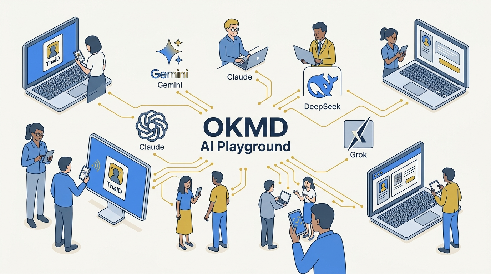
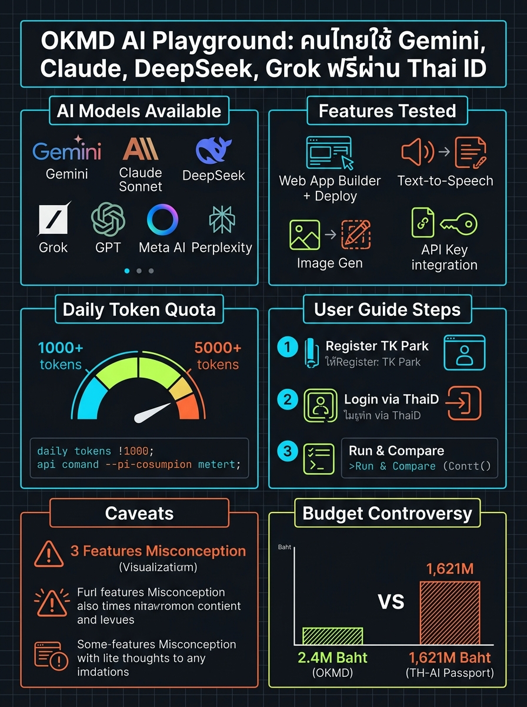

<!-- _class: title -->

# OKMD AI Playground

คนไทยใช้ Gemini, Claude, DeepSeek, Grok ฟรี ผ่านการยืนยันตัวตน ThaiD

<!-- Speaker: ภาครัฐไทยเปิดแพลตฟอร์มรวม AI ชั้นนำหลายค่ายให้คนไทยใช้ฟรี — วันนี้เราจะเจาะทั้งฟีเจอร์จริงจากคลิปสาธิต และงบประมาณที่กำลังเป็นประเด็นในสภา -->

---

<!-- _class: cheatsheet -->
<!-- _backgroundColor: #f8f7f4 -->

<!-- Speaker: ภาพรวมทั้งเดคในหน้าเดียว — โมเดล AI, ฟีเจอร์ที่ทดสอบจริง, โควตา, ขั้นตอนใช้งาน, ข้อควรระวัง, และตัวเลขงบประมาณเทียบโครงการอื่น -->

---

## TL;DR: แพลตฟอร์มรัฐ ใช้ AI หลายค่ายฟรีจริง

รวม Gemini, GPT, Claude, DeepSeek, Grok ไว้หน้าเดียว ยืนยันตัวตนผ่าน ThaiD

<svg viewBox="0 0 1100 380" width="100%" xmlns="http://www.w3.org/2000/svg">
  <rect x="60" y="40" width="980" height="300" rx="16" fill="var(--paper)" stroke="var(--soft-2)" stroke-width="1.5" style="filter:drop-shadow(0 4px 12px rgba(15,23,42,.08))"/>
  <rect x="60" y="40" width="8" height="300" rx="4" fill="var(--accent)"/>
  <circle cx="148" cy="190" r="40" fill="var(--accent)" opacity=".12"/>
  <circle cx="148" cy="190" r="28" fill="var(--accent)"/>
  <text x="148" y="196" font-size="18" fill="var(--paper)" text-anchor="middle" dominant-baseline="central" font-family="system-ui" font-weight="700">$0</text>
  <text x="220" y="150" font-size="20" font-weight="700" fill="var(--ink)" font-family="system-ui">playground.okmd.or.th — free for all Thai citizens</text>
  <text x="220" y="185" font-size="15" fill="var(--ink-dim)" font-family="system-ui">Login: ThaiD app OR existing TK Park / OKMD e-member account</text>
  <text x="220" y="215" font-size="15" fill="var(--ink-dim)" font-family="system-ui">Models: Gemini, GPT, Claude Sonnet, DeepSeek, Grok, Meta AI, Perplexity</text>
  <text x="220" y="245" font-size="15" fill="var(--muted)" font-family="system-ui">Features: chat, web-app builder + deploy, TTS, image gen, API key</text>
  <text x="220" y="275" font-size="15" fill="var(--muted)" font-family="system-ui">Quota: ~350,000 tokens/day for Gemini (varies by model)</text>
</svg>

<b>★ สรุป:</b> ไม่ใช่แค่ chat demo — สร้างเว็บแอป, TTS, สร้างภาพ, และ API key ใช้งานได้จริงตามที่สาธิตในคลิป

<!-- Speaker: เน้นว่านี่ verify จากทั้งเว็บข่าวและวิดีโอสาธิตจริง ไม่ใช่แค่คำโฆษณา -->

---

## OKMD คือใคร — ทำไมเรื่องนี้ถึงสำคัญกว่าข่าวเปิดตัวทั่วไป

หน่วยงานรัฐไทยด้าน lifelong learning เปิด 3 บริการพร้อมกัน 1 พ.ค. 2569

<svg viewBox="0 0 700 320" width="100%" xmlns="http://www.w3.org/2000/svg">
  <rect x="20" y="20" width="660" height="70" rx="10" fill="var(--accent)" opacity=".1"/>
  <text x="40" y="50" font-size="16" font-weight="700" fill="var(--accent-deep)" font-family="system-ui">OKMD</text>
  <text x="40" y="75" font-size="12" fill="var(--ink-dim)" font-family="system-ui">Office of Knowledge Management and Development (public org)</text>
  <rect x="20" y="110" width="200" height="180" rx="10" fill="var(--paper)" stroke="var(--accent)" stroke-width="2"/>
  <text x="120" y="145" font-size="13" font-weight="700" fill="var(--accent)" text-anchor="middle" font-family="system-ui">AI Playground</text>
  <text x="120" y="170" font-size="11" fill="var(--ink-dim)" text-anchor="middle" font-family="system-ui">this deck's focus</text>
  <rect x="250" y="110" width="200" height="180" rx="10" fill="var(--soft)" stroke="var(--soft-2)" stroke-width="1.5"/>
  <text x="350" y="145" font-size="13" font-weight="700" fill="var(--ink-dim)" text-anchor="middle" font-family="system-ui">Knowledge Portal</text>
  <text x="350" y="170" font-size="11" fill="var(--muted)" text-anchor="middle" font-family="system-ui">digital library</text>
  <rect x="480" y="110" width="200" height="180" rx="10" fill="var(--soft)" stroke="var(--soft-2)" stroke-width="1.5"/>
  <text x="580" y="145" font-size="13" font-weight="700" fill="var(--ink-dim)" text-anchor="middle" font-family="system-ui">Corporate</text>
  <text x="580" y="170" font-size="11" fill="var(--muted)" text-anchor="middle" font-family="system-ui">upskilling</text>
</svg>

<b>★ Takeaway:</b> "3 ฟีเจอร์เด็ด" ในข่าว = 3 บริการคนละตัว ไม่ใช่ 3 ความสามารถใน Playground เดียว

<!-- Speaker: OKMD ดูแล TK Park ด้วย — วันเปิดตัวมี 3 บริการพร้อมกัน แต่เดคนี้เจาะเฉพาะ AI Playground -->

---

## โมเดล AI มากกว่า 10 ตัว จากหลายค่ายทั่วโลก

รวมไว้หน้าเดียว พร้อมฟีเจอร์ Compare & Contrast — ยิงคำถามเดียว ดูคำตอบทุกโมเดลพร้อมกัน

| ค่าย | โมเดลที่พบในระบบ |
|------|------------------|
| Google | Gemini (3.5 Flash ที่สาธิตในคลิป) |
| OpenAI | GPT |
| Anthropic | Claude (Sonnet 5) |
| DeepSeek / xAI | DeepSeek, Grok |
| อื่นๆ | Meta AI, Perplexity, Typhoon (ไทย) + เพิ่มเติมผ่าน model router |

<b>★ Takeaway:</b> ยังไม่รู้จะปักหลักกับโมเดลไหน? ใช้ Compare & Contrast ทดสอบทุกค่ายพร้อมกันก่อนตัดสินใจ

<!-- Speaker: เน้นว่านี่ verify จากทั้งข่าวและวิดีโอสาธิตจริง ไม่ใช่แค่รายชื่อโปรโมท -->

---

## 4 ฟีเจอร์ที่ทดสอบจริงในคลิปสาธิต — ไม่ใช่แค่คำโฆษณา

ทุกฟีเจอร์ถูกสาธิตสดในวิดีโอต้นทาง ทำได้จริงบนบราวเซอร์

  

    
Build

    <h3>Web App Builder + Deploy</h3>
    
สั่งเขียนโค้ดเว็บไซต์ (เช่น เว็บร้านกาแฟ) กด deploy มุมขวาบนรันทดสอบได้ทันที ดาวน์โหลด source code ไปใช้จริงได้

  

  

    
Voice

    <h3>Text-to-Speech</h3>
    
สั่งสร้างเว็บอ่านออกเสียงภาษาไทย มีปุ่มเล่นเสียง ปรับความเร็ว ดาวน์โหลดเป็น MP3

  

  

    
Visual

    <h3>Image Generation</h3>
    
ทดสอบด้วย Gemini 3.5 Flash สร้างภาพปก YouTube ตามกฎ 3 ส่วน พร้อมใส่ข้อความในภาพ

  

  

    
Developer

    <h3>API Key</h3>
    
เชื่อมต่อเข้าแอปพลิเคชันของตัวเอง สาธิตยิง request ผ่าน curl ตรงในคลิป

  

<b>★ Takeaway:</b> AI ที่นี่ไม่ใช่แค่ chat — build, พูด, วาด, และเชื่อมต่อผ่าน API ได้ทั้งหมด

<!-- Speaker: ย้ำว่าทุกอันสาธิตสดในคลิป ไม่ใช่ feature list จากเอกสารการตลาด -->

---

## โควตาให้เปล่า ~350,000 token/วัน (ต่อโมเดล)

นับรวม input + output token เช็คได้ real-time ที่หน้า Setting

<svg viewBox="0 0 1100 380" width="100%" xmlns="http://www.w3.org/2000/svg">
  <rect x="60" y="40" width="980" height="300" rx="16" fill="var(--paper)" stroke="var(--soft-2)" stroke-width="1.5" style="filter:drop-shadow(0 4px 12px rgba(15,23,42,.08))"/>
  <circle cx="230" cy="190" r="130" fill="none" stroke="var(--soft-2)" stroke-width="18"/>
  <circle cx="230" cy="190" r="130" fill="none" stroke="var(--accent)" stroke-width="18" stroke-dasharray="620 817" stroke-linecap="round" transform="rotate(-90 230 190)"/>
  <text x="230" y="180" font-size="34" font-weight="800" fill="var(--accent)" text-anchor="middle" font-family="system-ui">350K</text>
  <text x="230" y="210" font-size="14" fill="var(--ink-dim)" text-anchor="middle" font-family="system-ui">tokens / day (Gemini)</text>
  <text x="480" y="130" font-size="18" font-weight="700" fill="var(--ink)" font-family="system-ui">Usage tracked per model</text>
  <text x="480" y="165" font-size="14" fill="var(--ink-dim)" font-family="system-ui">Input tokens + output tokens counted together</text>
  <text x="480" y="195" font-size="14" fill="var(--ink-dim)" font-family="system-ui">Real-time usage view under Settings</text>
  <text x="480" y="225" font-size="14" fill="var(--muted)" font-family="system-ui">Other models' daily caps not officially confirmed</text>
  <text x="480" y="255" font-size="14" fill="var(--muted)" font-family="system-ui">— plan long build/API sessions accordingly</text>
</svg>

<b>★ Takeaway:</b> วางแผนก่อนใช้งานยาวๆ — โควตาต่างกันตามโมเดล เช็ค Setting ก่อนชนลิมิตกลางงาน

<!-- Speaker: ตัวเลข 350K มาจากคลิปสาธิตจริงเฉพาะ Gemini เท่านั้น โมเดลอื่นไม่มีตัวเลขยืนยันทางการ -->

---

## เริ่มใช้งานใน 4 ขั้นตอน

ตั้งแต่ล็อกอินไปจนถึงเชื่อม API เข้าแอปของตัวเอง

<svg viewBox="0 0 1100 340" width="100%" xmlns="http://www.w3.org/2000/svg">
  <circle cx="140" cy="150" r="44" fill="var(--accent)"/>
  <text x="140" y="158" font-size="26" font-weight="800" fill="var(--paper)" text-anchor="middle" font-family="system-ui">1</text>
  <text x="140" y="220" font-size="14" font-weight="700" fill="var(--ink)" text-anchor="middle" font-family="system-ui">Login</text>
  <text x="140" y="240" font-size="11" fill="var(--muted)" text-anchor="middle" font-family="system-ui">ThaiD or TK Park</text>
  <line x1="200" y1="150" x2="320" y2="150" stroke="var(--muted)" stroke-width="2" marker-end="url(#arrow)"/>
  <circle cx="380" cy="150" r="44" fill="var(--accent)"/>
  <text x="380" y="158" font-size="26" font-weight="800" fill="var(--paper)" text-anchor="middle" font-family="system-ui">2</text>
  <text x="380" y="220" font-size="14" font-weight="700" fill="var(--ink)" text-anchor="middle" font-family="system-ui">Pick Model</text>
  <text x="380" y="240" font-size="11" fill="var(--muted)" text-anchor="middle" font-family="system-ui">or Compare & Contrast</text>
  <line x1="440" y1="150" x2="560" y2="150" stroke="var(--muted)" stroke-width="2" marker-end="url(#arrow)"/>
  <circle cx="620" cy="150" r="44" fill="var(--accent)"/>
  <text x="620" y="158" font-size="26" font-weight="800" fill="var(--paper)" text-anchor="middle" font-family="system-ui">3</text>
  <text x="620" y="220" font-size="14" font-weight="700" fill="var(--ink)" text-anchor="middle" font-family="system-ui">Build + Test</text>
  <text x="620" y="240" font-size="11" fill="var(--muted)" text-anchor="middle" font-family="system-ui">web app, TTS, image</text>
  <line x1="680" y1="150" x2="800" y2="150" stroke="var(--muted)" stroke-width="2" marker-end="url(#arrow)"/>
  <circle cx="860" cy="150" r="44" fill="var(--accent)"/>
  <text x="860" y="158" font-size="26" font-weight="800" fill="var(--paper)" text-anchor="middle" font-family="system-ui">4</text>
  <text x="860" y="220" font-size="14" font-weight="700" fill="var(--ink)" text-anchor="middle" font-family="system-ui">Use API Key</text>
  <text x="860" y="240" font-size="11" fill="var(--muted)" text-anchor="middle" font-family="system-ui">curl into your app</text>
  <defs>
    <marker id="arrow" markerWidth="10" markerHeight="10" refX="8" refY="3" orient="auto"><path d="M0,0 L8,3 L0,6 Z" fill="var(--muted)"/></marker>
  </defs>
</svg>

<b>★ Takeaway:</b> ไม่มีบัตรเครดิต ไม่มี sign-up ซับซ้อน — มี ThaiD หรือบัตรประชาชนก็เริ่มได้ทันที

<!-- Speaker: เดินตาม 4 ขั้นตอนหลัก เต็มๆ มี 7 ขั้นย่อยในโพสต์ (เช็ค quota, เช็ค setting ด้วย) -->

---

## 4 ข้อควรระวังก่อนใช้งานจริง

ของฟรีจากภาครัฐ แต่ก็มีข้อจำกัดที่ควรรู้ก่อน

  

    
Misconception

    <h3>"3 ฟีเจอร์เด็ด" ≠ 3 ความสามารถ</h3>
    
คือ 3 บริการคนละตัว (Playground/Knowledge Portal/Corporate) ไม่ใช่ 3 ฟีเจอร์ใน Playground เดียว

  

  

    
Quota

    <h3>โควตาต่อวันจำกัดจริง</h3>
    
ใช้งานต่อเนื่องยาวๆ ในวันเดียว (build + API test) อาจชนโควตาก่อนจบงาน

  

  

    
Privacy

    <h3>ไม่มีเอกสาร data retention</h3>
    
ไม่มีรายละเอียด privacy policy ของ prompt ที่ส่งเข้าระบบในแหล่งข่าวที่ตรวจสอบได้

  

  

    
Version

    <h3>โมเดลอาจเปลี่ยนรุ่น</h3>
    
ชื่อรุ่นในคลิป (Gemini 3.5 Flash, Sonnet 5) เป็นสถานะ ณ วันทดสอบ 1 พ.ค. 2569 เท่านั้น

  

<b>★ Takeaway:</b> อย่าใช้ทดสอบข้อมูลอ่อนไหว — ระวังเหมือนใช้ third-party AI gateway ทั่วไป

<!-- Speaker: เน้น privacy caveat เป็นพิเศษ เพราะไม่มีเอกสารทางการยืนยัน -->

---

## งบพัฒนา 2.4 ล้านบาท vs โครงการรัฐอื่น 1,621 ล้านบาท

ส.ส. ตั้งคำถามในสภาถึงความคุ้มค่า — TH-AI Passport มีผู้ใช้จริงแค่ ~100 คน/ชั่วโมง

<svg viewBox="0 0 1100 380" width="100%" xmlns="http://www.w3.org/2000/svg">
  <rect x="40" y="20" width="490" height="340" rx="12" fill="var(--paper)" stroke="var(--success)" stroke-width="2" style="filter:drop-shadow(var(--shadow-md))"/>
  <rect x="40" y="20" width="490" height="56" rx="12" fill="var(--success)" opacity=".1"/>
  <text x="285" y="54" font-size="17" font-weight="700" fill="var(--success-ink)" text-anchor="middle" font-family="system-ui">OKMD AI Playground</text>
  <text x="285" y="180" font-size="42" font-weight="800" fill="var(--success)" text-anchor="middle" font-family="system-ui">2.4M</text>
  <text x="285" y="210" font-size="14" fill="var(--ink-dim)" text-anchor="middle" font-family="system-ui">baht development budget</text>
  <text x="285" y="290" font-size="13" fill="var(--muted)" text-anchor="middle" font-family="system-ui">+ ~500K baht token cost</text>
  <rect x="570" y="20" width="490" height="340" rx="12" fill="var(--paper)" stroke="var(--danger)" stroke-width="2" style="filter:drop-shadow(var(--shadow-md))"/>
  <rect x="570" y="20" width="490" height="56" rx="12" fill="var(--danger)" opacity=".08"/>
  <text x="815" y="54" font-size="17" font-weight="700" fill="var(--danger-ink)" text-anchor="middle" font-family="system-ui">TH-AI Passport</text>
  <text x="815" y="180" font-size="42" font-weight="800" fill="var(--danger)" text-anchor="middle" font-family="system-ui">1,621M</text>
  <text x="815" y="210" font-size="14" fill="var(--ink-dim)" text-anchor="middle" font-family="system-ui">baht total budget</text>
  <text x="815" y="290" font-size="13" fill="var(--muted)" text-anchor="middle" font-family="system-ui">~100 users/hour reported</text>
  <circle cx="550" cy="190" r="28" fill="var(--gold)"/>
  <text x="550" y="195" font-size="14" font-weight="700" fill="var(--ink)" text-anchor="middle" dominant-baseline="central" font-family="system-ui">VS</text>
</svg>

<b>★ Takeaway:</b> ยังไม่มีบทสรุปทางการจากหน่วยงานตรวจสอบ — เป็นประเด็นที่ควรติดตามต่อ ไม่ใช่ fact ปิดเรื่องแล้ว

<!-- Speaker: นี่คือประเด็นวิจารณ์ในสภา ไม่ใช่ scandal ที่สรุปแล้ว — นำเสนออย่างสมดุล -->

---

## Key Takeaways

สิ่งที่ต้องรู้แม้ข้ามเนื้อหาส่วนอื่นไปเลย

  

    
Fact

    
รวม Gemini, GPT, Claude Sonnet, DeepSeek, Grok, Meta AI, Perplexity ไว้ที่เดียว ใช้ฟรีจริง — ตรวจสอบได้จากทั้งข่าวและคลิปสาธิต

  

  

    
Access

    
ล็อกอินผ่าน ThaiD หรือบัญชี TK Park/OKMD e-member เดิม — ไม่ใช่แค่ chat แต่ build เว็บแอป, TTS, image gen, และ API ได้จริง

  

  

    
Quota

    
โควตาฟรีราว 350,000 token/วันสำหรับ Gemini (โมเดลอื่นไม่มีตัวเลขยืนยันทางการ)

  

  

    
Budget

    
งบพัฒนา 2.4 ล้านบาท เทียบโครงการ AI รัฐอื่นที่ใช้งบสูงกว่าหลักพันล้าน — ประเด็นวิจารณ์ที่ยังไม่มีบทสรุป

  

<b>★ Takeaway:</b> จุดเริ่มต้นฟรีที่ดีสำหรับคนไทยอยากลอง AI หลายค่าย — แต่ระวัง data privacy เหมือน third-party gateway ทั่วไป

