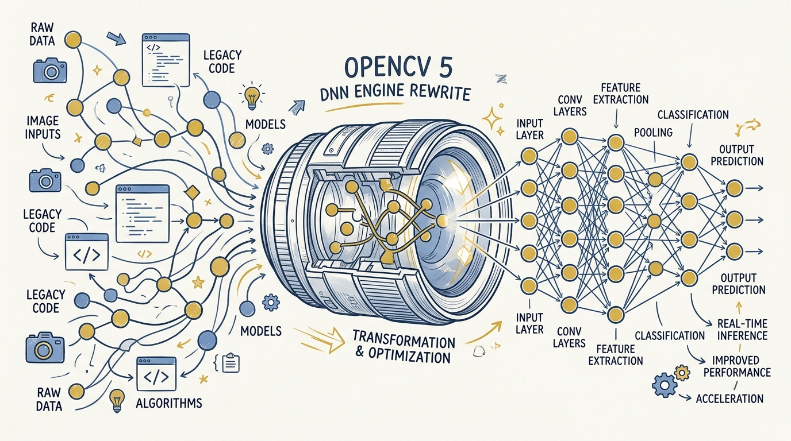
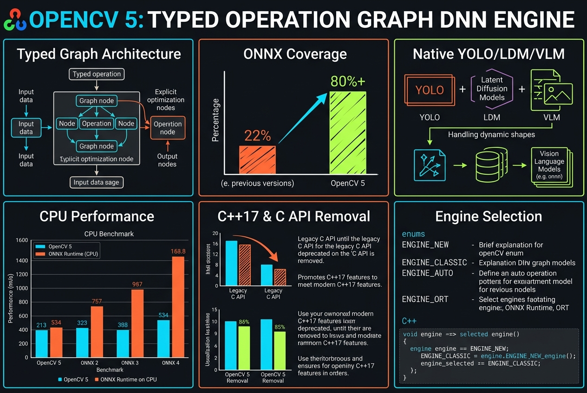
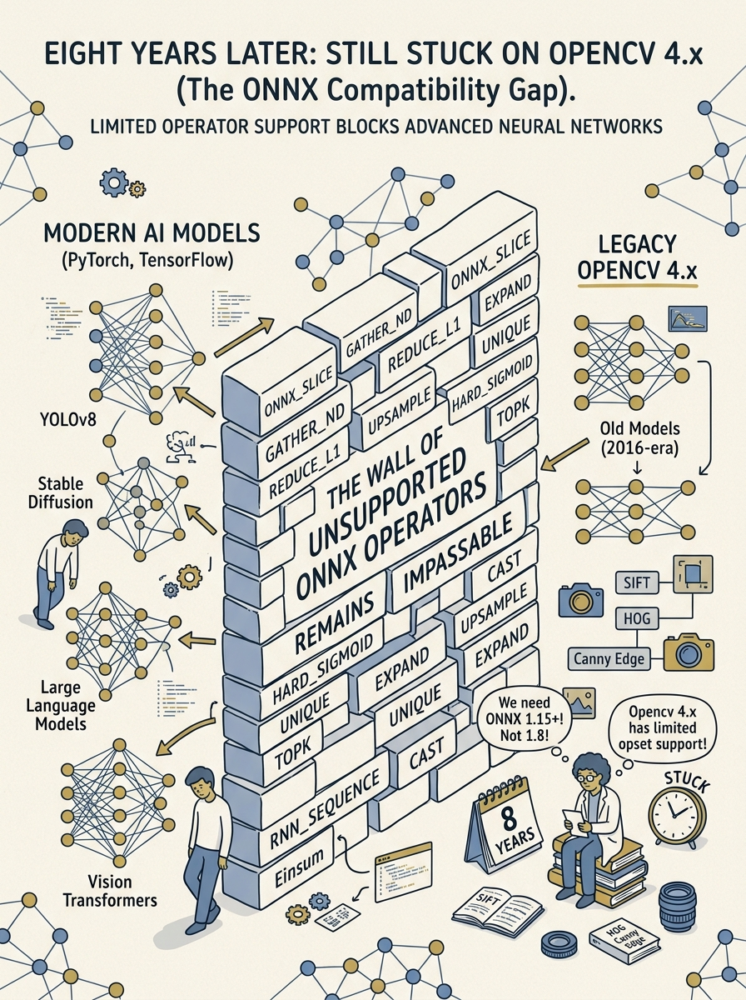

<!-- _class: title -->

# OpenCV 5: Typed Operation Graph

DNN engine ยกเครื่องใหม่ทั้งหมด — ONNX coverage 22% → 80%+, รัน YOLO/LDM/VLM ได้ native, เร็วกว่า ONNX Runtime บน CPU

<!-- Speaker: OpenCV 5 คือ major release แรกตั้งแต่ปี 2018 หัวใจคือ DNN module ที่เขียนใหม่ทั้งหมด. -->

---

<!-- _class: cheatsheet -->
<!-- _backgroundColor: #f8f7f4 -->

<!-- Speaker: ภาพรวมทั้ง 6 concept หลักของ deck นี้ — ใช้เวลา 60 วิ ปูพื้นก่อนเข้ารายละเอียด. -->

---

## TL;DR: การยกเครื่องที่ใหญ่ที่สุดตั้งแต่ปี 2018

OpenCV 5 เปลี่ยน DNN engine ทั้งระบบ ปิดช่องว่าง ONNX ที่ค้างมา 8 ปี

  

    
Architecture

    <h3>Typed Operation Graph</h3>
    
วิเคราะห์ทั้งกราฟก่อนรัน แทน layer-by-layer แบบเดิม

  

  

    
Coverage

    <h3>ONNX 22% → 80%+</h3>
    
รันโมเดลสมัยใหม่ได้โดยไม่เจอ operator ที่ไม่รองรับ

  

  

    
Performance

    <h3>เร็วกว่า ONNX Runtime</h3>
    
+11.5% บน YOLOv8n, สูงสุด +36.6% บน OWLv2 (CPU)

  

<b>★ Takeaway:</b> ไม่ใช่แค่ patch เพิ่ม operator — เป็นการเขียน DNN engine ใหม่ทั้งหมด.

<!-- Speaker: เกริ่นภาพรวม 3 แกนหลักก่อนลงรายละเอียดแต่ละส่วน. -->

---

## แปดปีที่ค้างอยู่บน OpenCV 4.x กับกำแพง ONNX 22%

Engine เดิมประมวลผลแบบ layer-by-layer ตามโมเดลยุคใหม่ไม่ทัน

<svg viewBox="0 0 700 320" width="100%" xmlns="http://www.w3.org/2000/svg">
  <rect x="30" y="30" width="640" height="70" rx="10" fill="var(--soft)" stroke="var(--soft-2)" stroke-width="1.5"/>
  <text x="60" y="72" font-size="16" font-weight="700" fill="var(--ink)" font-family="system-ui">OpenCV 4.x (2018–2026)</text>
  <text x="560" y="72" font-size="15" fill="var(--danger)" text-anchor="end" font-family="system-ui">~8 years</text>
  <rect x="30" y="130" width="640" height="70" rx="10" fill="var(--danger-wash)" stroke="var(--danger)" stroke-width="1.5"/>
  <text x="60" y="172" font-size="16" font-weight="700" fill="var(--danger-ink)" font-family="system-ui">ONNX operator coverage</text>
  <text x="560" y="172" font-size="22" font-weight="800" fill="var(--danger-ink)" text-anchor="end" font-family="system-ui">22%</text>
  <rect x="30" y="230" width="640" height="60" rx="10" fill="var(--paper)" stroke="var(--soft-2)" stroke-width="1.5"/>
  <text x="350" y="266" font-size="14" fill="var(--ink-dim)" text-anchor="middle" font-family="system-ui">Load model → hit unsupported operator → stuck</text>
</svg>

<b>★ Takeaway:</b> transformer / dynamic-shape models เจอ operator wall เดิมบ่อยเกินไป — ต้องเขียน engine ใหม่ ไม่ใช่ patch เพิ่ม.

<!-- Speaker: เซ็ตอัพปัญหาก่อนเข้า architecture ใหม่. -->

---

## Typed Operation Graph: จาก Layer-by-Layer สู่ Whole-Graph Analysis

Engine ใหม่วิเคราะห์ทั้งกราฟก่อนรัน เปิดทาง optimization ที่ engine เดิมทำไม่ได้

<svg viewBox="0 0 1100 380" width="100%" xmlns="http://www.w3.org/2000/svg">
  <rect x="60" y="30" width="980" height="70" rx="12" fill="var(--soft)" stroke="var(--soft-2)" stroke-width="1.5"/>
  <text x="90" y="72" font-size="16" font-weight="700" fill="var(--muted)" font-family="system-ui">OpenCV 4.x: layer → layer → layer (sequential)</text>
  <text x="550" y="150" font-size="24" fill="var(--accent)" text-anchor="middle" font-family="system-ui">↓</text>
  <rect x="60" y="180" width="220" height="160" rx="12" fill="var(--paper)" stroke="var(--accent)" stroke-width="2" style="filter:drop-shadow(var(--shadow-sm))"/>
  <text x="170" y="220" font-size="15" font-weight="700" fill="var(--accent)" text-anchor="middle" font-family="system-ui">Shape</text>
  <text x="170" y="240" font-size="15" font-weight="700" fill="var(--accent)" text-anchor="middle" font-family="system-ui">Inference</text>
  <rect x="300" y="180" width="220" height="160" rx="12" fill="var(--paper)" stroke="var(--accent)" stroke-width="2" style="filter:drop-shadow(var(--shadow-sm))"/>
  <text x="410" y="220" font-size="15" font-weight="700" fill="var(--accent)" text-anchor="middle" font-family="system-ui">Constant</text>
  <text x="410" y="240" font-size="15" font-weight="700" fill="var(--accent)" text-anchor="middle" font-family="system-ui">Folding</text>
  <rect x="540" y="180" width="220" height="160" rx="12" fill="var(--paper)" stroke="var(--accent)" stroke-width="2" style="filter:drop-shadow(var(--shadow-sm))"/>
  <text x="650" y="220" font-size="15" font-weight="700" fill="var(--accent)" text-anchor="middle" font-family="system-ui">Operator</text>
  <text x="650" y="240" font-size="15" font-weight="700" fill="var(--accent)" text-anchor="middle" font-family="system-ui">Fusion</text>
  <rect x="780" y="180" width="260" height="160" rx="12" fill="var(--paper)" stroke="var(--accent)" stroke-width="2" style="filter:drop-shadow(var(--shadow-sm))"/>
  <text x="910" y="220" font-size="15" font-weight="700" fill="var(--accent)" text-anchor="middle" font-family="system-ui">Unified Memory</text>
  <text x="910" y="240" font-size="15" font-weight="700" fill="var(--accent)" text-anchor="middle" font-family="system-ui">Buffer Pool</text>
</svg>

<b>★ Takeaway:</b> วิเคราะห์ทั้งกราฟก่อนรัน = fuse MatMul+Softmax+attention เป็น single pass, reuse memory ข้าม operator.

<!-- Speaker: เจาะรายละเอียด 4 ความสามารถที่เกิดจาก whole-graph analysis. -->

---

## ONNX Operator Coverage: จาก 22% สู่ 80%+

การกระโดดครั้งนี้ปิดกำแพงที่ทำให้โมเดลสมัยใหม่โหลดไม่ผ่าน

<svg viewBox="0 0 1100 380" width="100%" xmlns="http://www.w3.org/2000/svg">
  <text x="60" y="60" font-size="16" font-weight="700" fill="var(--ink)" font-family="system-ui">OpenCV 4.x</text>
  <rect x="220" y="35" width="800" height="40" rx="8" fill="var(--soft-2)"/>
  <rect x="220" y="35" width="176" height="40" rx="8" fill="var(--danger)"/>
  <text x="410" y="62" font-size="16" font-weight="800" fill="var(--paper)" font-family="system-ui">22%</text>
  <text x="60" y="160" font-size="16" font-weight="700" fill="var(--ink)" font-family="system-ui">OpenCV 5.0</text>
  <rect x="220" y="135" width="800" height="40" rx="8" fill="var(--soft-2)"/>
  <rect x="220" y="135" width="640" height="40" rx="8" fill="var(--success)"/>
  <text x="840" y="162" font-size="16" font-weight="800" fill="var(--paper)" font-family="system-ui">80%+</text>
  <rect x="60" y="230" width="480" height="120" rx="12" fill="var(--paper)" stroke="var(--soft-2)" stroke-width="1.5"/>
  <text x="90" y="266" font-size="15" font-weight="700" fill="var(--ink)" font-family="system-ui">Dynamic / symbolic shapes</text>
  <text x="90" y="296" font-size="14" fill="var(--ink-dim)" font-family="system-ui">Input shape ไม่ fix ตอน compile</text>
  <rect x="560" y="230" width="480" height="120" rx="12" fill="var(--paper)" stroke="var(--soft-2)" stroke-width="1.5"/>
  <text x="590" y="266" font-size="15" font-weight="700" fill="var(--ink)" font-family="system-ui">If / Loop subgraphs</text>
  <text x="590" y="296" font-size="14" fill="var(--ink-dim)" font-family="system-ui">Control-flow สำหรับ quantized models</text>
</svg>

<b>★ Takeaway:</b> ไม่เจอ "operator not supported" กลางทางเวลาโหลดโมเดลสมัยใหม่เข้า pipeline อีกต่อไป.

<!-- Speaker: ตัวเลขนี้คือหัวใจของ release — เน้นย้ำก่อนเข้าเรื่อง model support. -->

---

## รันโมเดลสมัยใหม่แบบ Native: YOLO, LDM, VLM/LLM

ไม่ต้องพึ่ง PyTorch หรือ ONNX Runtime เป็นตัวกลางอีกต่อไป

  

    
YOLO

    <h3>YOLOv8, YOLOX-S</h3>
    
Real-time object detection แบบ native เร็วกว่า ONNX Runtime บน CPU

  

  

    
LDM

    <h3>LaMa Inpainting</h3>
    
Object removal แบบ single forward pass, iterative denoise บน CPU ตรง

  

  

    
VLM / LLM

    <h3>Qwen 2.5, Gemma 3, GPT</h3>
    
รันผ่าน Net API เดียวกัน — built-in tokenizer + KV-cache สำหรับ autoregressive decoding

  

<b>★ Takeaway:</b> Built-in tokenizer + KV-cache ในตัว engine เอง = OpenCV ก้าวจาก "image library" สู่ multi-modal inference runtime.

<!-- Speaker: ย้ำว่าทั้ง 3 กลุ่มโมเดลรันผ่าน Net API เดียวกัน ไม่ต้องมี dependency แยก. -->

---

## Performance: ชนะ ONNX Runtime บน CPU

Benchmark บน Intel Core i9-14900KS (Ubuntu 24.04 LTS) — engine ใหม่ยังไม่มี GPU แต่ CPU แข่งตรงได้

<svg viewBox="0 0 1100 380" width="100%" xmlns="http://www.w3.org/2000/svg">
  <text x="60" y="50" font-size="15" font-weight="700" fill="var(--ink)" font-family="system-ui">YOLOv8n</text>
  <rect x="220" y="28" width="800" height="34" rx="6" fill="var(--soft-2)"/>
  <rect x="220" y="28" width="92" height="34" rx="6" fill="var(--accent)"/>
  <text x="330" y="51" font-size="14" font-weight="700" fill="var(--ink)" font-family="system-ui">+11.5%</text>
  <text x="60" y="150" font-size="15" font-weight="700" fill="var(--ink)" font-family="system-ui">DINOv2</text>
  <rect x="220" y="128" width="800" height="34" rx="6" fill="var(--soft-2)"/>
  <rect x="220" y="128" width="195" height="34" rx="6" fill="var(--accent)"/>
  <text x="435" y="151" font-size="14" font-weight="700" fill="var(--ink)" font-family="system-ui">+24.4%</text>
  <text x="60" y="250" font-size="15" font-weight="700" fill="var(--ink)" font-family="system-ui">OWLv2</text>
  <rect x="220" y="228" width="800" height="34" rx="6" fill="var(--soft-2)"/>
  <rect x="220" y="228" width="293" height="34" rx="6" fill="var(--success)"/>
  <text x="533" y="251" font-size="14" font-weight="700" fill="var(--ink)" font-family="system-ui">+36.6%</text>
  <text x="60" y="330" font-size="13" fill="var(--muted)" font-family="system-ui">Faster than ONNX Runtime, native OpenCV 5 DNN engine, CPU-only</text>
</svg>

<b>★ Takeaway:</b> YOLOv8n 10.9ms vs ONNX Runtime 12.15ms — CPU-only engine ยังชนะ runtime ที่ optimize มาอย่างหนักแล้ว.

<!-- Speaker: ตัวเลขมาจาก hardware เฉพาะ เตือนผู้ฟังเรื่อง benchmark variance ตาม hardware. -->

---

## C++17 Baseline และการตัด Legacy C API

เขย่าหนี้เทคนิคที่สะสมมาตั้งแต่ยุค OpenCV 1.x–3.x

<svg viewBox="0 0 1100 380" width="100%" xmlns="http://www.w3.org/2000/svg">
  <rect x="40" y="20" width="490" height="340" rx="12" fill="var(--paper)" stroke="var(--soft-2)" stroke-width="1.5" style="filter:drop-shadow(var(--shadow-sm))"/>
  <rect x="40" y="20" width="490" height="56" rx="12" fill="var(--soft)" opacity=".8"/>
  <text x="285" y="54" font-size="17" font-weight="700" fill="var(--ink-dim)" text-anchor="middle" font-family="system-ui">OpenCV 4.x</text>
  <text x="80" y="115" font-size="15" fill="var(--ink)" font-family="system-ui">Legacy C API present</text>
  <text x="80" y="150" font-size="15" fill="var(--ink-dim)" font-family="system-ui">CvMat, cvCreateMat still work</text>
  <text x="80" y="185" font-size="15" fill="var(--muted)" font-family="system-ui">Python 2 + 3 bindings</text>
  <rect x="570" y="20" width="490" height="340" rx="12" fill="var(--paper)" stroke="var(--accent)" stroke-width="2" style="filter:drop-shadow(var(--shadow-md))"/>
  <rect x="570" y="20" width="490" height="56" rx="12" fill="var(--accent)" opacity=".08"/>
  <text x="815" y="54" font-size="17" font-weight="700" fill="var(--accent)" text-anchor="middle" font-family="system-ui">OpenCV 5.0</text>
  <text x="610" y="115" font-size="15" fill="var(--ink)" font-family="system-ui">C++17 minimum baseline</text>
  <text x="610" y="150" font-size="15" fill="var(--ink)" font-family="system-ui">Legacy C API removed entirely</text>
  <text x="610" y="185" font-size="15" fill="var(--ink)" font-family="system-ui">Python 3.6+ only</text>
  <circle cx="550" cy="190" r="28" fill="var(--accent)"/>
  <text x="550" y="195" font-size="13" font-weight="700" fill="var(--paper)" text-anchor="middle" dominant-baseline="central" font-family="system-ui">→</text>
</svg>

<b>★ Takeaway:</b> Breaking change — codebase ที่ยังใช้ CvMat/cvCreateMat ต้อง port ก่อน upgrade เป็น 5.0.

<!-- Speaker: เตือนว่า upgrade ไม่ใช่แค่เปลี่ยนเลขเวอร์ชัน ต้องวางแผน migration. -->

---

## Caveats: สิ่งที่ต้องรู้ก่อน Upgrade

4 ข้อจำกัดที่ทีมต้องเช็คก่อนย้ายไป production

  

    
GPU

    <h3>CPU-only</h3>
    
GPU support ยังไม่มา รอ release ถัดไป

  

  

    
Breaking

    <h3>C API หายหมด</h3>
    
CvMat/cvCreateMat ต้อง port ก่อน

  

  

    
Toolchain

    <h3>ต้อง C++17+</h3>
    
compiler เก่าเกินไป build ไม่ผ่าน

  

  

    
Engine Modes

    <h3>4 โหมดเลือกได้</h3>
    
classic / graph / auto-fallback / ORT wrapper

  

<b>★ Takeaway:</b> ทดสอบทั้ง 4 engine mode ก่อนเลือก production — benchmark ตัวเลขมาจาก hardware เฉพาะ อาจต่างบนเครื่องอื่น.

<!-- Speaker: ปิดด้วยข้อจำกัด ก่อนสรุป key takeaways. -->

---

## Key Takeaways

สิ่งที่ต้องจำแม้ข้ามเนื้อหาส่วนอื่นไปหมด

<svg viewBox="0 0 1100 340" width="100%" xmlns="http://www.w3.org/2000/svg">
  <circle cx="550" cy="170" r="160" fill="none" stroke="var(--soft-2)" stroke-width="1.5"/>
  <circle cx="550" cy="170" r="110" fill="none" stroke="var(--accent)" stroke-width="1.5" opacity=".4"/>
  <circle cx="550" cy="170" r="60" fill="var(--accent)" opacity=".1"/>
  <circle cx="550" cy="170" r="60" fill="none" stroke="var(--accent)" stroke-width="2"/>
  <text x="550" y="164" font-size="15" font-weight="700" fill="var(--accent)" text-anchor="middle" font-family="system-ui">Typed Op</text>
  <text x="550" y="184" font-size="13" fill="var(--ink)" text-anchor="middle" font-family="system-ui">Graph</text>
  <text x="380" y="100" font-size="13" fill="var(--ink)" font-family="system-ui" text-anchor="middle">ONNX 22%</text>
  <text x="380" y="120" font-size="12" fill="var(--muted)" font-family="system-ui" text-anchor="middle">→ 80%+</text>
  <text x="730" y="100" font-size="13" fill="var(--ink)" font-family="system-ui" text-anchor="middle">Native YOLO</text>
  <text x="730" y="120" font-size="12" fill="var(--muted)" font-family="system-ui" text-anchor="middle">LDM / VLM</text>
  <text x="220" y="170" font-size="13" fill="var(--muted)" font-family="system-ui" text-anchor="middle">CPU beats</text>
  <text x="220" y="190" font-size="13" fill="var(--muted)" font-family="system-ui" text-anchor="middle">ONNX Runtime</text>
  <text x="880" y="170" font-size="13" fill="var(--muted)" font-family="system-ui" text-anchor="middle">C++17 +</text>
  <text x="880" y="190" font-size="13" fill="var(--muted)" font-family="system-ui" text-anchor="middle">no C API</text>
</svg>

<b>★ Takeaway:</b> OpenCV 5 ไม่ใช่ patch เล็กๆ — เป็น major rewrite ที่ปิดช่องว่าง 8 ปีในคราวเดียว. GPU ตามมาทีหลัง, CPU ก็เร็วกว่า ONNX Runtime แล้ววันนี้.

