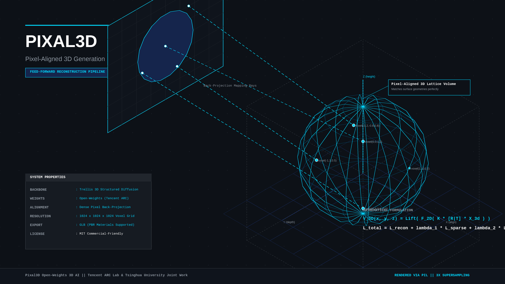
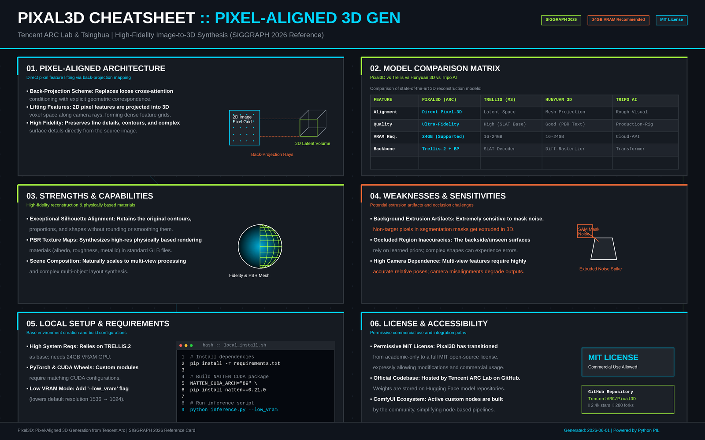
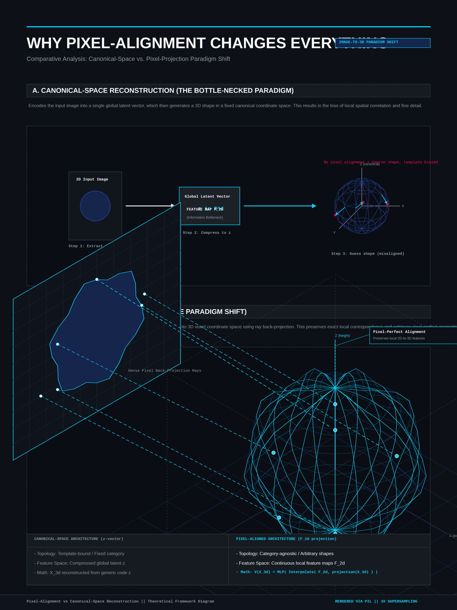
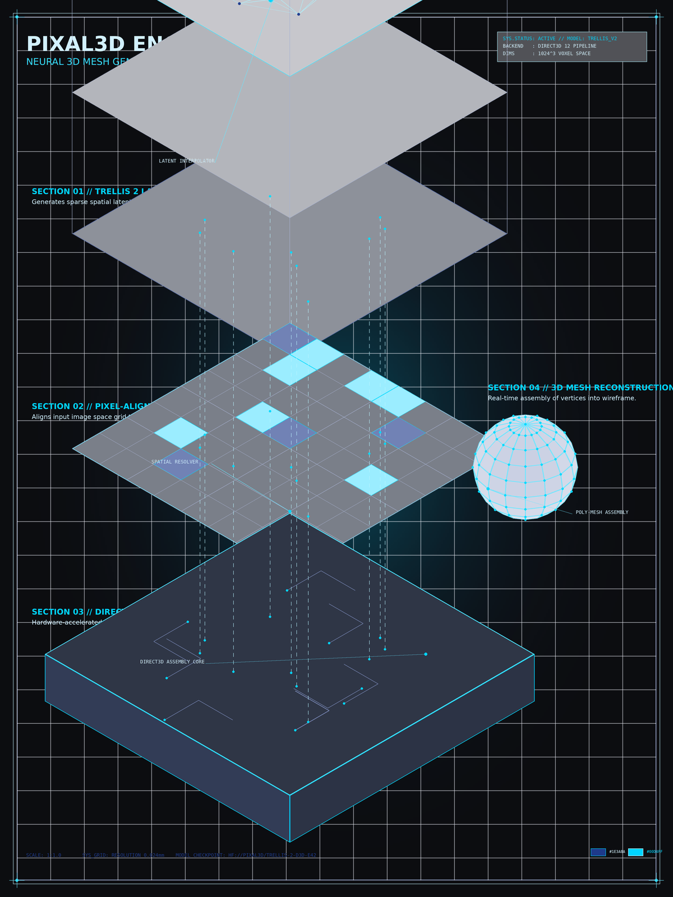

<!-- _class: title -->

# Pixal3D: Open-Weights 3D AI

Pixel-aligned generation from Tencent Arc — SIGGRAPH 2026

<!-- Speaker: Pixal3D changes how image-to-3D works. Instead of loosely referencing the image through attention, it back-projects pixel features directly into 3D space. MIT License, runs locally on 24 GB VRAM. -->

---

<!-- _class: cheatsheet -->
<!-- _backgroundColor: #f8f7f4 -->

<!-- Speaker: 6-panel quick reference — architecture, comparisons, strengths, weaknesses, setup, license. Each section gets its own slide. -->

---

## Pixal3D: Image-to-3D ที่ Output Faithful กับรูปต้นฉบับมากที่สุด

Back-projects pixel features directly into 3D — accepted SIGGRAPH 2026, MIT License, open on HuggingFace.

<svg viewBox="0 0 1100 280" width="100%" xmlns="http://www.w3.org/2000/svg">
  <rect x="60" y="30" width="980" height="220" rx="16" fill="var(--paper)" stroke="var(--soft-2)" stroke-width="1.5" style="filter:drop-shadow(0 4px 12px rgba(15,23,42,.08))"/>
  <rect x="60" y="30" width="8" height="220" rx="4" fill="var(--accent)"/>
  <circle cx="160" cy="140" r="44" fill="var(--accent)" opacity=".12"/>
  <circle cx="160" cy="140" r="30" fill="var(--accent)"/>
  <text x="160" y="145" font-size="16" fill="white" text-anchor="middle" dominant-baseline="central" font-family="system-ui" font-weight="700">3D</text>
  <text x="240" y="108" font-size="20" font-weight="700" fill="var(--ink)" font-family="system-ui">Pixel-aligned, sub-pixel faithful 3D generation</text>
  <text x="240" y="138" font-size="14" fill="var(--ink-dim)" font-family="system-ui">Single image input — back-projects every pixel directly into 3D space</text>
  <text x="240" y="163" font-size="14" fill="var(--ink-dim)" font-family="system-ui">Backbone: Trellis 2 + Direct3D | 24 GB VRAM | MIT License</text>
  <text x="240" y="188" font-size="14" fill="var(--muted)" font-family="system-ui">Better pixel-fidelity than Trellis 2 / Hunyuan 3D | Getting close to paid Tripo</text>
</svg>

<b>★ Takeaway:</b> First open-weights model where the output silhouette matches the input image exactly — pixel-faithful, not "sort of like."

<!-- Speaker: The headline claim — pixel-aligned means the silhouette stays exactly where you drew it. No more approximate matches. -->

---

## Prior Models Couldn't Match the Input — Pixal3D Changes That

Old approach: canonical space + attention (always approximate); Pixal3D: direct pixel projection (exact)

<svg viewBox="0 0 700 260" width="100%" xmlns="http://www.w3.org/2000/svg">
  <rect x="10" y="20" width="320" height="220" rx="10" fill="var(--soft)" stroke="var(--soft-2)" stroke-width="1.5"/>
  <text x="170" y="50" font-size="13" font-weight="700" fill="var(--muted)" text-anchor="middle" font-family="system-ui">Old: Canonical Space</text>
  <rect x="36" y="78" width="56" height="36" rx="6" fill="var(--muted)" opacity=".3"/>
  <text x="64" y="100" font-size="10" fill="var(--ink-dim)" text-anchor="middle" font-family="system-ui">Image</text>
  <path d="M94,96 L138,96" stroke="var(--muted)" stroke-width="1.5" marker-end="url(#am)"/>
  <rect x="140" y="78" width="66" height="36" rx="6" fill="var(--muted)" opacity=".3"/>
  <text x="173" y="100" font-size="9" fill="var(--muted)" text-anchor="middle" font-family="system-ui">Attention</text>
  <path d="M208,96 L248,96" stroke="var(--muted)" stroke-width="1.5" marker-end="url(#am)"/>
  <rect x="250" y="78" width="60" height="36" rx="6" fill="var(--muted)" opacity=".3"/>
  <text x="280" y="100" font-size="10" fill="var(--muted)" text-anchor="middle" font-family="system-ui">3D</text>
  <text x="170" y="148" font-size="11" fill="var(--danger)" text-anchor="middle" font-family="system-ui">similar, never exact</text>
  <rect x="370" y="20" width="320" height="220" rx="10" fill="var(--accent-wash)" stroke="var(--accent)" stroke-width="1.5"/>
  <text x="530" y="50" font-size="13" font-weight="700" fill="var(--accent)" text-anchor="middle" font-family="system-ui">Pixal3D: Direct Projection</text>
  <rect x="396" y="78" width="56" height="36" rx="6" fill="var(--accent)" opacity=".25"/>
  <text x="424" y="100" font-size="10" fill="var(--accent-deep)" text-anchor="middle" font-family="system-ui">Image</text>
  <path d="M454,96 L494,96" stroke="var(--accent)" stroke-width="2" marker-end="url(#aa)"/>
  <text x="473" y="90" font-size="9" fill="var(--accent)" text-anchor="middle" font-family="system-ui">project</text>
  <rect x="496" y="78" width="60" height="36" rx="6" fill="var(--accent)" opacity=".25"/>
  <text x="526" y="100" font-size="9" fill="var(--accent-deep)" text-anchor="middle" font-family="system-ui">3D pts</text>
  <path d="M558,96 L598,96" stroke="var(--accent)" stroke-width="2" marker-end="url(#aa)"/>
  <rect x="600" y="78" width="60" height="36" rx="6" fill="var(--accent)" opacity=".4"/>
  <text x="630" y="100" font-size="10" fill="var(--accent-deep)" text-anchor="middle" font-family="system-ui" font-weight="700">Mesh</text>
  <text x="530" y="148" font-size="11" fill="var(--success)" text-anchor="middle" font-family="system-ui">sub-pixel faithful</text>
  <defs>
    <marker id="am" markerWidth="6" markerHeight="6" refX="3" refY="3" orient="auto"><path d="M0,0 L6,3 L0,6 Z" fill="var(--muted)"/></marker>
    <marker id="aa" markerWidth="6" markerHeight="6" refX="3" refY="3" orient="auto"><path d="M0,0 L6,3 L0,6 Z" fill="var(--accent)"/></marker>
  </defs>
</svg>

<b>★ Takeaway:</b> The innovation is architectural — pixel features bypass canonical space and land directly in 3D coordinates, eliminating the attention-layer approximation.

<!-- Speaker: Every prior model — Trellis, Hunyuan, Direct3D — built geometry in canonical space first, then loosely referenced the image through attention. Pixal3D skips that indirection. -->

---

## Architecture: Pixel-Alignment Layer on Top of Open-Source Backbone

Single image → pixel features → 3D correspondences → mesh + PBR textures

<svg viewBox="0 0 700 240" width="100%" xmlns="http://www.w3.org/2000/svg">
  <rect x="10" y="80" width="120" height="80" rx="10" fill="var(--paper)" stroke="var(--soft-2)" stroke-width="1.5" style="filter:drop-shadow(var(--shadow-sm))"/>
  <text x="70" y="116" font-size="11" font-weight="700" fill="var(--ink)" text-anchor="middle" font-family="system-ui">Single Image</text>
  <text x="70" y="134" font-size="10" fill="var(--muted)" text-anchor="middle" font-family="system-ui">Input</text>
  <path d="M132,120 L155,120" stroke="var(--muted)" stroke-width="2" marker-end="url(#ap)"/>
  <rect x="158" y="65" width="140" height="110" rx="10" fill="var(--accent-wash)" stroke="var(--accent)" stroke-width="1.5"/>
  <text x="228" y="105" font-size="11" font-weight="700" fill="var(--accent)" text-anchor="middle" font-family="system-ui">Pixel-Alignment</text>
  <text x="228" y="122" font-size="10" fill="var(--ink-dim)" text-anchor="middle" font-family="system-ui">back-project features</text>
  <text x="228" y="139" font-size="9" fill="var(--muted)" text-anchor="middle" font-family="system-ui">open-weights only</text>
  <text x="228" y="155" font-size="9" fill="var(--muted)" text-anchor="middle" font-family="system-ui">(not open-source)</text>
  <path d="M300,120 L323,120" stroke="var(--muted)" stroke-width="2" marker-end="url(#ap)"/>
  <rect x="326" y="65" width="140" height="110" rx="10" fill="var(--paper)" stroke="var(--soft-2)" stroke-width="1.5" style="filter:drop-shadow(var(--shadow-sm))"/>
  <text x="396" y="105" font-size="11" font-weight="700" fill="var(--ink)" text-anchor="middle" font-family="system-ui">Trellis 2</text>
  <text x="396" y="122" font-size="10" fill="var(--ink-dim)" text-anchor="middle" font-family="system-ui">+ Direct3D</text>
  <text x="396" y="139" font-size="9" fill="var(--success)" text-anchor="middle" font-family="system-ui">open-source backbone</text>
  <path d="M468,120 L491,120" stroke="var(--muted)" stroke-width="2" marker-end="url(#ap)"/>
  <rect x="494" y="80" width="195" height="80" rx="10" fill="var(--success-wash)" stroke="var(--success)" stroke-width="1.5"/>
  <text x="591" y="116" font-size="11" font-weight="700" fill="var(--success-ink)" text-anchor="middle" font-family="system-ui">3D Mesh + PBR</text>
  <text x="591" y="134" font-size="10" fill="var(--success-ink)" text-anchor="middle" font-family="system-ui">Textures</text>
  <defs>
    <marker id="ap" markerWidth="6" markerHeight="6" refX="3" refY="3" orient="auto"><path d="M0,0 L6,3 L0,6 Z" fill="var(--muted)"/></marker>
  </defs>
</svg>

<b>★ Takeaway:</b> Backbone is open-source; only the pixel-alignment layer is open-weights — community can build derivatives but can't reproduce the alignment layer exactly.

<!-- Speaker: Three-stage pipeline. The critical innovation — pixel-alignment — is the proprietary part. Community can build on the architecture, just can't clone the layer. -->

---

## Pixal3D vs Trellis 2 vs Hunyuan 3D vs Tripo

Pixel fidelity is Pixal3D's domain; Tripo still leads on all-around shape accuracy.

| Model | Pixel Fidelity | Shape Accuracy | Commercial | Local |
|-------|:---:|:---:|:---:|:---:|
| **Pixal3D** | ★★★★★ | ★★★☆☆ | MIT License | 24 GB VRAM |
| Trellis 2 | ★★★☆☆ | ★★★★☆ | Open | 12+ GB |
| Hunyuan 3D | ★★★☆☆ | ★★★★☆ | Limited | 12+ GB |
| **Tripo** | ★★★★☆ | ★★★★★ | Paid | Cloud only |

<b>★ Takeaway:</b> Use Pixal3D for concept art and front-facing props; use Tripo when all-around shape accuracy matters more than pixel-faithfulness.

<!-- Speaker: Pixal3D wins pixel fidelity — no local model comes close. But for objects requiring 3D reasoning, Tripo still leads. Right tool for the right use case. -->

---

## Strengths and Weaknesses: The Pixel-Alignment Trade-Off

High pixel-faithfulness comes with a cost — camera-angle sensitivity and VRAM requirements.

  

    

      
Strength

      <h3>Silhouette Accuracy</h3>
      
ขอบและรูปร่างตรงกับรูปต้นฉบับแทบ 1:1 — ดีกว่าทุก local model ที่มีก่อนหน้า

    

    

      
Strength

      <h3>Color + Detail Fidelity</h3>
      
สีและ texture ใกล้เคียงรูปต้นฉบับมากกว่า Hunyuan 3D และ Trellis 2

    

  

  

    

      
Weakness

      <h3>Rotation Artifacts</h3>
      
Pixel-aligned กับ view เดิม → ด้านหลัง 3D model มักมี geometry artifacts

    

    

      
Limitation

      <h3>Complex Shapes + VRAM</h3>
      
Objects ที่ต้องการ 3D reasoning (ปืน, มุมเฉียง) ทำได้แย่กว่า Trellis 2 | 24 GB VRAM required

    

  

<b>★ Takeaway:</b> Best for front-facing concept art and level-design assets; weakest for props that need correct geometry from every angle.

<!-- Speaker: The same property that makes it pixel-accurate from the front also makes it bad from the back — it copies the image pixels into 3D, so the backside has no pixel data. -->

---

## Local Setup: 4 Steps to Run Pixal3D

Requires 24 GB VRAM; RunPod or A100 cloud GPU is a practical alternative.

<svg viewBox="0 0 1100 260" width="100%" xmlns="http://www.w3.org/2000/svg">
  <rect x="30" y="60" width="210" height="140" rx="12" fill="var(--paper)" stroke="var(--soft-2)" stroke-width="1.5" style="filter:drop-shadow(var(--shadow-sm))"/>
  <circle cx="76" cy="96" r="16" fill="var(--accent)" opacity=".15"/>
  <circle cx="76" cy="96" r="10" fill="var(--accent)"/>
  <text x="76" y="100" font-size="10" font-weight="700" fill="white" text-anchor="middle" font-family="system-ui">1</text>
  <text x="136" y="91" font-size="12" font-weight="700" fill="var(--ink)" font-family="system-ui" text-anchor="middle">Clone Repo</text>
  <text x="136" y="109" font-size="10" fill="var(--muted)" font-family="system-ui" text-anchor="middle">TencentARC/Pixal3D</text>
  <text x="136" y="127" font-size="10" fill="var(--muted)" font-family="system-ui" text-anchor="middle">+ install Trellis 2</text>
  <path d="M242,130 L276,130" stroke="var(--accent)" stroke-width="2" marker-end="url(#aflow)"/>
  <rect x="278" y="60" width="210" height="140" rx="12" fill="var(--paper)" stroke="var(--soft-2)" stroke-width="1.5" style="filter:drop-shadow(var(--shadow-sm))"/>
  <circle cx="324" cy="96" r="16" fill="var(--accent)" opacity=".15"/>
  <circle cx="324" cy="96" r="10" fill="var(--accent)"/>
  <text x="324" y="100" font-size="10" font-weight="700" fill="white" text-anchor="middle" font-family="system-ui">2</text>
  <text x="383" y="91" font-size="12" font-weight="700" fill="var(--ink)" font-family="system-ui" text-anchor="middle">Install Deps</text>
  <text x="383" y="109" font-size="10" fill="var(--muted)" font-family="system-ui" text-anchor="middle">pip install -r</text>
  <text x="383" y="127" font-size="10" fill="var(--muted)" font-family="system-ui" text-anchor="middle">requirements.txt</text>
  <path d="M490,130 L524,130" stroke="var(--accent)" stroke-width="2" marker-end="url(#aflow)"/>
  <rect x="526" y="60" width="210" height="140" rx="12" fill="var(--paper)" stroke="var(--soft-2)" stroke-width="1.5" style="filter:drop-shadow(var(--shadow-sm))"/>
  <circle cx="572" cy="96" r="16" fill="var(--accent)" opacity=".15"/>
  <circle cx="572" cy="96" r="10" fill="var(--accent)"/>
  <text x="572" y="100" font-size="10" font-weight="700" fill="white" text-anchor="middle" font-family="system-ui">3</text>
  <text x="631" y="91" font-size="12" font-weight="700" fill="var(--ink)" font-family="system-ui" text-anchor="middle">Get Weights</text>
  <text x="631" y="109" font-size="10" fill="var(--muted)" font-family="system-ui" text-anchor="middle">HuggingFace</text>
  <text x="631" y="127" font-size="10" fill="var(--muted)" font-family="system-ui" text-anchor="middle">TencentARC/Pixal3D</text>
  <path d="M738,130 L772,130" stroke="var(--accent)" stroke-width="2" marker-end="url(#aflow)"/>
  <rect x="774" y="60" width="296" height="140" rx="12" fill="var(--success-wash)" stroke="var(--success)" stroke-width="1.5"/>
  <circle cx="820" cy="96" r="16" fill="var(--success)" opacity=".2"/>
  <circle cx="820" cy="96" r="10" fill="var(--success)"/>
  <text x="820" y="100" font-size="10" font-weight="700" fill="white" text-anchor="middle" font-family="system-ui">4</text>
  <text x="920" y="91" font-size="12" font-weight="700" fill="var(--success-ink)" font-family="system-ui" text-anchor="middle">Run Demo</text>
  <text x="920" y="109" font-size="10" fill="var(--success-ink)" font-family="system-ui" text-anchor="middle">python app.py</text>
  <text x="920" y="127" font-size="10" fill="var(--success-ink)" font-family="system-ui" text-anchor="middle">Gradio UI localhost</text>
  <defs>
    <marker id="aflow" markerWidth="6" markerHeight="6" refX="3" refY="3" orient="auto"><path d="M0,0 L6,3 L0,6 Z" fill="var(--accent)"/></marker>
  </defs>
</svg>

<b>★ Takeaway:</b> UI workflow: drop image → Preview (draft quality) → Extract Mesh (final) — same Gradio pattern as Trellis.

<!-- Speaker: Setup mirrors Trellis since it builds on it. 24 GB blocks most consumer GPUs — RunPod with A100 is the practical option for testing without owning the hardware. -->

---

## Caveats: Know Before You Use

Hardware, license, and geometry limitations — none are dealbreakers for the right use case.

  

    
Hardware

    <h3>24 GB VRAM Minimum</h3>
    
RTX 4090 minimum locally. Low VRAM mode exists in code but unstable at 24 GB. RunPod / A100 recommended for testing.

  

  

    
License

    <h3>EU Restriction</h3>
    
European Union users blocked by current license. MIT applies globally except EU. HuggingFace weights gated — request access (instantly approved).

  

  

    
Geometry

    <h3>Back-View Artifacts</h3>
    
Back surface has no pixel data to reference — geometry issues expected. Best for front-facing or concept-only assets, not final production mesh.

  

<b>★ Takeaway:</b> For concepting and level design workflows, Pixal3D's limitations are acceptable — back-view artifacts don't matter for rough blocking.

<!-- Speaker: None of these are showstoppers for game concepting. Back-view artifacts don't matter if you're doing rough blocking. EU users need workarounds. -->

---

## Key Takeaways

Pixal3D เปลี่ยน paradigm ของ image-to-3D — ลอง run ได้เลยถ้ามี GPU 24 GB

<svg viewBox="0 0 1100 300" width="100%" xmlns="http://www.w3.org/2000/svg">
  <circle cx="190" cy="150" r="128" fill="none" stroke="var(--soft-2)" stroke-width="1.5"/>
  <circle cx="190" cy="150" r="86" fill="none" stroke="var(--accent)" stroke-width="1.5" opacity=".4"/>
  <circle cx="190" cy="150" r="48" fill="var(--accent)" opacity=".1"/>
  <circle cx="190" cy="150" r="48" fill="none" stroke="var(--accent)" stroke-width="2"/>
  <text x="190" y="144" font-size="12" font-weight="700" fill="var(--accent)" text-anchor="middle" font-family="system-ui">Pixel</text>
  <text x="190" y="162" font-size="11" fill="var(--accent)" text-anchor="middle" font-family="system-ui">Aligned</text>
  <text x="72" y="78" font-size="11" fill="var(--ink)" font-family="system-ui" text-anchor="middle">SIGGRAPH</text>
  <text x="72" y="95" font-size="10" fill="var(--muted)" font-family="system-ui" text-anchor="middle">2026</text>
  <text x="308" y="78" font-size="11" fill="var(--ink)" font-family="system-ui" text-anchor="middle">MIT License</text>
  <text x="308" y="95" font-size="10" fill="var(--muted)" font-family="system-ui" text-anchor="middle">open-weights</text>
  <text x="55" y="216" font-size="10" fill="var(--muted)" font-family="system-ui" text-anchor="middle">24 GB VRAM</text>
  <text x="325" y="216" font-size="10" fill="var(--muted)" font-family="system-ui" text-anchor="middle">EU blocked</text>
  <rect x="420" y="18" width="660" height="264" rx="12" fill="var(--soft)" stroke="var(--soft-2)" stroke-width="1"/>
  <rect x="420" y="18" width="8" height="264" rx="4" fill="var(--gold)"/>
  <text x="446" y="54" font-size="13" font-weight="700" fill="var(--ink)" font-family="system-ui">Pixel-faithfulness problem: solved (first open model)</text>
  <line x1="430" y1="66" x2="1072" y2="66" stroke="var(--soft-2)" stroke-width="1"/>
  <text x="446" y="97" font-size="13" font-weight="700" fill="var(--ink)" font-family="system-ui">Best for: concepting, blocking, level design</text>
  <line x1="430" y1="109" x2="1072" y2="109" stroke="var(--soft-2)" stroke-width="1"/>
  <text x="446" y="140" font-size="13" font-weight="700" fill="var(--ink)" font-family="system-ui">Tripo still wins: all-around shape accuracy</text>
  <line x1="430" y1="152" x2="1072" y2="152" stroke="var(--soft-2)" stroke-width="1"/>
  <text x="446" y="183" font-size="13" font-weight="700" fill="var(--ink)" font-family="system-ui">Backbone open-source; alignment layer open-weights only</text>
  <line x1="430" y1="195" x2="1072" y2="195" stroke="var(--soft-2)" stroke-width="1"/>
  <text x="446" y="226" font-size="13" font-weight="700" fill="var(--ink)" font-family="system-ui">Local AI 3D advancing faster than ever in 2026</text>
  <rect x="1064" y="18" width="8" height="264" rx="4" fill="var(--accent)" opacity=".4"/>
</svg>

<b>★ Takeaway:</b> Pixal3D is the open-weights breakthrough for game concepting — if you have a 24 GB GPU, try it today at github.com/TencentARC/Pixal3D.

<!-- Speaker: Bottom line: pixel-fidelity problem is solved for open-source community. VRAM is the only real barrier. For concepting and level design workflows, this is immediately useful. -->
