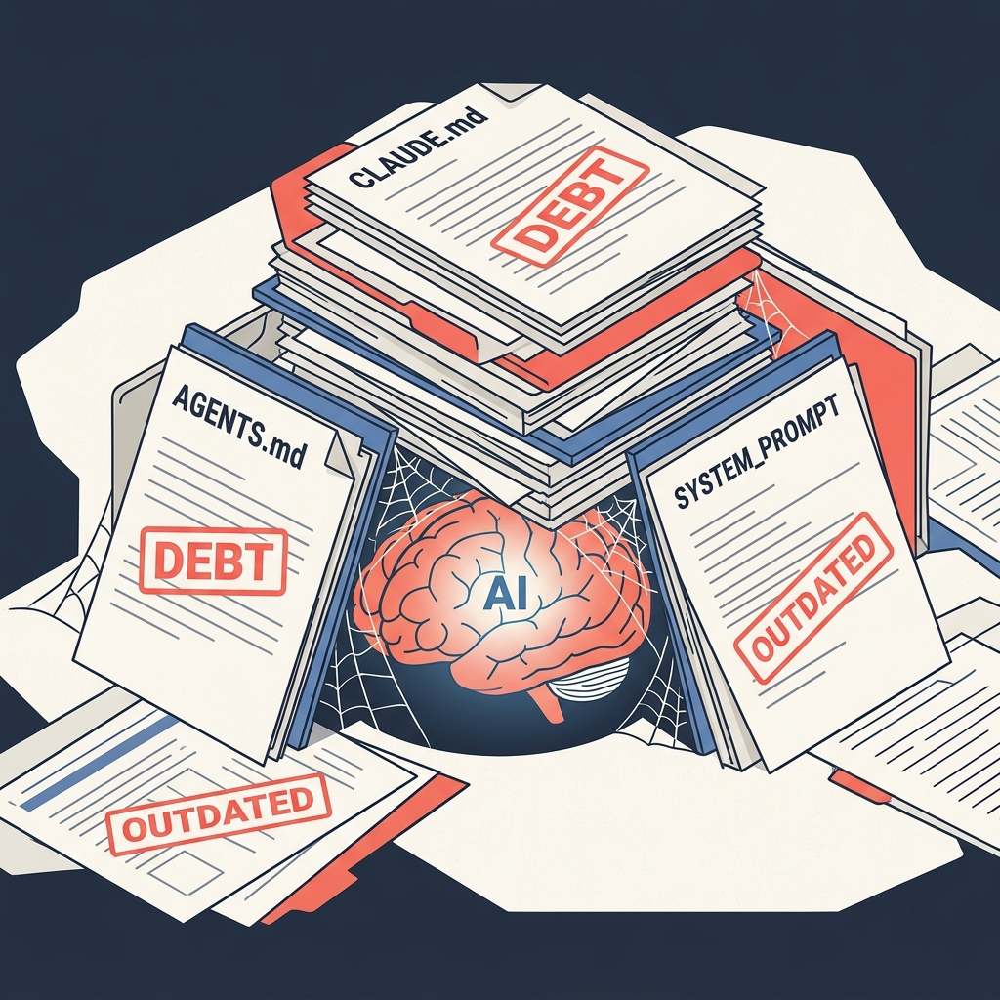
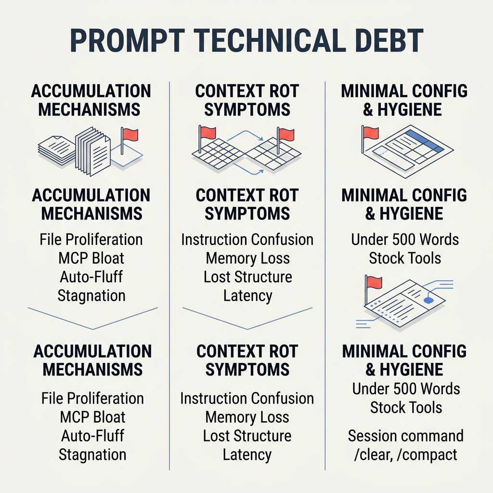
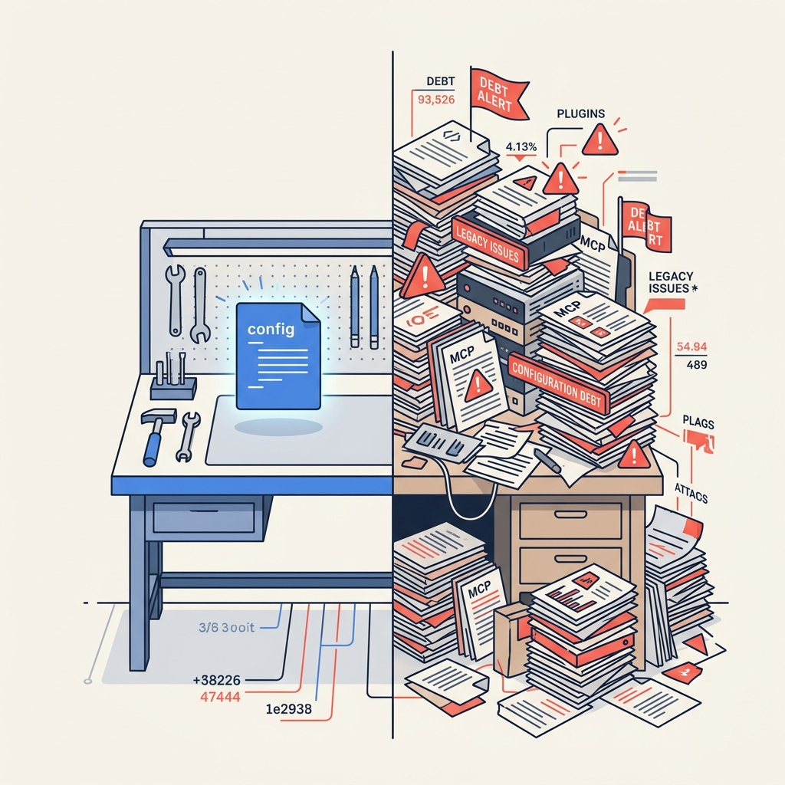

<!-- _class: title -->

# Prompt Technical Debt

Why complex system prompts make AI dumber — and how to fix it

<!-- Speaker: Prompt debt is the hidden tax on every AI-assisted project. Today: what it is, how it accumulates, and the minimal-config practices that prevent it. -->

---

<!-- _class: cheatsheet -->
<!-- _backgroundColor: #f8f7f4 -->

<!-- Speaker: Orientation: 4 accumulation mechanisms, context rot symptoms, minimal-config playbook, session hygiene commands. -->

---

## Prompt Debt: Silent Decay

Prompt debt ไม่ throw error — มันแค่ทำให้ AI โง่ลงเงียบๆ ทุกครั้งที่ model upgrade

<svg viewBox="0 0 1100 360" width="100%" xmlns="http://www.w3.org/2000/svg">
  <rect x="40" y="30" width="1020" height="290" rx="16" fill="var(--paper)" stroke="var(--soft-2)" stroke-width="1.5" style="filter:drop-shadow(0 4px 12px rgba(15,23,42,.08))"/>
  <rect x="40" y="30" width="8" height="290" rx="4" fill="var(--danger)"/>
  <circle cx="128" cy="175" r="48" fill="var(--danger)" opacity=".1"/>
  <circle cx="128" cy="175" r="34" fill="var(--danger)" opacity=".2"/>
  <text x="128" y="182" font-size="30" fill="var(--danger)" text-anchor="middle" font-family="system-ui" font-weight="800">!</text>
  <text x="210" y="110" font-size="21" font-weight="700" fill="var(--ink)" font-family="system-ui">Silent Decay</text>
  <text x="210" y="145" font-size="15" fill="var(--ink-dim)" font-family="system-ui">Code debt: loud failures (errors, slowdowns, stack traces)</text>
  <text x="210" y="175" font-size="15" fill="var(--danger)" font-family="system-ui" font-weight="600">Prompt debt: silent failures — AI just gets dumber, no warning</text>
  <text x="210" y="215" font-size="15" fill="var(--ink-dim)" font-family="system-ui">Every model upgrade can break a working prompt — with zero signal</text>
  <text x="210" y="245" font-size="14" fill="var(--muted)" font-family="system-ui">Files untouched for months still steer every AI session today</text>
  <rect x="870" y="70" width="150" height="38" rx="8" fill="var(--danger-wash)"/>
  <text x="945" y="94" font-size="12" font-weight="700" fill="var(--danger-ink)" text-anchor="middle" font-family="system-ui">CODE DEBT</text>
  <rect x="870" y="120" width="150" height="38" rx="8" fill="var(--warning-wash)"/>
  <text x="945" y="144" font-size="12" font-weight="700" fill="var(--warning-ink)" text-anchor="middle" font-family="system-ui">PROMPT DEBT</text>
  <text x="875" y="188" font-size="11" fill="var(--muted)" font-family="system-ui">Loud</text>
  <text x="985" y="188" font-size="11" fill="var(--muted)" text-anchor="end" font-family="system-ui">Silent</text>
  <line x1="875" y1="196" x2="1015" y2="196" stroke="var(--soft-2)" stroke-width="1"/>
  <line x1="875" y1="196" x2="875" y2="256" stroke="var(--danger)" stroke-width="2"/>
  <line x1="1015" y1="196" x2="1015" y2="256" stroke="var(--warning)" stroke-width="2"/>
  <rect x="0" y="310" width="1" height="1" fill="none"/>
</svg>

<b>★ Takeaway:</b> Prompt debt decays silently — you won't know it's hurting until significant AI quality degradation has already accumulated.

<!-- Speaker: Sean Goedecke's key insight: code debt at least gives you errors. Prompt debt quietly degrades AI quality with no signal. -->

---

## Why This Matters Now

Modern AI projects stack multiple prompt layers — most written for older models and never revisited.

<svg viewBox="0 0 700 300" width="100%" xmlns="http://www.w3.org/2000/svg">
  <defs><marker id="arr" markerWidth="8" markerHeight="8" refX="6" refY="4" orient="auto"><path d="M0,0 L8,4 L0,8 Z" fill="var(--danger)"/></marker></defs>
  <rect x="20" y="222" width="280" height="34" rx="6" fill="var(--soft-2)" stroke="var(--muted)" stroke-width="1.5"/>
  <text x="160" y="244" font-size="12" fill="var(--ink-dim)" text-anchor="middle" font-family="system-ui" font-weight="600">system_prompt_v3.txt</text>
  <rect x="20" y="182" width="280" height="34" rx="6" fill="var(--soft)" stroke="var(--muted)" stroke-width="1.5"/>
  <text x="160" y="204" font-size="12" fill="var(--ink-dim)" text-anchor="middle" font-family="system-ui" font-weight="600">CLAUDE.md</text>
  <rect x="20" y="142" width="280" height="34" rx="6" fill="var(--paper)" stroke="var(--accent)" stroke-width="1.5"/>
  <text x="160" y="164" font-size="12" fill="var(--accent)" text-anchor="middle" font-family="system-ui" font-weight="600">AGENTS.md</text>
  <rect x="20" y="102" width="280" height="34" rx="6" fill="var(--paper)" stroke="var(--warning)" stroke-width="1.5"/>
  <text x="160" y="124" font-size="12" fill="var(--warning-ink)" text-anchor="middle" font-family="system-ui" font-weight="600">skills/*.md (x12)</text>
  <rect x="20" y="62" width="280" height="34" rx="6" fill="var(--danger-wash)" stroke="var(--danger)" stroke-width="2"/>
  <text x="160" y="84" font-size="12" fill="var(--danger-ink)" text-anchor="middle" font-family="system-ui" font-weight="600">MCP server descriptions</text>
  <text x="160" y="292" font-size="11" fill="var(--muted)" text-anchor="middle" font-family="system-ui">Last updated: 2 months ago</text>
  <line x1="310" y1="142" x2="370" y2="142" stroke="var(--danger)" stroke-width="2" marker-end="url(#arr)"/>
  <rect x="380" y="102" width="280" height="96" rx="10" fill="var(--danger-wash)" stroke="var(--danger)" stroke-width="2"/>
  <text x="520" y="140" font-size="14" font-weight="700" fill="var(--danger-ink)" text-anchor="middle" font-family="system-ui">Context Bloat</text>
  <text x="520" y="164" font-size="12" fill="var(--danger-ink)" text-anchor="middle" font-family="system-ui">Tokens consumed before</text>
  <text x="520" y="184" font-size="12" fill="var(--danger-ink)" text-anchor="middle" font-family="system-ui">any real work begins</text>
  <rect x="0" y="298" width="1" height="1" fill="none"/>
</svg>

<b>★ Takeaway:</b> Real example: T3 Chat AGENTS.md still said "this is an early WIP" and "Codex-first" — both false, both still steering every AI session.

<!-- Speaker: The file is stable. The world changed around it. Model v3 came out; file still thinks you're on v1 with early-WIP assumptions. -->

---

## Prompt Debt vs Code Debt

Prompt debt แย่กว่า code debt ในทุก 3 มิติ — เงียบ, ไม่เสถียร, และมองไม่เห็น

  

    
Dimension 1

    <h3>Failure Mode</h3>
    
<b style="color:var(--success)">Code Debt:</b> Loud — errors, slowdowns, visible stack traces. You know when it breaks.

    
<b style="color:var(--danger)">Prompt Debt:</b> Silent — AI just works worse. No alert, no log entry, no CI failure.

  

  

    
Dimension 2

    <h3>Stability</h3>
    
<b style="color:var(--success)">Code Debt:</b> Stable when untouched — code doesn't rot on its own without a change.

    
<b style="color:var(--danger)">Prompt Debt:</b> Every model upgrade can silently break working prompts.

  

  

    
Dimension 3

    <h3>Detection</h3>
    
<b style="color:var(--success)">Code Debt:</b> Stack traces, CI failures, type errors, linters — automatic detection.

    
<b style="color:var(--danger)">Prompt Debt:</b> Only observable through behavioral changes — requires human judgment.

  

<b>★ Takeaway:</b> Prompt debt is worse in every dimension — no automatic detection means it compounds unseen until someone notices the AI "got weird."

<!-- Speaker: The asymmetry is the key insight: code debt at least fails loudly. You can't set up a CI check for "AI started giving vague answers." -->

---

## 4 กลไกที่ Prompt Debt สะสม

แต่ละกลไกเพิ่ม hidden context overhead ที่กิน token ก่อนงานจริงจะเริ่ม

  

    
Mechanism 1

    <h3>File Proliferation</h3>
    
AGENTS.md + CLAUDE.md + subdirectory files + skills + tool prompts + dynamic system prompts — each layer adds context overhead and potential staleness. ทุกชั้นเพิ่ม debt โดยอัตโนมัติ

  

  

    
Mechanism 2

    <h3>Plugin &amp; MCP Bloat</h3>
    
ทุก MCP server หรือ plugin ที่ install คือ prompt ที่ inject เข้า context อัตโนมัติ ครึ่งหนึ่งของ context window หมดไปก่อน agent จะเริ่มทำงานจริง

  

  

    
Mechanism 3

    <h3>Auto-generated Fluff</h3>
    
AI-generated config files ที่ developer copy-paste เข้า CLAUDE.md โดยไม่อ่าน — สร้างหนี้ตั้งแต่วันแรกโดยไม่รู้ตัว เต็มไปด้วย instructions ที่ไม่มีใครต้องการ

  

  

    
Mechanism 4

    <h3>Stagnation</h3>
    
T3 Chat AGENTS.md: ไม่ได้อัปเดต 2 เดือน ยังบอก "early WIP" และ "Codex-first" — ทั้งสองเท็จ แต่ยังคง steer model ทุกวัน

  

<b>★ Takeaway:</b> Prompt debt accumulates passively — you don't have to make a mistake; just stop maintaining your config files for 2 months.

<!-- Speaker: Stagnation is the sneakiest. The file is "stable" but the world changed around it. Model upgraded; file still has old assumptions. -->

---

## Legacy Steering Hurts New Models

Prompts written for old models can actively restrict newer, more capable ones

  

    
Legacy Trick (GPT-3 era)

    <h3>"Think step by step"</h3>
    
Model รุ่นใหม่มี built-in chain-of-thought อยู่แล้ว การบอกซ้ำอาจ interrupt หรือ override กระบวนการคิดที่ model ทำได้ดีกว่าเองอยู่แล้ว

  

  

    
Outdated Pattern

    <h3>"You are a senior engineer"</h3>
    
Persona injection จำเป็นสำหรับ early models Model ใหม่ไม่ต้องการ role-priming — instruction นี้แค่ waste tokens และจำกัดความยืดหยุ่นของ model

  

  

    
Psychological Hack

    <h3>"I'll tip you $200"</h3>
    
Worked as a hack on GPT-3. Has zero effect on modern models. Pure context overhead — แถมยังทำให้ prompt ดูไม่ professional อีกด้วย

  

<b>★ Takeaway:</b> Every model upgrade means legacy steering is either useless (wasting tokens) or harmful (overriding the model's better defaults).

<!-- Speaker: These were good advice once. The problem: they outlived their usefulness. Model improved, prompt didn't get deleted. -->

---

## Context Rot: อาการที่สังเกตได้

When context fills with stale instructions, model attention fragments and quality collapses

  

    
Symptom 1

    <h3>Revisits Rejected Ideas</h3>
    
AI นำ approach หรือ library ที่คุณ reject ไปแล้วกลับมาเสนออีกครั้ง — context รุ่นเก่าถูกดึงมาใช้แทน instruction ปัจจุบัน

  

  

    
Symptom 2

    <h3>Vague &amp; Hedged Answers</h3>
    
คำตอบกลายเป็น "it depends", "you might consider" แทนที่จะตรงประเด็น — useful signal กลมกลืนกับ noise ที่สะสม

  

  

    
Symptom 3

    <h3>Self-Contradiction</h3>
    
AI ขัดแย้งกับสิ่งที่ตัวเองพูดหรือ decide ไปก่อนหน้าในช่วงการสนทนาเดียวกัน — context ของ earlier decision หายไปแล้ว

  

  

    
Symptom 4

    <h3>Bug Resurrection</h3>
    
Bug ที่เพิ่งแก้กลับมาอีกครั้ง — context window สมัยที่ bug ยังอยู่ถูกดึงมาใช้มากกว่า fix ที่ทำไปล่าสุด

  

<b>★ Takeaway:</b> Context rot symptoms look like AI stupidity — but it's an engineering problem: signal-to-noise failure from accumulated junk in the context window.

<!-- Speaker: Most developers blame the model. Context rot is fixable. Clean context = smart AI. Same model, better results. -->

---

## Minimal Config: ใช้ Stock ให้มากที่สุด

The best system prompt is maintained by a full engineering team — not you alone.

<svg viewBox="0 0 700 300" width="100%" xmlns="http://www.w3.org/2000/svg">
  <defs><marker id="arr2" markerWidth="8" markerHeight="8" refX="6" refY="4" orient="auto"><path d="M0,0 L8,4 L0,8 Z" fill="var(--danger)"/></marker><marker id="arr3" markerWidth="8" markerHeight="8" refX="6" refY="4" orient="auto"><path d="M0,0 L8,4 L0,8 Z" fill="var(--success)"/></marker></defs>
  <rect x="10" y="20" width="310" height="256" rx="12" fill="var(--danger-wash)" stroke="var(--danger)" stroke-width="1.5"/>
  <text x="165" y="50" font-size="13" font-weight="700" fill="var(--danger-ink)" text-anchor="middle" font-family="system-ui">Custom Override</text>
  <text x="165" y="82" font-size="12" fill="var(--danger-ink)" text-anchor="middle" font-family="system-ui">Tune prompts for Model v1</text>
  <line x1="165" y1="94" x2="165" y2="114" stroke="var(--danger)" stroke-width="1.5" marker-end="url(#arr2)"/>
  <text x="165" y="132" font-size="12" fill="var(--danger-ink)" text-anchor="middle" font-family="system-ui">Model v2 ships</text>
  <line x1="165" y1="144" x2="165" y2="164" stroke="var(--danger)" stroke-width="1.5" marker-end="url(#arr2)"/>
  <text x="165" y="182" font-size="12" fill="var(--danger-ink)" text-anchor="middle" font-family="system-ui">Your overrides fight v2 defaults</text>
  <text x="165" y="226" font-size="13" font-weight="700" fill="var(--danger)" text-anchor="middle" font-family="system-ui">AI gets dumber over time</text>
  <circle cx="350" cy="148" r="24" fill="var(--accent)"/>
  <text x="350" y="153" font-size="13" font-weight="700" fill="var(--paper)" text-anchor="middle" dominant-baseline="central" font-family="system-ui">VS</text>
  <rect x="380" y="20" width="310" height="256" rx="12" fill="var(--success-wash)" stroke="var(--success)" stroke-width="1.5"/>
  <text x="535" y="50" font-size="13" font-weight="700" fill="var(--success-ink)" text-anchor="middle" font-family="system-ui">Stock / Minimal</text>
  <text x="535" y="82" font-size="12" fill="var(--success-ink)" text-anchor="middle" font-family="system-ui">Tool ships with v1 tuning</text>
  <line x1="535" y1="94" x2="535" y2="114" stroke="var(--success)" stroke-width="1.5" marker-end="url(#arr3)"/>
  <text x="535" y="132" font-size="12" fill="var(--success-ink)" text-anchor="middle" font-family="system-ui">v2 ships — tool team re-tunes</text>
  <line x1="535" y1="144" x2="535" y2="164" stroke="var(--success)" stroke-width="1.5" marker-end="url(#arr3)"/>
  <text x="535" y="182" font-size="12" fill="var(--success-ink)" text-anchor="middle" font-family="system-ui">You get improvements for free</text>
  <text x="535" y="226" font-size="13" font-weight="700" fill="var(--success)" text-anchor="middle" font-family="system-ui">AI gets smarter over time</text>
  <rect x="0" y="298" width="1" height="1" fill="none"/>
</svg>

<b>★ Takeaway:</b> Cursor, Copilot, Claude Code teams benchmark prompts for every model release. Overriding their defaults means fighting work already done for you.

<!-- Speaker: The key mental shift. The moment you override tool defaults, you've taken on the prompt-maintenance burden that a full team was handling for you. -->

---

## เขียน CLAUDE.md แบบ Lean

Treat it as a contractor onboarding doc — only what they can't infer from reading the codebase

  

    
Include — Factual

    <h3>What AI Cannot Know</h3>
    
Project purpose, tech stack, non-standard file structure, forbidden patterns specific to your codebase.

    
<b>Target: under 500 words total</b>

  

  

    
Remove — Behavioral

    <h3>What AI Already Knows</h3>
    
Persona injections, step-by-step reasoning prompts, psychological tricks, generic "be careful" instructions — anything written for GPT-3 era.

  

  

    
The Acid Test

    <h3>Delete &amp; Observe</h3>
    
ถามตัวเองว่า "ถ้าลบบรรทัดนี้ทิ้ง AI จะทำงานได้แย่ลงจริงไหม?" ถ้าไม่แน่ใจ — ลบ แล้วสังเกต 1 สัปดาห์ Add back เฉพาะสิ่งที่พิสูจน์ได้

  

<b>★ Takeaway:</b> Every token in CLAUDE.md is consumed before any real work begins — the 500-word limit forces you to keep only facts the AI genuinely can't infer.

<!-- Speaker: The 500-word target is the threshold where every instruction fits in working memory. Above that: you have a brain dump, not an onboarding doc. -->

---

## Session Hygiene: Reset Context Rot

3 คำสั่งที่ป้องกัน context rot ระหว่าง session — ต้นทุนต่ำ ผลลัพธ์สูง

  

    
Command 1

    <h3><code>/clear</code></h3>
    
Wipes entire conversation history. Use before switching to an unrelated task — prevents debug context from bleeding into new work.

    
<b>Before /clear:</b> Write 1 sentence: current goal + where you left off.

  

  

    
Command 2

    <h3><code>/compact</code></h3>
    
AI summarizes conversation into token-efficient digest. Use for long productive sessions — continue working without losing progress.

    
<b>Result:</b> Verbose history replaced with compressed summary.

  

  

    
Habit

    <h3>Pre-summarize</h3>
    
Before /clear: "Working on auth flow, fixed JWT refresh bug, next: rate limiting." Paste as first message in new session.

    
<b>Cost:</b> 30 seconds. <b>Benefit:</b> AI starts with full context.

  

<b>★ Takeaway:</b> /clear + pre-summarize costs 30 seconds and prevents hours of degraded AI quality — cheapest anti-debt tool available.

<!-- Speaker: Most developers never /clear. They work in one session all day, wonder why AI got weird by afternoon. Context rot, not model failure. -->

---

## Key Takeaways

Prompt debt is manageable — once you know what to look for

  

    
The Core Problem

    <h3>Silent Decay</h3>
    
Prompt debt fails without errors. Every model upgrade silently degrades configs written for older models — no alert, no stack trace, no CI failure.

  

  

    
The Hidden Source

    <h3>Plugin &amp; File Bloat</h3>
    
MCP servers, skills, and unused plugins consume context before work begins. Installed-but-unused = hidden tax on every session.

  

  

    
The Fix

    <h3>Stay Stock, Stay Lean</h3>
    
Trust the tool team's system prompts. Keep CLAUDE.md under 500 words. Include only what AI can't infer from the codebase itself.

  

  

    
The Habit

    <h3>Audit + /clear + /compact</h3>
    
Regular prompt audit (delete and observe), /clear between tasks, /compact for long sessions — the 3-command anti-debt toolkit.

  

<b>★ Takeaway:</b> The acid test for every instruction: "Will AI actually work worse if I delete this?" Delete everything you're not sure about — add back only what you can prove.

<!-- Speaker: That question is the key. Most instructions fail it. Delete liberally, add back conservatively — prompt debt fights back only through your attachment to old instructions. -->
