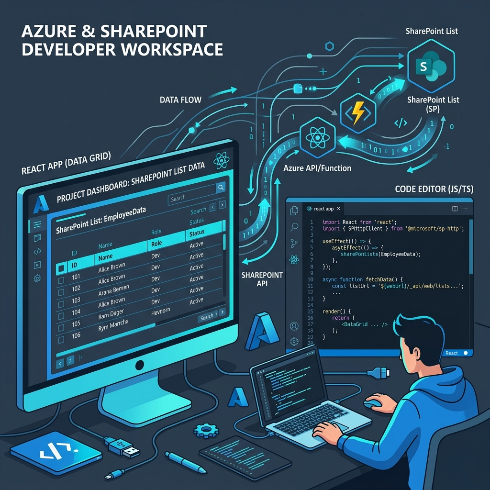
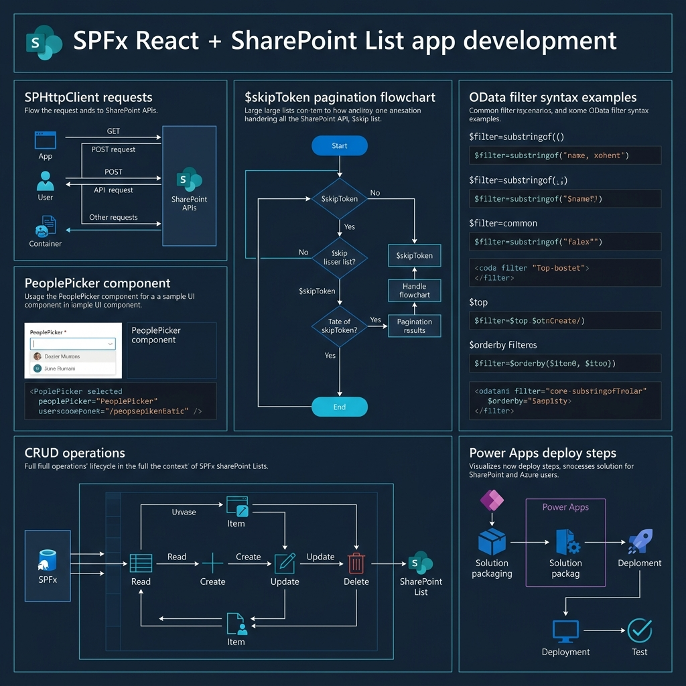
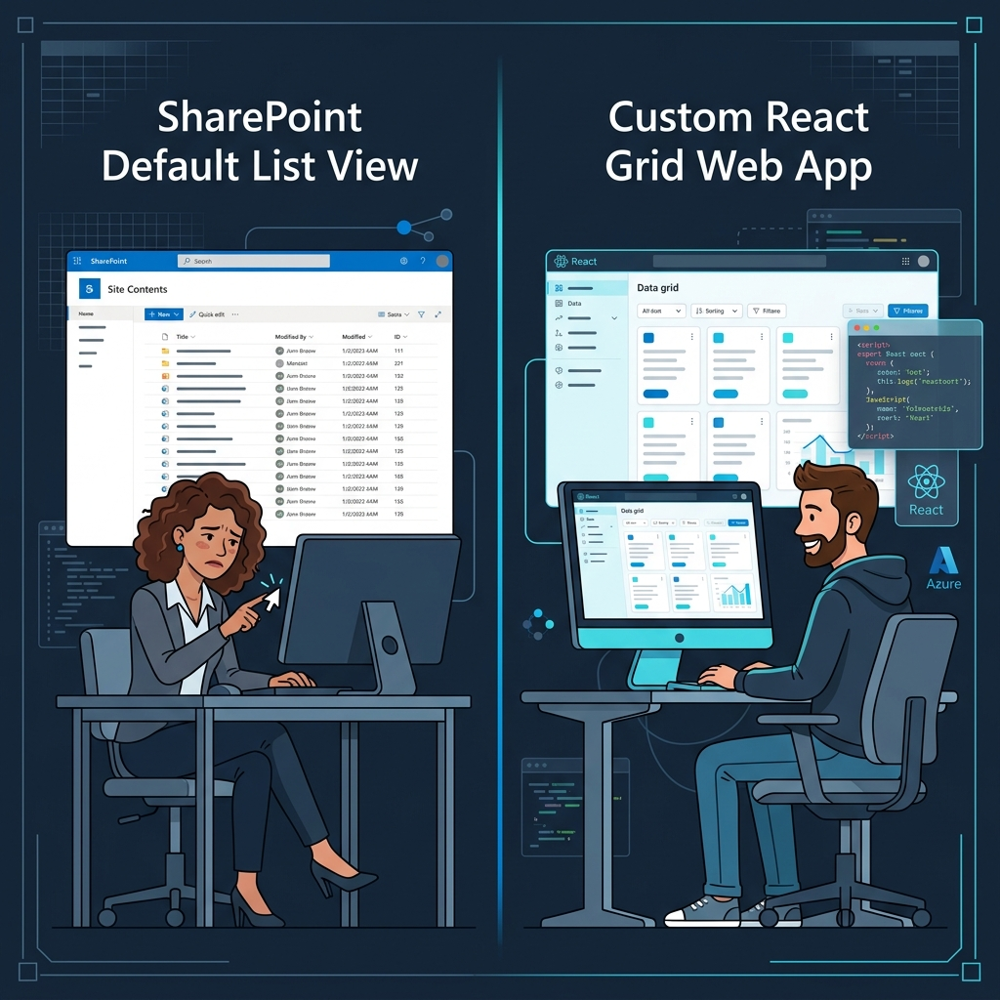
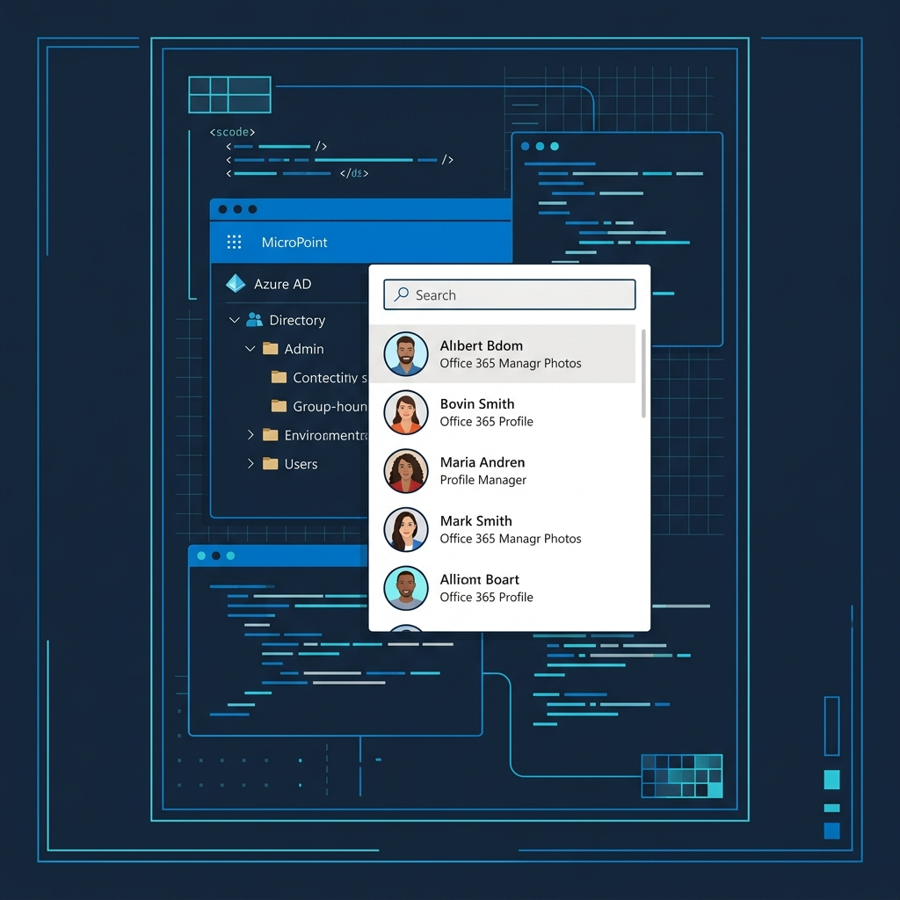

<!-- _class: title -->

# สร้าง React Code App เชื่อม SharePoint List 10,000 แถว

Server-side Pagination · CRUD · People Picker · Claude Code · Power Apps Deploy

<!-- Speaker: SPFx React webpart connects to large SharePoint List with server-side pagination, filtering, People Picker from Office 365, and deploys to Power Apps. -->

---

<!-- _class: cheatsheet -->
<!-- _backgroundColor: #f8f7f4 -->

<!-- Speaker: Full-deck cheatsheet — SPHttpClient REST calls, $skipToken pagination flow, OData filter syntax, PeoplePicker component, CRUD HTTP methods, and Power Apps deploy pipeline. -->

---

## TL;DR: React + SharePoint List ทำอะไรได้บ้าง?

SPFx Web Part ให้ UI ยืดหยุ่นเต็มรูปแบบบน SharePoint data — ไม่ใช่แค่ Default View

  

    
Pagination

    <h3>Server-side $skipToken</h3>
    
ดึงข้อมูล 100 แถว/หน้า ผ่าน <code>odata.nextLink</code> — ไม่โหลดทั้ง 10,000 แถวพร้อมกัน

  

  

    
Filter & Sort

    <h3>OData Server-side</h3>
    
กรองและเรียงข้อมูลบน server ด้วย <code>$filter</code>, <code>$orderby</code> ก่อน return

  

  

    
People Picker

    <h3>Office 365 Users + Photo</h3>
    
เลือกผู้ใช้จาก Azure AD พร้อมรูปโปรไฟล์ผ่าน Graph API

  

  

    
Full CRUD

    <h3>Create · Update · Delete</h3>
    
จัดการข้อมูลครบวงจร + deploy ขึ้น Power Apps ให้ทั้งองค์กรใช้

  

<b>★ Takeaway:</b> SPFx = React app ที่วิ่งใน SharePoint context — Auth + API จัดการให้ครบ ไม่ต้องเขียน login เอง

<!-- Speaker: Four capabilities in one package. The key advantage over Canvas Apps is full React flexibility with Fluent UI components. -->

---

## ปัญหา: Default List View ไม่เพียงพอ

เมื่อข้อมูลเกิน 5,000 แถวและ UI ต้องการ Branding หรือ Custom Logic — Default View พ่าย

  

    
Default List View

    <h3>ข้อจำกัด</h3>
    
5,000 row threshold crash, ไม่รองรับ custom validation, UI ไม่ตรง Branding

  

  

    
React Code App (SPFx)

    <h3>ทางออก</h3>
    
Server-side filter ผ่าน indexed columns, Fluent UI ตาม Branding, CRUD + People Picker

  

<b>★ Takeaway:</b> ถ้า List เกิน 5,000 แถวหรือต้องการ custom UI — SPFx React webpart คือคำตอบ ไม่ใช่ Power Automate

<!-- Speaker: Default view has a hard 5000-item threshold. Code apps bypass this by using server-side $filter on indexed columns. -->

---

## SPFx Setup 2026: Stack ใหม่ไม่ใช้ Gulp

SPFx v1.23 + Node 22 LTS + @microsoft/spfx-cli — Yeoman และ Gulp ถูก replace แล้ว

<svg viewBox="0 0 1100 340" width="100%" xmlns="http://www.w3.org/2000/svg">
  <!-- arrow-flow: 4 steps -->
  <defs>
    <marker id="arr" markerWidth="8" markerHeight="8" refX="6" refY="3" orient="auto">
      <path d="M0,0 L0,6 L8,3 z" fill="var(--accent)"/>
    </marker>
  </defs>
  <!-- Step boxes -->
  <rect x="30" y="100" width="200" height="120" rx="12" fill="var(--paper)" stroke="var(--soft-2)" stroke-width="1.5" style="filter:drop-shadow(var(--shadow-sm))"/>
  <rect x="30" y="100" width="200" height="36" rx="12" fill="var(--accent)" opacity=".1"/>
  <text x="130" y="124" font-size="13" font-weight="700" fill="var(--accent)" text-anchor="middle" font-family="system-ui">1. Node 22 LTS</text>
  <text x="130" y="152" font-size="12" fill="var(--ink-dim)" text-anchor="middle" font-family="system-ui">nvm install 22</text>
  <text x="130" y="172" font-size="12" fill="var(--muted)" text-anchor="middle" font-family="system-ui">nvm use 22</text>

  <rect x="288" y="100" width="200" height="120" rx="12" fill="var(--paper)" stroke="var(--soft-2)" stroke-width="1.5" style="filter:drop-shadow(var(--shadow-sm))"/>
  <rect x="288" y="100" width="200" height="36" rx="12" fill="var(--accent)" opacity=".1"/>
  <text x="388" y="124" font-size="13" font-weight="700" fill="var(--accent)" text-anchor="middle" font-family="system-ui">2. SPFx CLI</text>
  <text x="388" y="152" font-size="11" fill="var(--ink-dim)" text-anchor="middle" font-family="system-ui">npm install</text>
  <text x="388" y="170" font-size="11" fill="var(--ink-dim)" text-anchor="middle" font-family="system-ui">@microsoft/spfx-cli</text>
  <text x="388" y="188" font-size="11" fill="var(--muted)" text-anchor="middle" font-family="system-ui">--global</text>

  <rect x="546" y="100" width="200" height="120" rx="12" fill="var(--paper)" stroke="var(--soft-2)" stroke-width="1.5" style="filter:drop-shadow(var(--shadow-sm))"/>
  <rect x="546" y="100" width="200" height="36" rx="12" fill="var(--accent)" opacity=".1"/>
  <text x="646" y="124" font-size="13" font-weight="700" fill="var(--accent)" text-anchor="middle" font-family="system-ui">3. Scaffold Project</text>
  <text x="646" y="152" font-size="11" fill="var(--ink-dim)" text-anchor="middle" font-family="system-ui">spfx new --name app</text>
  <text x="646" y="172" font-size="11" fill="var(--ink-dim)" text-anchor="middle" font-family="system-ui">--type webpart</text>
  <text x="646" y="192" font-size="11" fill="var(--muted)" text-anchor="middle" font-family="system-ui">--framework react</text>

  <rect x="804" y="100" width="260" height="120" rx="12" fill="var(--paper)" stroke="var(--accent)" stroke-width="2" style="filter:drop-shadow(var(--shadow-md))"/>
  <rect x="804" y="100" width="260" height="36" rx="12" fill="var(--accent)" opacity=".12"/>
  <text x="934" y="124" font-size="13" font-weight="700" fill="var(--accent)" text-anchor="middle" font-family="system-ui">4. VS Code + Extensions</text>
  <text x="934" y="152" font-size="11" fill="var(--ink)" text-anchor="middle" font-family="system-ui">SPFx Toolkit (pnp.vscode-viva)</text>
  <text x="934" y="172" font-size="11" fill="var(--ink-dim)" text-anchor="middle" font-family="system-ui">ESLint + Claude Code</text>
  <text x="934" y="192" font-size="11" fill="var(--muted)" text-anchor="middle" font-family="system-ui">Debug Toolbar (Workbench deprecated)</text>

  <!-- arrows -->
  <line x1="232" y1="160" x2="283" y2="160" stroke="var(--accent)" stroke-width="2" marker-end="url(#arr)"/>
  <line x1="490" y1="160" x2="541" y2="160" stroke="var(--accent)" stroke-width="2" marker-end="url(#arr)"/>
  <line x1="748" y1="160" x2="799" y2="160" stroke="var(--accent)" stroke-width="2" marker-end="url(#arr)"/>

  <!-- warning badge -->
  <rect x="30" y="250" width="640" height="34" rx="8" fill="var(--warning-wash)" stroke="var(--warning)" stroke-width="1"/>
  <text x="50" y="272" font-size="12" fill="var(--warning-ink)" font-family="system-ui" font-weight="600">WARNING:</text>
  <text x="130" y="272" font-size="12" fill="var(--warning-ink)" font-family="system-ui">Online Workbench retires Dec 1 2026 — use SharePoint Debug Toolbar now</text>
  <rect x="683" y="0" width="1" height="1" fill="none"/>
</svg>

<b>★ Takeaway:</b> `spfx new` (ไม่ใช่ `yo @microsoft/sharepoint`) + Node 22 LTS คือ starting point ที่ถูกต้องในปี 2026

<!-- Speaker: Yeoman and Gulp are gone. The new @microsoft/spfx-cli uses Heft build system. SPFx Toolkit extension in VS Code handles scaffolding and deploy from a single sidebar. -->

---

## SPHttpClient: เชื่อม SharePoint REST API ไม่ต้องจัดการ Auth เอง

SPFx inject <code>this.context.spHttpClient</code> ให้ทุก webpart — GET List Items ได้เลย

  

    
React Component

    <h3>getListPage()</h3>
    
<code>spHttpClient, siteUrl, listName, 100, nextLink, filter, orderBy</code>

  

  

    
&#x2192;

    
HTTP GET

  

  

    
SPHttpClient (Auto Auth)

    <h3>REST Endpoint</h3>
    
<code>_api/web/lists/getbytitle('...')/items</code> <code>$top=100 &amp; $orderby=Modified desc</code> <code>$filter=Status eq 'Active'</code>

  

  

    
&#x2192;

    
REST call

  

  

    
SharePoint Response

    <h3>JSON Payload</h3>
    
<code>"value": [ ...100 items... ]</code>

    
<code>"odata.nextLink": "...skipToken..."</code>

    
nextLink = key to page 2

  

<b>★ Takeaway:</b> `odata.nextLink` ใน response คือ URL ของหน้าถัดไป — เก็บไว้ใช้ตอนกด "ถัดไป" ไม่ต้อง build URL เอง

<!-- Speaker: SPHttpClient handles Bearer token injection automatically. The response always contains odata.nextLink when more items exist. -->

---

## $skipToken vs $skip: ข้อผิดพลาดที่พบบ่อยที่สุด

SharePoint List Items ไม่รองรับ <code>$skip</code> — ต้องใช้ <code>odata.nextLink</code> จาก response เท่านั้น

<svg viewBox="0 0 1100 300" width="100%" xmlns="http://www.w3.org/2000/svg">
  <!-- comparison-2col: $skip (WRONG) vs $skipToken (RIGHT) -->
  <rect x="40" y="20" width="480" height="260" rx="12" fill="var(--danger-wash)" stroke="var(--danger)" stroke-width="2"/>
  <rect x="40" y="20" width="480" height="52" rx="12" fill="var(--danger)" opacity=".15"/>
  <text x="280" y="52" font-size="16" font-weight="700" fill="var(--danger-ink)" text-anchor="middle" font-family="system-ui">$skip=N (WRONG for List Items)</text>
  <text x="70" y="98" font-size="13" fill="var(--danger-ink)" font-family="system-ui" font-weight="600">Result: Error or wrong data</text>
  <text x="70" y="124" font-size="12" fill="var(--ink-dim)" font-family="system-ui">/items?$top=100&amp;$skip=100</text>
  <text x="70" y="150" font-size="12" fill="var(--ink-dim)" font-family="system-ui">SharePoint ignores $skip on list items</text>
  <text x="70" y="176" font-size="12" fill="var(--ink-dim)" font-family="system-ui">Returns page 1 again or HTTP 500</text>
  <text x="70" y="208" font-size="11" fill="var(--muted)" font-family="system-ui">Standard OData feature NOT supported</text>
  <text x="70" y="228" font-size="11" fill="var(--muted)" font-family="system-ui">in SharePoint List REST endpoint</text>

  <!-- VS badge -->
  <circle cx="550" cy="150" r="30" fill="var(--accent)"/>
  <text x="550" y="155" font-size="14" font-weight="700" fill="white" text-anchor="middle" dominant-baseline="central" font-family="system-ui">VS</text>

  <rect x="580" y="20" width="480" height="260" rx="12" fill="var(--success-wash)" stroke="var(--success)" stroke-width="2" style="filter:drop-shadow(var(--shadow-md))"/>
  <rect x="580" y="20" width="480" height="52" rx="12" fill="var(--success)" opacity=".15"/>
  <text x="820" y="52" font-size="16" font-weight="700" fill="var(--success-ink)" text-anchor="middle" font-family="system-ui">odata.nextLink (CORRECT)</text>
  <text x="610" y="98" font-size="13" fill="var(--success-ink)" font-family="system-ui" font-weight="600">Returns correct page 2+</text>
  <text x="610" y="124" font-size="12" fill="var(--ink)" font-family="system-ui">Use URL from response.odata.nextLink</text>
  <text x="610" y="150" font-size="12" fill="var(--ink-dim)" font-family="system-ui">Contains $skipToken generated by server</text>
  <text x="610" y="176" font-size="12" fill="var(--ink-dim)" font-family="system-ui">Guaranteed to return next 100 rows</text>
  <text x="610" y="208" font-size="11" fill="var(--success-ink)" font-family="system-ui" font-weight="600">Code: json['odata.nextLink'] ?? null</text>
  <text x="610" y="228" font-size="11" fill="var(--muted)" font-family="system-ui">Reuse directly — no URL construction</text>
  <rect x="1059" y="0" width="1" height="1" fill="none"/>
</svg>

<b>★ Takeaway:</b> ห้ามสร้าง <code>$skip=N</code> เอง — รับ <code>odata.nextLink</code> จาก response แล้วใช้ URL นั้นตรงๆ สำหรับหน้าถัดไป

<!-- Speaker: This is THE most common SharePoint pagination bug. OData standard allows $skip, but SharePoint list items endpoint does not. Always use the server-generated nextLink. -->

---

## Server-side Filter & Sort: OData Syntax สำหรับ SharePoint

กรองบน server — ไม่ดึงมาทั้งหมดแล้วกรองใน browser เพราะมี 10,000 แถว

<svg viewBox="0 0 1100 320" width="100%" xmlns="http://www.w3.org/2000/svg">
  <!-- 4 OData pattern boxes -->
  <rect x="30" y="20" width="240" height="120" rx="10" fill="var(--paper)" stroke="var(--accent)" stroke-width="1.5"/>
  <rect x="30" y="20" width="240" height="34" rx="10" fill="var(--accent)" opacity=".1"/>
  <text x="150" y="43" font-size="12" font-weight="700" fill="var(--accent)" text-anchor="middle" font-family="system-ui">Exact Match</text>
  <text x="150" y="72" font-size="11" fill="var(--ink)" text-anchor="middle" font-family="system-ui">$filter=Status eq 'Active'</text>
  <text x="150" y="96" font-size="11" fill="var(--muted)" text-anchor="middle" font-family="system-ui">eq / ne / lt / gt / le / ge</text>
  <text x="150" y="116" font-size="10" fill="var(--muted)" text-anchor="middle" font-family="system-ui">Standard OData comparison</text>

  <rect x="292" y="20" width="240" height="120" rx="10" fill="var(--paper)" stroke="var(--accent)" stroke-width="1.5"/>
  <rect x="292" y="20" width="240" height="34" rx="10" fill="var(--accent)" opacity=".1"/>
  <text x="412" y="43" font-size="12" font-weight="700" fill="var(--accent)" text-anchor="middle" font-family="system-ui">Search (contains)</text>
  <text x="412" y="72" font-size="11" fill="var(--ink)" text-anchor="middle" font-family="system-ui">substringof('kw',Title)</text>
  <text x="412" y="96" font-size="11" fill="var(--muted)" text-anchor="middle" font-family="system-ui">or startswith('kw',Title)</text>
  <text x="412" y="116" font-size="10" fill="var(--muted)" text-anchor="middle" font-family="system-ui">Case-insensitive on SP</text>

  <rect x="554" y="20" width="240" height="120" rx="10" fill="var(--paper)" stroke="var(--accent)" stroke-width="1.5"/>
  <rect x="554" y="20" width="240" height="34" rx="10" fill="var(--accent)" opacity=".1"/>
  <text x="674" y="43" font-size="12" font-weight="700" fill="var(--accent)" text-anchor="middle" font-family="system-ui">Date Range</text>
  <text x="674" y="68" font-size="10" fill="var(--ink)" text-anchor="middle" font-family="system-ui">$filter=Modified ge</text>
  <text x="674" y="86" font-size="10" fill="var(--ink)" text-anchor="middle" font-family="system-ui">  datetime'2026-01-01T00:00:00'</text>
  <text x="674" y="104" font-size="10" fill="var(--muted)" text-anchor="middle" font-family="system-ui">and Modified le datetime'...'</text>
  <text x="674" y="122" font-size="10" fill="var(--muted)" text-anchor="middle" font-family="system-ui">ISO 8601 format required</text>

  <rect x="816" y="20" width="240" height="120" rx="10" fill="var(--paper)" stroke="var(--accent)" stroke-width="1.5"/>
  <rect x="816" y="20" width="240" height="34" rx="10" fill="var(--accent)" opacity=".1"/>
  <text x="936" y="43" font-size="12" font-weight="700" fill="var(--accent)" text-anchor="middle" font-family="system-ui">Sort + Reset</text>
  <text x="936" y="72" font-size="11" fill="var(--ink)" text-anchor="middle" font-family="system-ui">$orderby=Modified desc</text>
  <text x="936" y="94" font-size="11" fill="var(--ink-dim)" text-anchor="middle" font-family="system-ui">column change = reset page</text>
  <text x="936" y="116" font-size="10" fill="var(--muted)" text-anchor="middle" font-family="system-ui">clear nextLink, fetch page 1</text>

  <!-- warning: index required -->
  <rect x="30" y="160" width="740" height="50" rx="8" fill="var(--danger-wash)" stroke="var(--danger)" stroke-width="1"/>
  <text x="50" y="180" font-size="12" fill="var(--danger-ink)" font-family="system-ui" font-weight="700">REQUIRED:</text>
  <text x="140" y="180" font-size="12" fill="var(--danger-ink)" font-family="system-ui">Index every column used in $filter — or SP returns HTTP 500 when list &gt; 5,000 rows</text>
  <text x="50" y="200" font-size="11" fill="var(--danger-ink)" font-family="system-ui">List Settings → Indexed Columns → Create a new index</text>

  <!-- tip: combine -->
  <rect x="790" y="160" width="266" height="50" rx="8" fill="var(--success-wash)" stroke="var(--success)" stroke-width="1"/>
  <text x="810" y="180" font-size="12" fill="var(--success-ink)" font-family="system-ui" font-weight="700">Combine:</text>
  <text x="810" y="200" font-size="11" fill="var(--success-ink)" font-family="system-ui">Status eq '...' and substringof(...)</text>
  <rect x="1055" y="0" width="1" height="1" fill="none"/>
</svg>

<b>★ Takeaway:</b> Index filter columns ก่อน deploy ไม่งั้น query บน 5,000+ แถวจะ crash — ทำก่อนเขียนโค้ด

<!-- Speaker: The $filter string gets encoded and passed to the REST endpoint. Sort change must reset pagination — old nextLink cursor is invalid for the new sort order. -->

---

## People Picker: เลือกผู้ใช้จาก Office 365

สองแนวทาง: PnP (ง่ายกว่า) vs Microsoft Graph Toolkit (flexible กว่า)

  

    
PnP Controls (แนะนำสำหรับ SPFx)

    <h3>@pnp/spfx-controls-react</h3>
    
<code>PeoplePicker</code> component ค้นหาผ่าน SharePoint Search — install: <code>npm i @pnp/spfx-controls-react</code>

  

  

    
Graph Toolkit (Flexible)

    <h3>@microsoft/mgt-react</h3>
    
Graph API โดยตรง — ต้องขอ <code>User.ReadBasic.All</code> consent จาก Azure AD Admin

  

  

    
Profile Photo

    <h3>Graph API blob</h3>
    
<code>graph.users.getById(login).photo.getBlob()</code> → <code>URL.createObjectURL(blob)</code>

  

  

    
Permission Required

    <h3>Azure AD Admin Consent</h3>
    
เพิ่มใน <code>package-solution.json</code> → <code>webApiPermissionRequests</code> ก่อน deploy

  

<b>★ Takeaway:</b> ถ้าไม่ต้องการ Graph ขั้นสูง ใช้ PnP PeoplePicker — ไม่ต้องขอ Graph consent แยก, ทำงานได้ทันทีใน SPFx context

<!-- Speaker: PnP PeoplePicker uses SharePoint Search under the hood — no Graph consent needed. Graph Toolkit is more powerful but requires admin consent for User.ReadBasic.All. -->

---

## CRUD Operations: HTTP Methods บน SharePoint REST

Create = POST, Update = POST + X-HTTP-Method: MERGE, Delete = POST + X-HTTP-Method: DELETE

<svg viewBox="0 0 1100 280" width="100%" xmlns="http://www.w3.org/2000/svg">
  <defs><marker id="a3" markerWidth="8" markerHeight="8" refX="6" refY="3" orient="auto"><path d="M0,0 L0,6 L8,3 z" fill="var(--muted)"/></marker></defs>
  <!-- CREATE -->
  <rect x="30" y="30" width="240" height="180" rx="12" fill="var(--success-wash)" stroke="var(--success)" stroke-width="1.5"/>
  <rect x="30" y="30" width="240" height="40" rx="12" fill="var(--success)" opacity=".2"/>
  <text x="150" y="56" font-size="14" font-weight="700" fill="var(--success-ink)" text-anchor="middle" font-family="system-ui">CREATE</text>
  <text x="150" y="90" font-size="11" fill="var(--ink)" text-anchor="middle" font-family="system-ui">POST /lists/items</text>
  <text x="150" y="114" font-size="11" fill="var(--ink-dim)" text-anchor="middle" font-family="system-ui">Content-Type:</text>
  <text x="150" y="132" font-size="10" fill="var(--muted)" text-anchor="middle" font-family="system-ui">application/json;odata=nometadata</text>
  <text x="150" y="158" font-size="11" fill="var(--ink-dim)" text-anchor="middle" font-family="system-ui">body: JSON.stringify(data)</text>
  <text x="150" y="196" font-size="10" fill="var(--success-ink)" text-anchor="middle" font-family="system-ui">Returns: 201 Created</text>

  <line x1="272" y1="120" x2="375" y2="120" stroke="var(--muted)" stroke-width="1.5" marker-end="url(#a3)"/>

  <!-- READ -->
  <rect x="378" y="30" width="240" height="180" rx="12" fill="var(--accent-wash)" stroke="var(--accent)" stroke-width="1.5"/>
  <rect x="378" y="30" width="240" height="40" rx="12" fill="var(--accent)" opacity=".15"/>
  <text x="498" y="56" font-size="14" font-weight="700" fill="var(--accent-deep)" text-anchor="middle" font-family="system-ui">READ (paginated)</text>
  <text x="498" y="90" font-size="11" fill="var(--ink)" text-anchor="middle" font-family="system-ui">GET /lists/items?$top=100</text>
  <text x="498" y="112" font-size="11" fill="var(--ink-dim)" text-anchor="middle" font-family="system-ui">&amp;$filter=...&amp;$orderby=...</text>
  <text x="498" y="140" font-size="11" fill="var(--accent)" font-weight="700" text-anchor="middle" font-family="system-ui">Response: odata.nextLink</text>
  <text x="498" y="162" font-size="11" fill="var(--ink-dim)" text-anchor="middle" font-family="system-ui">json['odata.nextLink'] ?? null</text>
  <text x="498" y="196" font-size="10" fill="var(--accent-deep)" text-anchor="middle" font-family="system-ui">Returns: 200 + value[]</text>

  <line x1="620" y1="120" x2="723" y2="120" stroke="var(--muted)" stroke-width="1.5" marker-end="url(#a3)"/>

  <!-- UPDATE -->
  <rect x="726" y="30" width="166" height="180" rx="12" fill="var(--warning-wash)" stroke="var(--warning)" stroke-width="1.5"/>
  <rect x="726" y="30" width="166" height="40" rx="12" fill="var(--warning)" opacity=".2"/>
  <text x="809" y="56" font-size="14" font-weight="700" fill="var(--warning-ink)" text-anchor="middle" font-family="system-ui">UPDATE</text>
  <text x="809" y="90" font-size="11" fill="var(--ink)" text-anchor="middle" font-family="system-ui">POST /items(id)</text>
  <text x="809" y="110" font-size="10" fill="var(--ink-dim)" text-anchor="middle" font-family="system-ui">IF-MATCH: *</text>
  <text x="809" y="130" font-size="10" fill="var(--warning-ink)" text-anchor="middle" font-family="system-ui">X-HTTP-Method: MERGE</text>
  <text x="809" y="158" font-size="10" fill="var(--muted)" text-anchor="middle" font-family="system-ui">body: changed fields only</text>
  <text x="809" y="196" font-size="10" fill="var(--warning-ink)" text-anchor="middle" font-family="system-ui">Returns: 204 No Content</text>

  <line x1="894" y1="120" x2="927" y2="120" stroke="var(--muted)" stroke-width="1.5" marker-end="url(#a3)"/>

  <!-- DELETE -->
  <rect x="930" y="30" width="140" height="180" rx="12" fill="var(--danger-wash)" stroke="var(--danger)" stroke-width="1.5"/>
  <rect x="930" y="30" width="140" height="40" rx="12" fill="var(--danger)" opacity=".2"/>
  <text x="1000" y="56" font-size="14" font-weight="700" fill="var(--danger-ink)" text-anchor="middle" font-family="system-ui">DELETE</text>
  <text x="1000" y="90" font-size="11" fill="var(--ink)" text-anchor="middle" font-family="system-ui">POST /items(id)</text>
  <text x="1000" y="110" font-size="10" fill="var(--ink-dim)" text-anchor="middle" font-family="system-ui">IF-MATCH: *</text>
  <text x="1000" y="130" font-size="10" fill="var(--danger-ink)" text-anchor="middle" font-family="system-ui">X-HTTP-Method: DELETE</text>
  <text x="1000" y="158" font-size="10" fill="var(--muted)" text-anchor="middle" font-family="system-ui">body: '' (empty)</text>
  <text x="1000" y="196" font-size="10" fill="var(--danger-ink)" text-anchor="middle" font-family="system-ui">Returns: 204 No Content</text>
  <rect x="1069" y="0" width="1" height="1" fill="none"/>
</svg>

<b>★ Takeaway:</b> UPDATE และ DELETE ใช้ POST + header `X-HTTP-Method` เพราะ proxy บางตัวในองค์กร block true PATCH/DELETE — นี่คือ SharePoint REST workaround มาตรฐาน

<!-- Speaker: SharePoint REST doesn't reliably support HTTP PATCH or DELETE through corporate proxies, hence the X-HTTP-Method override pattern. Always send IF-MATCH:* unless you need optimistic concurrency. -->

---

## Claude Code เร่ง SPFx Development: ทำอะไรได้ — และอะไรต้องตรวจเอง

Claude อ่าน codebase ทั้งโปรเจกต์ใน context — prompt สั้น ได้ code ที่ตรง pattern เลย

  

    
Claude ช่วยได้ดี

    <h3>Generate + Fix + Refactor</h3>
    
Boilerplate components, TypeScript/ESLint errors (paste error ตรงๆ), แยก logic เป็น custom hook, unit test สำหรับ service

  

  

    
ต้องตรวจสอบเอง

    <h3>SP Quirks + Permissions</h3>
    
Graph API consent scopes, <code>$skip</code> vs <code>$skipToken</code> quirks, List View Threshold กับ non-indexed columns

  

<b>★ Takeaway:</b> ระบุ SharePoint quirks ใน prompt ครั้งแรก — "ใช้ $skipToken ไม่ใช้ $skip" — Claude จะ generate ถูกตั้งแต่รอบแรก ไม่ต้องแก้ซ้ำ

<!-- Speaker: Claude's biggest value is eliminating boilerplate. The risk is that it doesn't know SharePoint-specific behaviors unless you tell it. Front-load constraints in the first prompt. -->

---

## Deploy to Power Apps: App Catalog → SPFx Embed

Upload `.sppkg` ครั้งเดียว — ทั้งองค์กรใช้ได้ผ่าน SharePoint Page หรือ Power Apps

<svg viewBox="0 0 1100 280" width="100%" xmlns="http://www.w3.org/2000/svg">
  <defs><marker id="a4" markerWidth="8" markerHeight="8" refX="6" refY="3" orient="auto"><path d="M0,0 L0,6 L8,3 z" fill="var(--accent)"/></marker></defs>
  <!-- 5-step deploy flow -->
  <rect x="30" y="80" width="160" height="100" rx="10" fill="var(--soft)" stroke="var(--soft-2)" stroke-width="1.5"/>
  <text x="110" y="120" font-size="12" font-weight="700" fill="var(--ink)" text-anchor="middle" font-family="system-ui">1. Build</text>
  <text x="110" y="142" font-size="11" fill="var(--ink-dim)" text-anchor="middle" font-family="system-ui">npm run build</text>
  <text x="110" y="162" font-size="10" fill="var(--muted)" text-anchor="middle" font-family="system-ui">production bundle</text>

  <line x1="192" y1="130" x2="228" y2="130" stroke="var(--accent)" stroke-width="2" marker-end="url(#a4)"/>

  <rect x="230" y="80" width="160" height="100" rx="10" fill="var(--soft)" stroke="var(--soft-2)" stroke-width="1.5"/>
  <text x="310" y="120" font-size="12" font-weight="700" fill="var(--ink)" text-anchor="middle" font-family="system-ui">2. Package</text>
  <text x="310" y="142" font-size="11" fill="var(--ink-dim)" text-anchor="middle" font-family="system-ui">npm run</text>
  <text x="310" y="160" font-size="11" fill="var(--ink-dim)" text-anchor="middle" font-family="system-ui">package-solution</text>
  <text x="310" y="178" font-size="10" fill="var(--muted)" text-anchor="middle" font-family="system-ui">→ .sppkg file</text>

  <line x1="392" y1="130" x2="428" y2="130" stroke="var(--accent)" stroke-width="2" marker-end="url(#a4)"/>

  <rect x="430" y="80" width="180" height="100" rx="10" fill="var(--soft)" stroke="var(--soft-2)" stroke-width="1.5"/>
  <text x="520" y="116" font-size="12" font-weight="700" fill="var(--ink)" text-anchor="middle" font-family="system-ui">3. App Catalog</text>
  <text x="520" y="136" font-size="11" fill="var(--ink-dim)" text-anchor="middle" font-family="system-ui">SP Admin → Upload</text>
  <text x="520" y="156" font-size="11" fill="var(--ink-dim)" text-anchor="middle" font-family="system-ui">.sppkg → Deploy</text>
  <text x="520" y="176" font-size="10" fill="var(--muted)" text-anchor="middle" font-family="system-ui">Make available to all sites</text>

  <line x1="612" y1="130" x2="648" y2="130" stroke="var(--accent)" stroke-width="2" marker-end="url(#a4)"/>

  <rect x="650" y="60" width="180" height="70" rx="10" fill="var(--accent-wash)" stroke="var(--accent)" stroke-width="1.5"/>
  <text x="740" y="90" font-size="12" font-weight="700" fill="var(--accent-deep)" text-anchor="middle" font-family="system-ui">4a. SharePoint Page</text>
  <text x="740" y="112" font-size="11" fill="var(--ink-dim)" text-anchor="middle" font-family="system-ui">Add Web Part to page</text>

  <rect x="650" y="148" width="180" height="70" rx="10" fill="var(--accent-wash)" stroke="var(--accent)" stroke-width="1.5"/>
  <text x="740" y="178" font-size="12" font-weight="700" fill="var(--accent-deep)" text-anchor="middle" font-family="system-ui">4b. Power Apps</text>
  <text x="740" y="200" font-size="11" fill="var(--ink-dim)" text-anchor="middle" font-family="system-ui">Canvas App + SP connector</text>

  <line x1="832" y1="130" x2="888" y2="130" stroke="var(--accent)" stroke-width="2" marker-end="url(#a4)"/>

  <rect x="890" y="80" width="178" height="100" rx="10" fill="var(--accent)" opacity=".08" stroke="var(--accent)" stroke-width="2" style="filter:drop-shadow(var(--shadow-md))"/>
  <text x="979" y="116" font-size="13" font-weight="700" fill="var(--accent)" text-anchor="middle" font-family="system-ui">5. Enterprise Ready</text>
  <text x="979" y="138" font-size="11" fill="var(--ink-dim)" text-anchor="middle" font-family="system-ui">Desktop + Mobile</text>
  <text x="979" y="158" font-size="11" fill="var(--ink-dim)" text-anchor="middle" font-family="system-ui">Org-wide access</text>
  <text x="979" y="178" font-size="10" fill="var(--muted)" text-anchor="middle" font-family="system-ui">No extra licensing</text>
  <rect x="1067" y="0" width="1" height="1" fill="none"/>
</svg>

<b>★ Takeaway:</b> App Catalog deploy = one-time setup ทำให้ทุก site ในองค์กรสามารถ add Web Part ได้ — ไม่ต้อง deploy ซ้ำต่อ site

<!-- Speaker: The .sppkg is the compiled and packaged webpart. Once in App Catalog and enabled, any SharePoint site admin can add it as a web part — zero additional deployment per site. -->

---

## Key Takeaways

สิ่งที่ต้องจำจากทั้ง deck นี้

  

    
SPFx คือ Bridge

    <h3>React ใน SharePoint Context</h3>
    
Auth, token, API — จัดการให้ครบโดย <code>SPHttpClient</code> และ <code>MSGraphClient</code>

  

  

    
Pagination Trap

    <h3>$skipToken ไม่ใช่ $skip</h3>
    
ใช้ <code>odata.nextLink</code> จาก response เท่านั้น — <code>$skip=N</code> ไม่ทำงานกับ List Items

  

  

    
Index ก่อน Filter

    <h3>5,000 Row Threshold</h3>
    
Indexed Columns ในทุก <code>$filter</code> column — ไม่งั้น HTTP 500 เมื่อข้อมูลเกิน limit

  

  

    
AI-Augmented Dev

    <h3>Claude + Context = Speed</h3>
    
ระบุ quirks ใน prompt แรก: "ใช้ $skipToken ไม่ใช้ $skip" — Claude generate ถูกตั้งแต่รอบแรก

  

  

    
People Picker

    <h3>PnP vs Graph Toolkit</h3>
    
PnP = ง่าย ไม่ต้องขอ Graph consent; MGT = flexible แต่ต้องมี Admin consent

  

  

    
Deploy Once

    <h3>App Catalog → Org-wide</h3>
    
Upload <code>.sppkg</code> ครั้งเดียว — ทุก site ในองค์กร add Web Part ได้ทันที

  

<b>★ Takeaway:</b> SPFx React + Claude Code = ลด dev time ลงมาก — แต่ต้องรู้ SharePoint quirks ก่อน prompt ถึงจะได้ผลลัพธ์ถูกตั้งแต่ครั้งแรก

<!-- Speaker: The 6 cards cover the full mental model. Most important: the $skipToken trap will break pagination silently — test it early. -->
