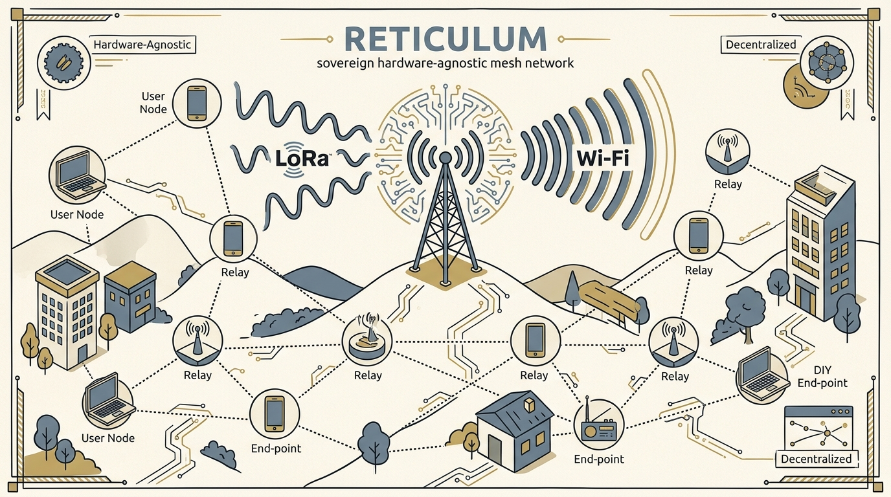
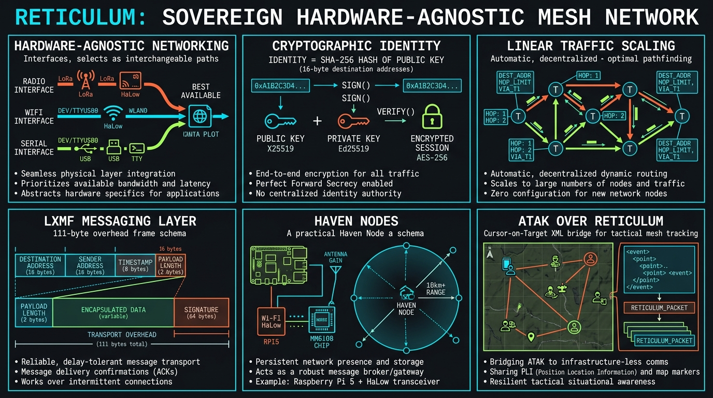
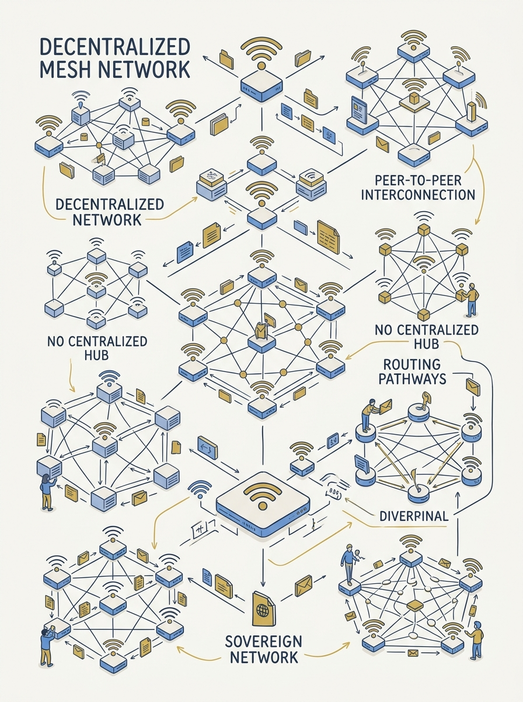
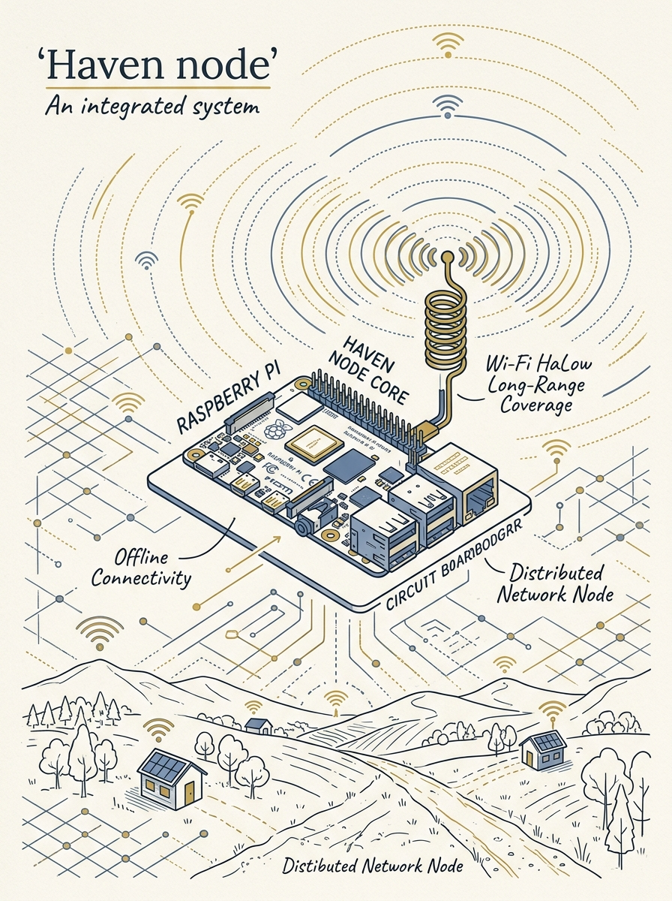
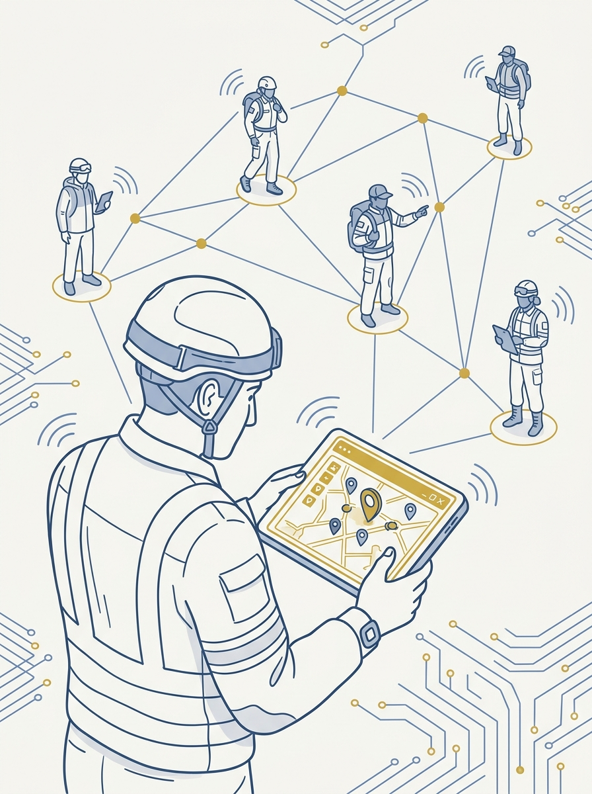

<!-- _class: title -->

# Reticulum: เครือข่ายอธิปไตยข้ามฮาร์ดแวร์

Sovereign, hardware-agnostic mesh network ที่เชื่อม LoRa เข้ากับ Wi-Fi HaLow

<!-- Speaker: อินเทอร์เน็ตจริงๆ คือระบบ routing ไม่ใช่สายเคเบิล — Reticulum เขียน routing layer นี้ใหม่ทั้งหมดโดยตัด IP/ISP ออก -->

---

<!-- _class: cheatsheet -->
<!-- _backgroundColor: #f8f7f4 -->

<!-- Speaker: ภาพรวมทั้ง 6 concept หลัก — hardware-agnostic, cryptographic identity, linear scaling, LXMF, Haven nodes, ATAK bridge -->

---

## TL;DR

สรุปสั้น ก่อนลงลึก

<svg viewBox="0 0 1100 380" width="100%" xmlns="http://www.w3.org/2000/svg">
  <rect x="60" y="40" width="980" height="300" rx="16" fill="var(--paper)" stroke="var(--soft-2)" stroke-width="1.5" style="filter:drop-shadow(0 4px 12px rgba(15,23,42,.08))"/>
  <rect x="60" y="40" width="8" height="300" rx="4" fill="var(--accent)"/>
  <circle cx="148" cy="190" r="40" fill="var(--accent)" opacity=".12"/>
  <circle cx="148" cy="190" r="28" fill="var(--accent)"/>
  <text x="148" y="196" font-size="18" fill="var(--paper)" text-anchor="middle" dominant-baseline="central" font-family="system-ui" font-weight="700">RNS</text>
  <text x="220" y="160" font-size="19" font-weight="700" fill="var(--ink)" font-family="system-ui">Not a radio protocol — a full networking stack</text>
  <text x="220" y="192" font-size="15" fill="var(--ink-dim)" font-family="system-ui">Bridges LoRa 915MHz + Wi-Fi HaLow + Ethernet + Serial in one network</text>
  <text x="220" y="222" font-size="15" fill="var(--ink-dim)" font-family="system-ui">End-to-end encrypted by default — X25519 / Ed25519 / AES-256</text>
  <text x="220" y="252" font-size="15" fill="var(--muted)" font-family="system-ui">Field-tested: ATAK running over Haven nodes (Raspberry Pi)</text>
</svg>

<b>★ Takeaway:</b> Reticulum ทำงาน "เหนือ" ฮาร์ดแวร์ใดๆ ก็ได้ ไม่ต้องพึ่ง IP, ISP หรือศูนย์กลางใดๆ

<!-- Speaker: 30 วินาที framing ก่อนเข้า deep dive -->

---

## ทำไมเรื่องนี้ถึงสำคัญ: Internet คือ Routing ไม่ใช่สายเคเบิล

ตัดสาย ตัดเสา ตัดไฟ = จบการสื่อสาร — ถ้าเครือข่ายผูกกับผู้ให้บริการรายเดียว

<svg viewBox="0 0 700 320" width="100%" xmlns="http://www.w3.org/2000/svg">
  <circle cx="150" cy="160" r="34" fill="var(--accent)" opacity=".15"/>
  <circle cx="150" cy="160" r="20" fill="var(--accent)"/>
  <text x="150" y="164" font-size="11" fill="var(--paper)" text-anchor="middle" dominant-baseline="central" font-family="system-ui" font-weight="700">A</text>
  <circle cx="350" cy="90" r="20" fill="var(--muted)" opacity=".4"/>
  <text x="350" y="94" font-size="11" fill="var(--ink)" text-anchor="middle" dominant-baseline="central" font-family="system-ui" font-weight="700">B</text>
  <circle cx="350" cy="230" r="20" fill="var(--muted)" opacity=".4"/>
  <text x="350" y="234" font-size="11" fill="var(--ink)" text-anchor="middle" dominant-baseline="central" font-family="system-ui" font-weight="700">C</text>
  <circle cx="550" cy="160" r="20" fill="var(--gold)"/>
  <text x="550" y="164" font-size="11" fill="var(--paper)" text-anchor="middle" dominant-baseline="central" font-family="system-ui" font-weight="700">D</text>
  <line x1="170" y1="160" x2="330" y2="95" stroke="var(--muted)" stroke-width="2"/>
  <line x1="170" y1="160" x2="330" y2="225" stroke="var(--muted)" stroke-width="2"/>
  <line x1="370" y1="95" x2="530" y2="155" stroke="var(--muted)" stroke-width="2"/>
  <line x1="370" y1="225" x2="530" y2="165" stroke="var(--muted)" stroke-width="2"/>
  <text x="150" y="205" font-size="12" fill="var(--muted)" text-anchor="middle" font-family="system-ui">Origin</text>
  <text x="550" y="205" font-size="12" fill="var(--muted)" text-anchor="middle" font-family="system-ui">Destination</text>
  <text x="350" y="290" font-size="13" fill="var(--ink-dim)" text-anchor="middle" font-family="system-ui">Routing = choosing which path each hop takes</text>
</svg>

<b>★ Takeaway:</b> Reticulum เขียน routing layer นี้ใหม่ทั้งหมด — sovereign, ไม่ต้องขออนุญาตใคร, ครอบคลุมพื้นที่กว้างแค่ไหนก็ได้

<!-- Speaker: เกริ่นว่า Mark Qvist ออกแบบ RNS มาแก้ปัญหาการผูกขาดโครงสร้างพื้นฐาน -->

---

## Hardware-Agnostic: ทุกฮาร์ดแวร์คือ Interface เดียวกัน

MTU ขั้นต่ำแค่ 500 byte + 5 bit/s — ครอบคลุมตั้งแต่คีย์มอร์สถึงไฟเบอร์ออปติก

<svg viewBox="0 0 1100 380" width="100%" xmlns="http://www.w3.org/2000/svg">
  <rect x="40" y="40" width="240" height="70" rx="10" fill="var(--soft)" stroke="var(--soft-2)" stroke-width="1.5"/>
  <text x="160" y="68" font-size="15" font-weight="700" fill="var(--ink)" text-anchor="middle" font-family="system-ui">LoRa 915MHz</text>
  <text x="160" y="90" font-size="12" fill="var(--ink-dim)" text-anchor="middle" font-family="system-ui">RNode / Meshtastic board</text>
  <rect x="40" y="150" width="240" height="70" rx="10" fill="var(--soft)" stroke="var(--soft-2)" stroke-width="1.5"/>
  <text x="160" y="178" font-size="15" font-weight="700" fill="var(--ink)" text-anchor="middle" font-family="system-ui">Wi-Fi HaLow 900MHz</text>
  <text x="160" y="200" font-size="12" fill="var(--ink-dim)" text-anchor="middle" font-family="system-ui">802.11ah, ~10km</text>
  <rect x="40" y="260" width="240" height="70" rx="10" fill="var(--soft)" stroke="var(--soft-2)" stroke-width="1.5"/>
  <text x="160" y="288" font-size="15" font-weight="700" fill="var(--ink)" text-anchor="middle" font-family="system-ui">Wi-Fi / Ethernet / Serial</text>
  <text x="160" y="310" font-size="12" fill="var(--ink-dim)" text-anchor="middle" font-family="system-ui">2.4/5GHz, TTY, packet radio</text>
  <line x1="280" y1="75" x2="430" y2="190" stroke="var(--muted)" stroke-width="2"/>
  <line x1="280" y1="185" x2="430" y2="190" stroke="var(--muted)" stroke-width="2"/>
  <line x1="280" y1="295" x2="430" y2="190" stroke="var(--muted)" stroke-width="2"/>
  <circle cx="500" cy="190" r="70" fill="var(--accent)" opacity=".1"/>
  <circle cx="500" cy="190" r="50" fill="var(--accent)"/>
  <text x="500" y="185" font-size="15" font-weight="700" fill="var(--paper)" text-anchor="middle" font-family="system-ui">RNS</text>
  <text x="500" y="203" font-size="11" fill="var(--paper)" text-anchor="middle" font-family="system-ui">Transport</text>
  <line x1="570" y1="190" x2="720" y2="190" stroke="var(--muted)" stroke-width="2"/>
  <rect x="720" y="120" width="340" height="140" rx="10" fill="var(--paper)" stroke="var(--accent)" stroke-width="2" style="filter:drop-shadow(var(--shadow-sm))"/>
  <text x="890" y="155" font-size="16" font-weight="700" fill="var(--accent)" text-anchor="middle" font-family="system-ui">One Network</text>
  <text x="890" y="185" font-size="13" fill="var(--ink)" text-anchor="middle" font-family="system-ui">Any node reaches any node</text>
  <text x="890" y="210" font-size="13" fill="var(--ink-dim)" text-anchor="middle" font-family="system-ui">regardless of radio hardware</text>
  <text x="890" y="235" font-size="13" fill="var(--muted)" text-anchor="middle" font-family="system-ui">Auto multi-hop path discovery</text>
</svg>

<b>★ Takeaway:</b> Reticulum ไม่ใช่ radio protocol — มันบริดจ์ LoRa กับ Wi-Fi HaLow ข้าม modulation ที่ต่างกันได้อัตโนมัติ

<!-- Speaker: เน้นว่า Meshtastic/MeshCore ผูกกับ LoRa transport เดียว ต่างจาก Reticulum ที่อยู่เหนือฮาร์ดแวร์ -->

---

## Cryptographic Identity แทน IP Address

ไม่มี packet ไหนพกข้อมูลต้นทางติดไปด้วย — ปลอดภัยตั้งแต่ base ของโปรโตคอล

  

    
Addressing

    <h3>16-byte destination hash</h3>
    
ตัดทอนจาก SHA-256 ของ public key — รองรับอุปกรณ์ active พร้อมกันหลายพันล้านเครื่อง

  

  

    
Key Exchange + Signature

    <h3>X25519 + Ed25519</h3>
    
ทุก link มี forward secrecy — สร้าง keypair ใหม่ทุกครั้งที่เชื่อมต่อ

  

  

    
Encryption

    <h3>AES-256-CBC</h3>
    
Default มาให้ตั้งแต่ต้น ไม่ต้อง config เพิ่ม — initiator anonymity ในตัว

  

<b>★ Takeaway:</b> ทิ้ง IP address แบบเดิม — identity คือ cryptographic key ไม่ใช่ที่อยู่บนโครงสร้างพื้นฐานใคร

<!-- Speaker: ย้ำว่านี่คือ default ไม่ใช่ opt-in security -->

---

## ขยายตัวแบบ Linear ไม่ใช่ Flood ทั้งเครือข่าย

แก้ปัญหาคลาสสิกของ mesh: ยิ่ง hop เยอะ ยิ่งต้อง flood routing table

<svg viewBox="0 0 1100 380" width="100%" xmlns="http://www.w3.org/2000/svg">
  <rect x="40" y="20" width="490" height="340" rx="12" fill="var(--paper)" stroke="var(--soft-2)" stroke-width="1.5" style="filter:drop-shadow(var(--shadow-sm))"/>
  <rect x="40" y="20" width="490" height="56" rx="12" fill="var(--soft)" opacity=".8"/>
  <text x="285" y="54" font-size="16" font-weight="700" fill="var(--ink-dim)" text-anchor="middle" font-family="system-ui">Traditional Mesh</text>
  <text x="80" y="115" font-size="14" fill="var(--ink)" font-family="system-ui">Every node maintains</text>
  <text x="80" y="140" font-size="14" fill="var(--ink)" font-family="system-ui">global topology knowledge</text>
  <text x="80" y="180" font-size="14" fill="var(--ink-dim)" font-family="system-ui">Routing table floods</text>
  <text x="80" y="205" font-size="14" fill="var(--ink-dim)" font-family="system-ui">continuously, network-wide</text>
  <text x="80" y="250" font-size="14" fill="var(--danger)" font-weight="700" font-family="system-ui">Control traffic grows</text>
  <text x="80" y="275" font-size="14" fill="var(--danger)" font-weight="700" font-family="system-ui">exponentially with hop count</text>
  <rect x="570" y="20" width="490" height="340" rx="12" fill="var(--paper)" stroke="var(--accent)" stroke-width="2" style="filter:drop-shadow(var(--shadow-md))"/>
  <rect x="570" y="20" width="490" height="56" rx="12" fill="var(--accent)" opacity=".08"/>
  <text x="815" y="54" font-size="16" font-weight="700" fill="var(--accent)" text-anchor="middle" font-family="system-ui">Reticulum Transport</text>
  <text x="610" y="115" font-size="14" fill="var(--ink)" font-family="system-ui">Transport Nodes route;</text>
  <text x="610" y="140" font-size="14" fill="var(--ink)" font-family="system-ui">regular nodes keep local state only</text>
  <text x="610" y="180" font-size="14" fill="var(--ink)" font-family="system-ui">Routes discovered on-demand,</text>
  <text x="610" y="205" font-size="14" fill="var(--ink)" font-family="system-ui">not synced continuously</text>
  <text x="610" y="250" font-size="14" fill="var(--success)" font-weight="700" font-family="system-ui">Hop-count field in header —</text>
  <text x="610" y="275" font-size="14" fill="var(--success)" font-weight="700" font-family="system-ui">traffic scales linearly</text>
  <circle cx="550" cy="190" r="28" fill="var(--accent)"/>
  <text x="550" y="195" font-size="13" font-weight="700" fill="var(--paper)" text-anchor="middle" dominant-baseline="central" font-family="system-ui">VS</text>
</svg>

<b>★ Takeaway:</b> แยกบทบาท Transport Node / โหนดทั่วไป ทำให้อุปกรณ์พลังงานต่ำอย่าง LoRa node ไม่ล่มจากภาระ routing

<!-- Speaker: เน้น hop-count header field เป็นกลไกหลัก ไม่ต้องมี routing structure เพิ่ม -->

---

## LXMF: ชั้นแอปพลิเคชันสำหรับข้อความ

Overhead ต่อข้อความแค่ ~111 byte — ออกแบบมาสำหรับ LoRa/packet radio แบนด์วิดท์ต่ำสุดๆ

<svg viewBox="0 0 700 320" width="100%" xmlns="http://www.w3.org/2000/svg">
  <rect x="30" y="120" width="640" height="60" rx="8" fill="var(--soft)" stroke="var(--soft-2)" stroke-width="1.5"/>
  <rect x="30" y="120" width="130" height="60" rx="8" fill="var(--accent)" opacity=".15"/>
  <text x="95" y="145" font-size="11" fill="var(--ink)" text-anchor="middle" font-family="system-ui" font-weight="700">DEST</text>
  <text x="95" y="163" font-size="10" fill="var(--ink-dim)" text-anchor="middle" font-family="system-ui">16 bytes</text>
  <rect x="160" y="120" width="130" height="60" fill="var(--accent)" opacity=".08"/>
  <text x="225" y="145" font-size="11" fill="var(--ink)" text-anchor="middle" font-family="system-ui" font-weight="700">SOURCE</text>
  <text x="225" y="163" font-size="10" fill="var(--ink-dim)" text-anchor="middle" font-family="system-ui">16 bytes</text>
  <rect x="290" y="120" width="90" height="60" fill="var(--gold)" opacity=".15"/>
  <text x="335" y="145" font-size="11" fill="var(--ink)" text-anchor="middle" font-family="system-ui" font-weight="700">TIME</text>
  <text x="335" y="163" font-size="10" fill="var(--ink-dim)" text-anchor="middle" font-family="system-ui">8 bytes</text>
  <rect x="380" y="120" width="290" height="60" rx="8" fill="var(--success)" opacity=".1"/>
  <text x="525" y="145" font-size="11" fill="var(--ink)" text-anchor="middle" font-family="system-ui" font-weight="700">SIGNATURE + PAYLOAD</text>
  <text x="525" y="163" font-size="10" fill="var(--ink-dim)" text-anchor="middle" font-family="system-ui">64 bytes + variable</text>
  <text x="350" y="220" font-size="16" font-weight="700" fill="var(--accent)" text-anchor="middle" font-family="system-ui">~111 bytes transport overhead</text>
  <text x="350" y="250" font-size="13" fill="var(--muted)" text-anchor="middle" font-family="system-ui">delay-tolerant · zero-config · ACK support</text>
</svg>

<b>★ Takeaway:</b> แอปอย่าง Sideband, MeshChat, Nomad Network สร้างบน LXMF — ส่งข้อความ/telemetry ผ่าน Reticulum ได้ทันที

<!-- Speaker: LXMF คือชั้นที่ทำให้ user จริงๆ คุยกันได้ ไม่ใช่แค่ transport layer -->

---

## Haven Nodes: Reticulum จริงบน Raspberry Pi

ฮาร์ดแวร์โอเพนซอร์สที่รวม Wi-Fi HaLow เข้ากับ Raspberry Pi — ระยะเกิน 10km ในที่โล่ง

  

    
Haven 1

    <h3>Raspberry Pi 4 / CM4</h3>
    
เฟิร์มแวร์ OpenMANET

  

  

    
Haven 2

    <h3>Raspberry Pi 5</h3>
    
OpenWrt + Morse Micro MM8108 chip

  

<b>★ Takeaway:</b> เสียบ USB sidecar LoRa (RNode/Meshtastic) เข้า Haven node ก็บริดจ์อุปกรณ์ LoRa-only ให้คุยกับ Wi-Fi-only ได้ในเครือข่ายเดียว

<!-- Speaker: Haven คือของจริงที่ประกอบได้เอง ไม่ใช่แค่ทฤษฎี -->

---

## ATAK บน Reticulum: Off-Grid Situational Awareness

Route ข้อมูล ATAK เต็มรูปแบบผ่าน mesh ที่เข้ารหัส ไม่พึ่งอินเทอร์เน็ตหรือเซิร์ฟเวอร์กลาง

<svg viewBox="0 0 700 320" width="100%" xmlns="http://www.w3.org/2000/svg">
  <rect x="30" y="40" width="180" height="80" rx="10" fill="var(--soft)" stroke="var(--soft-2)" stroke-width="1.5"/>
  <text x="120" y="72" font-size="13" font-weight="700" fill="var(--ink)" text-anchor="middle" font-family="system-ui">ATAK</text>
  <text x="120" y="92" font-size="11" fill="var(--ink-dim)" text-anchor="middle" font-family="system-ui">Cursor-on-Target</text>
  <text x="120" y="108" font-size="11" fill="var(--ink-dim)" text-anchor="middle" font-family="system-ui">+ chat (multicast)</text>
  <line x1="210" y1="80" x2="280" y2="80" stroke="var(--muted)" stroke-width="2"/>
  <rect x="280" y="40" width="180" height="80" rx="10" fill="var(--accent)" opacity=".1" stroke="var(--accent)" stroke-width="1.5"/>
  <text x="370" y="72" font-size="13" font-weight="700" fill="var(--accent)" text-anchor="middle" font-family="system-ui">Python Bridge</text>
  <text x="370" y="92" font-size="11" fill="var(--ink-dim)" text-anchor="middle" font-family="system-ui">compress + fragment</text>
  <text x="370" y="108" font-size="11" fill="var(--ink-dim)" text-anchor="middle" font-family="system-ui">to fit 500-byte MTU</text>
  <line x1="460" y1="80" x2="530" y2="80" stroke="var(--muted)" stroke-width="2"/>
  <rect x="530" y="40" width="140" height="80" rx="10" fill="var(--success)" opacity=".1" stroke="var(--success)" stroke-width="1.5"/>
  <text x="600" y="72" font-size="13" font-weight="700" fill="var(--success-ink)" text-anchor="middle" font-family="system-ui">Reticulum</text>
  <text x="600" y="92" font-size="11" fill="var(--ink-dim)" text-anchor="middle" font-family="system-ui">encrypted mesh</text>
  <text x="600" y="108" font-size="11" fill="var(--ink-dim)" text-anchor="middle" font-family="system-ui">via Wi-Fi HaLow</text>
  <line x1="120" y1="120" x2="120" y2="200" stroke="var(--muted)" stroke-width="1.5" stroke-dasharray="4 3"/>
  <text x="350" y="240" font-size="15" font-weight="700" fill="var(--ink)" text-anchor="middle" font-family="system-ui">Reassembled at receiving device — real-time map + chat</text>
  <text x="350" y="270" font-size="13" fill="var(--muted)" text-anchor="middle" font-family="system-ui">Zero internet · zero central server</text>
</svg>

<b>★ Takeaway:</b> ทีมกู้ภัย/tactical ใช้ ATAK แผนที่+แชทได้เต็มรูปแบบ แม้ไม่มีสัญญาณมือถือหรืออินเทอร์เน็ตเลย

<!-- Speaker: นี่คือ use case จริงที่สาธิตในวิดีโอต้นทาง ไม่ใช่แค่แนวคิด -->

---

## Caveats / Limits

ข้อจำกัดที่ต้องรู้ก่อนเอาไปใช้งานจริง

  

    
Overhead

    <h3>Packet ใหญ่กว่าระบบไม่เข้ารหัส</h3>
    
แลกกับความปลอดภัย end-to-end

  

  

    
Hardware

    <h3>Wi-Fi HaLow ยังหายาก</h3>
    
ชิปเฉพาะทาง (Morse Micro) บางภูมิภาคหาซื้อยาก

  

  

    
Integration

    <h3>ATAK bridge เป็นงาน custom</h3>
    
Python script เฉพาะกิจ ไม่ใช่ built-in feature

  

  

    
Use case fit

    <h3>Meshtastic ยังเหมาะกว่าบางงาน</h3>
    
lightweight telemetry/text ที่ไม่ต้องข้ามฮาร์ดแวร์

  

  

    
Resource

    <h3>Transport Node ต้องมีทรัพยากรพอ</h3>
    
ไม่ใช่ IoT บอร์ดเล็กสุดที่ทำ routing เต็มรูปแบบได้

  

<b>★ Takeaway:</b> Reticulum ทรงพลังแต่ยังต้องมือประกอบเอง — ไม่ใช่ plug-and-play สำหรับผู้ใช้ทั่วไป

<!-- Speaker: ย้ำว่านี่คือ DIY/hacker-grade tech ไม่ใช่ consumer product -->

---

## Key Takeaways

สิ่งที่ต้องจำแม้ข้ามส่วนเนื้อหาไป

<svg viewBox="0 0 1100 340" width="100%" xmlns="http://www.w3.org/2000/svg">
  <circle cx="550" cy="170" r="160" fill="none" stroke="var(--soft-2)" stroke-width="1.5"/>
  <circle cx="550" cy="170" r="110" fill="none" stroke="var(--accent)" stroke-width="1.5" opacity=".4"/>
  <circle cx="550" cy="170" r="60" fill="var(--accent)" opacity=".1"/>
  <circle cx="550" cy="170" r="60" fill="none" stroke="var(--accent)" stroke-width="2"/>
  <text x="550" y="164" font-size="14" font-weight="700" fill="var(--accent)" text-anchor="middle" font-family="system-ui">Networking</text>
  <text x="550" y="184" font-size="13" fill="var(--ink)" text-anchor="middle" font-family="system-ui">not radio protocol</text>
  <text x="370" y="95" font-size="13" fill="var(--ink)" text-anchor="middle" font-family="system-ui">Crypto identity</text>
  <text x="370" y="115" font-size="12" fill="var(--muted)" text-anchor="middle" font-family="system-ui">X25519/Ed25519/AES-256</text>
  <text x="730" y="95" font-size="13" fill="var(--ink)" text-anchor="middle" font-family="system-ui">Linear scaling</text>
  <text x="730" y="115" font-size="12" fill="var(--muted)" text-anchor="middle" font-family="system-ui">on-demand routing</text>
  <text x="210" y="170" font-size="13" fill="var(--muted)" text-anchor="middle" font-family="system-ui">LXMF</text>
  <text x="210" y="190" font-size="12" fill="var(--muted)" text-anchor="middle" font-family="system-ui">~111B overhead</text>
  <text x="890" y="170" font-size="13" fill="var(--muted)" text-anchor="middle" font-family="system-ui">Haven + ATAK</text>
  <text x="890" y="190" font-size="12" fill="var(--muted)" text-anchor="middle" font-family="system-ui">field-tested off-grid</text>
</svg>

<b>★ Takeaway:</b> Reticulum สาธิตแล้วว่าเครือข่ายที่ sovereign, hardware-agnostic, และเข้ารหัสเต็มรูปแบบ ใช้งานได้จริงบนฮาร์ดแวร์ราคาถูกวันนี้

<!-- Speaker: ปิดท้ายด้วยว่านี่ไม่ใช่แค่แนวคิดในกระดาษ Haven+ATAK คือของจริง -->
