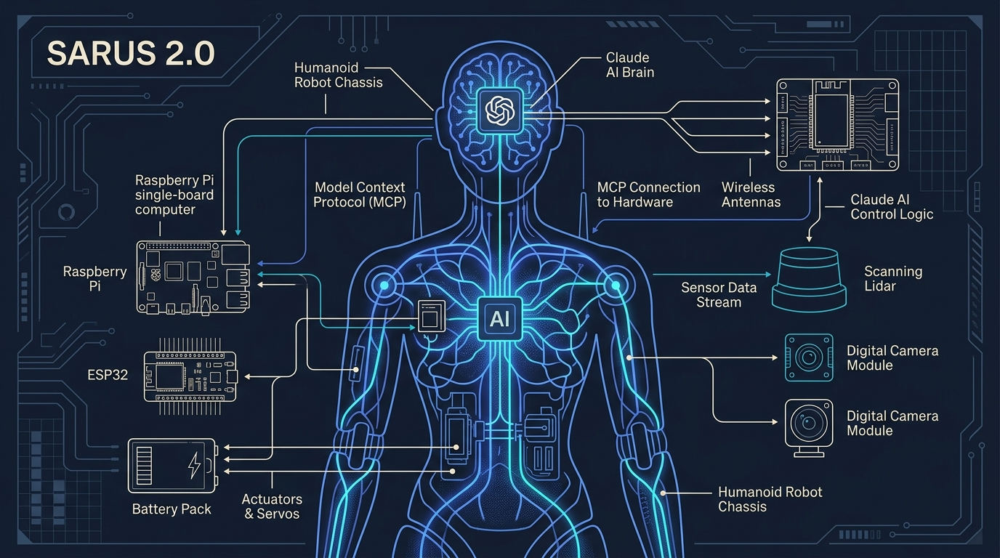
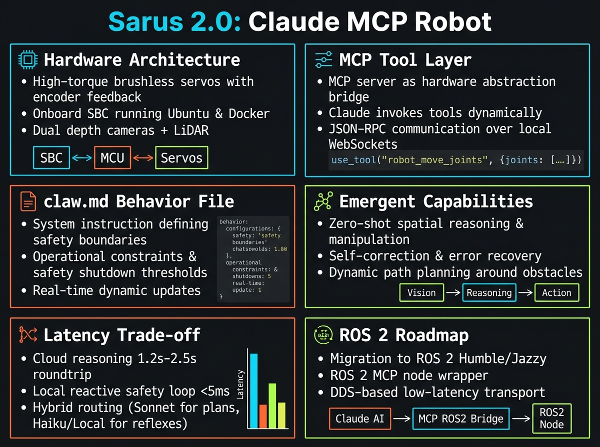
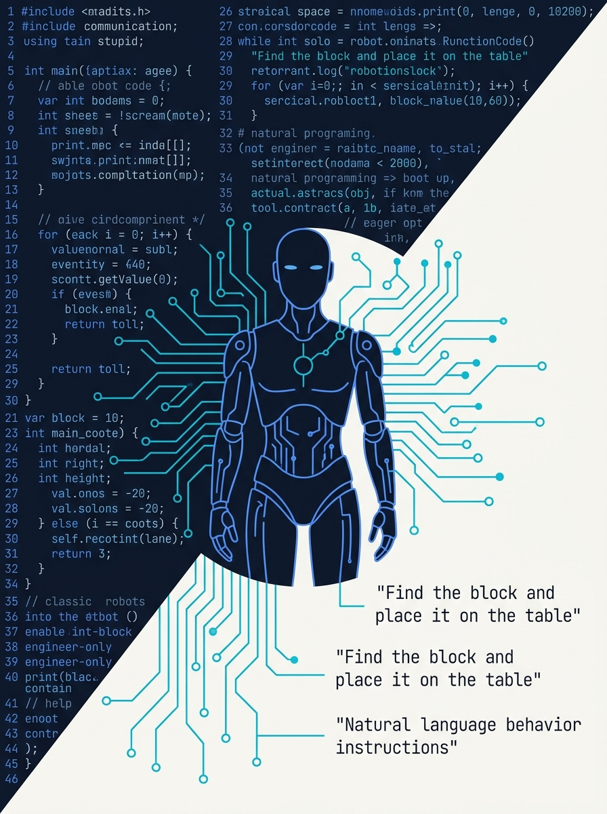
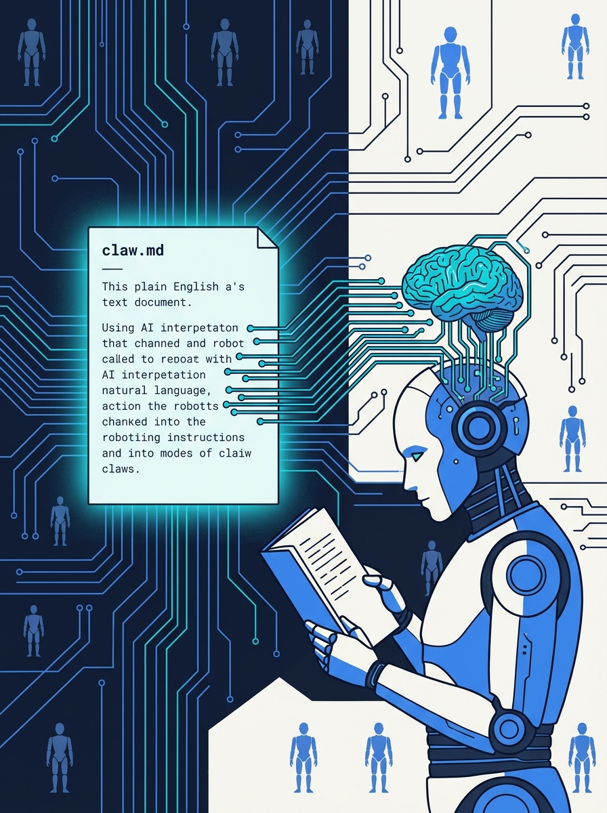

<!-- _class: title -->

# Sarus 2.0: Claude AI Robot via MCP

เมื่อ AI มีร่างกาย — โปรแกรมหุ่นยนต์ด้วยภาษาอังกฤษธรรมดา

<!-- Speaker: 30s intro — Sarus 2.0 is a real robot controlled by Claude AI via Model Context Protocol. No traditional robotics code. Behavior in plain English. -->

---

<!-- _class: cheatsheet -->
<!-- _backgroundColor: #f8f7f4 -->

<!-- Speaker: 60s orientation — 6 zones: hardware stack, MCP layer, claw.md, emergent capabilities, latency trade-off, ROS 2 roadmap. Point at each before advancing. -->

---

## Sarus 2.0: AI Robot with a Real Body

Claude + MCP = สมองที่มองเห็น สัมผัส และเคลื่อนไหวผ่านฮาร์ดแวร์จริง

  

    
The Robot

    <h3>Claude Controls Real Hardware</h3>
    
Raspberry Pi 4 · ESP32 · LT06 Lidar 360° · Dual Cameras · ToF 8×8

    
Claude calls MCP tools to read sensors and issue movement commands — no raw shell access, no hardcoded logic.

  

  

    
The Innovation

    <h3>claw.md — Plain English Brain</h3>
    
A text file defines the robot's entire behavior: sensor descriptions, safety rules, navigation style, personality.

    
Change behavior = edit English text. Zero recompile. Zero ROS config.

  

<b>★ Takeaway:</b> MCP gives Claude a typed, safe API to robot hardware — no raw shell commands, no injection risks.

<!-- Speaker: Core concept in one slide — Claude reads sensors via MCP tools, reasons in claw.md context, calls movement tools. -->

---

## Why This Matters: Robotics Has a Steep Wall

Traditional robotics requires C++, ROS, PID controllers, sensor drivers — engineer-only territory.

  

    
Traditional Approach

    <h3>Hardcoded C++/Python</h3>
    
Thousands of lines. Driver per sensor. ROS expertise required. Change behavior = recompile.

  

  

    
Sarus 2.0 Approach

    <h3>MCP + claw.md</h3>
    
Claude writes MCP servers. Behavior = edit English text. Non-engineers can modify the robot.

  

<b>★ Takeaway:</b> Sarus 2.0 lowers the robotics entry barrier from "PhD required" to "English required."

<!-- Speaker: This is the paradigm shift. Not just a cool demo — it redefines who can program robots. -->

---

## Hardware Stack: Two-Layer Architecture

RPi 4 thinks; ESP32 executes — clean separation of AI reasoning from physical control.

<svg viewBox="0 0 1100 360" width="100%" xmlns="http://www.w3.org/2000/svg">
  <!-- AI Layer box -->
  <rect x="40" y="20" width="490" height="320" rx="14" fill="var(--accent-wash)" stroke="var(--accent)" stroke-width="2"/>
  <rect x="40" y="20" width="490" height="44" rx="14" fill="var(--accent)" opacity=".15"/>
  <text x="285" y="48" font-size="15" font-weight="700" fill="var(--accent-deep)" text-anchor="middle" font-family="system-ui">Raspberry Pi 4 — AI Layer</text>
  <text x="80" y="90" font-size="13" fill="var(--ink)" font-family="system-ui">Claude (Sonnet) + MCP Servers</text>
  <text x="80" y="115" font-size="13" fill="var(--ink-dim)" font-family="system-ui">LT06 Lidar Tool  |  Camera Tool</text>
  <text x="80" y="138" font-size="13" fill="var(--ink-dim)" font-family="system-ui">ToF Sensor Tool  |  Move Tool</text>
  <text x="80" y="170" font-size="12" fill="var(--muted)" font-family="system-ui">Dual cameras (horizon + floor, stitched)</text>
  <text x="80" y="192" font-size="12" fill="var(--muted)" font-family="system-ui">7-inch display (personality / expressions)</text>
  <text x="80" y="214" font-size="12" fill="var(--muted)" font-family="system-ui">3S2P Li-ion + BMS (clean power)</text>
  <text x="80" y="244" font-size="11" fill="var(--muted)" font-family="system-ui">claw.md  |  Voice input</text>
  <!-- Arrow -->
  <line x1="555" y1="180" x2="595" y2="180" stroke="var(--accent)" stroke-width="2.5"/>
  <polygon points="595,174 610,180 595,186" fill="var(--accent)"/>
  <text x="582" y="170" font-size="11" fill="var(--muted)" text-anchor="middle" font-family="system-ui">serial</text>
  <!-- Execution Layer box -->
  <rect x="620" y="20" width="430" height="320" rx="14" fill="var(--soft)" stroke="var(--soft-2)" stroke-width="2"/>
  <rect x="620" y="20" width="430" height="44" rx="14" fill="var(--ink)" opacity=".06"/>
  <text x="835" y="48" font-size="15" font-weight="700" fill="var(--ink)" text-anchor="middle" font-family="system-ui">ESP32 — Execution Layer</text>
  <text x="660" y="90" font-size="13" fill="var(--ink)" font-family="system-ui">C++ Firmware</text>
  <text x="660" y="115" font-size="13" fill="var(--ink-dim)" font-family="system-ui">JGA25 Motors + Encoders</text>
  <text x="660" y="138" font-size="13" fill="var(--ink-dim)" font-family="system-ui">LT06 Lidar (360° scan)</text>
  <text x="660" y="161" font-size="13" fill="var(--ink-dim)" font-family="system-ui">ToF 8x8 grid (bumper)</text>
  <text x="660" y="192" font-size="12" fill="var(--muted)" font-family="system-ui">Receives typed commands</text>
  <text x="660" y="212" font-size="12" fill="var(--muted)" font-family="system-ui">Returns structured sensor data</text>
</svg>

<b>★ Takeaway:</b> RPi reasons in Claude-time (~2s); ESP32 executes in microseconds — two speeds, one robot.

<!-- Speaker: This separation is critical. Claude never fires raw serial — only calls MCP tools, which safely translate to ESP32 commands. -->

---

## MCP Layer: Every Peripheral Gets a Typed Tool

Instead of raw shell commands, each sensor becomes a structured function Claude can call.

<svg viewBox="0 0 1100 360" width="100%" xmlns="http://www.w3.org/2000/svg">
  <!-- Claude brain -->
  <rect x="20" y="130" width="180" height="100" rx="12" fill="var(--accent)" opacity=".12" stroke="var(--accent)" stroke-width="2"/>
  <text x="110" y="172" font-size="14" font-weight="700" fill="var(--accent-deep)" text-anchor="middle" font-family="system-ui">Claude</text>
  <text x="110" y="194" font-size="12" fill="var(--ink-dim)" text-anchor="middle" font-family="system-ui">AI Reasoning</text>
  <!-- Arrow 1 -->
  <line x1="200" y1="180" x2="250" y2="180" stroke="var(--accent)" stroke-width="2"/>
  <polygon points="248,174 264,180 248,186" fill="var(--accent)"/>
  <text x="232" y="170" font-size="10" fill="var(--muted)" text-anchor="middle" font-family="system-ui">MCP calls</text>
  <!-- MCP Layer -->
  <rect x="264" y="40" width="420" height="280" rx="14" fill="var(--soft)" stroke="var(--soft-2)" stroke-width="1.5"/>
  <text x="474" y="72" font-size="13" font-weight="700" fill="var(--ink-dim)" text-anchor="middle" font-family="system-ui">MCP Server Layer (RPi 4)</text>
  <!-- Tool boxes -->
  <rect x="284" y="90" width="110" height="80" rx="8" fill="var(--paper)" stroke="var(--accent)" stroke-width="1.5"/>
  <text x="339" y="126" font-size="12" font-weight="700" fill="var(--accent)" text-anchor="middle" font-family="system-ui">lidar_scan()</text>
  <text x="339" y="148" font-size="10" fill="var(--muted)" text-anchor="middle" font-family="system-ui">360 dist map</text>
  <rect x="414" y="90" width="120" height="80" rx="8" fill="var(--paper)" stroke="var(--accent)" stroke-width="1.5"/>
  <text x="474" y="126" font-size="12" font-weight="700" fill="var(--accent)" text-anchor="middle" font-family="system-ui">camera_view()</text>
  <text x="474" y="148" font-size="10" fill="var(--muted)" text-anchor="middle" font-family="system-ui">stitched image</text>
  <rect x="554" y="90" width="110" height="80" rx="8" fill="var(--paper)" stroke="var(--accent)" stroke-width="1.5"/>
  <text x="609" y="126" font-size="12" font-weight="700" fill="var(--accent)" text-anchor="middle" font-family="system-ui">tof_read()</text>
  <text x="609" y="148" font-size="10" fill="var(--muted)" text-anchor="middle" font-family="system-ui">8x8 grid cm</text>
  <rect x="344" y="200" width="150" height="80" rx="8" fill="var(--paper)" stroke="var(--success)" stroke-width="1.5"/>
  <text x="419" y="236" font-size="12" font-weight="700" fill="var(--success)" text-anchor="middle" font-family="system-ui">move_forward()</text>
  <text x="419" y="258" font-size="10" fill="var(--muted)" text-anchor="middle" font-family="system-ui">speed, ms</text>
  <!-- Arrow 2 -->
  <line x1="684" y1="180" x2="730" y2="180" stroke="var(--muted)" stroke-width="2"/>
  <polygon points="728,174 744,180 728,186" fill="var(--muted)"/>
  <text x="707" y="170" font-size="10" fill="var(--muted)" text-anchor="middle" font-family="system-ui">serial</text>
  <!-- ESP32 -->
  <rect x="744" y="120" width="180" height="120" rx="12" fill="var(--soft)" stroke="var(--soft-2)" stroke-width="2"/>
  <text x="834" y="172" font-size="14" font-weight="700" fill="var(--ink)" text-anchor="middle" font-family="system-ui">ESP32</text>
  <text x="834" y="194" font-size="12" fill="var(--ink-dim)" text-anchor="middle" font-family="system-ui">C++ Firmware</text>
  <text x="834" y="214" font-size="11" fill="var(--muted)" text-anchor="middle" font-family="system-ui">Motors / Sensors</text>
  <!-- Star note -->
  <rect x="940" y="60" width="150" height="60" rx="8" fill="var(--gold)" opacity=".15" stroke="var(--gold)" stroke-width="1.5"/>
  <text x="1015" y="86" font-size="11" font-weight="700" fill="var(--ink)" text-anchor="middle" font-family="system-ui">Claude wrote</text>
  <text x="1015" y="104" font-size="11" fill="var(--ink-dim)" text-anchor="middle" font-family="system-ui">its own MCP servers</text>
</svg>

<b>★ Takeaway:</b> MCP turns hardware into a clean typed API — Claude gets structured data in, structured commands out.

<!-- Speaker: The gold note is key — the creator just described I/O; Claude generated the MCP server code itself. Bootstrap loop. -->

---

## claw.md: The Robot's Brain in Plain English

Behavior, safety rules, and personality stored in a plain-English text file — not Python.

  

    
What claw.md contains

    <h3>Plain English Rules</h3>
    <ul>
      <li>Sensor descriptions (Lidar, ToF, cameras)</li>
      <li>Safety rules: stop if ToF &lt; 15cm</li>
      <li>Navigation style: deliberate, narrate</li>
      <li>Personality: display expressions</li>
    </ul>
  

  

    
What this unlocks

    <h3>No-Code Behavior Change</h3>
    <ul>
      <li>Edit English text = change robot behavior</li>
      <li>No recompile, no ROS config</li>
      <li>Like CLAUDE.md — but for robot hardware</li>
      <li>Non-engineers can modify it</li>
    </ul>
  

<b>★ Takeaway:</b> claw.md is to the robot what CLAUDE.md is to a developer — a system prompt loaded at boot that defines identity and rules.

<!-- Speaker: This is the biggest innovation. The robot's "soul" is a text file anyone can edit. Change a sentence, change the robot's behavior. -->

---

## Emergent Capabilities: No if-else Required

Because Claude reasons — behaviors emerge from context, not from hardcoded logic.

  

    
Voice Control

    <h3>Natural Commands</h3>
    
Receive voice input, interpret intent, execute via MCP tools. No keyword matching.

  

  

    
Vision Search

    <h3>Object Finding</h3>
    
Scan with camera, identify target, navigate toward it. Zero hardcoded search logic.

  

  

    
Real-time Avoidance

    <h3>Context-Aware Nav</h3>
    
Lidar + ToF fused by Claude reasoning — not a fixed PID loop. Avoids cables, shoes.

  

  

    
Traffic Light Rules

    <h3>Visual Reasoning</h3>
    
Understands traffic signals without pre-programmed rules. Claude infers from vision + prior knowledge.

  

<b>★ Takeaway:</b> LLM reasoning replaces hundreds of if-else branches — new capabilities emerge without writing new code.

<!-- Speaker: Traffic light understanding is the most striking example. No one taught the robot traffic rules — Claude already knows them. -->

---

## Latency: The Fundamental Trade-off

LLM reasoning is powerful but slow — every sense-decide-act cycle pauses while Claude thinks.

<svg viewBox="0 0 1100 340" width="100%" xmlns="http://www.w3.org/2000/svg">
  <!-- LLM loop flow -->
  <rect x="30" y="20" width="155" height="60" rx="8" fill="var(--soft)" stroke="var(--soft-2)" stroke-width="1.5"/>
  <text x="107" y="56" font-size="13" font-weight="700" fill="var(--ink)" text-anchor="middle" font-family="system-ui">User Command</text>
  <line x1="185" y1="50" x2="225" y2="50" stroke="var(--accent)" stroke-width="2"/>
  <polygon points="223,44 239,50 223,56" fill="var(--accent)"/>
  <rect x="239" y="20" width="200" height="60" rx="8" fill="var(--accent-wash)" stroke="var(--accent)" stroke-width="1.5"/>
  <text x="339" y="44" font-size="12" font-weight="700" fill="var(--accent-deep)" text-anchor="middle" font-family="system-ui">Claude Reasons</text>
  <text x="339" y="64" font-size="11" fill="var(--ink-dim)" text-anchor="middle" font-family="system-ui">reads sensors, decides</text>
  <!-- Pause box -->
  <rect x="239" y="100" width="200" height="50" rx="8" fill="var(--danger-wash)" stroke="var(--danger)" stroke-width="1.5"/>
  <text x="339" y="131" font-size="12" font-weight="700" fill="var(--danger)" text-anchor="middle" font-family="system-ui">PAUSE ~1-3 sec</text>
  <line x1="339" y1="80" x2="339" y2="100" stroke="var(--muted)" stroke-width="1.5" stroke-dasharray="4"/>
  <line x1="439" y1="50" x2="480" y2="50" stroke="var(--accent)" stroke-width="2"/>
  <polygon points="478,44 494,50 478,56" fill="var(--accent)"/>
  <rect x="494" y="20" width="155" height="60" rx="8" fill="var(--success-wash)" stroke="var(--success)" stroke-width="1.5"/>
  <text x="571" y="44" font-size="13" font-weight="700" fill="var(--success-ink)" text-anchor="middle" font-family="system-ui">Execute Move</text>
  <text x="571" y="64" font-size="11" fill="var(--success-ink)" text-anchor="middle" font-family="system-ui">ESP32 acts</text>
  <line x1="649" y1="50" x2="689" y2="50" stroke="var(--muted)" stroke-width="2"/>
  <polygon points="687,44 703,50 687,56" fill="var(--muted)"/>
  <text x="746" y="56" font-size="13" fill="var(--ink)" text-anchor="middle" font-family="system-ui">Read Sensors</text>
  <rect x="695" y="20" width="110" height="60" rx="8" fill="var(--soft)" stroke="var(--soft-2)" stroke-width="1.5"/>
  <!-- Comparison table -->
  <rect x="30" y="190" width="490" height="120" rx="10" fill="var(--soft)" stroke="var(--soft-2)" stroke-width="1.5"/>
  <text x="80" y="220" font-size="13" font-weight="700" fill="var(--ink)" font-family="system-ui">Claude Haiku</text>
  <text x="80" y="244" font-size="12" fill="var(--ink-dim)" font-family="system-ui">~0.5s latency</text>
  <text x="80" y="264" font-size="12" fill="var(--muted)" font-family="system-ui">Lower reasoning quality</text>
  <text x="80" y="284" font-size="12" fill="var(--muted)" font-family="system-ui">Faster, less capable decisions</text>
  <rect x="555" y="190" width="490" height="120" rx="10" fill="var(--accent-wash)" stroke="var(--accent)" stroke-width="1.5"/>
  <text x="605" y="220" font-size="13" font-weight="700" fill="var(--accent-deep)" font-family="system-ui">Claude Sonnet (used)</text>
  <text x="605" y="244" font-size="12" fill="var(--ink-dim)" font-family="system-ui">~2-3s latency</text>
  <text x="605" y="264" font-size="12" fill="var(--ink-dim)" font-family="system-ui">High reasoning quality</text>
  <text x="605" y="284" font-size="12" fill="var(--ink-dim)" font-family="system-ui">Context-aware planning</text>
</svg>

<b>★ Takeaway:</b> LLM-driven robots are deliberate, not reactive — ideal for reasoning tasks, wrong for reflex-speed control.

<!-- Speaker: Traditional robots loop at 50-100Hz. Sarus 2.0 loops at ~0.3-1Hz. Different tool for different jobs. -->

---

## Build Your Own: 4-Step Pattern

This pattern works for any hardware project where you want Claude as the brain.

<svg viewBox="0 0 1100 300" width="100%" xmlns="http://www.w3.org/2000/svg">
  <!-- Step 1 -->
  <rect x="30" y="60" width="220" height="180" rx="12" fill="var(--paper)" stroke="var(--accent)" stroke-width="2" style="filter:drop-shadow(var(--shadow-sm))"/>
  <circle cx="140" cy="100" r="22" fill="var(--accent)"/>
  <text x="140" y="106" font-size="16" font-weight="700" fill="var(--paper)" text-anchor="middle" dominant-baseline="central" font-family="system-ui">1</text>
  <text x="140" y="140" font-size="13" font-weight="700" fill="var(--ink)" text-anchor="middle" font-family="system-ui">Design MCP Tools</text>
  <text x="140" y="162" font-size="11" fill="var(--ink-dim)" text-anchor="middle" font-family="system-ui">Wrap each peripheral</text>
  <text x="140" y="180" font-size="11" fill="var(--ink-dim)" text-anchor="middle" font-family="system-ui">as typed function</text>
  <text x="140" y="200" font-size="11" fill="var(--muted)" text-anchor="middle" font-family="system-ui">Input schema + return type</text>
  <!-- Arrow -->
  <line x1="250" y1="150" x2="295" y2="150" stroke="var(--muted)" stroke-width="2"/>
  <polygon points="293,144 309,150 293,156" fill="var(--muted)"/>
  <!-- Step 2 -->
  <rect x="309" y="60" width="220" height="180" rx="12" fill="var(--paper)" stroke="var(--gold)" stroke-width="2" style="filter:drop-shadow(var(--shadow-sm))"/>
  <circle cx="419" cy="100" r="22" fill="var(--gold)"/>
  <text x="419" y="106" font-size="16" font-weight="700" fill="var(--paper)" text-anchor="middle" dominant-baseline="central" font-family="system-ui">2</text>
  <text x="419" y="140" font-size="13" font-weight="700" fill="var(--ink)" text-anchor="middle" font-family="system-ui">Write claw.md</text>
  <text x="419" y="162" font-size="11" fill="var(--ink-dim)" text-anchor="middle" font-family="system-ui">Plain English identity,</text>
  <text x="419" y="180" font-size="11" fill="var(--ink-dim)" text-anchor="middle" font-family="system-ui">sensors, safety rules,</text>
  <text x="419" y="200" font-size="11" fill="var(--muted)" text-anchor="middle" font-family="system-ui">personality</text>
  <!-- Arrow -->
  <line x1="529" y1="150" x2="574" y2="150" stroke="var(--muted)" stroke-width="2"/>
  <polygon points="572,144 588,150 572,156" fill="var(--muted)"/>
  <!-- Step 3 -->
  <rect x="588" y="60" width="220" height="180" rx="12" fill="var(--paper)" stroke="var(--success)" stroke-width="2" style="filter:drop-shadow(var(--shadow-sm))"/>
  <circle cx="698" cy="100" r="22" fill="var(--success)"/>
  <text x="698" y="106" font-size="16" font-weight="700" fill="var(--paper)" text-anchor="middle" dominant-baseline="central" font-family="system-ui">3</text>
  <text x="698" y="140" font-size="13" font-weight="700" fill="var(--ink)" text-anchor="middle" font-family="system-ui">Boot Sequence</text>
  <text x="698" y="162" font-size="11" fill="var(--ink-dim)" text-anchor="middle" font-family="system-ui">python3 mcp_server.py</text>
  <text x="698" y="180" font-size="11" fill="var(--ink-dim)" text-anchor="middle" font-family="system-ui">claude --mcp-config</text>
  <text x="698" y="200" font-size="11" fill="var(--muted)" text-anchor="middle" font-family="system-ui">--system-prompt claw.md</text>
  <!-- Arrow -->
  <line x1="808" y1="150" x2="853" y2="150" stroke="var(--muted)" stroke-width="2"/>
  <polygon points="851,144 867,150 851,156" fill="var(--muted)"/>
  <!-- Step 4 -->
  <rect x="867" y="60" width="200" height="180" rx="12" fill="var(--paper)" stroke="var(--warning)" stroke-width="2" style="filter:drop-shadow(var(--shadow-sm))"/>
  <circle cx="967" cy="100" r="22" fill="var(--warning)"/>
  <text x="967" y="106" font-size="16" font-weight="700" fill="var(--paper)" text-anchor="middle" dominant-baseline="central" font-family="system-ui">4</text>
  <text x="967" y="140" font-size="13" font-weight="700" fill="var(--ink)" text-anchor="middle" font-family="system-ui">Test Incrementally</text>
  <text x="967" y="162" font-size="11" fill="var(--ink-dim)" text-anchor="middle" font-family="system-ui">Each MCP tool alone</text>
  <text x="967" y="180" font-size="11" fill="var(--ink-dim)" text-anchor="middle" font-family="system-ui">Safety first, then move</text>
  <text x="967" y="200" font-size="11" fill="var(--muted)" text-anchor="middle" font-family="system-ui">Add capabilities one by one</text>
</svg>

<b>★ Takeaway:</b> Any hardware with serial or network I/O can be given a Claude brain in a weekend — RPi + ESP32 + MCP SDK is sufficient.

<!-- Speaker: The 4-step pattern is generic. Swap RPi for any Linux SBC, swap ESP32 for any MCU with serial. -->

---

## Key Takeaways

What to remember from Sarus 2.0 — the pattern that matters beyond the robot itself.

  

    
Architecture

    <h3>MCP = Safe Hardware API</h3>
    
Typed tool definitions prevent injection. Claude gets structured sensor data in, structured commands out — no raw shell access.

  

  

    
Innovation

    <h3>claw.md Pattern</h3>
    
Plain English behavior file = system prompt for the robot. Edit text to change behavior. Non-engineers included.

  

  

    
Limitation

    <h3>Latency is Real</h3>
    
LLM reasoning loops at ~0.3Hz. Not for reflex tasks. ROS 2 integration is next — continuous loops + sensor fusion.

  

<b>★ Takeaway:</b> MCP + LLM gives robots emergent intelligence at low code cost — trade-off is latency, solved by hybrid LLM+ROS 2 in next version.

<!-- Speaker: The key question for every new AI-hardware project — which decisions need LLM reasoning, and which need a real-time control loop? -->
