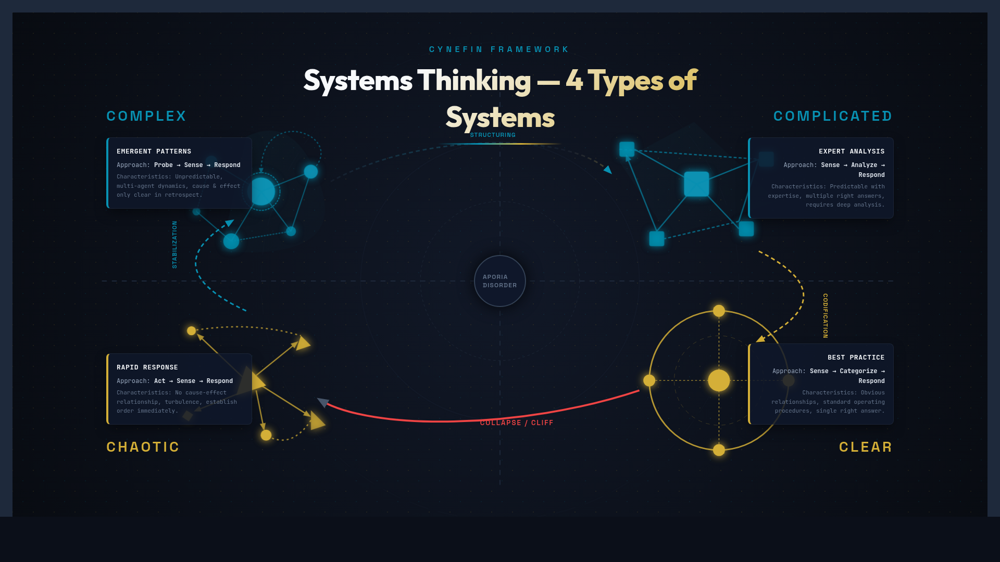
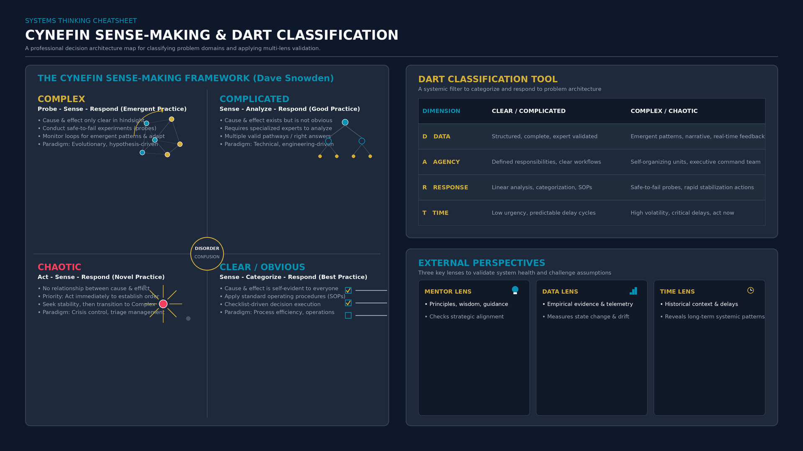

<!-- _class: title -->

# Systems Thinking: 4 Types

See Hidden Patterns — Solve Problems at the Root

<!-- Speaker: Systems thinking helps us see patterns hidden in complexity. The core insight: different types of problems need different types of responses. Using the wrong approach guarantees failure regardless of effort. -->

---

<!-- _class: cheatsheet -->
<!-- _backgroundColor: #f8f7f4 -->

<!-- Speaker: 4 types at a glance — Clear, Complicated, Complex, Chaotic — each with a distinct response pattern. DART helps you classify which one you're in. -->

---

## Systems Thinking Sees What Analysis Misses

The wrong response to the right problem still fails — domain classification is the first step.

<svg viewBox="0 0 1100 320" width="100%" xmlns="http://www.w3.org/2000/svg">
  <rect x="40" y="20" width="1020" height="280" rx="16" fill="var(--paper)" stroke="var(--soft-2)" stroke-width="1.5" style="filter:drop-shadow(0 4px 12px rgba(15,23,42,.08))"/>
  <rect x="40" y="20" width="8" height="280" rx="4" fill="var(--accent)"/>
  <!-- Row 1: labels -->
  <text x="140" y="68" font-size="14" font-weight="700" fill="var(--accent)" text-anchor="middle" font-family="system-ui">CLEAR</text>
  <text x="360" y="68" font-size="14" font-weight="700" fill="var(--accent)" text-anchor="middle" font-family="system-ui">COMPLICATED</text>
  <text x="600" y="68" font-size="14" font-weight="700" fill="var(--gold)" text-anchor="middle" font-family="system-ui">COMPLEX</text>
  <text x="860" y="68" font-size="14" font-weight="700" fill="var(--danger)" text-anchor="middle" font-family="system-ui">CHAOTIC</text>
  <!-- Row 2: patterns -->
  <rect x="80" y="80" width="120" height="36" rx="6" fill="var(--accent)" opacity=".1"/>
  <text x="140" y="103" font-size="12" fill="var(--accent-deep)" text-anchor="middle" font-family="system-ui">Sense-Cat-Respond</text>
  <rect x="280" y="80" width="160" height="36" rx="6" fill="var(--accent)" opacity=".1"/>
  <text x="360" y="103" font-size="12" fill="var(--accent-deep)" text-anchor="middle" font-family="system-ui">Sense-Analyze-Respond</text>
  <rect x="520" y="80" width="160" height="36" rx="6" fill="var(--gold)" opacity=".12"/>
  <text x="600" y="103" font-size="12" fill="var(--warning-ink)" text-anchor="middle" font-family="system-ui">Probe-Sense-Respond</text>
  <rect x="780" y="80" width="160" height="36" rx="6" fill="var(--danger-wash)"/>
  <text x="860" y="103" font-size="12" fill="var(--danger-ink)" text-anchor="middle" font-family="system-ui">Act-Sense-Respond</text>
  <!-- Row 3: tools -->
  <text x="140" y="145" font-size="12" fill="var(--ink-dim)" text-anchor="middle" font-family="system-ui">Checklist / SOP</text>
  <text x="360" y="145" font-size="12" fill="var(--ink-dim)" text-anchor="middle" font-family="system-ui">Expert + Analysis</text>
  <text x="600" y="145" font-size="12" fill="var(--ink-dim)" text-anchor="middle" font-family="system-ui">Safe-to-fail Experiments</text>
  <text x="860" y="145" font-size="12" fill="var(--ink-dim)" text-anchor="middle" font-family="system-ui">Stabilize First</text>
  <!-- Row 4: cause-effect -->
  <text x="140" y="185" font-size="11" fill="var(--muted)" text-anchor="middle" font-family="system-ui">Known / Predictable</text>
  <text x="360" y="185" font-size="11" fill="var(--muted)" text-anchor="middle" font-family="system-ui">Discoverable by experts</text>
  <text x="600" y="185" font-size="11" fill="var(--muted)" text-anchor="middle" font-family="system-ui">Retrospective only</text>
  <text x="860" y="185" font-size="11" fill="var(--muted)" text-anchor="middle" font-family="system-ui">No visible pattern</text>
  <!-- Ordered / Unordered labels -->
  <line x1="480" y1="210" x2="480" y2="280" stroke="var(--soft-2)" stroke-width="1.5" stroke-dasharray="4,3"/>
  <rect x="90" y="220" width="350" height="36" rx="8" fill="var(--accent-wash)"/>
  <text x="265" y="243" font-size="13" font-weight="700" fill="var(--accent-deep)" text-anchor="middle" font-family="system-ui">Ordered — cause-effect known or findable</text>
  <rect x="500" y="220" width="520" height="36" rx="8" fill="var(--warning-wash)"/>
  <text x="760" y="243" font-size="13" font-weight="700" fill="var(--warning-ink)" text-anchor="middle" font-family="system-ui">Unordered — cause-effect unknown until after</text>
  <rect x="0" y="0" width="1" height="1" fill="none"/>
</svg>

<b>★ Takeaway:</b> ระบุ domain ก่อนเสมอ — wrong response + right effort ยังคือความล้มเหลว

<!-- Speaker: This summary table is the core of the whole talk. Every framework, every tool, every decision method is downstream of this classification. -->

---

## Clear Systems: Use Checklists, Not Creativity

Cause-effect is predictable — best practices are known, repeatable, and already proven.

<svg viewBox="0 0 1100 300" width="100%" xmlns="http://www.w3.org/2000/svg">
  <!-- Arrow flow: Sense → Categorize → Respond -->
  <rect x="60" y="100" width="220" height="80" rx="12" fill="var(--paper)" stroke="var(--accent)" stroke-width="2" style="filter:drop-shadow(var(--shadow-md))"/>
  <text x="170" y="133" font-size="14" font-weight="700" fill="var(--accent)" text-anchor="middle" font-family="system-ui">SENSE</text>
  <text x="170" y="155" font-size="12" fill="var(--ink-dim)" text-anchor="middle" font-family="system-ui">Observe the situation</text>
  <text x="170" y="172" font-size="11" fill="var(--muted)" text-anchor="middle" font-family="system-ui">What type is this?</text>
  <line x1="280" y1="140" x2="340" y2="140" stroke="var(--accent)" stroke-width="2"/>
  <polygon points="336,134 346,140 336,146" fill="var(--accent)"/>
  <rect x="345" y="100" width="220" height="80" rx="12" fill="var(--paper)" stroke="var(--accent)" stroke-width="2" style="filter:drop-shadow(var(--shadow-md))"/>
  <text x="455" y="133" font-size="14" font-weight="700" fill="var(--accent)" text-anchor="middle" font-family="system-ui">CATEGORIZE</text>
  <text x="455" y="155" font-size="12" fill="var(--ink-dim)" text-anchor="middle" font-family="system-ui">Match to known pattern</text>
  <text x="455" y="172" font-size="11" fill="var(--muted)" text-anchor="middle" font-family="system-ui">Which checklist applies?</text>
  <line x1="565" y1="140" x2="625" y2="140" stroke="var(--accent)" stroke-width="2"/>
  <polygon points="621,134 631,140 621,146" fill="var(--accent)"/>
  <rect x="630" y="100" width="220" height="80" rx="12" fill="var(--accent)" opacity=".1" stroke="var(--accent)" stroke-width="2" style="filter:drop-shadow(var(--shadow-md))"/>
  <text x="740" y="133" font-size="14" font-weight="700" fill="var(--accent-deep)" text-anchor="middle" font-family="system-ui">RESPOND</text>
  <text x="740" y="155" font-size="12" fill="var(--ink-dim)" text-anchor="middle" font-family="system-ui">Apply best practice</text>
  <text x="740" y="172" font-size="11" fill="var(--muted)" text-anchor="middle" font-family="system-ui">Execute SOP / checklist</text>
  <!-- Warning box -->
  <rect x="880" y="90" width="190" height="100" rx="10" fill="var(--warning-wash)" stroke="var(--warning)" stroke-width="1.5"/>
  <text x="975" y="120" font-size="12" font-weight="700" fill="var(--warning-ink)" text-anchor="middle" font-family="system-ui">Watch out:</text>
  <text x="975" y="140" font-size="11" fill="var(--warning-ink)" text-anchor="middle" font-family="system-ui">Complacency trap</text>
  <text x="975" y="158" font-size="11" fill="var(--ink-dim)" text-anchor="middle" font-family="system-ui">When context shifts</text>
  <text x="975" y="175" font-size="11" fill="var(--ink-dim)" text-anchor="middle" font-family="system-ui">old checklist still runs</text>
  <rect x="0" y="0" width="1" height="1" fill="none"/>
</svg>

<b>★ Takeaway:</b> Clear = ใช้ checklist/SOP — creativity และ expert analysis เป็นการเสียเวลาสำหรับปัญหาประเภทนี้

<!-- Speaker: The danger of Clear systems is success breeds complacency. When everything works on autopilot, teams stop questioning whether the context has shifted. -->

---

## Complicated Systems: Bring in the Experts

Answer exists — but requires expertise and analysis to discover among multiple valid options.

<svg viewBox="0 0 1100 300" width="100%" xmlns="http://www.w3.org/2000/svg">
  <rect x="60" y="100" width="220" height="80" rx="12" fill="var(--paper)" stroke="var(--accent)" stroke-width="2" style="filter:drop-shadow(var(--shadow-md))"/>
  <text x="170" y="133" font-size="14" font-weight="700" fill="var(--accent)" text-anchor="middle" font-family="system-ui">SENSE</text>
  <text x="170" y="155" font-size="12" fill="var(--ink-dim)" text-anchor="middle" font-family="system-ui">Gather facts &amp; data</text>
  <text x="170" y="172" font-size="11" fill="var(--muted)" text-anchor="middle" font-family="system-ui">What do we know?</text>
  <line x1="280" y1="140" x2="340" y2="140" stroke="var(--accent)" stroke-width="2"/>
  <polygon points="336,134 346,140 336,146" fill="var(--accent)"/>
  <rect x="345" y="90" width="240" height="100" rx="12" fill="var(--paper)" stroke="var(--accent)" stroke-width="2" style="filter:drop-shadow(var(--shadow-md))"/>
  <text x="465" y="128" font-size="14" font-weight="700" fill="var(--accent)" text-anchor="middle" font-family="system-ui">ANALYZE</text>
  <text x="465" y="148" font-size="12" fill="var(--ink-dim)" text-anchor="middle" font-family="system-ui">Expert + Root cause</text>
  <text x="465" y="166" font-size="11" fill="var(--muted)" text-anchor="middle" font-family="system-ui">Multiple valid options</text>
  <text x="465" y="182" font-size="11" fill="var(--muted)" text-anchor="middle" font-family="system-ui">Good practice (not best)</text>
  <line x1="585" y1="140" x2="645" y2="140" stroke="var(--accent)" stroke-width="2"/>
  <polygon points="641,134 651,140 641,146" fill="var(--accent)"/>
  <rect x="650" y="100" width="220" height="80" rx="12" fill="var(--accent)" opacity=".1" stroke="var(--accent)" stroke-width="2" style="filter:drop-shadow(var(--shadow-md))"/>
  <text x="760" y="133" font-size="14" font-weight="700" fill="var(--accent-deep)" text-anchor="middle" font-family="system-ui">RESPOND</text>
  <text x="760" y="155" font-size="12" fill="var(--ink-dim)" text-anchor="middle" font-family="system-ui">Apply expert solution</text>
  <text x="760" y="172" font-size="11" fill="var(--muted)" text-anchor="middle" font-family="system-ui">Document learnings</text>
  <!-- Expert trap warning -->
  <rect x="880" y="90" width="190" height="100" rx="10" fill="var(--danger-wash)" stroke="var(--danger)" stroke-width="1.5"/>
  <text x="975" y="120" font-size="12" font-weight="700" fill="var(--danger-ink)" text-anchor="middle" font-family="system-ui">Expert trap:</text>
  <text x="975" y="140" font-size="11" fill="var(--danger-ink)" text-anchor="middle" font-family="system-ui">Forcing Complex</text>
  <text x="975" y="158" font-size="11" fill="var(--ink-dim)" text-anchor="middle" font-family="system-ui">problems into this</text>
  <text x="975" y="175" font-size="11" fill="var(--ink-dim)" text-anchor="middle" font-family="system-ui">domain to use expertise</text>
  <rect x="0" y="0" width="1" height="1" fill="none"/>
</svg>

<b>★ Takeaway:</b> Complicated = Sense-Analyze-Respond — ผู้เชี่ยวชาญจำเป็น แต่ต้องระวัง expert bias ที่ force ปัญหา Complex เข้า domain นี้

<!-- Speaker: The expert trap is real — specialists tend to see all problems as analyzable. Watch for experts who resist "we don't know yet" as an answer. -->

---

## Complex Systems: Experiment First, Understand Later

No answer exists upfront — patterns emerge through action, understood only in retrospect.

<svg viewBox="0 0 1100 320" width="100%" xmlns="http://www.w3.org/2000/svg">
  <!-- Probe-Sense-Respond cycle -->
  <rect x="60" y="100" width="220" height="100" rx="12" fill="var(--paper)" stroke="var(--gold)" stroke-width="2" style="filter:drop-shadow(var(--shadow-md))"/>
  <text x="170" y="135" font-size="14" font-weight="700" fill="var(--warning-ink)" text-anchor="middle" font-family="system-ui">PROBE</text>
  <text x="170" y="157" font-size="12" fill="var(--ink-dim)" text-anchor="middle" font-family="system-ui">Safe-to-fail experiment</text>
  <text x="170" y="177" font-size="11" fill="var(--muted)" text-anchor="middle" font-family="system-ui">Small scope, real context</text>
  <text x="170" y="193" font-size="11" fill="var(--muted)" text-anchor="middle" font-family="system-ui">Fail = data, not disaster</text>
  <line x1="280" y1="150" x2="340" y2="150" stroke="var(--gold)" stroke-width="2"/>
  <polygon points="336,144 346,150 336,156" fill="var(--gold)"/>
  <rect x="345" y="100" width="220" height="100" rx="12" fill="var(--paper)" stroke="var(--gold)" stroke-width="2" style="filter:drop-shadow(var(--shadow-md))"/>
  <text x="455" y="135" font-size="14" font-weight="700" fill="var(--warning-ink)" text-anchor="middle" font-family="system-ui">SENSE</text>
  <text x="455" y="157" font-size="12" fill="var(--ink-dim)" text-anchor="middle" font-family="system-ui">Observe what emerged</text>
  <text x="455" y="177" font-size="11" fill="var(--muted)" text-anchor="middle" font-family="system-ui">What patterns appeared?</text>
  <text x="455" y="193" font-size="11" fill="var(--muted)" text-anchor="middle" font-family="system-ui">What surprised you?</text>
  <line x1="565" y1="150" x2="625" y2="150" stroke="var(--gold)" stroke-width="2"/>
  <polygon points="621,144 631,150 621,156" fill="var(--gold)"/>
  <rect x="630" y="100" width="220" height="100" rx="12" fill="var(--gold)" opacity=".1" stroke="var(--gold)" stroke-width="2" style="filter:drop-shadow(var(--shadow-md))"/>
  <text x="740" y="135" font-size="14" font-weight="700" fill="var(--warning-ink)" text-anchor="middle" font-family="system-ui">RESPOND</text>
  <text x="740" y="157" font-size="12" fill="var(--ink-dim)" text-anchor="middle" font-family="system-ui">Amplify what works</text>
  <text x="740" y="177" font-size="11" fill="var(--muted)" text-anchor="middle" font-family="system-ui">Dampen what doesn't</text>
  <text x="740" y="193" font-size="11" fill="var(--muted)" text-anchor="middle" font-family="system-ui">Iterate → new probe</text>
  <!-- Feedback loop arrow -->
  <path d="M 850 150 C 920 150 940 260 850 270 C 760 280 300 275 250 265 C 140 255 100 210 95 200" stroke="var(--gold)" stroke-width="1.5" fill="none" stroke-dasharray="5,3" opacity=".6"/>
  <polygon points="95,210 89,198 101,198" fill="var(--gold)" opacity=".6"/>
  <text x="540" y="290" font-size="11" fill="var(--gold)" text-anchor="middle" font-family="system-ui">Continuous feedback loop</text>
  <rect x="0" y="0" width="1" height="1" fill="none"/>
</svg>

<b>★ Takeaway:</b> Complex = Probe-Sense-Respond — ปัญหาองค์กรวัฒนธรรม, product ใหม่, scaling; ทดลองเร็วถูกกว่าแผนที่สมบูรณ์

<!-- Speaker: The feedback loop arrow is the key visual — this isn't a one-shot process. You probe, learn, probe again. Over-planning is as dangerous as under-planning here. -->

---

## Chaotic Systems: Act First, Analyze Second

No cause-effect visible — stabilize the situation immediately before attempting analysis.

<svg viewBox="0 0 1100 300" width="100%" xmlns="http://www.w3.org/2000/svg">
  <rect x="60" y="90" width="220" height="100" rx="12" fill="var(--danger-wash)" stroke="var(--danger)" stroke-width="2" style="filter:drop-shadow(var(--shadow-md))"/>
  <text x="170" y="128" font-size="14" font-weight="700" fill="var(--danger-ink)" text-anchor="middle" font-family="system-ui">ACT</text>
  <text x="170" y="150" font-size="12" fill="var(--ink-dim)" text-anchor="middle" font-family="system-ui">Decisive immediate action</text>
  <text x="170" y="170" font-size="11" fill="var(--muted)" text-anchor="middle" font-family="system-ui">No time to analyze</text>
  <text x="170" y="186" font-size="11" fill="var(--danger-ink)" text-anchor="middle" font-family="system-ui">Stop the bleeding first</text>
  <line x1="280" y1="140" x2="340" y2="140" stroke="var(--danger)" stroke-width="2"/>
  <polygon points="336,134 346,140 336,146" fill="var(--danger)"/>
  <rect x="345" y="100" width="220" height="80" rx="12" fill="var(--paper)" stroke="var(--danger)" stroke-width="2" style="filter:drop-shadow(var(--shadow-md))"/>
  <text x="455" y="133" font-size="14" font-weight="700" fill="var(--danger-ink)" text-anchor="middle" font-family="system-ui">SENSE</text>
  <text x="455" y="155" font-size="12" fill="var(--ink-dim)" text-anchor="middle" font-family="system-ui">What has stabilized?</text>
  <text x="455" y="172" font-size="11" fill="var(--muted)" text-anchor="middle" font-family="system-ui">Assess immediate state</text>
  <line x1="565" y1="140" x2="625" y2="140" stroke="var(--success)" stroke-width="2"/>
  <polygon points="621,134 631,140 621,146" fill="var(--success)"/>
  <rect x="630" y="100" width="220" height="80" rx="12" fill="var(--success-wash)" stroke="var(--success)" stroke-width="2" style="filter:drop-shadow(var(--shadow-md))"/>
  <text x="740" y="128" font-size="14" font-weight="700" fill="var(--success-ink)" text-anchor="middle" font-family="system-ui">RESPOND</text>
  <text x="740" y="148" font-size="12" fill="var(--success-ink)" text-anchor="middle" font-family="system-ui">Transition to Complex</text>
  <text x="740" y="165" font-size="11" fill="var(--muted)" text-anchor="middle" font-family="system-ui">Then Complicated</text>
  <text x="740" y="182" font-size="11" fill="var(--muted)" text-anchor="middle" font-family="system-ui">Goal: leave Chaotic fast</text>
  <!-- Hero mode warning -->
  <rect x="880" y="80" width="190" height="120" rx="10" fill="var(--danger-wash)" stroke="var(--danger)" stroke-width="1.5"/>
  <text x="975" y="112" font-size="12" font-weight="700" fill="var(--danger-ink)" text-anchor="middle" font-family="system-ui">Hero mode trap:</text>
  <text x="975" y="132" font-size="11" fill="var(--danger-ink)" text-anchor="middle" font-family="system-ui">Leaders who enjoy</text>
  <text x="975" y="150" font-size="11" fill="var(--ink-dim)" text-anchor="middle" font-family="system-ui">chaos maintain it</text>
  <text x="975" y="168" font-size="11" fill="var(--ink-dim)" text-anchor="middle" font-family="system-ui">instead of resolving</text>
  <text x="975" y="186" font-size="11" fill="var(--danger-ink)" text-anchor="middle" font-family="system-ui">it. Watch for this.</text>
  <rect x="0" y="0" width="1" height="1" fill="none"/>
</svg>

<b>★ Takeaway:</b> Chaotic = Act-Sense-Respond — เป้าหมายคือออกจาก Chaotic ให้เร็วที่สุด ไม่ใช่คงอยู่ใน "hero mode"

<!-- Speaker: The transition arrow to Complex is deliberate — Chaotic is not a permanent state. The goal is always to stabilize, learn, and move toward more ordered domains. -->

---

## DART: Classify Before You Respond

Four questions that identify which domain you're operating in before choosing a response pattern.

  

    
D — Domain Clarity

    <h3>How clear is cause-effect?</h3>
    
Known and predictable → Clear. Discoverable with analysis → Complicated. Only retrospective → Complex. Invisible now → Chaotic.

  

  

    
A — Actor Variety

    <h3>How many parties are involved?</h3>
    
Few, predictable actors → Ordered domain. Many independent actors with emergent behavior → Unordered domain (Complex or Chaotic).

  

  

    
R — Response Options

    <h3>Does a playbook exist?</h3>
    
Established SOP exists → Clear. Expert can analyze → Complicated. Must experiment to discover → Complex. Must act now → Chaotic.

  

  

    
T — Time Pressure

    <h3>How much time to analyze?</h3>
    
Ample time, known solution → Clear/Complicated. Time to run small experiments → Complex. No time at all → Chaotic; act first.

  

<b>★ Takeaway:</b> DART → domain → response pattern — ตอบทั้ง 4 คำถามก่อนตัดสินใจว่าจะ respond อย่างไร

<!-- Speaker: DART is a classification heuristic, not an algorithm. The four questions push you to think about context before reaching for your default tool. -->

---

## 3 External Perspectives That Help You See Clearly

We can't accurately classify the system we're inside — external input corrects our blind spots.

  

    
Perspective 1

    <h3>Mentor / Advisor</h3>
    
Someone who has operated in similar systems before. Pattern recognition from past experience can confirm: "this is Complicated — there's an answer, keep analyzing" or "this is Complex — stop planning, start experimenting."

  

  

    
Perspective 2

    <h3>Data</h3>
    
Leading indicators that track feedback loops. Is your response moving the system in the intended direction? Are unexpected emergent behaviors appearing? Data surfaces what intuition misses.

  

  

    
Perspective 3

    <h3>Time</h3>
    
Complex system patterns often clarify in retrospect. Sometimes the best move is a small probe + wait for the signal. Premature commitment with insufficient data costs more than a short pause to observe.

  

<b>★ Takeaway:</b> อย่าประเมิน domain ของระบบที่ตัวเองอยู่ใน คนเดียว — mentor, data, หรือ time ให้มุมมองที่ unbiased กว่าเสมอ

<!-- Speaker: The hardest part of systems thinking is that you're inside the system you're trying to classify. These three external inputs are the antidote to tunnel vision. -->

---

## The Hardest System to Improve: Your Own Mental Model

Cognitive bias makes us misclassify domains — and the pattern repeats until you build a habit of checking.

  

    
The Problem

    <h3>3 Mental Model Bugs</h3>
    <ul>
      <li><b>Domain misclassification:</b> Experience bias makes Complex look Complicated — we reach for experts instead of experiments</li>
      <li><b>Availability heuristic:</b> We pull the last solution that worked, even when context has changed</li>
      <li><b>Tunnel vision:</b> Being inside the system blinds us to its actual domain</li>
    </ul>
  

  

    
The Fix

    <h3>3 Habits to Build</h3>
    <ul>
      <li><b>Domain check habit:</b> Before every decision — "which of the 4 domains is this?" (30-second pause)</li>
      <li><b>Seek external input:</b> Mentor, data, or deliberate waiting — especially for high-stakes decisions</li>
      <li><b>Post-mortem question:</b> "Did I classify the domain correctly from the start?" — learn from each mismatch</li>
    </ul>
  

<b>★ Takeaway:</b> กรอบความคิดในหัวเราคือระบบ Complex — ต้องทดลอง, สังเกต, และปรับ ไม่ใช่แค่รู้แล้วทำตาม

<!-- Speaker: The meta-lesson: our mental models are themselves Complex systems. You can't think your way to better thinking — you have to probe (try new approach), sense (what happened), and respond (adjust). -->

---

## Key Takeaways: One Framework, Four Responses

Systems thinking works only when the response matches the domain — not just the effort level.

  

    
Clear

    <h3>Sense-Categorize-Respond</h3>
    
Checklists + SOP. Watch for complacency when context shifts.

  

  

    
Complicated

    <h3>Sense-Analyze-Respond</h3>
    
Experts + analysis. Watch for expert trap forcing Complex into this.

  

  

    
Complex

    <h3>Probe-Sense-Respond</h3>
    
Safe-to-fail experiments. Patterns emerge — don't over-plan.

  

  

    
Chaotic

    <h3>Act-Sense-Respond</h3>
    
Stabilize immediately. Goal: leave Chaotic fast, avoid hero mode.

  

  

    
DART

    <h3>Classify First</h3>
    
Domain clarity, Actor variety, Response options, Time pressure.

  

  

    
Hardest System

    <h3>Your Mental Model</h3>
    
Use mentor + data + time. Post-mortem domain classification every time.

  

<b>★ Takeaway:</b> ถามก่อนทุกครั้ง: "domain นี้คืออะไร?" — คำถามนั้นเพียงข้อเดียวเปลี่ยนคุณภาพของการตัดสินใจได้

<!-- Speaker: Close with the one habit: before any response, classify the domain. 30 seconds of DART is worth hours of misaligned effort. -->
