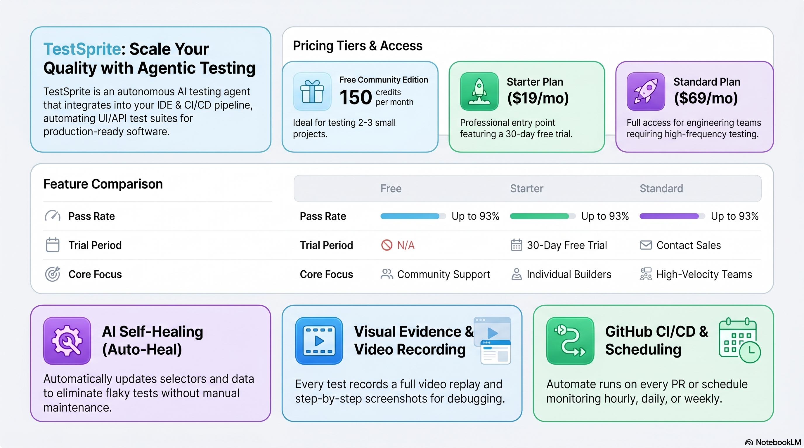

<!-- _class: title -->

# TestSprite: AI Testing Agent

ทดสอบแอปฯ อัตโนมัติหลัง AI เขียนโค้ด — ผ่าน MCP + Claude Code

<!-- Speaker: TestSprite closes the gap between AI-generated code and production-ready software. In 10 slides: the problem, how TestSprite solves it, setup walkthrough, caveats. -->

---

## The Missing Layer in AI Coding Workflows

AI writes code fast — but testing still falls on humans, until now.

<svg viewBox="0 0 1100 360" width="100%" xmlns="http://www.w3.org/2000/svg">
  <!-- callout-box with 3-point summary -->
  <rect x="40" y="30" width="1020" height="290" rx="16" fill="var(--paper)" stroke="var(--soft-2)" stroke-width="1.5" style="filter:drop-shadow(0 4px 12px rgba(15,23,42,.08))"/>
  <rect x="40" y="30" width="8" height="290" rx="4" fill="var(--accent)"/>
  <!-- icon circle -->
  <circle cx="130" cy="175" r="44" fill="var(--accent)" opacity=".1"/>
  <circle cx="130" cy="175" r="30" fill="var(--accent)" opacity=".2"/>
  <!-- lightning bolt icon simplified -->
  <text x="130" y="182" font-size="28" text-anchor="middle" font-family="system-ui" fill="var(--accent)" font-weight="700">?</text>
  <!-- main claim -->
  <text x="210" y="120" font-size="22" font-weight="700" fill="var(--ink)" font-family="system-ui">AI-generated code ships fast — testing lags behind</text>
  <text x="210" y="158" font-size="15" fill="var(--ink-dim)" font-family="system-ui">Claude Code builds a feature in 5 min; writing tests still takes hours manually</text>
  <text x="210" y="190" font-size="15" fill="var(--ink-dim)" font-family="system-ui">TestSprite = the autonomous testing agent that closes this gap via MCP</text>
  <text x="210" y="230" font-size="15" fill="var(--muted)" font-family="system-ui">Pass rate: 42% (AI alone) → 93% after first iteration with TestSprite</text>
  <rect x="1" y="1" width="1" height="1" fill="none"/>
</svg>

<b>★ Takeaway:</b> TestSprite is the missing testing layer — pairs with coding agents so AI-generated code becomes production-ready.

<!-- Speaker: The "vibe coding" era creates a new bottleneck — testing. TestSprite is purpose-built for this. -->

---

## AI Alone vs. AI + TestSprite: 42% to 93% Pass Rate

Benchmark from TestSprite shows the difference one testing agent makes.

<svg viewBox="0 0 1100 340" width="100%" xmlns="http://www.w3.org/2000/svg">
  <!-- Left panel: AI alone -->
  <rect x="40" y="20" width="480" height="300" rx="12" fill="var(--paper)" stroke="var(--soft-2)" stroke-width="1.5" style="filter:drop-shadow(var(--shadow-sm))"/>
  <rect x="40" y="20" width="480" height="52" rx="12" fill="var(--soft)" opacity=".9"/>
  <text x="280" y="51" font-size="16" font-weight="700" fill="var(--ink-dim)" text-anchor="middle" font-family="system-ui">AI Coding Agent Only</text>
  <!-- bar chart: 42% -->
  <rect x="100" y="200" width="360" height="20" rx="4" fill="var(--soft-2)"/>
  <rect x="100" y="200" width="151" height="20" rx="4" fill="var(--danger)"/>
  <text x="100" y="190" font-size="13" fill="var(--ink-dim)" font-family="system-ui">Pass rate</text>
  <text x="265" y="190" font-size="13" fill="var(--danger)" font-family="system-ui" font-weight="700">42%</text>
  <text x="100" y="252" font-size="13" fill="var(--muted)" font-family="system-ui">No automated E2E coverage</text>
  <text x="100" y="275" font-size="13" fill="var(--muted)" font-family="system-ui">Regressions reach production</text>
  <!-- Right panel: AI + TestSprite -->
  <rect x="580" y="20" width="480" height="300" rx="12" fill="var(--paper)" stroke="var(--accent)" stroke-width="2" style="filter:drop-shadow(var(--shadow-md))"/>
  <rect x="580" y="20" width="480" height="52" rx="12" fill="var(--accent)" opacity=".08"/>
  <text x="820" y="51" font-size="16" font-weight="700" fill="var(--accent)" text-anchor="middle" font-family="system-ui">AI Coding + TestSprite</text>
  <!-- bar chart: 93% -->
  <rect x="640" y="200" width="360" height="20" rx="4" fill="var(--soft-2)"/>
  <rect x="640" y="200" width="335" height="20" rx="4" fill="var(--success)"/>
  <text x="640" y="190" font-size="13" fill="var(--ink-dim)" font-family="system-ui">Pass rate</text>
  <text x="985" y="190" font-size="13" fill="var(--success)" font-family="system-ui" font-weight="700">93%</text>
  <text x="640" y="252" font-size="13" fill="var(--ink)" font-family="system-ui">Autonomous test generation + repair</text>
  <text x="640" y="275" font-size="13" fill="var(--ink)" font-family="system-ui">Regressions caught before merge</text>
  <!-- VS badge -->
  <circle cx="530" cy="170" r="26" fill="var(--accent)"/>
  <text x="530" y="175" font-size="13" font-weight="700" fill="var(--paper)" text-anchor="middle" dominant-baseline="central" font-family="system-ui">VS</text>
  <rect x="0" y="0" width="1" height="1" fill="none"/>
</svg>

<b>★ Takeaway:</b> Adding TestSprite to the AI coding loop boosts production-readiness from 42% to 93% in one iteration.

<!-- Speaker: These numbers come from TestSprite's own benchmarks vs GPT, Claude Sonnet, DeepSeek outputs. The point: coding agents need a testing peer. -->

---

## TestSprite Architecture: End-to-End Loop

Developer → Claude Code → TestSprite → cloud sandbox → fix recommendations → repeat.

<figure class="img-card">

<figcaption>Source: NotebookLM · TestSprite autonomous feedback loop — intent parsing, test gen, sandbox execution, fix delivery</figcaption>
</figure>

<b>★ Takeaway:</b> The loop is complete inside one IDE session — code, test, fix, repeat without switching tools.

<!-- Speaker: 4 stages: understand intent (PRD/codebase), generate Playwright+Python tests, run in cloud sandbox, return structured fixes to Claude. No manual steps. -->

---

## MCP Setup: Three Steps to Connect TestSprite

Install npm package, add API key, confirm active — then prompt Claude in plain English.

<svg viewBox="0 0 1100 320" width="100%" xmlns="http://www.w3.org/2000/svg">
  <!-- 4-step arrow flow -->
  <!-- Step 1 -->
  <rect x="30" y="80" width="220" height="160" rx="12" fill="var(--accent-wash)" stroke="var(--accent)" stroke-width="1.5"/>
  <circle cx="140" cy="118" r="22" fill="var(--accent)"/>
  <text x="140" y="124" font-size="16" font-weight="700" fill="var(--paper)" text-anchor="middle" dominant-baseline="central" font-family="system-ui">1</text>
  <text x="140" y="158" font-size="14" font-weight="700" fill="var(--ink)" text-anchor="middle" font-family="system-ui">Install MCP</text>
  <text x="140" y="178" font-size="12" fill="var(--ink-dim)" text-anchor="middle" font-family="system-ui">npx @testsprite/</text>
  <text x="140" y="196" font-size="12" fill="var(--ink-dim)" text-anchor="middle" font-family="system-ui">testsprite-mcp init</text>
  <text x="140" y="216" font-size="11" fill="var(--muted)" text-anchor="middle" font-family="system-ui">scope: project</text>
  <!-- Arrow 1 -->
  <path d="M260 160 L290 160" stroke="var(--accent)" stroke-width="2.5" fill="none"/>
  <polygon points="290,154 302,160 290,166" fill="var(--accent)"/>
  <!-- Step 2 -->
  <rect x="310" y="80" width="220" height="160" rx="12" fill="var(--accent-wash)" stroke="var(--accent)" stroke-width="1.5"/>
  <circle cx="420" cy="118" r="22" fill="var(--accent)"/>
  <text x="420" y="124" font-size="16" font-weight="700" fill="var(--paper)" text-anchor="middle" dominant-baseline="central" font-family="system-ui">2</text>
  <text x="420" y="158" font-size="14" font-weight="700" fill="var(--ink)" text-anchor="middle" font-family="system-ui">Add API Key</text>
  <text x="420" y="178" font-size="12" fill="var(--ink-dim)" text-anchor="middle" font-family="system-ui">mcp.json: set</text>
  <text x="420" y="196" font-size="12" fill="var(--ink-dim)" text-anchor="middle" font-family="system-ui">"token": "YOUR_KEY"</text>
  <text x="420" y="216" font-size="11" fill="var(--muted)" text-anchor="middle" font-family="system-ui">from dashboard</text>
  <!-- Arrow 2 -->
  <path d="M540 160 L570 160" stroke="var(--accent)" stroke-width="2.5" fill="none"/>
  <polygon points="570,154 582,160 570,166" fill="var(--accent)"/>
  <!-- Step 3 -->
  <rect x="590" y="80" width="220" height="160" rx="12" fill="var(--accent-wash)" stroke="var(--accent)" stroke-width="1.5"/>
  <circle cx="700" cy="118" r="22" fill="var(--accent)"/>
  <text x="700" y="124" font-size="16" font-weight="700" fill="var(--paper)" text-anchor="middle" dominant-baseline="central" font-family="system-ui">3</text>
  <text x="700" y="158" font-size="14" font-weight="700" fill="var(--ink)" text-anchor="middle" font-family="system-ui">Confirm Active</text>
  <text x="700" y="178" font-size="12" fill="var(--ink-dim)" text-anchor="middle" font-family="system-ui">claude mcp list</text>
  <text x="700" y="196" font-size="12" fill="var(--ink-dim)" text-anchor="middle" font-family="system-ui">testsprite visible</text>
  <text x="700" y="216" font-size="11" fill="var(--muted)" text-anchor="middle" font-family="system-ui">in output</text>
  <!-- Arrow 3 -->
  <path d="M820 160 L850 160" stroke="var(--accent)" stroke-width="2.5" fill="none"/>
  <polygon points="850,154 862,160 850,166" fill="var(--accent)"/>
  <!-- Step 4 — green: run -->
  <rect x="870" y="80" width="200" height="160" rx="12" fill="var(--success-wash)" stroke="var(--success)" stroke-width="2"/>
  <circle cx="970" cy="118" r="22" fill="var(--success)"/>
  <text x="970" y="124" font-size="16" font-weight="700" fill="var(--paper)" text-anchor="middle" dominant-baseline="central" font-family="system-ui">4</text>
  <text x="970" y="158" font-size="14" font-weight="700" fill="var(--success-ink)" text-anchor="middle" font-family="system-ui">Prompt Claude</text>
  <text x="970" y="178" font-size="12" fill="var(--ink-dim)" text-anchor="middle" font-family="system-ui">"test this app</text>
  <text x="970" y="196" font-size="12" fill="var(--ink-dim)" text-anchor="middle" font-family="system-ui">using testsprite"</text>
  <text x="970" y="216" font-size="11" fill="var(--muted)" text-anchor="middle" font-family="system-ui">natural language</text>
  <rect x="0" y="0" width="1" height="1" fill="none"/>
</svg>

<b>★ Takeaway:</b> Setup takes under 5 minutes — install, key, confirm, then natural language kicks off the entire test cycle.

<!-- Speaker: Step 4 is all you type from day 2 onward. Claude handles the rest: feature-map, test plan, test run, fix delivery. -->

---

## Video Recording Beats Stack Traces Every Time

See exactly what the browser did — not just the line that failed.

<svg viewBox="0 0 1100 320" width="100%" xmlns="http://www.w3.org/2000/svg">
  <!-- Left: old way — log trace -->
  <rect x="30" y="20" width="480" height="280" rx="12" fill="var(--paper)" stroke="var(--soft-2)" stroke-width="1.5" style="filter:drop-shadow(var(--shadow-sm))"/>
  <rect x="30" y="20" width="480" height="48" rx="12" fill="var(--danger-wash)"/>
  <text x="270" y="49" font-size="15" font-weight="700" fill="var(--danger-ink)" text-anchor="middle" font-family="system-ui">Log-only Debugging</text>
  <!-- code-like lines -->
  <rect x="54" y="86" width="432" height="14" rx="3" fill="var(--soft-2)"/>
  <rect x="54" y="108" width="380" height="14" rx="3" fill="var(--soft-2)"/>
  <rect x="54" y="130" width="410" height="14" rx="3" fill="var(--danger-wash)"/>
  <rect x="54" y="152" width="300" height="14" rx="3" fill="var(--soft-2)"/>
  <rect x="54" y="174" width="350" height="14" rx="3" fill="var(--soft-2)"/>
  <text x="54" y="102" font-size="11" fill="var(--muted)" font-family="monospace">AssertionError: expected element</text>
  <text x="54" y="124" font-size="11" fill="var(--muted)" font-family="monospace">at Object.toBeVisible (line 47)</text>
  <text x="54" y="146" font-size="11" fill="var(--danger)" font-family="monospace">FAIL: dashboard.filter.test.ts</text>
  <text x="54" y="210" font-size="13" fill="var(--muted)" font-family="system-ui">Guess what happened</text>
  <text x="54" y="232" font-size="13" fill="var(--muted)" font-family="system-ui">Check 10 different places</text>
  <text x="54" y="254" font-size="13" fill="var(--muted)" font-family="system-ui">Reproduce locally (maybe)</text>
  <!-- Right: video recording -->
  <rect x="580" y="20" width="480" height="280" rx="12" fill="var(--paper)" stroke="var(--success)" stroke-width="2" style="filter:drop-shadow(var(--shadow-md))"/>
  <rect x="580" y="20" width="480" height="48" rx="12" fill="var(--success-wash)"/>
  <text x="820" y="49" font-size="15" font-weight="700" fill="var(--success-ink)" text-anchor="middle" font-family="system-ui">Video Recording</text>
  <!-- video frame mockup -->
  <rect x="604" y="78" width="432" height="120" rx="8" fill="var(--soft)" stroke="var(--soft-2)" stroke-width="1"/>
  <circle cx="820" cy="138" r="24" fill="var(--success)" opacity=".15"/>
  <polygon points="812,128 836,138 812,148" fill="var(--success)" opacity=".8"/>
  <text x="604" y="224" font-size="13" fill="var(--ink)" font-family="system-ui">Watch cursor path + every click</text>
  <text x="604" y="246" font-size="13" fill="var(--ink)" font-family="system-ui">See modal close, panel hide</text>
  <text x="604" y="268" font-size="13" fill="var(--ink)" font-family="system-ui">Root cause in seconds</text>
  <!-- VS -->
  <circle cx="530" cy="160" r="26" fill="var(--accent)"/>
  <text x="530" y="165" font-size="13" font-weight="700" fill="var(--paper)" text-anchor="middle" dominant-baseline="central" font-family="system-ui">VS</text>
  <rect x="0" y="0" width="1" height="1" fill="none"/>
</svg>

<b>★ Takeaway:</b> Video replays show the exact sequence of UI events — stateful bugs that were invisible in logs become obvious in seconds.

<!-- Speaker: This is the feature that surprised the demo author most. Especially valuable for complex dashboard UIs where one wrong click hides an entire panel. -->

---

## Self-Healing: Two Types of Test Failure

TestSprite distinguishes test fragility from real bugs — fixes one silently, reports the other.

  

    
Auto-healed silently

    <h3>Test Fragility</h3>
    
CSS selector เปลี่ยน, timing drift, test data เก่า

    
TestSprite อัปเดต selector / wait / assertions โดยอัตโนมัติ — ไม่ต้องมีคนแก้ ไม่มี alert ปลอม

  

  

    
Reported + fix delivered

    <h3>Real Bug</h3>
    
Feature พัง, API ส่งข้อมูลผิด, authentication flow หัก

    
ส่ง structured fix recommendations กลับใน Claude Code session โดยตรง — Claude แก้โค้ดได้เลย

  

<b>★ Takeaway:</b> Self-healing removes alert fatigue from UI refactors while keeping real bugs visible — the two failure types never get confused.

<!-- Speaker: This is the hardest part of maintaining test suites at scale. TestSprite's classifier is what makes scheduled regression runs trustworthy. -->

---

## Scheduling + GitHub: 24/7 Regression Guard

Scheduled runs + GitHub App = regressions caught before they reach production.

<svg viewBox="0 0 1100 330" width="100%" xmlns="http://www.w3.org/2000/svg">
  <!-- Two paths from code change -->
  <rect x="380" y="20" width="340" height="60" rx="12" fill="var(--soft)" stroke="var(--soft-2)" stroke-width="1.5"/>
  <text x="550" y="56" font-size="16" font-weight="700" fill="var(--ink)" text-anchor="middle" font-family="system-ui">Code Change</text>
  <!-- branch lines -->
  <line x1="430" y1="80" x2="200" y2="150" stroke="var(--muted)" stroke-width="2" stroke-dasharray="6,3"/>
  <line x1="670" y1="80" x2="900" y2="150" stroke="var(--muted)" stroke-width="2" stroke-dasharray="6,3"/>
  <!-- Left path: Scheduled -->
  <rect x="40" y="150" width="320" height="70" rx="12" fill="var(--accent-wash)" stroke="var(--accent)" stroke-width="1.5"/>
  <text x="200" y="181" font-size="14" font-weight="700" fill="var(--accent-deep)" text-anchor="middle" font-family="system-ui">Scheduled Monitor</text>
  <text x="200" y="202" font-size="12" fill="var(--ink-dim)" text-anchor="middle" font-family="system-ui">Hourly / Daily / Weekly</text>
  <!-- Right path: GitHub PR -->
  <rect x="740" y="150" width="320" height="70" rx="12" fill="var(--accent-wash)" stroke="var(--accent)" stroke-width="1.5"/>
  <text x="900" y="181" font-size="14" font-weight="700" fill="var(--accent-deep)" text-anchor="middle" font-family="system-ui">GitHub App</text>
  <text x="900" y="202" font-size="12" fill="var(--ink-dim)" text-anchor="middle" font-family="system-ui">Every PR triggers full suite</text>
  <!-- Arrows down -->
  <line x1="200" y1="220" x2="200" y2="260" stroke="var(--accent)" stroke-width="2"/>
  <polygon points="194,260 206,260 200,274" fill="var(--accent)"/>
  <line x1="900" y1="220" x2="900" y2="260" stroke="var(--accent)" stroke-width="2"/>
  <polygon points="894,260 906,260 900,274" fill="var(--accent)"/>
  <!-- Results -->
  <rect x="60" y="274" width="280" height="46" rx="8" fill="var(--success-wash)" stroke="var(--success)" stroke-width="1.5"/>
  <text x="200" y="302" font-size="13" fill="var(--success-ink)" text-anchor="middle" font-family="system-ui">Regression caught early</text>
  <rect x="760" y="274" width="280" height="46" rx="8" fill="var(--danger-wash)" stroke="var(--danger)" stroke-width="1.5"/>
  <text x="900" y="295" font-size="13" fill="var(--danger-ink)" text-anchor="middle" font-family="system-ui">Block merge if fail</text>
  <text x="900" y="313" font-size="12" fill="var(--muted)" text-anchor="middle" font-family="system-ui">configurable guardrail</text>
  <rect x="0" y="0" width="1" height="1" fill="none"/>
</svg>

<b>★ Takeaway:</b> Two layers of protection — scheduled runs catch drift over time; GitHub App blocks regressions at PR merge.

<!-- Speaker: Set-and-forget. After GitHub App install, every PR automatically gets a full regression run. No engineer needs to remember to run tests. -->

---

## Setup Walkthrough: 6 Steps to First Test Run

Sign up → install → API key → prompt Claude → watch dashboard → get fixes.

<figure class="img-card">

<figcaption>Source: NotebookLM · Step-by-step MCP local testing setup with Claude Code</figcaption>
</figure>

<b>★ Takeaway:</b> No test code to write — the whole cycle from install to first video result takes under 15 minutes.

<!-- Speaker: Key moment is step 5: Claude reads the project, asks scope/port/credentials, then generates the feature map and test plan autonomously. Uploading a PRD dramatically improves test quality. -->

---

## Caveats: Know Before You Scale

False positives, credit budget, and auto-heal limits — plan for these from day one.

<figure class="img-card">

<figcaption>Source: NotebookLM · Credit tiers, false positive patterns, and mitigation strategies</figcaption>
</figure>

<b>★ Takeaway:</b> Spend 15 min reviewing the generated test plan on first run — catch false positives before they waste credits and mislead the team.

<!-- Speaker: The biggest gotcha: AI assumes dashboards have filters because "standard" dashboards do. Review the plan, uncheck irrelevant tests, add PRD context. Free tier: 150 credits = 2-3 small projects. -->

---

## Key Takeaways

TestSprite completes the agentic development loop — write, test, fix, ship.

  

    
Core Value

    <h3>Missing Testing Layer</h3>
    
TestSprite ปิด gap ระหว่าง AI-generated code กับ production-ready software

  

  

    
Integration

    <h3>MCP + Claude Code</h3>
    
Loop สมบูรณ์ใน IDE เดียว: code → test → fix → code ไม่ต้องสลับ tool

  

  

    
Differentiator

    <h3>Video Recording</h3>
    
เห็น behavior จริง ไม่ใช่แค่อ่าน error message — root cause เร็วกว่า 10x

  

  

    
Reliability

    <h3>Self-Healing</h3>
    
แยก test fragility ออกจาก real bug อัตโนมัติ — ลด alert fatigue

  

  

    
Automation

    <h3>24/7 Guard</h3>
    
GitHub App + scheduled runs = regression protection ตลอดเวลา ไม่ต้องมีคนดูแล

  

  

    
Caution

    <h3>Review First Run</h3>
    
Free: 150 credits/mo. ตรวจ test plan ~15 นาทีครั้งแรก ป้องกัน false positives

  

<b>★ Takeaway:</b> Give TestSprite your PRD, let Claude Code drive, review the first test plan — then the whole loop runs itself.

<!-- Speaker: One thing to carry: TestSprite works best when you give it context (PRD > README > nothing). The more it knows about intent, the more accurate the test suite. -->
