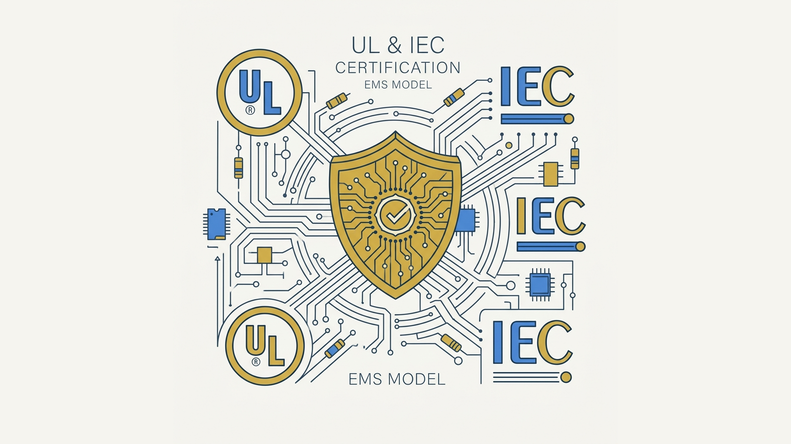
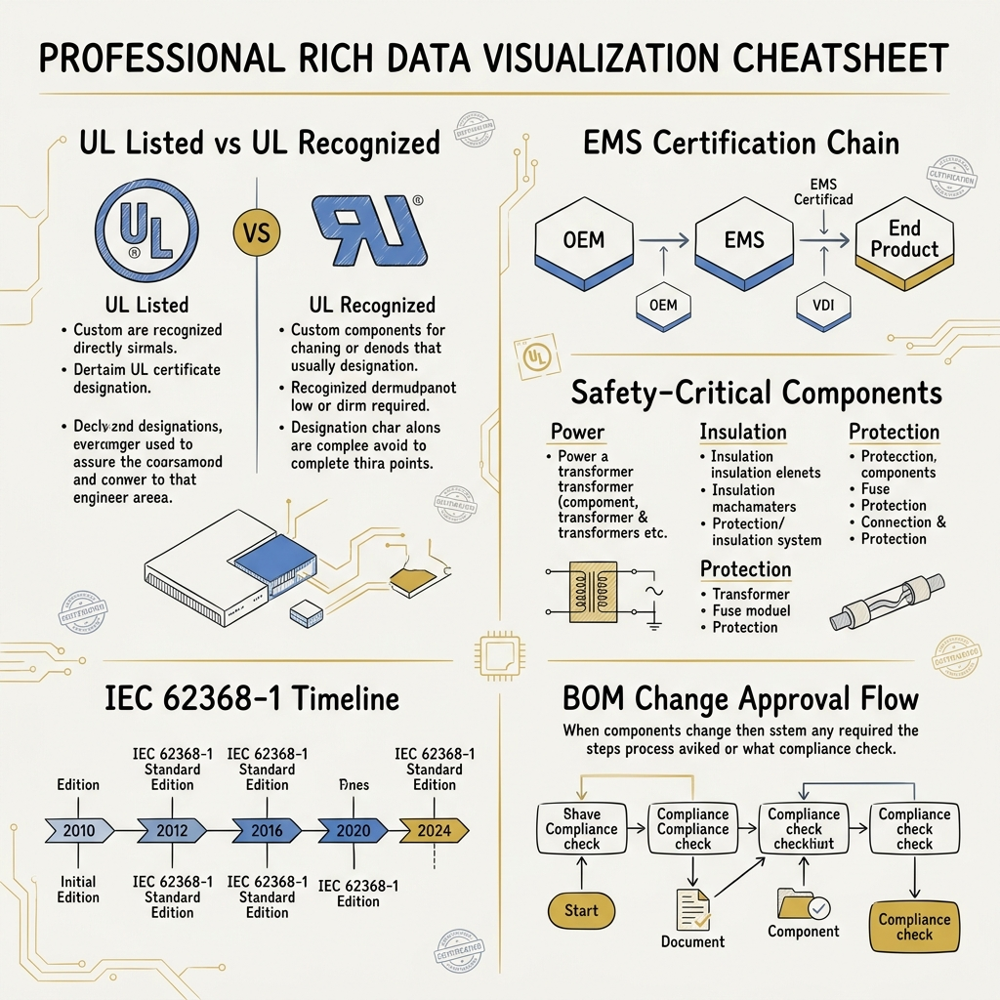
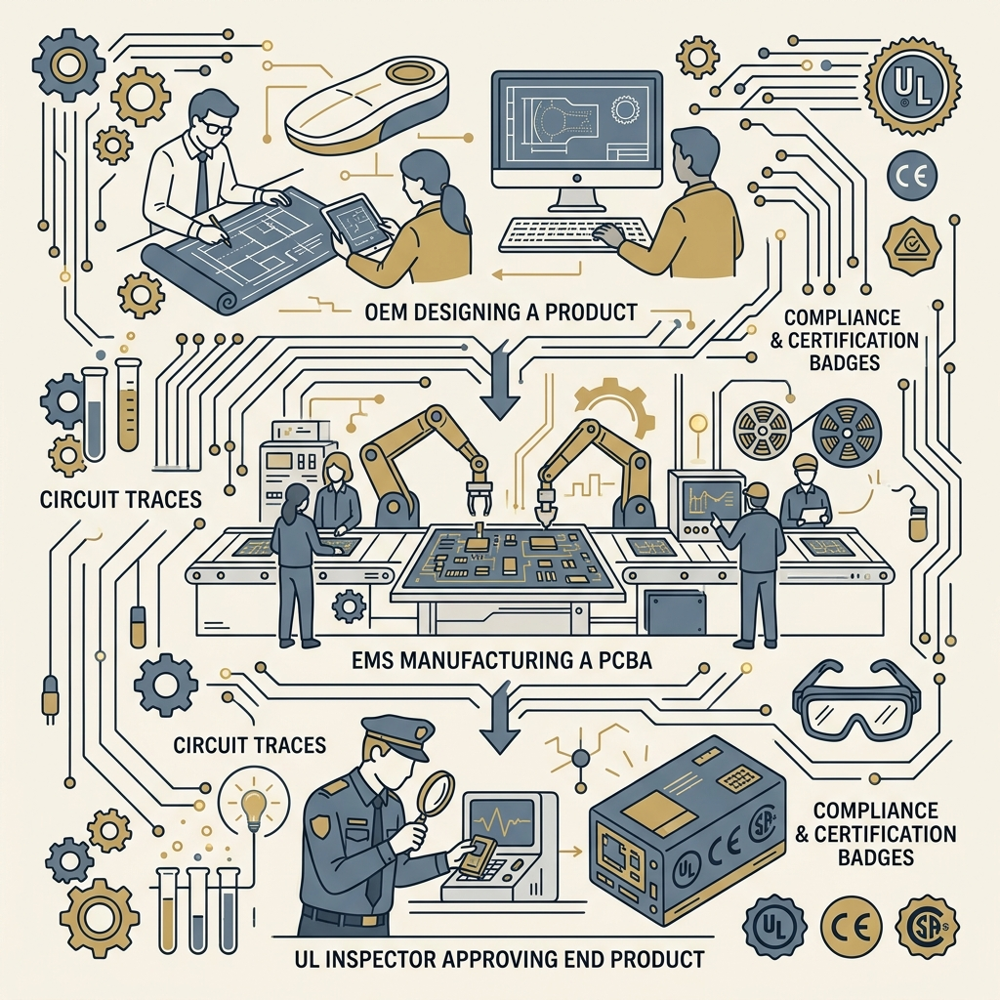

<!-- _class: title -->

# UL และ IEC Certification ใน EMS Model

ใครรับรองอะไร? — โครงสร้าง certification ใน supply chain electronics

<!-- Speaker: EMS model มี 3 ฝ่าย: OEM, EMS, End Customer — ใครต้องรับผิดชอบ certification คือคำถามที่ตอบผิดกันบ่อย -->

---

<!-- _class: cheatsheet -->
<!-- _backgroundColor: #f8f7f4 -->

<!-- Speaker: One-page reference — UL marks, EMS chain, safety components, IEC edition timeline, BOM approval flow. -->

---

## End Product รับ UL Listing — ไม่ใช่ PCBA

UL Listing ผูกกับ end product ที่ OEM เป็นเจ้าของ — EMS เป็นผู้ผลิตที่ต้อง comply ตาม spec

  

    
OEM owns

    <h3>UL Listing</h3>
    
Design, BOM spec, UL file number — OEM รับผิดชอบ certification ของ end product

  

  

    
EMS role

    <h3>UL 796 Compliance</h3>
    
Assemble ตาม spec, verify UL-critical parts, Incoming inspection, Audit trail

  

<b>★ Takeaway:</b> ISO 9001 ≠ UL certification — ISO คือ quality system; UL คือ product safety mark ที่ต่างกันโดยสิ้นเชิง

<!-- Speaker: misconception พบบ่อย — "EMS มี ISO 9001 แล้ว product ผ่าน UL เอง" เป็นเรื่องผิด -->

---

## UL Listed vs. UL Recognized: คนละ Mark คนละวัตถุประสงค์

UL Recognized ไม่ใช่ UL Listed — เป็น sub-component certification ที่ใช้ได้เฉพาะใน end product

<svg viewBox="0 0 1100 340" width="100%" xmlns="http://www.w3.org/2000/svg">
  <!-- Left: UL Listed -->
  <rect x="40" y="20" width="480" height="300" rx="12" fill="var(--paper)" stroke="var(--soft-2)" stroke-width="1.5" style="filter:drop-shadow(var(--shadow-sm))"/>
  <rect x="40" y="20" width="480" height="52" rx="12" fill="var(--soft)"/>
  <text x="280" y="52" font-size="17" font-weight="700" fill="var(--ink-dim)" text-anchor="middle" font-family="system-ui">UL Listed</text>
  <circle cx="120" cy="130" r="28" fill="none" stroke="var(--ink-dim)" stroke-width="3"/>
  <text x="120" y="136" font-size="14" font-weight="700" fill="var(--ink-dim)" text-anchor="middle" font-family="system-ui">UL</text>
  <text x="170" y="120" font-size="14" fill="var(--ink)" font-family="system-ui">Complete end product</text>
  <text x="170" y="143" font-size="13" fill="var(--ink-dim)" font-family="system-ui">Power strip, luminaire, appliance</text>
  <text x="80" y="185" font-size="13" fill="var(--ink-dim)" font-family="system-ui">Tests: system, housing, wiring, heat</text>
  <text x="80" y="208" font-size="13" fill="var(--ink-dim)" font-family="system-ui">Standalone: electrician can install</text>
  <text x="80" y="265" font-size="13" fill="var(--muted)" font-family="system-ui">Category: ZPVI2 (US) / ZPVI8 (CA)</text>
  <!-- Right: UL Recognized -->
  <rect x="580" y="20" width="480" height="300" rx="12" fill="var(--paper)" stroke="var(--accent)" stroke-width="2" style="filter:drop-shadow(var(--shadow-md))"/>
  <rect x="580" y="20" width="480" height="52" rx="12" fill="var(--accent-wash)"/>
  <text x="820" y="52" font-size="17" font-weight="700" fill="var(--accent)" text-anchor="middle" font-family="system-ui">UL Recognized</text>
  <circle cx="660" cy="118" r="18" fill="none" stroke="var(--accent)" stroke-width="3"/>
  <text x="660" y="123" font-size="13" font-weight="700" fill="var(--accent)" text-anchor="middle" font-family="system-ui">UR</text>
  <text x="700" y="120" font-size="14" fill="var(--ink)" font-family="system-ui">Sub-component inside product</text>
  <text x="700" y="143" font-size="13" fill="var(--ink-dim)" font-family="system-ui">Transformer, PCB, power supply</text>
  <text x="620" y="185" font-size="13" fill="var(--ink-dim)" font-family="system-ui">Tests: component only, specific conditions</text>
  <text x="620" y="208" font-size="13" fill="var(--accent)" font-family="system-ui">Standalone: NOT allowed — must be in Listed product</text>
  <text x="620" y="265" font-size="13" fill="var(--muted)" font-family="system-ui">Part suffix: 123456UL</text>
  <!-- VS badge -->
  <circle cx="550" cy="190" r="28" fill="var(--accent)"/>
  <text x="550" y="195" font-size="14" font-weight="700" fill="var(--paper)" text-anchor="middle" dominant-baseline="central" font-family="system-ui">VS</text>
  <rect x="0" y="0" width="1" height="1" fill="none"/>
</svg>

<b>★ Takeaway:</b> UL Recognized มี "Conditions of Acceptability" — ใช้ component นอกเงื่อนไขนั้นทำให้ certification ไม่มีผล

<!-- Speaker: UR mark คือ backward UR — ดูไม่เหมือน UL. Part suffix UL ที่ท้าย part number คือ signal ที่ EMS ต้อง verify ที่ incoming -->

---

## Certification Chain: OEM → EMS → End Product

ความรับผิดชอบแบ่งชัดตาม role — EMS ไม่ได้เป็นเจ้าของ UL Listing แต่ต้อง enable มัน

<svg viewBox="0 0 1100 320" width="100%" xmlns="http://www.w3.org/2000/svg">
  <!-- OEM box -->
  <rect x="40" y="60" width="290" height="200" rx="12" fill="var(--paper)" stroke="var(--accent)" stroke-width="2" style="filter:drop-shadow(var(--shadow-md))"/>
  <rect x="40" y="60" width="290" height="48" rx="12" fill="var(--accent)" opacity=".1"/>
  <text x="185" y="90" font-size="16" font-weight="700" fill="var(--accent)" text-anchor="middle" font-family="system-ui">OEM</text>
  <text x="65" y="135" font-size="13" fill="var(--ink)" font-family="system-ui">Design + BOM</text>
  <text x="65" y="158" font-size="13" fill="var(--ink-dim)" font-family="system-ui">UL file owner</text>
  <text x="65" y="181" font-size="13" fill="var(--ink-dim)" font-family="system-ui">Approve changes</text>
  <text x="65" y="204" font-size="13" fill="var(--ink-dim)" font-family="system-ui">Certify end product</text>
  <!-- Arrow 1 -->
  <path d="M 334 160 L 400 160" stroke="var(--accent)" stroke-width="2.5" fill="none" marker-end="url(#arr)"/>
  <text x="367" y="150" font-size="11" fill="var(--muted)" text-anchor="middle" font-family="system-ui">spec</text>
  <defs>
    <marker id="arr" markerWidth="8" markerHeight="8" refX="6" refY="3" orient="auto">
      <path d="M0,0 L0,6 L8,3 z" fill="var(--accent)"/>
    </marker>
  </defs>
  <!-- EMS box -->
  <rect x="405" y="60" width="290" height="200" rx="12" fill="var(--paper)" stroke="var(--gold)" stroke-width="2" style="filter:drop-shadow(var(--shadow-md))"/>
  <rect x="405" y="60" width="290" height="48" rx="12" fill="var(--gold)" opacity=".1"/>
  <text x="550" y="90" font-size="16" font-weight="700" fill="var(--warning-ink)" text-anchor="middle" font-family="system-ui">EMS</text>
  <text x="428" y="135" font-size="13" fill="var(--ink)" font-family="system-ui">UL 796 compliance</text>
  <text x="428" y="158" font-size="13" fill="var(--ink-dim)" font-family="system-ui">Incoming inspection</text>
  <text x="428" y="181" font-size="13" fill="var(--ink-dim)" font-family="system-ui">UL-critical part verify</text>
  <text x="428" y="204" font-size="13" fill="var(--ink-dim)" font-family="system-ui">Audit trail</text>
  <!-- Arrow 2 -->
  <path d="M 699 160 L 765 160" stroke="var(--accent)" stroke-width="2.5" fill="none" marker-end="url(#arr2)"/>
  <text x="732" y="150" font-size="11" fill="var(--muted)" text-anchor="middle" font-family="system-ui">PCBA</text>
  <defs>
    <marker id="arr2" markerWidth="8" markerHeight="8" refX="6" refY="3" orient="auto">
      <path d="M0,0 L0,6 L8,3 z" fill="var(--accent)"/>
    </marker>
  </defs>
  <!-- End Product box -->
  <rect x="770" y="60" width="290" height="200" rx="12" fill="var(--paper)" stroke="var(--success)" stroke-width="2" style="filter:drop-shadow(var(--shadow-md))"/>
  <rect x="770" y="60" width="290" height="48" rx="12" fill="var(--success)" opacity=".1"/>
  <text x="915" y="90" font-size="16" font-weight="700" fill="var(--success-ink)" text-anchor="middle" font-family="system-ui">End Product</text>
  <text x="795" y="135" font-size="13" fill="var(--ink)" font-family="system-ui">UL Listed (OEM owns)</text>
  <text x="795" y="158" font-size="13" fill="var(--ink-dim)" font-family="system-ui">US + Canada market</text>
  <text x="795" y="181" font-size="13" fill="var(--ink-dim)" font-family="system-ui">UL Label on product</text>
  <text x="795" y="204" font-size="13" fill="var(--ink-dim)" font-family="system-ui">UL can audit anytime</text>
  <rect x="0" y="0" width="1" height="1" fill="none"/>
</svg>

<b>★ Takeaway:</b> EMS ที่มี UL 796 certification ได้รับอนุมัติให้ผลิต PCBA สำหรับ UL Listed products — แต่ไม่ได้เป็นเจ้าของ UL Listing

<!-- Speaker: UL 796 = ZPVI2 (US) + ZPVI8 (Canada). EMS ถูก audit on-site โดย UL representatives เป็นระยะ -->

---

## Safety-Critical Components ต้องมี UL Recognized

3 หมวดที่อยู่ใน "safety path" ต้องมี UL Recognized หรือ IEC equivalent — ที่เหลือ quality control เท่านั้น

  

    
Safety-Critical — UL Required

    <h3>Power Components</h3>
    
Internal power supplies, AC/DC converters, transformers, inductors — เป็น "safeguard" ใน IEC 62368-1

  

  

    
Safety-Critical — UL Required

    <h3>Insulation Materials</h3>
    
PCB substrate ต้องผ่าน UL 94 flammability rating (V-0/V-1) สำหรับ enclosure ใกล้ heat source

  

  

    
Safety-Critical — UL Required

    <h3>Protection Components</h3>
    
Fuses, circuit breakers, MOVs, TVS diodes — ป้องกัน overvoltage/overcurrent ใน safety path

  

<b>★ Takeaway:</b> Part number ที่มี "UL" suffix (เช่น 123456UL) คือ signal ที่ EMS ต้อง verify ที่ incoming inspection ก่อน build

<!-- Speaker: General components (resistors, capacitors ทั่วไป, screws) ไม่ต้องมี UL Recognized แต่ยังต้องผ่าน IPC-A-610 + RoHS/REACH -->

---

## General Components: ไม่ต้องมี UL Mark แต่ต้อง Quality

ไม่ได้อยู่ใน safety path = ไม่ต้องมี UL Recognized — แต่ยังต้องผ่านมาตรฐาน quality ที่กำหนด

  

    
General Components (no UL mark needed)

    <h3>Passive + Mechanical + Connectors</h3>
    
Resistors, capacitors ทั่วไป (ไม่ใช่ protection circuit), mechanical hardware (standoffs, screws), connectors ที่ไม่ใช่ high-voltage

    <ul>
      <li>ยังต้อง: IPC-A-610 workmanship</li>
      <li>ยังต้อง: RoHS/REACH compliance</li>
      <li>ยังต้อง: EMS quality control</li>
    </ul>
  

  

    
Critical Reminder

    <h3>"ไม่ต้องมี UL" ≠ "ใช้อะไรก็ได้"</h3>
    
General components ที่ไม่มี certification โดยตรงยังต้องผ่าน quality gate ของ EMS และ OEM — ต่างกันแค่ไม่ต้องมี UL Recognized mark

    <ul>
      <li>Counterfeit risk สูง — incoming verify ทุก lot</li>
      <li>Material compliance (RoHS) ต้องมี CoC</li>
    </ul>
  

<b>★ Takeaway:</b> Classification คือ: safety path = UL Recognized required; non-safety path = quality control required — ทั้งคู่ mandatory

<!-- Speaker: RoHS = Restriction of Hazardous Substances. CoC = Certificate of Conformance. EMS ควรขอ CoC จาก supplier สำหรับทุก lot -->

---

## IEC 62368-1 แทนที่ Legacy Standards ทั้งหมด

IEC 60950-1 (IT) และ IEC 60065 (AV) ถูกยกเลิก — BOM ที่ยังใช้ legacy-certified components ต้องถูก re-evaluated

<svg viewBox="0 0 1100 280" width="100%" xmlns="http://www.w3.org/2000/svg">
  <!-- Timeline line -->
  <line x1="80" y1="140" x2="1020" y2="140" stroke="var(--soft-2)" stroke-width="3"/>
  <!-- Node 1: IEC 60950-1 -->
  <circle cx="160" cy="140" r="18" fill="var(--muted)"/>
  <text x="160" y="115" font-size="12" fill="var(--muted)" text-anchor="middle" font-family="system-ui">~2000</text>
  <text x="160" y="175" font-size="13" font-weight="700" fill="var(--ink-dim)" text-anchor="middle" font-family="system-ui">IEC 60950-1</text>
  <text x="160" y="195" font-size="11" fill="var(--muted)" text-anchor="middle" font-family="system-ui">IT Equipment</text>
  <!-- Node 2: IEC 60065 -->
  <circle cx="340" cy="140" r="18" fill="var(--muted)"/>
  <text x="340" y="115" font-size="12" fill="var(--muted)" text-anchor="middle" font-family="system-ui">~2000</text>
  <text x="340" y="175" font-size="13" font-weight="700" fill="var(--ink-dim)" text-anchor="middle" font-family="system-ui">IEC 60065</text>
  <text x="340" y="195" font-size="11" fill="var(--muted)" text-anchor="middle" font-family="system-ui">AV Equipment</text>
  <!-- Strikethrough both legacy -->
  <line x1="100" y1="140" x2="240" y2="140" stroke="var(--danger)" stroke-width="2" opacity=".5" stroke-dasharray="6,3"/>
  <line x1="280" y1="140" x2="420" y2="140" stroke="var(--danger)" stroke-width="2" opacity=".5" stroke-dasharray="6,3"/>
  <!-- Node 3: Ed.3 -->
  <circle cx="620" cy="140" r="22" fill="var(--accent)" opacity=".7"/>
  <text x="620" y="115" font-size="12" fill="var(--accent)" text-anchor="middle" font-family="system-ui">2022</text>
  <text x="620" y="175" font-size="14" font-weight="700" fill="var(--ink)" text-anchor="middle" font-family="system-ui">IEC 62368-1</text>
  <text x="620" y="195" font-size="12" fill="var(--ink-dim)" text-anchor="middle" font-family="system-ui">Edition 3</text>
  <text x="620" y="215" font-size="11" fill="var(--muted)" text-anchor="middle" font-family="system-ui">IT + AV unified</text>
  <!-- Node 4: Ed.4 (current) -->
  <circle cx="900" cy="140" r="26" fill="var(--accent)"/>
  <text x="900" y="112" font-size="12" fill="var(--accent)" text-anchor="middle" font-family="system-ui">2025</text>
  <text x="900" y="175" font-size="15" font-weight="700" fill="var(--ink)" text-anchor="middle" font-family="system-ui">IEC 62368-1</text>
  <text x="900" y="196" font-size="13" font-weight="700" fill="var(--accent)" text-anchor="middle" font-family="system-ui">Edition 4</text>
  <text x="900" y="218" font-size="11" fill="var(--muted)" text-anchor="middle" font-family="system-ui">Legacy NOT accepted</text>
  <!-- CURRENT badge -->
  <rect x="840" y="88" width="120" height="20" rx="6" fill="var(--success)"/>
  <text x="900" y="102" font-size="11" font-weight="700" fill="white" text-anchor="middle" font-family="system-ui">CURRENT</text>
  <rect x="0" y="0" width="1" height="1" fill="none"/>
</svg>

<b>★ Takeaway:</b> End product ที่ certify ภายใต้ IEC 62368-1 Ed.4 ต้องใช้ components ที่ certify ภายใต้ Ed.4 เดียวกัน — legacy components ต้องถูก re-evaluated

<!-- Speaker: UL 62368-1 = US national adoption ของ IEC 62368-1 + US-specific requirements. Test report เดียวกันมักใช้ขอทั้ง IEC และ UL mark ได้ -->

---

## BOM Change ที่กระทบ Safety Path = OEM Approval Required

EMS ห้ามเปลี่ยน safety-critical components ฝ่ายเดียว — ทุก deviation จาก certified BOM กระทบ certification status

<svg viewBox="0 0 1100 300" width="100%" xmlns="http://www.w3.org/2000/svg">
  <!-- Start -->
  <rect x="40" y="110" width="160" height="50" rx="8" fill="var(--soft-2)"/>
  <text x="120" y="140" font-size="13" font-weight="700" fill="var(--ink)" text-anchor="middle" font-family="system-ui">BOM Change</text>
  <!-- Arrow 1 -->
  <path d="M 200 135 L 260 135" stroke="var(--muted)" stroke-width="2" fill="none" marker-end="url(#da1)"/>
  <defs>
    <marker id="da1" markerWidth="8" markerHeight="8" refX="6" refY="3" orient="auto">
      <path d="M0,0 L0,6 L8,3 z" fill="var(--muted)"/>
    </marker>
  </defs>
  <!-- Decision diamond -->
  <polygon points="340,90 440,135 340,180 240,135" fill="var(--accent-wash)" stroke="var(--accent)" stroke-width="2"/>
  <text x="340" y="128" font-size="11" fill="var(--accent)" text-anchor="middle" font-family="system-ui">Safety</text>
  <text x="340" y="145" font-size="11" fill="var(--accent)" text-anchor="middle" font-family="system-ui">path?</text>
  <!-- No path (down) -->
  <path d="M 340 180 L 340 240" stroke="var(--success)" stroke-width="2" fill="none" marker-end="url(#da2)"/>
  <defs>
    <marker id="da2" markerWidth="8" markerHeight="8" refX="6" refY="3" orient="auto">
      <path d="M0,0 L0,6 L8,3 z" fill="var(--success)"/>
    </marker>
  </defs>
  <text x="355" y="215" font-size="11" fill="var(--success-ink)" font-family="system-ui">No</text>
  <rect x="255" y="245" width="170" height="40" rx="8" fill="var(--success-wash)" stroke="var(--success)" stroke-width="1.5"/>
  <text x="340" y="270" font-size="12" fill="var(--success-ink)" text-anchor="middle" font-family="system-ui">EMS QA only</text>
  <!-- Yes path (right) -->
  <path d="M 440 135 L 520 135" stroke="var(--danger)" stroke-width="2" fill="none" marker-end="url(#da3)"/>
  <defs>
    <marker id="da3" markerWidth="8" markerHeight="8" refX="6" refY="3" orient="auto">
      <path d="M0,0 L0,6 L8,3 z" fill="var(--danger)"/>
    </marker>
  </defs>
  <text x="480" y="122" font-size="11" fill="var(--danger)" font-family="system-ui">Yes</text>
  <!-- CoA check -->
  <polygon points="600,90 700,135 600,180 500,135" fill="var(--warning-wash)" stroke="var(--warning)" stroke-width="2"/>
  <text x="600" y="128" font-size="10" fill="var(--warning-ink)" text-anchor="middle" font-family="system-ui">CoA</text>
  <text x="600" y="145" font-size="10" fill="var(--warning-ink)" text-anchor="middle" font-family="system-ui">match?</text>
  <!-- No CoA match (down) -->
  <path d="M 600 180 L 600 240" stroke="var(--danger)" stroke-width="2" fill="none" marker-end="url(#da4)"/>
  <defs>
    <marker id="da4" markerWidth="8" markerHeight="8" refX="6" refY="3" orient="auto">
      <path d="M0,0 L0,6 L8,3 z" fill="var(--danger)"/>
    </marker>
  </defs>
  <text x="615" y="215" font-size="11" fill="var(--danger-ink)" font-family="system-ui">No</text>
  <rect x="510" y="245" width="180" height="40" rx="8" fill="var(--danger-wash)" stroke="var(--danger)" stroke-width="1.5"/>
  <text x="600" y="265" font-size="11" fill="var(--danger-ink)" text-anchor="middle" font-family="system-ui">UL re-evaluation</text>
  <text x="600" y="280" font-size="10" fill="var(--danger-ink)" text-anchor="middle" font-family="system-ui">may re-test</text>
  <!-- Yes CoA match -->
  <path d="M 700 135 L 780 135" stroke="var(--accent)" stroke-width="2" fill="none" marker-end="url(#da5)"/>
  <defs>
    <marker id="da5" markerWidth="8" markerHeight="8" refX="6" refY="3" orient="auto">
      <path d="M0,0 L0,6 L8,3 z" fill="var(--accent)"/>
    </marker>
  </defs>
  <text x="740" y="122" font-size="11" fill="var(--success-ink)" font-family="system-ui">Yes</text>
  <!-- OEM Approve -->
  <rect x="780" y="108" width="180" height="56" rx="8" fill="var(--paper)" stroke="var(--accent)" stroke-width="2" style="filter:drop-shadow(var(--shadow-sm))"/>
  <text x="870" y="134" font-size="12" font-weight="700" fill="var(--ink)" text-anchor="middle" font-family="system-ui">OEM Approve</text>
  <text x="870" y="153" font-size="11" fill="var(--ink-dim)" text-anchor="middle" font-family="system-ui">+ update UL file</text>
  <rect x="0" y="0" width="1" height="1" fill="none"/>
</svg>

<b>★ Takeaway:</b> CoA = Conditions of Acceptability ต้อง match; EMS เปลี่ยน safety components ฝ่ายเดียวไม่ได้ — UL สามารถ revoke Listing ทันทีถ้าพบ deviation

<!-- Speaker: CCB = Configuration Control Board. EMS ที่ดีมี CCB process ที่ทุก ECO ต้องผ่านก่อน production -->

---

## Caveats: UL Listing ไม่ครอบคลุมทั่วโลก

UL สำหรับ US + Canada เท่านั้น — แต่ละตลาดมี requirements ของตัวเอง และ IEC edition ต้อง match

  

    
Global Market Reality

    <h3>UL ≠ ทั่วโลก</h3>
    
US + Canada: UL Listing

    
EU: CE marking (IEC + CENELEC)

    
Japan: PSE certification

    
Australia: RCM mark

    
แต่ละตลาดมี safety-critical component requirements ของตัวเอง

  

  

    
Edition Lock Risk

    <h3>IEC Edition Compatibility</h3>
    
End product certify ภายใต้ Ed.3 + component certify ภายใต้ Ed.4 เท่านั้น = additional evaluation required

    
ตรวจสอบ edition compatibility ก่อน source component เสมอ

  

<b>★ Takeaway:</b> Multi-market products ต้องทำ certification map แยกตลาด — ไม่มี "one certification covers all"

<!-- Speaker: IEC 62368-1 Ed.4 ยกเลิก legacy IEC 60950-1/60065 — components ที่ certify ภายใต้ legacy ต้องถูก re-evaluated ก่อน use ใน new product -->

---

## Key Takeaways

สรุปสิ่งที่ต้องจำสำหรับ hardware engineer และ procurement ใน EMS model

  

    
Core Distinction

    <h3>UL Listed = End Product | UL Recognized = Component</h3>
    
สองอย่างนี้ต่างกันโดยสิ้นเชิง — ห้ามสับสน

  

  

    
EMS Role

    <h3>EMS enables UL — ไม่ได้เป็นเจ้าของ</h3>
    
UL 796 compliance ทำให้ EMS ผลิต PCBA สำหรับ UL Listed products ได้ แต่ OEM เป็นเจ้าของ Listing

  

  

    
Safety Path

    <h3>Power + Insulation + Protection = UL Required</h3>
    
3 หมวด safety-critical ต้องมี UL Recognized พร้อม Conditions of Acceptability

  

  

    
IEC Update

    <h3>IEC 62368-1 Ed.4 (2025) — Legacy ถูกยกเลิก</h3>
    
IEC 60950-1/60065 legacy components ต้องถูก re-evaluated ก่อนใช้ใน new certification

  

  

    
BOM Control

    <h3>Safety component change = OEM approval required</h3>
    
EMS เปลี่ยนฝ่ายเดียวไม่ได้ — UL revoke ได้ทันทีถ้าพบ deviation จาก certified BOM

  

  

    
Geography

    <h3>UL = US + Canada only</h3>
    
EU ต้องการ CE, Japan ต้องการ PSE, Australia ต้องการ RCM — ทำแยกทุกตลาด

  

<b>★ Takeaway:</b> Certification ไม่ใช่เรื่องของ EMS คนเดียว — OEM ต้องรับผิดชอบ spec, BOM approval, และ UL file management ตลอด lifecycle

<!-- Speaker: ถ้าจำได้อย่างเดียว: BOM change ใน safety path = OEM approve ก่อนเสมอ ไม่มีข้อยกเว้น -->
