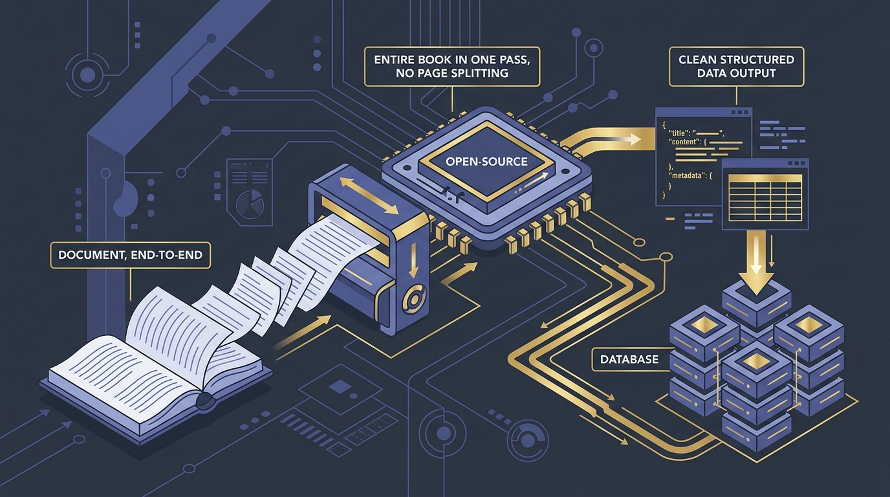
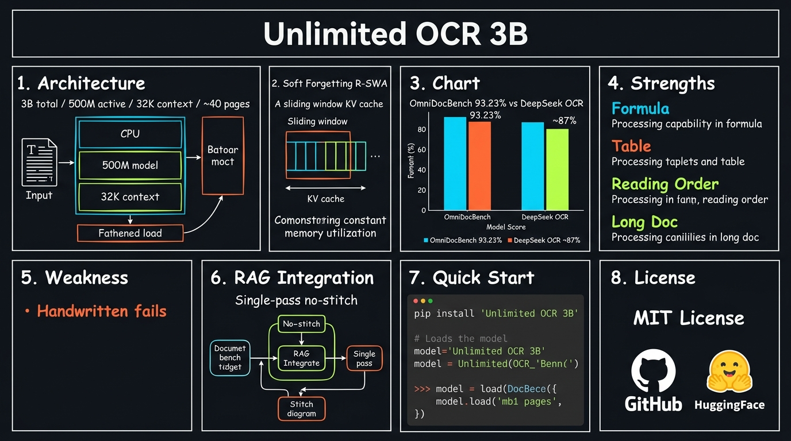
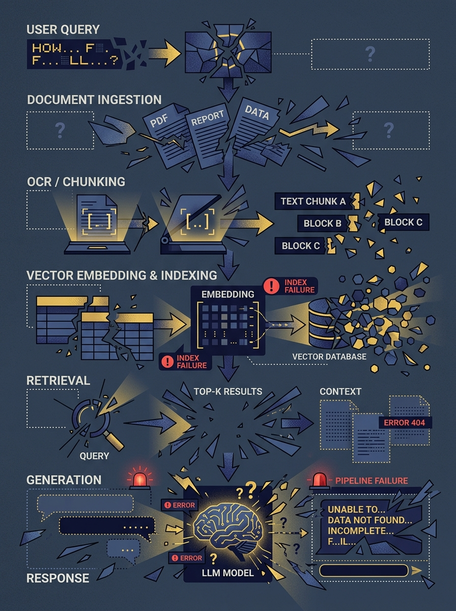
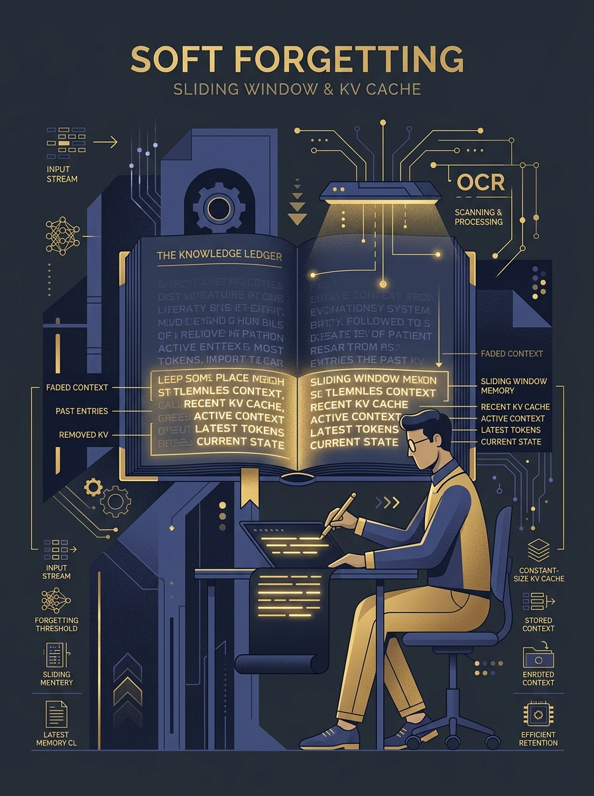

<!-- _class: title -->

# Unlimited OCR 3B

โมเดล Open-Source ที่อ่านเอกสารทั้งเล่มได้ในครั้งเดียว — Baidu · MIT License · 93.23% OmniDocBench

<!-- Speaker: Baidu released Unlimited OCR on June 22, 2026. 3B params, 500M active. Reads entire books in one forward pass without page splitting. Today we unpack how it works and how to use it. -->

---

<!-- _class: cheatsheet -->
<!-- _backgroundColor: #f8f7f4 -->

<!-- Speaker: Full one-page reference. Architecture, mechanism, benchmarks, strengths, weaknesses, and quick-start in one view. We'll step through each zone. -->

---

## Traditional RAG Pipelines Break at Every Stage

Every handoff between OCR stages adds latency and errors — tables split, headers vanish, reading order corrupts.

<svg viewBox="0 0 700 300" width="100%" xmlns="http://www.w3.org/2000/svg">
  <!-- arrow-flow: 4-stage traditional pipeline -->
  <defs>
    <marker id="arr" markerWidth="8" markerHeight="8" refX="6" refY="3" orient="auto">
      <path d="M0,0 L0,6 L8,3 z" fill="var(--danger)"/>
    </marker>
  </defs>
  <!-- Stage boxes -->
  <rect x="10" y="110" width="130" height="56" rx="10" fill="var(--paper)" stroke="var(--soft-2)" stroke-width="1.5" style="filter:drop-shadow(var(--shadow-sm))"/>
  <text x="75" y="135" font-size="13" font-weight="700" fill="var(--ink)" text-anchor="middle" font-family="system-ui">PDF In</text>
  <text x="75" y="153" font-size="11" fill="var(--muted)" text-anchor="middle" font-family="system-ui">raw bytes</text>

  <rect x="175" y="110" width="130" height="56" rx="10" fill="var(--danger-wash)" stroke="var(--danger)" stroke-width="1.5"/>
  <text x="240" y="135" font-size="13" font-weight="700" fill="var(--danger-ink)" text-anchor="middle" font-family="system-ui">OCR</text>
  <text x="240" y="153" font-size="11" fill="var(--danger-ink)" text-anchor="middle" font-family="system-ui">page by page</text>

  <rect x="340" y="110" width="130" height="56" rx="10" fill="var(--danger-wash)" stroke="var(--danger)" stroke-width="1.5"/>
  <text x="405" y="135" font-size="13" font-weight="700" fill="var(--danger-ink)" text-anchor="middle" font-family="system-ui">Stitch</text>
  <text x="405" y="153" font-size="11" fill="var(--danger-ink)" text-anchor="middle" font-family="system-ui">reconstruct text</text>

  <rect x="505" y="110" width="130" height="56" rx="10" fill="var(--paper)" stroke="var(--soft-2)" stroke-width="1.5" style="filter:drop-shadow(var(--shadow-sm))"/>
  <text x="570" y="135" font-size="13" font-weight="700" fill="var(--ink)" text-anchor="middle" font-family="system-ui">Vector DB</text>
  <text x="570" y="153" font-size="11" fill="var(--muted)" text-anchor="middle" font-family="system-ui">index</text>

  <!-- Arrows -->
  <line x1="140" y1="138" x2="172" y2="138" stroke="var(--danger)" stroke-width="2" marker-end="url(#arr)"/>
  <line x1="305" y1="138" x2="337" y2="138" stroke="var(--danger)" stroke-width="2" marker-end="url(#arr)"/>
  <line x1="470" y1="138" x2="502" y2="138" stroke="var(--danger)" stroke-width="2" marker-end="url(#arr)"/>

  <!-- Error indicators as small triangles above boxes (no text to avoid Marp parser escape) -->
  <polygon points="240,88 230,72 250,72" fill="var(--danger)" opacity=".7"/>
  <polygon points="405,88 395,72 415,72" fill="var(--danger)" opacity=".7"/>
  <polygon points="405,178 395,170 415,170" fill="var(--danger)" opacity=".7"/>
  <rect x="0" y="0" width="1" height="1" fill="none"/>
</svg>

tables splitheaders lost / wrong order

<b>★ Takeaway:</b> Every handoff = another failure point. Unlimited OCR collapses all 4 stages into one forward pass.

<!-- Speaker: Traditional RAG: PDF in → OCR page by page → stitch text → index. Each arrow is a place where tables split, headings vanish, reading order corrupts. -->

---

## Architecture: VLM with 500M Active Parameters

3B total, only 500M active at inference — lightweight enough for consumer GPUs, 32K context covers ~40 pages.

| Spec | Value |
|------|-------|
| Total parameters | 3B |
| Active at inference | 500M |
| Context length | 32,768 tokens |
| Max pages per run | ~40 pages |
| Mechanism | Reference Sliding Window Attention (R-SWA) |
| License | MIT |
| Released | June 22, 2026 (Baidu) |

<b>★ Takeaway:</b> 500M active params — smaller than most LLMs — yet SOTA on document parsing benchmarks.

<!-- Speaker: Visual language model. Total 3B but MoE-style activation keeps it at 500M during inference. Runs on a single mid-range GPU. -->

---

## Soft Forgetting: Constant KV Cache No Matter How Long the Document

Conventional decoders grow KV cache O(n) with each output token. R-SWA keeps the generated-text window constant.

<svg viewBox="0 0 700 300" width="100%" xmlns="http://www.w3.org/2000/svg">
  <!-- comparison-2col: conventional vs R-SWA -->
  <rect x="10" y="20" width="320" height="260" rx="12" fill="var(--paper)" stroke="var(--danger)" stroke-width="1.5" style="filter:drop-shadow(var(--shadow-sm))"/>
  <text x="170" y="52" font-size="14" font-weight="700" fill="var(--danger-ink)" text-anchor="middle" font-family="system-ui">Conventional Decoder</text>
  <!-- growing bars -->
  <rect x="40" y="80"  width="30" height="16" rx="4" fill="var(--danger)" opacity=".4"/>
  <rect x="40" y="104" width="60" height="16" rx="4" fill="var(--danger)" opacity=".5"/>
  <rect x="40" y="128" width="90" height="16" rx="4" fill="var(--danger)" opacity=".6"/>
  <rect x="40" y="152" width="130" height="16" rx="4" fill="var(--danger)" opacity=".7"/>
  <rect x="40" y="176" width="180" height="16" rx="4" fill="var(--danger)" opacity=".9"/>
  <text x="235" y="92"  font-size="11" fill="var(--muted)" font-family="system-ui">token 1</text>
  <text x="235" y="116" font-size="11" fill="var(--muted)" font-family="system-ui">token 2</text>
  <text x="235" y="140" font-size="11" fill="var(--muted)" font-family="system-ui">token 3</text>
  <text x="235" y="164" font-size="11" fill="var(--muted)" font-family="system-ui">...</text>
  <text x="235" y="188" font-size="11" fill="var(--danger)" font-family="system-ui">KV cache grows!</text>

  <rect x="370" y="20" width="320" height="260" rx="12" fill="var(--paper)" stroke="var(--accent)" stroke-width="2" style="filter:drop-shadow(var(--shadow-md))"/>
  <text x="530" y="52" font-size="14" font-weight="700" fill="var(--accent)" text-anchor="middle" font-family="system-ui">R-SWA (Unlimited OCR)</text>
  <!-- constant bars -->
  <rect x="400" y="80"  width="80" height="16" rx="4" fill="var(--accent)" opacity=".5"/>
  <rect x="400" y="104" width="80" height="16" rx="4" fill="var(--accent)" opacity=".5"/>
  <rect x="400" y="128" width="80" height="16" rx="4" fill="var(--accent)" opacity=".5"/>
  <rect x="400" y="152" width="80" height="16" rx="4" fill="var(--accent)" opacity=".5"/>
  <rect x="400" y="176" width="80" height="16" rx="4" fill="var(--accent)" opacity=".5"/>
  <text x="500" y="92"  font-size="11" fill="var(--muted)" font-family="system-ui">token 1 — window</text>
  <text x="500" y="116" font-size="11" fill="var(--muted)" font-family="system-ui">token 2 — window</text>
  <text x="500" y="140" font-size="11" fill="var(--muted)" font-family="system-ui">token 3 — window</text>
  <text x="500" y="164" font-size="11" fill="var(--muted)" font-family="system-ui">...</text>
  <text x="500" y="188" font-size="11" fill="var(--accent)" font-family="system-ui">KV cache constant!</text>

  <!-- VS badge -->
  <circle cx="355" cy="150" r="20" fill="var(--accent)"/>
  <text x="355" y="155" font-size="12" font-weight="700" fill="white" text-anchor="middle" dominant-baseline="central" font-family="system-ui">VS</text>
</svg>

<b>★ Takeaway:</b> R-SWA keeps working memory fixed — 40-page docs and 400-page docs cost the same inference memory.

<!-- Speaker: Human analogy: copying a book. You see the whole original, but only remember the last few lines you wrote. R-SWA encodes this — full doc in context, sliding window on output side. -->

---

## OmniDocBench v1.5: 93.23% — 6 Points Ahead of DeepSeek OCR

Tested across formula recognition, table parsing, reading order, and handwritten text on mainstream benchmark.

<svg viewBox="0 0 1100 340" width="100%" xmlns="http://www.w3.org/2000/svg">
  <!-- Horizontal bar comparison -->
  <text x="60" y="40" font-size="14" font-weight="700" fill="var(--ink)" font-family="system-ui">Model</text>
  <text x="700" y="40" font-size="14" font-weight="700" fill="var(--ink)" font-family="system-ui">OmniDocBench v1.5</text>
  <text x="950" y="40" font-size="14" font-weight="700" fill="var(--ink)" font-family="system-ui">Score</text>

  <!-- Unlimited OCR row -->
  <rect x="60" y="60" width="820" height="52" rx="10" fill="var(--accent)" opacity=".15"/>
  <rect x="60" y="60" width="820" height="52" rx="10" fill="none" stroke="var(--accent)" stroke-width="2"/>
  <text x="80" y="93" font-size="15" font-weight="700" fill="var(--accent)" font-family="system-ui">Unlimited OCR (Baidu)</text>
  <!-- bar fill -->
  <rect x="500" y="68" width="360" height="36" rx="6" fill="var(--accent)" opacity=".7"/>
  <text x="950" y="93" font-size="20" font-weight="800" fill="var(--accent)" text-anchor="middle" font-family="system-ui">93.23%</text>

  <!-- DeepSeek OCR row -->
  <rect x="60" y="130" width="690" height="52" rx="10" fill="var(--soft)" stroke="var(--soft-2)" stroke-width="1.5"/>
  <text x="80" y="163" font-size="15" fill="var(--ink-dim)" font-family="system-ui">DeepSeek OCR</text>
  <rect x="500" y="138" width="230" height="36" rx="6" fill="var(--muted)" opacity=".5"/>
  <text x="950" y="163" font-size="20" font-weight="700" fill="var(--muted)" text-anchor="middle" font-family="system-ui">~87%</text>

  <!-- Gap callout -->
  <rect x="60" y="210" width="280" height="48" rx="10" fill="var(--accent-wash)" stroke="var(--accent)" stroke-width="1.5"/>
  <text x="200" y="234" font-size="16" font-weight="800" fill="var(--accent)" text-anchor="middle" font-family="system-ui">+6% gap</text>
  <text x="200" y="252" font-size="12" fill="var(--ink-dim)" text-anchor="middle" font-family="system-ui">addresses output-side KV bottleneck</text>

  <rect x="0" y="0" width="1" height="1" fill="none"/>
</svg>

Note: per-category breakdown from video demo only — verify at github.com/baidu/Unlimited-OCR for official paper

<b>★ Takeaway:</b> DeepSeek OCR compresses input tokens; Unlimited OCR fixes output-side KV growth — complementary, not competing approaches.

<!-- Speaker: 93.23% overall. 6 points ahead. DeepSeek OCR solves a different problem — input compression. These two models solve different halves of the document parsing bottleneck. -->

---

## Strengths: Passes 4 Key Document Tests

Demo-verified across the hardest challenges in real-world document parsing.

  

    
Formula

    <h3>Math Recognition</h3>
    
Complex expressions, superscripts, subscripts, multi-line equations — all accurate in dense PDF math documents.

  

  

    
Table

    <h3>Table Parsing</h3>
    
Bordered and borderless tables with many numeric cells — correct reconstruction regardless of grid style.

  

  

    
Layout

    <h3>Reading Order</h3>
    
Multi-column, mixed text+images, tilted scans, color print — restores human-intuitive reading flow, not just top-to-bottom.

  

  

    
Scale

    <h3>Long Documents</h3>
    
Entire books in a single forward pass. No for-loop, no external scheduler, no page stitching required.

  

<b>★ Takeaway:</b> Formula + Table + Reading Order are the three hardest structured-document challenges — Unlimited OCR clears all three.

<!-- Speaker: These are verified from the live demo video. Four challenges: formula, table, reading order, long doc. Strong on all four. -->

---

## Weakness: Handwritten Text Is Unreliable

Complex handwritten documents with mixed elements fail significantly — manual correction required.

  

    
Failure Mode 1

    <h3>Content Skipped</h3>
    
Model omits portions of handwritten text — especially when mixed with images or multi-column handwritten layouts.

  

  

    
Failure Mode 2

    <h3>Incorrect Text + Broken Structure</h3>
    
Hallucinated characters and failure to preserve original document structure. Output requires significant manual correction — not safe for automated pipelines.

  

<b>★ Takeaway:</b> Do not use Unlimited OCR for handwritten input in fully automated pipelines — always add a human review step.

<!-- Speaker: This is the clear limitation from the demo. Handwritten + multi-column + images mixed together is where it struggles. Content is missed, text is wrong, structure is broken. -->

---

## Quick Start: Install and Load Model

Python 3.12.3 + CUDA 12.9 required. Load from HuggingFace with trust_remote_code.

<svg viewBox="0 0 1100 340" width="100%" xmlns="http://www.w3.org/2000/svg">
  <!-- 3-step arrow flow -->
  <defs>
    <marker id="arr2" markerWidth="8" markerHeight="8" refX="6" refY="3" orient="auto">
      <path d="M0,0 L0,6 L8,3 z" fill="var(--accent)"/>
    </marker>
  </defs>
  <!-- Step 1 -->
  <rect x="20" y="60" width="300" height="220" rx="12" fill="var(--paper)" stroke="var(--accent)" stroke-width="1.5" style="filter:drop-shadow(var(--shadow-sm))"/>
  <rect x="20" y="60" width="300" height="44" rx="12" fill="var(--accent)" opacity=".12"/>
  <circle cx="56" cy="82" r="14" fill="var(--accent)"/>
  <text x="56" y="87" font-size="13" font-weight="700" fill="white" text-anchor="middle" font-family="system-ui">1</text>
  <text x="190" y="87" font-size="14" font-weight="700" fill="var(--accent)" text-anchor="middle" font-family="system-ui">Install</text>
  <text x="40" y="125" font-size="11" fill="var(--ink)" font-family="system-ui">pip install torch==2.10.0</text>
  <text x="40" y="145" font-size="11" fill="var(--ink)" font-family="system-ui">pip install transformers==4.57.1</text>
  <text x="40" y="165" font-size="11" fill="var(--ink)" font-family="system-ui">pip install Pillow einops pymupdf</text>
  <text x="40" y="200" font-size="10" fill="var(--muted)" font-family="system-ui">Requires: Python 3.12.3</text>
  <text x="40" y="218" font-size="10" fill="var(--muted)" font-family="system-ui">Requires: CUDA 12.9</text>
  <text x="40" y="236" font-size="10" fill="var(--muted)" font-family="system-ui">Apple Silicon: use MLX build</text>

  <!-- Arrow 1→2 -->
  <line x1="320" y1="170" x2="388" y2="170" stroke="var(--accent)" stroke-width="2" marker-end="url(#arr2)"/>

  <!-- Step 2 -->
  <rect x="390" y="60" width="300" height="220" rx="12" fill="var(--paper)" stroke="var(--accent)" stroke-width="1.5" style="filter:drop-shadow(var(--shadow-sm))"/>
  <rect x="390" y="60" width="300" height="44" rx="12" fill="var(--accent)" opacity=".12"/>
  <circle cx="426" cy="82" r="14" fill="var(--accent)"/>
  <text x="426" y="87" font-size="13" font-weight="700" fill="white" text-anchor="middle" font-family="system-ui">2</text>
  <text x="540" y="87" font-size="14" font-weight="700" fill="var(--accent)" text-anchor="middle" font-family="system-ui">Load Model</text>
  <text x="410" y="125" font-size="11" fill="var(--ink)" font-family="system-ui">model_name = 'baidu/Unlimited-OCR'</text>
  <text x="410" y="148" font-size="11" fill="var(--ink)" font-family="system-ui">tokenizer = AutoTokenizer</text>
  <text x="410" y="165" font-size="11" fill="var(--ink-dim)" font-family="system-ui">  .from_pretrained(model_name,</text>
  <text x="410" y="182" font-size="11" fill="var(--ink-dim)" font-family="system-ui">   trust_remote_code=True)</text>
  <text x="410" y="212" font-size="11" fill="var(--ink)" font-family="system-ui">model = AutoModel</text>
  <text x="410" y="229" font-size="11" fill="var(--ink-dim)" font-family="system-ui">  torch_dtype=torch.bfloat16</text>
  <text x="410" y="246" font-size="11" fill="var(--ink-dim)" font-family="system-ui">  .eval().cuda()</text>

  <!-- Arrow 2→3 -->
  <line x1="690" y1="170" x2="758" y2="170" stroke="var(--accent)" stroke-width="2" marker-end="url(#arr2)"/>

  <!-- Step 3 -->
  <rect x="760" y="60" width="300" height="220" rx="12" fill="var(--paper)" stroke="var(--accent)" stroke-width="1.5" style="filter:drop-shadow(var(--shadow-sm))"/>
  <rect x="760" y="60" width="300" height="44" rx="12" fill="var(--accent)" opacity=".12"/>
  <circle cx="796" cy="82" r="14" fill="var(--accent)"/>
  <text x="796" y="87" font-size="13" font-weight="700" fill="white" text-anchor="middle" font-family="system-ui">3</text>
  <text x="910" y="87" font-size="14" font-weight="700" fill="var(--accent)" text-anchor="middle" font-family="system-ui">Run Inference</text>
  <text x="780" y="125" font-size="11" fill="var(--ink)" font-family="system-ui">model.infer(</text>
  <text x="780" y="145" font-size="11" fill="var(--ink-dim)" font-family="system-ui">  tokenizer,</text>
  <text x="780" y="163" font-size="11" fill="var(--ink-dim)" font-family="system-ui">  image_file='doc.jpg',</text>
  <text x="780" y="181" font-size="11" fill="var(--ink-dim)" font-family="system-ui">  max_length=32768,</text>
  <text x="780" y="199" font-size="11" fill="var(--ink-dim)" font-family="system-ui">  ngram_window=128,</text>
  <text x="780" y="217" font-size="11" fill="var(--ink-dim)" font-family="system-ui">  save_results=True</text>
  <text x="780" y="235" font-size="11" fill="var(--ink)" font-family="system-ui">)</text>
  <text x="780" y="258" font-size="10" fill="var(--muted)" font-family="system-ui">or .infer_multi() for PDF</text>
</svg>

<b>★ Takeaway:</b> Review source code before using trust_remote_code=True in production — check github.com/baidu/Unlimited-OCR.

<!-- Speaker: Three steps: install, load from HuggingFace, call .infer() or .infer_multi() for multi-page. The ngram_window param is key for long docs — set 1024 for multi-page, 128 for single. -->

---

## RAG Integration: Single-Pass Eliminates Stitching Errors

Output is clean Markdown — pass directly to your chunker. No post-processing, no page reconstruction.

<svg viewBox="0 0 1100 300" width="100%" xmlns="http://www.w3.org/2000/svg">
  <defs>
    <marker id="arr3" markerWidth="8" markerHeight="8" refX="6" refY="3" orient="auto">
      <path d="M0,0 L0,6 L8,3 z" fill="var(--success)"/>
    </marker>
  </defs>
  <!-- New pipeline boxes -->
  <rect x="20"  y="100" width="170" height="80" rx="10" fill="var(--paper)" stroke="var(--soft-2)" stroke-width="1.5" style="filter:drop-shadow(var(--shadow-sm))"/>
  <text x="105" y="136" font-size="13" font-weight="700" fill="var(--ink)" text-anchor="middle" font-family="system-ui">PDF / Images</text>
  <text x="105" y="157" font-size="11" fill="var(--muted)" text-anchor="middle" font-family="system-ui">multi-page input</text>

  <line x1="190" y1="140" x2="238" y2="140" stroke="var(--success)" stroke-width="2" marker-end="url(#arr3)"/>

  <rect x="240"  y="100" width="200" height="80" rx="10" fill="var(--success-wash)" stroke="var(--success)" stroke-width="2"/>
  <text x="340" y="132" font-size="13" font-weight="700" fill="var(--success-ink)" text-anchor="middle" font-family="system-ui">Unlimited OCR</text>
  <text x="340" y="150" font-size="11" fill="var(--success-ink)" text-anchor="middle" font-family="system-ui">single forward pass</text>
  <text x="340" y="167" font-size="10" fill="var(--success)" text-anchor="middle" font-family="system-ui">no splitting, no stitching</text>

  <line x1="440" y1="140" x2="488" y2="140" stroke="var(--success)" stroke-width="2" marker-end="url(#arr3)"/>

  <rect x="490"  y="100" width="170" height="80" rx="10" fill="var(--paper)" stroke="var(--soft-2)" stroke-width="1.5" style="filter:drop-shadow(var(--shadow-sm))"/>
  <text x="575" y="136" font-size="13" font-weight="700" fill="var(--ink)" text-anchor="middle" font-family="system-ui">Clean Markdown</text>
  <text x="575" y="157" font-size="11" fill="var(--muted)" text-anchor="middle" font-family="system-ui">ready to chunk</text>

  <line x1="660" y1="140" x2="708" y2="140" stroke="var(--success)" stroke-width="2" marker-end="url(#arr3)"/>

  <rect x="710"  y="100" width="170" height="80" rx="10" fill="var(--paper)" stroke="var(--soft-2)" stroke-width="1.5" style="filter:drop-shadow(var(--shadow-sm))"/>
  <text x="795" y="136" font-size="13" font-weight="700" fill="var(--ink)" text-anchor="middle" font-family="system-ui">Chunker</text>
  <text x="795" y="157" font-size="11" fill="var(--muted)" text-anchor="middle" font-family="system-ui">RecursiveCharacter...</text>

  <line x1="880" y1="140" x2="928" y2="140" stroke="var(--success)" stroke-width="2" marker-end="url(#arr3)"/>

  <rect x="930"  y="100" width="150" height="80" rx="10" fill="var(--paper)" stroke="var(--soft-2)" stroke-width="1.5" style="filter:drop-shadow(var(--shadow-sm))"/>
  <text x="1005" y="136" font-size="13" font-weight="700" fill="var(--ink)" text-anchor="middle" font-family="system-ui">Vector DB</text>
  <text x="1005" y="157" font-size="11" fill="var(--muted)" text-anchor="middle" font-family="system-ui">indexed</text>

  <rect x="0" y="0" width="1" height="1" fill="none"/>
</svg>

Eliminated: page-by-page OCR + stitching reconstruction step

<b>★ Takeaway:</b> result_text → chunker → vector DB. No stitching code. Less pre-processing means fewer error modes in the RAG pipeline.

<!-- Speaker: The output is clean markdown. You read the file and pass it directly to RecursiveCharacterTextSplitter or any chunker. No reconstruction step, no stitching code. -->

---

## Caveats: Know Before You Deploy

Production considerations — CUDA requirements, context limits, and security checklist.

  

    
Hard Limit

    <h3>No Handwritten Docs</h3>
    
Misses content, generates wrong text, breaks structure. Always add human review for handwritten input.

  

  

    
Hardware

    <h3>CUDA 12.9 Required</h3>
    
Check GPU compatibility before deployment. Apple Silicon: use LoJexLLM/Unlimited-OCR-MLX community build.

  

  

    
Context

    <h3>32K = ~40 Pages Max</h3>
    
Documents longer than ~40 pages must be batched manually. Plan chunking strategy at ingestion time.

  

  

    
Security

    <h3>Review Remote Code</h3>
    
trust_remote_code=True executes code from HuggingFace. Audit baidu/Unlimited-OCR source before production use.

  

  

    
Benchmark

    <h3>Demo-Only Numbers</h3>
    
Per-category breakdown from video demo only. No official paper with full table yet — verify at the GitHub repo.

  

  

    
Production

    <h3>vLLM / SGLang</h3>
    
For batch workloads: docker pull vllm/vllm-openai:unlimited-ocr or use infer.py with --concurrency 8.

  

<b>★ Takeaway:</b> Unlimited OCR is production-ready for typed documents — not yet for handwritten content.

<!-- Speaker: Six things to know before deploying. Handwriting is the hard no. trust_remote_code is the security flag to check. 40-page context limit needs a batching strategy for books. -->

---

## Key Takeaways

Unlimited OCR changes the document parsing equation — if your docs are typed.

<svg viewBox="0 0 1100 320" width="100%" xmlns="http://www.w3.org/2000/svg">
  <!-- callout-box pattern: 7 takeaways as stacked rows -->
  <rect x="40" y="20" width="1020" height="40" rx="10" fill="var(--accent)" opacity=".12" stroke="var(--accent)" stroke-width="1.5"/>
  <circle cx="80" cy="40" r="14" fill="var(--accent)"/>
  <text x="80" y="45" font-size="12" font-weight="700" fill="white" text-anchor="middle" font-family="system-ui">1</text>
  <text x="110" y="35" font-size="13" font-weight="700" fill="var(--accent)" font-family="system-ui">3B total, 500M active</text>
  <text x="110" y="52" font-size="12" fill="var(--ink-dim)" font-family="system-ui">lightweight — runs on consumer GPU</text>

  <rect x="40" y="70" width="1020" height="36" rx="8" fill="var(--soft)"/>
  <circle cx="80" cy="88" r="12" fill="var(--ink-dim)"/>
  <text x="80" y="93" font-size="11" font-weight="700" fill="white" text-anchor="middle" font-family="system-ui">2</text>
  <text x="108" y="82" font-size="13" font-weight="700" fill="var(--ink)" font-family="system-ui">Soft Forgetting (R-SWA)</text>
  <text x="108" y="98" font-size="12" fill="var(--ink-dim)" font-family="system-ui">constant KV cache — 40 or 400 pages, same memory cost</text>

  <rect x="40" y="116" width="1020" height="36" rx="8" fill="var(--soft)"/>
  <circle cx="80" cy="134" r="12" fill="var(--ink-dim)"/>
  <text x="80" y="139" font-size="11" font-weight="700" fill="white" text-anchor="middle" font-family="system-ui">3</text>
  <text x="108" y="128" font-size="13" font-weight="700" fill="var(--ink)" font-family="system-ui">Single-pass RAG</text>
  <text x="108" y="144" font-size="12" fill="var(--ink-dim)" font-family="system-ui">no stitching, no reconstruction — clean markdown direct to chunker</text>

  <rect x="40" y="162" width="1020" height="36" rx="8" fill="var(--accent)" opacity=".08" stroke="var(--accent)" stroke-width="1"/>
  <circle cx="80" cy="180" r="12" fill="var(--accent)"/>
  <text x="80" y="185" font-size="11" font-weight="700" fill="white" text-anchor="middle" font-family="system-ui">4</text>
  <text x="108" y="174" font-size="13" font-weight="700" fill="var(--accent)" font-family="system-ui">OmniDocBench 93.23%</text>
  <text x="108" y="190" font-size="12" fill="var(--ink-dim)" font-family="system-ui">6 points above DeepSeek OCR on mainstream benchmark</text>

  <rect x="40" y="208" width="1020" height="36" rx="8" fill="var(--soft)"/>
  <circle cx="80" cy="226" r="12" fill="var(--success)"/>
  <text x="80" y="231" font-size="11" font-weight="700" fill="white" text-anchor="middle" font-family="system-ui">5</text>
  <text x="108" y="220" font-size="13" font-weight="700" fill="var(--ink)" font-family="system-ui">Formula + Table + Reading Order</text>
  <text x="108" y="236" font-size="12" fill="var(--ink-dim)" font-family="system-ui">all three enterprise-grade challenges cleared</text>

  <rect x="40" y="254" width="490" height="36" rx="8" fill="var(--success-wash)"/>
  <circle cx="80" cy="272" r="12" fill="var(--success)"/>
  <text x="80" y="277" font-size="11" font-weight="700" fill="white" text-anchor="middle" font-family="system-ui">6</text>
  <text x="108" y="266" font-size="13" font-weight="700" fill="var(--success-ink)" font-family="system-ui">MIT License</text>
  <text x="108" y="282" font-size="12" fill="var(--success-ink)" font-family="system-ui">free for personal and commercial use</text>

  <rect x="550" y="254" width="510" height="36" rx="8" fill="var(--danger-wash)"/>
  <circle cx="590" cy="272" r="12" fill="var(--danger)"/>
  <text x="590" y="277" font-size="11" font-weight="700" fill="white" text-anchor="middle" font-family="system-ui">7</text>
  <text x="618" y="266" font-size="13" font-weight="700" fill="var(--danger-ink)" font-family="system-ui">Handwritten = Not Ready</text>
  <text x="618" y="282" font-size="12" fill="var(--danger-ink)" font-family="system-ui">add human review for any handwritten pipeline</text>
</svg>

<b>★ Takeaway:</b> For typed enterprise documents in RAG pipelines — Unlimited OCR is the strongest open-source option available today.

<!-- Speaker: Seven points. The core insight: R-SWA solves the output-side bottleneck that DeepSeek OCR doesn't address. Together they cover both halves. MIT license makes it deployable anywhere. -->
