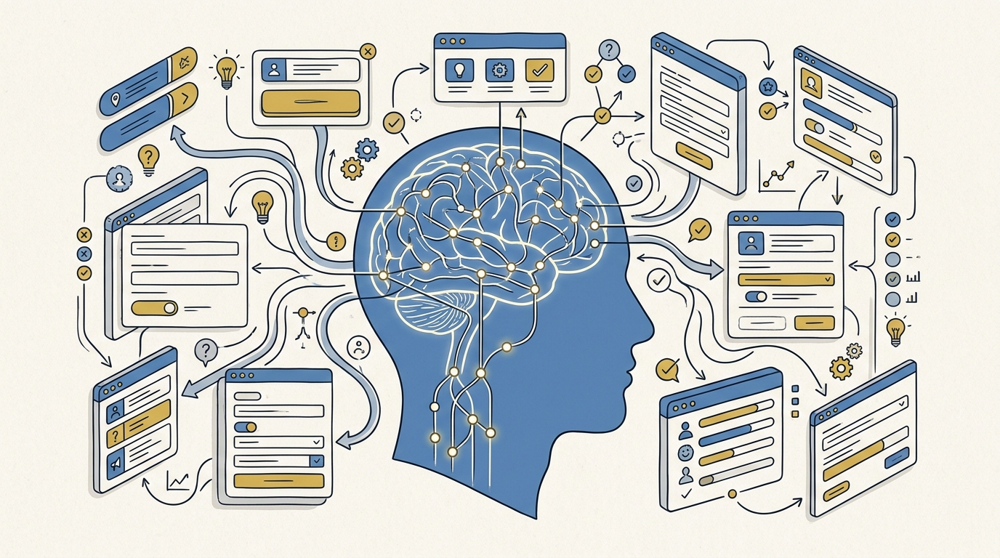
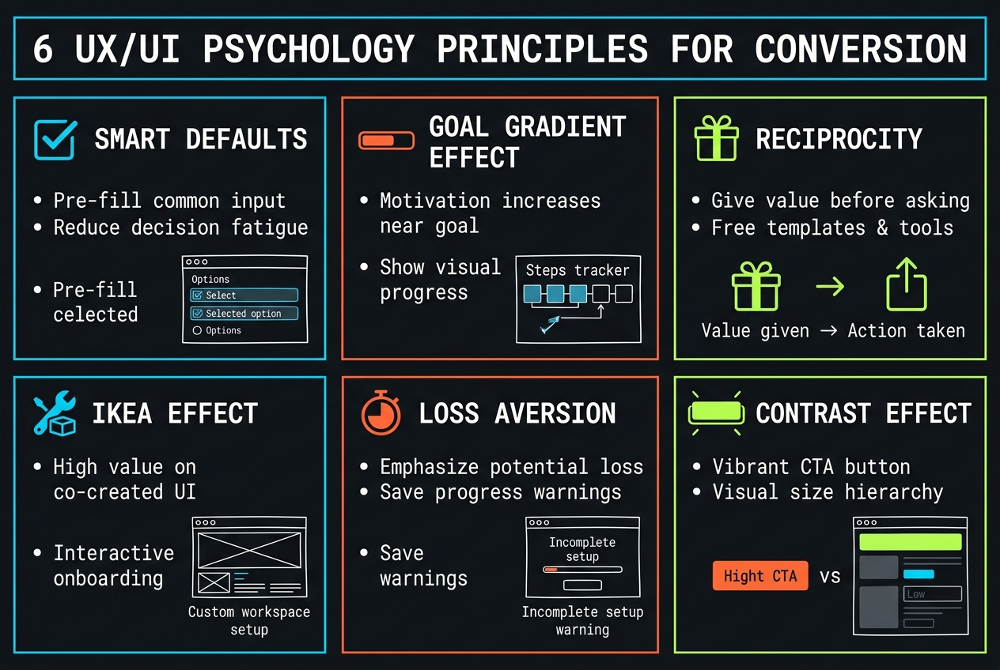

<!-- _class: title -->

# 6 หลักจิตวิทยา UX/UI เพื่อเพิ่ม Conversion และลด Drop-off

Smart Defaults · Goal Gradient · Reciprocity · IKEA Effect · Loss Aversion · Contrast Effect — พร้อม evidence จาก peer-reviewed research

<!-- Speaker: เปิดด้วยคำถาม — เคยสงสัยไหมว่าทำไม design สวยแต่ conversion ไม่ขึ้น? วันนี้จะเจาะ 6 หลักจิตวิทยาที่ตอบคำถามนี้ -->

---

<!-- _class: cheatsheet -->
<!-- _backgroundColor: #f8f7f4 -->

<!-- Speaker: cheatsheet นี้สรุปทั้ง 6 หลักการในหน้าเดียว — ใช้เป็น reference กลับมาดูได้ทุกเมื่อ -->

---

## TL;DR: Psychology ตัดสิน Conversion ไม่ใช่ Pixel

6 หลักจิตวิทยาที่มี research รองรับ ลด Decision Fatigue สร้าง Momentum และเพิ่ม Conversion

<svg viewBox="0 0 1100 340" width="100%" xmlns="http://www.w3.org/2000/svg">
  <line x1="90" y1="170" x2="1010" y2="170" stroke="var(--soft-2)" stroke-width="2"/>
  <g>
    <circle cx="90" cy="170" r="34" fill="var(--accent)"/>
    <text x="90" y="176" font-size="18" font-weight="700" fill="var(--paper)" text-anchor="middle" font-family="system-ui">1</text>
    <text x="90" y="230" font-size="13" fill="var(--ink)" text-anchor="middle" font-family="system-ui">Smart Defaults</text>
  </g>
  <g>
    <circle cx="274" cy="170" r="34" fill="var(--accent)"/>
    <text x="274" y="176" font-size="18" font-weight="700" fill="var(--paper)" text-anchor="middle" font-family="system-ui">2</text>
    <text x="274" y="230" font-size="13" fill="var(--ink)" text-anchor="middle" font-family="system-ui">Goal Gradient</text>
  </g>
  <g>
    <circle cx="458" cy="170" r="34" fill="var(--accent)"/>
    <text x="458" y="176" font-size="18" font-weight="700" fill="var(--paper)" text-anchor="middle" font-family="system-ui">3</text>
    <text x="458" y="230" font-size="13" fill="var(--ink)" text-anchor="middle" font-family="system-ui">Reciprocity</text>
  </g>
  <g>
    <circle cx="642" cy="170" r="34" fill="var(--accent)"/>
    <text x="642" y="176" font-size="18" font-weight="700" fill="var(--paper)" text-anchor="middle" font-family="system-ui">4</text>
    <text x="642" y="230" font-size="13" fill="var(--ink)" text-anchor="middle" font-family="system-ui">IKEA Effect</text>
  </g>
  <g>
    <circle cx="826" cy="170" r="34" fill="var(--accent)"/>
    <text x="826" y="176" font-size="18" font-weight="700" fill="var(--paper)" text-anchor="middle" font-family="system-ui">5</text>
    <text x="826" y="230" font-size="13" fill="var(--ink)" text-anchor="middle" font-family="system-ui">Loss Aversion</text>
  </g>
  <g>
    <circle cx="1010" cy="170" r="34" fill="var(--accent)"/>
    <text x="1010" y="176" font-size="18" font-weight="700" fill="var(--paper)" text-anchor="middle" font-family="system-ui">6</text>
    <text x="1010" y="230" font-size="13" fill="var(--ink)" text-anchor="middle" font-family="system-ui">Contrast Effect</text>
  </g>
</svg>

<b>★ Takeaway:</b> Design ที่ดีต้องเข้าใจว่าคนตัดสินใจอย่างไร ไม่ใช่แค่สวยงาม

<!-- Speaker: 6 หลักการนี้มาจาก experiment จริงที่ตีพิมพ์ใน peer-reviewed journal ไม่ใช่ทฤษฎีลอยๆ -->

---

## ทำไม Psychology สำคัญกว่า Pixel

Product team ส่วนใหญ่ optimize ด้วยสายตา แต่ user ไม่ตัดสินใจด้วย aesthetic เพียงอย่างเดียว

<svg viewBox="0 0 1100 380" width="100%" xmlns="http://www.w3.org/2000/svg">
  <rect x="40" y="20" width="490" height="340" rx="12" fill="var(--paper)" stroke="var(--soft-2)" stroke-width="1.5" style="filter:drop-shadow(0 1px 2px rgba(15,23,42,.06))"/>
  <rect x="40" y="20" width="490" height="56" rx="12" fill="var(--soft)" opacity=".8"/>
  <text x="285" y="54" font-size="17" font-weight="700" fill="var(--ink-dim)" text-anchor="middle" font-family="system-ui">Aesthetic-Only Design</text>
  <text x="80" y="110" font-size="15" fill="var(--ink)" font-family="system-ui">Optimizes color, spacing, typography</text>
  <text x="80" y="145" font-size="15" fill="var(--ink-dim)" font-family="system-ui">Ignores cognitive bias &amp; decision friction</text>
  <text x="80" y="180" font-size="15" fill="var(--muted)" font-family="system-ui">Result: high drop-off, unclear cause</text>
  <rect x="570" y="20" width="490" height="340" rx="12" fill="var(--paper)" stroke="var(--accent)" stroke-width="2" style="filter:drop-shadow(0 4px 12px rgba(15,23,42,.08))"/>
  <rect x="570" y="20" width="490" height="56" rx="12" fill="var(--accent)" opacity=".08"/>
  <text x="815" y="54" font-size="17" font-weight="700" fill="var(--accent)" text-anchor="middle" font-family="system-ui">Psychology-Informed Design</text>
  <text x="610" y="110" font-size="15" fill="var(--ink)" font-family="system-ui">Grounded in peer-reviewed research</text>
  <text x="610" y="145" font-size="15" fill="var(--ink)" font-family="system-ui">Targets exact friction point in the funnel</text>
  <text x="610" y="180" font-size="15" fill="var(--ink)" font-family="system-ui">Result: measurable conversion lift</text>
  <circle cx="550" cy="190" r="28" fill="var(--accent)"/>
  <text x="550" y="195" font-size="14" font-weight="700" fill="var(--paper)" text-anchor="middle" dominant-baseline="central" font-family="system-ui">VS</text>
</svg>

<b>★ Takeaway:</b> การเข้าใจ "ทำไม" behind bias ทำให้ปรับใช้ตรงจุด ไม่ใช่ copy pattern แบบไม่รู้เหตุผล

<!-- Speaker: เชื่อมเข้าหลักการแรก — Smart Defaults -->

---

## Smart Defaults: ลด Decision Fatigue

ทุก field ว่างคือ 1 decision — pre-fill ค่าที่คนส่วนใหญ่เลือกอยู่แล้ว เพราะ 70-90% ไม่เปลี่ยน default

<svg viewBox="0 0 1100 380" width="100%" xmlns="http://www.w3.org/2000/svg">
  <text x="550" y="40" font-size="14" fill="var(--muted)" text-anchor="middle" font-family="system-ui">Grocery-store jam study — Iyengar &amp; Lepper (2000)</text>
  <rect x="180" y="280" width="140" height="20" fill="var(--muted)" opacity=".3"/>
  <text x="250" y="270" font-size="14" fill="var(--ink)" text-anchor="middle" font-family="system-ui">24 flavors</text>
  <rect x="580" y="120" width="140" height="180" fill="var(--accent)"/>
  <text x="650" y="110" font-size="14" fill="var(--ink)" text-anchor="middle" font-family="system-ui">6 flavors</text>
  <text x="250" y="330" font-size="26" font-weight="700" fill="var(--muted)" text-anchor="middle" font-family="system-ui">3%</text>
  <text x="650" y="330" font-size="26" font-weight="700" fill="var(--accent)" text-anchor="middle" font-family="system-ui">30%</text>
  <text x="250" y="356" font-size="12" fill="var(--muted)" text-anchor="middle" font-family="system-ui">purchase rate</text>
  <text x="650" y="356" font-size="12" fill="var(--muted)" text-anchor="middle" font-family="system-ui">purchase rate</text>
  <line x1="150" y1="300" x2="920" y2="300" stroke="var(--soft-2)" stroke-width="2"/>
</svg>

<b>★ Takeaway:</b> ยิ่ง choice มาก ยิ่งไม่ตัดสินใจ — ตั้ง default ที่ดีที่สุดไว้เสมอ ไม่ใช่ปล่อย field ว่าง

<!-- Speaker: เน้นว่านี่คือ field-experiment จริง ไม่ใช่ lab mock -->

---

## Goal Gradient Effect: สร้าง Momentum

คนเร่งความเร็วเข้าใกล้เป้าหมาย — ห้ามเริ่ม progress ที่ 0% ให้ artificial head start เสมอ

<svg viewBox="0 0 1100 380" width="100%" xmlns="http://www.w3.org/2000/svg">
  <text x="550" y="40" font-size="14" fill="var(--muted)" text-anchor="middle" font-family="system-ui">Car-wash loyalty card — Nunes &amp; Drèze (2006)</text>
  <text x="120" y="90" font-size="14" fill="var(--ink)" font-family="system-ui">8-stamp card, 0 pre-filled</text>
  <rect x="120" y="105" width="480" height="26" rx="13" fill="var(--soft-2)"/>
  <rect x="120" y="105" width="0" height="26" rx="13" fill="var(--muted)"/>
  <text x="620" y="123" font-size="15" font-weight="700" fill="var(--muted)" font-family="system-ui">19% complete</text>
  <text x="120" y="200" font-size="14" fill="var(--ink)" font-family="system-ui">10-stamp card, 2 pre-filled (head start)</text>
  <rect x="120" y="215" width="480" height="26" rx="13" fill="var(--soft-2)"/>
  <rect x="120" y="215" width="192" height="26" rx="13" fill="var(--accent)"/>
  <text x="620" y="233" font-size="15" font-weight="700" fill="var(--accent)" font-family="system-ui">34% complete</text>
  <text x="120" y="320" font-size="13" fill="var(--muted)" font-family="system-ui">Both groups needed exactly 8 washes to finish.</text>
</svg>

<b>★ Takeaway:</b> Framing "Step 1 เสร็จแล้ว" ที่ 20% เปลี่ยนความรู้สึกจากยืนนิ่งเป็นมี momentum จริง

<!-- Speaker: ย้ำว่า 0% เท่ากับบอก user ว่ายังไม่ได้ทำอะไรเลย -->

---

## Reciprocity: ให้ Value ก่อนขอ

Cialdini จัดให้เป็น driver พฤติกรรมที่ทรงพลังที่สุด — การได้รับก่อนสร้าง "หนี้ทางใจ" แบบไม่รู้ตัว

<svg viewBox="0 0 1100 380" width="100%" xmlns="http://www.w3.org/2000/svg">
  <rect x="80" y="140" width="260" height="100" rx="12" fill="var(--paper)" stroke="var(--soft-2)" stroke-width="1.5"/>
  <text x="210" y="185" font-size="16" font-weight="700" fill="var(--ink)" text-anchor="middle" font-family="system-ui">Give value</text>
  <text x="210" y="210" font-size="13" fill="var(--ink-dim)" text-anchor="middle" font-family="system-ui">free sample / free preview</text>
  <path d="M 360 190 L 480 190" stroke="var(--accent)" stroke-width="3" marker-end="url(#arrow-recip)"/>
  <defs>
    <marker id="arrow-recip" markerWidth="10" markerHeight="10" refX="8" refY="5" orient="auto">
      <path d="M0,0 L10,5 L0,10 Z" fill="var(--accent)"/>
    </marker>
  </defs>
  <rect x="500" y="140" width="260" height="100" rx="12" fill="var(--accent)" opacity=".08" stroke="var(--accent)" stroke-width="2"/>
  <text x="630" y="185" font-size="16" font-weight="700" fill="var(--accent)" text-anchor="middle" font-family="system-ui">User signs up</text>
  <text x="630" y="210" font-size="13" fill="var(--ink)" text-anchor="middle" font-family="system-ui">feels like natural next step</text>
  <text x="900" y="180" font-size="34" font-weight="700" fill="var(--gold)" text-anchor="middle" font-family="system-ui">+2000%</text>
  <text x="900" y="206" font-size="12" fill="var(--muted)" text-anchor="middle" font-family="system-ui">sample → purchase lift</text>
</svg>

<b>★ Takeaway:</b> อย่ายึด value ไว้เป็นตัวประกัน — ให้ user เห็นผลลัพธ์บางส่วนก่อนบังคับสมัคร account

<!-- Speaker: เชื่อม Reciprocity ไปสู่ IKEA Effect — ทั้งสองข้อเกี่ยวกับ "ให้ก่อน" -->

---

## IKEA Effect: สร้างความรู้สึกเป็นเจ้าของ

คนให้คุณค่ากับสิ่งที่ตัวเองลงมือสร้าง มากกว่าสิ่งที่ได้มาแบบสำเร็จรูป — แต่เฉพาะเมื่อทำสำเร็จ

<svg viewBox="0 0 1100 380" width="100%" xmlns="http://www.w3.org/2000/svg">
  <rect x="60" y="60" width="300" height="260" rx="12" fill="var(--paper)" stroke="var(--soft-2)" stroke-width="1.5"/>
  <text x="210" y="105" font-size="16" font-weight="700" fill="var(--ink-dim)" text-anchor="middle" font-family="system-ui">Standard signup</text>
  <text x="210" y="150" font-size="13" fill="var(--muted)" text-anchor="middle" font-family="system-ui">email · password · submit</text>
  <text x="210" y="290" font-size="13" fill="var(--muted)" text-anchor="middle" font-family="system-ui">nothing to lose → easy to abandon</text>
  <rect x="740" y="60" width="300" height="260" rx="12" fill="var(--paper)" stroke="var(--accent)" stroke-width="2"/>
  <text x="890" y="105" font-size="16" font-weight="700" fill="var(--accent)" text-anchor="middle" font-family="system-ui">Build-first signup</text>
  <text x="890" y="150" font-size="13" fill="var(--ink)" text-anchor="middle" font-family="system-ui">pick goal → customize → first lesson</text>
  <text x="890" y="290" font-size="13" fill="var(--ink)" text-anchor="middle" font-family="system-ui">invested effort → wants to save it</text>
  <path d="M 380 190 L 720 190" stroke="var(--muted)" stroke-width="3" stroke-dasharray="6 6" marker-end="url(#arrow-ikea)"/>
  <defs>
    <marker id="arrow-ikea" markerWidth="10" markerHeight="10" refX="8" refY="5" orient="auto">
      <path d="M0,0 L10,5 L0,10 Z" fill="var(--muted)"/>
    </marker>
  </defs>
</svg>

<b>★ Takeaway:</b> ให้ user custom goal, สี, หรือ lesson แรกก่อนขอสร้าง account (แบบ Duolingo)

<!-- Speaker: ปุ่ม signup ที่โผล่หลังลงมือทำ จะรู้สึกเป็น "continue" ไม่ใช่ form เปล่า -->

---

## Loss Aversion: ชูสิ่งที่จะสูญเสีย

Kahneman พิสูจน์ว่าความเจ็บปวดจากการสูญเสียมีพลังมากกว่าความสุขจากการได้รับเทียบเท่าถึง ~2 เท่า

<svg viewBox="0 0 1100 380" width="100%" xmlns="http://www.w3.org/2000/svg">
  <line x1="550" y1="60" x2="550" y2="180" stroke="var(--ink-dim)" stroke-width="4"/>
  <line x1="280" y1="180" x2="820" y2="180" stroke="var(--ink-dim)" stroke-width="4"/>
  <line x1="280" y1="180" x2="280" y2="260" stroke="var(--ink-dim)" stroke-width="3"/>
  <line x1="820" y1="180" x2="820" y2="220" stroke="var(--ink-dim)" stroke-width="3"/>
  <rect x="200" y="260" width="160" height="60" rx="10" fill="var(--danger-wash)" stroke="var(--danger)" stroke-width="2"/>
  <text x="280" y="296" font-size="18" font-weight="700" fill="var(--danger-ink)" text-anchor="middle" font-family="system-ui">LOSS</text>
  <rect x="740" y="220" width="160" height="40" rx="10" fill="var(--success-wash)" stroke="var(--success)" stroke-width="2"/>
  <text x="820" y="246" font-size="16" font-weight="700" fill="var(--success-ink)" text-anchor="middle" font-family="system-ui">GAIN</text>
  <text x="550" y="120" font-size="15" fill="var(--ink)" text-anchor="middle" font-family="system-ui">Prospect Theory</text>
  <text x="550" y="345" font-size="13" fill="var(--muted)" text-anchor="middle" font-family="system-ui">Loss weighs ~2x heavier psychologically than an equal gain</text>
</svg>

<b>★ Takeaway:</b> อย่า frame แค่สิ่งที่ user จะได้ — โชว์สิ่งที่จะเสีย (ไฟล์ที่จะถูกลบ, countdown) จะสร้าง urgency มากกว่า

<!-- Speaker: เตือนเส้นแบ่ง dark pattern — ต้องเป็นเรื่องจริง ไม่ใช่ fake urgency -->

---

## Contrast Effect: เปรียบเทียบราคาให้ดูคุ้ม

สมองประเมินตัวเลขโดยเทียบกับสิ่งที่เห็นก่อนหน้าทันที (anchoring) — อย่าโชว์ราคาแบบเดี่ยวๆ

<svg viewBox="0 0 1100 380" width="100%" xmlns="http://www.w3.org/2000/svg">
  <rect x="120" y="60" width="380" height="260" rx="12" fill="var(--paper)" stroke="var(--soft-2)" stroke-width="1.5"/>
  <text x="310" y="105" font-size="15" fill="var(--ink-dim)" text-anchor="middle" font-family="system-ui">Laptop (anchor)</text>
  <text x="310" y="180" font-size="40" font-weight="700" fill="var(--ink)" text-anchor="middle" font-family="system-ui">$1,900</text>
  <path d="M 500 190 L 590 190" stroke="var(--accent)" stroke-width="3" marker-end="url(#arrow-contrast)"/>
  <defs>
    <marker id="arrow-contrast" markerWidth="10" markerHeight="10" refX="8" refY="5" orient="auto">
      <path d="M0,0 L10,5 L0,10 Z" fill="var(--accent)"/>
    </marker>
  </defs>
  <rect x="600" y="60" width="380" height="260" rx="12" fill="var(--accent)" opacity=".08" stroke="var(--accent)" stroke-width="2"/>
  <text x="790" y="105" font-size="15" fill="var(--accent)" text-anchor="middle" font-family="system-ui">Protection plan</text>
  <text x="790" y="180" font-size="40" font-weight="700" fill="var(--accent)" text-anchor="middle" font-family="system-ui">$50</text>
  <text x="790" y="230" font-size="18" font-weight="700" fill="var(--gold)" text-anchor="middle" font-family="system-ui">just 2.6%</text>
</svg>

<b>★ Takeaway:</b> วาง price add-on ไว้คู่กับ anchor ที่ใหญ่กว่าเสมอ ทำให้ตัวเลขจริงดูเหมือนเศษเล็กๆ

<!-- Speaker: ปิดหลักการทั้ง 6 — เชื่อมไปสู่ user guide ว่าจะเอาไปใช้ยังไง -->

---

## User Guide: เอาไปใช้จริง 6 ขั้นตอน

แก้ทีละจุด วัดผลก่อน-หลัง อย่า optimize ทั้ง funnel พร้อมกัน

<svg viewBox="0 0 1100 340" width="100%" xmlns="http://www.w3.org/2000/svg">
  <line x1="90" y1="80" x2="1010" y2="80" stroke="var(--soft-2)" stroke-width="2"/>
  <g>
    <circle cx="90" cy="80" r="30" fill="var(--accent)"/>
    <text x="90" y="86" font-size="15" font-weight="700" fill="var(--paper)" text-anchor="middle" font-family="system-ui">1</text>
    <text x="90" y="140" font-size="13" fill="var(--ink)" text-anchor="middle" font-family="system-ui">Audit funnel</text>
  </g>
  <g>
    <circle cx="274" cy="80" r="30" fill="var(--accent)"/>
    <text x="274" y="86" font-size="15" font-weight="700" fill="var(--paper)" text-anchor="middle" font-family="system-ui">2</text>
    <text x="274" y="140" font-size="13" fill="var(--ink)" text-anchor="middle" font-family="system-ui">Map principle</text>
  </g>
  <g>
    <circle cx="458" cy="80" r="30" fill="var(--accent)"/>
    <text x="458" y="86" font-size="15" font-weight="700" fill="var(--paper)" text-anchor="middle" font-family="system-ui">3</text>
    <text x="458" y="140" font-size="13" fill="var(--ink)" text-anchor="middle" font-family="system-ui">Prototype</text>
  </g>
  <g>
    <circle cx="642" cy="80" r="30" fill="var(--accent)"/>
    <text x="642" y="86" font-size="15" font-weight="700" fill="var(--paper)" text-anchor="middle" font-family="system-ui">4</text>
    <text x="642" y="140" font-size="13" fill="var(--ink)" text-anchor="middle" font-family="system-ui">Instrument</text>
  </g>
  <g>
    <circle cx="826" cy="80" r="30" fill="var(--accent)"/>
    <text x="826" y="86" font-size="15" font-weight="700" fill="var(--paper)" text-anchor="middle" font-family="system-ui">5</text>
    <text x="826" y="140" font-size="13" fill="var(--ink)" text-anchor="middle" font-family="system-ui">A/B test</text>
  </g>
  <g>
    <circle cx="1010" cy="80" r="30" fill="var(--accent)"/>
    <text x="1010" y="86" font-size="15" font-weight="700" fill="var(--paper)" text-anchor="middle" font-family="system-ui">6</text>
    <text x="1010" y="140" font-size="13" fill="var(--ink)" text-anchor="middle" font-family="system-ui">Repeat</text>
  </g>
  <text x="550" y="210" font-size="14" fill="var(--muted)" text-anchor="middle" font-family="system-ui">1 principle → 1 A/B test → measure → next drop-off point</text>
</svg>

<b>★ Takeaway:</b> เปลี่ยนแค่ 1 principle ต่อ 1 test เพื่อแยกให้ออกว่าอะไร move metric จริง

<!-- Speaker: ย้ำเรื่อง sample size ให้พอก่อนตัดสินใจ roll out เต็ม -->

---

## Caveats: เส้นแบ่งที่ต้องระวัง

Psychology-informed design ไม่เท่ากับ manipulation — มีขอบเขตที่ต้องรักษา

  

    
Ethics

    <h3>เส้นแบ่ง Dark Pattern</h3>
    
Fake countdown หรือ fake stock ต่ำ ข้ามจาก psychology-informed ไปเป็น manipulative — เสีย trust และอาจผิด regulation

  

  

    
Evidence

    <h3>Correlation ≠ Causation</h3>
    
ตัวเลขจาก case study มาจาก context เฉพาะ — ต้อง validate ด้วย A/B test ของตัวเองเสมอ ไม่ copy ตรงๆ

  

  

    
Context

    <h3>Cultural Variance</h3>
    
Reciprocity และ Loss Aversion มี strength ต่างกันตาม culture — งานวิจัยส่วนใหญ่ทำใน US/Western context

  

  

    
Fatigue

    <h3>Novelty Wear-off</h3>
    
Goal Gradient และ IKEA Effect ทำงานดีตอน user ยังใหม่ — ใช้ pattern ซ้ำนานเกินไป user จะรู้สึกว่าเป็น "trick"

  

<b>★ Takeaway:</b> ใช้หลักจิตวิทยาเพื่อลด friction ที่มีอยู่จริง ไม่ใช่สร้าง friction ปลอมเพื่อบังคับ

<!-- Speaker: นี่คือจุดที่ทีม legal/design ควร review ร่วมกัน -->

---

## Key Takeaways

สิ่งที่ต้องจำแม้ข้าม deep dive ไปเลย

  

    <h3>Smart Defaults</h3>
    
Pre-fill ค่าที่คนส่วนใหญ่เลือก — 70-90% ไม่เปลี่ยน default

  

  

    <h3>Goal Gradient</h3>
    
ห้ามเริ่ม 0% ให้ head start เพื่อสร้าง momentum

  

  

    <h3>Reciprocity</h3>
    
ให้ value ก่อนขอ sign up เสมอ

  

  

    <h3>IKEA Effect</h3>
    
ให้ user custom ก่อนสร้าง account เพื่อความเป็นเจ้าของ

  

  

    <h3>Loss Aversion</h3>
    
Frame สิ่งที่จะเสีย — pain มีพลังกว่า gain ~2 เท่า

  

  

    <h3>Contrast Effect</h3>
    
วางราคาคู่กับ anchor ที่ใหญ่กว่าเสมอ

  

<b>★ Takeaway:</b> Validate ทุกอย่างด้วย A/B test จริง — ตัวเลขจาก case study เป็น hypothesis ไม่ใช่ guarantee

<!-- Speaker: จบด้วยการชวนให้เลือก 1 principle ไปทดลองใน sprint ถัดไป -->
