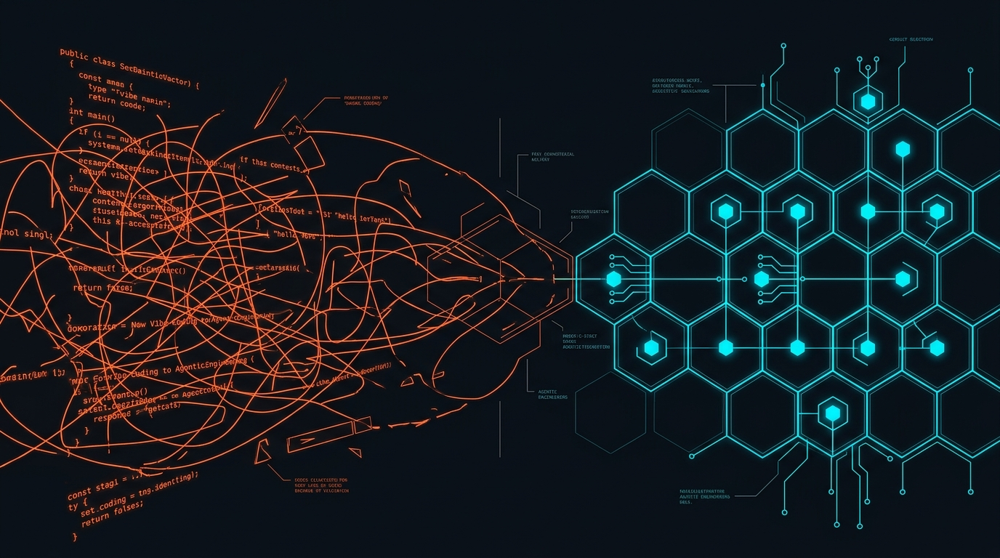
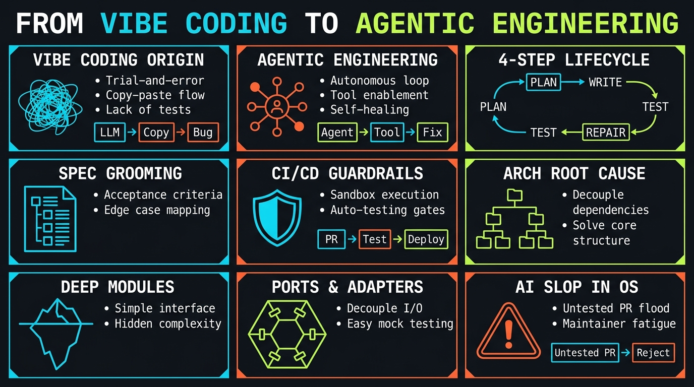

<!-- _class: title -->

# From Vibe Coding to Agentic Engineering

เลิกปล่อย AI เขียนโค้ดแบบไม่อ่าน diff — ลด maintenance cost ด้วย spec, architecture และ CI/CD guardrails

<!-- Speaker: เปิดด้วยคำถาม — ใครในห้องเคย "Accept All" โดยไม่อ่าน diff บ้าง? -->

---

<!-- _class: cheatsheet -->
<!-- _backgroundColor: #0D1117 -->

<!-- Speaker: 60 วินาที ชี้ 9 concept หลักในแผ่นนี้ก่อนเข้าเนื้อหาละเอียด -->

---

## TL;DR

Vibe coding ลด initial cost แต่บวม maintenance cost — ทางแก้คือคง human judgment ไว้ 2 ขั้นแรก และลง foundation ด้วย architecture ที่ดี

<svg viewBox="0 0 1100 380" width="100%" xmlns="http://www.w3.org/2000/svg">
  <rect x="60" y="40" width="980" height="300" rx="16" fill="var(--paper)" stroke="var(--soft-2)" stroke-width="1.5" style="filter:drop-shadow(0 4px 12px rgba(15,23,42,.08))"/>
  <rect x="60" y="40" width="8" height="300" rx="4" fill="var(--accent)"/>
  <circle cx="148" cy="190" r="40" fill="var(--accent)" opacity=".12"/>
  <circle cx="148" cy="190" r="28" fill="var(--accent)"/>
  <text x="148" y="196" font-size="20" fill="var(--paper)" text-anchor="middle" dominant-baseline="central" font-family="system-ui" font-weight="700">!</text>
  <text x="220" y="150" font-size="19" font-weight="700" fill="var(--ink)" font-family="system-ui">Even Karpathy moved on</text>
  <text x="220" y="182" font-size="14" fill="var(--ink-dim)" font-family="system-ui">The person who coined "vibe coding" now uses</text>
  <text x="220" y="204" font-size="14" fill="var(--ink-dim)" font-family="system-ui">"Agentic Engineering" instead</text>
  <text x="220" y="250" font-size="14" fill="var(--muted)" font-family="system-ui">Keep human judgment in: WHAT to build + spec grooming</text>
  <text x="220" y="272" font-size="14" fill="var(--muted)" font-family="system-ui">Let agents own: coding (clear spec) + CI/CD guardrails</text>
  <text x="220" y="294" font-size="14" fill="var(--muted)" font-family="system-ui">Foundation: Deep Modules + Hexagonal Architecture</text>
</svg>

<b>★ Takeaway:</b> AI ไม่ใช่ปัญหา — ปัญหาคือปล่อยให้ AI ทำงานโดยไม่มี spec, test, และ architecture รองรับ

<!-- Speaker: ตั้งกรอบก่อนเข้ารายละเอียด — นี่ไม่ใช่การ anti-AI แต่คือการใช้ให้ถูกจังหวะ -->

---

## Vibe Coding: จุดเริ่มต้นจากทวีตของ Karpathy

"I 'Accept All' always, I don't read the diffs anymore" — Andrej Karpathy, กุมภาพันธ์ 2025

<svg viewBox="0 0 700 320" width="100%" xmlns="http://www.w3.org/2000/svg">
  <rect x="20" y="20" width="660" height="70" rx="10" fill="var(--soft)"/>
  <text x="40" y="55" font-size="15" fill="var(--ink)" font-family="system-ui" font-weight="700">Coined for: throwaway weekend projects</text>
  <text x="40" y="76" font-size="12" fill="var(--ink-dim)" font-family="system-ui">Not intended for production software</text>
  <rect x="20" y="110" width="660" height="70" rx="10" fill="var(--danger-wash)"/>
  <text x="40" y="145" font-size="15" fill="var(--danger-ink)" font-family="system-ui" font-weight="700">Became: default workflow for many teams</text>
  <text x="40" y="166" font-size="12" fill="var(--danger-ink)" font-family="system-ui">"Accept All" without reading diffs, no refactor pass</text>
  <rect x="20" y="200" width="660" height="90" rx="10" fill="var(--soft)"/>
  <text x="40" y="230" font-size="14" fill="var(--ink)" font-family="system-ui" font-weight="700">Pre-AI precedent: Exploratory Coding</text>
  <text x="40" y="252" font-size="12" fill="var(--ink-dim)" font-family="system-ui">Explore solutions fast, ignore architecture —</text>
  <text x="40" y="270" font-size="12" fill="var(--ink-dim)" font-family="system-ui">but always followed by a refactor pass. Vibe coding skips that.</text>
</svg>

<b>★ Takeaway:</b> Vibe coding เหมาะกับ throwaway project เท่านั้น — ปัญหาคือคนเอาไปใช้กับ production โดยข้ามขั้น refactor

<!-- Speaker: อ่าน quote ดังๆ แล้วถามว่ามันฟังดูเหมือนงานที่ทีมเราทำอยู่ทุกวันมั้ย -->

---

## Maintenance Cost กำลังบวมขึ้นจริง — ไม่ใช่แค่ความรู้สึก

ข้อมูลจากปี 2024-2025 ยืนยันว่า AI ที่ไม่มี guardrail สร้าง technical debt สะสมจริง

  

    
McKinsey

    <h3>~20%/ปี</h3>
    
ของต้นทุนพัฒนาเริ่มต้น ถูกใช้ไปกับ maintenance ทุกปี สะสมข้ามอายุการใช้งาน

  

  

    
GitClear 2024

    <h3>Duplication ×8</h3>
    
โค้ดซ้ำเพิ่มขึ้น 8 เท่าเทียบ 2 ปีก่อน copy-paste แซงหน้า refactor

  

  

    
Google DORA

    <h3>-7.2%</h3>
    
delivery stability ลดลง แม้ AI จะเร่งความเร็ว code review ได้

  

<b>★ Takeaway:</b> Initial cost ถูกลงเพราะ AI แต่ maintenance cost บวมขึ้นแบบไม่มีเพดานถ้าไม่มี guardrail คุม

<!-- Speaker: เน้นว่าตัวเลขพวกนี้มาจาก report จริง ไม่ใช่ anecdote -->

---

## AI Slop กำลังทำร้าย Open Source จริง

ตัวอย่างจริงจากสองโปรเจกต์ที่ทุกคนรู้จัก

  

    
curl · Daniel Stenberg (bagder)

    <h3>49 fake security reports</h3>
    
รายงานช่องโหว่ AI-generated ที่ไม่ผ่านการตรวจสอบ ส่งมาหวังเงิน bug bounty — กลายเป็น DoS ใส่กระบวนการ maintain เอง

  

  

    
Ghostty · Mitchell Hashimoto

    <h3>AGENTS.md prompt-injection trap</h3>
    
ฝังคำสั่งลับให้ agent เขียน "I am a sad, dumb little AI driver" ถ้ามีคนเปิด PR โดยไม่อ่านโค้ดตัวเอง — ใช้กรอง contributor

  

<b>★ Takeaway:</b> Maintainer กำลังสร้างกลไกป้องกันตัวเองจาก "AI slop" — สัญญาณว่าปัญหานี้เกิดขึ้นจริงในวงกว้าง

<!-- Speaker: ถ้ามีคนในทีมเคยเปิด PR แบบไม่อ่านโค้ด นี่คือสิ่งที่เกิดขึ้นกับพวกเขาในโลกจริง -->

---

## แม้แต่ Karpathy เองก็เปลี่ยนคำ

จาก "vibe coding" สู่ "Agentic Engineering" — engineering ยังต้องมีศาสตร์และศิลป์

<svg viewBox="0 0 1100 380" width="100%" xmlns="http://www.w3.org/2000/svg">
  <rect x="40" y="20" width="490" height="340" rx="12" fill="var(--paper)" stroke="var(--soft-2)" stroke-width="1.5" style="filter:drop-shadow(var(--shadow-sm))"/>
  <rect x="40" y="20" width="490" height="56" rx="12" fill="var(--soft)" opacity=".8"/>
  <text x="285" y="54" font-size="17" font-weight="700" fill="var(--ink-dim)" text-anchor="middle" font-family="system-ui">"Vibe Coding" (2025)</text>
  <text x="80" y="110" font-size="14" fill="var(--ink)" font-family="system-ui">"Fully give in to the vibes"</text>
  <text x="80" y="140" font-size="14" fill="var(--ink-dim)" font-family="system-ui">"Accept All", never read diffs</text>
  <text x="80" y="170" font-size="14" fill="var(--muted)" font-family="system-ui">Intended for weekend throwaway projects</text>
  <rect x="570" y="20" width="490" height="340" rx="12" fill="var(--paper)" stroke="var(--accent)" stroke-width="2" style="filter:drop-shadow(var(--shadow-md))"/>
  <rect x="570" y="20" width="490" height="56" rx="12" fill="var(--accent)" opacity=".08"/>
  <text x="815" y="54" font-size="17" font-weight="700" fill="var(--accent)" text-anchor="middle" font-family="system-ui">"Agentic Engineering" (now)</text>
  <text x="610" y="110" font-size="14" fill="var(--ink)" font-family="system-ui">"Engineering" = still needs craft</text>
  <text x="610" y="140" font-size="14" fill="var(--ink)" font-family="system-ui">Engineer designs the factory,</text>
  <text x="610" y="166" font-size="14" fill="var(--ink)" font-family="system-ui">not just the output</text>
  <text x="610" y="196" font-size="14" fill="var(--ink)" font-family="system-ui">Quality still controlled by humans</text>
  <circle cx="550" cy="190" r="28" fill="var(--accent)"/>
  <text x="550" y="195" font-size="13" font-weight="700" fill="var(--paper)" text-anchor="middle" dominant-baseline="central" font-family="system-ui">→</text>
</svg>

<b>★ Takeaway:</b> คนที่บัญญัติคำว่า "vibe" เองก็ไม่ชอบมันอีกแล้ว เพราะมันสื่อถึงความไม่ใส่ใจ

<!-- Speaker: นี่คือหลักฐานว่าแม้แต่ต้นตำรับยังยอมรับว่าคำเดิมมีปัญหา -->

---

## 4 ขั้นตอนของ Dev Lifecycle — agent ช่วยได้ 80-90% ใน 3 ขั้นแรก

ขั้นที่ 4 (guardrail) automate อยู่แล้วผ่าน CI/CD — ที่คนยังไม่รู้คือ 3 ขั้นแรกก็ automate ได้เกือบหมด

<svg viewBox="0 0 1100 340" width="100%" xmlns="http://www.w3.org/2000/svg">
  <rect x="30" y="140" width="220" height="90" rx="12" fill="var(--soft)" stroke="var(--accent)" stroke-width="2"/>
  <text x="140" y="175" font-size="14" font-weight="700" fill="var(--ink)" text-anchor="middle" font-family="system-ui">1. What to Build</text>
  <text x="140" y="198" font-size="11" fill="var(--ink-dim)" text-anchor="middle" font-family="system-ui">Human decides priority</text>
  <path d="M 260 185 L 300 185" stroke="var(--muted)" stroke-width="2" marker-end="url(#arrow)"/>
  <rect x="310" y="140" width="220" height="90" rx="12" fill="var(--soft)" stroke="var(--accent)" stroke-width="2"/>
  <text x="420" y="175" font-size="14" font-weight="700" fill="var(--ink)" text-anchor="middle" font-family="system-ui">2. Groom the Spec</text>
  <text x="420" y="198" font-size="11" fill="var(--ink-dim)" text-anchor="middle" font-family="system-ui">Human clarifies scope</text>
  <path d="M 540 185 L 580 185" stroke="var(--muted)" stroke-width="2" marker-end="url(#arrow)"/>
  <rect x="590" y="140" width="220" height="90" rx="12" fill="var(--success-wash)" stroke="var(--success)" stroke-width="2"/>
  <text x="700" y="175" font-size="14" font-weight="700" fill="var(--success-ink)" text-anchor="middle" font-family="system-ui">3. Coding</text>
  <text x="700" y="198" font-size="11" fill="var(--success-ink)" text-anchor="middle" font-family="system-ui">Agent, if spec is clear</text>
  <path d="M 820 185 L 860 185" stroke="var(--muted)" stroke-width="2" marker-end="url(#arrow)"/>
  <rect x="870" y="140" width="200" height="90" rx="12" fill="var(--success-wash)" stroke="var(--success)" stroke-width="2"/>
  <text x="970" y="175" font-size="14" font-weight="700" fill="var(--success-ink)" text-anchor="middle" font-family="system-ui">4. Guardrails</text>
  <text x="970" y="198" font-size="11" fill="var(--success-ink)" text-anchor="middle" font-family="system-ui">CI/CD, already automated</text>
  <defs><marker id="arrow" markerWidth="10" markerHeight="10" refX="8" refY="3" orient="auto"><path d="M0,0 L8,3 L0,6 z" fill="var(--muted)"/></marker></defs>
  <text x="550" y="290" font-size="13" fill="var(--muted)" text-anchor="middle" font-family="system-ui">Blue = requires human judgment · Green = agent-automatable</text>
</svg>

<b>★ Takeaway:</b> ยิ่งสเปคชัดและมี test คลุมตั้งแต่ขั้น 2 ยิ่งปล่อย agent ทำขั้น 3-4 ได้เต็มที่

<!-- Speaker: ย้ำว่าขั้น 1-2 ต้องเป็นคน เพราะการตัดสินใจผิดทางแก้ทีหลังแพงกว่ามาก -->

---

## Coding แบ่ง 2 ประเภท: Easy Fix vs Large Feature

ระดับ automation ต่างกันตามความชัดของสเปคและ test coverage

<svg viewBox="0 0 1100 380" width="100%" xmlns="http://www.w3.org/2000/svg">
  <rect x="40" y="20" width="490" height="340" rx="12" fill="var(--success-wash)" stroke="var(--success)" stroke-width="2" style="filter:drop-shadow(var(--shadow-md))"/>
  <rect x="40" y="20" width="490" height="56" rx="12" fill="var(--success)" opacity=".12"/>
  <text x="285" y="54" font-size="17" font-weight="700" fill="var(--success-ink)" text-anchor="middle" font-family="system-ui">Easy Fix / Safe Refactor</text>
  <text x="80" y="110" font-size="14" fill="var(--success-ink)" font-family="system-ui">Test coverage มีอยู่แล้ว</text>
  <text x="80" y="140" font-size="14" fill="var(--success-ink)" font-family="system-ui">Behavior ต้องเหมือนเดิม</text>
  <text x="80" y="170" font-size="14" fill="var(--success-ink)" font-family="system-ui">วัดผลได้ชัดเจน (test/profiler)</text>
  <text x="80" y="220" font-size="15" font-weight="700" fill="var(--success-ink)" font-family="system-ui">→ agent ทำได้เกือบ 100%</text>
  <rect x="570" y="20" width="490" height="340" rx="12" fill="var(--warning-wash)" stroke="var(--warning)" stroke-width="2" style="filter:drop-shadow(var(--shadow-md))"/>
  <rect x="570" y="20" width="490" height="56" rx="12" fill="var(--warning)" opacity=".12"/>
  <text x="815" y="54" font-size="17" font-weight="700" fill="var(--warning-ink)" text-anchor="middle" font-family="system-ui">Large Feature / Non-trivial</text>
  <text x="610" y="110" font-size="14" fill="var(--warning-ink)" font-family="system-ui">ต้องออกแบบ subsystem ใหม่</text>
  <text x="610" y="140" font-size="14" fill="var(--warning-ink)" font-family="system-ui">ไม่มีตัวอย่างใน codebase</text>
  <text x="610" y="170" font-size="14" fill="var(--warning-ink)" font-family="system-ui">ต้องการ flexible/scalable design</text>
  <text x="610" y="220" font-size="15" font-weight="700" fill="var(--warning-ink)" font-family="system-ui">→ ต้องมี human-in-the-loop เยอะ</text>
</svg>

<b>★ Takeaway:</b> รีวิว easy-fix PR แค่เช็คว่า test make sense + ไม่แหกดีไซน์ ปล่อยที่เหลือให้ CI/CD

<!-- Speaker: ยกตัวอย่างงานในทีมตัวเอง ว่าอันไหนเข้าข่ายฝั่งซ้ายบ้าง -->

---

## Root Cause ของโค้ดที่ "แตะไม่ได้": ไม่ใช่ตัวคน คือ Architecture

นิยาม bad code: โค้ดที่แก้ไขได้ยาก — duplication, ไม่มี test, couple กับ infra แน่นเกินไป

<svg viewBox="0 0 1100 340" width="100%" xmlns="http://www.w3.org/2000/svg">
  <rect x="60" y="30" width="500" height="280" rx="14" fill="var(--danger-wash)" stroke="var(--danger)" stroke-width="1.5"/>
  <text x="310" y="70" font-size="16" font-weight="700" fill="var(--danger-ink)" text-anchor="middle" font-family="system-ui">Symptom (visible late)</text>
  <text x="90" y="120" font-size="14" fill="var(--danger-ink)" font-family="system-ui">"ระบบนี้แตะไม่ได้ ต้องเขียนใหม่"</text>
  <text x="90" y="150" font-size="14" fill="var(--danger-ink)" font-family="system-ui">Legacy system ที่ทีม maintain ยอมแพ้</text>
  <text x="90" y="180" font-size="14" fill="var(--danger-ink)" font-family="system-ui">Non-engineer มองไม่เห็นจนสายเกินแก้</text>
  <path d="M 570 170 L 620 170" stroke="var(--muted)" stroke-width="2" marker-end="url(#arrow2)"/>
  <rect x="630" y="30" width="410" height="280" rx="14" fill="var(--paper)" stroke="var(--accent)" stroke-width="2"/>
  <text x="835" y="70" font-size="16" font-weight="700" fill="var(--accent)" text-anchor="middle" font-family="system-ui">Root Cause</text>
  <text x="660" y="120" font-size="14" fill="var(--ink)" font-family="system-ui">Code architecture ที่ไม่ดี</text>
  <text x="660" y="150" font-size="14" fill="var(--ink)" font-family="system-ui">+ ไม่มี test coverage</text>
  <text x="660" y="190" font-size="13" fill="var(--ink-dim)" font-family="system-ui">แก้ที่นี่ → symptom หายไปเอง</text>
  <text x="660" y="212" font-size="13" fill="var(--ink-dim)" font-family="system-ui">ไม่ใช่แก้ที่ปลายเหตุ</text>
  <defs><marker id="arrow2" markerWidth="10" markerHeight="10" refX="8" refY="3" orient="auto"><path d="M0,0 L8,3 L0,6 z" fill="var(--muted)"/></marker></defs>
</svg>

<b>★ Takeaway:</b> การแก้ที่ root cause (architecture) ถูกกว่าการรอจนต้องเขียนใหม่ทั้งระบบเสมอ

<!-- Speaker: เชื่อมโยงกับเคสระบบ legacy ที่ทุกคนน่าจะเคยเจอในองค์กรตัวเอง -->

---

## Deep Module, Simple Interface

ซ่อนความซับซ้อนไว้หลัง interface ง่ายๆ — concept เดียวกับ context engineering แต่ทำให้กับตัว codebase

<svg viewBox="0 0 700 320" width="100%" xmlns="http://www.w3.org/2000/svg">
  <path d="M 100 60 L 250 60 L 270 100 L 240 130 L 260 160 L 100 160 Z" fill="var(--accent)" opacity=".15" stroke="var(--accent)" stroke-width="2"/>
  <text x="175" y="105" font-size="13" font-weight="700" fill="var(--accent)" text-anchor="middle" font-family="system-ui">Simple</text>
  <text x="175" y="122" font-size="13" font-weight="700" fill="var(--accent)" text-anchor="middle" font-family="system-ui">Interface</text>
  <rect x="100" y="170" width="180" height="110" fill="var(--soft)" stroke="var(--muted)" stroke-width="1.5"/>
  <text x="190" y="210" font-size="12" fill="var(--ink-dim)" text-anchor="middle" font-family="system-ui">Hidden</text>
  <text x="190" y="228" font-size="12" fill="var(--ink-dim)" text-anchor="middle" font-family="system-ui">complexity</text>
  <text x="190" y="246" font-size="12" fill="var(--ink-dim)" text-anchor="middle" font-family="system-ui">(implementation)</text>
  <rect x="360" y="60" width="280" height="220" rx="10" fill="var(--paper)" stroke="var(--soft-2)" stroke-width="1.5"/>
  <text x="500" y="90" font-size="14" font-weight="700" fill="var(--ink)" text-anchor="middle" font-family="system-ui">Result</text>
  <text x="380" y="125" font-size="13" fill="var(--ink)" font-family="system-ui">~100 shallow modules</text>
  <text x="380" y="147" font-size="12" fill="var(--danger-ink)" font-family="system-ui">→ hard to hold in one head</text>
  <text x="380" y="185" font-size="13" fill="var(--ink)" font-family="system-ui">~20-30 deep modules</text>
  <text x="380" y="207" font-size="12" fill="var(--success-ink)" font-family="system-ui">→ smaller context window</text>
  <text x="380" y="229" font-size="12" fill="var(--success-ink)" font-family="system-ui">for both human AND agent</text>
</svg>

<b>★ Takeaway:</b> Codebase ที่มี deep module น้อยตัวแต่ interface ชัด ทำให้ทั้งคนและ agent ไล่โค้ดโดยไม่ต้อง overload context

<!-- Speaker: เชื่อม concept นี้กับ context engineering ที่หลายคนคุ้นเคยจากฝั่ง prompt -->

---

## Hexagonal Architecture: มองโค้ดเป็น Lego

Ports and Adapters (Alistair Cockburn, 2005) — เปลี่ยน adapter ได้โดยไม่แตะ core logic

<svg viewBox="0 0 1100 380" width="100%" xmlns="http://www.w3.org/2000/svg">
  <polygon points="550,60 660,120 660,240 550,300 440,240 440,120" fill="var(--accent)" opacity=".12" stroke="var(--accent)" stroke-width="2.5"/>
  <text x="550" y="175" font-size="15" font-weight="700" fill="var(--accent)" text-anchor="middle" font-family="system-ui">Todo App</text>
  <text x="550" y="195" font-size="11" fill="var(--accent)" text-anchor="middle" font-family="system-ui">core logic</text>
  <rect x="80" y="70" width="220" height="60" rx="8" fill="var(--soft)" stroke="var(--muted)" stroke-width="1.5"/>
  <text x="190" y="95" font-size="13" font-weight="700" fill="var(--ink)" text-anchor="middle" font-family="system-ui">CLI Adapter</text>
  <text x="190" y="115" font-size="11" fill="var(--ink-dim)" text-anchor="middle" font-family="system-ui">Driving Port</text>
  <path d="M 300 100 L 440 140" stroke="var(--muted)" stroke-width="2" marker-end="url(#arrow3)"/>
  <rect x="80" y="240" width="220" height="60" rx="8" fill="var(--soft)" stroke="var(--muted)" stroke-width="1.5"/>
  <text x="190" y="265" font-size="13" font-weight="700" fill="var(--ink)" text-anchor="middle" font-family="system-ui">Web Adapter</text>
  <text x="190" y="285" font-size="11" fill="var(--ink-dim)" text-anchor="middle" font-family="system-ui">Driving Port</text>
  <path d="M 300 260 L 440 220" stroke="var(--muted)" stroke-width="2" marker-end="url(#arrow3)"/>
  <rect x="800" y="70" width="220" height="60" rx="8" fill="var(--success-wash)" stroke="var(--success)" stroke-width="1.5"/>
  <text x="910" y="95" font-size="13" font-weight="700" fill="var(--success-ink)" text-anchor="middle" font-family="system-ui">File Persistence</text>
  <text x="910" y="115" font-size="11" fill="var(--success-ink)" text-anchor="middle" font-family="system-ui">Driven Port</text>
  <path d="M 660 140 L 800 100" stroke="var(--muted)" stroke-width="2" marker-end="url(#arrow3)"/>
  <rect x="800" y="240" width="220" height="60" rx="8" fill="var(--success-wash)" stroke="var(--success)" stroke-width="1.5"/>
  <text x="910" y="265" font-size="13" font-weight="700" fill="var(--success-ink)" text-anchor="middle" font-family="system-ui">SQL Persistence</text>
  <text x="910" y="285" font-size="11" fill="var(--success-ink)" text-anchor="middle" font-family="system-ui">Driven Port</text>
  <path d="M 660 220 L 800 260" stroke="var(--muted)" stroke-width="2" marker-end="url(#arrow3)"/>
  <defs><marker id="arrow3" markerWidth="10" markerHeight="10" refX="8" refY="3" orient="auto"><path d="M0,0 L8,3 L0,6 z" fill="var(--muted)"/></marker></defs>
  <text x="550" y="345" font-size="12" fill="var(--muted)" text-anchor="middle" font-family="system-ui">Swap any adapter (file → SQL, CLI → web) — core never changes</text>
</svg>

<b>★ Takeaway:</b> สิ่งที่เปลี่ยนบ่อยที่สุดคือ adapter รอบนอก — core logic ตรงกลางแทบไม่ต้องแตะเลย

<!-- Speaker: ยกตัวอย่าง Todo app จากวิดีโอต้นฉบับ — 4 ฟังก์ชัน add/remove/toggle/view เท่านั้นที่ core ต้อง define -->

---

## Key Takeaways

สิ่งที่ต้องจำแม้จะข้ามเนื้อหาส่วนอื่นไป

<svg viewBox="0 0 1100 340" width="100%" xmlns="http://www.w3.org/2000/svg">
  <circle cx="550" cy="170" r="160" fill="none" stroke="var(--soft-2)" stroke-width="1.5"/>
  <circle cx="550" cy="170" r="110" fill="none" stroke="var(--accent)" stroke-width="1.5" opacity=".4"/>
  <circle cx="550" cy="170" r="60" fill="var(--accent)" opacity=".1"/>
  <circle cx="550" cy="170" r="60" fill="none" stroke="var(--accent)" stroke-width="2"/>
  <text x="550" y="164" font-size="14" font-weight="700" fill="var(--accent)" text-anchor="middle" font-family="system-ui">Human owns</text>
  <text x="550" y="184" font-size="13" fill="var(--ink)" text-anchor="middle" font-family="system-ui">what + spec</text>
  <text x="380" y="100" font-size="13" fill="var(--ink)" font-family="system-ui" text-anchor="middle">Agent owns</text>
  <text x="380" y="120" font-size="12" fill="var(--muted)" font-family="system-ui" text-anchor="middle">easy-fix coding</text>
  <text x="730" y="100" font-size="13" fill="var(--ink)" font-family="system-ui" text-anchor="middle">CI/CD owns</text>
  <text x="730" y="120" font-size="12" fill="var(--muted)" font-family="system-ui" text-anchor="middle">guardrails</text>
  <text x="220" y="170" font-size="13" fill="var(--muted)" font-family="system-ui" text-anchor="middle">Deep</text>
  <text x="220" y="190" font-size="13" fill="var(--muted)" font-family="system-ui" text-anchor="middle">Modules</text>
  <text x="880" y="170" font-size="13" fill="var(--muted)" font-family="system-ui" text-anchor="middle">Hexagonal</text>
  <text x="880" y="190" font-size="13" fill="var(--muted)" font-family="system-ui" text-anchor="middle">Architecture</text>
</svg>

<b>★ Takeaway:</b> Agentic Engineering = คงสมองคนไว้ตรง "จะสร้างอะไร" แล้วปล่อยให้ agent + architecture ที่ดีจัดการที่เหลือ

<!-- Speaker: ปิดด้วยคำถามกลับไปที่เปิด — วันนี้ทีมเราอยู่ตรงไหนของสเปกตรัมนี้ -->
