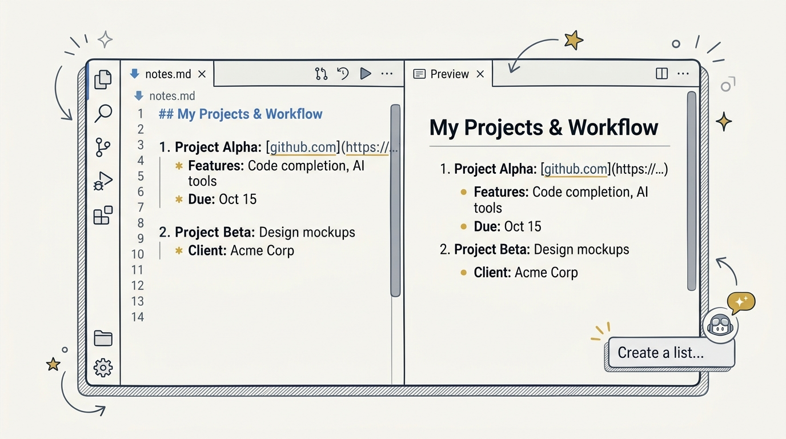
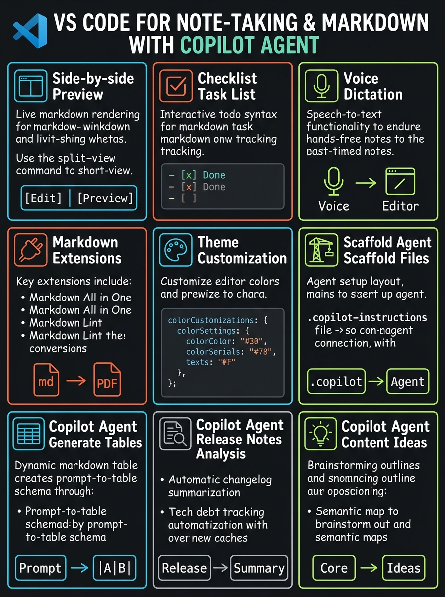
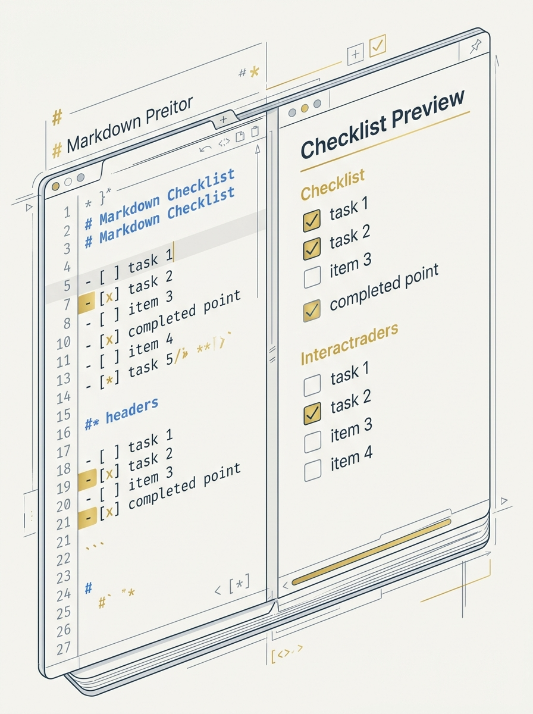
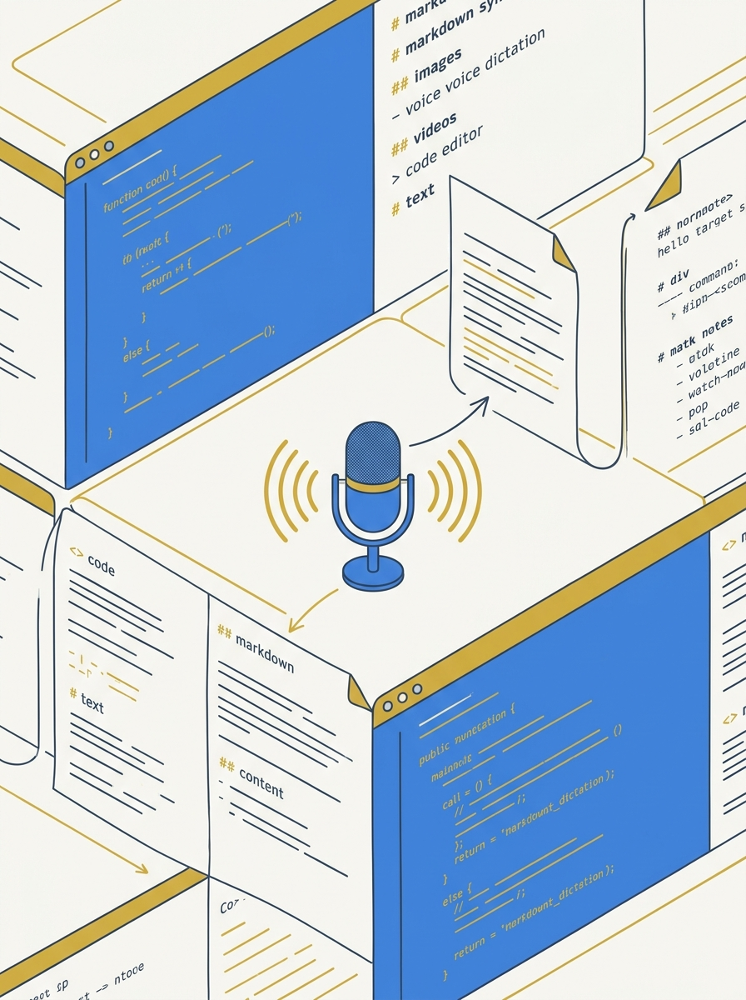
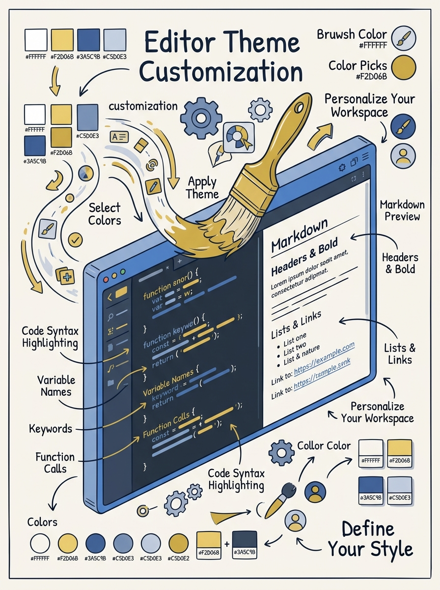

<!-- _class: title -->

# VS Code for Note-Taking, Markdown & Copilot Agent

Side-by-side preview, dictation, checklists, themes — plus Copilot Agent scaffolding, tables, and release notes

<!-- Speaker: VS Code isn't just a code editor — it's a capable note-taking tool once you layer in the right extensions and Copilot Agent mode. -->

---

<!-- _class: cheatsheet -->
<!-- _backgroundColor: #f8f7f4 -->

<!-- Speaker: 60-second orientation — nine concepts on one page, point at each zone before diving in. -->

---

## Why VS Code for Notes, Not Just Code

Local-first, plain-text `.md` files, and an extension ecosystem large enough to replace a dedicated note app.

<svg viewBox="0 0 1100 380" width="100%" xmlns="http://www.w3.org/2000/svg">
  <rect x="60" y="40" width="980" height="300" rx="16" fill="var(--paper)" stroke="var(--soft-2)" stroke-width="1.5" style="filter:drop-shadow(0 4px 12px rgba(15,23,42,.08))"/>
  <rect x="60" y="40" width="8" height="300" rx="4" fill="var(--accent)"/>
  <circle cx="148" cy="190" r="40" fill="var(--accent)" opacity=".12"/>
  <circle cx="148" cy="190" r="28" fill="var(--accent)"/>
  <text x="148" y="196" font-size="18" fill="var(--paper)" text-anchor="middle" dominant-baseline="central" font-family="system-ui" font-weight="700">+</text>
  <text x="220" y="150" font-size="20" font-weight="700" fill="var(--ink)" font-family="system-ui">Portable plain-text over app lock-in</text>
  <text x="220" y="185" font-size="15" fill="var(--ink-dim)" font-family="system-ui">Files are `.md` — readable outside VS Code, versionable in git</text>
  <text x="220" y="215" font-size="15" fill="var(--muted)" font-family="system-ui">Extensions fill the gaps: preview, checklist, dictation, theming</text>
  <text x="220" y="245" font-size="15" fill="var(--muted)" font-family="system-ui">Copilot Agent adds AI-assisted document workflows on top</text>
</svg>

<b>★ Takeaway:</b> Local-first plain text plus a mature extension ecosystem turns VS Code into a full note-taking tool.

<!-- Speaker: Frame this as "why bother" before going feature-by-feature. -->

---

## Side-by-Side Preview and Interactive Checklists

Ctrl+K V splits the pane; task-list checkboxes render but aren't clickable by default.

<svg viewBox="0 0 700 320" width="100%" xmlns="http://www.w3.org/2000/svg">
  <rect x="20" y="30" width="290" height="260" rx="10" fill="var(--soft)" stroke="var(--soft-2)" stroke-width="1.5"/>
  <text x="165" y="60" font-size="14" font-weight="700" fill="var(--ink-dim)" text-anchor="middle" font-family="system-ui">Editor</text>
  <text x="45" y="100" font-size="13" fill="var(--muted)" font-family="monospace">- [ ] Draft outline</text>
  <text x="45" y="125" font-size="13" fill="var(--muted)" font-family="monospace">- [x] Research done</text>
  <rect x="390" y="30" width="290" height="260" rx="10" fill="var(--paper)" stroke="var(--accent)" stroke-width="2"/>
  <text x="535" y="60" font-size="14" font-weight="700" fill="var(--accent)" text-anchor="middle" font-family="system-ui">Preview</text>
  <rect x="415" y="90" width="14" height="14" rx="3" fill="none" stroke="var(--ink)" stroke-width="1.5"/>
  <text x="440" y="102" font-size="13" fill="var(--ink)" font-family="system-ui">Draft outline</text>
  <rect x="415" y="120" width="14" height="14" rx="3" fill="var(--success)"/>
  <text x="440" y="132" font-size="13" fill="var(--ink)" font-family="system-ui">Research done</text>
  <path d="M320 160 L385 160" stroke="var(--muted)" stroke-width="2" fill="none" marker-end="url(#arrowP)"/>
  <defs><marker id="arrowP" markerWidth="8" markerHeight="8" refX="6" refY="4" orient="auto"><path d="M0,0 L8,4 L0,8 Z" fill="var(--muted)"/></marker></defs>
</svg>

<b>★ Takeaway:</b> Ctrl+K V gives real-time split preview; clickable checkboxes need the Markdown Checkbox Preview extension.

<!-- Speaker: Show the keyboard shortcut live if presenting; call out the non-interactive default. -->

---

## Voice Dictation — With a Gap in Agent Mode

The free VS Code Speech extension runs on-device dictation into Copilot Chat — but not into the Agent window.

<svg viewBox="0 0 700 320" width="100%" xmlns="http://www.w3.org/2000/svg">
  <circle cx="150" cy="160" r="50" fill="var(--accent)" opacity=".12"/>
  <circle cx="150" cy="160" r="34" fill="var(--accent)"/>
  <text x="150" y="167" font-size="22" fill="var(--paper)" text-anchor="middle" dominant-baseline="central" font-family="system-ui" font-weight="700">mic</text>
  <path d="M195 160 Q260 100 320 160" stroke="var(--muted)" stroke-width="2" fill="none" marker-end="url(#arrowD)"/>
  <defs><marker id="arrowD" markerWidth="8" markerHeight="8" refX="6" refY="4" orient="auto"><path d="M0,0 L8,4 L0,8 Z" fill="var(--muted)"/></marker></defs>
  <rect x="330" y="90" width="330" height="140" rx="10" fill="var(--paper)" stroke="var(--success)" stroke-width="2"/>
  <text x="495" y="120" font-size="14" font-weight="700" fill="var(--success)" text-anchor="middle" font-family="system-ui">Copilot Chat</text>
  <text x="495" y="150" font-size="13" fill="var(--ink)" text-anchor="middle" font-family="system-ui">Dictation supported</text>
  <rect x="330" y="250" width="330" height="50" rx="10" fill="var(--danger-wash)" stroke="var(--danger)" stroke-width="1.5"/>
  <text x="495" y="280" font-size="13" font-weight="700" fill="var(--danger-ink)" text-anchor="middle" font-family="system-ui">Agent window — no mic button</text>
</svg>

<b>★ Takeaway:</b> Use Copilot Chat panel for dictation today; Agent mode has no microphone input yet.

<!-- Speaker: Point out this is a known gap, tracked in a GitHub issue, not a config mistake. -->

---

## Markdown Extensions Worth Installing

Three extensions cover most note-taking needs — install, don't build your own tooling.

| Extension | Adds |
|---|---|
| **Markdown All in One** | Shortcuts, auto-preview, table formatting — 5M+ installs |
| **Markdown Preview Enhanced** | Mermaid/PlantUML diagrams, math, presentation mode |
| **markdownlint** | Style checks before docs go out the door |

<b>★ Takeaway:</b> Start with Markdown All in One; add Preview Enhanced only if you need diagrams or math.

<!-- Speaker: Table format is native Marp rendering — keep it as a real table, not an SVG. -->

---

## Theme Customization Beyond the Marketplace

Pick a color theme, then fine-tune specific UI colors with `workbench.colorCustomizations`.

<svg viewBox="0 0 700 320" width="100%" xmlns="http://www.w3.org/2000/svg">
  <rect x="20" y="40" width="660" height="240" rx="10" fill="var(--ink)" opacity=".04"/>
  <text x="45" y="75" font-size="13" fill="var(--ink-dim)" font-family="monospace">{</text>
  <text x="65" y="105" font-size="13" fill="var(--accent)" font-family="monospace">"workbench.colorCustomizations"</text>
  <text x="65" y="135" font-size="13" fill="var(--ink-dim)" font-family="monospace">: {</text>
  <text x="85" y="165" font-size="13" fill="var(--ink)" font-family="monospace">"titleBar.activeBackground"</text>
  <text x="85" y="195" font-size="13" fill="var(--gold)" font-family="monospace">: "#ff0000"</text>
  <text x="65" y="225" font-size="13" fill="var(--ink-dim)" font-family="monospace">}</text>
  <text x="45" y="255" font-size="13" fill="var(--ink-dim)" font-family="monospace">}</text>
</svg>

<b>★ Takeaway:</b> Fine-tune one color at a time in settings.json — no need to fork or build a whole new theme.

<!-- Speaker: Show a live edit to settings.json if presenting; changes apply instantly. -->

---

## Copilot Agent Mode: Four Document Workflows

Open Copilot Edits → select "Agent" from the mode dropdown. It reads the codebase before proposing changes.

  

    
Scaffold

    <h3>New files</h3>
    
One prompt creates files, sections, or a whole feature skeleton.

  

  

    
Transform

    <h3>CSV → tables</h3>
    
Reads a CSV, builds an aligned Markdown table, saves it where asked.

  

  

    
Summarize

    <h3>Release notes</h3>
    
A `/release-notes` prompt file pulls context from recent commits.

  

  

    
Suggest

    <h3>Content ideas</h3>
    
Reading related files surfaces missing sections while editing.

  

<b>★ Takeaway:</b> Agent mode turns document chores — scaffolding, tables, changelogs — into single prompts, but always review the diff before accepting.

<!-- Speaker: Demo one workflow live if time allows — CSV-to-table is the most visually convincing. -->

---

## Caveats Before You Rely On This Workflow

Three gaps to know before building a daily habit around VS Code note-taking + Copilot Agent.

  

    
Not Default

    <h3>Checklist clicks</h3>
    
Preview checkboxes are visual-only until you add an extension.

  

  

    
Not Stable

    <h3>Speech extension</h3>
    
Public reports of dictation failing outright — third-party tools exist as backup.

  

  

    
Not Free

    <h3>Copilot subscription</h3>
    
Agent mode requires an active GitHub Copilot license.

  

<b>★ Takeaway:</b> Treat dictation and one-click checklists as nice-to-haves, not load-bearing parts of the workflow.

<!-- Speaker: Manage expectations — this is a strong setup, not a finished consumer product. -->

---

## Key Takeaways

What a reader who skips the deck body still needs to know.

<svg viewBox="0 0 1100 340" width="100%" xmlns="http://www.w3.org/2000/svg">
  <circle cx="550" cy="170" r="160" fill="none" stroke="var(--soft-2)" stroke-width="1.5"/>
  <circle cx="550" cy="170" r="110" fill="none" stroke="var(--accent)" stroke-width="1.5" opacity=".4"/>
  <circle cx="550" cy="170" r="60" fill="var(--accent)" opacity=".1"/>
  <circle cx="550" cy="170" r="60" fill="none" stroke="var(--accent)" stroke-width="2"/>
  <text x="550" y="164" font-size="15" font-weight="700" fill="var(--accent)" text-anchor="middle" font-family="system-ui">Ctrl+K V</text>
  <text x="550" y="184" font-size="13" fill="var(--ink)" text-anchor="middle" font-family="system-ui">split preview</text>
  <text x="380" y="100" font-size="13" fill="var(--ink)" font-family="system-ui" text-anchor="middle">Extensions add</text>
  <text x="380" y="120" font-size="12" fill="var(--muted)" font-family="system-ui" text-anchor="middle">checklists + dictation</text>
  <text x="730" y="100" font-size="13" fill="var(--ink)" font-family="system-ui" text-anchor="middle">workbench.color-</text>
  <text x="730" y="120" font-size="12" fill="var(--muted)" font-family="system-ui" text-anchor="middle">Customizations tunes UI</text>
  <text x="220" y="170" font-size="13" fill="var(--muted)" font-family="system-ui" text-anchor="middle">Agent mode</text>
  <text x="220" y="190" font-size="13" fill="var(--muted)" font-family="system-ui" text-anchor="middle">scaffolds + tables</text>
  <text x="880" y="170" font-size="13" fill="var(--muted)" font-family="system-ui" text-anchor="middle">No mic in</text>
  <text x="880" y="190" font-size="13" fill="var(--muted)" font-family="system-ui" text-anchor="middle">Agent window (yet)</text>
</svg>

<b>★ Takeaway:</b> VS Code + Copilot Agent covers 90% of a note-taking workflow — extensions and license checks fill the last 10%.

