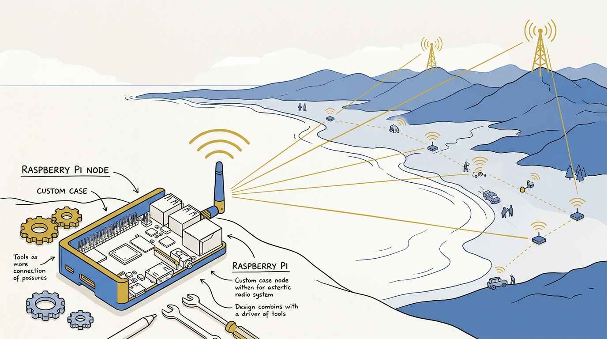
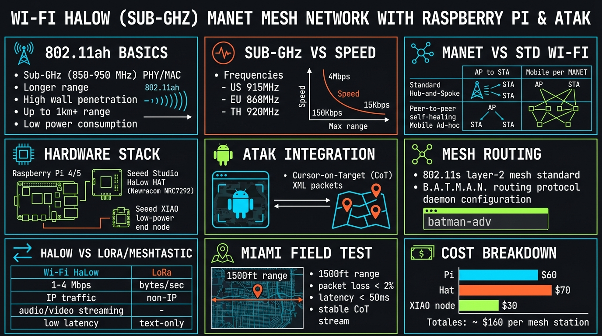
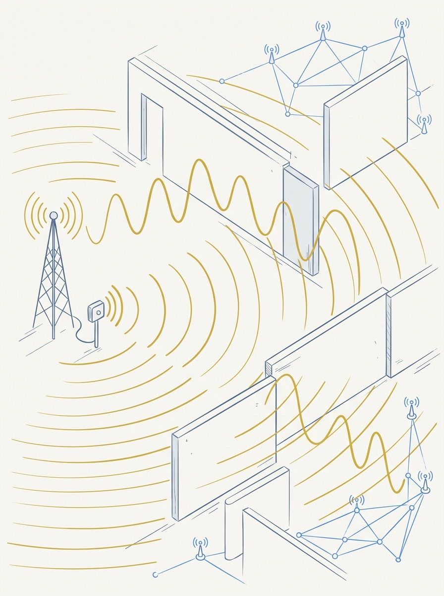
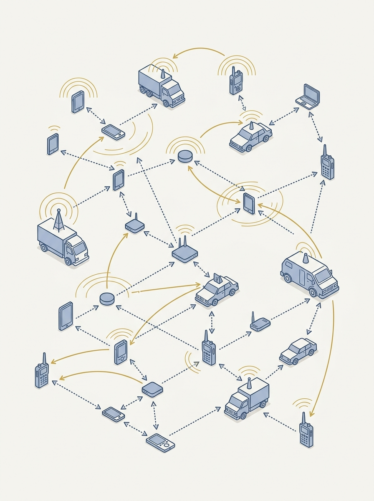
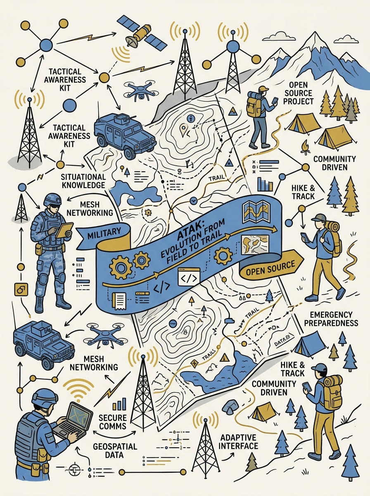

<!-- _class: title -->

# Wi-Fi HaLow (Sub-GHz): MANET ระยะไกล พลังงานต่ำ

Raspberry Pi + ATAK สร้างเครือข่าย mesh ที่ไม่ง้อค่ายมือถือหรือดาวเทียม

<!-- Speaker: ทักทาย เกริ่นว่าวิดีโอต้นทางทดสอบจริงในสนาม ไม่ใช่แค่ทฤษฎี -->

---

<!-- _class: cheatsheet -->
<!-- _backgroundColor: #f8f7f4 -->

<!-- Speaker: ชี้ 9 concept หลักในภาพก่อนเข้ารายละเอียด -->

---

## TL;DR: Wi-Fi ที่เดินทางไปกับคุณได้ ไม่ใช่ติดกับบ้าน

รวม 3 อย่างเข้าด้วยกัน: มาตรฐานคลื่นความถี่ต่ำ + สถาปัตยกรรม MANET + ซอฟต์แวร์ทหารที่เปิดซอร์ส

<svg viewBox="0 0 1100 340" width="100%" xmlns="http://www.w3.org/2000/svg">
  <rect x="40" y="60" width="1020" height="220" rx="16" fill="var(--paper)" stroke="var(--soft-2)" stroke-width="1.5" style="filter:drop-shadow(0 4px 12px rgba(15,23,42,.08))"/>
  <circle cx="180" cy="170" r="52" fill="var(--accent)" opacity=".12"/>
  <circle cx="180" cy="170" r="36" fill="var(--accent)"/>
  <text x="180" y="176" font-size="16" fill="var(--paper)" text-anchor="middle" font-family="system-ui" font-weight="700">HaLow</text>
  <text x="180" y="245" font-size="13" fill="var(--ink-dim)" text-anchor="middle" font-family="system-ui">902-928 MHz</text>
  <text x="360" y="150" font-size="30" fill="var(--muted)" text-anchor="middle" font-family="system-ui">+</text>
  <circle cx="550" cy="170" r="52" fill="var(--gold)" opacity=".12"/>
  <circle cx="550" cy="170" r="36" fill="var(--gold)"/>
  <text x="550" y="176" font-size="16" fill="var(--paper)" text-anchor="middle" font-family="system-ui" font-weight="700">MANET</text>
  <text x="550" y="245" font-size="13" fill="var(--ink-dim)" text-anchor="middle" font-family="system-ui">no tower, no satellite</text>
  <text x="730" y="150" font-size="30" fill="var(--muted)" text-anchor="middle" font-family="system-ui">+</text>
  <circle cx="920" cy="170" r="52" fill="var(--success)" opacity=".12"/>
  <circle cx="920" cy="170" r="36" fill="var(--success)"/>
  <text x="920" y="176" font-size="16" fill="var(--paper)" text-anchor="middle" font-family="system-ui" font-weight="700">ATAK</text>
  <text x="920" y="245" font-size="13" fill="var(--ink-dim)" text-anchor="middle" font-family="system-ui">open-source, tak.gov</text>
</svg>

<b>★ Takeaway:</b> ต้นทุนฮาร์ดแวร์รวมไม่ถึง $100 เทียบกับวิทยุทหารระดับ $15,000-20,000/เครื่อง

<!-- Speaker: MPU-5 ราคาเท่าไหร่ เทียบกับของที่ประกอบเองได้ -->

---

## Wi-Fi HaLow (802.11ah): Wi-Fi ที่ทะลุกำแพงได้ไกลกว่า

ย้ายจาก 2.4/5GHz มาใช้ sub-1GHz แลกความเร็วเอาระยะทางและพลังงานต่ำ

<svg viewBox="0 0 700 320" width="100%" xmlns="http://www.w3.org/2000/svg">
  <rect x="30" y="40" width="640" height="60" rx="10" fill="var(--soft)" />
  <text x="50" y="76" font-size="15" font-weight="700" fill="var(--ink)" font-family="system-ui">Standard Wi-Fi: 2.4 / 5 / 6 GHz</text>
  <rect x="30" y="120" width="380" height="60" rx="10" fill="var(--accent)" opacity=".12"/>
  <rect x="30" y="120" width="6" height="60" fill="var(--accent)"/>
  <text x="50" y="150" font-size="15" font-weight="700" fill="var(--accent)" font-family="system-ui">Wi-Fi HaLow: 902-928 MHz</text>
  <text x="50" y="170" font-size="13" fill="var(--ink-dim)" font-family="system-ui">IEEE 802.11ah, published 2017</text>
  <text x="30" y="230" font-size="14" fill="var(--ink)" font-family="system-ui">Range: 100 m - 1 km</text>
  <text x="30" y="256" font-size="14" fill="var(--ink)" font-family="system-ui">Data rate: 150 kbps - 86.7 Mbps</text>
  <text x="30" y="282" font-size="13" fill="var(--muted)" font-family="system-ui">Lower frequency = better wall penetration</text>
</svg>

<b>★ Takeaway:</b> ยิ่งความถี่ต่ำ ยิ่งทะลุกำแพง/สิ่งกีดขวางได้ดีและไปได้ไกลขึ้น แต่แลกด้วยความเร็ว

<!-- Speaker: เทียบเลขความถี่กับ Wi-Fi ทั่วไปที่ทุกคนคุ้นเคย -->

---

## Trade-off ระยะ vs ความเร็ว: กฎฟิสิกส์ ไม่ใช่บั๊ก

Channel width แคบลง = ระยะไกลขึ้น แต่ throughput ต่ำลง — และกำลังส่งก็ถูกจำกัดโดยกฎหมาย

<svg viewBox="0 0 1100 380" width="100%" xmlns="http://www.w3.org/2000/svg">
  <line x1="100" y1="320" x2="1000" y2="320" stroke="var(--muted)" stroke-width="1.5"/>
  <line x1="100" y1="320" x2="100" y2="60" stroke="var(--muted)" stroke-width="1.5"/>
  <text x="1000" y="345" font-size="13" fill="var(--ink-dim)" text-anchor="end" font-family="system-ui">Range (channel width narrows &#8594;)</text>
  <text x="80" y="60" font-size="13" fill="var(--ink-dim)" text-anchor="end" font-family="system-ui">Throughput</text>
  <path d="M 140 100 Q 500 180 960 300" fill="none" stroke="var(--accent)" stroke-width="3"/>
  <circle cx="220" cy="120" r="8" fill="var(--accent)"/>
  <text x="220" y="105" font-size="14" fill="var(--ink)" text-anchor="middle" font-family="system-ui" font-weight="700">16 MHz</text>
  <text x="220" y="145" font-size="12" fill="var(--muted)" text-anchor="middle" font-family="system-ui">86.7 Mbps</text>
  <circle cx="560" cy="200" r="8" fill="var(--gold)"/>
  <text x="560" y="185" font-size="14" fill="var(--ink)" text-anchor="middle" font-family="system-ui" font-weight="700">4-8 MHz</text>
  <text x="560" y="225" font-size="12" fill="var(--muted)" text-anchor="middle" font-family="system-ui">field test range</text>
  <circle cx="900" cy="290" r="8" fill="var(--success)"/>
  <text x="900" y="275" font-size="14" fill="var(--ink)" text-anchor="middle" font-family="system-ui" font-weight="700">1 MHz</text>
  <text x="900" y="315" font-size="12" fill="var(--muted)" text-anchor="middle" font-family="system-ui">150 kbps, max range</text>
  <rect x="60" y="20" width="220" height="40" rx="8" fill="var(--warning-wash)"/>
  <text x="170" y="45" font-size="13" fill="var(--warning-ink)" text-anchor="middle" font-family="system-ui" font-weight="700">Legal cap: 30 dBm (1W)</text>
</svg>

<b>★ Takeaway:</b> ฮาร์ดแวร์ในวิดีโอส่งที่ 21 dBm เท่านั้น (ต่ำกว่าเพดานกฎหมาย 30 dBm) — ยังมีช่องให้ดันระยะเพิ่มได้อีก

<!-- Speaker: อธิบาย 21 dBm vs 27 dBm (firmware ที่มีคนแก้ให้) vs 30 dBm (เพดานกฎหมาย) -->

---

## MANET: ทุกโหนดเท่ากัน ไม่มีศูนย์กลาง ไม่มีเสาส่ง

Mobile Ad-hoc Network — เครือข่ายที่ประกอบตัวเองและซ่อมตัวเองได้เมื่อบางโหนดหลุดออกไป

<svg viewBox="0 0 700 320" width="100%" xmlns="http://www.w3.org/2000/svg">
  <circle cx="180" cy="120" r="26" fill="var(--accent)" opacity=".85"/>
  <circle cx="380" cy="80" r="26" fill="var(--accent)" opacity=".85"/>
  <circle cx="520" cy="180" r="26" fill="var(--accent)" opacity=".85"/>
  <circle cx="300" cy="240" r="26" fill="var(--accent)" opacity=".85"/>
  <line x1="180" y1="120" x2="380" y2="80" stroke="var(--muted)" stroke-width="2"/>
  <line x1="380" y1="80" x2="520" y2="180" stroke="var(--muted)" stroke-width="2"/>
  <line x1="180" y1="120" x2="300" y2="240" stroke="var(--muted)" stroke-width="2"/>
  <line x1="300" y1="240" x2="520" y2="180" stroke="var(--muted)" stroke-width="2" stroke-dasharray="4 4"/>
  <text x="180" y="126" font-size="12" fill="white" text-anchor="middle" font-family="system-ui" font-weight="700">1</text>
  <text x="380" y="86" font-size="12" fill="white" text-anchor="middle" font-family="system-ui" font-weight="700">2</text>
  <text x="520" y="186" font-size="12" fill="white" text-anchor="middle" font-family="system-ui" font-weight="700">3</text>
  <text x="300" y="246" font-size="12" fill="white" text-anchor="middle" font-family="system-ui" font-weight="700">4</text>
  <text x="350" y="300" font-size="13" fill="var(--muted)" text-anchor="middle" font-family="system-ui">No master node · self-healing</text>
</svg>

<b>★ Takeaway:</b> MPU-5 ระดับทหาร: ไม่จำกัด hop/node, ระยะระหว่างโหนดสูงสุด 130 ไมล์, ราคา $15,000-20,000/เครื่อง

<!-- Speaker: ต่างจาก Wi-Fi บ้านตรงไหน — ไม่มี router กลาง -->

---

## ฮาร์ดแวร์ในสาธิต: ประกอบจากของโอเพนซอร์สราคาถูก

Gateway = Raspberry Pi + Seeed Studio HaLow HAT · Client = Seeed XIAO + กล้อง FPV

  

    
Gateway

    <h3>Raspberry Pi</h3>
    
$35 · เสียบ Ethernet เข้าเราเตอร์หลัก ขยายเครือข่ายให้รองรับ HaLow

  

  

    
HaLow Radio

    <h3>Seeed HaLow HAT</h3>
    
Quectel FGH100M-H · 902-928 MHz · PHY สูงสุด 32.5 Mbps · $15+$15

  

  

    
Mobile Client

    <h3>XIAO + FPV Camera</h3>
    
~$6 board · RAM แทบไม่มี แต่สตรีม HTTP video ได้จริง

  

<b>★ Takeaway:</b> รวมทั้งระบบ (gateway + client) ต่ำกว่า $100 — ต่ำกว่าเราเตอร์ ubiquity ระดับพันดอลลาร์ด้วยซ้ำ

<!-- Speaker: XIAO บอร์ดเล็กมาก แต่ throughput ยังพอสตรีมวิดีโอได้ -->

---

## ATAK: ซอฟต์แวร์กองทัพที่กลายเป็นโอเพนซอร์ส

Android Team Awareness Kit — ไม่ใช่ "ATAC" ตามที่ออกเสียงในวิดีโอต้นทาง

<svg viewBox="0 0 700 320" width="100%" xmlns="http://www.w3.org/2000/svg">
  <rect x="40" y="40" width="620" height="70" rx="10" fill="var(--soft)"/>
  <text x="60" y="70" font-size="15" font-weight="700" fill="var(--ink)" font-family="system-ui">Aug 19, 2020</text>
  <text x="60" y="95" font-size="13" fill="var(--ink-dim)" font-family="system-ui">DoD Defense Digital Service open-sources ATAK-CIV</text>
  <rect x="40" y="130" width="620" height="70" rx="10" fill="var(--accent)" opacity=".1"/>
  <text x="60" y="160" font-size="15" font-weight="700" fill="var(--accent)" font-family="system-ui">GPLv3 · GitHub</text>
  <text x="60" y="185" font-size="13" fill="var(--ink-dim)" font-family="system-ui">deptofdefense/AndroidTacticalAssaultKit-CIV</text>
  <rect x="40" y="220" width="620" height="70" rx="10" fill="var(--success-wash)"/>
  <text x="60" y="250" font-size="15" font-weight="700" fill="var(--success-ink)" font-family="system-ui">tak.gov</text>
  <text x="60" y="275" font-size="13" fill="var(--ink-dim)" font-family="system-ui">Sideload APK directly — no Play Store, no gatekeeper</text>
</svg>

<b>★ Takeaway:</b> ในวิดีโอ สาธิตส่งข้อความ + สตรีมวิดีโอสดผ่าน ATAK บนเครือข่าย HaLow ได้สำเร็จจริง

<!-- Speaker: ชี้แก้ไขการออกเสียงผิดของวิดีโอต้นทาง ATAC ที่จริงคือ ATAK -->

---

## B.A.T.M.A.N. + 802.11s: เป้าหมายถัดไปคือ mesh routing จริง

การสาธิตปัจจุบันยังเป็นแค่ point-to-point สองโหนด ยังไม่ใช่ mesh เต็มรูปแบบ

<svg viewBox="0 0 1100 360" width="100%" xmlns="http://www.w3.org/2000/svg">
  <rect x="60" y="50" width="460" height="260" rx="14" fill="var(--paper)" stroke="var(--soft-2)" stroke-width="1.5" style="filter:drop-shadow(var(--shadow-sm))"/>
  <text x="290" y="90" font-size="16" font-weight="700" fill="var(--ink)" text-anchor="middle" font-family="system-ui">B.A.T.M.A.N.</text>
  <text x="290" y="115" font-size="12" fill="var(--muted)" text-anchor="middle" font-family="system-ui">Freifunk community protocol</text>
  <text x="90" y="160" font-size="13" fill="var(--ink-dim)" font-family="system-ui">Proactive routing</text>
  <text x="90" y="190" font-size="13" fill="var(--ink-dim)" font-family="system-ui">Replaces OLSR for large mesh</text>
  <text x="90" y="220" font-size="13" fill="var(--ink-dim)" font-family="system-ui">Runs on OpenWrt (batman-adv)</text>
  <text x="90" y="260" font-size="12" fill="var(--muted)" font-family="system-ui">Not 802.11s-compliant, but interoperable</text>
  <rect x="580" y="50" width="460" height="260" rx="14" fill="var(--accent)" opacity=".06" stroke="var(--accent)" stroke-width="1.5"/>
  <text x="810" y="90" font-size="16" font-weight="700" fill="var(--accent)" text-anchor="middle" font-family="system-ui">802.11s</text>
  <text x="810" y="115" font-size="12" fill="var(--muted)" text-anchor="middle" font-family="system-ui">IEEE mesh standard</text>
  <text x="610" y="160" font-size="13" fill="var(--ink)" font-family="system-ui">Default: HWMP routing</text>
  <text x="610" y="190" font-size="13" fill="var(--ink)" font-family="system-ui">Native wireless mesh layer</text>
  <text x="610" y="220" font-size="13" fill="var(--ink)" font-family="system-ui">Combine with HaLow PHY</text>
  <circle cx="550" cy="180" r="26" fill="var(--gold)"/>
  <text x="550" y="185" font-size="13" font-weight="700" fill="white" text-anchor="middle" font-family="system-ui">+</text>
</svg>

<b>★ Takeaway:</b> วิสัยทัศน์คือ MANET เต็มรูปแบบที่รวม 2.4GHz, 5GHz, HaLow และ LoRa (ผ่าน Meshtastic) เข้าด้วยกัน

<!-- Speaker: ระบุชัดว่านี่คือ future work ไม่ใช่สิ่งที่ demo แล้วในวิดีโอนี้ -->

---

## HaLow vs Meshtastic/LoRa: ระยะไกลกว่า แต่ส่งวิดีโอไม่ได้

LoRa ชนะเรื่องระยะ แต่ HaLow ให้ true IP networking ที่ LoRa ทำไม่ได้

<svg viewBox="0 0 1100 380" width="100%" xmlns="http://www.w3.org/2000/svg">
  <rect x="40" y="20" width="490" height="340" rx="12" fill="var(--paper)" stroke="var(--soft-2)" stroke-width="1.5" style="filter:drop-shadow(var(--shadow-sm))"/>
  <rect x="40" y="20" width="490" height="56" rx="12" fill="var(--soft)" opacity=".8"/>
  <text x="285" y="54" font-size="16" font-weight="700" fill="var(--ink-dim)" text-anchor="middle" font-family="system-ui">Meshtastic / LoRa</text>
  <text x="80" y="115" font-size="14" fill="var(--ink)" font-family="system-ui">Very long range (km+)</text>
  <text x="80" y="150" font-size="14" fill="var(--ink-dim)" font-family="system-ui">Text + telemetry only</text>
  <text x="80" y="185" font-size="14" fill="var(--muted)" font-family="system-ui">Not true IP networking</text>
  <text x="80" y="220" font-size="14" fill="var(--muted)" font-family="system-ui">Cannot stream video</text>
  <rect x="570" y="20" width="490" height="340" rx="12" fill="var(--paper)" stroke="var(--accent)" stroke-width="2" style="filter:drop-shadow(var(--shadow-md))"/>
  <rect x="570" y="20" width="490" height="56" rx="12" fill="var(--accent)" opacity=".08"/>
  <text x="815" y="54" font-size="16" font-weight="700" fill="var(--accent)" text-anchor="middle" font-family="system-ui">Wi-Fi HaLow</text>
  <text x="610" y="115" font-size="14" fill="var(--ink)" font-family="system-ui">Range: up to 1 km</text>
  <text x="610" y="150" font-size="14" fill="var(--ink)" font-family="system-ui">Full IP networking</text>
  <text x="610" y="185" font-size="14" fill="var(--ink)" font-family="system-ui">Supports lightweight video</text>
  <text x="610" y="220" font-size="14" fill="var(--ink)" font-family="system-ui">HTTP, ATAK, standard protocols</text>
  <circle cx="550" cy="190" r="28" fill="var(--accent)"/>
  <text x="550" y="195" font-size="13" font-weight="700" fill="var(--paper)" text-anchor="middle" font-family="system-ui">VS</text>
</svg>

<b>★ Takeaway:</b> วิสัยทัศน์ระยะยาวคือใช้ทั้งคู่ร่วมกัน — HaLow เป็น backbone วิดีโอ/IP, LoRa เสริมระยะไกลสุดขีดสำหรับ telemetry

<!-- Speaker: อย่าให้คนเข้าใจผิดว่า HaLow แทนที่ LoRa ได้ทั้งหมด — คนละ use case -->

---

## ผลทดสอบภาคสนามจริง: ไมอามี ริมน้ำ

สตรีมวิดีโอ FPV สด ๆ จากกล้องที่ติดต้นไม้ ไปยัง ATAK ในรถที่กำลังขับออกไป

<svg viewBox="0 0 1100 340" width="100%" xmlns="http://www.w3.org/2000/svg">
  <circle cx="550" cy="170" r="150" fill="none" stroke="var(--soft-2)" stroke-width="1.5"/>
  <circle cx="550" cy="170" r="95" fill="var(--accent)" opacity=".08"/>
  <circle cx="550" cy="170" r="95" fill="none" stroke="var(--accent)" stroke-width="2"/>
  <circle cx="550" cy="170" r="14" fill="var(--gold)"/>
  <text x="550" y="120" font-size="34" font-weight="800" fill="var(--accent)" text-anchor="middle" font-family="system-ui">1,500 ft</text>
  <text x="550" y="150" font-size="13" fill="var(--ink-dim)" text-anchor="middle" font-family="system-ui">sustained video stream limit</text>
  <text x="550" y="200" font-size="12" fill="var(--muted)" text-anchor="middle" font-family="system-ui">21 dBm TX power (default firmware)</text>
  <text x="220" y="270" font-size="13" fill="var(--ink)" text-anchor="middle" font-family="system-ui">Fixed node:</text>
  <text x="220" y="290" font-size="12" fill="var(--muted)" text-anchor="middle" font-family="system-ui">FPV camera on tree</text>
  <text x="880" y="270" font-size="13" fill="var(--ink)" text-anchor="middle" font-family="system-ui">Mobile node:</text>
  <text x="880" y="290" font-size="12" fill="var(--muted)" text-anchor="middle" font-family="system-ui">ATAK in moving car</text>
</svg>

<b>★ Takeaway:</b> ไกลกว่าเราเตอร์ Wi-Fi ทั่วไปมาก แต่ยังไม่พอสำหรับ search-and-rescue จริงจัง — ต้องปรับ firmware/channel width เพิ่ม

<!-- Speaker: บอกว่านี่คือระยะจริงที่วัดได้ ไม่ใช่ spec sheet -->

---

## ต้นทุนฮาร์ดแวร์ทั้งระบบ

เทียบง่าย ๆ กับวิทยุทหาร MPU-5 ที่ $15,000-20,000/เครื่อง

| ชิ้นส่วน | ราคา | หน้าที่ |
|---|---|---|
| Raspberry Pi | ~$35 | Gateway ต่อกับเราเตอร์หลักผ่าน Ethernet |
| Seeed HaLow antenna | ~$5 | เสาอากาศ HaLow |
| Seeed HaLow chip | ~$15 | ชิปวิทยุ 802.11ah |
| Seeed HaLow HAT | ~$15 | บอร์ดต่อขยายสำหรับ Raspberry Pi |
| Seeed XIAO (client) | ~$6 | บอร์ด client เคลื่อนที่ + กล้อง FPV |

<b>★ Takeaway:</b> รวมฝั่ง gateway ~$70 + client ~$6 — ยังไม่รวมแบตเตอรี่/เคส แต่ยังถูกกว่าวิทยุทหารหลายพันเท่า

<!-- Speaker: ย้ำว่าตัวเลขนี้มาจากปากผู้สร้างวิดีโอเอง ไม่ใช่ราคาขายปลีกที่ verify แยก -->

---

## User Guide: ประกอบระบบทีละขั้น

สรุปจากขั้นตอนที่วิดีโอต้นทางสาธิตจริง — เป็น proof-of-concept ไม่ใช่คู่มือ production

<svg viewBox="0 0 1100 300" width="100%" xmlns="http://www.w3.org/2000/svg">
  <line x1="80" y1="150" x2="1020" y2="150" stroke="var(--soft-2)" stroke-width="3"/>
  <circle cx="150" cy="150" r="30" fill="var(--accent)"/>
  <text x="150" y="156" font-size="16" font-weight="700" fill="white" text-anchor="middle" font-family="system-ui">1</text>
  <text x="150" y="200" font-size="12" fill="var(--ink-dim)" text-anchor="middle" font-family="system-ui">RPi + HaLow HAT</text>
  <circle cx="360" cy="150" r="30" fill="var(--accent)"/>
  <text x="360" y="156" font-size="16" font-weight="700" fill="white" text-anchor="middle" font-family="system-ui">2</text>
  <text x="360" y="200" font-size="12" fill="var(--ink-dim)" text-anchor="middle" font-family="system-ui">Flash OpenWrt</text>
  <circle cx="570" cy="150" r="30" fill="var(--accent)"/>
  <text x="570" y="156" font-size="16" font-weight="700" fill="white" text-anchor="middle" font-family="system-ui">3</text>
  <text x="570" y="200" font-size="12" fill="var(--ink-dim)" text-anchor="middle" font-family="system-ui">Build XIAO client</text>
  <circle cx="780" cy="150" r="30" fill="var(--gold)"/>
  <text x="780" y="156" font-size="16" font-weight="700" fill="white" text-anchor="middle" font-family="system-ui">4</text>
  <text x="780" y="200" font-size="12" fill="var(--ink-dim)" text-anchor="middle" font-family="system-ui">Install ATAK-CIV</text>
  <circle cx="950" cy="150" r="30" fill="var(--success)"/>
  <text x="950" y="156" font-size="16" font-weight="700" fill="white" text-anchor="middle" font-family="system-ui">5</text>
  <text x="950" y="200" font-size="12" fill="var(--ink-dim)" text-anchor="middle" font-family="system-ui">Test range</text>
</svg>

<b>★ Takeaway:</b> ขั้นตอนที่ 6 (ทางเลือก): ลด channel width หรือใช้ firmware กำลังส่งสูงกว่า (27 dBm) เพื่อดันระยะเพิ่ม

<!-- Speaker: ทวนขั้นตอนคร่าว ๆ ไม่ต้องลงรายละเอียดทุกจุด -->

---

## Caveats / ข้อจำกัดที่ต้องรู้ก่อนทำตาม

นี่คือ proof-of-concept ไม่ใช่ระบบ search-and-rescue พร้อมใช้งาน

  

    
Scope

    <h3>ยังไม่ใช่ mesh จริง</h3>
    
Demo เป็น point-to-point 2 โหนด รอ B.A.T.M.A.N. + 802.11s ในวิดีโอถัดไป

  

  

    
Range

    <h3>1,500 ft ยังไม่พอ SAR</h3>
    
ต้องปรับ firmware/channel width เพิ่มสำหรับงานค้นหา-กู้ภัยจริงจัง

  

  

    
Legal

    <h3>กำลังส่ง + ย่านความถี่ต่างกันตามประเทศ</h3>
    
902-928MHz ใช้ได้ในอเมริกาเหนือ ต้องเช็กกฎ RF ของแต่ละประเทศก่อน

  

  

    
Availability

    <h3>ฮาร์ดแวร์ HaLow ยังหายาก</h3>
    
ผู้ผลิตชิปเซ็ตยังมีน้อยรายเทียบกับ Wi-Fi มาตรฐาน

  

  

    
Security

    <h3>ยังไม่ลง hardening</h3>
    
รองรับ WPA3/AES แต่วิดีโอไม่ได้ลงรายละเอียด key management

  

<b>★ Takeaway:</b> เหมาะกับคนอยากทดลอง/เรียนรู้ ยังไม่เหมาะกับภารกิจที่ชีวิตขึ้นอยู่กับความน่าเชื่อถือของสัญญาณ

<!-- Speaker: อย่าให้คนเข้าใจผิดว่านี่ deploy ได้เลยสำหรับ SAR จริง -->

---

## Key Takeaways

สิ่งที่ต้องจำแม้ข้ามเนื้อหาส่วนอื่นไปทั้งหมด

<svg viewBox="0 0 1100 340" width="100%" xmlns="http://www.w3.org/2000/svg">
  <circle cx="550" cy="170" r="160" fill="none" stroke="var(--soft-2)" stroke-width="1.5"/>
  <circle cx="550" cy="170" r="110" fill="none" stroke="var(--accent)" stroke-width="1.5" opacity=".4"/>
  <circle cx="550" cy="170" r="60" fill="var(--accent)" opacity=".1"/>
  <circle cx="550" cy="170" r="60" fill="none" stroke="var(--accent)" stroke-width="2"/>
  <text x="550" y="164" font-size="14" font-weight="700" fill="var(--accent)" text-anchor="middle" font-family="system-ui">own your</text>
  <text x="550" y="184" font-size="14" font-weight="700" fill="var(--accent)" text-anchor="middle" font-family="system-ui">network</text>
  <text x="380" y="95" font-size="13" fill="var(--ink)" text-anchor="middle" font-family="system-ui">HaLow</text>
  <text x="380" y="115" font-size="12" fill="var(--muted)" text-anchor="middle" font-family="system-ui">902-928MHz, 1km</text>
  <text x="730" y="95" font-size="13" fill="var(--ink)" text-anchor="middle" font-family="system-ui">ATAK</text>
  <text x="730" y="115" font-size="12" fill="var(--muted)" text-anchor="middle" font-family="system-ui">open-source since 2020</text>
  <text x="220" y="180" font-size="13" fill="var(--muted)" text-anchor="middle" font-family="system-ui">$100</text>
  <text x="220" y="200" font-size="12" fill="var(--muted)" text-anchor="middle" font-family="system-ui">vs $15-20K</text>
  <text x="880" y="180" font-size="13" fill="var(--muted)" text-anchor="middle" font-family="system-ui">1,500 ft</text>
  <text x="880" y="200" font-size="12" fill="var(--muted)" text-anchor="middle" font-family="system-ui">field-verified</text>
</svg>

<b>★ Takeaway:</b> โครงสร้างพื้นฐานเครือข่ายที่เคยผูกกับกองทัพและ Big Tech ตอนนี้ประกอบเองได้จากของโอเพนซอร์สราคาต่ำกว่า $100

<!-- Speaker: ปิดท้ายด้วยประเด็น ownership — ไม่มี subscription ไม่มีใครตัดสัญญาณได้ -->
