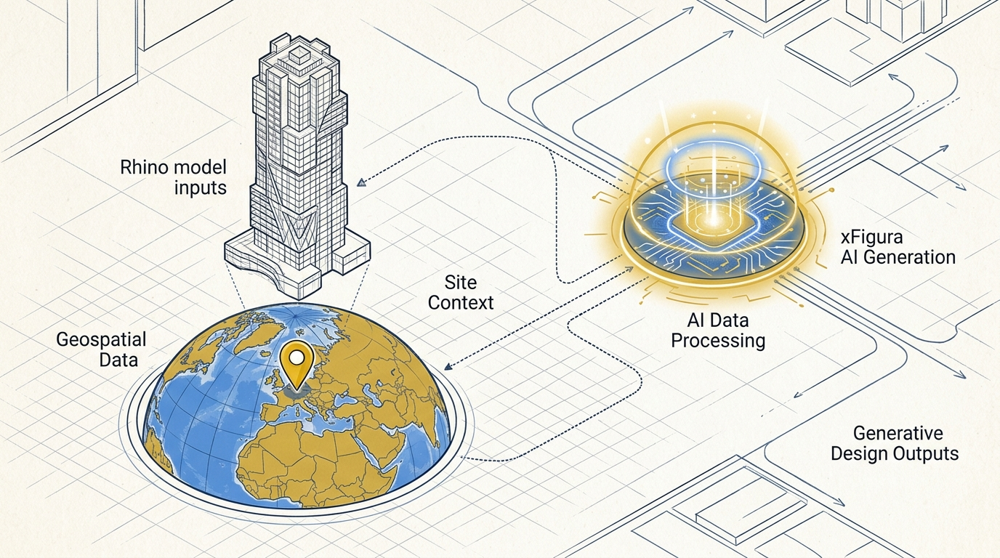
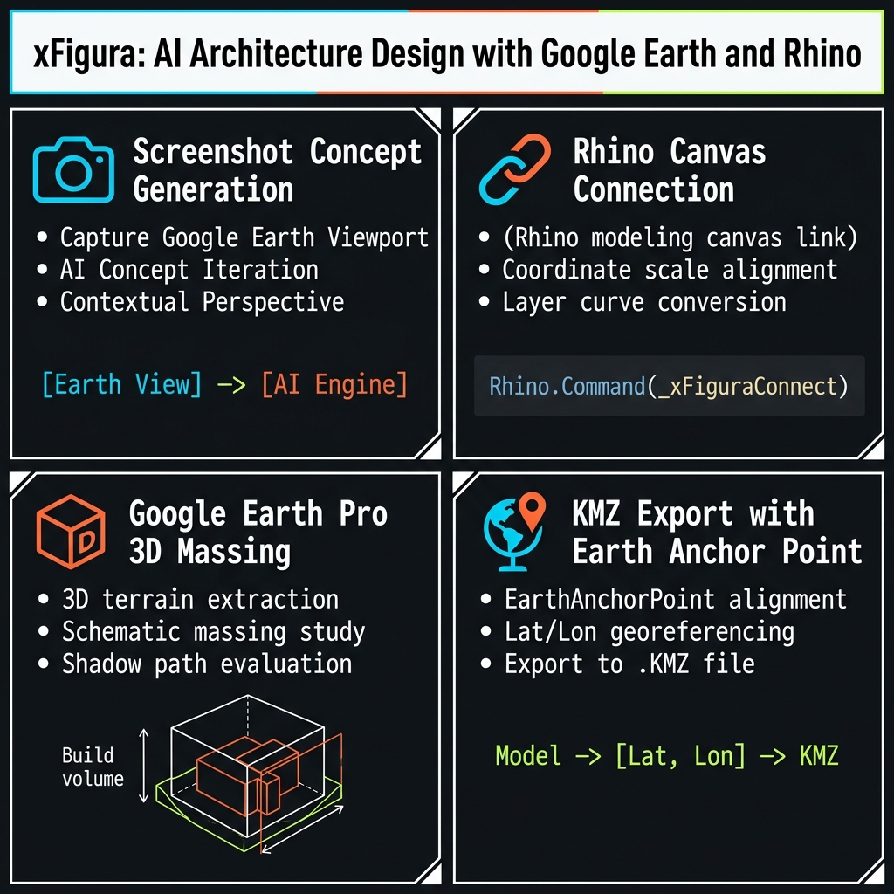
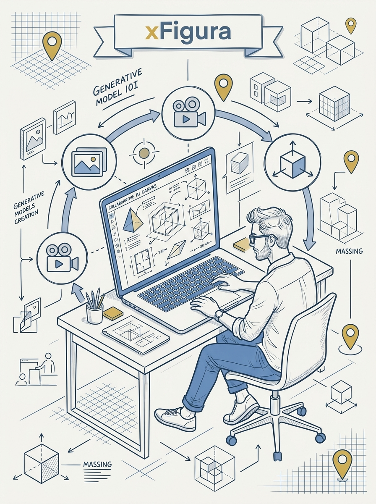

<!-- _class: title -->

# xFigura: AI Architecture Design with Google Earth + Rhino

4 workflows to place real buildings in real sites — from screenshot concepts to KMZ-anchored cinematic renders

<!-- Speaker: xFigura is an AI canvas for architects. Today: 4 workflows that connect it to Google Earth and Rhino so designs land in real-world context, not a vacuum. -->

---

<!-- _class: cheatsheet -->
<!-- _backgroundColor: #f8f7f4 -->

<!-- Speaker: 60-second orientation — 4 workflow panels, point at each before diving in. -->

---

## Context Beats Concept: Why Site-Grounded AI Rendering Wins

A great-looking tower in a vacuum tells a client nothing about how it actually sits in their neighborhood.

<svg viewBox="0 0 700 320" width="100%" xmlns="http://www.w3.org/2000/svg">
  <rect x="20" y="20" width="660" height="280" rx="14" fill="var(--paper)" stroke="var(--soft-2)" stroke-width="1.5" style="filter:drop-shadow(0 4px 12px rgba(15,23,42,.08))"/>
  <rect x="20" y="20" width="6" height="280" rx="3" fill="var(--accent)"/>
  <circle cx="90" cy="90" r="26" fill="var(--accent)" opacity=".12"/>
  <circle cx="90" cy="90" r="18" fill="var(--accent)"/>
  <text x="90" y="95" font-size="13" fill="var(--paper)" text-anchor="middle" dominant-baseline="central" font-family="system-ui" font-weight="700">1</text>
  <text x="130" y="80" font-size="14" font-weight="700" fill="var(--ink)" font-family="system-ui">Concept without site</text>
  <text x="130" y="100" font-size="12" fill="var(--ink-dim)" font-family="system-ui">Polished, tells nobody how it fits</text>
  <circle cx="90" cy="170" r="26" fill="var(--gold)" opacity=".14"/>
  <circle cx="90" cy="170" r="18" fill="var(--gold)"/>
  <text x="90" y="175" font-size="13" fill="var(--paper)" text-anchor="middle" dominant-baseline="central" font-family="system-ui" font-weight="700">2</text>
  <text x="130" y="160" font-size="14" font-weight="700" fill="var(--ink)" font-family="system-ui">Site-grounded generation</text>
  <text x="130" y="180" font-size="12" fill="var(--ink-dim)" font-family="system-ui">Real scale, light, neighbors</text>
  <circle cx="90" cy="240" r="5" fill="var(--muted)"/>
  <text x="130" y="245" font-size="11" fill="var(--muted)" font-family="system-ui">George Guida (ex Foster + Partners,</text>
  <text x="130" y="260" font-size="11" fill="var(--muted)" font-family="system-ui">Harvard); launched late 2025</text>
</svg>

<b>★ Takeaway:</b> xFigura's edge is bridging real-world geodata (Google Earth) and real modeling tools (Rhino/Speckle) with generative AI.

<!-- Speaker: Quick founder/product context, then move straight into the 4 workflows. -->

---

## Workflow 1: Screenshot Concept — Site Context in Minutes

The fastest way to test an idea against a real site — rough and ready, iterate fast.

<svg viewBox="0 0 1100 340" width="100%" xmlns="http://www.w3.org/2000/svg">
  <defs>
    <marker id="arrow1" viewBox="0 0 10 10" refX="8" refY="5" markerWidth="7" markerHeight="7" orient="auto-start-reverse">
      <path d="M0 0L10 5L0 10z" fill="var(--muted)"/>
    </marker>
  </defs>
  <g font-family="system-ui">
    <rect x="30" y="120" width="220" height="100" rx="12" fill="var(--paper)" stroke="var(--soft-2)" stroke-width="1.5"/>
    <text x="140" y="155" font-size="14" font-weight="700" fill="var(--ink)" text-anchor="middle">Generate tower</text>
    <text x="140" y="178" font-size="12" fill="var(--ink-dim)" text-anchor="middle">Text prompt + Nano</text>
    <text x="140" y="196" font-size="12" fill="var(--ink-dim)" text-anchor="middle">Banana Pro model</text>
    <line x1="250" y1="170" x2="300" y2="170" stroke="var(--muted)" stroke-width="2" marker-end="url(#arrow1)"/>
    <rect x="305" y="120" width="220" height="100" rx="12" fill="var(--paper)" stroke="var(--soft-2)" stroke-width="1.5"/>
    <text x="415" y="155" font-size="14" font-weight="700" fill="var(--ink)" text-anchor="middle">Capture site</text>
    <text x="415" y="178" font-size="12" fill="var(--ink-dim)" text-anchor="middle">Google Earth web,</text>
    <text x="415" y="196" font-size="12" fill="var(--ink-dim)" text-anchor="middle">clean mode, screenshot</text>
    <line x1="525" y1="170" x2="575" y2="170" stroke="var(--muted)" stroke-width="2" marker-end="url(#arrow1)"/>
    <rect x="580" y="120" width="220" height="100" rx="12" fill="var(--paper)" stroke="var(--soft-2)" stroke-width="1.5"/>
    <text x="690" y="155" font-size="14" font-weight="700" fill="var(--ink)" text-anchor="middle">Mark site</text>
    <text x="690" y="178" font-size="12" fill="var(--ink-dim)" text-anchor="middle">Built-in editor,</text>
    <text x="690" y="196" font-size="12" fill="var(--ink-dim)" text-anchor="middle">red outline</text>
    <line x1="800" y1="170" x2="850" y2="170" stroke="var(--accent)" stroke-width="2" marker-end="url(#arrow1)"/>
    <rect x="855" y="110" width="215" height="120" rx="12" fill="var(--accent)" opacity=".08" stroke="var(--accent)" stroke-width="2"/>
    <text x="962" y="150" font-size="14" font-weight="700" fill="var(--accent)" text-anchor="middle">Combine node</text>
    <text x="962" y="173" font-size="12" fill="var(--ink)" text-anchor="middle">wide aspect ratio,</text>
    <text x="962" y="191" font-size="12" fill="var(--ink)" text-anchor="middle">prompt: fit + match</text>
    <text x="962" y="209" font-size="12" fill="var(--ink)" text-anchor="middle">scale/perspective</text>
  </g>
</svg>

<b>★ Takeaway:</b> Start low-res, upscale later; for lighting variants say "keep context and perspective the same, only changing the lighting."

<!-- Speaker: Emphasize this is the quick-iteration workflow — rough by design. -->

---

## Workflow 2: Connect Rhino Directly to the Canvas

Bridges the modeling tool architects already use with real-time AI context generation.

<svg viewBox="0 0 1100 340" width="100%" xmlns="http://www.w3.org/2000/svg">
  <defs>
    <marker id="arrow2" viewBox="0 0 10 10" refX="8" refY="5" markerWidth="7" markerHeight="7" orient="auto-start-reverse">
      <path d="M0 0L10 5L0 10z" fill="var(--muted)"/>
    </marker>
  </defs>
  <g font-family="system-ui">
    <rect x="30" y="120" width="230" height="100" rx="12" fill="var(--paper)" stroke="var(--soft-2)" stroke-width="1.5"/>
    <text x="145" y="150" font-size="14" font-weight="700" fill="var(--ink)" text-anchor="middle">Install plugin</text>
    <text x="145" y="173" font-size="12" fill="var(--ink-dim)" text-anchor="middle">Tools &gt; Package Manager</text>
    <text x="145" y="191" font-size="12" fill="var(--ink-dim)" text-anchor="middle">search "xfigure"</text>
    <line x1="260" y1="170" x2="310" y2="170" stroke="var(--muted)" stroke-width="2" marker-end="url(#arrow2)"/>
    <rect x="315" y="120" width="230" height="100" rx="12" fill="var(--paper)" stroke="var(--soft-2)" stroke-width="1.5"/>
    <text x="430" y="150" font-size="14" font-weight="700" fill="var(--ink)" text-anchor="middle">Launch in viewport</text>
    <text x="430" y="173" font-size="12" fill="var(--ink-dim)" text-anchor="middle">render mode,</text>
    <text x="430" y="191" font-size="12" fill="var(--ink-dim)" text-anchor="middle">type `xfigure`</text>
    <line x1="545" y1="170" x2="595" y2="170" stroke="var(--muted)" stroke-width="2" marker-end="url(#arrow2)"/>
    <rect x="600" y="120" width="230" height="100" rx="12" fill="var(--paper)" stroke="var(--soft-2)" stroke-width="1.5"/>
    <text x="715" y="150" font-size="14" font-weight="700" fill="var(--ink)" text-anchor="middle">Screenshot button</text>
    <text x="715" y="173" font-size="12" fill="var(--ink-dim)" text-anchor="middle">viewport syncs</text>
    <text x="715" y="191" font-size="12" fill="var(--ink-dim)" text-anchor="middle">straight to canvas</text>
    <line x1="830" y1="170" x2="880" y2="170" stroke="var(--accent)" stroke-width="2" marker-end="url(#arrow2)"/>
    <rect x="885" y="110" width="185" height="120" rx="12" fill="var(--accent)" opacity=".08" stroke="var(--accent)" stroke-width="2"/>
    <text x="977" y="150" font-size="14" font-weight="700" fill="var(--accent)" text-anchor="middle">Scale-match</text>
    <text x="977" y="173" font-size="12" fill="var(--ink)" text-anchor="middle">circle a reference</text>
    <text x="977" y="191" font-size="12" fill="var(--ink)" text-anchor="middle">building in red</text>
  </g>
</svg>

<b>★ Takeaway:</b> Always set the aspect ratio explicitly — otherwise the output defaults to the first image's ratio. Qwen Edit model gives angle/rotation control without new imports.

<!-- Speaker: This is the workflow for teams whose whole process already lives in Rhino. -->

---

## Workflow 3: Google Earth Pro 3D Massing for Facade Renders

Desktop Google Earth Pro gives precise geometric massing that AI can dress with real facades.

<svg viewBox="0 0 1100 340" width="100%" xmlns="http://www.w3.org/2000/svg">
  <defs>
    <marker id="arrow3" viewBox="0 0 10 10" refX="8" refY="5" markerWidth="7" markerHeight="7" orient="auto-start-reverse">
      <path d="M0 0L10 5L0 10z" fill="var(--muted)"/>
    </marker>
  </defs>
  <g font-family="system-ui">
    <rect x="30" y="120" width="230" height="100" rx="12" fill="var(--paper)" stroke="var(--soft-2)" stroke-width="1.5"/>
    <text x="145" y="150" font-size="14" font-weight="700" fill="var(--ink)" text-anchor="middle">Draw polygon</text>
    <text x="145" y="173" font-size="12" fill="var(--ink-dim)" text-anchor="middle">Google Earth Pro,</text>
    <text x="145" y="191" font-size="12" fill="var(--ink-dim)" text-anchor="middle">Add Polygon tool</text>
    <line x1="260" y1="170" x2="310" y2="170" stroke="var(--muted)" stroke-width="2" marker-end="url(#arrow3)"/>
    <rect x="315" y="120" width="230" height="100" rx="12" fill="var(--paper)" stroke="var(--soft-2)" stroke-width="1.5"/>
    <text x="430" y="150" font-size="14" font-weight="700" fill="var(--ink)" text-anchor="middle">Add volume</text>
    <text x="430" y="173" font-size="12" fill="var(--ink-dim)" text-anchor="middle">Altitude tab,</text>
    <text x="430" y="191" font-size="12" fill="var(--ink-dim)" text-anchor="middle">"extend sides to ground"</text>
    <line x1="545" y1="170" x2="595" y2="170" stroke="var(--muted)" stroke-width="2" marker-end="url(#arrow3)"/>
    <rect x="600" y="120" width="230" height="100" rx="12" fill="var(--paper)" stroke="var(--soft-2)" stroke-width="1.5"/>
    <text x="715" y="150" font-size="14" font-weight="700" fill="var(--ink)" text-anchor="middle">Upload references</text>
    <text x="715" y="173" font-size="12" fill="var(--ink-dim)" text-anchor="middle">facade + landscape</text>
    <text x="715" y="191" font-size="12" fill="var(--ink-dim)" text-anchor="middle">image loaders</text>
    <line x1="830" y1="170" x2="880" y2="170" stroke="var(--accent)" stroke-width="2" marker-end="url(#arrow3)"/>
    <rect x="885" y="110" width="185" height="120" rx="12" fill="var(--accent)" opacity=".08" stroke="var(--accent)" stroke-width="2"/>
    <text x="977" y="150" font-size="14" font-weight="700" fill="var(--accent)" text-anchor="middle">Combine + render</text>
    <text x="977" y="173" font-size="12" fill="var(--ink)" text-anchor="middle">detailed prompt on</text>
    <text x="977" y="191" font-size="12" fill="var(--ink)" text-anchor="middle">how each image maps</text>
  </g>
</svg>

<b>★ Takeaway:</b> Long, explicit prompts matter here — the AI must know which reference maps to facade vs. landscaping. Multi-image batches may drift off-angle; hand-pick the correct one.

<!-- Speaker: This is the precision workflow — desktop Pro app, not the web version. -->

---

## Workflow 4: KMZ Export with Earth Anchor Point

Anchors the full Rhino model to exact real-world coordinates, then drives a cinematic animation.

<svg viewBox="0 0 1100 340" width="100%" xmlns="http://www.w3.org/2000/svg">
  <defs>
    <marker id="arrow4" viewBox="0 0 10 10" refX="8" refY="5" markerWidth="7" markerHeight="7" orient="auto-start-reverse">
      <path d="M0 0L10 5L0 10z" fill="var(--muted)"/>
    </marker>
  </defs>
  <g font-family="system-ui">
    <rect x="20" y="120" width="200" height="100" rx="12" fill="var(--paper)" stroke="var(--soft-2)" stroke-width="1.5"/>
    <text x="120" y="150" font-size="13" font-weight="700" fill="var(--ink)" text-anchor="middle">Get coordinates</text>
    <text x="120" y="173" font-size="11" fill="var(--ink-dim)" text-anchor="middle">Earth Pro pin icon</text>
    <text x="120" y="191" font-size="11" fill="var(--ink-dim)" text-anchor="middle">lat / lon</text>
    <line x1="220" y1="170" x2="265" y2="170" stroke="var(--muted)" stroke-width="2" marker-end="url(#arrow4)"/>
    <rect x="270" y="120" width="200" height="100" rx="12" fill="var(--paper)" stroke="var(--soft-2)" stroke-width="1.5"/>
    <text x="370" y="150" font-size="13" font-weight="700" fill="var(--ink)" text-anchor="middle">Anchor in Rhino</text>
    <text x="370" y="173" font-size="11" fill="var(--ink-dim)" text-anchor="middle">`EarthAnchorPoint`</text>
    <text x="370" y="191" font-size="11" fill="var(--ink-dim)" text-anchor="middle">base point + north</text>
    <line x1="470" y1="170" x2="515" y2="170" stroke="var(--muted)" stroke-width="2" marker-end="url(#arrow4)"/>
    <rect x="520" y="120" width="200" height="100" rx="12" fill="var(--paper)" stroke="var(--soft-2)" stroke-width="1.5"/>
    <text x="620" y="150" font-size="13" font-weight="700" fill="var(--ink)" text-anchor="middle">Export KMZ</text>
    <text x="620" y="173" font-size="11" fill="var(--ink-dim)" text-anchor="middle">render mode,</text>
    <text x="620" y="191" font-size="11" fill="var(--ink-dim)" text-anchor="middle">Google Earth format</text>
    <line x1="720" y1="170" x2="765" y2="170" stroke="var(--muted)" stroke-width="2" marker-end="url(#arrow4)"/>
    <rect x="770" y="120" width="150" height="100" rx="12" fill="var(--paper)" stroke="var(--soft-2)" stroke-width="1.5"/>
    <text x="845" y="150" font-size="13" font-weight="700" fill="var(--ink)" text-anchor="middle">Reopen + shot</text>
    <text x="845" y="173" font-size="11" fill="var(--ink-dim)" text-anchor="middle">exact placement,</text>
    <text x="845" y="191" font-size="11" fill="var(--ink-dim)" text-anchor="middle">screenshot</text>
    <line x1="920" y1="170" x2="960" y2="170" stroke="var(--accent)" stroke-width="2" marker-end="url(#arrow4)"/>
    <rect x="965" y="110" width="115" height="120" rx="12" fill="var(--accent)" opacity=".08" stroke="var(--accent)" stroke-width="2"/>
    <text x="1022" y="150" font-size="13" font-weight="700" fill="var(--accent)" text-anchor="middle">Enhance +</text>
    <text x="1022" y="168" font-size="13" font-weight="700" fill="var(--accent)" text-anchor="middle">video node</text>
    <text x="1022" y="191" font-size="11" fill="var(--ink)" text-anchor="middle">Sea Dance model</text>
  </g>
</svg>

<b>★ Takeaway:</b> Shoot the base screenshot at exactly 16:9 to keep the camera angle stable; set Rhino perspective lens to 21mm to match Google Earth's camera.

<!-- Speaker: This is the deliverable-grade workflow — precise placement plus cinematic output. -->

---

## Quick-Start: Which Workflow to Reach For

Pick by how much precision and tooling the task actually needs.

  

    
Fastest

    <h3>Screenshot concept</h3>
    
Google Earth web + text prompt. Minutes per iteration.

  

  

    
Existing model

    <h3>Rhino canvas</h3>
    
Plugin screenshot button, live sync to xFigura.

  

  

    
Precise siting

    <h3>Earth Pro massing</h3>
    
Polygon + altitude, then facade/landscape render.

  

  

    
Deliverable

    <h3>KMZ + anchor</h3>
    
Exact coordinates, render + cinematic animation.

  

<b>★ Takeaway:</b> If aspect ratio or KMZ position looks wrong, check the first-node aspect ratio and the `EarthAnchorPoint` coordinates first — those are the two most common mistakes.

<!-- Speaker: This is the "which door do I walk through" slide — useful as a recap. -->

---

## Caveats: What This Workflow Doesn't Solve

Powerful for concept and pitch work — know where the edges are before promising a client more.

  

    
Cost

    <h3>Paid platform</h3>
    
Academic discount exists, but check current pricing before onboarding a team.

  

  

    
Not deterministic

    <h3>Perspective drift</h3>
    
Multi-image batch generation can return off-angle results — pick manually.

  

  

    
Output grade

    <h3>Concept, not CD</h3>
    
Generative renders are pitch material, not construction documents.

  

<b>★ Takeaway:</b> KML/KMZ files usually carry no true 3D geometry — round-tripping back into Rhino has real geometry-fidelity limits.

<!-- Speaker: Set expectations before the audience assumes this replaces CD production. -->

---

## Key Takeaways

What to remember even if you skip the rest of the deck.

<svg viewBox="0 0 1100 340" width="100%" xmlns="http://www.w3.org/2000/svg">
  <circle cx="550" cy="170" r="160" fill="none" stroke="var(--soft-2)" stroke-width="1.5"/>
  <circle cx="550" cy="170" r="110" fill="none" stroke="var(--accent)" stroke-width="1.5" opacity=".4"/>
  <circle cx="550" cy="170" r="60" fill="var(--accent)" opacity=".1"/>
  <circle cx="550" cy="170" r="60" fill="none" stroke="var(--accent)" stroke-width="2"/>
  <text x="550" y="164" font-size="14" font-weight="700" fill="var(--accent)" text-anchor="middle" font-family="system-ui">EarthAnchor</text>
  <text x="550" y="184" font-size="13" fill="var(--ink)" text-anchor="middle" font-family="system-ui">Point command</text>
  <text x="380" y="100" font-size="13" fill="var(--ink)" font-family="system-ui" text-anchor="middle">4 workflows</text>
  <text x="380" y="120" font-size="12" fill="var(--muted)" font-family="system-ui" text-anchor="middle">screenshot &#8594; KMZ</text>
  <text x="730" y="100" font-size="13" fill="var(--ink)" font-family="system-ui" text-anchor="middle">Aspect ratio</text>
  <text x="730" y="120" font-size="12" fill="var(--muted)" font-family="system-ui" text-anchor="middle">set it explicitly</text>
  <text x="220" y="170" font-size="13" fill="var(--muted)" font-family="system-ui" text-anchor="middle">16:9 shots,</text>
  <text x="220" y="190" font-size="13" fill="var(--muted)" font-family="system-ui" text-anchor="middle">21mm lens</text>
  <text x="880" y="170" font-size="13" fill="var(--muted)" font-family="system-ui" text-anchor="middle">Concept-grade,</text>
  <text x="880" y="190" font-size="13" fill="var(--muted)" font-family="system-ui" text-anchor="middle">not CD-grade</text>
</svg>

<b>★ Takeaway:</b> `EarthAnchorPoint` in Rhino is the single command that makes real-world placement work — get lat/lon and north direction right, and everything downstream (KMZ, render, video) lines up.

<!-- Speaker: Close on the anchor point — it's the technical crux of the whole pipeline. -->
