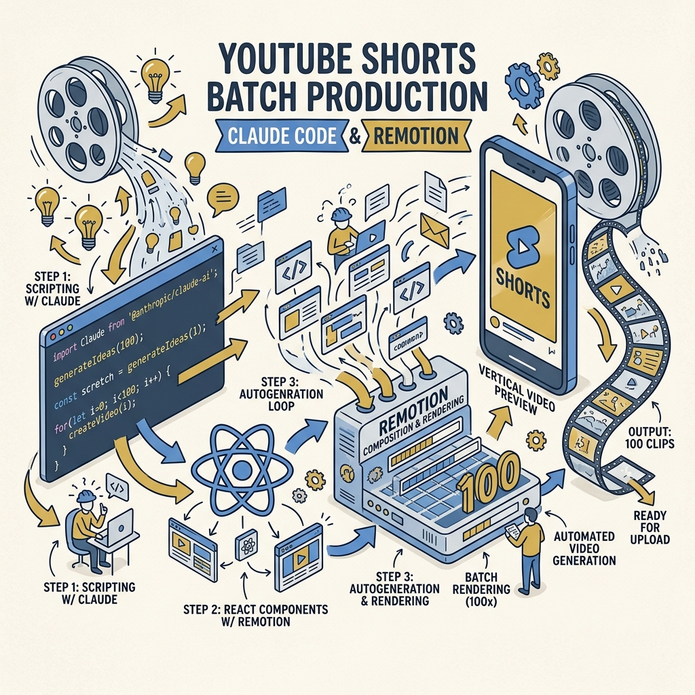
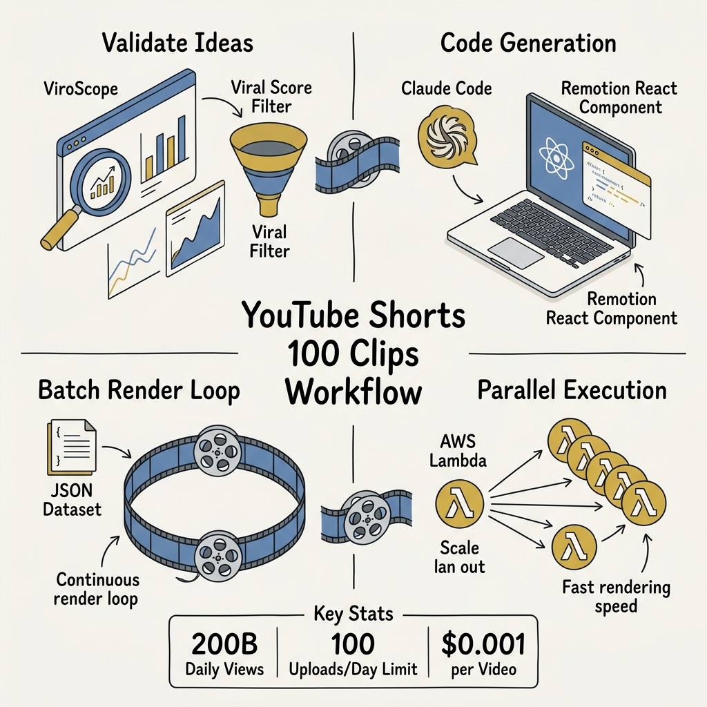
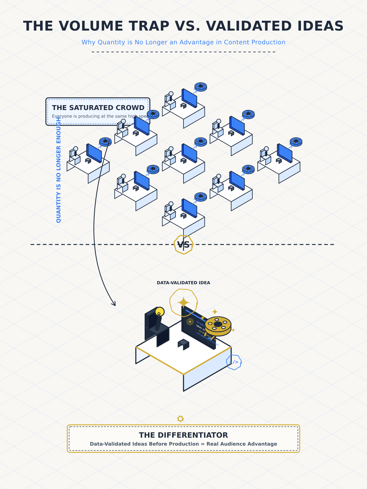
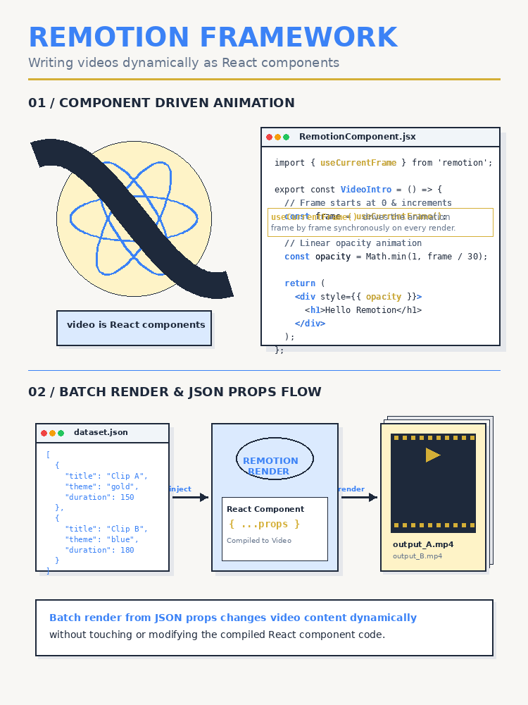

<!-- _class: title -->

# YouTube Shorts 100 คลิป ใน 5 นาที

Claude Code + Remotion + Validate ก่อนผลิต — ระบบผลิตวิดีโอ AI แบบอัตโนมัติ

<!-- Speaker: Hook — ทุกคนผลิตได้เร็ว แต่ใครผลิต "คลิปที่ใช่" ได้ก่อน? -->

---

<!-- _class: cheatsheet -->

<!-- Speaker: 60 วินาที overview ทั้ง workflow — Validate → Build → Batch Render → Scale -->

---

## Quantity ไม่ใช่ความได้เปรียบอีกต่อไป

200B daily views ดึงดูดทุกคน — เมื่อทุกคน AI-produce ได้ สิ่งที่แยกกันคือ upstream

<svg viewBox="0 0 700 300" width="100%" xmlns="http://www.w3.org/2000/svg">
  <rect x="10" y="60" width="300" height="80" rx="10" fill="var(--soft)" stroke="var(--muted)" stroke-width="1.5"/>
  <text x="160" y="95" font-size="14" font-weight="700" fill="var(--ink-dim)" text-anchor="middle" font-family="system-ui">Quantity race</text>
  <text x="160" y="118" font-size="12" fill="var(--muted)" text-anchor="middle" font-family="system-ui">Produce fast, hope something lands</text>
  <rect x="10" y="170" width="300" height="80" rx="10" fill="var(--accent-wash)" stroke="var(--accent)" stroke-width="2"/>
  <text x="160" y="205" font-size="14" font-weight="700" fill="var(--accent-deep)" text-anchor="middle" font-family="system-ui">Data-first strategy</text>
  <text x="160" y="228" font-size="12" fill="var(--accent)" text-anchor="middle" font-family="system-ui">Validate → produce only high-signal ideas</text>
  <line x1="340" y1="150" x2="400" y2="150" stroke="var(--muted)" stroke-width="1.5" stroke-dasharray="4,3"/>
  <rect x="400" y="100" width="280" height="100" rx="10" fill="var(--paper)" stroke="var(--gold)" stroke-width="2"/>
  <text x="540" y="140" font-size="13" font-weight="700" fill="var(--ink)" text-anchor="middle" font-family="system-ui">2025 Reality</text>
  <text x="540" y="160" font-size="12" fill="var(--ink-dim)" text-anchor="middle" font-family="system-ui">200B daily views</text>
  <text x="540" y="178" font-size="12" fill="var(--gold)" text-anchor="middle" font-family="system-ui">77% views under 60s</text>
  <rect x="0" y="0" width="1" height="1" fill="none"/>
</svg>

<b>★ Takeaway:</b> Speed is table stakes. Validate ideas with data before you render a single frame.

<!-- Speaker: เน้น upstream advantage — ไอเดียที่ผ่าน data filter ก่อนผลิต -->

---

## Remotion — Video คือ React Props

เขียน React component ครั้งเดียว เปลี่ยน JSON entry ได้ video ใหม่ทันที

<svg viewBox="0 0 700 300" width="100%" xmlns="http://www.w3.org/2000/svg">
  <rect x="10" y="80" width="160" height="70" rx="8" fill="var(--soft)" stroke="var(--muted)" stroke-width="1.5"/>
  <text x="90" y="111" font-size="13" font-weight="700" fill="var(--ink)" text-anchor="middle" font-family="system-ui">topics.json</text>
  <text x="90" y="130" font-size="11" fill="var(--muted)" text-anchor="middle" font-family="system-ui">{ title, items[] }</text>
  <line x1="170" y1="115" x2="220" y2="115" stroke="var(--accent)" stroke-width="2" marker-end="url(#arr)"/>
  <defs><marker id="arr" markerWidth="8" markerHeight="8" refX="6" refY="3" orient="auto"><path d="M0,0 L0,6 L8,3 z" fill="var(--accent)"/></marker></defs>
  <rect x="220" y="70" width="200" height="90" rx="8" fill="var(--accent-wash)" stroke="var(--accent)" stroke-width="2"/>
  <text x="320" y="105" font-size="13" font-weight="700" fill="var(--accent-deep)" text-anchor="middle" font-family="system-ui">React Component</text>
  <text x="320" y="123" font-size="11" fill="var(--accent)" text-anchor="middle" font-family="system-ui">useCurrentFrame()</text>
  <text x="320" y="141" font-size="11" fill="var(--accent)" text-anchor="middle" font-family="system-ui">useVideoConfig()</text>
  <line x1="420" y1="115" x2="470" y2="115" stroke="var(--accent)" stroke-width="2" marker-end="url(#arr)"/>
  <rect x="470" y="80" width="200" height="70" rx="8" fill="var(--paper)" stroke="var(--gold)" stroke-width="2"/>
  <text x="570" y="111" font-size="13" font-weight="700" fill="var(--ink)" text-anchor="middle" font-family="system-ui">out/short-N.mp4</text>
  <text x="570" y="130" font-size="11" fill="var(--gold)" text-anchor="middle" font-family="system-ui">1080x1920  30fps  30s</text>
  <rect x="0" y="0" width="1" height="1" fill="none"/>
</svg>

<b>★ Takeaway:</b> Video = React props — เปลี่ยน JSON entry ได้ MP4 ใหม่โดยไม่ต้องแตะ component

<!-- Speaker: JSON props คือ key insight — component reuse × dataset size = videos produced -->

---

## Claude Code สร้าง Component จาก Prompt ภาษาธรรมชาติ

ไม่ต้องรู้ Remotion API ทุก detail — Agent Skills ทำให้ generated code ถูกต้องทันที

<svg viewBox="0 0 1100 380" width="100%" xmlns="http://www.w3.org/2000/svg">
  <rect x="20" y="40" width="460" height="280" rx="12" fill="var(--soft)" stroke="var(--muted)" stroke-width="1.5"/>
  <text x="250" y="72" font-size="13" font-weight="700" fill="var(--ink-dim)" text-anchor="middle" font-family="system-ui">Prompt</text>
  <rect x="40" y="85" width="420" height="100" rx="8" fill="var(--paper)" stroke="var(--soft-2)" stroke-width="1"/>
  <text x="250" y="112" font-size="11" fill="var(--ink)" text-anchor="middle" font-family="system-ui">"Create YouTube Shorts component</text>
  <text x="250" y="130" font-size="11" fill="var(--ink)" text-anchor="middle" font-family="system-ui">1080x1920, 30fps, 30s. Reads from</text>
  <text x="250" y="148" font-size="11" fill="var(--ink)" text-anchor="middle" font-family="system-ui">inputProps: { title, items[] }"</text>
  <rect x="40" y="200" width="420" height="50" rx="8" fill="var(--accent-wash)" stroke="var(--accent)" stroke-width="1"/>
  <text x="250" y="221" font-size="11" font-weight="700" fill="var(--accent-deep)" text-anchor="middle" font-family="system-ui">Agent Skills (Remotion context files)</text>
  <text x="250" y="239" font-size="11" fill="var(--accent)" text-anchor="middle" font-family="system-ui">accurate API — no deprecated calls</text>
  <rect x="40" y="265" width="420" height="35" rx="6" fill="var(--gold)" opacity=".15" stroke="var(--gold)" stroke-width="1"/>
  <text x="250" y="287" font-size="11" fill="var(--ink)" text-anchor="middle" font-family="system-ui">npx create-video@latest + npm run dev</text>
  <line x1="490" y1="180" x2="560" y2="180" stroke="var(--accent)" stroke-width="2.5" marker-end="url(#arr2)"/>
  <defs><marker id="arr2" markerWidth="8" markerHeight="8" refX="6" refY="3" orient="auto"><path d="M0,0 L0,6 L8,3 z" fill="var(--accent)"/></marker></defs>
  <rect x="560" y="40" width="500" height="280" rx="12" fill="var(--paper)" stroke="var(--accent)" stroke-width="2"/>
  <text x="810" y="72" font-size="13" font-weight="700" fill="var(--accent-deep)" text-anchor="middle" font-family="system-ui">Generated: YouTubeShort.tsx</text>
  <rect x="580" y="85" width="460" height="220" rx="8" fill="#0f172a"/>
  <text x="600" y="112" font-size="11" fill="#94a3b8" font-family="monospace">const frame = useCurrentFrame();</text>
  <text x="600" y="132" font-size="11" fill="#94a3b8" font-family="monospace">const { fps, durationInFrames } =</text>
  <text x="600" y="152" font-size="11" fill="#94a3b8" font-family="monospace">  useVideoConfig();</text>
  <text x="600" y="180" font-size="11" fill="#3b82f6" font-family="monospace">const progress = spring({</text>
  <text x="600" y="200" font-size="11" fill="#3b82f6" font-family="monospace">  frame, fps, config: { damping: 14 }</text>
  <text x="600" y="220" font-size="11" fill="#3b82f6" font-family="monospace">});</text>
  <text x="600" y="248" font-size="11" fill="#d4af37" font-family="monospace">// Reads title + items from props</text>
  <text x="600" y="268" font-size="11" fill="#94a3b8" font-family="monospace">const { title, items } = useCurrentProps</text>
  <rect x="0" y="0" width="1" height="1" fill="none"/>
</svg>

<b>★ Takeaway:</b> Enable Agent Skills at project init — Claude generates working Remotion code on first try

<!-- Speaker: Agent Skills = context injection ทำให้ Claude รู้ API ถูกต้อง ไม่ต้อง debug deprecated calls -->

---

## Batch Render Loop — JSON Dataset ขับเคลื่อนทุกอย่าง

Core pattern: for each entry in dataset → renderMedia(entry) → MP4 ใหม่

<svg viewBox="0 0 1100 360" width="100%" xmlns="http://www.w3.org/2000/svg">
  <rect x="20" y="130" width="160" height="100" rx="10" fill="var(--soft)" stroke="var(--muted)" stroke-width="2"/>
  <text x="100" y="170" font-size="14" font-weight="700" fill="var(--ink)" text-anchor="middle" font-family="system-ui">topics.json</text>
  <text x="100" y="190" font-size="11" fill="var(--muted)" text-anchor="middle" font-family="system-ui">[100 entries]</text>
  <text x="100" y="210" font-size="11" fill="var(--muted)" text-anchor="middle" font-family="system-ui">title + items[]</text>
  <line x1="180" y1="180" x2="240" y2="180" stroke="var(--accent)" stroke-width="2.5" marker-end="url(#a)"/>
  <defs><marker id="a" markerWidth="8" markerHeight="8" refX="6" refY="3" orient="auto"><path d="M0,0 L0,6 L8,3 z" fill="var(--accent)"/></marker></defs>
  <rect x="240" y="80" width="200" height="200" rx="10" fill="var(--accent-wash)" stroke="var(--accent)" stroke-width="2"/>
  <text x="340" y="120" font-size="13" font-weight="700" fill="var(--accent-deep)" text-anchor="middle" font-family="system-ui">render.mjs</text>
  <text x="340" y="145" font-size="11" fill="var(--accent)" text-anchor="middle" font-family="system-ui">bundle(entryPoint)</text>
  <text x="340" y="163" font-size="11" fill="var(--accent)" text-anchor="middle" font-family="system-ui">selectComposition()</text>
  <text x="340" y="181" font-size="11" fill="var(--accent-deep)" text-anchor="middle" font-family="system-ui">for entry of dataset:</text>
  <text x="340" y="199" font-size="11" fill="var(--accent-deep)" text-anchor="middle" font-family="system-ui">renderMedia(entry)</text>
  <text x="340" y="223" font-size="11" fill="var(--muted)" text-anchor="middle" font-family="system-ui">codec: h264</text>
  <text x="340" y="241" font-size="11" fill="var(--muted)" text-anchor="middle" font-family="system-ui">out/short-N.mp4</text>
  <line x1="440" y1="180" x2="500" y2="180" stroke="var(--accent)" stroke-width="2.5" marker-end="url(#a)"/>
  <rect x="500" y="70" width="180" height="220" rx="10" fill="var(--paper)" stroke="var(--soft-2)" stroke-width="1.5"/>
  <text x="590" y="110" font-size="13" font-weight="700" fill="var(--ink)" text-anchor="middle" font-family="system-ui">out/</text>
  <text x="590" y="135" font-size="11" fill="var(--muted)" text-anchor="middle" font-family="system-ui">short-1.mp4</text>
  <text x="590" y="155" font-size="11" fill="var(--muted)" text-anchor="middle" font-family="system-ui">short-2.mp4</text>
  <text x="590" y="175" font-size="11" fill="var(--muted)" text-anchor="middle" font-family="system-ui">...</text>
  <text x="590" y="195" font-size="11" fill="var(--gold)" font-weight="700" text-anchor="middle" font-family="system-ui">short-100.mp4</text>
  <line x1="690" y1="100" x2="750" y2="80" stroke="var(--muted)" stroke-width="1.5" stroke-dasharray="4,3"/>
  <rect x="750" y="40" width="300" height="90" rx="10" fill="var(--soft-2)" stroke="var(--muted)" stroke-width="1.5"/>
  <text x="900" y="72" font-size="12" font-weight="700" fill="var(--ink)" text-anchor="middle" font-family="system-ui">Local: ~1-3 min/video</text>
  <text x="900" y="92" font-size="11" fill="var(--muted)" text-anchor="middle" font-family="system-ui">100 clips = hours on single machine</text>
  <text x="900" y="112" font-size="11" fill="var(--muted)" text-anchor="middle" font-family="system-ui">CPU maxed per render</text>
  <line x1="690" y1="260" x2="750" y2="280" stroke="var(--muted)" stroke-width="1.5" stroke-dasharray="4,3"/>
  <rect x="750" y="240" width="300" height="90" rx="10" fill="var(--accent-wash)" stroke="var(--accent)" stroke-width="2"/>
  <text x="900" y="272" font-size="12" font-weight="700" fill="var(--accent-deep)" text-anchor="middle" font-family="system-ui">Lambda: parallel cloud render</text>
  <text x="900" y="292" font-size="11" fill="var(--accent)" text-anchor="middle" font-family="system-ui">$0.0003-0.001 per video</text>
  <text x="900" y="312" font-size="11" fill="var(--gold)" text-anchor="middle" font-family="system-ui">100 clips in minutes</text>
  <rect x="0" y="0" width="1" height="1" fill="none"/>
</svg>

<b>★ Takeaway:</b> Local render = sequential hours. Lambda = parallel minutes. Choose by volume.

<!-- Speaker: ชี้ที่ for-loop — นี่คือ batch render core; Lambda ทำ parallel สิ่งเดียวกัน แต่เร็วกว่า ~50x -->

---

## ViroScope AI — Validate ไอเดียก่อนผลิต

Viral score จาก real-time YouTube data — render เฉพาะไอเดียที่ data บอกว่ามีโอกาส

<svg viewBox="0 0 1100 380" width="100%" xmlns="http://www.w3.org/2000/svg">
  <rect x="20" y="80" width="180" height="220" rx="10" fill="var(--soft)" stroke="var(--muted)" stroke-width="1.5"/>
  <text x="110" y="115" font-size="13" font-weight="700" fill="var(--ink-dim)" text-anchor="middle" font-family="system-ui">100 Ideas</text>
  <text x="110" y="140" font-size="11" fill="var(--muted)" text-anchor="middle" font-family="system-ui">spreadsheet</text>
  <rect x="40" y="155" width="120" height="20" rx="4" fill="var(--soft-2)"/>
  <rect x="40" y="183" width="120" height="20" rx="4" fill="var(--soft-2)"/>
  <rect x="40" y="211" width="120" height="20" rx="4" fill="var(--soft-2)"/>
  <text x="100" y="249" font-size="11" fill="var(--muted)" text-anchor="middle" font-family="system-ui">...</text>
  <line x1="200" y1="190" x2="260" y2="190" stroke="var(--accent)" stroke-width="2.5" marker-end="url(#av)"/>
  <defs><marker id="av" markerWidth="8" markerHeight="8" refX="6" refY="3" orient="auto"><path d="M0,0 L0,6 L8,3 z" fill="var(--accent)"/></marker></defs>
  <rect x="260" y="70" width="220" height="240" rx="12" fill="var(--accent-wash)" stroke="var(--accent)" stroke-width="2"/>
  <text x="370" y="110" font-size="13" font-weight="700" fill="var(--accent-deep)" text-anchor="middle" font-family="system-ui">ViroScope AI</text>
  <text x="370" y="132" font-size="11" fill="var(--accent)" text-anchor="middle" font-family="system-ui">Real-time YouTube scan</text>
  <text x="370" y="155" font-size="11" fill="var(--accent)" text-anchor="middle" font-family="system-ui">Viral score per idea</text>
  <rect x="280" y="170" width="180" height="30" rx="6" fill="var(--paper)"/>
  <rect x="280" y="170" width="144" height="30" rx="6" fill="var(--success)"/>
  <text x="370" y="191" font-size="11" fill="white" font-weight="700" text-anchor="middle" font-family="system-ui">Score: 80%</text>
  <rect x="280" y="212" width="180" height="30" rx="6" fill="var(--paper)"/>
  <rect x="280" y="212" width="90" height="30" rx="6" fill="var(--warning)"/>
  <text x="370" y="233" font-size="11" fill="white" font-weight="700" text-anchor="middle" font-family="system-ui">Score: 50%</text>
  <rect x="280" y="254" width="180" height="30" rx="6" fill="var(--paper)"/>
  <rect x="280" y="254" width="36" height="30" rx="6" fill="var(--danger)"/>
  <text x="370" y="275" font-size="11" fill="var(--ink)" font-weight="700" text-anchor="middle" font-family="system-ui">Score: 20%</text>
  <line x1="480" y1="190" x2="540" y2="190" stroke="var(--accent)" stroke-width="2.5" marker-end="url(#av)"/>
  <rect x="540" y="90" width="200" height="80" rx="10" fill="var(--paper)" stroke="var(--gold)" stroke-width="2"/>
  <text x="640" y="122" font-size="13" font-weight="700" fill="var(--ink)" text-anchor="middle" font-family="system-ui">Top 20-30%</text>
  <text x="640" y="143" font-size="11" fill="var(--gold)" text-anchor="middle" font-family="system-ui">curated JSON dataset</text>
  <text x="640" y="161" font-size="11" fill="var(--muted)" text-anchor="middle" font-family="system-ui">20-30 high-signal ideas</text>
  <line x1="740" y1="130" x2="800" y2="130" stroke="var(--accent)" stroke-width="2.5" marker-end="url(#av)"/>
  <rect x="800" y="80" width="260" height="140" rx="10" fill="var(--paper)" stroke="var(--accent)" stroke-width="2"/>
  <text x="930" y="120" font-size="13" font-weight="700" fill="var(--accent-deep)" text-anchor="middle" font-family="system-ui">Batch Render</text>
  <text x="930" y="142" font-size="11" fill="var(--muted)" text-anchor="middle" font-family="system-ui">Only validated ideas</text>
  <text x="930" y="162" font-size="11" fill="var(--accent)" text-anchor="middle" font-family="system-ui">node render.mjs</text>
  <text x="930" y="196" font-size="11" fill="var(--gold)" font-weight="700" text-anchor="middle" font-family="system-ui">ROI-efficient production</text>
  <rect x="0" y="0" width="1" height="1" fill="none"/>
</svg>

<b>★ Takeaway:</b> Render only what data says will land — don't produce first and hope.

<!-- Speaker: ViroScope เป็น signal ไม่ใช่ oracle — ใช้เป็น filter ไม่ใช่ guarantee -->

---

## 7 ขั้นตอน: จาก Zero ถึง 100 คลิป

Validate → Build → Preview → Dataset → Render → Upload (automated optional)

<svg viewBox="0 0 1100 300" width="100%" xmlns="http://www.w3.org/2000/svg">
  <defs><marker id="as" markerWidth="7" markerHeight="7" refX="5" refY="3" orient="auto"><path d="M0,0 L0,6 L7,3 z" fill="var(--accent)"/></marker></defs>
  <g transform="translate(20,60)">
    <circle cx="70" cy="90" r="36" fill="var(--accent-wash)" stroke="var(--accent)" stroke-width="2"/>
    <text x="70" y="84" font-size="18" font-weight="800" fill="var(--accent)" text-anchor="middle" font-family="system-ui">1</text>
    <text x="70" y="105" font-size="10" fill="var(--accent-deep)" text-anchor="middle" font-family="system-ui">Validate</text>
    <text x="70" y="120" font-size="9" fill="var(--muted)" text-anchor="middle" font-family="system-ui">ViroScope</text>
  </g>
  <line x1="126" y1="150" x2="158" y2="150" stroke="var(--accent)" stroke-width="1.5" marker-end="url(#as)"/>
  <g transform="translate(158,60)">
    <circle cx="70" cy="90" r="36" fill="var(--soft)" stroke="var(--muted)" stroke-width="1.5"/>
    <text x="70" y="84" font-size="18" font-weight="800" fill="var(--ink)" text-anchor="middle" font-family="system-ui">2</text>
    <text x="70" y="105" font-size="10" fill="var(--ink)" text-anchor="middle" font-family="system-ui">Create Project</text>
    <text x="70" y="120" font-size="9" fill="var(--muted)" text-anchor="middle" font-family="system-ui">create-video</text>
  </g>
  <line x1="264" y1="150" x2="296" y2="150" stroke="var(--accent)" stroke-width="1.5" marker-end="url(#as)"/>
  <g transform="translate(296,60)">
    <circle cx="70" cy="90" r="36" fill="var(--soft)" stroke="var(--muted)" stroke-width="1.5"/>
    <text x="70" y="84" font-size="18" font-weight="800" fill="var(--ink)" text-anchor="middle" font-family="system-ui">3</text>
    <text x="70" y="105" font-size="10" fill="var(--ink)" text-anchor="middle" font-family="system-ui">Claude Code</text>
    <text x="70" y="120" font-size="9" fill="var(--muted)" text-anchor="middle" font-family="system-ui">gen component</text>
  </g>
  <line x1="402" y1="150" x2="434" y2="150" stroke="var(--accent)" stroke-width="1.5" marker-end="url(#as)"/>
  <g transform="translate(434,60)">
    <circle cx="70" cy="90" r="36" fill="var(--soft)" stroke="var(--muted)" stroke-width="1.5"/>
    <text x="70" y="84" font-size="18" font-weight="800" fill="var(--ink)" text-anchor="middle" font-family="system-ui">4</text>
    <text x="70" y="105" font-size="10" fill="var(--ink)" text-anchor="middle" font-family="system-ui">Preview Studio</text>
    <text x="70" y="120" font-size="9" fill="var(--muted)" text-anchor="middle" font-family="system-ui">npm run dev</text>
  </g>
  <line x1="540" y1="150" x2="572" y2="150" stroke="var(--accent)" stroke-width="1.5" marker-end="url(#as)"/>
  <g transform="translate(572,60)">
    <circle cx="70" cy="90" r="36" fill="var(--soft)" stroke="var(--muted)" stroke-width="1.5"/>
    <text x="70" y="84" font-size="18" font-weight="800" fill="var(--ink)" text-anchor="middle" font-family="system-ui">5</text>
    <text x="70" y="105" font-size="10" fill="var(--ink)" text-anchor="middle" font-family="system-ui">JSON Dataset</text>
    <text x="70" y="120" font-size="9" fill="var(--muted)" text-anchor="middle" font-family="system-ui">topics.json</text>
  </g>
  <line x1="678" y1="150" x2="710" y2="150" stroke="var(--accent)" stroke-width="1.5" marker-end="url(#as)"/>
  <g transform="translate(710,60)">
    <circle cx="70" cy="90" r="36" fill="var(--accent-wash)" stroke="var(--accent)" stroke-width="2"/>
    <text x="70" y="84" font-size="18" font-weight="800" fill="var(--accent)" text-anchor="middle" font-family="system-ui">6</text>
    <text x="70" y="105" font-size="10" fill="var(--accent-deep)" text-anchor="middle" font-family="system-ui">Batch Render</text>
    <text x="70" y="120" font-size="9" fill="var(--accent)" text-anchor="middle" font-family="system-ui">node render.mjs</text>
  </g>
  <line x1="816" y1="150" x2="848" y2="150" stroke="var(--gold)" stroke-width="1.5" marker-end="url(#ag)"/>
  <defs><marker id="ag" markerWidth="7" markerHeight="7" refX="5" refY="3" orient="auto"><path d="M0,0 L0,6 L7,3 z" fill="var(--gold)"/></marker></defs>
  <g transform="translate(848,60)">
    <circle cx="70" cy="90" r="36" fill="#fefce8" stroke="var(--gold)" stroke-width="2"/>
    <text x="70" y="84" font-size="18" font-weight="800" fill="var(--gold)" text-anchor="middle" font-family="system-ui">7</text>
    <text x="70" y="105" font-size="10" fill="var(--ink)" text-anchor="middle" font-family="system-ui">Upload</text>
    <text x="70" y="120" font-size="9" fill="var(--muted)" text-anchor="middle" font-family="system-ui">YouTube API</text>
  </g>
  <rect x="0" y="0" width="1" height="1" fill="none"/>
</svg>

<b>★ Takeaway:</b> Steps 1 (validate) + 6 (render) are the only non-automatable decisions — everything else is pipeline.

<!-- Speaker: เน้น step 1 และ 6 — ที่เหลือเป็น automation pipeline ทั้งหมด -->

---

## Caveats — ก่อนไปลอง

ข้อจำกัดที่ต้องรู้ก่อน commit ไปกับ stack นี้

Render Speed

<h3>ไม่ใช่ Real-time</h3>

30s video ใช้ 1-3 นาที/คลิปบน local machine. "100 คลิปใน 5 นาที" ต้องใช้ AWS Lambda parallel render

Lambda Cost

<h3>$0.0003–0.001/video</h3>

@remotion/lambda ให้ parallel render — 100 คลิปใช้เงินประมาณ $0.03–$0.10 ขึ้นกับ region + duration

Agent Skills

<h3>Enable ตอน Init</h3>

ถ้าลืม enable ตอน create-video — Claude อาจใช้ deprecated API. แก้: npx remotion add agent-skills

YouTube Quota

<h3>100 uploads/day</h3>

Default quota per channel. Batch render ล่วงหน้าแล้ว schedule ด้วย YouTube Data API v3 ได้

<!-- Speaker: ไม่ใช่ blocker แต่ต้องวางแผน — Lambda cost ถูกมาก quota เป็นเรื่องของ scheduling -->

---

## Key Takeaways

สิ่งที่ต้องจำจากทั้ง deck นี้

<svg viewBox="0 0 1100 340" width="100%" xmlns="http://www.w3.org/2000/svg">
  <circle cx="550" cy="170" r="155" fill="none" stroke="var(--soft-2)" stroke-width="1.5"/>
  <circle cx="550" cy="170" r="105" fill="none" stroke="var(--accent)" stroke-width="1.5" opacity=".4"/>
  <circle cx="550" cy="170" r="58" fill="var(--accent)" opacity=".1"/>
  <circle cx="550" cy="170" r="58" fill="none" stroke="var(--accent)" stroke-width="2"/>
  <text x="550" y="163" font-size="13" font-weight="700" fill="var(--accent)" text-anchor="middle" font-family="system-ui">Validate</text>
  <text x="550" y="181" font-size="12" fill="var(--accent-deep)" text-anchor="middle" font-family="system-ui">before produce</text>
  <text x="380" y="92" font-size="12" fill="var(--ink)" font-family="system-ui" text-anchor="middle">Video = React Props</text>
  <text x="380" y="110" font-size="11" fill="var(--muted)" font-family="system-ui" text-anchor="middle">JSON in, MP4 out</text>
  <text x="730" y="92" font-size="12" fill="var(--ink)" font-family="system-ui" text-anchor="middle">Claude Code</text>
  <text x="730" y="110" font-size="11" fill="var(--muted)" font-family="system-ui" text-anchor="middle">no API expertise needed</text>
  <text x="210" y="175" font-size="12" fill="var(--ink-dim)" font-family="system-ui" text-anchor="middle">Lambda</text>
  <text x="210" y="193" font-size="11" fill="var(--muted)" font-family="system-ui" text-anchor="middle">for real speed</text>
  <text x="895" y="175" font-size="12" fill="var(--ink-dim)" font-family="system-ui" text-anchor="middle">100/day quota</text>
  <text x="895" y="193" font-size="11" fill="var(--muted)" font-family="system-ui" text-anchor="middle">schedule with YT API</text>
  <text x="380" y="250" font-size="12" fill="var(--gold)" font-family="system-ui" text-anchor="middle" font-weight="700">Data-first</text>
  <text x="380" y="268" font-size="11" fill="var(--muted)" font-family="system-ui" text-anchor="middle">is the moat</text>
  <rect x="0" y="0" width="1" height="1" fill="none"/>
</svg>

<b>★ Takeaway:</b> Production speed is commoditized — the moat is upstream: data-validated ideas before you render frame one.

<!-- Speaker: ปิดด้วย core insight — ทุกคน produce ได้เร็วแล้ว moat คือ idea quality upstream -->
